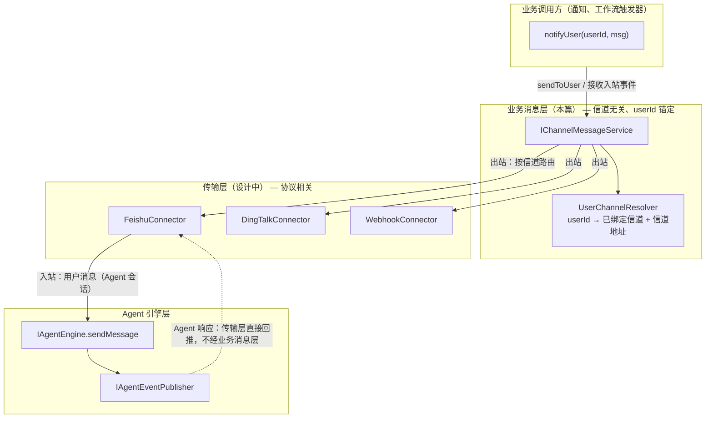
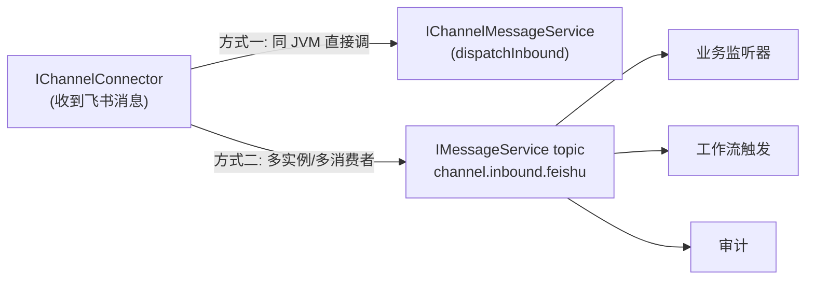
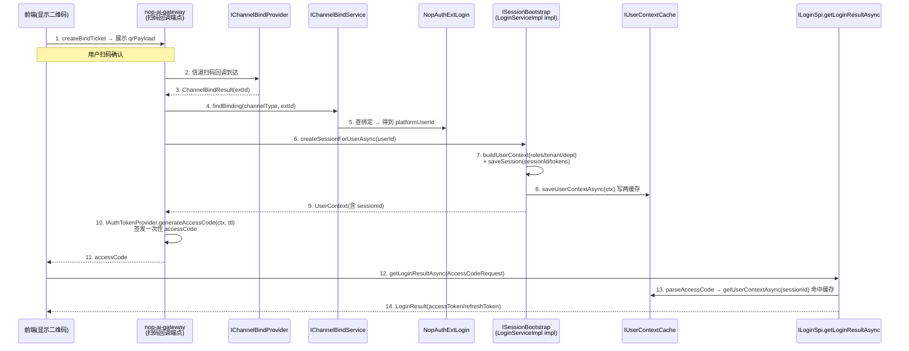

# nop-ai 外部信道业务集成抽象设计

**日期**：2026-08-08
**范围**：跨子系统 — `nop-integration-api` / `nop-integration-feishu`(新) / `nop-auth-api` / `nop-ai-gateway` / `nop-service-framework/nop-biz-auth-core`
**状态**：active

---

## 一、设计结论

1. **三层信道模型**：传输层 `IChannelConnector`（设计中，见 [channel-connector 文档](nop-ai-agent/nop-ai-agent-channel-connector.md)）→ 业务消息层 `IChannelMessageService`（本篇新增）→ 业务调用方。传输层知道"这是飞书"，业务消息层对调用方屏蔽一切信道细节，且**只以平台身份 userId 为锚**。
2. **不复用 `IMessageService` 作为业务消息门面**。`IMessageService` 是 topic 发布/订阅总线（按 topic 寻址、无身份/会话/回复关联、火忘语义），与"给某个用户发消息/收到某用户消息"的业务语义不匹配。但**允许把它作为连接器入站侧的内部解耦骨干**（可选）。
3. **二维码拆成三件事，分属三个抽象**：① 渲染复用已有 `IQrcodeService`；② 扫码绑定协议新增 `IChannelBindProvider`（每信道）+ `IChannelBindService`（业务门面）；③ 扫码登录在绑定之上经一次性的 `accessCode` + `ILoginSpi.getLoginResultAsync(AccessCodeRequest)` 接入既有登录主流程。
4. **绑定记录落 `nop_auth_ext_login`**（已有表，扩展 `loginType` 整型字典即可），不新建表；但**必须为 `(loginType, extId)` 增加唯一索引**以保证扫码登录的 extId→userId 唯一性。扫码绑定是身份问题，绑定门面归 `nop-auth-api`；扫码协议是厂商对接问题，归 `nop-integration-api`。

## 二、背景与动机

已有 [`nop-ai-agent/nop-ai-agent-channel-connector.md`](nop-ai-agent/nop-ai-agent-channel-connector.md) **设计**了 `IChannelConnector`——飞书/钉钉/企微/Webhook 的传输适配器，把外部协议转成 `IAgentEngine.sendMessage()` + 订阅 `IAgentEventPublisher`。注意：`IChannelConnector` 当前尚在设计中，代码未落地（`IAgentEngine`/`IAgentEventPublisher` 则已存在于 `nop-ai-agent`）。它解决的是"如何把一个新信道接进 Agent 引擎"。

但它留下三个缺口，正是本篇要补的：

1. **业务调用方没有纯使用层抽象**。今天要让"系统事件触发后给 alice 推一条消息"，调用方必须知道 alice 绑定了飞书、还得拿到 chat_id——这把传输细节泄漏给了业务代码。我们需要一个"只管用、不管底层"的门面，方法以 userId 为锚。
2. **`IMessageService` 能不能直接拿来用？** 既有 channel-connector 文档 §9 只一句话带过"适配器不用 IMessageService"，没有给出复用 vs 不复用的决策依据，后续会被反复问。
3. **扫码绑定/扫码登录完全没有抽象**。飞书、钉钉、企微、自研 App 都有"扫二维码完成账号绑定或登录"的能力。如果不抽象，每个信道会各自写一套绑定逻辑，绑定记录散落各处。

## 三、核心设计

### 3.1 三层信道模型



**关键边界**：

| 层 | 知道什么 | 不知道什么 | 接口 | 状态 |
|---|---|---|---|---|
| 业务调用方 | userId、消息内容 | 用的是飞书还是钉钉 | `IChannelMessageService` | 本篇新增 |
| 业务消息层 | userId→信道映射、统一消息格式 | 飞书 Protobuf、钉钉 Stream | `IChannelMessageService` + `UserChannelResolver` | 本篇新增 |
| 传输层 | 飞书协议、凭证、重连 | 业务为什么发这条消息 | `IChannelConnector` | 设计中（见 channel-connector 文档） |

**与已有 channel-connector 文档的分工**：那篇定义传输层 `IChannelConnector`；本篇定义它上面的业务消息层 `IChannelMessageService`，并明确两层的契约。两篇合起来是"外部信道集成"的完整设计：它管"接进引擎"，本篇管"业务方怎么用"。

### 3.2 业务消息层 `IChannelMessageService`

这是本篇的核心——"纯使用层面抽象"，方法**只以平台身份 userId 为锚，绝不以信道协议字段（chat_id/open_id）为锚**：

| 方法 | 职责 | 说明 |
|---|---|---|
| `sendToUser(userId, OutboundChannelMessage)` → `SendResult` | 给某用户推一条出站消息 | 由 `UserChannelResolver` 解析到该用户绑定的信道与信道内地址，再交给对应 `IChannelConnector` 发送。返回 `SendResult` 区分 `SENT` / `NO_BINDING` / `UNSUPPORTED`（见下） |
| `subscribeInbound(listener)` | 订阅所有信道的入站消息 | 监听器收到信道无关的 `InboundChannelMessage`（含已解析的 userId、信道类型、文本、附件） |

**统一消息格式**（`ChannelMessage`，字段层面契约，非实现）：

- 出站 `OutboundChannelMessage`：`text`、`markdown`(可选)、`attachments`、`businessRef`(业务关联键)
- 入站 `InboundChannelMessage`：`userId`(已解析绑定则填)、`channelType`、`channelAddress`、`text`、`rawAttachments`、`receivedAt`

**`UserChannelResolver`**：按 userId 查"该用户绑定了哪些信道、每条绑定对应的信道地址"。数据源是 `nop_auth_ext_login`（见 §3.4）。一个用户可绑定多个信道；出站策略默认"取最近活跃的一条"，可由调用方指定 channelType 覆盖。

**未绑定的契约（`SendResult`）**：`sendToUser` 在用户无任何信道绑定时返回 `NO_BINDING`（不抛异常，让调用方决定降级）；目标信道不支持该消息形态（如发附件到不支持文件的信道）返回 `UNSUPPORTED`；成功返回 `SENT`。**跨信道降级（如飞书未绑定则发短信）是 v1 的显式 non-goal**——`ISmsSender`/`IEmailSender` 虽同处 `nop-integration-api`，但降级编排属业务策略，不应内置进消息门面。调用方拿到 `NO_BINDING` 后可自行选择降级信道。

**这一层不负责 Agent 会话闭环**。Agent 会话的响应由传输层 `IChannelConnector` 订阅 `IAgentEventPublisher` 后**直接原路回推**（已有 channel-connector 设计的出站路径），不经过业务消息层。业务消息层只负责两件事：① **主动通知**（`notifyUser`，不触发 Agent 推理）；② **非 Agent 的入站分发**（用户消息触发工作流/审计，而非触发 Agent）。把"推送一条消息"和"触发一次 Agent 推理"分开，避免纯通知无谓启动 Agent。

### 3.3 是否复用 `IMessageService`（决策分析）

`IMessageService`（`nop-api-core/message`）= `sendAsync(topic, message)` + `subscribe(topic, consumer)`，topic 发布/订阅总线。这里要回答**两个不同的问题**：

**问题 A：把 `IMessageService` 当作业务消息门面 `IChannelMessageService` 用？→ 不。**

| 维度 | `IMessageService` 语义 | 业务信道消息需求 | 结论 |
|---|---|---|---|
| 寻址方式 | 按 **topic**（字符串） | 按 **userId**（身份） | 不匹配 |
| 消息形态 | 任意 `Object` payload | 富消息（文本+Markdown+附件+回复关联） | 需专门模型 |
| 回复关联 | 无（火忘/`getAckTopic` 两选） | 需"这是对那条消息的回复" | 不匹配 |
| 语义 | 单向广播/队列 | 双向会话（出站+入站） | 不匹配 |
| 抽象泄漏 | 把 `topic` 概念暴露给业务 | 业务只应知道 userId | 泄漏传输概念 |

复用的唯一好处是"接口已存在"，但代价是把一个身份驱动的会话问题硬塞进 topic 驱动的总线抽象，调用方要自己维护 `userId↔topic` 映射、自己拼富消息 payload——等于在门面之上又造一层门面，得不偿失。

**问题 B：把 `IMessageService` 当作连接器入站侧的内部解耦骨干？→ 可选，看部署规模。**



方式二的好处：入站消息可被多消费者消费（工作流 + 审计 + 业务监听器），且跨实例时可用 Kafka/Pulsar 实现（`nop-message-kafka`/`nop-message-pulsar` 已是 `IMessageService` 实现）。代价是多一跳。**单体部署用方式一，需要水平扩展或多消费者时用方式二**，业务门面接口不变。入站消息是否同时也路由给 Agent 引擎，是部署选择而非分层规则——Agent 会话默认走传输层直连（方式一），仅当需要多消费者分发时才并入骨干。

> 既有 channel-connector 文档说"适配器不用 IMessageService"指的是问题 A（不当门面），与本篇问题 B（当可选骨干）不冲突。本篇把这两件事拆清楚，消除歧义。

### 3.4 扫码绑定 / 扫码登录抽象

二维码在本设计里是**三件不同的事**，必须分开，否则会把"渲染图片"和"完成一次账号绑定"搅在一起：

| 关切 | 已有/新增 | 接口 | 归属模块 |
|---|---|---|---|
| ① 二维码**渲染**（把字符串画成图片） | 已有 | `IQrcodeService.createQrcodeBytes()` | `nop-integration-api`（已存在） |
| ② 扫码**绑定协议**（发券→扫码→信道回调→写绑定） | 新增 | `IChannelBindProvider`（每信道）+ `IChannelBindService`（业务门面） | 协议：`nop-integration-api`；门面：`nop-auth-api` |
| ③ 扫码**登录**（扫码→认证→建会话） | 新增（基于②） | 经一次性 `accessCode` + `ILoginSpi.getLoginResultAsync(AccessCodeRequest)` | `nop-ai-gateway` 编排 + `nop-biz-auth-core` 兑换 |

**扫码绑定协议（②）**——信道无关的券生命周期：

```
createBindTicket(channelType, platformUserId)
   → BindTicket{ ticketId, qrPayload, expiresAt }
   // qrPayload 由对应信道的 IChannelBindProvider 生成
   // （例如飞书用其扫码登录二维码 payload）

[用户在飞书/钉钉端扫码确认]

IChannelBindProvider(对应信道) 收到信道回调
   → completeBinding(ticketId, channelUserId, channelUserInfo)
   → IChannelBindService 写入 nop_auth_ext_login:
       loginType = 对应信道的整数码, extId = channelUserId,
       userId = platformUserId, verified = true
```

| 接口 | 职责 |
|---|---|
| `IChannelBindProvider`（每信道一个，`nop-integration-api`） | `createBindTicket()` 生成信道原生 QR payload；接收信道扫码回调；返回信道侧用户标识 |
| `IChannelBindService`（业务门面，`nop-auth-api`） | `startBinding` / `completeBinding` / `listBindings(userId)` / `unbind(bindingId)`；操作 `NopAuthExtLogin` |
| `IQrcodeService`（已有） | 仅把 `qrPayload` 渲染成图片字节 |

**`IChannelBindProvider` 的命名**：`nop-integration-api` 的既有同类是 `ISmsSender`/`IEmailSender`（动词后缀，单向推送语义）。但扫码绑定是多步有状态协议（发券→扫码→回调→落库），不是单向推送，`…Sender` 语义不合。沿用 `…Provider` 表示"协议提供方"，与传输层 `IChannelConnector`（同样是有状态协议而非推送）一致。

**为什么绑定记录用 `NopAuthExtLogin` 而不新建表？** 该表语义就是"平台 userId ↔ 第三方 extId 的绑定"——`extId` 列注释即"第三方系统中对应的用户唯一标识"，飞书 open_id、钉钉 unionId 都是其实例。只需扩展 `auth/login-type` 字典（当前为整数码 `1`=密码、`10`=单点，见 §六 OQ），不增表。

**唯一性约束（必须的 schema 变更）**：当前 `NopAuthExtLogin` 无 `(loginType, extId)` 唯一键，仅有一条 `user` 关联。扫码登录要求"一个信道 extId 唯一映射到一个平台 userId"，否则两个用户绑定同一飞书 open_id 会让 extId→userId 二义、登录错乱。因此**必须为 `NopAuthExtLogin` 增加 `(loginType, extId)` 唯一索引**。这是本设计显式要求的 schema 变更，不隐藏在"不增迁移"措辞背后。

**约束实现方式裁定（W0 已收口）**：采用**普通唯一约束 + 应用层兜底**（即原"方案 B"），而非条件唯一索引。理由：① MySQL 无原生 partial unique index，条件索引在 MySQL 上需变通（生成列/触发器），三种数据库（MySQL/PostgreSQL/Oracle）无法用统一 DDL 表达；② 本仓库既有 `NopAuthUser.userName` 已确立"普通唯一键 + `useLogicalDelete`"模式（软删行同样受唯一约束约束），本约束与之保持一致，DB 无关；③ 有效绑定条件 `verified=1 AND delFlag=0` 的过滤校验在 `IChannelBindService.completeBinding`（W3）应用层完成，**重绑定时先物理清理或复用旧软删行**（unbind 同一 extId 后重绑，应用层将旧 `delFlag=1` 行物理删除或原地置 `delFlag=0` 复用），避免软删行阻塞重绑定。这条裁定收口了原 Open Question 中的二选一。

**重绑定三情况裁定（W3 已收口）**：`IChannelBindService.completeBinding`（实现在 `ChannelBindServiceImpl`，`nop-auth-service`）显式处理三种 `(loginType, extId)` 已存在的情况，因唯一约束 `UK_NOP_AUTH_EXT_LOGIN_TYPE_EXTID` 不含条件（软删行仍占位）：

| 情况 | 既有行状态 | 裁定 |
|---|---|---|
| (a) 同用户重扫 | 有效行（`verified=1 AND delFlag=0`），`userId`=本次请求用户 | **幂等**：返回既有绑定，不写新行 |
| (b) 同用户 unbind 后重绑 | 软删行（`delFlag=1`），`userId`=本次请求用户 | **物理删除软删行 + 新建**（不复用旧行，保留 createdBy/createTime 审计语义） |
| (c) 跨用户重绑（A unbind 后 B 绑定同 extId） | 软删行（`delFlag=1`），`userId`≠本次请求用户 | **物理删除 A 的软删行 + 为 B 新建**（绝不复用另一用户的行） |

实现要点：查询软删行用 `example.orm_disableLogicalDelete(true)`（`findAllByExample` 对 `useLogicalDelete=true` 实体默认过滤 `delFlag!=0`），物理删除用 `IEntityDao.deleteEntityDirectly`（绕过 session 的逻辑删除处理）。三种情况均有 mock-proxy 单元测试覆盖（`TestChannelBindServiceImpl`），真实 DB 行为留待 W6-2 E2E 验证。

**两步分离式绑定流程（W3 已收口）**：设计文档原描述的单步 `completeBinding(ticketId, channelUserId, channelUserInfo)` 在实现时落为**两步分离**，与传输层/扫码回调端点解耦更彻底：

1. **provider 协议层**（`nop-integration-api`）：`IChannelBindProvider.onChannelScanCallback(ChannelScanCallback) → ChannelBindResult` —— provider 解析厂商回调体，返回 `extId`（信道侧用户标识）+ `platformUserId`（从 ticket 回填）+ `status`（`BINDING_COMPLETED`/`ALREADY_BOUND`/`PENDING_CONFIRM`）。本层只解析协议，不落库。
2. **service 门面层**（`nop-auth-api`/`nop-auth-service`）：`IChannelBindService.completeBinding(channelType, platformUserId, extId) → ChannelBindingInfo` —— 由扫码回调端点（W4-1，落 `nop-ai-gateway`）从上一步的 `ChannelBindResult` 取出 extId/platformUserId 后调用，写 `NopAuthExtLogin`。

这样 `nop-auth-api` 的方法签名**不引用任何 `nop-integration-api` 类型**（接口纯净度：仅依赖 `nop-api-core`），实现 `ChannelBindServiceImpl` 负责两层类型翻译（`BindTicket`→`BindStartResult` 等）。

**扫码登录（③）**——复用既有登录主流程的一次性 `accessCode` 机制（`ILoginService.parseAccessCode` / `ILoginSpi.getLoginResultAsync(AccessCodeRequest)` 已存在）：



控制方向是：扫码回调（在 `nop-ai-gateway`）解析出 userId → 创建 session → 签发一次性 `accessCode` → 前端拿 `accessCode` 调既有 `ILoginSpi.getLoginResultAsync(AccessCodeRequest)` 换取 `LoginResult`。**不改动 `ILoginService` / `ILoginSpi` / `IAuthTokenProvider` / `LoginApiBizModel` 的既有契约**，扫码登录只是"如何得到 accessCode"的一种新来源。新增信道扫码登录只需实现 `IChannelBindProvider`，登录主流程零改动。

**session 创建路径裁定（W4 Phase 0 收口）**：accessCode 消费链 `ILoginService.getUserContextAsync(AuthToken, headers)`（`AbstractLoginService:62-64`）→ `doGetUserContext(sessionId)` → `IUserContextCache.getUserContextAsync(sessionId)`（`AbstractUserContextCache:52-70`）是**按 sessionId 查缓存**：要求 `userContextCache.getAsync(sessionId)` 命中且 `userSessionCache.get(userName)` 等于该 sessionId，两者皆不满足则返回 null → `buildLoginResult(null)` 抛 `ERR_AUTH_SESSION_EXPIRED`。扫码登录场景（用户首次扫码、无预存 session）**必须先创建 session 并写入两缓存**，否则签发的 accessCode 无法被消费。

经代码级 spike 在两条路径中裁定：

- **路径 A（gateway session 编排）——拒绝**。gateway 直接调 `IUserContextCache.saveUserContextAsync` + `IAuthTokenProvider.generateAccessToken/RefreshToken` 创建 session。**致命缺口 (1)**：完整 `UserContextImpl`（roles/tenant/dept）的构建逻辑封装在 `LoginServiceImpl.buildUserContext`（`nop-auth-service`），依赖 `IDaoProvider` + `NopAuthUser`/`NopAuthRole`/`NopAuthDept` 实体（`nop-auth-dao`）；gateway 不依赖 `nop-auth-service`/`nop-auth-dao`，重建该加载逻辑会造成错误方向的依赖与代码复制。若退化为只存最小 context（无 roles/tenant），则 `LoginResult.userInfo` 残缺（无角色/租户），是真实功能缺陷而非 watch-only residual。缓存拓扑（缺口 3）在单体部署下虽共享 `LocalUserContextCache` 实例，但不解决缺口 (1)。
- **路径 B2（auth 层 additive SPI）——选定**。在 `nop-biz-auth-core` 新增公开接口 `ISessionBootstrap.createSessionForUserAsync(userId) → CompletionStage<IUserContext>`，由 `LoginServiceImpl`（`nop-auth-service`）实现，**复用既有 `buildUserContext` + `saveSession` + `saveUserContextAsync`**——产生与凭证登录完全一致的 session（含 roles/tenant/dept/tokens）。
  - **为何用新接口而非给 `ILoginService` 加 additive 方法**：roadmap 完成定义要求"未改 `ILoginService`/`ILoginSpi`/`IAuthTokenProvider` 契约"。新接口使这三个既有接口**字面零修改**（四文件 hash 对比证明），`LoginServiceImpl` 新增 `implements ISessionBootstrap` + 方法体属实现变更（非契约），是最忠实地满足"登录主流程零改动"的方式。`ISessionBootstrap` 是 `nop-biz-auth-core` 的 additive 模块表面（新文件），与 `ILoginSessionStore`/`IUserContextCache` 同级，语义上是"为已认证用户引导 session"（密码登录/扫码/SSO 通用）。
  - **缓存拓扑**：`ISessionBootstrap` 的实现 bean 在生产装配中是 `LoginServiceImpl`（`nop-auth-service`），与消费侧 `LoginApiBizModel`（`nop-auth-service`）同 JVM、同 IoC 容器、同 `LocalUserContextCache` 实例——session 写入对消费侧立即可见。单体部署无需分布式 cache。gateway 仅经 `nop-biz-auth-core` 依赖取 `ISessionBootstrap` 接口，运行时由容器注入 auth-service 的实现 bean。
  - **往返调用链（经代码验证）**：platformUserId → `ISessionBootstrap.createSessionForUserAsync` → `getUserByUserId` → `buildUserContext`（DB 加载 roles/dept/tenant）→ `saveSession`（`loginSessionStore` 生成 sessionId + `IAuthTokenProvider.generateAccessToken/RefreshToken`）→ `IUserContextCache.saveUserContextAsync`（写 `userSessionCache` + `userContextCache`）→ gateway 调 `IAuthTokenProvider.generateAccessCode(ctx, ttl)` 签 JWT（含 userName+sessionId）→ 消费侧 `parseAccessCode` 得 AuthToken(sessionId) → `getUserContextAsync(sessionId)` 命中 `userContextCache` 且 `userSessionCache.get(userName)` 匹配 → 返回完整 UserContext。
  - **gateway 测试拓扑**：gateway 模块测试不引入 `nop-auth-service`（重量级，需 `IDaoProvider`/H2），改用 `ISessionBootstrap` 测试桩（构造 `UserContextImpl` + UUID sessionId + `IAuthTokenProvider` 真实签 token + 写真实 `IUserContextCache`），验证 gateway 编排链 + accessCode 往返（generateAccessCode→parseAccessCode→getUserContextAsync 命中）。真实 `LoginServiceImpl.createSessionForUserAsync` 的 DB 加载行为留待 W6-2 E2E（与 `getLoginResultAsync` 全链验证同期），本 plan 在 Phase 2 显式裁定此降级（裁定 A）。

**roadmap 完成定义诚实修正**：原 W4 关键裁定假设"accessCode 可直接签发消费"，未意识到 session 创建的必要性。经 Phase 0 spike 证实，必须新增 `ISessionBootstrap` SPI 用于 session 引导。但此变更**不破坏 roadmap 的硬性完成定义**——`ILoginService`/`ILoginSpi`/`IAuthTokenProvider` 三既有契约字面零修改（hash 对比证明），`LoginApiBizModel` 零修改，仅新增 `ISessionBootstrap` 接口（additive 模块表面）与 `LoginServiceImpl` 实现方法（实现层）。"登录主流程零改动"在"既有登录方法契约不变"的严格意义上成立。

### 3.5 模块归属与依赖

| 关注点 | 接口 | 归属 | 理由 |
|---|---|---|---|
| 二维码渲染 | `IQrcodeService` | `nop-integration-api` | 已存在 |
| 信道扫码绑定协议 | `IChannelBindProvider` | `nop-integration-api` | 厂商协议抽象，与 `IChannelConnector` 同级；不依赖 AI |
| 飞书绑定协议实现 | `FeishuBindProvider` | `nop-integration-feishu`(新) | 遵循 `nop-integration-<vendor>` 模式 |
| 绑定记录门面 | `IChannelBindService` | `nop-auth-api`，实现在 `nop-auth-service` | 绑定是身份问题，写 `NopAuthExtLogin` |
| 业务消息门面 | `IChannelMessageService` | 接口：`nop-integration-api`；实现：`nop-ai-gateway` | 见下方分析 |
| 扫码回调端点 + accessCode 编排 | （装配代码） | `nop-ai-gateway` | 见下方"装配点"分析 |
| 登录兑换 | `ILoginSpi.getLoginResultAsync` | `nop-service-framework/nop-biz-auth-core` | 已有，零改动 |
| 传输适配器 | `IChannelConnector` | `nop-ai-gateway` | 见 channel-connector 文档（`ChannelConnectorContext` 持 `IAgentEngine`/`IAgentEventPublisher`，这些类型在 `nop-ai-agent`；`nop-ai-gateway` 经核不依赖、也不被 `nop-ai-agent` 依赖，新增 `nop-ai-agent` 依赖无环） |

**`IChannelMessageService` 接口为何放 `nop-integration-api`？** 发一条飞书消息是平台通知能力，不应要求调用方依赖 AI 模块。接口放 `nop-integration-api`（只依赖 `nop-api-core`），任何业务模块都能发信道消息。

**实现为何放 `nop-ai-gateway`？** `nop-ai-gateway` 模块已存在，是天然的装配点——它处于应用层，可以同时依赖 `nop-auth-api`（做身份解析）和 `nop-integration-api`/`nop-integration-feishu`（调信道），而这两个 api 模块都只向下依赖 `nop-api-core`，**不形成环**。把实现放引擎模块 `nop-ai-agent` 会迫使通知调用链依赖 AI 引擎，污染非 AI 调用方。

**扫码回调端点为何放 `nop-ai-gateway` 而非 `nop-biz-auth-core`？** 扫码回调要调 `IChannelBindProvider`（信道协议）+ `IChannelBindService`（写绑定），这两个分别在 `nop-integration-api` 和 `nop-auth-api`。`nop-biz-auth-core` 当前依赖只有 `nop-biz-auth-api`/`nop-core`/`nop-xlang`/`nop-http-api`，**没有** `nop-auth-api` 也没有 `nop-integration-api`——把扫码编排放进去会强行给认证核心 SPI 模块引入集成依赖，方向错误。`nop-ai-gateway` 作为装配点承接这些依赖是干净的（它本就是应用层装配模块）。

**新增的 Maven 依赖边（均无环）**：

```
nop-ai-gateway  ──新增──→  nop-auth-api        (→ nop-api-core)
               ──新增──→  nop-integration-api  (→ nop-api-core)
               ──新增──→  nop-integration-feishu
nop-auth-api    无变化（仍只依赖 nop-api-core）
nop-integration-api  无变化
nop-biz-auth-core     无变化（不引入集成依赖）
```

`nop-integration-feishu`（新模块）依赖 `nop-integration-api`，提供 `FeishuBindProvider` 的飞书 SDK 实现（飞书协议层 `FeishuClient`/`FeishuPbCodec`/`FeishuCredentials` 亦在此模块）。`FeishuConnector`（`IChannelConnector` 实现）落 `nop-ai-gateway`（依赖 `IAgentEngine`/`IChannelSessionStore`，不能下沉到不依赖 AI 的厂商模块）。

## 四、拒绝了什么

| 方案 | 拒绝理由 |
|---|---|
| 用 `IMessageService` 当业务消息门面 | 按 topic 寻址、无身份/会话/富消息语义，硬塞会让调用方自造映射层（§3.3 问题 A） |
| 业务方直接调 `IAgentEngine.sendMessage()` 做通知 | 把"推送一条消息"和"触发一次 Agent 推理"混用，纯通知会无谓启动 Agent（§3.2） |
| 在业务消息门面上暴露 `sendToChannel(channelAddress,...)` | 第一参数即信道协议地址，违反"只以 userId 为锚"的纯使用目标；且与传输层已有的"Agent 响应原路回推"路径重复。已知信道地址的发送一律归传输层 `IChannelConnector` |
| 扫码绑定新建独立表 | `nop_auth_ext_login` 已是"平台 userId↔第三方 extId 绑定"，语义完全吻合，加表是重复建模（§3.4） |
| 把 QR 渲染、绑定协议、登录三者合一成单接口 | 三个关切生命周期不同（渲染无状态/绑定有券状态/登录有会话状态），合一会让 `IQrcodeService` 这种纯函数式接口被迫承载状态 |
| `IChannelMessageService` 接口或实现放 `nop-ai-agent` | 接口放引擎模块会强制通知调用链依赖 AI 引擎；实现放引擎模块同理。应放 `nop-integration-api`(接口) + `nop-ai-gateway`(实现)（§3.5） |
| 把扫码回调编排放 `nop-biz-auth-core` | 会给认证核心 SPI 模块引入 `nop-auth-api`/`nop-integration-api` 依赖，方向错误；应放装配点 `nop-ai-gateway`（§3.5） |
| 在消息门面内置跨信道降级（飞书失败→短信） | 降级是业务策略，内置会让门面依赖 `ISmsSender`/`IEmailSender` 并膨胀；返回 `SendResult.NO_BINDING` 让调用方自行降级 |

## 五、与已有设计/代码的关系

| 文档/代码 | 关系 |
|---|---|
| [`nop-ai-agent/nop-ai-agent-channel-connector.md`](nop-ai-agent/nop-ai-agent-channel-connector.md) | 传输层 `IChannelConnector` 的权威**设计**（接口尚未在代码落地）。本篇在其之上补业务消息层，不修改它 |
| [`nop-ai-agent/01-architecture-baseline.md`](nop-ai-agent/01-architecture-baseline.md) | Agent 引擎层边界。本篇的 `IChannelMessageService` 在 Application/Gateway 层，不进入引擎五层 |
| `IMessageService`（`nop-kernel/nop-api-core`，**已实现**） | 平台消息总线。本篇明确其作为可选内部骨干（§3.3 问题 B），不作业务门面 |
| `IQrcodeService`（`nop-integration-api`，**已实现**） | 二维码渲染，本篇直接复用 |
| `NopAuthExtLogin`（`nop-auth`，**已实现**） | 外部登录绑定表，本篇复用为信道绑定记录，并要求加 `(loginType,extId)` 唯一索引 |
| `ILoginService` / `ILoginSpi`（`nop-service-framework/nop-biz-auth-core`，**已实现**） | 登录主流程与扩展点。扫码登录经其既有 `getLoginResultAsync(AccessCodeRequest)` + `parseAccessCode` 接入，零改动 |

## 六、Open Questions

- [ ] `IChannelMessageService` 出站多绑定用户的信道选择策略默认值（最近活跃 vs 优先级表）——倾向"最近活跃 + 调用方可指定 channelType 覆盖"。
- [ ] 入站消息在多消费者部署下经 `IMessageService` 骨干时，`InboundChannelMessage` 的 topic 命名约定（`channel.inbound.{channelType}` vs 按业务域分）。
- [x] 飞书扫码绑定的 `qrPayload` 是用飞书"扫码登录"二维码还是自建券 + 飞书机器人推送——影响 `FeishuBindProvider` 实现选型。**W5-2 已收口**：选定**飞书扫码登录二维码（Option A — OAuth authorize URL）**。`qrPayload` = 飞书 OAuth 授权 URL（含 `app_id` + `state=ticketId`），无需 bot 推送，绑定流程与消息传输完全解耦。拒绝 Option B（自建券 + 机器人推送）：绑定流程不应依赖 Stream 长连接/bot 推送，引入不必要的运行时依赖。
- [x] `auth/login-type` 字典当前为整数码（`1`=密码、`10`=单点）。需为 feishu/dingtalk/wecom 分配新整数码（建议 `20`+，避开已有）及对应中文 label。**W0 已收口**：`20`=飞书、`21`=钉钉、`22`=企微、`23`=Webhook，权威源 `nop-service-framework/nop-biz-auth-core/src/main/resources/_vfs/dict/auth/login-type.dict.yaml` 已扩展。
- [x] 附件/多媒体：`OutboundChannelMessage.attachments` 如何与传输层 `ChannelCapabilities`（supportsFileUpload 等，见 channel-connector 文档 §8）协商——目标信道不支持时的降级策略（转链接？拒绝？）。**W5-3 已收口**：`supportsFileUpload=false` 时降级为文本链接/提示（附件名 + URL 或"暂不支持文件上传"），不静默丢弃。飞书 v1 `supportsFileUpload=false`，真实文件上传 deferred（设计 §11）。
