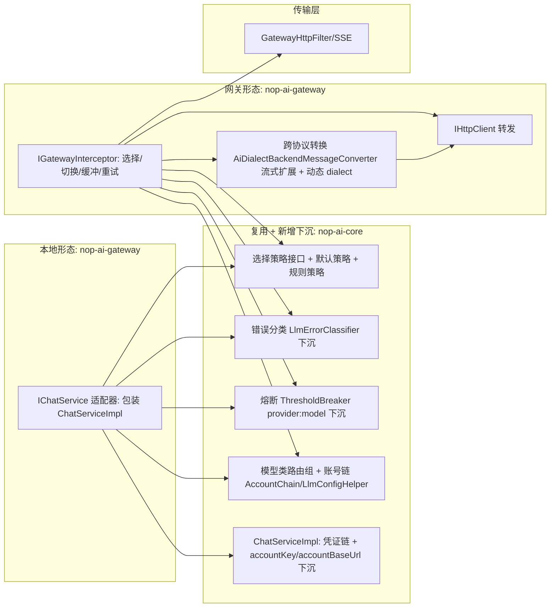

# nop-ai-gateway 透明账号切换（Account Failover）需求规格

**日期**：2026-08-14（更新于 2026-08-14，R1-R8 审查循环 + 需求修订：模型类路由组、动态选择机制、网关能力级不依赖 nop-ai-agent）
**范围**：nop-ai-gateway（网关形态拦截器 + 本地 `IChatService` 适配器 + 流式 failover 缺口 + 账号并发限流 + 模型类路由组 + 动态选择策略）；复用/下沉 nop-ai-core 的 LLM 可靠性子集；补全 nop-ai-core `ILlmDialect` 双向转换
**状态**：**审查通过**（R1-R6 pass；需求修订后 R7/R8 pass——R7 修复归属矛盾 1 major + 4 minor + 3 note，R8 通过并吸收 3 minor + 4 note，共识达成）

---

## 一、设计结论（决策）

1. **目标**：访问 AI 后端失败时（限额/限流、连接中断、超时、余额不足、账号禁用），自动切换到另一个账号——可能同时切换模型和协议风格——对前端透明。
2. **两种部署形态，共享同一套能力**：
   - 形态 A：nop-gateway 独立网关（走现有拦截器链 `IGatewayInterceptor`）。
   - 形态 B：无真实网关，包装为 `IChatService` 实现，伪装成本机可直接调用的接口。
3. **复用优先，不重复建设**：账号链/熔断/错误分类的核心机制已存在于 nop-ai-core（`<accounts>` 账号链 + `LlmConfigHelper`）与 nop-ai-agent（LLM 可靠性子集：`AccountChain` / `ThresholdBreaker` / `ProviderFailoverChain` / `LlmErrorClassifier` / `IRetryPolicy` / `StandardRetryPolicy`）。**LLM 可靠性子集下沉 nop-ai-core**（新增工作项，见 §4.1）后，网关**能力级不依赖 nop-ai-agent**（模块级既有 channel 依赖维持不变，见 §4.1）——网关能力服务所有 agent（不限于 nop ai agent）。本项目**只新增缺口部分**：网关形态集成、本地适配器形态、流式 failover（含首段缓冲）、跨协议双向转换补全（请求方向 + 响应方向）、账号并发限流、模型类路由组、动态选择策略。边界裁决见 §四.3。
4. **允许跨协议双向切换**：任意前端格式 ↔ 任意 Provider 后端格式。当前 `ILlmDialect.parseRequestBody` 仅 OpenAI 前端实现（其余 dialect 的 default 抛 `UnsupportedOperationException`），`buildResponse`/`buildStreamChunk` 仅 default（恒产出 OpenAI 格式），**补全全部 dialect 的双向转换（请求 + 响应方向）为本需求新增工作项**（见 §3.7/§4.3）。跨模型/跨协议**切换行为**以开放问题 Q2（前端 `model` 参数语义）为前提——未决时本决策仅为方向性承诺。
5. **账号配置复用既有解析链**：主账号经 `accountKey > credentialId > resolveApiKey`（nop-ai-core `ChatServiceImpl` 既有实现）；备用账号 apiKey 直接下沉为 `accountKey`（coordinator 既有行为）。不新建配置抽象。
6. **触发条件判定复用错误归一化层**：`ILlmDialect.parseErrorResponse` + `LlmErrorClassifier`（已落地）。
7. **主动并发限流（新增能力）**：除失败后被动切换外，每个账号设有并发上限（进行中请求数），达到上限时**请求发出前**即切换账号，确保单进程内任一账号不超并发。并发上限字段非既有 `_LlmAccountModel` 字段，需扩展配置面（见 §3.3/§3.4）。
8. **模型类路由组（新增能力）**：模型按"级别/类"组织（如 deepseek-v4 级别），每类对应一组**候选（备选模型 + 账号组合）**，形成组内 fallback 链。请求携带的模型属于某类时，在该类的候选集内游走——不是全局一组账号（见 §3.3）。
9. **动态选择机制（新增能力）**：组内候选的选择顺序**不固定**，由**可插拔选择策略**决定（默认：健康度 + 并发感知的有序回退；可选：规则配置自定义选择逻辑）。选择策略是策略接口，规则配置为可选实现方式（见 §3.3）。

## 二、背景与动机

访问 AI 后端经常遇到限额问题（429）、连接中断、超时、余额耗尽（402）、key 失效（401），多账号轮换是刚需。

**现状盘点（R1/R2 审查核实）**：

| 机制 | 位置 | 状态 |
|------|------|------|
| 有序备用账号链 `<accounts>`（`id/apiKey/baseUrl/quotaLimit/renewAt`） | nop-ai-core `LlmConfigHelper.resolveAccountChain` + `{provider}.llm.xml` | 已实现 |
| 主账号凭证解析 `accountKey > credentialId > resolveApiKey` | nop-ai-core `ChatServiceImpl` | 已实现，nop-credential 已接通 |
| 熔断三态（CLOSED/OPEN/HALF_OPEN + 冷却 + 探活，粒度 `provider:model`） | nop-ai-agent `ThresholdBreaker`（LLM 可靠性子集） | 已实现；**本设计下沉 nop-ai-core**（§4.1） |
| 有序备用账号链 / 错误分类 / 重试策略 / provider 链 | nop-ai-agent `AccountChain` / `LlmErrorClassifier` / `IRetryPolicy` / `StandardRetryPolicy` / `ProviderFailoverChain`（LLM 可靠性子集，无 agent 引擎概念，仅误用 `NopAiAgentException`） | 已实现；**本设计下沉 nop-ai-core**（§4.1） |
| 多通道失败分流 + 模型 tier 回退 | nop-ai-agent `LlmCallCoordinator`（强耦合 `AgentExecutionContext`，非流式） | 已实现（agent 引擎路径，**不迁移**，语义沿用） |
| 双源错误分类：响应级 `parseErrorResponse` + `errorMappings`（QUOTA_EXCEEDED/AUTH_INVALID/RATE_LIMITED/NON_TRANSIENT，默认配置 `default.llm.xml` 已含 429 insufficient_quota → QUOTA_EXCEEDED 等）；传输异常级 `LlmErrorClassifier`（429→RATE_LIMITED、5xx→TRANSIENT、4xx→NON_TRANSIENT） | nop-ai-core `ChatServiceImpl`（非 2xx 响应已调 `parseErrorResponse`，`ChatServiceImpl.java:150`）+ nop-ai-agent `LlmErrorClassifier` | 已实现（双源），既有测试覆盖（`TestChatServiceImplErrorResponse` 等） |
| 跨 provider 故障转移声明（有序 provider 优先级表，opt-in） | `nop-kernel/nop-xdefs/.../ai/llm-failover.xdef` | 已实现（provider 级链，含 model 覆盖） |
| 网关级非流式 URL fallback | nop-gateway `AiFailoverGatewayInterceptor` | 已实现，仅非流式、URL 级 |
| 网关级格式转换 | nop-ai-gateway `AiDialectBackendMessageConverter` | 已实现，**非流式**（stream=false 硬编码，`AiDialectBackendMessageConverter.java:53`） |
| `ILlmDialect.parseRequestBody` 双向转换 | nop-ai-core `ILlmDialect`（仅 `OpenAiDialect.java:62` 实现，其余 dialect 的 default 抛 `UnsupportedOperationException`，`ILlmDialect.java:240-242`） | **不完整**，仅 OpenAI 前端 || 账号级并发限流 | 无 | **不存在**（`_LlmAccountModel` 无并发字段） |
| 模型类路由组（级别 → 候选集） | 无（`llm-failover.xdef` 是 provider 级链，非模型类级） | **不存在** |
| 动态选择策略（规则可配置） | 无（仅固定顺序 `AccountChain` 游标） | **不存在** |

**缺口（本项目新增范围）**：

1. **流式 failover 不存在**：`AiFailoverGatewayInterceptor` 流式直接抛异常；`LlmCallCoordinator` 面向 agent 引擎的非流式路径。SSE/`Flow.Publisher` 流的"从头重试 + 首段缓冲"无任何实现。
2. **网关形态未接入现有可靠性机制**：nop-gateway 的 AI 拦截器仍是独立的 URL fallback，未复用账号链/熔断/错误分类。
3. **本地 `IChatService` 适配器形态不存在**：需一层包装在 `ChatServiceImpl` 之上提供多账号透明切换语义（经 `ChatOptions.accountKey/accountBaseUrl` 下沉切换，见 §4.4）。
4. **跨协议流式转换缺口**：`AiDialectBackendMessageConverter.toBackendRequest` 硬编码 `stream=false`，流式请求体需扩展 stream 参数（或独立流式转换路径）——该改动为**新增工作项**。
5. **`parseRequestBody`/`buildResponse` 双向转换不完整**：需补全 Anthropic/Gemini/Ollama 等全部 dialect 的请求 + 响应方向（nop-ai-core 改动，见 §3.7/§4.3）。
6. **账号级并发限流不存在**：需新增每账号并发上限的记账与切换（见 §3.3）。
7. **LLM 可靠性子集下沉**：`ThresholdBreaker`/`AccountChain`/`LlmErrorClassifier`/`ProviderFailoverChain`/`IRetryPolicy` 等从 nop-ai-agent 移至 nop-ai-core（含异常类替换 `NopAiAgentException` → core 异常；agent 引擎专用部分——Checkpoint/GoalTracker/Sustainer/WaitCoordinator——留在 nop-ai-agent）。网关因此不依赖 nop-ai-agent。
8. **模型类路由组不存在**：需新增"模型类 → 候选集"的分组配置与游走（见 §3.3）。
9. **动态选择策略不存在**：需新增可插拔选择策略接口（默认健康度+并发感知有序回退，可选规则配置实现）（见 §3.3）。

## 三、需求规格（行为契约）

### 3.1 触发条件与分流（被动触发 + 主动触发）

**主动触发（请求发出前检查，新增）**：

| 条件 | 语义 |
|------|------|
| 账号并发达到上限 | 选中账号的进行中请求数 ≥ 该账号 `concurrencyLimit` → 视为当前不可用，切换到下一个账号 |

主动触发不记入熔断失败计数（非失败，只是当前不可用）。

**被动触发（失败后判定）**——判定复用**双源错误分类**（不新建判定逻辑，R4 审查核实）：

- **响应级**：非 2xx 响应经 `ChatServiceImpl` 调 `dialect.parseErrorResponse(body, httpStatus, headers, config)`，命中 provider 配置的 `<errorMappings>`（默认配置 `default.llm.xml` 已含：429 `insufficient_quota` 等 → **QUOTA_EXCEEDED**、429 `rate_limit_exceeded` → RATE_LIMITED、401/403 → AUTH_INVALID、400 → NON_TRANSIENT）。**QUOTA_EXCEEDED 与 AUTH_INVALID 在此路径可达**（既有测试 `TestChatServiceImplErrorResponse` 覆盖）。
- **传输异常级**：连接中断/超时等非响应异常经 `LlmErrorClassifier`（429→RATE_LIMITED、5xx→TRANSIENT、4xx→NON_TRANSIENT；该路径无 body，不产 QUOTA_EXCEEDED）。

| 分类 | 典型来源 | 动作（网关/适配器语义） |
|------|---------|------|
| QUOTA_EXCEEDED | 429 `insufficient_quota` 等（openai 系经 429 映射） / 402 billing（anthropic 系经 402 映射，均经 errorMappings） | 账号链切换 |
| AUTH_INVALID | 401/403 key 失效（经 errorMappings） | 账号链切换 |
| RATE_LIMITED | 429 `rate_limit_exceeded` / 传输异常路径的 429 | 账号链切换（**网关语义扩展**，见下） |
| TRANSIENT | HTTP 5xx（响应级 errorMappings + 传输异常级）/ 连接中断 / 超时 | 账号链切换（**网关语义扩展**，见下） |
| NON_TRANSIENT | 400/404/413（经 errorMappings）、启发式 4xx | **不切换**，直接失败（不消耗重试预算） |
| CACHE_STATE_LOST | 缓存状态丢失 | 沿用原地重试（不触发账号切换） |

**语义裁决（偏离 coordinator 处显式声明）**：`LlmCallCoordinator` 只对 QUOTA/AUTH 走账号链，TRANSIENT 走模型 tier 回退、RATE_LIMITED 走原地退避重试。本需求（用户目标：**限流/连接中断也换账号**）要求 RATE_LIMITED/TRANSIENT 在网关/适配器语义下同样触发账号切换（先账号链、账号链耗尽后 provider 链，见 §4.3）。此偏离是产品决策（用户明确要求），不属于复用缺陷。

**落地状态（2026-08-15，W6，plan `2026-08-15-1116-2`）**：本节动作表在本地形态已落地——`ChatServiceFailoverAdapter`（nop-ai-gateway `io.nop.ai.gateway.failover`）实现双源合并分类（响应级 `ChatResponse.errorClassification` 优先 + 传输异常级 `LlmErrorClassifier`）与动作表（QUOTA_EXCEEDED/AUTH_INVALID/RATE_LIMITED/TRANSIENT → 切换 + 熔断记账 + 重试预算；NON_TRANSIENT → 不切换直接失败不耗预算；CACHE_STATE_LOST → 原地重发同一候选一次，防御分支）；流式路径经 onError 异常的 `NopException` ARG_HTTP_STATUS/ARG_BODY 调 `dialect.parseErrorResponse` 恢复响应级分类（AUTH_INVALID/QUOTA_EXCEEDED 可达），`parseErrorResponse` 自身异常回退 `LlmErrorClassifier`。Q5 语义偏离沿用 spike 推荐默认（确认偏离 = RATE_LIMITED/TRANSIENT 触发账号链切换），人工裁决正式回填归 W8 OBS-04。

> 边界：本需求只处理**上游失败**。入站限流（请求进入网关后被 `AiRateLimitGatewayInterceptor` 拒绝）属另一能力，不在本需求范围。

### 3.2 切换语义

- **非流式**：失败后按账号链语义重发到下一个可用账号；前端仅感知延迟增加。重试预算（次数 / 总延迟上限）可配置，默认值待定（见 §五 Q3）。
- **流式（SSE / `Flow.Publisher`）**：决策为**从头重试**。受协议约束，同一响应无法"重开流"，落地语义为：
  - 流式请求在**尚未向订阅者/客户端转发任何数据**时失败 → 可切换到新账号从头重试（完全透明）。
  - 已转发数据后失败 → **不切换**，断流并报错（无法保证透明）。
  - 为实现"可透明重试"窗口，引入**首段缓冲**：前 N 个元素（或 T 毫秒）先缓冲不转发，确认上游稳定后再转发。缓冲参数待定（接受首包延迟代价）。
  - **重订阅次数受重试预算约束**：每次重订阅（从头重试）消耗一次重试预算，预算耗尽即断流报错（熔断键 OPEN 兜底，见 §3.3）。
  - **形态差异**：本地形态的流是 `IChatService.callStream` 返回的 `Flow.Publisher<ChatStreamChunk>`（背压/取消语义，`cancelToken`），缓冲/切换发生在 chunk 流层（重订阅）；网关形态的流是 SSE 字节流（`StreamingResponse` + `IGatewayContext`），缓冲/切换发生在字节流层。两者的首段缓冲语义一致，实现位置不同（需分别在两种形态验证）。

**落地状态（2026-08-15，W6，plan `2026-08-15-1116-2`）**：本地形态流式缓冲/重订阅已落地——`FailoverStreamFlow`（nop-ai-gateway `io.nop.ai.gateway.failover`）：首段缓冲窗口默认 N=10 元素 / T=1000ms（可配置，先到者越窗）；**窗口内/外判定 = 是否已向订阅者转发任何数据**（"尚未转发 → 窗口内可重订阅；已转发 → 断流报错"，需求原文语义；N/T 只决定缓冲转透传时点）；窗口内失败 → 分类 + 熔断记账 + 重选（含 provider 链扩展）+ 重订阅（新 `ChatOptions` 重调 `callStream`，消耗重试预算，默认 2 次）；**已缓冲元素在重订阅时丢弃**（attempt1 前缀不得进入最终输出）；重订阅/首次调用同步异常（`checkRateLimit` ERR_AI_RATE_LIMITED 等）按流式路径错误语义（onError 信号）决策；成功路径 `recordSuccess`（探活成功 → CLOSED 恢复）；取消顺序契约 = 先 cancel 内部订阅（唤醒阻塞 submit）→ 再 cancel attempt token（断 HTTP）；per-attempt 独立取消令牌（调用方取消传播到当前 attempt，绝不直接取消调用方 token）。

**落地状态（2026-08-15，W7，plan `2026-08-15-1116-3`）**：网关形态流式缓冲/重订阅已落地——nop-gateway **最小通用改动**（机制 A，零 nop-ai 依赖）：`BufferedStreamingPublisher`（`io.nop.gateway.core.executor`）缓冲/重订阅层 + 通用扩展点 `IStreamingRetryCallback`（错误 + 上下文 → 新 `HttpRequest`，null = 不重试）/`IStreamingLifecycleListener`（`onFetchStarted`/`onStreamTerminated`，并发计数通道）经 `IGatewayContext` attribute 注入（拦截器 `onRequest` 写入）；`gateway.xdef` streaming 新增 `bufferEnabled`（缺省 false = 零回归）/`bufferSize`（缺省 10）/`bufferTimeMs`（缺省 1000）；nop-ai-gateway 拦截器 `AiGatewayFailoverInterceptor` 编排（语义同 W6）：窗口内失败 → 双源分类 → 熔断记账 → 被动重选（含 provider 链扩展 + 探活恢复）→ 重订阅（新 `HttpRequest`：converter 转换产物 + `dialect.buildUrl(base, chatUrl, apiKey)` base 替换语义 URL + 目标账号 apiKey）；窗口外失败 → 断流报错；重试预算（默认 2 次）耗尽断流；全池饱和 fail-loud（`ERR_AI_MODEL_CLASS_SATURATED`）；per-attempt 反向转换（`onStreamElement` 读 request properties 当前 dialect）。

### 3.3 路由与熔断（模型类路由组 + 动态选择 + 复用既有熔断）

**模型类路由组（新增机制）**：

- 模型按"级别/类"组织（如 deepseek-v4 级别）：每个模型类 = 逻辑路由组，包含一组**候选**（备选模型 + 账号组合）。请求携带的模型映射到某模型类后，在该类候选集内游走——**不是全局一组账号**。
- 候选集来源：模型类的候选可跨 provider（`llm-failover.xdef` provider 链可作类内跨 provider 通道）、跨账号（`<accounts>` 账号链）、跨模型（同类候选可含多个模型）。
- 模型类分组配置为**新增配置面**（见 §3.4，形态待定：xdef 扩展或新 `model-class` xdef）。

**动态选择机制（新增机制）**：

- 组内候选的选择顺序**不固定**，由**可插拔选择策略**（策略接口，归属 nop-ai-core，§4.1）决定。策略输入：请求、候选集、各候选健康状态（熔断/并发/冷却）、**本轮已尝试的候选集**；输出：选中候选。
- **默认策略**：健康度 + 并发感知的有序回退（熔断 OPEN / 并发饱和的候选跳过，其余按声明顺序）——与既有 `AccountChain` 语义一致。
- **规则配置（可选实现）**：选择策略可通过规则配置（XLang 规则 DSL）自定义，如按成本/权重/时段/请求属性选择候选；规则策略与默认策略为同一接口的两种实现，可替换。
  - **落地状态（2026-08-15，W5b，plan `2026-08-15-1116-1`）**：规则策略已落地——`RuleBasedSelectionStrategy`（`io.nop.ai.core.routing`，消费 `IRuleManager` 执行 `rule.xdef` 决策树），规则输入/输出契约与语义分支见 §五 Q10；IoC bean 注册于 nop-ai-gateway（部署面 opt-in，不覆盖默认策略）。
- 熔断、冷却、探活**复用下沉后的既有机制**，不新建：
  - `ThresholdBreaker` 既有语义：CLOSED（连续失败达阈值 → OPEN）→ OPEN（拒绝调用，冷却期满 → HALF_OPEN）→ HALF_OPEN（放行一个探活调用，成功 → CLOSED 并清零失败计数，失败 → 回到 OPEN 并重启冷却）。
  - **熔断粒度：`provider:model` 复合键**（既有实现，`buildModelKey`）。同一模型类内多账号连续失败记账跨账号累计；此行为沿用既有语义，不扩展熔断键维度。
  - 冷却参数沿用 `ThresholdBreaker` 构造器配置（provider:model 级），账号级不设冷却参数。
- **账号并发限流（新增机制）**：
  - 每个账号一个**进程内并发计数**（进行中请求数，流式请求在流结束/取消时释放）。
  - 账号配置 `concurrencyLimit`（新增字段，见 §3.4）；选账号时并发已达上限的候选跳过，视为"当前不可用"。
  - 并发超限**不记入熔断失败计数**（非失败事件），只影响本轮选择；**主动切换不消耗重试预算**（与不记熔断同族规则）。
  - **全池饱和语义**：某模型类内所有候选均达并发上限 → **fail-loud**（与 fail-loud 哲学一致，不排队不无限等待），并产出饱和指标（§3.6 可观测性）。
  - **主动路径不走 provider 链**（决策）：主动路径是**预检语义**（未发生失败事件），跨 provider 决策留给被动失败路径——避免无失败证据的 provider 级乒乓；且并发饱和是**瞬态资源状态**（进行中请求会释放）。故主动路径仅在**候选集内**游走；被动失败路径（候选耗尽）才经 provider 链扩展候选集（§4.3）。"所有候选"指当前模型类内全部候选。
- 账号池**健康状态为进程内状态**（多实例一致性为显式 non-goal，见 §3.6）。

**落地状态（2026-08-15，W5 收口，plan `2026-08-15-0849-2`；W5b 收口，plan `2026-08-15-1116-1`）**：
本节机制已全部落地 nop-ai-core——模型类路由组（`model-class.xdef` 配置面 +
`LlmConfigHelper.resolveModelClass`/`resolveModelClassCandidates`，Q8 裁定 = 新建配置面）、
动态选择机制（`ISelectionStrategy` + `DefaultSelectionStrategy` 落地；**规则策略
`RuleBasedSelectionStrategy` 由 W5b 收口**——rule.xdef DSL + IoC bean 绑定，见 §五 Q10）、
候选集游走 + 并发记账 + 全池饱和 fail-loud（`ModelClassRouter`/`ConcurrencyRegistry`，
`io.nop.ai.core.routing` 包，错误码 `ERR_AI_MODEL_CLASS_SATURATED`）。其中 in-core 交付的是**游走原语**（纯选择机制——
router 不记熔断失败，失败记账归编排层）；网关切换/缓冲/重试编排归 W6/W7 消费（见 §4.1 归属解读）。

**P2-REL 硬化（2026-09-14）**：`ConcurrencyRegistry` 的 acquire/release 计数变更全部移入
`ConcurrentHashMap.compute` per-key 原子临界区——(1) release 下溢"先比较后减"无补偿窗口，与并发
acquire 竞争不再产生永久 +1 幽灵计数（下溢仍 fail-fast 抛 `ERR_AI_AGENT_INVALID_ARG`）；(2) 计数归零的键
原子移除（map 收缩，长跑网关不泄漏内存），`currentCount` 对缺席键返回 0（与零计数语义一致，健康视图读取
路径零改动）。

**P2 round-4 机密收敛（2026-09-15）**：release 下溢异常消息不再内嵌原始 `accountKey`（备用账号
apiKey 直配值 = 机密）——消息按 `ModelClassCandidate.toString()` 同款掩码姿态输出
`accountKey=***`（主账号键输出 `accountKey=null` 保持可诊断区分），错误码 `ERR_AI_AGENT_INVALID_ARG`
与 ARG_MSG 参数契约不变——编排缺陷检测路径不泄漏密钥。

**编排层落地状态（2026-08-15，W6，plan `2026-08-15-1116-2`）**：本地形态编排已落地于
`ChatServiceFailoverAdapter`——熔断记账归属 = 编排层对已失败尝试的候选逐个
`ThresholdBreaker.recordFailure(modelKey)`（同一模型类内多账号连续失败跨账号累计）、成功路径
`recordSuccess`（非流式成功响应 / 流式 onComplete）；并发计数 = 非流式 callAsync 与流式
`callStream` 调用时刻均 +1、全终止路径（成功/切换/NON_TRANSIENT/同步异常/取消）配对 -1
（per-attempt 一次释放守卫）；**acquire 后复查**（新计数 vs 候选 `concurrencyLimit`，超限 →
release + 视为饱和跳过重选，保证请求发出前任一账号不超并发）；无路由组直通路径不计数；
**熔断探活恢复** = 全池饱和时对健康视图 OPEN 的候选显式 `allowCall`（冷却期满 → HALF_OPEN
放行探活，探活成功 recordSuccess → CLOSED 恢复；候选池 = 类内 + provider 链扩展候选）；
主动切换（并发饱和跳过）不记熔断、不耗重试预算；breaker/registry 为进程共享单例 bean
（`nopFailoverCircuitBreaker`/`nopFailoverConcurrencyRegistry`）。

**网关形态编排落地状态（2026-08-15，W7，plan `2026-08-15-1116-3`）**：
`AiGatewayFailoverInterceptor` 编排语义与 W6 一致（选择/切换/重试/记账/预算/fail-loud，
复用 W5 游走原语 + W2 可靠性机制，进程共享单例 breaker/registry 同 W6 bean）；**并发计数经
nop-gateway 缓冲层生命周期回调**（`onFetchStarted` +1 / `onStreamTerminated` -1——挂钩 fetch
发起/流终止（含静默取消经 wrapper），重订阅 -1 旧 attempt +1 新 attempt，缓冲关闭仍计数，
W1 spike §6.4 契约）；**选择期饱和检查 = 预检语义**（B-13 裁定：检查为尽力而为预检、计数为
记账语义，并发窗口下可能短暂超限，不承诺硬上限——显式契约边界，W8 指标审计可追溯）；
非流式 invoke 内 acquire 后复查（窗口更窄）；全池饱和 fail-loud（并发 + 健康度双形态）。

### 3.4 账号配置（复用既有解析链）

- 账号描述**沿用 `{provider}.llm.xml` `<accounts>` 既有结构**（`id` / `apiKey` / `baseUrl` / `quotaLimit` / `renewAt` / `concurrencyLimit`），`LlmConfigHelper` 解析为有序备用链。`quotaLimit`/`renewAt` 为诊断元数据，本期不做主动配额感知（见 §3.6）；`concurrencyLimit` 层级语义：账号级未配置回退 provider 级缺省（根元素 `concurrencyLimit`），均未配置 = 不限制，显式 0/负数 = 显式不限制不回退（落地 plan `2026-08-15-0604-3`）。
- **配置面扩展（新增工作项）**：并发上限 `concurrencyLimit` 为**本期必须新增**的字段（`_LlmAccountModel` 无此字段）。`llm.xdef` 位于 **nop-kernel/nop-xdefs**（跨模块足迹，属 protected area，需 plan-first）；`_LlmAccountModel` 为 xdef 生成物，**经 codegen 再生成，禁止手编**。配置粒度：**provider 级缺省 + 账号级覆盖**（`{provider}.llm.xml` 根元素提供缺省值，`<accounts>` 账号可覆盖；主账号无 `LlmAccountModel` 实例，限流值取 provider 级缺省）。缺省 = 不限制 → 既有 `<accounts>` 配置与 `TestLlmConfigHelperAccountChain` 等测试零回归。权重 / 按账号覆盖 `model` 若需求确认则一并列入（默认不扩展）。
  - **与既有 `rateLimit` 的关系**：`llm.xdef` 根元素已有 `rateLimit`（每秒 QPS，`ChatServiceImpl.checkRateLimit` 排队等待语义）；新增 `concurrencyLimit` 是 in-flight 并发计数（**跳过**语义——超限换账号）。两者语义不同（排队 vs 跳过），并行共存，不互斥。
- **模型类分组配置（新增工作项）**：模型类（级别）→ 候选集（模型 + 账号组合）的声明，形态待定（选项：① 扩展 `llm.xdef`/`llm-failover.xdef` 增加 model-class 分组；② 新 `model-class.xdef` 配置面）。候选可引用 `{provider}.llm.xml` `<accounts>` 与 `llm-failover.xdef` provider 链。
  - **落地状态（2026-08-15，W5，plan `2026-08-15-0849-2`）**：**Q8 裁定 = 选项②新建 `model-class.xdef` 配置面**（模型类候选集是跨 provider 全局语义，与 `llm.xdef` per-provider 结构、`llm-failover.xdef` provider 级链语义不同层；新 xdef 保持既有 xdef 零改动）。配置面 = `nop-kernel/nop-xdefs/.../ai/model-class.xdef`（`xdef:name="ModelClassConfig"`，bean 包 `io.nop.ai.core.model`）+ opt-in 文件 `/nop/ai/llm/_default.model-class.xml`；候选 = provider（必填）+ model（可选 = provider defaultModel）+ accountRef（可选 = 单账号；缺省 = 主账号 + 有序账号链）；归属 = 显式成员声明（members 清单，model 名全局匹配，首个声明命中胜出）；未归属 = 无路由组零回归。
- **动态选择策略配置（新增工作项）**：选择策略为策略接口，默认策略无需配置；规则配置（XLang 规则 DSL）为可选实现，规则文件经 IoC bean 绑定到网关/适配器。
  - **落地状态（2026-08-15，W5，plan `2026-08-15-0849-2`；W5b，plan `2026-08-15-1116-1`）**：策略接口 + 默认策略已落地（`ISelectionStrategy`/`DefaultSelectionStrategy`，健康度 + 并发感知 + 声明序）；**规则策略 W5b 收口**——`RuleBasedSelectionStrategy`（rule.xdef DSL + `IRuleManager` 消费）+ bean 注册（nop-ai-gateway `ai-gateway-defaults.beans.xml`，`ruleManager` ref `nopRuleManager` `ioc:optional` + ruleName/ruleVersion 属性）；规则输入/输出契约与语义分支见 §五 Q10。
- 密钥路径区分（既有行为）：
  - **主账号**：`accountKey > credentialId > resolveApiKey`（nop-credential 可接入）。
  - **备用账号**：`<accounts>` 中的 `apiKey` 直接下沉为 `accountKey`（优先级最高），凭证链不作用于备用账号；密钥保护依赖配置级 `@sec:` 加密注入。**不在新位置引入明文 apiKey**。
- **认证头下沉的 config==null 语义（2026-09-15，P2 round-4 裁定 A）**：`AiGatewayFailoverInterceptor.sinkAuthHeader` 与 `GatewayStreamingRetryCallback.buildHttpRequest` 对 provider 无可用 `{provider}.llm.xml` 配置（config==null 或加载失败）不再解引用抛裸 NPE——网关拦截器路径 **容错跳过**（认证头不下沉，保持客户端头，零回归）+ WARN 日志（可观测，非静默）；流式重试路径按回调既有契约 **null = 不重试（断流报错）** + WARN 日志。与 `sinkCandidate` 既有 `config != null` 守卫姿态一致，`ChatServiceFailoverAdapter.classifyStreamError` 的 catch-ignored 回退（静默回退 `LlmErrorClassifier`）属同族对照，不在崩溃面。
- 动态配置热更新（账号增删）为显式 non-goal（未来可基于 `../nop-gateway/00-dynamic-configuration-design.md` 扩展）。
- **权限约束**：账号配置（含 apiKey）的读写权限沿用既有配置治理路径（配置文件权限 + `@sec:` 加密注入 + nop-credential 治理），不新建权限模型；切换策略参数仅管理员可配置。

### 3.5 对前端透明的边界（显式 non-goal）

- 前端**不感知**账号切换本身，只可能感知三类副作用：
  1. 延迟增加（重试耗时）；
  2. 流式首段缓冲带来的首包延迟；
  3. 极端情况（全部账号失败 / 流已转发后失败）下的最终错误或流中断。
- **不承诺**：token 级幂等、请求语义变换、失败补偿。

### 3.6 非功能要求

| 要求 | 内容 | 本期状态 |
|------|------|---------|
| 可观测性 | 切换次数、熔断器状态迁移、冷却期计数、各账号成功率/延迟指标 | **本期要求**（指标名在实现时定契约） |
| 密钥治理 | apiKey 不得明文入新配置；备用账号密钥经 `@sec:` 注入；审计沿既有 nop-credential 治理 | **本期要求** |
| 主动探活 | HALF_OPEN 探活语义已由 `ThresholdBreaker` 提供，无需新建 | 复用 |
| 多实例一致性 | 账号健康状态为进程内状态，跨节点熔断收敛不保证 | **显式 non-goal** |
| 手动运维 | 手动摘除/恢复账号 | **显式 non-goal**（本期） |
| 计费/配额感知 | 不实现主动余额/配额查询（`quotaLimit`/`renewAt` 仅诊断元数据）；**账号级并发上限管理为本期要求**（§3.3），两者不同 | **显式 non-goal**（余额感知部分） |

**指标契约（2026-08-15，W8，plan `2026-08-15-1615-1`（OBS-01）落地）**：本契约即 §五 Q4"指标契约是否先行文档化"的**先行文档化落地**。指标经平台既有 micrometer 设施（nop-commons `GlobalMeterRegistry.instance()`）暴露，命名族 `nop.ai.gateway.failover.*`，实现 = `IFailoverMetrics` 接口 + micrometer 默认实现（nop-job `IJobWorkerMetrics`/`JobWorkerMetricsImpl` 先例模式），bean `nopAiFailoverMetrics`（`ioc:default="true"`）注册于 nop-ai-gateway `ai-gateway-defaults.beans.xml`，**缺省启用、零行为影响**（观测面独立于控制面：指标异常不外泄为业务错误，捕获必记日志）。

**契约表**（指标名 / 类型 / 维度 / 单位 / 语义 / 触发事件；类型 = micrometer 度量类型）：

| 类别 | 指标名 | 类型 | 维度 | 单位 | 语义 | 触发事件（live 代码点） |
|------|--------|------|------|------|------|------------------------|
| 切换 | `nop.ai.gateway.failover.switch.total` | Counter | provider, model, account | count | 失败后重发至**新候选**（账号切换）次数；流式换候选重订阅亦计入 | 本地 `ChatServiceFailoverAdapter.callAsyncAttempt`（attempt>0 非固定候选）；网关 `AiGatewayFailoverInterceptor.invokeNonStreamingAttempt`（attempt>0 非固定候选）+ `GatewayStreamingRetryCallback.retry` 切换分支 |
| 重订阅 | `nop.ai.gateway.failover.resubscribe.total` | Counter | provider, model, account | count | 流式重订阅次数（含同候选 CACHE_STATE_LOST 原地重发） | 本地 `FailoverStreamFlow.startAttemptWithOptions`（已有 attempt 时）；网关 `GatewayStreamingRetryCallback.retry` 返回非 null |
| 熔断迁移 | `nop.ai.gateway.failover.circuit-transition.total` | Counter | provider, model, to-state | count | 熔断器状态迁移次数。**近似观测**——`ThresholdBreaker.getState` 为无锁读（类 javadoc 明确），编排层 before/after 对比在并发交错下可能对同一次迁移重复计数或错误归因；**禁止将精确语义写进本指标** | 编排层 `recordFailure`/`recordSuccess`/`allowCall` 调用点前后 `getState` 对比（core 原语零改动） |
| 冷却期 | `nop.ai.gateway.failover.cooldown.total` | Counter | provider, model, type | count | 冷却期事件：`started` = 迁移至 OPEN（冷却计时启动）；`rejected` = OPEN 下 `allowCall` 未期满拒绝；`probe-rejected` = HALF_OPEN 探活占用拒绝。三事件均可达（非"永不触发"） | 同熔断迁移观察点（迁移 to OPEN / `allowCall` 返回 false 时按观察前状态归类） |
| 成功率 | `nop.ai.gateway.failover.request-success.total` | Counter | provider, model, account | count | attempt 成功次数（成功率 = success/(success+failure)） | 本地 `callAsyncWithOptions` 成功分支 / `FailoverStreamFlow.handleStreamComplete`；网关 `invokeNonStreamingAttempt` 成功分支 |
| 成功率 | `nop.ai.gateway.failover.request-failure.total` | Counter | provider, model, account | count | attempt 失败次数（含切换类 / NON_TRANSIENT / 预算耗尽，不含取消） | 本地 `ChatServiceFailoverAdapter.decideNonStreamFailure` / `FailoverStreamFlow.handleStreamFailure`；网关 `AiGatewayFailoverInterceptor.decideNonStreamFailure` |
| 延迟 | `nop.ai.gateway.failover.request.duration` | Timer | provider, model, account, outcome | ms | attempt 耗时（outcome ∈ success/failure），从 attempt 发起至终止 | 同上成功/失败终止点（本地 attempt 起始 = 委托调用时刻；网关 = acquire 后 invoke 时刻） |
| 饱和 | `nop.ai.gateway.failover.saturation.total` | Counter | provider, model-class | count | 全池饱和 fail-loud 次数（§3.3"产出饱和指标"） | 本地 `ChatServiceFailoverAdapter.selectNextWithProbe` 探活未恢复后原样 rethrow；网关 `FailoverProbeSupport.selectNextWithProbe` 同路径（fail-loud） |
| 并发配对 | `nop.ai.gateway.failover.concurrency-acquire.total` / `nop.ai.gateway.failover.concurrency-release.total` | Counter | provider, account | count | 并发计数 acquire/release 配对观测（配对路径健康信号；泄漏时可跨指标比对） | `ConcurrencyRegistry.acquire/release` 的全部编排层调用点（本地适配器 / `FailoverStreamFlow` / 网关拦截器 / `GatewayStreamingLifecycleListener`） |
| 接管 | `nop.ai.gateway.failover.takeover.total` | Counter | provider, model, account | count | 网关拦截器接管请求次数（流式路径首次候选下沉） | `AiGatewayFailoverInterceptor.onRequest` 流式接管分支 |
| 降级终止 | `nop.ai.gateway.failover.degraded.total` | Counter | provider, model, account | count | 流式 NON_TRANSIENT 降级终止响应次数 | `AiGatewayFailoverInterceptor.onError` NON_TRANSIENT 分支（返回降级响应） |
| 反向转换 | `nop.ai.gateway.failover.stream-element.total` | Counter | provider, model, account | count | `onStreamElement` per-attempt 反向转换元素数 | `AiGatewayFailoverInterceptor.onStreamElement`（实际执行转换时） |

**契约裁定（W8 Phase 1，plan `2026-08-15-1615-1`）**：

- **并发近似语义**：熔断迁移计数为近似观测（契约表熔断迁移行语义列已显式写明）。观察机制 = 编排层调用点派生（`recordFailure`/`recordSuccess`/`allowCall` 前后 `getState` 对比），`ThresholdBreaker`/`ConcurrencyRegistry`/`ModelClassRouter` 内部状态机与公共方法语义零改动（nop-ai-core 原语零改动）。
- **冷却期事件定义**：三候选**全映射且均可达**——OPEN 迁移（CLOSED→OPEN 或 HALF_OPEN→OPEN）= 冷却启动（`started`）；OPEN 下 `allowCall` 返回 false = 未期满拒绝（`rejected`，经全池饱和探活路径触发）；HALF_OPEN 下 `allowCall` 返回 false = 探活占用拒绝（`probe-rejected`）。不得选择"永不触发"的定义。
- **配置形态**：指标采集**不引入开关，缺省恒定启用**（计数器开销恒定可忽略；观测面零行为影响）。**null-object / fail-fast 边界**：部署面 fail-fast + 代码面 no-op 降级——`nopAiFailoverMetrics` bean 恒注册于 `ai-gateway-defaults.beans.xml`，适配器/拦截器对它的 `<ref>` 为**非 optional**（bean 缺失 = 容器启动失败，配置错误显式暴露）；代码面 `IFailoverMetrics` setter 可注入 null（测试/手工构造场景），null = 观测 no-op，此降级**仅**发生在注入侧缺装配这一错误形态（缺省 beans.xml 使该形态在标准部署不可达），与"指标服务无空壳"（接口所有方法有真实实现）不矛盾。

### 3.7 协议双向转换（补全工作项，请求 + 响应方向）

**现状（R3 审查核实）**：`ILlmDialect.parseRequestBody` 仅 OpenAI 前端实现（`OpenAiDialect.java:62` 覆写；其余 dialect 的 default 抛 `UnsupportedOperationException`，`ILlmDialect.java:240-242`）；`buildResponse`/`buildStreamChunk` **仅 default**（恒产出 OpenAI 格式），无任何 dialect 覆写。

**本需求要求补全**，使"任意前端格式 ↔ 任意 Provider 后端格式"在**请求和响应两个方向**都成立：

| 方向 | 当前状态 | 工作项 |
|------|---------|--------|
| 请求：前端格式 → Provider 请求体 | `parseRequestBody` 仅 OpenAI | 补全 Anthropic/Gemini/Ollama 等的 `parseRequestBody` |
| 响应：Provider 响应 → 前端格式 | `buildResponse`/`buildStreamChunk` 仅 default（恒 OpenAI） | 补全各 dialect 覆写，按前端 dialect 产出对应格式 |

两方向均属 nop-ai-core 的 `ILlmDialect` 改动，列入 §四.3 裁决为新增工作项（非"沿用"）。

**落地状态（2026-08-15，W4 收口，plan `2026-08-15-0849-1`）**：本节要求已全部补全——
5 个 dialect（openai/anthropic/gemini/ollama/responses）的 `parseRequestBody` 全部可用
（Anthropic/Gemini/Ollama/Responses 4 个为新增实现，OpenAI 既有）；`buildResponse`/
`buildStreamChunk` 由 Anthropic/Gemini/Ollama/Responses 逐 dialect 覆写产出 Provider 原生格式，
OpenAI 继承 default（default 即 OpenAI 格式，通用网关兜底）。双向转换参数化测试
（`TestDialectBidirectionalConversion`，5 dialect × 请求/响应/流式方向 + roundtrip + E2E 闭环）、
converter 接线测试（`AiDialectBackendMessageConverterTest` frontendLlm ∈ {anthropic, gemini,
ollama, responses}）全绿；`ILlmDialect` javadoc/UOE 消息已同步（"one-way OpenAI→Provider only"
表述移除）。

**与 `01-architecture.md` 的偏离声明**：该文档与 converter 的既有假设是"前端恒为 OpenAI 格式"（`AiDialectBackendMessageConverter` javadoc："frontendLlm = ApiStyle.openai（客户端发送的格式，默认 OpenAI）"）。本需求将前端格式放开为任意 dialect，是对该假设的**显式偏离**，需同步更新 `01-architecture.md` 相关表述。

**附带改动（已落地）**：`ILlmDialect.parseRequestBody` 的 javadoc 与 UOE 消息文本（原 "Current gateway supports one-way OpenAI→Provider only" 表述）已同步更新为通用语义（"not implemented for this dialect: " + getName()），避免误导。

## 四、核心设计（初步架构）

### 4.1 模块归属

新能力落 **nop-ai-gateway**（依赖 nop-gateway + nop-ai-api + nop-ai-core；**不依赖 nop-ai-agent**——网关能力服务所有 agent，而非仅 nop ai agent）。nop-gateway 保持零 nop-ai 依赖、nop-ai-core 不感知网关（沿用 `01-architecture.md` 决策）。

**能力归属分层（R7 裁决）**：

| 能力 | 归属 | 理由 |
|------|------|------|
| 选择策略接口 + 默认/规则策略 | **nop-ai-core** | 通用 LLM 选择能力，服务网关/适配器/agent 引擎所有形态；规则配置为可选实现 |
| 模型类候选集（数据结构 + 解析） | **nop-ai-core** | 与账号链/provider 链同层，`LlmConfigHelper` 家族 |
| 网关游走/切换/缓冲/重试编排 | **nop-ai-gateway** | 网关专属执行逻辑（拦截器、converter 扩展、流式字节层） |
| 本地适配器（包装 ChatServiceImpl） | **nop-ai-gateway** | 现不存在 |

**LLM 可靠性子集下沉（新增工作项；落地 plan 2026-08-15-0604-2 ✅）**：`ThresholdBreaker` / `ICircuitBreaker` / `CircuitState` / `AccountChain` / `IAccountChainResolver` / `ProviderFailoverChain` / `ProviderFailoverQueue` / `LlmErrorClassifier` / `IRetryPolicy` / `StandardRetryPolicy` 等（共 18 类，包 `io.nop.ai.core.reliability`）从 nop-ai-agent 移至 **nop-ai-core**，并同步迁移：异常 `NopAiAgentException` + 错误码 `NopAiAgentErrors` → nop-ai-core 等价物（`LlmErrorClassifier` 已用 `NopAiCoreErrors`，有先例）、熔断键构造 `buildModelKey`（原为 `LlmCallCoordinator` 的 static 方法，随下沉移入 nop-ai-core 的 `ModelKeys.buildModelKey`，nop-ai-agent 内既有调用方如 `ReActAgentExecutor` 改引用新位置）。agent 引擎专用部分（`Checkpoint*` / `GoalTracker` / `Sustainer` / `WaitCoordinator` / `CompactionAwareTruncation`）留在 nop-ai-agent。`LlmCallCoordinator` 强耦合 agent 引擎，**不迁移**（语义沿用）。下沉后 nop-ai-agent 继续依赖 nop-ai-core（既有方向不变）。

> **SINK-02 偏差说明（落地裁定，plan 2026-08-15-0604-2 Phase 1）**：本节字面"`NopAiAgentException`/`NopAiAgentErrors` → nop-ai-core 等价物"的落地方式为**等价物建立 + agent 类保留**：core 等价物 = `NopAiCoreException`（构造器四件套对齐）+ `NopAiCoreErrors` 并入 `ERR_AI_AGENT_INVALID_ARG`（错误码 ID `nop.err.ai.agent.invalid-arg` 保留）+ `ARG_MSG`；`NopAiAgentErrors` 其余 30 码（agent 专用：filter/recipe/session/memory/hook 系列）与 `NopAiAgentException` **保留在 nop-ai-agent**。理由：a) "已迁类零 agent 引用"满足"能力级不依赖 nop-ai-agent"硬约束，与保留裁定不冲突；b) 31 码全量迁入 core 造成 agent 专用码污染核心层；c) 保留 `NopAiAgentException` 保住 `nop-task-dao TaskExceptionRegistry` 反射注册串 `"io.nop.ai.agent.engine.NopAiAgentException"` 契约（任务异常精确重建能力）。

**既有 channel 依赖不受影响**：nop-ai-gateway 当前 pom 对 nop-ai-agent 的依赖来自 channel 功能（`FeishuConnector`/`ChannelConnectorContext` 等，与 failover 无关），维持不变；本需求满足**能力级**不依赖 nop-ai-agent（新能力全部落在 nop-ai-core + nop-ai-gateway 已有依赖之内）。

> **W5 归属解读记录（plan `2026-08-15-0849-2`，roadmap W5 module area = nop-ai-core 绑定支持）**：
> 本节"网关游走/切换/缓冲/重试编排 | nop-ai-gateway"与 W5 交付物（`ModelClassRouter` 在 nop-ai-core）
> 的边界解读显式落档如下——**in-core 交付的是游走原语（纯选择机制）**：router 提供候选集游走/
> provider 链扩展/全池饱和 fail-loud 语义，但**不在内部记熔断失败**（失败记账 `recordFailure` 归编排层）、
> 不挂钩并发 acquire/release 到真实调用路径、不落地任何切换/缓冲/重试编排（编排 = 调用
> `selectNext`/`selectNextAfterFailure`/`toChatOptions` 并处理结果的动作序列，归 W6/W7）。因此
> "网关游走/切换/缓冲/重试编排归 nop-ai-gateway"与"模型类候选集 + 选择策略 + 游走原语归 nop-ai-core"
> 两行不冲突：W5 落地的是后者（原语），前者（编排）由 W6/W7 消费原语实现。W6/W7 审计时不得将
> "router 未编排调用"误判为归属矛盾。
>
> **W5b 归属核查记录（plan `2026-08-15-1116-1`）**：归属表"选择策略接口 + 默认/规则策略 | nop-ai-core"
> 与 W5b 交付核查一致——规则策略类（`RuleBasedSelectionStrategy`）落 nop-ai-core
> `io.nop.ai.core.routing`（通用 LLM 选择能力，服务网关/适配器/agent 引擎所有形态），nop-ai-core
> 新增 `nop-rule-core` 编译依赖（nop-rule-core 依赖链 = nop-rule-api/nop-xlang/nop-ooxml-xlsx，
> 无任何 nop-ai 引用 = 无环，实证）；策略 bean 注册在 nop-ai-gateway（部署面 opt-in，ioc:optional
> ref 不强制容器具备规则引擎）。归属表无需修订。

### 4.2 分层



- **本地形态**：适配器**包装 `ChatServiceImpl`（`IChatService`）**，账号切换经 `ChatOptions.accountKey/accountBaseUrl` 下沉（coordinator 同款路径，`ChatServiceImpl` 已支持）；流式重试在 chunk 流层重订阅。**不重新实现** dialect 选择/请求构造/转发管线——本地形态的协议转换由 `ChatServiceImpl` 内部按 provider 选 dialect（经 `LlmDialectFactory`），**converter 不参与本地形态**（避免第二套机制）。
- **网关形态**：拦截器负责切换/缓冲/重试决策，`AiDialectBackendMessageConverter` 负责前端格式 ↔ Provider 格式转换（需新增流式扩展 + **per-request 动态 dialect 解析**，见 §4.3），`IHttpClient` 负责转发。
- 核心决策层只依赖 `ApiRequest`/`ApiResponse`/`ChatRequest`/`ChatStreamChunk` 等 POJO，不接触 HTTP 上下文（与 nop-gateway 既有设计一致）。

### 4.3 复用 vs 新增边界（R1-R6 裁决 + 需求修订）

| 机制 | 裁决 | 理由 |
|------|------|------|
| 账号链 `<accounts>` / `LlmConfigHelper` | **复用**（下沉后） | 已实现且被 agent 引擎使用；下沉 nop-ai-core 后网关可直接依赖 |
| 熔断 `ThresholdBreaker`（provider:model 粒度） | **复用**（下沉后） | 三态 + 冷却 + 探活齐全；粒度沿用 |
| 错误分类 `LlmErrorClassifier` / 双源分类 | **复用**（下沉后） | 已落地 |
| 重试策略 `IRetryPolicy` / `StandardRetryPolicy` | **复用**（下沉后） | 已实现 |
| 主账号凭证解析链（nop-credential） | **复用** | `ChatServiceImpl` 既有实现 |
| 备用账号 apiKey 下沉 | **复用** | coordinator 既有行为（`doAccountSwitch`） |
| `LlmCallCoordinator` 多通道语义 | **语义沿用，不迁移** | 强耦合 `AgentExecutionContext`，留在 nop-ai-agent；沿用 QUOTA/AUTH → 账号链、账号链耗尽 → provider 链语义；偏离 1：TRANSIENT/RATE_LIMITED 在网关语境扩展为账号链切换（§3.1 裁决，产品决策）；偏离 2：网关语境不引入 `IModelRouter`/模型 tier（provider 链经 `llm-failover.xdef` 声明 + `ProviderFailoverChain` 消费） |
| 跨 provider 切换（`ProviderFailoverChain` + `llm-failover.xdef`） | **复用**（下沉后） | 作为模型类候选集内的跨 provider 通道；不合并为单一账号池 |
| 模型类路由组（级别 → 候选集） | **新增**（数据结构 + 解析入 nop-ai-core，§4.1） | 现状无（llm-failover 是 provider 级，非模型类级）；配置形态待定（§3.4，Q8） |
| 动态选择策略接口 + 默认策略 + 规则策略 | **新增**（接口与实现入 nop-ai-core，§4.1） | 现状仅固定顺序 `AccountChain` 游标；规则配置（可选）为策略接口的另一种实现 |
| 网关格式转换 `AiDialectBackendMessageConverter` | **复用 + 扩展** | 需新增：① 流式支持（stream=true 请求体生成）；② **per-request 动态 dialect 解析**——候选集含不同 `apiStyle` 的候选，切换后 backendLlm 须按目标账号的 apiStyle 经 `LlmDialectFactory` 动态解析（当前 `frontendLlm/backendLlm` 为固定 bean 属性）；③ **目标 provider 的真实 `LlmModel` config**——apiStyle 取自 `{provider}.llm.xml` 根属性，切换后加载目标 provider 的完整配置（errorMappings 等），替换现 converter 的 `new LlmModel()` 空配置。**（落地状态 2026-08-15，W7，plan `2026-08-15-1116-3` Phase 3：①②③ 全部落地——per-request 通道 = `ApiRequest.properties`（@JsonIgnore，客户端不可注入/不转发给 provider）；`apiStyle` 优先 → provider 配置 apiStyle → bean 属性兜底；`model` 覆盖（Q2 路由覆盖）；`provider` → `LlmConfigHelper.loadConfig` 真实 config；`stream` 标志 → stream=true 请求体；非法值/缺失配置 fail-loud；测试：既有 19 用例零回归 + 新增 10 用例）** |
| `ILlmDialect` 双向转换补全（parseRequestBody + buildResponse/buildStreamChunk） | **新增**（nop-ai-core 改动） | 仅 OpenAI 请求方向 + 恒 OpenAI 响应方向；双向闭环的前提（§3.7）；parseRequestBody 是 dialect 自身反向转换能力，非网关概念，"nop-ai-core 不感知网关"决策不受影响 |
| 账号并发限流（并发计数 + `concurrencyLimit` 字段） | **新增** | `_LlmAccountModel` 无并发字段；xdef 扩展（§3.3/§3.4） |
| 账号字段扩展（权重 / 按账号覆盖 model） | **待定，默认不扩展** | 非既有 `_LlmAccountModel` 字段；若需求确认则与 `concurrencyLimit` 一并扩展 |
| LLM 可靠性子集下沉 nop-ai-core | **新增**（重构工作项） | 网关不依赖 nop-ai-agent 的前提（§4.1）；agent 引擎专用部分留原处 |
| 流式 failover（首段缓冲 + 从头重试） | **新增** | 全代码库无实现（唯一缺口） |
| 网关拦截器 / 本地 `IChatService` 适配器 | **新增** | 现不存在 |
| nop-gateway `AiFailoverGatewayInterceptor` | **保持兼容，不迁移** | 既有 URL fallback 用法，nop-gateway 内无法依赖 nop-ai-core |

### 4.4 数据流（伪代码，语义契约）

```
非流式调用（本地形态 callAsync，包装 ChatServiceImpl）:
  1. 请求 model 映射到模型类（路由组）；解析该类候选集（模型 + 账号组合）
  2. 选择策略选候选（默认：跳过熔断 OPEN / 并发饱和者，按声明序；规则策略可自定义）
  3. 熔断器校验（provider:model OPEN 则跳过）+ 并发计数检查（≥ concurrencyLimit 则跳过；类内全饱和 → fail-loud）
  4. ChatOptions.accountKey/accountBaseUrl/model 下沉选中候选 → ChatServiceImpl.call
     （协议转换由 ChatServiceImpl 内部按 provider 选 dialect，converter 不参与本地形态）
  5. 成功 → 返回；失败 → 判定分类（错误响应读 response.errorClassification，由 parseErrorResponse 设定；
     传输异常经 LlmErrorClassifier）
  6. retryable 且类内候选有下一个 → 熔断记账 + 重新选择，回到 2
  7. 类内候选耗尽 → provider 链（llm-failover 声明）扩展候选集 → 回到 2

流式调用（本地形态 callStream，Flow.Publisher）:
  1. 选择候选 + 熔断/并发检查 + callStream 建立 chunk 流（计数 +1，流结束/取消 -1）
  2. 首段缓冲窗口内失败 → 熔断记账 + 重新选择，回到 1（从头重试 = 重订阅，消耗重试预算）
  3. 越过缓冲窗口 → 向订阅者转发；此后失败不再切换（断流报错）

网关形态（IGatewayInterceptor）:
  1. 按目标候选的 apiStyle 动态取 dialect → AiDialectBackendMessageConverter 转换请求体（stream 按需）
  2. 非流式：invoke 内包装选择/切换/重试（语义同上，含并发检查与类内/类间游走）
  3. 流式：onStreamStart/onStreamElement/onStreamError 钩子上实现首段缓冲与切换
     （字节流层，StreamingResponse 语义；并发计数在流建立 +1、流完成/取消 -1；
      缓冲窗口内切换与重订阅消耗重试预算）
```

**本地形态数据流核对（2026-08-15，W6，plan `2026-08-15-1116-2`）**：§4.4 本地形态两条伪代码
（非流式 callAsync / 流式 callStream）已由 `ChatServiceFailoverAdapter` + `FailoverStreamFlow`
逐条落地并测试断言（`TestChatServiceFailoverAdapterNonStreaming` 17 用例 +
`TestChatServiceFailoverAdapterStreaming` 15 用例，nop-ai-gateway）：选择 → 熔断/并发检查 →
四字段下沉 → 委托 → 分类/记账/重选/预算；流式缓冲 → 窗口内重订阅 → 窗口外断流 → 并发
+1/-1 配对，与伪代码语义一致，无偏差。

**网关形态数据流核对（2026-08-15，W7，plan `2026-08-15-1116-3`）**：§4.4 网关形态伪代码已
由 `AiGatewayFailoverInterceptor` + nop-gateway 缓冲层（`BufferedStreamingPublisher`）逐条落地
并测试断言（`TestAiGatewayFailoverInterceptorStreaming` 8 用例 + `TestAiGatewayFailoverInterceptorNonStreaming`
5 用例，端到端从路由入口到客户端输出）：① 流式路径 onRequest 首次选择 + converter 转换
（stream=true，动态 dialect/真实 config 经 properties）→ 缓冲层（context attribute 注入回调/
监听器，B-12 运行时接线断言）→ 窗口内失败 → 重执行回调被缓冲层调用（接线断言）→ 重订阅
（base 替换语义 URL + 新账号 apiKey）→ 越窗转发（per-attempt 反向转换，B-10）→ 客户端输出；
② 非流式路径 invoke 内选择/切换/重试（每次 attempt 下沉 properties 供 converter 动态
dialect 与 route URL 表达式 baseUrl 覆盖消费）；③ 并发计数经生命周期回调 +1/-1 配对；
④ 全池饱和 fail-loud。与伪代码语义一致（差异落档：非流式响应路径分类 = httpStatus 启发式
（429→RATE_LIMITED、401/403→AUTH_INVALID、5xx→TRANSIENT、其他 4xx→NON_TRANSIENT）——
InvokeProcessor 仅对 429/5xx 抛异常且原始 body 已解析丢失，响应级 parseErrorResponse 不可达；
429/5xx 异常路径经 classifyStreamError 恢复响应级分类）。

## 五、开放问题（待确认）

| # | 问题 | 影响 |
|---|------|------|
| 1 | ~~模块归属确认~~ **已决（R7）**：新能力落 nop-ai-gateway + nop-ai-core（§4.1 归属表）；能力级不依赖 nop-ai-agent，既有 channel 依赖不变 | — |
| 2 | **前提性问题**：前端请求携带的 `model` 参数语义——切换时由路由**覆盖** model（跨模型切换生效），还是**保留**前端 model（仅同模型账号间切换）？未决时 §一.4 仅为方向性承诺。**W8 状态回填（2026-08-15，plan `2026-08-15-1615-2` Phase 3）**：沿用 spike 推荐默认 **（a）路由覆盖 model**——已落地（本地形态 `ModelClassRouter.toChatOptions` 四字段下沉；网关形态拦截器 `sinkCandidate` 写 properties → converter 覆盖请求体 model，Q2 路由覆盖语义），落地记录见下方 W6/W7 处置记录；**人工最终确认仍未接——显式保持"待人工确认"状态（不得静默标记已决）**，若人工裁决相反（保留前端 model），需求 §一.4/§3.1 相应条款须先修订再改实现 | 跨协议需求的前提 |
| 3 | 流式首段缓冲窗口参数（N 个元素 / T 毫秒）、重试预算（次数 / 总延迟上限）默认值。**W8 状态回填（2026-08-15，plan `2026-08-15-1615-2` Phase 3）**：**执行期已裁定（W6 Phase 1，plan `2026-08-15-1116-2`）**——首段缓冲 N=10 元素 / T=1000ms（先到者越窗，可配置 `nop.ai.gateway.failover.buffer-size|buffer-time-ms`）、重试预算 = 2 次重订阅/重发（可配置 `nop.ai.gateway.failover.retry-budget`）、**总延迟上限默认 null**（仅次数预算，time-based budget 为 optimization candidate deferred）；网关形态参数一致（`gateway.xdef` streaming `bufferSize`/`bufferTimeMs` 缺省 10/1000 + `bufferEnabled` 缺省 false） | 前端延迟体验 |
| 4 | 可观测性指标契约（指标名、维度）在实现时定，是否需先行文档化。**W8 状态回填（2026-08-15，plan `2026-08-15-1615-2` Phase 3）**：**已落档**——先行文档化已落地（OBS-01，plan `2026-08-15-1615-1` Phase 1）：契约表 + 并发近似语义 + 冷却期三事件 + null-object/fail-fast 边界已写入 §3.6（本契约即 Q4 的先行文档化落地），实现（`IFailoverMetrics`/`FailoverMetricsImpl` + bean `nopAiFailoverMetrics`）与 8 focused 指标测试全绿 | 运维契约 |
| 5 | §3.1 语义偏离确认（产品决策）：RATE_LIMITED/TRANSIENT → 账号链切换（与 coordinator 仅 QUOTA/AUTH 走账号链不同）。**W8 状态回填（2026-08-15，plan `2026-08-15-1615-2` Phase 3）**：沿用 spike 推荐默认 **（确认偏离）RATE_LIMITED/TRANSIENT → 账号链切换**——已落地（W6 本地动作表 `ChatServiceFailoverAdapter.isSwitchable` 四类切换 + W7 网关形态 `isSwitchable` 同款 + 流式重订阅路径，落地记录见下方 W6/W7 处置记录）；**人工最终确认仍未接——显式保持"待人工确认"状态（不得静默标记已决）**，若人工裁决相反，§3.1 动作表与 §4.3 偏离声明须先修订 | 行为契约 |
| 6 | ~~账号并发上限默认值~~ **已决（§3.4）**：provider 级缺省 + 账号级覆盖，缺省 = 不限制（零回归）；剩余：各 provider 是否需要显式配非零缺省值（部署面取值决策，deferred——见 plan `2026-08-15-1615-2` Deferred） | — |
| 7 | ~~**流式重订阅可行性**~~ **已决（W1 spike，plan `2026-08-15-0604-1`；W7 落地，plan `2026-08-15-1116-3`）**：网关字节流层"缓冲 + 重订阅"可行但需**最小 nop-gateway 通用改动**（机制 A：缓冲/重订阅层插在 `createMappedPublisher` 与 `StreamingResponse` 之间 + 通用重执行扩展点，经 `IGatewayContext` attribute 注入；`StreamingResponse.publisher` 保持 final 不替换、`RouteExecutor` 不改；零 nop-ai 依赖保持）；机制 C（拦截器侧替换）不可行（attribute 写后无钩子）、机制 B（onStream* 钩子）仅能观测/降级终止。**W8 状态回填（2026-08-15，plan `2026-08-15-1615-2` Phase 3）**：机制 A 已由 W7 最小通用改动落地（`BufferedStreamingPublisher` + `IStreamingRetryCallback`/`IStreamingLifecycleListener` + `gateway.xdef` 缓冲参数，nop-gateway 零 nop-ai 依赖 grep 实证），W8 全链回归（plan `2026-08-15-1615-2` Phase 1）复核缓冲层 11 用例 + 网关流式全链测试全绿 | 流式 failover 核心机制 || 8 | ~~模型类分组配置形态~~ **已决（W5，plan `2026-08-15-0849-2` Phase 1）**：**新建 `model-class.xdef` 配置面**（选项②）——模型类候选集是跨 provider 全局语义，与 `llm.xdef` per-provider 结构、`llm-failover.xdef` provider 级链语义不同层；新 xdef 保持既有 xdef 零改动、零回归面最小。opt-in 文件 `/nop/ai/llm/_default.model-class.xml`，归属 = 显式成员声明（members，model 名全局匹配，首个声明命中） | 配置面结构 |
| 9 | ~~动态选择策略默认策略细节~~ **已决（§3.3，W5 已落地）**：默认策略 = 健康度 + 并发感知 + 声明序，不含权重/成本（成本/权重委托规则策略）——`DefaultSelectionStrategy` 已落地；剩余：规则策略 DSL 形态（并入 Q10） | — |
| 10 | ~~规则配置策略的 DSL 形态（XLang 规则）与绑定方式（IoC bean 注入）~~ **已决并落地（W5b，plan `2026-08-15-1116-1`）**：DSL 形态 = 平台既有 `rule.xdef`（原 W5 裁定拆 successor，由 W5b 收口）；IoC 绑定 = 规则策略 bean 注册于 nop-ai-gateway `ai-gateway-defaults.beans.xml`（`nopAiRuleBasedSelectionStrategy`，`ruleManager` ref `nopRuleManager` 带 `ioc:optional`——未部署 nop-rule 的容器可启动、首用 fail-fast；ruleName/ruleVersion bean 属性）；模块归属 = nop-ai-core `io.nop.ai.core.routing`（§4.1 归属表一致），nop-ai-core 新增 nop-rule-core 编译依赖（nop-rule-core 不依赖 nop-ai-core = 无环）。**规则契约（W5b 落档）**：输入 = model/provider/candidates/health/attempted（**不含 accountKey**——备用账号 apiKey 明文安全裁定；health 键 = Integer 候选 index）；输出 = `selectedIndex`（int，**不得 mandatory**——`NormalizeOutputExecutableRule` 未命中也校验输出）；XML 规则文件访问列表/映射元素须用 **computed 输入**派生辅助变量（`<expr>` filter op 在 XML 中不可用——body 不编译进 value attr，执行期实证）；未命中/无输出 → null（调用方 fail-loud），越界/命中已尝试 → `ERR_AI_AGENT_INVALID_ARG` fail-loud；单例 stateless（每 select 新建 ruleRt）。落地证据：`RuleBasedSelectionStrategy` + 13 策略用例 + 2 IoC 用例 + 接线/端到端测试（全绿） | 可扩展性 |
| 11 | LLM 可靠性子集下沉的迁移兼容：`NopAiAgentException`/`NopAiAgentErrors` → nop-ai-core 等价物、`buildModelKey` 移入、既有 nop-ai-agent 测试/API 调用方迁移影响面 | 重构风险 |

**Q2/Q3/Q5 处置记录（2026-08-15，W6，plan `2026-08-15-1116-2` Phase 1/4）**：
- **Q2**：沿用 spike 推荐默认 **（a）路由覆盖 model**——本地形态经 `ModelClassRouter.toChatOptions` 四字段下沉（含 model）落地；未接人工裁决，正式裁决回填归 W8 OBS-04。
- **Q3**：**W6 执行期已裁定**——首段缓冲 N=10 元素 / T=1000ms（先到者越窗，可配置 `nop.ai.gateway.failover.buffer-size|buffer-time-ms`）、重试预算 = 2 次重订阅/重发（可配置 `nop.ai.gateway.failover.retry-budget`）、总延迟上限默认 null（仅次数预算，`optimization candidate` deferred）。
- **Q5**：沿用 spike 推荐默认 **（确认偏离）RATE_LIMITED/TRANSIENT → 账号链切换**——W6 动作表已按此落地（§3.1 落地状态）；未接人工裁决，正式裁决回填归 W8 OBS-04。

**Q2/Q3/Q5/Q7 网关形态处置记录（2026-08-15，W7，plan `2026-08-15-1116-3` Phase 1/4/5）**：
- **Q2**：路由覆盖 model 在网关形态落地——拦截器 `sinkCandidate` 将选中候选 model 写入 request properties（converter 读之覆盖请求体 model，Q2 路由覆盖语义）。
- **Q3**：网关形态参数与 W6 一致——首段缓冲 `gateway.xdef` streaming `bufferSize`/`bufferTimeMs`（缺省 10/1000）+ `bufferEnabled`（缺省 false）；重试预算 `retryBudget`（拦截器 bean 属性 @cfg 缺省 2）；总延迟上限默认 null。
- **Q5**：RATE_LIMITED/TRANSIENT → 账号链切换在网关形态动作表同样生效（`isSwitchable` 同 W6）。
- **Q7**：**spike 结论回填（SPIKE-01）**——网关字节流层缓冲/重订阅可行但需最小 nop-gateway 通用改动（机制 A：`BufferedStreamingPublisher` 链内缓冲 + 通用重执行扩展点，`StreamingResponse.publisher` 保持 final 不替换——A1 链内层不需要；`RouteExecutor` 不改）；机制 C（拦截器侧替换）不可行、机制 B 仅降级终止；nop-gateway 零 nop-ai 依赖保持（grep 实证）。roadmap W7 module/area 表述已同步（`2026-08-15-w1-streaming-resubscribe-spike.md` SPIKE-04）。

## 六、拒绝了什么

- **新建第二套账号池/熔断/错误分类**：拒绝。既有机制已实现且被 agent 引擎使用，重复建设必然双轨漂移（R1 审查确认）。
- **网关功能放 nop-ai-agent**：拒绝（用户明确要求）。网关能力服务所有 agent（不限 nop ai agent），能力级不依赖 nop-ai-agent；LLM 可靠性子集下沉 nop-ai-core 以满足该约束（R7 需求修订）。
- **本地形态重新实现 dialect 选择/请求构造/转发管线**：拒绝。`ChatServiceImpl` 已提供全链路 + `accountKey/accountBaseUrl` 下沉；适配器只做包装与流式重试（R2 审查确认）。
- **网关语境引入 `IModelRouter`/模型 tier 回退**：拒绝。TRANSIENT 切换账号即满足用户目标，且模型类候选集天然含跨 provider 候选，无需 tier 概念。
- **直接扩展 nop-gateway 的 `AiFailoverGatewayInterceptor` 为账号级**：暂缓。该拦截器位于 nop-gateway 内，受"nop-gateway 零 nop-ai 依赖"约束。保持存在以兼容既有 URL 级 fallback 用法，不迁移、不删除。
- **网关路由执行/转换编排下沉 nop-ai-core**：拒绝。网关专属执行逻辑（拦截器游走、converter 扩展、流式字节层缓冲）不属通用能力；下沉的只是通用选择策略接口/模型类数据结构（§4.1 归属表，R7 裁决）。延续 `01-architecture.md` 方案 C 决策——nop-ai-core 不感知网关。
- **仅同协议 failover（换 key 不换协议）**：拒绝。用户已明确要求允许切换目标为不同协议风格（另一个模型）。
- **流式失败不切换直接报错**：拒绝。用户决策为流式从头重试，落地时以首段缓冲窗口实现（见 §3.2）。
- **本期保留响应 body 以区分 429 rate-limit 与 quota**：不需要（R4 核实推翻 R3 前提）。响应级 `parseErrorResponse` + `errorMappings` 已落地且默认配置已含 QUOTA_EXCEEDED 映射，本地形态零新增；网关形态的工作项是**把错误 body + status + headers 喂给 `parseErrorResponse`**（复用归一化层的自然组成，非延期能力）。
- **本期实现多实例熔断状态共享 / 手动运维 / 主动余额配额感知（quotaLimit 查询）**：拒绝（显式 non-goal，见 §3.6；账号并发限流为本期要求，不在此列）。

## 七、与已有设计的关系

| 文档/代码 | 关系 |
|---|---|
| `ai-dev/design/nop-ai-gateway/01-architecture.md` | `AiDialectBackendMessageConverter` + `ILlmDialect` 是跨协议转换的前置能力；本设计不改变其模块边界决策 |
| `ai-dev/design/nop-ai-agent/nop-ai-agent-reliability.md` | 账号链/熔断/多通道分流/调用协调的既有语义来源，本项目复用的对象（§3.1 有两项显式偏离）；**LLM 可靠性子集下沉 nop-ai-core 后，该文档需同步更新模块归属** |
| `ai-dev/design/nop-ai-agent/nop-ai-llm-error-normalization-design.md` | 触发条件判定的复用对象（`LlmErrorClassifier` 已落地） |
| `nop-kernel/nop-xdefs/.../ai/llm.xdef`、`llm-failover.xdef` | 账号链/并发上限/provider 链配置面（protected area，扩展需 plan-first + codegen 再生成） |
| `ai-dev/design/nop-gateway/00-dynamic-configuration-design.md` | 账号配置热更新（non-goal 之外的扩展方向）的潜在基础 |
| `nop-gateway` `AiFailoverGatewayInterceptor` | 现有非流式 URL fallback 的现状基线；保持兼容不迁移 |
| `nop-ai-api` `IChatService` | 本地形态适配器实现的目标接口（`callAsync` / `callStream`） |
| `nop-ai-core` `ChatServiceImpl` / `LlmConfigHelper` | 主账号凭证链、`accountKey/accountBaseUrl` 下沉、`<accounts>` 账号链的复用对象 |
| `nop-ai-agent` reliability 包 | LLM 可靠性子集（`ThresholdBreaker` / `AccountChain` / `ProviderFailoverChain` / `LlmErrorClassifier` / `IRetryPolicy`）**下沉 nop-ai-core 后**成为复用对象；agent 引擎专用部分（Checkpoint/GoalTracker 等）留在 nop-ai-agent；`LlmCallCoordinator` 不迁移（语义沿用） |
| `nop-credential` | apiKey 治理路径（主账号经凭证链接入，备用账号经 `@sec:` 注入；不新建配置面） |
