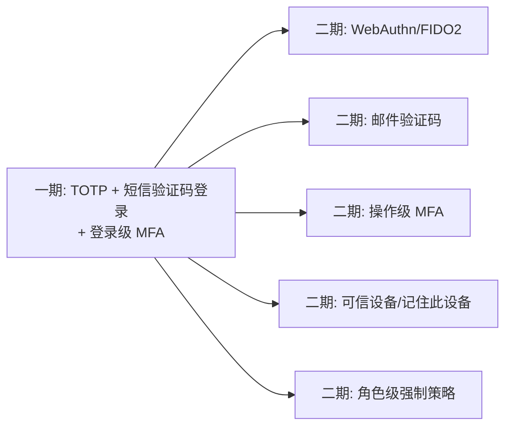

# nop-auth MFA Vision

**日期**：2026-08-10（更新于 2026-08-10）
**状态**：active
**范围**：`nop-auth`（nop-biz-auth-core / nop-biz-auth-api / nop-auth-service / nop-auth-dao）
**灵感来源**：n8n 的 MFA（`~/ai/n8n/packages/cli/src/mfa/`）、geekai 短信登录（`~/ai/geekai/api/`）、RFC 6238 TOTP

---

## 一、产品定位

为 Nop 平台登录体系增加**多因子验证（MFA）**能力，分两个层次：

1. **短信验证码登录**：以"手机号 + 短信验证码"作为登录凭证（可替代密码，也可作为第二因子）
2. **多因子验证（MFA）**：第一因子（密码/SSO/信道）通过后，**若用户启用 MFA 则要求第二因子**（TOTP 或短信验证码）验证通过才签发完整会话——保护高权限账号

一句话：**登录对已启用 MFA 的用户是"第一因子 + 第二因子"两阶段完成，第二因子支持 TOTP 与短信两种方式；未启用 MFA 的用户流程不变。**

## 二、成功标准

1. **两阶段登录**：第一因子通过后返回 `MfaRequired`（含一次性 challenge token），第二因子验证通过才返回 accessToken
2. **两种第二因子**：TOTP（RFC 6238，兼容 Google Authenticator）+ 短信验证码，可配置启用（**单值 mfaType，用户二选一**，不支持同时启用——设计约束）
3. **短信验证码登录**：手机号+验证码可直接登录（配置开关），验证码发送有频率限制与过期时间
4. **可配置**：管理员可全局开关 MFA；用户可自助绑定/解绑；管理员可重置用户 MFA（用户丢失验证器+恢复码时的出路）
5. **可审计**：MFA 挑战发起/成功/失败全部写入审计日志（复用 NopAuthOpLog 机制）
6. **防爆破**：验证码错误次数上限、发送频率限制（手机号/IP 双维度）、challenge 一次性失效、TOTP 时间窗口防重放
7. **向后兼容**：未启用 MFA 的用户登录流程与现在完全一致（无感知）

## 三、Non-Goals（显式不做）

1. **不做生物识别**（指纹/人脸）：需要设备端能力，不在服务端认证范围
2. **不做 FIDO2/WebAuthn 硬件密钥**：协议复杂度高，留待二期（`MfaType` 枚举预留扩展位）
3. **不做外部 MFA 服务集成**（Authy、Duo 等）：平台自研 TOTP + 短信，外部服务留待二期
4. **不做"登录即验证码"的强制短信登录**：短信验证码作为登录方式存在，但默认仍是密码登录为主
5. **不做邮件验证码**：短信已有 `ISmsSender` 通道；邮件验证码需扩展 `IEmailSender` 抽象，留待二期
6. **不做动态密码卡/USB Key**：小众场景
7. **不做会话内二次验证**（操作级 MFA，如转账时再验证）：本期只做登录级 MFA
8. **不做"按角色强制 MFA"策略引擎**：一期只有全局开关 + 用户级启用（`NopAuthMfaSetting`）；角色级强制策略留待二期（本期不引入策略模型）
9. **短信登录用户不强制二次短信验证**：若用户以短信验证码登录（loginType=5）且其 MFA 类型为 sms，则因子等同（都是短信码），登录即视为满足 MFA，不再重复验证（设计约束，见 Architecture §3.2）

## 四、设计收敛路径

一期交付：TOTP 验证器 + 短信验证码登录 + 登录级 MFA 两阶段流程 + 用户自助绑定/解绑 + 管理员重置 + 审计。

## 五、边界约束（不可违反）

1. **依赖方向**：MFA 逻辑全部在 `nop-auth` 内，不新增模块；`nop-biz-auth-core` 不依赖短信通道（`ISmsSender` 在 service 层注入）；`nop-auth-service` 依赖 `nop-integration-api`（短信接口，已有依赖）
2. **明文边界**：TOTP secret 加密存储（复用 nop-commons `AESTextCipher`），secret 明文仅通过绑定流程的 provisioning URI 一次性返回；恢复码哈希存储（复用 `IPasswordEncoder` 加盐慢哈希），不存明文
3. **兼容性**：未启用 MFA 的用户登录流程必须与现状完全一致（`MfaRequired` 只在用户启用了 MFA 时才返回）；SSO/信道登录（`ISessionBootstrap` 路径）同样拦截
4. **一次性**：challenge token 一次性有效，使用后立即作废；验证码同理；TOTP 时间窗口防重放（按用户记录最近成功窗口）
5. **限流**：短信发送（手机号/IP 双维度）与验证码校验都有上限
6. **多实例前提**：challenge 与短信验证码的存储必须支持多实例部署；Redis 后端**复用既有 `nop-nosql` 基础设施**（`INosqlKeyValueOperations`/`NosqlCache`/`INosqlRateLimiter`，见 `nop-persistence/nop-nosql/`），业务存储实现为本期新增，不重复造轮子
