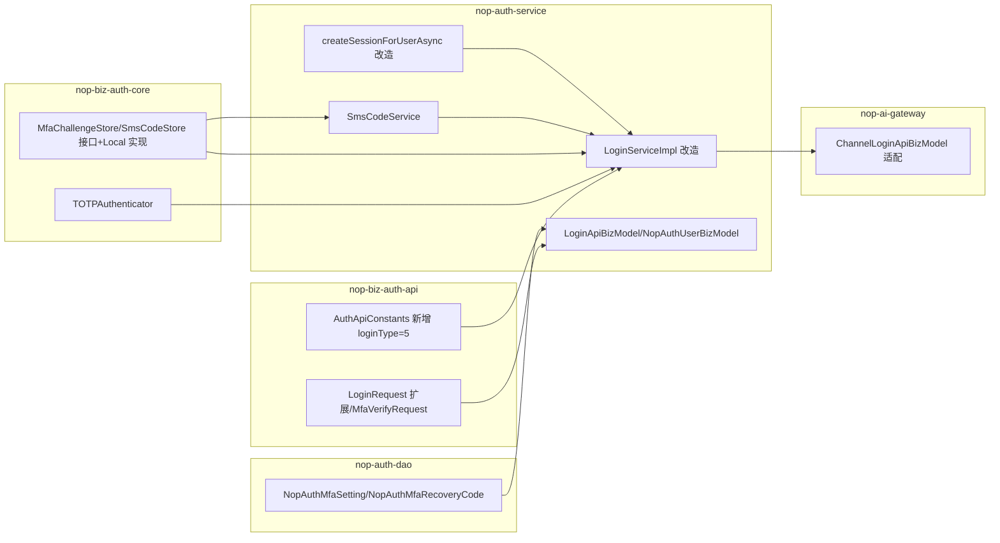
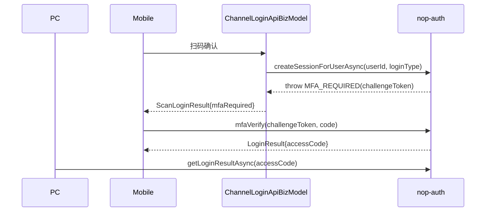

# nop-auth MFA Architecture Baseline

**日期**：2026-08-10（更新于 2026-08-10，第四轮审查修订）
**状态**：active
**范围**：`nop-auth`（nop-biz-auth-core / nop-biz-auth-api / nop-auth-service / nop-auth-dao）+ `nop-ai-gateway`（扫码登录编排，跨模块契约变更）
**灵感来源**：n8n MFA（`packages/cli/src/mfa/`）、RFC 6238 TOTP、`AESTextCipher`（nop-commons）、`nop-nosql`（Redis 基础设施）

---

## 一、设计结论

1. **登录流程改为两阶段**：第一因子（密码/SSO/信道）通过后，若用户启用 MFA 则返回 `MfaRequired`（含一次性 challenge token），第二因子（TOTP/短信验证码）验证通过才签发会话
2. **MFA 拦截统一走 `NopException(ERR_AUTH_MFA_REQUIRED)` 携带 challenge 参数**（不在 `LoginResult`/`IUserContext` 上加标记，保持既有契约形态），两条入口（`loginAsync` + `createSessionForUserAsync`）同一机制
3. **新增短信验证码登录**：`loginType = LOGIN_TYPE_PHONE_SMS = 5`；手机号+验证码可直接登录
4. **新增 TOTP 验证器**：RFC 6238（HMAC-SHA1、6 位、30s、±1 窗口），secret 用 `AESTextCipher` 加密，防重放基于 `lastVerifiedWindow`
5. **新增数据模型**：`NopAuthMfaSetting` + `NopAuthMfaRecoveryCode`
6. **新增独立存储组件**：`MfaChallengeStore` + `SmsCodeStore`，**Local 实现 + Redis 实现（复用 nop-nosql）**——现有 `IUserContextCache` 验证码通道不可复用（§3.3 理由）
7. **API**：`LoginApi` 增加 `sendSmsCode`/`sendMfaCode`/`mfaVerify`；用户自助 `bindMfa`/`confirmMfa`/`unbindMfa`/`generateRecoveryCodes`/`getMfaStatus`；管理员 `resetUserMfa`
8. **跨模块改造**：`nop-ai-gateway` 的 `ChannelLoginApiBizModel.loginByScan` 需适配 MFA 异常（捕获 `ERR_AUTH_MFA_REQUIRED` 后返回带 challenge 的 `ScanLoginResult`）——跨模块公共 API 变更，plan-first + migration plan
9. **不新增模块**：MFA 逻辑全部在 nop-auth 内

## 二、背景与动机

现状盘点（MFA 相关能力现状）：

| 能力 | 现状 | 锚点 |
|---|---|---|
| 密码登录 | 用户名/邮箱/手机+密码（loginType 1/2/3） | `AuthApiConstants.java` |
| SSO/信道登录 | SSO(4) + 飞书/钉钉/企微/Webhook（20-23），走 `ISessionBootstrap.createSessionForUserAsync`（**不走 loginAsync**） | `LoginServiceImpl.java:258`、`ChannelLoginApiBizModel.java:173` |
| 图形验证码 | 已有 `IVerifyCodeGenerator`（**生成器**，非缓存通道）+ `IUserContextCache.setVerifyCode/getVerifyCode`（缓存） | `nop-biz-auth-core/.../verifycode/` |
| 验证码缓存 | `verifyCodeCache` 全局 `expireAfterWrite(verifyCodeTimeout)`，**默认 60 秒**；**仅 Local 实现**，无 Redis；无 remove；String-only | `AbstractUserContextCache.java:42`、`UserContextConfig.java:21`、`LocalUserContextCache.java:32` |
| 短信发送 | 已有 `ISmsSender`（腾讯/云片），`SmsMessage.templateCode` 支持模板 ID | `nop-integration-api/.../sms/ISmsSender.java` |
| Redis 基础设施 | 已有 `nop-nosql`（`INosqlKeyValueOperations`/`NosqlCache`/`INosqlRateLimiter`，Lettuce 实现） | `nop-persistence/nop-nosql/` |
| 会话签发 | `buildUserContext → saveSession → accessToken/refreshToken` | `LoginServiceImpl.loginAsync` |
| 失败计数 | 已有（用户/IP 双维度） | `IUserContextCache` |
| **短信验证码登录** | **无** | — |
| **MFA/二次验证** | **无**（TOTP、恢复码、challenge 流程均不存在） | — |

**已知不一致（需一并修复）**：`login-type.dict.yaml` 中 SSO=10 而 `AuthApiConstants` 中 SSO=4；dict 缺 2/3 条目。本期新增 5 时同步补齐 dict（1/2/3/4/5/10/20-23），**以代码常量为准（SSO=4），dict 仅作显示**；存量 `nop_auth_ext_login` 中 loginType=10 的历史记录需在迁移清单中核对（预期为空——信道编码从 20 起）。

**需求来源**：geekai（短信登录）与 n8n（MFA）对比调研识别为平台差距；短信验证码登录是移动端登录的常见诉求，MFA 是高权限账号的合规要求。

## 三、核心设计

### 3.1 模块内分层（不新增模块）



- `nop-biz-auth-core`：纯逻辑（TOTP 算法、存储接口 + Local 实现），零业务依赖
- `nop-auth-service`：流程编排（短信发送、登录改造、BizModel、Redis 存储装配）
- `nop-auth-dao`：ORM 实体
- `nop-ai-gateway`：扫码登录编排适配（只感知 `ERR_AUTH_MFA_REQUIRED` 异常）

### 3.2 MFA 拦截与两阶段登录

**MFA 拦截的统一表达（关键决策）**：

```
拦截方式：抛出 NopException(ERR_AUTH_MFA_REQUIRED)
           .param("challengeToken", token).param("mfaType", type)
           .param("loginType", loginType)
调用方（LoginApiBizModel / ChannelLoginApiBizModel）捕获后：
  - 密码路径：错误响应携带 errorParams（框架原生支持），前端据此弹出第二因子输入
  - 扫码路径：ChannelLoginApiBizModel 捕获后返回 ScanLoginResult 扩展字段 mfaRequired
不选"返回带标记的 IUserContext"：会污染 buildLoginResult 逻辑且改变 IUserContext 契约
不选"LoginResult.mfaRequired 字段"：LoginApiBizModel.loginAsync 的中间链路没有 LoginResult 出口，
  mfaRequired 只能经异常或返回 context 两条路，选异常最贴合现有错误处理链
```

**改造后流程**（`loginAsync`，密码类 loginType 1/2/3/5）：

```pseudocode
loginAsync(request):
    if verifyCodeEnabled and !checkVerifyCode: return INVALID_VERIFY_CODE   # 图形验证码（防机器人），与 MFA 无关
    user = getAuthUser(request)
    if loginType == PHONE_SMS:
        if !smsCodeConfig.enabled: return INVALID_LOGIN_METHOD   # 功能开关门禁（§3.7 nop.auth.sms-code.enabled）
        if !isAllowLogin(user): return USER_NOT_ALLOW_LOGIN   # 与密码路径一致：账号状态/锁定检查
        result = smsCodeStore.verify("login:"+phone, code)    # verify=校验+成功原子消费
        if result == EXPIRED: return ERR_AUTH_SMS_CODE_EXPIRED   # 双错误码：过期/不匹配（§3.8）
        if result == MISMATCH: return ERR_AUTH_SMS_CODE_INVALID
    else:
        if !passwordMatches: return LOGIN_FAIL
    if !mfaConfig.enabled: return completeLogin(user, loginType)   # 全局开关关闭 → 不强制 MFA（§3.7）
    setting = mfaSettingDao.getByUserId(userId)   # 查 DB，不查缓存
    if setting == null or !isEnabled(setting):    # 未启用 MFA → 原流程（口径：status==enabled）
        return completeLogin(user, loginType)
    if loginType == PHONE_SMS and setting.mfaType == SMS:   # 因子等同：短信登录用户，验证码即第二因子
        return completeLogin(user, loginType)               # 不重复验证（Vision Non-Goals #9）
    challenge = mfaChallengeStore.create(userId, setting.mfaType, loginType, tenantId, phone)
    throw ERR_AUTH_MFA_REQUIRED(challengeToken, mfaType, loginType)   # 不签发 accessToken
```

**改造后流程**（`createSessionForUserAsync`，SSO/信道路径——同样拦截）：

```pseudocode
createSessionForUserAsync(userId, loginType):   # loginType 参数化：飞书=20/钉钉=21/企微=22/Webhook=23
    user = getUserByUserId(userId)
    if !isAllowLogin(user): throw USER_NOT_ALLOW_LOGIN
    if !mfaConfig.enabled: return completeLogin(user, loginType)   # 全局开关关闭 → 不强制（§3.7）
    setting = mfaSettingDao.getByUserId(userId)
    if setting != null and isEnabled(setting):   # SSO/信道用户启用 MFA 同样拦截（口径：status==enabled）
        challenge = mfaChallengeStore.create(userId, setting.mfaType, loginType, tenantId, phone)
        throw ERR_AUTH_MFA_REQUIRED(challengeToken, mfaType, loginType)   # 不引导完整会话
    return completeLogin(user, loginType)        # 原逻辑，审计 loginType 不失真
```

**第二因子验证**（`mfaVerify`，公开访问）：

```pseudocode
mfaVerify(request):   # request = {challengeToken, code, recoveryCode?}
    challenge = mfaChallengeStore.peek(challengeToken)    # 读取（非删除）
    if challenge == null: return CHALLENGE_EXPIRED
    user = loadUser(challenge.userId, challenge.tenantId)
    setting = mfaSettingDao.getByUserId(challenge.userId)
    if setting == null or !isEnabled(setting):   # 复核：管理员重置/用户解绑后 challenge 失效
        mfaChallengeStore.consume(challengeToken); return CHALLENGE_EXPIRED   # 安全默认，作废
    if request.recoveryCode != null:
        ok = recoveryCodeDao.verifyAndConsume(userId, code)   # 加盐哈希比对，使用即作废
        if ok == RECOVERY_USED: return MFA_FAIL   # 已用过的恢复码：统一返回 MFA_FAIL（不计数、不消费 challenge，
                                                  # 不暴露"曾有效"信号——与防枚举精神一致）
        if !ok:
            incrAndCheck(challengeToken)                      # 走同一失败计数
            return MFA_FAIL
        mfaChallengeStore.consume(challengeToken)             # 一次性消费（与 TOTP/SMS 分支一致）
        setting.status = DISABLED                # 恢复码登录成功 → 强制重绑（防锁死）
        audit("mfa-recovery-used", userId)
        return completeLogin(user, challenge.loginType, recoveryUsed=true)   # 响应提示重新绑定
    if challenge.mfaType == TOTP:
        ok = totp.verify(setting.secret, code, now) AND !replayWindow(userId, now)   # 防重放 §3.4
    else: # SMS
        result = smsCodeStore.verify("mfa:"+userId, code)   # 独立 key；校验+成功原子消费
        if result == EXPIRED: return ERR_AUTH_SMS_CODE_EXPIRED   # 与 loginAsync 双错误码口径一致
        if result == MISMATCH: return MFA_FAIL
        ok = true
    if ok:
        mfaChallengeStore.consume(challengeToken)       # 验证成功才一次性消费
        return completeLogin(user, challenge.loginType)
    incrAndCheck(challengeToken)                        # 失败计数（peek 阶段，未删除）
    return MFA_FAIL

incrAndCheck(challengeToken):
    failCount = mfaChallengeStore.incrFailCount(challengeToken)   # Redis 用原子 INCR（§3.3）
    if failCount >= maxAttempts: discard(challengeToken)   # 超限作废，需重新发起登录
```

**扫码路径的完整时序**（MFA 介入后）：



**关键决策**：

- **MFA 检查时机**：在凭证校验通过之后、`completeLogin` 之前；未启用 MFA 的用户走原流程（零感知）
- **challenge token**：**不透明随机 token（UUID）**，不签发 JWT——状态全部存 `MfaChallengeStore`；不扩展 `IAuthTokenProvider`
- **challenge 生命周期**：`peek`（读取，**用不刷新 TTL 的读**，避免失败重试把 300s 有效期变成滑动窗口）→ 失败 `incrFailCount`（超限作废）→ 成功 `consume`（一次性消费）。**先 peek 后 consume**：保证失败计数可达 max-attempts（若先 consume，第一次失败后 token 即失效，上限形同虚设）
- **MFA 启用状态查询**：直查 `NopAuthMfaSetting` 表（不做缓存，绑定/解绑即时生效）
- **completeLogin**：抽公共方法（原成功路径），三处复用（loginAsync / createSessionForUserAsync / mfaVerify）；含 `autoLogout`（单会话互踢，与现有一致）；`mfaVerify` 成功路径 = `buildUserContext → autoLogout → saveSession（设 sessionId）→ saveUserContextAsync → 按 challenge.loginType 决定出口：密码类签发 accessToken，信道类签发 accessCode`（`generateAccessCode(userContext, ttl)` 需要已含 sessionId 的 context，此链保证）；`ContextProvider.runWithTenant(challenge.tenantId)` 包裹 loadUser/completeLogin（与现有 loginAsync 的 runWithTenant 模式一致）；accessCode TTL 复用 `nop.ai.channel.login.access-code-expire-seconds` 配置

**completeLogin 三处调用点行为裁决（Decision，W5）**：

| 差异点 | loginAsync | createSessionForUserAsync / mfaVerify |
|---|---|---|
| `resetLoginFailCountForUser` | **调用**（凭证成功后清零，与既有行为一致） | **不调用**（第二因子失败不触发用户锁账号，避免攻击者用第二因子爆破锁定受害者账号） |
| `userContextHook.onLoginSuccess` | **调用**（登录成功通知，与既有行为一致） | **不调用**（信道引导/mfaVerify 是凭证登录的延续，不重复触发登录成功钩子；信道侧的登录通知由信道层负责） |
| `LoginRequest` / headers 来源 | 完整客户端输入（request 含 locale/timezone/headers） | **合成 `LoginRequest`**（`syntheticRequest(loginType)`：loginType=真实信道值，locale/timezone 取 `AppConfig` 默认）+ 空 headers 传入 `buildUserContext`/`saveSession` |

裁决理由：
1. `resetLoginFailCountForUser`：createSessionForUserAsync/mfaVerify 路径的用户已通过第一因子（凭证/信道认证），第二因子失败只在 challenge 内计数（超限作废 challenge），不污染用户级失败计数——这是"失败计数分界"决策的直接体现。
2. `userContextHook.onLoginSuccess`：信道引导（SSO/扫码）与 mfaVerify 是已认证操作的延续，不是新的登录事件。loginAsync 的 `onLoginSuccess` 钩子面向"用户主动凭证登录"场景（如下发登录通知、初始化用户偏好），信道/mfaVerify 路径不需要重复触发。
3. `LoginRequest`/headers：信道引导/mfaVerify 没有 HTTP 请求上下文（createSessionForUserAsync 只接收 userId+loginType，mfaVerify 只接收 challengeToken），使用合成 LoginRequest 保证 `buildUserContext`/`saveSession` 的 locale/timezone/loginType 不失真（取 AppConfig 默认值是安全降级）。
- **短信登录与 MFA=sms 的因子等同**：用户以短信验证码登录（loginType=5）且 MFA 类型为 sms 时，验证码即第二因子，不重复验证（Vision Non-Goals #9）
- **失败计数分界**：第一因子失败沿用现有 `setLoginFailCountForUser`（锁账号）；**第二因子失败只计在 challenge 内**（超限作废 challenge），不触发用户锁账号（避免攻击者用第二因子爆破锁定受害者账号）；审计区分 `login-fail`（第一因子）与 `mfa-fail`（第二因子）
- **全局开关中途关闭**：已发出的 challenge 继续有效（challenge 存在即用户已过第一因子，放行无害）；开关只影响新登录流程，不回溯作废进行中的挑战

### 3.3 短信验证码登录与存储设计

**为什么不复用 `IUserContextCache` 验证码通道**（三个事实）：

1. 该通道仅 Local 实现（`LocalUserContextCache`），**无 Redis 实现**——多实例部署"发码在实例 A、校验在实例 B"直接失败
2. `setVerifyCode(key, code)` **无 TTL 参数**，底层 `verifyCodeCache` 全局 `expireAfterWrite(verifyCodeTimeout)`，**默认仅 60 秒**；改全局值会连带缩短图形验证码有效期
3. 通道 String-only 且**无 remove 方法**，"错误 N 次作废""过期作废"无法表达

**替代方案（本期新增两个独立存储组件，Redis 后端复用 nop-nosql）**：

```
MfaChallengeStore:   # 结构化 challenge 状态（作废/超限的统一出口在调用方 incrAndCheck）
  create(userId, mfaType, loginType, tenantId, phone): challengeToken   # 随机 UUID + TTL
  peek(challengeToken): Challenge | null               # 读取（非删除，不刷新 TTL）
  incrFailCount(challengeToken): int                   # 原子失败计数（Redis 用 INCR，§3.3）
  consume(challengeToken): Challenge | null            # 原子删除，一次性
  # Local 实现（LocalCache）+ Redis 实现（基于 INosqlKeyValueOperations/NosqlCache）

SmsCodeStore:         # 短信验证码（独立于图形验证码缓存）
  send(phone): code                    # 生成 6 位码，TTL 5min
  verify(key, code): CodeVerifyResult  # 校验 + 成功时原子消费（一次性，removeIfMatch）；失败时内部计数（独立计数键）
  consume(key)                         # 显式删除（备用）
  # Local 实现（LocalCache）+ Redis 实现（基于 NosqlCache）
```

**Redis 实现的复用方式**：`INosqlKeyValueOperations`（`nop-nosql-core`）具备每 key TTL（`putExAsync`/`setTimeoutAsync`）、条件写入（`putIfAbsentOrMatchExAsync`，幂等去重语义，非通用 CAS）；`NosqlCache` 实现 `ICache<String,Object>` 提供原子删除（`removeIfMatch`）；`INosqlRateLimiter` 提供限流原语；`INosqlService.counter(key)` → `INosqlCounter` 提供原子自增（INCRBY）。**Redis 写路径约束**：两个 store 的写一律走 `putExAsync`（TTL 在此设定）；读用**不刷新 TTL** 的 `get`（禁用 `getExAsync`/`NosqlCache.getAsync`——GETEX 滑动刷新会让"5 分钟过期"失效）；`NosqlCache` 仅承担 `removeIfMatch` 原子消费。`nop-auth-service` 新增依赖 `nop-nosql-core`（可选，配置 `nop.auth.mfa.store-type=redis` 时启用）。

**Redis 原子失败计数（关键）**：`INosqlKeyValueOperations` **无原子 INCR 原语**（`getAndSetExAsync` 只能写已知新值，`putIfAbsentOrMatchExAsync` 为条件写入-幂等去重、非通用 CAS），若按"读-改-写"实现 `incrFailCount`，并发错误请求会同时读到同一计数，`max-attempts` 上限可被绕过。方案（实施时必须）：

```
方案 A（推荐）：复用既有 INosqlService.counter(key) → INosqlCounter.incrementAsync(delta)
      （LettuceCounter 对普通 string key 执行 INCRBY，与 string-key 操作同命名空间），
      失败计数键独立（"mfa:fail:"+challengeToken），经 setTimeoutAsync（PEXPIRE）设 TTL；
      无需扩展 INosqlKeyValueOperations（缩小 Protected Area 变更面）。
      窄竞态说明：计数键过期后 INCR 重建无 TTL 的窗口内，challenge 本身也已过期
      （peek 返 null），无安全后果，仅可能残留少量计数键。
方案 B：扩展 INosqlKeyValueOperations.incrementAsync（INCR + PEXPIRE 原子），杜绝 TTL 竞态；
      但属跨模块公共 API（Protected Area），需同步两个实现类
      （LettuceMessageService string-key / LettuceHashOperations hash），走 plan-first。
实施裁决：默认方案 A；若审查认为 TTL 竞态不可接受再改 B（实施计划中先行裁决并回写本文档）。
Redis 实现基于 INosqlService（string-key 语义，hash 无 INCR 命令且 TTL 为 hash 级）。
Local 实现无此问题（JVM 内原子 compute），实现时注意差异。
```

**loginType 新增**：`LOGIN_TYPE_PHONE_SMS = 5`（`AuthApiConstants` 新增 + `login-type.dict.yaml` 同步补 2/3/5 条目并统一 SSO 为 4）

```pseudocode
// 发送验证码（LoginApi.sendSmsCode，公开访问）
sendSmsCode(phone):
    if !userDao.existsByPhone(phone) and !allowRegister:   # 防枚举：未注册手机号统一响应"已发送"
        return SMS_SENT   # 不暴露"未注册"信号（避免成为手机号枚举通道）
    if rateLimit.exceeded(phone, ip): return RATE_LIMITED      # 60s 间隔 + 日上限 + IP 维度
    code = smsCodeStore.send(phone)                            # 6 位随机
    smsSender.sendMessage(SmsMessage(phone, templateId, code)) # ISmsSender，模板 ID 配置化
```

**限流维度**：同手机号 60s 间隔 + 每日上限（默认 20）+ 同 IP 每日上限（默认 50），复用 `setLoginFailCountForIp` 模式或 `INosqlRateLimiter`。

**登录短信码失败计数**：`verify` 返回"不匹配"时，`SmsCodeStore` 内部记失败次数（独立计数键 `sms:fail:{key}`，超 `max-attempts` 作废需重发）；同时该验证码的发送本身受 IP/手机号限流保护，双保险。登录短信码失败**不进** `setLoginFailCountForUser`（验证码本身一次性，作废即防爆破；避免与用户锁账号语义混淆）。注：MFA 短信路径存在双计数（`SmsCodeStore` 内部失败计数 + challenge `incrAndCheck`），两者独立、都生效，实现时勿省略其一。

### 3.4 TOTP 验证器

- **算法**：RFC 6238——HMAC-SHA1、6 位数字、30 秒窗口；校验允许前后 1 个窗口偏差（容忍时钟漂移）
- **secret 生成**：32 字节随机（base32 编码），返回 provisioning URI 供用户绑定（Google Authenticator 扫码）
- **secret 存储**：`AESTextCipher` 加密存 `NopAuthMfaSetting.secret`
- **防重放（关键）**：基于 `NopAuthMfaSetting.lastVerifiedWindow`（记录最近一次成功验证的 30 秒窗口编号）——校验通过时更新；若"当前窗口 ≤ 上次成功窗口"则**拒绝且不更新**（防止同一窗口码重复使用）；**challenge 自身只负责一次性与失败计数**，不承担窗口防重放（challenge 是 per-login 的，跨 challenge 重放必须靠 per-user 窗口记录）
- **恢复码**：**两类 MFA（totp/sms）绑定时均生成** 10 个一次性恢复码（10 位数字，格式同 n8n；sms 用户丢手机同样需要恢复通道），**`IPasswordEncoder`（BCrypt 加盐）哈希存储**（不用无盐 SHA-256——恢复码是低熵值，无盐可被离线爆破）；用于丢失验证器/手机时登录；**恢复码一经使用立即作废并要求用户重新绑定验证器**（`NopAuthMfaSetting.status` 置为 `disabled`，强制重绑防锁死）；恢复码不用于解绑

### 3.5 数据模型

`nop-auth/model/nop-auth.orm.xml` 新增两个实体：

**NopAuthMfaSetting（用户 MFA 配置）**：

| 字段 | 说明 |
|---|---|
| userId | 用户 ID（PK，1:1 用户，domain=userId，实体级租户感知同 NopAuthUser） |
| mfaType | 启用的第二因子类型（`totp`/`sms`），空 = 未启用；**单值，二选一** |
| secret | TOTP secret（`AESTextCipher` 加密，仅 totp 类型有值） |
| status | 绑定状态：`pending`（bindMfa 后未确认）/`enabled`/`disabled`；**启用判定统一口径 `status==enabled`**（mfaType 非空但 pending 不算启用） |
| bindToken | 绑定流程一次性 token（确认绑定用，UUID + TTL） |
| phone | 短信接收手机号（仅 sms 类型，默认取用户手机号） |
| lastVerifiedWindow | 最近成功验证的 TOTP 窗口编号（防重放） |
| lastVerifiedAt | 最近验证时间（审计） |
| version/updateTime/createdBy | 通用审计字段（实体级声明 `versionProp`/`createTimeProp` 等，遵循平台惯例） |

**NopAuthMfaRecoveryCode（恢复码）**：

| 字段 | 说明 |
|---|---|
| sid | 主键（seq） |
| userId | 用户 ID |
| codeHash | 恢复码哈希（`IPasswordEncoder` 加盐慢哈希，不存明文） |
| used | 是否已使用 |
| usedAt | 使用时间 |
| expireAt | 过期时间（可选） |
| version/updateTime | 通用审计字段 |

关系：`NopAuthMfaSetting 1:N NopAuthMfaRecoveryCode`（按 userId）。

### 3.6 API 契约

**LoginApi（公开访问，`/r/LoginApi_*`）**：

```
LoginApi
  login(request)                  # 现有，改造后可能抛 ERR_AUTH_MFA_REQUIRED（@BizMutation）
  sendSmsCode(phone)              # 新增：发送短信验证码（登录用，@BizMutation，公开）
  sendMfaCode(challengeToken)     # 新增：MFA 第二因子验证码重发（服务端取号，凭 challengeToken；peek 校验
                                  #       challenge 已消费/作废则返回 CHALLENGE_EXPIRED；限流同 sendSmsCode）
  mfaVerify(request)              # 新增：提交第二因子验证码，成功返回 LoginResult（@BizMutation，公开）
  generateVerifyCode(verifySecret)# 现有：图形验证码（@BizQuery，参数名 verifySecret）
```

**错误响应携带 challenge**：`ERR_AUTH_MFA_REQUIRED` 的 `errorParams` 携带 `challengeToken`/`mfaType`/`loginType`；`MfaVerifyRequest` = `{challengeToken, code, recoveryCode?}`；`mfaVerify` 成功返回标准 `LoginResult`（密码类路径带 accessToken；信道类路径带 accessCode）。**MfaRequired 响应不携带 phone**（手机号由服务端从用户档案解析，防泄露）。

**短信验证码 key 隔离**：登录验证码 key=`login:{phone}`，MFA 短信验证码 key=`mfa:{userId}`——**互不通用**，同一验证码不能同时被登录与 MFA 入口消费。

**NopAuthUserBizModel（需登录，用户自助）**：

```
NopAuthUserBizModel
  bindMfa(mfaType)                # 新增：发起绑定（totp 返回 provisioning URI + bindToken；sms 发送验证码）
  confirmMfa(request)             # 新增：确认绑定（提交 bindToken + code，成功后 status=enabled）
  unbindMfa(request)              # 新增：解绑（需验证当前第二因子，通过才可解绑；解绑同时作废恢复码）
  generateRecoveryCodes()         # 新增：生成/重置恢复码（仅 enabled 状态；重置时作废旧码）
  getMfaStatus()                  # 新增：查询自己 MFA 状态（不返回 secret）
```

**管理员能力（NopAuthUserMaintenanceBizModel，admin 权限）**：

```
resetUserMfa(userId)    # 管理员重置用户 MFA（用户丢失验证器+恢复码时）：清除 setting + 恢复码
```

**绑定状态机（关键，secret 生命周期）**：

```pseudocode
bindMfa(mfaType):
    if status == enabled: return ALREADY_ENABLED
    secret = generateSecret()                # totp；sms 无需 secret
    bindToken = UUID(5min TTL)
    save(status=pending, secret, bindToken)  # secret 此时落库（pending），旧 pending 覆盖写
    return {provisioningUri | smsCodeSent, bindToken}

confirmMfa({bindToken, code}):
    setting = loadByBindToken(bindToken)     # 按 bindToken 定位 pending 记录
    if setting == null: return BIND_EXPIRED
    ok = verifyWithSecret(setting.secret, code)   # 用 pending 记录的 secret 校验
    if !ok: return MFA_FAIL
    setting.status = enabled; setting.bindToken = null   # 确认成功才替换生效（换绑原子性）
    generateRecoveryCodes()                  # 同时生成恢复码（重置旧码）
    save()

unbindMfa({code}):                           # 换绑/解绑：需验证当前因子
    if verifyWithSecret(secret, code):
        setting.status = disabled; 删除全部恢复码; return OK
    return MFA_FAIL
```

- **重复 bindMfa**：pending 记录存在时重新生成 secret+bindToken，旧 pending 作废（覆盖写）
- **换绑原子性**：`confirmMfa` 成功才把新 secret 置为生效，期间旧 secret 仍可用于登录验证
- **绑定后会话策略**：`confirmMfa` 成功启用 MFA 后当前会话保持（绑定动作本身已认证），不强制重新登录
- **短信类型绑定**：bindMfa(sms) 发送验证码到用户手机号（从 `NopAuthUser.phone` 解析），confirmMfa 校验 `mfa:{userId}` key；secret 置空

### 3.7 配置项（NopAuthConfigs 新增，前缀统一）

| 配置 | 默认值 | 说明 |
|---|---|---|
| `nop.auth.mfa.enabled` | `false` | 全局 MFA 开关（关时即使有配置也不强制） |
| `nop.auth.mfa.store-type` | `local` | challenge/验证码存储实现：`local`/`redis` |
| `nop.auth.mfa.challenge-expire-seconds` | `300` | challenge 有效期 |
| `nop.auth.mfa.max-attempts` | `5` | 第二因子最大尝试次数（超限作废 challenge） |
| `nop.auth.mfa.totp-issuer` | `nop` | TOTP issuer 名称 |
| `nop.auth.mfa.totp-window-skew` | `1` | TOTP 允许时钟偏差窗口数 |
| `nop.auth.sms-code.enabled` | `false` | 短信验证码登录开关 |
| `nop.auth.sms-code.expire-seconds` | `300` | 验证码有效期 |
| `nop.auth.sms-code.send-interval-seconds` | `60` | 发送间隔 |
| `nop.auth.sms-code.daily-limit` | `20` | 每日发送上限（手机号维度） |
| `nop.auth.sms-code.ip-daily-limit` | `50` | 每日发送上限（IP 维度） |
| `nop.auth.sms-code.max-attempts` | `5` | 验证码错误上限（作废需重发） |
| `nop.auth.sms-code.template-id` | — | 短信模板 ID（`SmsMessage.templateCode`） |
| `nop.auth.sms-code.allow-register` | `false` | 未注册手机号是否允许发码（防枚举开关） |

### 3.8 错误码（NopAuthErrors 新增）

`ERR_AUTH_MFA_REQUIRED`（challenge 已发，需第二因子）、`ERR_AUTH_MFA_FAIL`、`ERR_AUTH_MFA_CHALLENGE_EXPIRED`、`ERR_AUTH_MFA_NOT_ENABLED`、`ERR_AUTH_MFA_ALREADY_ENABLED`、`ERR_AUTH_MFA_BIND_EXPIRED`、`ERR_AUTH_SMS_CODE_INVALID`、`ERR_AUTH_SMS_CODE_EXPIRED`、`ERR_AUTH_SMS_RATE_LIMITED`、`ERR_AUTH_SMS_DAILY_LIMIT`、`ERR_AUTH_MFA_RECOVERY_CODE_USED`。

**过期 vs 无效的区分**：`SmsCodeStore.verify` 返回"有效/过期/不匹配"三态（存储时记录过期时间戳），不依赖 null 单值判断。

## 四、拒绝了什么

| 方案 | 拒绝理由 |
|---|---|
| **MFA 独立成新模块（nop-mfa）** | MFA 深度耦合登录流程（loginAsync + createSessionForUserAsync 改造），且复用 nop-auth 内部件（authTokenProvider、失败计数、审计）；拆模块无独立复用价值（对比 nop-credential：凭证库被多个模块消费才独立） |
| **复用 `IUserContextCache` 验证码通道存短信码/challenge** | 三重事实不兼容：仅 Local 实现无 Redis（多实例失效）；无 TTL 参数（全局 60s，改全局会误伤图形验证码）；String-only 无 remove（无法表达"作废/失败计数"）。见 §3.3 |
| **短信登录复用现有 loginType=3（PHONE_PASSWORD）** | 语义不同（密码 vs 验证码），`needCheckPassword` 分支会变复杂；独立 loginType=5 更清晰 |
| **challenge token 用 JWT 自含 userId** | `IAuthTokenProvider` 只有 access/refresh/code 三种专用签发，无自定义 typ 能力；且一次性必须靠服务端状态（JWT 部分多余）；用不透明 UUID + 状态存储更简单自洽 |
| **MFA 拦截用"带标记的 IUserContext"或"LoginResult.mfaRequired 字段"** | 前者污染 buildLoginResult 逻辑且改变 IUserContext 契约；后者在 loginAsync 中间链路没有 LoginResult 出口；统一用 `ERR_AUTH_MFA_REQUIRED` 异常携带 challenge 参数最贴合现有错误处理链（框架原生支持 errorParams） |
| **TOTP secret 明文存储 / 存入 nop-credential** | secret 属于用户认证秘密而非"连接第三方系统的凭证"；nop-auth 不应反向依赖 nop-credential（依赖方向错误）；用 `AESTextCipher` 加密存 nop-auth 自己的表 |
| **恢复码无盐 SHA-256 哈希** | 恢复码是低熵值（10 位数字），无盐哈希可离线爆破；复用 `IPasswordEncoder`（BCrypt 加盐） |
| **引入第三方 TOTP 库** | RFC 6238 实现约 50 行，平台已有 `HashHelper`/Base32 基础件；无必要增加依赖 |
| **MFA 全局强制开启** | 兼容性要求（成功标准 7）：默认关闭、按用户启用，避免存量用户登录被破坏 |
| **接入外部 MFA 服务（Duo/Authy）** | 增加外部依赖与费用；自研 TOTP+短信覆盖主流场景；留二期 |
| **操作级 MFA（敏感操作二次验证）** | 本期只做登录级；操作级需要请求级钩子，改动面大，留二期 |
| **TOTP 防重放靠 challenge 存储** | challenge 是 per-login 一次性，无法防"跨 challenge 同一窗口重放"；防重放必须 per-user 记录最近成功窗口（`lastVerifiedWindow`） |
| **按角色强制 MFA（一期）** | 引入角色级策略模型（策略存储/继承/评估）超出本期范围；一期全局开关 + 用户级启用已覆盖主要合规场景，角色级留二期 |

## 五、与已有设计的关系

- **上游复用**：`nop-commons` `AESTextCipher`（secret 加密）、`IPasswordEncoder`（恢复码哈希）、`ISmsSender`（短信发送，nop-integration-api）、`LocalCache`（Local 存储实现基础）、`nop-nosql`（Redis 存储基础设施，`NosqlCache`/`INosqlKeyValueOperations`/`INosqlRateLimiter`）、失败计数/审计机制
- **同层协作**：`LoginServiceImpl.loginAsync` 改造、`createSessionForUserAsync` 改造（SSO/信道拦截，loginType 参数化）、`LoginApiBizModel`（新增接口）、`NopAuthUserBizModel`/`NopAuthUserMaintenanceBizModel`（绑定管理/管理员重置）、`login-type.dict.yaml` 同步修复（SSO 4/10 不一致 + 补 2/3/5）
- **跨模块**：`nop-ai-gateway` 的 `ChannelLoginApiBizModel.loginByScan` 适配 MFA 异常（捕获 `ERR_AUTH_MFA_REQUIRED` → `ScanLoginResult.mfaRequired`）——**跨模块公共 API 变更，实施需 plan-first + migration plan**
- **下游影响**：`docs-for-ai/03-modules/nop-auth.md` 与 `docs-for-ai/02-core-guides/auth-and-permissions.md` 需补充 MFA 章节（实施后同步）；前端登录页需适配 `ERR_AUTH_MFA_REQUIRED` 错误响应（前端改动为业务层）
- **参照**：n8n MFA（`packages/cli/src/mfa/`：TOTP + recovery codes + challenge 流程）——要素对应：TOTP ✅、recovery codes ✅（加盐哈希，比 n8n 更安全）、challenge 两阶段 ✅、防重放 ✅
- **约束**：ORM 实体遵循 `docs-for-ai/02-core-guides/model-first-development.md`；API 遵循 `api-and-graphql.md`（BizModel mutation 惯例）；**以下均为公共 API/跨模块契约变更，实施需 plan-first + owner doc + migration plan：`createSessionForUserAsync`（ISessionBootstrap）、`LoginApi`（nop-biz-auth-api 新增方法）、`LoginResult`/`ScanLoginResult`（扩展字段）、`INosqlKeyValueOperations`（新增 incrementAsync）**