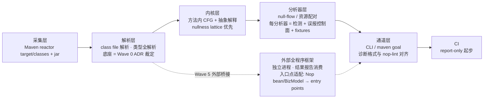

# Nop 字节码分析通道 — 设计目标与原则

> 日期: 2026-09-29
> 状态: active（底座已裁——[substrate-adjudication.md](./substrate-adjudication.md)，2026-09-29 ADR 落档）
> 范围: 字节码分析通道（执行计划见 [nop-bytecode-analysis roadmap](../../backlog/nop-bytecode-analysis-roadmap.md)）的定位、原则与架构概览
> 层级: 本篇承担 Vision + Architecture Baseline 双职

## 1. 设计目标（Vision）

构建**编码期防线**的第二条分析通道：源码通道（nop-lint，tree-sitter CST + XNode + 源级类型推导，纯源码原则）之外的**字节码通道**，在 class-file 层承接源码引擎原则外的最高信号缺陷面：

| 缺口面 | 波次 | 说明 |
|---|---|---|
| 空指针解引用路径（null-flow） | Wave 2 | 方法内路径敏感：解引用前判空路径分析 |
| 资源泄漏 acquire/release 跨路径配对 | Wave 3 | Closeable / 连接 / 锁三类资源注册表 |
| 跨过程调用图 / 参数 nullness 契约 / taint | Wave 5（adopt-or-skip） | 全程序指针分析面，外部能力窄桥接（§2.5） |

**成功标准**：(a) 两大缺口各有 v1 分析器，已知命中集对照在档（零 diff 或 delta 逐条裁定）；(b) 发现流进 CI（report-only 起步，升级须独立 plan + 误报数据）；(c) 与 SpotBugs 并行双跑对照收敛记录在案。

**显式 non-goals**：

- 不做风格/可选面（同源码 lane 的 out-of-purpose 轴）；
- 不做依赖源码注释的检测（fall-through 注释豁免、autofix 模板——注释与语法结构在字节码层不存在，此面**永不入本通道**）；
- 不做依赖闭包类架构断言（ArchUnit 已承担，并行不替代）；
- 不做编辑器实时档——fast 档 <50ms 预算归 tree-sitter 通道；本通道定位 CI/构建期档位（分钟级预算），**运行前提是编译产物存在**（编译未通过的半成品只有源码可分析，这是字节码层的结构性前提）；
- **纯增量**：nop-lint 引擎、现有工具（SpotBugs/Sonar/ArchUnit/PMD/mjs 门禁族）的接线与终裁全部不动，只并行、不切换、不替代。

**必须由人做出的决策**：底座终裁（Wave 0 item 2 ADR）；新检查 report-only → CI hard gate 的升级；任何未来"字节码通道替代工具 X"议题（须另立 roadmap 走替代验证流程）。

## 2. 设计原则

### 2.1 纯增量与并行

本通道是独立能力通道，不是 nop-lint 引擎的底座变更，也不是现有工具的替换载体。发现流与源码通道并行消费，缺口归属单一（同一缺陷同一位置不双报；重叠面的归属在缺口账本逐条登记）。

### 2.2 高信号准入

同源码 lane 判据：发现流的消费者是 AI 与开发者，噪音即成本。每个分析器必须声明误报控制面（豁免机制 / 语义门控 / 白名单）——例如 null-flow 的豁免面 = assert / `Objects.requireNonNull` 系 / 平台 `NopException` 前置检查形态；资源配对的豁免面 = try-with-resources / finally-close / 已知 wrapper 形态白名单。

### 2.3 证据纪律

任何承接/不承接裁定、任何能力宣称、任何对照结论，必须带机制面证据或同语料命中集对照数据 + 理由 + 重估触发。新分析器全带 fixtures；内核性能声称须 JMH 基线背书。

### 2.4 CI 档位与硬门禁不对称

本通道新检查默认 **report-only**；升 hard gate 须独立 plan + 对照期误报数据背书——与源码 lane 的"下线要审计"（Minimum Rules #13）形成双向纪律。

### 2.5 自完备约束下的外部能力使用形态

依平台级约束 [self-contained-design.md](../self-contained-design.md)（核心能力自建，不引入外部大型库/系统作为能力源或架构支柱）：

- **自研部分**（Wave 1–3：解析/内核/两大分析器）以 **ASM**（BSD 许可，单一职责工具库）为默认底座候选——符合"适配层内收敛的单一职责工具库"豁免；
- **跨过程面**（Wave 5）若采纳外部全程序框架（Tai-e 等 LGPL 构件），使用形态必须是**外部工具 / 窄桥接数据点**：CI 内独立进程运行、消费其结果报告，**不得作为平台内嵌引擎或架构支柱**；
- **LGPL 整库依赖仅允许存在于构建工具边界**（CI 工具不随 nop-entropy 制品分发）；**禁止源码移植**（行级翻译 LGPL 代码进本仓 = 衍生作品，与 Apache-2.0 身份冲突）。

## 3. 架构概览（Architecture Baseline）

### 3.1 分层职责契约

| 层 | 职责契约 | 关键约束 |
|---|---|---|
| 采集层 | 输入 = Maven reactor 输出目录 + 依赖 jar；提供增量采集 | 不重新编译；对缺失产物响亮失败（不静默跳过） |
| 解析层 | class file → 类型全解析模型；底座由 Wave 0 ADR 裁定 | 候选 = ASM 自研 / SpotBugs plugin / 外部全程序框架；Java 21 产物（class file v65）必须支持 |
| 内核层 | 方法内显式 CFG + 抽象解释框架（帧沿 CFG 传播、路径聚合） | nullness lattice 优先；`tree.analysis` 复用 vs 自建随 ADR 数据裁；JMH 基线纪律对标 nop-lint perf-baseline 形态 |
| 分析器层 | 每分析器 = 检测逻辑 + 误报控制面 + fixtures + 对照记录 | 缺口归属单一；豁免面在缺口账本登记 |
| 通道层 | 发现流输出；诊断结构与 nop-lint 诊断格式对齐（统一 AI/开发者消费面）；准入判据 3 的去重口径在此落实 | 默认独立 CLI/maven goal 形态（随 ADR/骨架 item 裁定） |
| 外部桥接层（Wave 5，待裁） | 外部全程序框架的进程边界调用、结果报告消费、Nop 语义入口点适配 | 外部工具/窄桥接形态（§2.5）；失败语义 = 降级为"跨过程面缺席"并报告，不阻塞字节码通道主体 |

### 3.2 模块边界

- 模块组定名裁定（Wave 1 plan 02）：**`nop-bytecode`**（与 nop-treesitter 同型定位：底座库）；与 nop-lint 依赖关系裁定 = **零依赖并行，共享基础设施 = 无**（模块运行时仅 JDK + ASM；超出 JDK+ASM 的共享需求出现时随通道层 plan 重裁）；
- 缺口账本：已迁至 `nop-bytecode/docs/gap-ledger.md`（2026-09-29 plan 02，模块骨架落地）；
- 报告/规则产物不进 nop-lint 规则库——两通道的规则资产相互独立。

## 4. 拒绝了什么

| 被拒方案 | 拒绝理由 |
|---|---|
| 把字节码分析并入 nop-lint 引擎 | 违背 nop-lint 纯源码原则；混合底座破坏源码通道的增量解析与 <50ms 编辑器模型 |
| 字节码通道承担编辑器实时档 | 编译产物前提在编码期不成立（半成品无 class 文件） |
| 外部全程序框架作为平台内嵌引擎支柱 | 违背 self-contained-design；LGPL 构件只能在构建工具边界整库使用 |
| 移植 SpotBugs/Tai-e 源码进本仓 | Apache-2.0 × LGPL 衍生作品冲突；清洁室纪律 = 读码理解后自实现 |
| 用 SpotBugs 做指针分析载体 | SpotBugs 无指针分析（方法内数据流 + 预生成 interproc 属性数据库，无调用图/points-to） |
| 从零重做全程序指针分析 | 本通道 mandate 是产出缺陷发现流而非研究分析器引擎；工程尾（反射/lambda/JRE 建模/上下文族）为多年量级——跨过程面优先外部窄桥接 |
| 字节码通道做风格面 / 注释依赖面 / 架构断言面 | 见 §1 non-goals（字节码层结构性不可及或已有工具承担） |

## 5. 与已有设计的关系

- [self-contained-design.md](../self-contained-design.md) — 平台级约束，§2.5 是其在分析工具域的具体化；
- 姊妹通道定位权威：[nop-lint design 00-overview](../nop-lint/00-overview.md)（两通道在"编码期防线"总定位下分工，互不修改）；
- [nop-bytecode-analysis roadmap](../../backlog/nop-bytecode-analysis-roadmap.md) — 执行状态唯一动态块（本篇不跟踪进度）；
- 工具替代统一账本（nop-lint/docs/tool-replacement-ledger.md）— 现有工具终裁与并行关系的权威记录。
