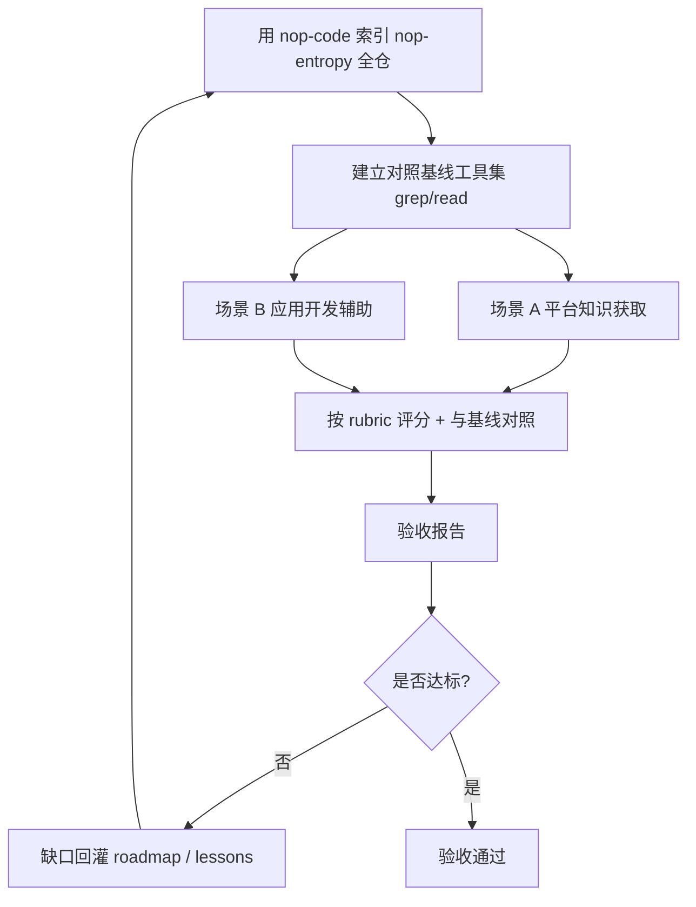

# nop-code AI 端到端验收设计

**日期**：2026-09-23
**范围**：以 nop-entropy 自身为索引对象的端到端 AI 验收（对应 roadmap `nop-code-feature-completion-roadmap.md` M9）
**状态**：目标架构（待 M1-M8 落地后执行）
**归属**：验收测试编排归 `nop-code` roadmap M9；测试资产（scenario 集、rubric、脚本）归 `ai-dev/`（非产品代码）

---

## 一、设计结论

1. **验收对象是"任务有效性"而非工具指标**：M9 回答"nop-code 能否有效支撑 AI 获取 Nop 平台知识、开发 Nop 应用"，区别于 N8.3 的工具自身指标（P/R/MRR/token）。
2. **索引对象是 nop-entropy 全仓**：自我索引（self-index）是最严苛的真实用例——多语言、大规模、语义密集，且平台知识有 docs-for-ai 作为 ground truth。
3. **两个场景**：A 平台知识获取（问答）、B 应用开发辅助（改造任务）。
4. **必须有对照基线**：实验组（AI + nop-code GraphQL）vs 基线组（AI + grep/read 文件工具），否则无法证明 nop-code 的增益。
5. **失败必须回灌**：验收发现的能力不足不得仅记录，须转为 roadmap 新 Work Item 或 `ai-dev/lessons/`，直至复测通过——这是"所有缺失功能补充完毕"的闭环保证。

---

## 二、背景与动机

M1-M8 逐项补全了 nop-code 的功能。但功能"存在"不等于"有效"。一个代码图工具的价值只能由**下游 AI 代理完成真实任务的成功率与效率**来判定。nop-code 的定位是"为 AI 辅助代码分析提供结构化索引"（`00-vision.md`），因此最终验收必须让 AI 代理**实际使用** nop-code 去完成 Nop 平台相关的真实任务。

nop-entropy 自身是最佳验收语料：
- 规模真实（大型多模块 Maven 工程）；
- 知识有权威 ground truth（`docs-for-ai/`）；
- 应用开发场景可直接用平台自身模式作为参考实现。

---

## 三、核心设计

### 3.1 验收流程

### 3.2 索引与基线（N9.1）

| 项 | 内容 |
|----|------|
| 索引对象 | nop-entropy 全仓（Java 为主 + 少量 TS/JS） |
| 记录项 | 符号数/边数/文件数、全量索引耗时、内存峰值、增量索引耗时 |
| 查询入口 | nop-code GraphQL（`/graphql`、`/r/{opName}` 等标准入口） |
| 对照基线 | 同一 agent 仅用 `grep`/`read_file`/`glob`（无 nop-code） |
| 公平性 | 实验组与基线组使用同模型、同任务、同时间预算、同 token 上限 |

### 3.3 场景 A：Nop 平台知识获取（N9.2）

**任务形态**：给定若干关于 Nop 平台的问题，agent 作答；答案对照 `docs-for-ai/` ground truth 评分。

**问题域覆盖**（建议 ≥20 题，按平台核心领域分层）：

| 领域 | 示例问题 |
|------|---------|
| BizModel/GraphQL | "BizModel 方法如何经 `IGraphQLEngine` 分发？" |
| ORM/codegen | "ORM 源模型到实体的生成链路有哪些阶段？" |
| Delta 定制 | "`x:extends` 的隐式 replace 语义是什么？" |
| IoC | "NopIoC 为什么注入不支持 private 字段？" |
| nop-wf | "审批流的会签/或签如何配置？" |
| nop-task | "task flow 与 BizModel 的分工？" |
| nop-batch | "batch 的 transactionScope 有哪几种？" |
| 关系定位 | "某个具体类/方法在哪个模块、被谁调用？" |

**评分维度**：

| 维度 | 判据 |
|------|------|
| 准确性 | 与 ground truth 一致的程度（人工或 LLM-judge，0-1） |
| 引用正确性 | 引用的符号/文件/行号真实存在且相关（可用 nop-code 自身校验） |
| 完整性 | 是否覆盖问题的关键点 |
| 效率 | 工具调用次数、token 消耗（对照基线） |

### 3.4 场景 B：应用开发辅助（N9.3）

**任务形态**：给定 Nop 应用开发任务，agent 用 nop-code 定位平台模式/参考实现后完成任务。

**任务集**（在独立的应用项目中进行，避免污染 nop-entropy）：

| 任务 | 验收方式 |
|------|---------|
| 新增实体 + CRUD 页面 | 应用项目构建通过 + 页面可渲染 + 遵循 `docs-for-ai` 约定 |
| 实现一个审批流 | 流程定义合法 + 审批链路可运行 |
| 编写一个 batch 任务 / task flow | 任务可执行 + 事务语义正确 |
| 扩展一个已有平台能力（Delta） | Delta 定制生效 + 不修改平台源码 |

**评分维度**：

| 维度 | 判据 |
|------|------|
| 任务完成度 | 交付物是否满足任务要求 |
| 构建/测试通过 | `./mvnw test` 或等价命令通过 |
| 平台合规 | 是否遵循 `docs-for-ai/` 约定（如模型优先、Delta 优先、不用 private 注入等） |
| 效率 | 工具调用次数、token（对照基线） |
| nop-code 利用率 | 探索类 API（意外连接/问题生成/Wiki）是否被实际调用并产生增益证据 |

### 3.5 成功判据（阈值）

| 判据 | 阈值（建议初值，执行前可调） |
|------|------------------------------|
| 场景 A 准确率 | 实验组 ≥ 基线组，且绝对准确率 ≥ 0.8 |
| 场景 A 引用正确率 | ≥ 0.9 |
| 场景 B 任务完成率 | ≥ 基线组，且构建/测试通过率 ≥ 0.8 |
| 效率增益 | 达同类任务时 token 或工具调用显著优于基线（如 ≤70%） |
| 有效利用 nop-code | 验收日志证明探索类 API 被调用且对结果有正贡献 |

> 若 M1-M8 中某项能力未被任务用到，需在报告中说明是"任务未覆盖"还是"能力无效"。

### 3.6 失败回灌（N9.4）

验收报告对每项未达标给出归因，并**强制**选择：
- **回灌 Work Item**：向 `nop-code-feature-completion-roadmap.md` 追加新 Work Item（如"某类查询覆盖不足"）；
- **回灌 lesson**：记录为 `ai-dev/lessons/` 的失败模式；
- 复测通过前，M9 不可标 `done`，MG 不可收口。

---

## 四、拒绝了什么

| 方案 | 拒绝理由 |
|------|---------|
| 只用合成/小型语料做验收 | 无法暴露真实规模下的图遍历、搜索、上下文构建问题；nop-entropy 自我索引才是真实压力 |
| 只测工具自身指标（P/R/MRR） | 那是 N8.3 的职责；M9 测的是任务有效性，指标高不代表 AI 能用好 |
| 无对照基线 | 无法证明 nop-code 的增益，验收结论不可信 |
| 用 LLM-judge 单独定论 | 准确性评分可借助 LLM-judge，但关键任务（场景 B 构建/测试）以可执行结果为判据 |
| 验收失败仅记录不回灌 | 违背"所有缺失功能补充完毕"的使命；必须闭环 |

---

## 五、与已有设计的关系

| 主题 | 文档 | 关系 |
|------|------|------|
| 产品定位、成功标准 | `00-vision.md` §二 | 本验收直接检验成功标准的达成 |
| 图探索与导出能力 | `graph-discovery-and-export-design.md` | 场景 A/B 中验证探索类 API 的实际使用与增益 |
| GraphQL 查询 API | `query-api-design.md` | 场景的查询入口 |
| 工具自身评测 | `nop-code-feature-completion-roadmap.md` N8.3 | N8.3 测指标，本设计测任务有效性，互补不重叠 |
| 功能补全工作队列 | `nop-code-feature-completion-roadmap.md` M9 | 本设计是 M9 的验收契约 |
