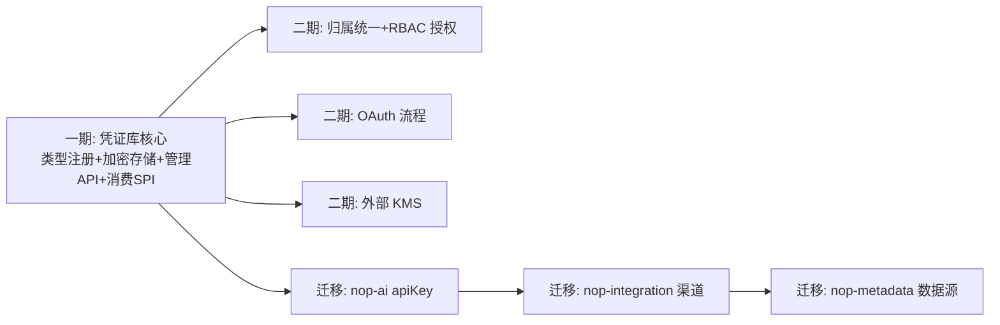

# nop-credential Vision

**日期**：2026-08-10（更新于 2026-08-10）
**状态**：active
**范围**：`nop-credential`（新建可复用业务模块，复用 nop-commons 既有密码学原语）
**灵感来源**：n8n Credential 系统（类型化凭证 + AES 加密存储，实现于 n8n packages/core/src/credentials.ts）、geekai API KEY 池（多厂商 key 轮询，见 geekai api/store/model/）

---

## 一、产品定位

nop-credential 是 Nop 平台的**统一加密凭证库**：为平台内所有需要连接第三方系统/模型/数据源的场景，提供"凭证类型注册 → 加密存储 → 受控取用"的完整生命周期管理。

一句话：**平台中连接第三方系统的敏感参数不再明文存放于 DB 列或配置文件，统一收敛到加密凭证库，通过 ID 引用取用。**

凭证（Credential）的定义边界：

- 是"一组连接第三方系统的敏感参数"（API Key、Secret、OAuth Token、JDBC 密码等），而不是"用户的认证身份"（后者属于 nop-auth）
- 是平台级共享资源，可被多个业务模块消费（nop-ai 模型 Key、nop-integration 渠道密钥、nop-metadata 数据源密码、未来 nop-wf/nop-task 集成节点）
- 是服务端资源，明文永不跨出服务进程边界（不通过 GraphQL/REST 返回明文）

## 二、成功标准

1. **零明文**：平台内新建的第三方密钥默认入库即加密；存量明文列（`NopAiModel.apiKey` 等）提供迁移路径
2. **类型化**：凭证类型（字段结构）声明式注册（credential-type.xdef 元模型 + `*.credential-type.xml` 实例文件），支持 delta 定制与版本演进
3. **可审计**：凭证生命周期（创建/更新/删除/轮换）有操作日志（复用 nop-sys 的 ChangeLog 机制）
4. **可轮换**：主密钥支持多 key 并存与切换，轮换时旧密文仍可解密，提供批量重加密能力
5. **取用受控**：明文取用只通过服务端 SPI，REST/GraphQL 层结构性不可达（只出 masked 值）
6. **开箱可用**：管理 API（CRUD）+ 配置加密复用平台既有 `@sec:` 机制，业务集成成本低

## 三、Non-Goals（显式不做）

1. **不做认证身份库**：不替代 nop-auth 的用户/角色/会话体系；凭证授权（谁可以用哪个凭证）一期只做"管理员管理 + 服务端 SPI 消费"，RBAC 细粒度授权与凭证归属统一（系统级/用户级）留待二期；**不做凭证模块内租户隔离**（租户为平台全局可开启能力）
2. **不做外部 KMS/HSM 集成**：一期主密钥来自环境变量/独立配置文件，外部 KMS（Vault/KMS 等）留待二期 SPI
3. **不做 OAuth 流程引擎**：一期只加密存储 OAuth Token（由消费方获取后存入），不内置授权码换取/刷新闭环；OAuth 完整流程留待二期（可复用 nop-auth-sso 的 OAuth 客户端能力）
4. **不重复实现密码学**：加密复用平台既有 `nop-commons` 的 `AESTextCipher`（AES-256-GCM + PBKDF2-SHA256 版本化密文），凭证库只在其上增加"多密钥标识"包装层
5. **不做配置值加密**：`application.yaml` 等配置文件中的敏感值继续用平台既有 `@sec:` 机制加密，凭证库不接管配置项；凭证库解决的是 **DB 行级敏感数据**的加密存储（配置加密解决不了的场景）
6. **不做密码学创新**：加密方案采用业界标准（AES-256-GCM + PBKDF2/HKDF），不实现自研算法

## 四、设计收敛路径

一期交付：`nop-credential` 模块（类型注册/加密存储/管理 API/消费 SPI/web 管理页）+ 存量明文列迁移方案（迁移动作列二期）。

## 五、边界约束（不可违反）

1. **依赖方向**：`nop-credential-api` 零业务依赖（只依赖 nop-api-core/nop-commons）；`nop-credential-dao` 依赖 api + orm；消费方（nop-ai/nop-integration/nop-metadata）依赖 `nop-credential-api`（接口契约）+ `nop-credential-service`（实现 bean），不依赖 web/meta 层；任何模块不得反向依赖 `nop-credential-web`
2. **明文边界**：解密只发生在 service 层 SPI（`ICredentialProvider` 实现），REST/GraphQL 层结构性不可达——BizModel 只暴露 mask 系列方法，`data` 密文列在 xmeta 中默认不透出
3. **加密格式版本化**：凭证密文带版本前缀 `cv1:`（与平台既有 `v1:` 标记并存不冲突，见 Architecture §3.2），为密钥轮换预留空间
4. **模块命名**：模块名 `nop-credential`（符合平台可复用业务模块惯例，如 nop-retry/nop-tcc/nop-file）；不使用 `nop-secret`（与 nop-security 易混淆）
