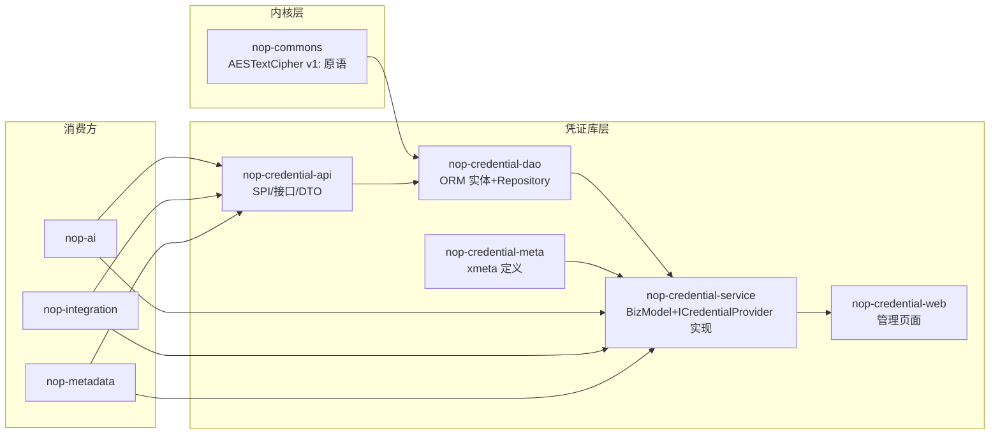

# nop-credential Architecture Baseline

**日期**：2026-08-10（更新于 2026-08-10）
**状态**：active
**范围**：`nop-credential`（新建模块）、复用 `nop-kernel/nop-commons`（密码学原语）
**灵感来源**：n8n Credential 系统（类型化凭证 + AES 加密存储，实现于 n8n packages/core/src/credentials.ts）

---

## 一、设计结论

1. **新增独立可复用模块 `nop-credential`**（标准分层：api/dao/meta/service/web + model/orm.xml），承载凭证库全部业务能力；**不新增密码学原语**——复用 `nop-commons` 既有 `AESTextCipher`（AES-256-GCM + PBKDF2-SHA256 版本化密文）
2. **加密方案**：凭证密文采用 `cv1:` 版本前缀格式（`cv1:{keyId}:{v1密文}`），多 key 并存支持主密钥轮换；算法参数与既有 `v1:` 格式完全一致（12B IV + 16B GCM tag + PBKDF2-SHA256 65536 迭代）
3. **凭证模型**：`NopCredential`（实例表，敏感数据加密列）；**凭证类型用平台标准 register-model 机制声明**——`credential-type.xdef` 元模型 + `*.credential-type.xml` 实例文件（`_vfs/nop/credential/types/`），经 `ResourceComponentManager` 加载（自动获得 x:extends delta 定制）
4. **消费方式**：服务端 SPI `ICredentialProvider` 取用（解密）+ 管理 CRUD（BizModel，只出 masked 值）
5. **一期边界**：不做 RBAC 细粒度授权/租户隔离/OAuth 流程/外部 KMS（见 Vision §3）；不做 `@credential:` 配置 resolver（见 §4 拒绝了什么——配置加密复用既有 `@sec:`）

## 二、背景与动机

### 2.1 现状盘点：平台已有能力 vs 真实缺口

**平台已有（本次设计不重复建设）**：

| 位置 | 能力 |
|---|---|
| `nop-kernel/nop-commons/.../crypto/impl/AESTextCipher.java` | 对称加密原语：AES/GCM/NoPadding、随机 IV、PBKDF2-SHA256（65536 迭代）派生密钥、版本化密文 `v1:` 前缀 |
| `nop-core-framework/nop-config/.../enhancer/DefaultConfigValueEnhancer.java` | 配置值增强：`@sec:` 前缀解密加密配置值（`IConfigValueEnhancer` 装配 AESTextCipher） |

**真实缺口（凭证库要解决的）**——DB 行级敏感数据的加密存储与类型化管理：

| 位置 | 现状 | 风险 |
|---|---|---|
| `nop-ai/model/nop-ai.orm.xml` | `NopAiModel.apiKey` DB 明文列（`api_key` VARCHAR） | DB 泄露即 Key 泄露 |
| `nop-auth/nop-auth-sso/.../SsoConfig.java` | `clientSecret` 明文配置项 | 配置文件泄露 |
| `nop-integration-*`（oss/email/sms/feishu） | `secretKey` 等全部 `@cfg:` 明文注入 | 同上 |
| `nop-metadata/model/nop-metadata.orm.xml` | `NopMetaDataSource.connectionConfig` JSON 列（`tagSet="sensitive"`，仅标记无强制处理） | DB 泄露 |

**结论**：`@sec:` 只能加密**配置文件中的静态值**（启动期解密一次）；无法解决 **DB 行级动态数据**（如 `NopAiModel.apiKey` 这种运行期写入的列）的加密存储，也无法提供类型注册/连通性测试/密钥轮换等管理能力。这正是凭证库的定位。

**需求来源**：n8n 对比调研结论——n8n 有类型化凭证（AES 加密 + OAuth + RBAC），Nop 平台无对应能力，属"真实差距"。n8n 凭证系统要素：类型注册、加密存储、认证方式（authenticate）、连通性测试（test）、OAuth、共享授权。本设计一期覆盖"类型注册 + 加密存储 + 认证方式声明 + 连通性测试"，OAuth/RBAC/租户隔离留二期。

### 2.2 与既有 `@sec:` / `v1:` 的关系

- `@sec:`（配置值加密）与凭证库是**互补**关系：配置文件中不可变密钥用 `@sec:`（无需新建机制）；DB 行级、可管理、可轮换的凭证用凭证库
- 凭证密文格式 `cv1:` 与既有 `v1:` 标记**前缀不同、互不歧义**（`v1:` 的解析器见 `AESTextCipher.decrypt()`，`cv1:` 由其上层凭证库解析）；`cv1:` 内部 payload 就是标准 `v1:` 密文，算法完全复用

## 三、核心设计

### 3.1 模块分层与依赖方向



- `nop-credential-api`：零业务依赖（仅 nop-api-core/nop-commons）；含 `ICredentialProvider` 接口、`CredentialData`/`MaskedCredential`/`TestResult` DTO
- `nop-credential-dao`：依赖 api + orm；ORM 实体 + `ICredentialDao`（存取委托）
- `nop-credential-meta`：xmeta 定义（`data` 列不透出、mask 映射等）
- `nop-credential-service`：依赖 dao + meta + biz + config；`ICredentialProvider` 实现（唯一解密点）、`NopCredentialBizModel`（管理 CRUD）、凭证类型注册表
- `nop-credential-web`：AMIS 管理页面
- 消费方（nop-ai/nop-integration/nop-metadata）依赖 **api（接口）+ service（bean 实现）**，经 `ICredentialProvider` 取用；明文边界见 §3.4

### 3.2 加密方案（复用 + 多密钥包装）

**复用**：`AESTextCipher`（`nop-commons`）作为每个密钥的单钥加密器——AES/GCM/NoPadding、随机 12B IV、PBKDF2-SHA256(65536) 派生、`v1:` 输出。

**凭证库层新增**（`io.nop.credential.crypto`，位于 `nop-credential-service`）：

- `ICredentialKeyProvider`：`getActiveKeyId(): String` / `getKey(keyId): ITextCipher`；多 key 并存（轮换期新旧 key 同时有效）
- `CredentialCipher`：`encrypt(plain, keyId)` 输出 **`cv1:{keyId}:{v1密文}`**；`decrypt(cv1text)` 解析 keyId 后委托对应 `AESTextCipher` 解内层 `v1:` 密文
- 主密钥来源：环境变量/独立配置文件（**不放入 application.yaml 明文**），如 `NOP_CREDENTIAL_MASTER_KEYS` 或独立 `credential-keys.yaml`（`@cfg:` 可注入环境变量）；格式为 `keyId:passphrase` 列表
- **keyId 约束**：只允许 `[A-Za-z0-9_-]`（`cv1:` 按冒号 split 无歧义的前提；base64 payload 无冒号，解析安全）
- **轮换**：新增 key 后 `getActiveKeyId()` 指向新 key，新写入用新 key；旧密文按 `cv1:` 中的 keyId 仍可用旧 key 解密；提供 `reencryptAll` 批量重加密（service 层循环 DAO 重写，逐条提交可断点续跑）

```
cv1 格式: cv1:{keyId}:{v1密文}
内层 v1 密文: v1:{base64(iv || ciphertext+tag)}   # 与 AESTextCipher.encryptVersioned 输出一致
```

### 3.3 数据模型

ORM 模型（model/nop-credential.orm.xml，实施时创建）：

**凭证类型（无 DB 表，register-model 机制声明）**：

- **元模型**：定义 `credential-type.xdef`（`nop-kernel/nop-xdefs/.../schema/credential/credential-type.xdef`），声明凭证类型的结构：`name`、`version`、`fields`（字段定义数组：name/label/type/`sensitive` 标记/默认值/是否必填）、`authType`（`none`/`apiKey`/`basic`/`oauth2` 声明）、`testUrl`/`testAuth`（连通性测试，可选）
- **实例文件**：`*.credential-type.xml`（或 JSON 格式）放在 `_vfs/nop/credential/types/`，如 `openai.credential-type.xml`；经 register-model.xml（`credential-type.register-model.xml`，参照 `nop-ai-toolkit` 的 `ai-tool.register-model.xml`）注册
- **加载**：经 `ResourceComponentManager` 加载（`ICredentialTypeRegistry` 封装），自动获得平台标准能力：x:extends delta 定制、XML/JSON 格式切换、模型校验；dev 模式支持文件 reload
- **演进**：字段结构变更通过定义文件 `version` 字段管理（旧版本凭证的 data JSON 在取用时按当前 schema 兼容解析，缺失字段返回 null）

**NopCredential（实例表）**：

| 字段 | 说明 |
|---|---|
| id / name / typeName | 类型引用（typeName 对应 credential-type.xml 注册名） |
| data | **加密列**（`cv1:` 密文 JSON：`{field: value}`） |
| status | enabled/disabled |
| deleted | 软删除标记（true=已删，物理清理二期） |
| usageScope | 使用范围声明（`instance`，一期仅声明；租户/项目维度二期） |
| lastUsedAt / expireAt | 审计与过期 |
| testResult | 最近一次连通性测试结果 |
| version / updateTime / createdBy | 通用审计字段（变更日志复用 nop-sys ChangeLog，`tagSet="audit"`） |

**NopCredentialUsage（引用登记表，一期建）**：`credentialId` + `consumerRef`（消费方标识，如 `ai:NopAiModel:123`）+ 唯一约束（credentialId, consumerRef）；`registerUsage` 幂等写入、`unregisterUsage` 删除；删除凭证前按该表检查引用计数（>0 拒绝删除并提示先解绑）。

无独立类型表；`NopCredential.typeName` 与 credential-type.xml 定义文件对应，字段结构演进通过定义文件 `version` 管理。

### 3.4 API 契约

**消费 SPI（api 层，消费方用）**：

```
ICredentialProvider
  getCredential(credentialId): CredentialData       # 解密后数据，仅服务端 Java 代码可调
  getCredentialData(credentialId, field): Object    # 取单个字段（如 apiKey）
  testCredential(credentialId): TestResult          # 连通性测试
  mask(credentialId): MaskedCredential              # 脱敏展示值（REST/GraphQL 层用）
  registerUsage(credentialId, consumerRef): void    # 消费方绑定凭证时登记引用（幂等）
  unregisterUsage(credentialId, consumerRef): void  # 解绑/替换时解除引用（自动递减旧值）
```

**明文边界（结构性强制，非约定）**：

- 接口 + DTO 在 api 层，**实现类在 service 层**；`getCredential/getCredentialData` 不暴露为任何 BizModel/GraphQL 方法
- `NopCredentialBizModel` 只暴露 `save/delete/get/findPage/test/maskList/reencryptAll`；xmeta 中 `data` 列 `published="false"`（不对外生成 GraphQL 字段），`findPage` 返回的 `data` 恒为 null（BizModel 层在返回前强制置空）；展示层用 `maskList` 输出脱敏值
- 消费方获取明文 = 依赖 `nop-credential-service` 的 bean（`@Inject ICredentialProvider`），这是"服务端代码"的显式声明

**管理 CRUD（BizModel，GraphQL/REST）**：

```
NopCredentialBizModel
  save / delete / get / findPage / maskList   # 标准 CrudBizModel 语义（data 恒脱敏，maskList 出脱敏值）
  typeList()                                  # 返回类型字段 schema（web 动态表单用）
  test(credentialId)                          # 触发连通性测试
  reencryptAll()                              # 主密钥轮换后批量重加密（仅 admin）
```

**配置值加密（不新建 resolver）**：

- 配置文件中的静态密钥继续用既有 `@sec:`（如 `oss.secret-key = @sec:xxxx`），无需凭证库
- 凭证库服务的场景是 DB 行级数据（业务实体敏感列），由业务代码经 `ICredentialProvider` 取用

**nop-ai 运行时消费集成点（W7-successor，2026-08-13 落地）**：

- **集成层裁决**：在 nop-ai-api 引入 SPI `IAiModelCredentialResolver`（纯加法，跨模块 SPI 载体），impl
  `AiModelCredentialResolverImpl` 在 nop-ai-service（持 nop-ai-dao + nop-credential-api）。钩点为
  `ChatServiceImpl.buildHttpRequest`（stream/非 stream 共同的唯一 apiKey 解析点）。`nop-ai-core` 不直接依赖
  DAO/credential，经此可注入抽象解耦。
- **apiKey 优先级链**：`accountKey > credentialId > resolveApiKey(config-var/secret-file)`。accountKey
  （coordinator FALLBACK 显式纠正账号）优先；credentialId（DB 凭证）次之；config 变量最低。未配
  credentialId / resolver 未装配 → 回退 resolveApiKey（零回归）。
- **查找键/粒度**：`provider + modelName` 精确匹配 `NopAiModel` 注册。`.llm.xml` modelName ↔
  `NopAiModel.modelName` 不对应（模型仅在 .llm.xml 存在）= 显式回退 + WARN 审计（非报错）。
- **fail-closed**：credentialId 非空但凭证缺失/软删/解密失败/字段空 → 抛 `NopException` 中止调用（强
  fail-closed，不静默回退到 config 变量）。credentialId 为空 → 回退（正常兼容路径，非异常）。
- **装配**：nop-ai-service 依赖 nop-credential-api（compile）；`ICredentialProvider` 经 `@Nullable` 可选注入
  （部署不含 nop-credential 时为 null，credentialId 空→回退、credentialId 非空→fail-closed）。ChatServiceImpl
  经 `@Inject @Nullable` 引用 resolver bean（无 nop-ai-service 时为 null → 零回归）。消费 app 含
  nop-credential-service 时需 import `credential-defaults.beans.xml`。
- **consumerRef 约定**：`ai:NopAiModel:<modelId>`（NopAiModelBizModel.save 时 register/unregister）。

### 3.5 消费方迁移路径

| 消费方 | 现状 | 迁移 |
|---|---|---|
| nop-ai `NopAiModel.apiKey` | 明文列 | ✅ **已落地（W7 + W7-successor，2026-08-13）**：可选字段 `credentialId`（关联凭证库，propId=17）；apiKey 列保留兼容。运行时消费经 `IAiModelCredentialResolver`（nop-ai-api SPI）+ `AiModelCredentialResolverImpl`（nop-ai-service）接入 `ChatServiceImpl.buildHttpRequest`，优先级链 `accountKey > credentialId > resolveApiKey`，fail-closed。引用计数 `ai:NopAiModel:<modelId>` 在 NopAiModelBizModel.save 接线。详见 §3.4「nop-ai 运行时消费集成点」。 |
| nop-integration OSS/邮件/短信/飞书 | `@cfg:` 明文 | 静态密钥改用 `@sec:` 加密（立即可做）；需要运行期管理的场景改用 `ICredentialProvider` |
| nop-metadata 数据源 | connectionConfig JSON 列 | `tagSet="sensitive"` 字段改为经凭证库取用，二期执行 |

**删除语义（一期定义）**：凭证删除采用**软删除**（`status=disabled` + `deleted=true` 标记），不物理删除；`ICredentialProvider` 取用时跳过 `deleted=true` 记录（fail-closed：取不到抛错，不静默用空值）。引用机制：消费方绑定凭证时经 `registerUsage` 登记（`NopCredentialUsage` 表），替换/解绑时 `unregisterUsage` 解除；删除前检查引用计数，>0 拒绝删除（提示先解绑）；物理清理（deleted 记录 + 引用表归档）列二期。

**Web 管理页（动态表单，一期定案）**：AMIS 页面按类型动态渲染表单——`NopCredentialBizModel.typeList()` 返回 `ICredentialTypeRegistry` 中的类型字段 schema，type 选择后前端动态生成 AMIS form；字段 `type` 词汇枚举：`string`/`password`/`number`/`select`/`boolean`/`textarea`（password 类型自动打码回显）。

## 四、拒绝了什么

| 方案 | 拒绝理由 |
|---|---|
| **凭证库并入 nop-sys** | nop-sys 定位是系统管理（序列号/字典/i18n/事件/锁），凭证是"连接第三方系统的敏感参数"，生命周期（类型注册/轮换/测试）与字典等差异大；且 nop-sys 不依赖 nop-auth，凭证未来 RBAC 需要时引入依赖会污染 nop-sys 边界 |
| **凭证库并入 nop-auth** | 凭证 ≠ 认证身份；nop-auth 是用户认证域，混入第三方连接密钥会职责膨胀；且 nop-ai/nop-integration 不应被迫依赖 nop-auth |
| **凭证库并入 nop-integration** | nop-integration 是纯配置 Bean 模块（无 ORM 模型），且凭证消费方还包括 nop-ai/nop-metadata，放 integration 会造成这些模块反向依赖 |
| **仅扩展 nop-security 不做独立模块** | nop-security 是内核层（不依赖 ORM/BizModel），无法承载 ORM 实体/管理 API/后台页面；对称加密原语**已在更底层 nop-commons 存在**，无需在 nop-security 重复建设；凭证库独立成模块是分层最干净的做法 |
| **只依赖 `@sec:` 配置加密，不建凭证库** | `@sec:` 只能加密配置文件中的静态值（启动期一次解密），无法解决 DB 行级动态数据（`NopAiModel.apiKey`）加密存储，也无类型注册/测试/轮换能力；两者互补，非替代 |
| **用 nop-dyn 运行时动态实体承载凭证类型** | nop-dyn（运行时定义实体/属性）能实现运行期动态表单，但引入重依赖（运行时 schema 解释），且凭证类型是低频变更的声明式资源（XDef 定义文件即可），不需要运行期动态建模；XDef 方式编译期校验、delta 定制友好、更轻。若未来需要运行期自定义凭证类型，可在凭证库上层基于 nop-dyn 扩展（二期可选） |
| **自研加密算法 / 门限密钥** | 非必要复杂度；AES-256-GCM + PBKDF2 是业界标准，平台 `AESTextCipher` 已实现，复用即可 |
| **`@credential:` 配置 resolver（一期）** | 平台无通用 value resolver 链：IoC 的 `@bean:/@cfg:` 前缀集合封闭（未知前缀启动失败）；`IConfigValueEnhancer` 在配置加载期运行，调用 service 层 `ICredentialProvider` 存在启动顺序/循环依赖问题（enhancer 装配早于 IoC bean）；配置场景复用既有 `@sec:` 已满足需求，`@credential:` resolver 列为二期可选（需先解决启动顺序） |

## 五、与已有设计的关系

- **上游复用**：`nop-kernel/nop-commons` 的 `AESTextCipher`/`ITextCipher`（加密原语，不修改）；`nop-config` 的 `DefaultConfigValueEnhancer`/`@sec:`（配置加密，不修改）
- **下游**：`nop-ai`（`NopAiModel.apiKey` 迁移，见 `docs-for-ai/03-modules/nop-ai.md`）、`nop-integration`（渠道密钥引用）、`nop-metadata`（数据源密码引用）
- **参照**：n8n 凭证系统（类型化 + AES 加密 + OAuth + RBAC，见 n8n packages/core/src/credentials.ts）——本设计一期覆盖类型化/加密/测试，OAuth/RBAC 为二期
- **平台惯例**：可复用业务模块分层参照 `nop-retry/`、`nop-file/`（api/dao/meta/service/web + model/orm.xml）；类型注册参照 `nop-ai-toolkit` 的 register-model.xml 机制（`ai-tool.register-model.xml` + `*.tool.xml`）
- **约束**：本设计遵循 `docs-for-ai/02-core-guides/model-first-development.md`（model/orm.xml 为唯一源头）与 `docs-for-ai/02-core-guides/api-and-graphql.md`（CrudBizModel 自动 CRUD 惯例）
