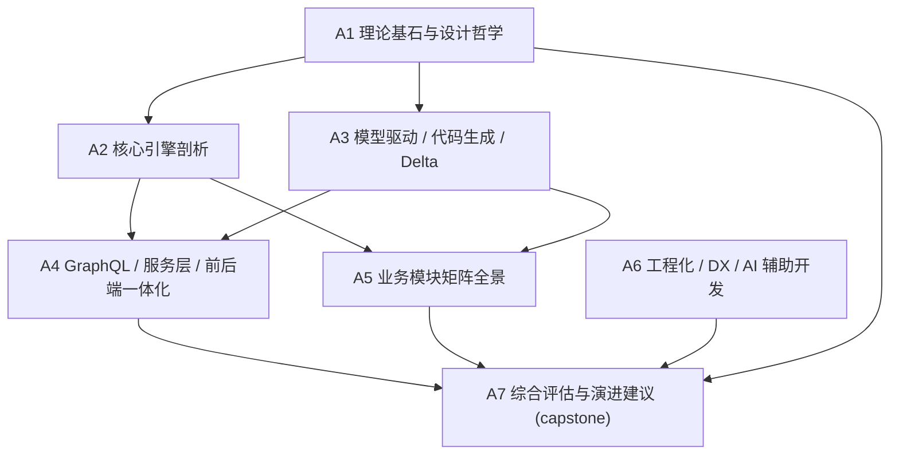

# nop-entropy 平台深度分析与下一代框架对标 Roadmap

> Last Updated: 2026-07-24
> Sources:
> - 平台使用文档 `docs-for-ai/`（`INDEX.md` 为导航基线，`04-reference/source-anchors.md` 为实现锚点）
> - 理论文档语料 `docs/theory/`（可逆计算 / XLang / XDSL / GRC 等）
> - 架构与介绍 `docs/arch/`、`docs/nop-intro.md`、`docs/why-nop.md`、`docs/intro/intro.md`
> - 既有深度分析 `ai-dev/analysis/`（数十份对比/评估报告）
> - 模块设计 `ai-dev/design/<module>/`
> - 对比资料 `docs/compare/`
> - **联网调研**：各章节需调研并引用下一代 / 同类框架（web search，附来源链接）

## Purpose

本 roadmap 驱动对 nop-entropy 平台**设计与实现**的系统性深度分析，并**联网对标下一代框架技术**，最终产出一份综合性的「深度介绍材料」。

该材料先作为**分析型产出**沉淀到 `ai-dev/analysis/`；是否进一步迁移到 `docs-for-ai/`、或作为平台下一步发展路线图的输入，待 A7 综合评估后由人决策。

**本文是编排层，不是 execution plan。** 每个工作项的逐项调研范围、写作大纲、引用清单在各 plan 文件，不在本 roadmap 重复。审计发现、设计评价也各有归属，不在此维护。

## Work Item Status

> **全文件唯一的动态状态区。更新状态只改这里。**
> 状态流转：draft review 通过 → `todo` 改 `planned`；closure audit 通过 → `planned` 改 `done`（不得提前）。
>
> **注意**：header 必须为 `## Work Item Status`，mission-driver 的 `roadmap-check.mjs` 只识别此标题或 `## 阶段状态`。

- A1. 理论基石与设计哲学（可逆计算 / XLang / XDSL / XDef）+ 联网对标模型驱动与 DSL 理论: `done`
- A2. 核心引擎剖析（nop-core / xlang / xdef / dao / graphql / NopIoC）+ 联网对标 Spring 生态与云原生框架: `done`
- A3. 模型驱动开发、代码生成与 Delta 定制 + 联网对标代码生成生态: `done`
- A4. GraphQL 引擎、服务层与前后端一体化渲染 + 联网对标 GraphQL / BFF / 低代码前端: `done`
- A5. 业务模块矩阵全景与定位 + 联网对标各领域竞品: `done`
- A6. 工程化、开发者体验与 AI 辅助开发（mission-driver / cli / AutoTest / e2e / 文档体系）+ 联网对标 AI 开发工具链: `planned`
- A7. 综合评估、下一代框架对标与平台演进建议（capstone 深度介绍材料）: `todo`

## Status Values

| Status | 含义 |
|--------|------|
| `done` | 该工作项分析已完成，对应 plan 通过 closure audit（结论经源码交叉核对） |
| `planned` | 已有 execution plan，等待执行 |
| `todo` | 尚未开始，无对应 plan |

## Platform Reuse

以下既有材料是分析的基础输入，**应综合引用，不得重写或重复造轮子**：

| 能力 / 资料来源 | 提供方 | 说明 |
|------|--------|------|
| 可逆计算理论语料 | `docs/theory/` | `reversible-computation*.md`、`xlang-explained*.md`、`xdsl-design.md`、`grc-explained.md`、`generalized-reversible-computation-paper*.md` 等 |
| 平台使用规范 | `docs-for-ai/` | `INDEX.md` 导航、`02-core-guides/` 核心模式、`04-reference/source-anchors.md` 实现锚点 |
| 架构白皮书 | `docs/theory/nop-platform-architecture-white-paper.md`、`docs/arch/` | 整体架构权威描述 |
| 既有对比分析 | `ai-dev/analysis/` | 工作流 / 调度 / 流处理 / AI Agent / 代码生成等多份对比报告，直接复用结论 |
| 模块设计 | `ai-dev/design/<module>/` | 各模块 vision / architecture-baseline，实现现状权威 |
| 对比资料 | `docs/compare/` | 与 Spring / 其他框架的既有对比 |
| 联网调研 | web search 工具 | 各章节调研下一代 / 同类框架，**必须附来源链接** |

## Current Baseline

**已有的介绍性材料（碎片化）：**
- `docs/nop-intro.md`、`docs/why-nop.md`、`docs/intro/intro.md`：高层入门，覆盖面有限
- `docs/theory/`：理论深度充足，但偏理论阐述、缺工程实现映射与下一代对标
- `ai-dev/analysis/`：专题对比丰富，但分散、未汇总为统一介绍
- `docs-for-ai/`：面向「使用」的操作手册，非面向「理解整体设计」的介绍

**主要缺口（本 roadmap 要补齐）：**
- 缺一份**综合性的深度介绍**：把理论 → 核心引擎 → 模型驱动 → 服务/前后端 → 模块生态 → 工程化/DX 串成一条完整脉络
- 缺**联网对标下一代框架**的系统性对照（云原生框架、AI 原生开发、低代码、代码生成等趋势）
- 缺面向**平台下一步演进**的定位与建议

## Work Items

> 此处按工作项摘要交付范围。**逐项调研大纲、引用清单、写作细节**在 plan 文件。

### A1. 理论基石与设计哲学

> Status: 见顶部 Work Item Status

**Goal：** 阐明可逆计算原理如何在 nop-entropy 中落地为 XLang / XDSL / XDef 三件套，建立后续章节的统一词汇表。

**Deliverables：**
- 一份分析文档 `ai-dev/analysis/2026-07/2026-07-24-nop-theory-foundation.md`
- 覆盖：可逆计算（GRC）核心公理、`x:extends` / Delta 合并、XDef 元模型驱动、XDSL 可叠加语言、`xpl` 模板与作用域
- **联网调研**：对标模型驱动开发（MDSD）、Language Workbench（JetBrains MPS / projectional editing）、Delta-Oriented Programming、双向变换（bx/lenses），说明 nop 的差异化定位

**Out of scope：** 核心引擎内部实现细节（A2）、代码生成管线（A3）。

**Module / area：** `docs/theory/`、`nop-core`、`nop-xlang`、`nop-xdef`。

### A2. 核心引擎剖析

> Status: 见顶部 Work Item Status

**Goal：** 剖析平台骨架模块如何协作支撑「可逆计算」在运行时的执行。

**Deliverables：**
- 分析文档 `ai-dev/analysis/2026-07/2026-07-24-nop-core-engine-deep-dive.md`
- 覆盖：`nop-core`（核心抽象）、`nop-xlang`（DSL 解析与 Delta）、`nop-xdef`（元模型）、`nop-dao`（ORM/EQL）、`nop-graphql`（GraphQL 引擎）、NopIoC（与 Spring 的关键差异：字段注入可见性、无注解扫描、`beans.xml` 发现）
- **联网调研**：对标 Spring（Boot/Context）、Quarkus、Micronaut、Helidon 的 IoC / 核心抽象 / 启动模型，给出工程权衡对比

**Out of scope：** ORM 模型设计规范（A3 的 model-first）、GraphQL CRUD 自动暴露细节（A4）。

**Module / area：** `nop-core`、`nop-kernel`、`nop-xlang`、`nop-xdef`、`nop-dao`、`nop-graphql`、`docs-for-ai/02-core-guides/`。

### A3. 模型驱动开发、代码生成与 Delta 定制

> Status: 见顶部 Work Item Status

**Goal：** 讲清「先模型、再 Delta、最后 Java」的开发范式与代码生成链路。

**Deliverables：**
- 分析文档 `ai-dev/analysis/2026-07/2026-07-24-nop-model-driven-and-codegen.md`
- 覆盖：ORM `*.orm.xml` model-first、`_gen/` 与 `_*.java`/`_*.xml` 生成物、codegen 模板、Delta 定制（`post-eval`/差量）、生成物不可手改的约束
- **联网调研**：对标 JHipster、OpenAPI Generator、Spring Initializr、Annotation Processor / build-time codegen（如 AutoValue/Immutables/RecordBuilder）、Meta-Programming System，说明「生成即一等公民」的差异

**Out of scope：** 具体业务实体的字段设计（数据库设计规范另由 skill 承担）。

**Module / area：** `nop-dao`、`nop-code`、各模块 `model/*.orm.xml`、`_gen/`、`docs-for-ai/02-core-guides/model-first-development.md`。

### A4. GraphQL 引擎、服务层与前后端一体化渲染

> Status: 见顶部 Work Item Status

**Goal：** 剖析从数据模型到 GraphQL API 再到前端渲染的一体化链路。

**Deliverables：**
- 分析文档 `ai-dev/analysis/2026-07/2026-07-24-nop-graphql-service-frontend.md`
- 覆盖：GraphQL 自动暴露（`CrudBizModel`、`@BizModel`/`@BizMutation`）、xbiz、服务层约定、AMIS / Flux 渲染管线、xmeta 字段可见性
- **联网调研**：对标 Spring for GraphQL、Hasura、Supergraph/Federation、BFF 模式、低代码前端（AMIS 同类如 Formily/Lowcode Engine），说明前后端一体化的取舍

**Out of scope：** 具体权限模型实现（属 auth 模块专题，A5 概览）。

**Module / area：** `nop-graphql`、`nop-biz`、`nop-service-framework`、`nop-frontend-support`、`docs-for-ai/02-core-guides/api-and-graphql.md`、`service-layer.md`。

### A5. 业务模块矩阵全景与定位

> Status: 见顶部 Work Item Status

**Goal：** 给出平台模块生态的全景图与各模块定位，避免把平台讲成「单一能力」。

**Deliverables：**
- 分析文档 `ai-dev/analysis/2026-07/2026-07-24-nop-module-matrix.md`
- 覆盖：`nop-auth`（权限/认证）、`nop-wf`（工作流）、`nop-task`/`nop-job`（任务/调度）、`nop-ai`（AI Agent）、`nop-rule`（规则）、`nop-report`（报表）、`nop-batch`（批处理）、`nop-stream`（流处理）、`nop-code`（低代码）、`nop-metadata`（元数据治理）等模块矩阵 + 依赖关系
- **联网调研**：逐领域对标主流竞品（工作流 Flowable/Camunda、调度 XXL-Job/PowerJob/SnailJob、规则 Drools、流 Flink、AI 编排 LangGraph/Agno、元数据 DataHub/OpenMetadata）——优先复用 `ai-dev/analysis/` 既有对比结论

**Out of scope：** 单模块的逐行实现审计（以模块设计文档 `ai-dev/design/<module>/` 为准，引用即可）。

**Module / area：** 全平台业务模块、`docs-for-ai/03-modules/`、`docs-for-ai/01-repo-map/module-groups.md`。

### A6. 工程化、开发者体验与 AI 辅助开发

> Status: 见顶部 WorkItem Status

**Goal：** 评估平台在工程化、可测试性与 AI 协同开发上的能力与差异化。

**Deliverables：**
- 分析文档 `ai-dev/analysis/2026-07/2026-07-XX-nop-engineering-dx-ai-dev.md`
- 覆盖：mission-driver 自动开发闭环、nop-cli 脚手架、AutoTest、`nop-entropy-e2e`（Playwright）、文档体系（`docs-for-ai/` 作为 AI 运行手册）、可逆计算对 AI 生成代码的友好性
- **联网调研**：对标 AI 驱动开发工具链（Devin、Cursor、Claude Code、各类 agent 框架 / AGE / mission-driver 同类），说明「文档即 AI 契约 + Delta 定制」对 AI 协同的独特价值

**Out of scope：** mission-driver 引擎内部实现（以 `ai-dev/tools/mission-driver.sh` + 外部引擎为准，引用即可）。

**Module / area：** `ai-dev/tools/`、`ai-dev/plans/`、`nop-autotest`、`nop-entropy-e2e/`、`docs-for-ai/`。

### A7. 综合评估、下一代框架对标与平台演进建议（capstone）

> Status: 见顶部 Work Item Status

**Goal：** 汇总 A1–A6，产出顶层「深度介绍材料」，并给出面向下一代框架趋势的定位与演进建议。

**Deliverables：**
- capstone 文档 `ai-dev/analysis/2026-07/2026-07-XX-nop-platform-deep-introduction.md`（深度介绍材料主体）
- 覆盖：整体设计哲学一句话定位、架构总览图、核心差异化能力、优势 / 差距矩阵、与下一代框架（云原生、AI 原生、低代码、代码生成）趋势的对标、演进建议
- **结论分支**：就「是否更新 `docs-for-ai/`」「是否作为平台下一步路线图输入」给出带依据的建议（最终决策由人确认）

**Out of scope：** 新功能的实施（仅产出建议，不进入实现）。

**Module / area：** 综合（引用 A1–A6）。

## Dependency Graph

依赖说明：
- **A1 是基础**：A2/A3 引用其理论词汇；建议优先完成
- **A2 + A3 → A4**：GraphQL/服务/前端依赖核心引擎与模型驱动就绪的描述
- **A7 汇总全部**：必须等 A1–A6 完成后方可产出 capstone

## Cross-Cutting Concerns

| Concern | Notes |
|---------|-------|
| 联网调研强制要求 | 每章（A1–A7）都必须包含「联网对标下一代 / 同类框架」小节并附来源链接；A7 汇总趋势对标 |
| 准确性交叉核对 | 分析中的事实性论断必须用 `docs-for-ai/04-reference/source-anchors.md` 锚点 + LSP/源码核对；closure audit 验证「文档论断 ↔ 实际代码」一致性 |
| 不重复造轮子 | 优先综合引用 `docs/theory/`、`ai-dev/analysis/`、`ai-dev/design/` 既有结论，不重写已有内容 |
| 引用规范 | 平台内部引用用 `file:line` 锚点；外部引用附 URL + 访问日期 |
| 交付位置待定 | 全部产出先入 `ai-dev/analysis/2026-07/`；A7 完成后决定是否迁移到 `docs/` 或 `docs-for-ai/`，由人确认 |
| 轻量验证 | 本任务为分析/文档型，`commands` 为轻量占位；质量门为 closure audit（非 mvn 全量构建） |

## Rule

- 本文档是状态索引和粗粒度工作项划分，不是 execution plan。调研大纲、写作细节在 plan 文件，不在本 roadmap。
- **可标记单位是工作项**（A1 ~ A7）。新工作项出现时在 Work Item Status 追加。
- **唯一动态块是 Work Item Status**（顶部）。状态不散落到 Work Items 小节、Cross-Cutting 或别处。
- 每个工作项的产出是一份分析文档，须通过 closure audit（结论经源码交叉核对 + 联网调研附来源）方可标 `done`。
- 不得在 closure audit 通过前把工作项标为 `done`。
