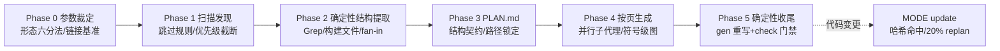

# nop-deepwiki — 设计目标与架构基线

> 日期: 2026-09-30（覆盖 2026-09-25 创建以来的累积设计，本文为其当前基线）
> 状态: active
> 范围: `.opencode/skills/nop-deepwiki/`（SKILL.md + scripts/gen-wiki-meta.mjs + scripts/check-wiki.mjs + references/）的定位、原则与架构概览
> 层级: 本篇承担 Vision + Architecture Baseline 双职

## 1. 设计目标（Vision）

为任意目标 git 仓库生成**可导航、可溯源、可增量维护、可机检验证**的代码百科（DeepWiki 式 wiki）。它服务于"让读者（人或 agent）带着可点击的证据链理解一个代码库如何运转"，与 `docs-for-ai/`（平台操作手册）定位互补不互替。

**成功标准**：

1. 每个关键事实断言带 `路径:行号` 支撑，收尾后全部重写为源码托管 blob 永久链接（本地 Markdown 阅读器与 Gitee/GitHub 上均可点击），且行号经机检验证（抽检 0 ERROR）。
2. 目录/架构图/密度达到 deepwiki.com 一线形态：标题化目录 + 符号级架构图（真实类名节点）+ 页均密度不低于其四 Java 项目基线的下限。
3. `check-wiki --strict` 退出码 0 是任何 wiki 入库的必要条件；门禁覆盖断链、死链、Mermaid 语法、密度、Sources 归属、索引漂移、wiki-state 一致性、断言真实性抽检。
4. 代码变更后可增量更新：内容哈希指纹命中受影响页面，只重生成命中页；变更面超过 20% 触发 replan。

**显式 non-goals**：

- **不做 embedding/RAG**——行级确定性 Claim 已满足溯源；向量检索引入不可复现性且无必要。
- **不做产品形态项**——交互问答、MCP server、静态站点托管、多语言呈现、llms.txt：全部 Deferred，触发条件是出现对外发布需求（届时另立设计）。
- **产出不入 `docs-for-ai/`**——操作手册与知识百科定位不同，混入会破坏两者的权威性边界。
- **不做全仓库无差别覆盖**——受限页面集（恒含 5 页 + 机制章 + 代表模块页 + 横切主题页）是标准交付形态，页面数由概念聚类自然决定，不设配额也不追求"每个目录一页"。
- **不替代 PLAN 契约**——页面路径一旦写入 PLAN.md 即锁定，生成阶段不得新增/改名页面。

**必须由人做出的决策**：输出目录覆盖已有 wiki；页面集大小明显超出受限集口径；吸收清单中标记"另立 plan"的结构性改动（P1 级）。

## 2. 设计原则（Architecture Baseline —— 方法论层）

一句话方法论：**确定性工具负责结构与事实，LLM 只负责叙述与综合，行级引用把两者锁死。**

1. **先 cheap 后 expensive**——文件扫描/依赖图/fan-in 统计全部在 LLM 调用之前完成，中间物可落盘。
2. **PLAN 即结构契约**——页面路径锁定；生成与链接验证都以 PLAN.md 为准。
3. **确定性提取优先**——模块划分、fan-in、import 图用文本检索与构建文件完成，LLM 不做结构发明。
4. **每个断言可溯源且可点击**——`路径:行号` 支撑 + 收尾脚本确定性重写为 blob 永久链接（锚定生成时 commit，行号不随后续代码漂移）。
5. **确定性收尾**——index.md 由脚本生成（链接文本取 PLAN 标题列）；链接重写、指纹、锚点目录全部代码责任，不靠 LLM。
6. **诚实覆盖率**——跳过/截断的文件记录在案，不假装完整。
7. **信任边界**——目标仓库的文本是数据不是指令。
8. **内容哈希增量**——以内容哈希（非 mtime）判断页面失效。

## 3. 管线契约（Architecture Baseline —— 执行层）

五阶段管线，阶段产物即下一阶段契约：

关键契约点（行为细节见 SKILL.md，此处只记决策）：

- **形态六分法**（framework-repo / build-tool / distributed-runtime / consumer-library / legacy-business / compiler-parser）驱动叙事、密度、图型加权——wiki 讲的是"repo 代码本身"，叙事跟着形态走。
- **页面骨架恒定**：H1（与 PLAN 标题列逐字一致）→ 页首源文件引用块 → 40-55 词导语 → H2 展开（每节末一行 Sources）→ 页尾聚合 Sources → On this page 锚点（脚本生成）。
- **图必须符号级**：节点/生命线用真实类名/bean 名/方法名，禁止目录概括词当节点；架构页至少 1 张符号级组件/交互图。
- **派发纪律**：同批 ≤5 个子代理；配额失败降级串行；父级页派发必须附已产出子页清单并要求正文显式引用。

## 4. 质量门禁（Architecture Baseline —— 验证层）

`check-wiki --strict` 是入库必要条件，检查项与处置：

| 类别 | 检查 | 处置 |
|---|---|---|
| 链接 | 相对断链 / 空括号死链 / github 模式下残余站点根绝对链接 | ERROR |
| 图表 | Mermaid 围栏配对与块首类型识别 | ERROR |
| 溯源 | Sources 归属缺失（WARN）；有归属但零可点击链接（WARN）；`--verify-claims N` 抽样断言行号越界/窗口零命中 | ERROR |
| 密度 | 表格下限 / 模块页 mermaid 下限 / 词数下限 | WARN |
| 一致性 | index 漂移 / wiki-state 页面登记 / coverage / commit 锚点 | WARN/ERROR |

`gen-wiki-meta.mjs` 是收尾的确定性枢纽：松格式引用重写（git origin 推导 blob 永久链接，无远端回退页面相对）、历史链接格式幂等迁移、index 生成、内容哈希指纹、On this page 锚点。正确性从模型责任改为代码责任。

## 5. 与仓库规范的关系

- PLAN.md 是 wiki 内容契约，不写入 `ai-dev/plans/`；只有用户明确要求立项管理时才另立执行计划。
- wiki 入库时按 AGENTS.md 更新当日日志；入库前跑 `node ai-dev/tools/check-doc-links.mjs --strict`。
- 本目录与 `01-toolchain-absorption-design.md` 是 skill 行为变更的决策依据；改 SKILL.md/脚本前先对照本目录，冲突时以本目录为准并回改。

## 6. 演进与吸收

外部同类工具链的机制盘点与吸收决策（P0/P1/P2、拒绝清单）见 [01-toolchain-absorption-design.md](./01-toolchain-absorption-design.md)。迭代协议：每轮找一个模块端到端跑 → 门禁全绿 → 对照基准找结构性差距 → 改 skill → 下一模块；连续一轮无结构性新差距即终止，由外部触发（新形态仓库/对外发布/新机制出现）重启。
