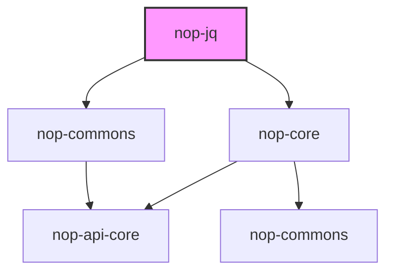
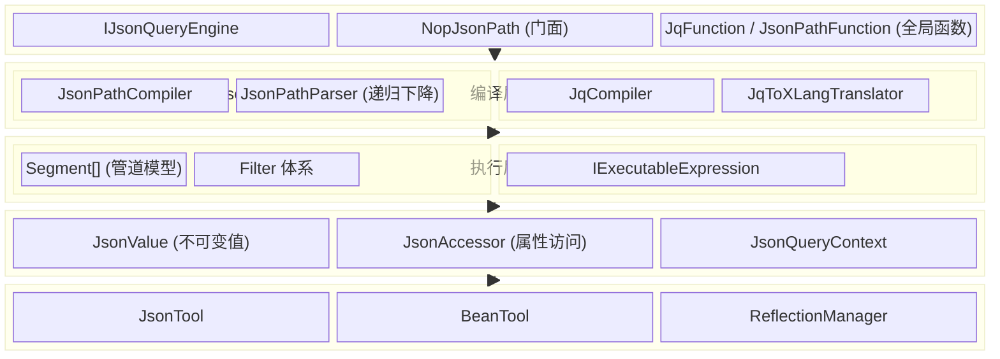

# nop-jq Architecture Baseline

**日期**：2026-09-18
**状态**：草案

---

## 一、模块定位与依赖

### 1.1 在 nop-kernel 中的位置

```
nop-kernel/
├── nop-commons        ← 基础工具
├── nop-api-core       ← API 定义
├── nop-core           ← 核心框架（JSON 工具、反射、IoC）
├── nop-jq             ← [新增] JSON 查询引擎
├── nop-xlang          ← 表达式引擎
├── nop-xdefs          ← DSL 定义
└── nop-codegen        ← 代码生成
```

### 1.2 依赖方向



**约束**：nop-jq 依赖 nop-core（使用 `BeanTool`、`ReflectionManager`、`JsonTool`、`LocalCache`），但 nop-core **不依赖** nop-jq。nop-xlang **不依赖** nop-jq（jq→XLang 翻译器在 nop-jq 侧，反向依赖 nop-xlang）。

### 1.3 Maven 坐标

```xml
<groupId>io.github.entropy-cloud</groupId>
<artifactId>nop-jq</artifactId>
```

### 1.4 外部依赖

**零外部依赖**。仅使用 nop-kernel 内部模块 + JDK 标准库。

当前 nop-core 的 `com.jayway.json-path` 依赖在 nop-jq 实现完成后应从 nop-core/pom.xml 中移除。

## 二、系统分层



## 三、核心对象职责

### 3.1 IJsonQueryEngine

统一入口，负责表达式编译。

- `compile(expr)` — 自动检测语法并编译
- `compileJq(expr)` — 编译 jq 语法
- `compileJsonPath(expr)` — 编译 JsonPath 语法
- 内部维护编译缓存（`LocalCache`）

### 3.2 IJsonQuery

编译后的查询对象，可反复应用于不同输入。核心契约：

- `apply(root)` — 执行查询，返回结果列表
- `applyOne(root)` — 返回第一个结果
- `set(root, value)` — 设置值（JsonPath 写操作）
- `remove(root)` — 删除匹配项

### 3.3 JsonValue

不可变 JSON 值类型，使用 Java sealed interface 实现。类型集：`JsonNull`、`JsonBoolean`、`JsonNumber`、`JsonString`、`JsonArray`、`JsonObject`。

核心设计决策：**使用不可变值而非 mutable Map/List**。理由：
1. 查询结果可能被多处引用，不可变避免意外修改
2. 与 nop 的 delta/merge 体系（`JsonCleaner`、`JsonDiffer`）的不可变语义一致
3. 可安全缓存和共享

`fromObject()` 和 `toObject()` 提供与 nop 现有 `Map`/`List` 体系的双向转换。

### 3.4 JsonAccessor

统一的属性访问抽象，屏蔽 Map、DynamicObject、JavaBean 的差异。

实现类 `NopJsonAccessor` 复用 nop-core 的 `BeanTool.getProperty()` 和 `ReflectionManager`。与现有 `BeanJsonProvider` 的设计一致，但不依赖 Jayway 接口。

### 3.5 JsonPathCompiler / JsonPathParser

递归下降解析器，将 JsonPath 字符串编译为 `Segment[]` 数组。

参考 fastjson `JSONPathParser` 的设计（手写字符级解析），但：
- 不依赖 fastjson 的任何类型
- 属性访问通过 `JsonAccessor` 抽象
- 不提供 `extract()` 流式路径

### 3.6 Segment[]

JsonPath 的执行模型。每个 Segment 是管道中的一步：

```
$.store.book[?(@.price > 10)].title
  ↓      ↓       ↓            ↓
 root  prop    filter       prop
```

Segment 接口定义 `eval(JsonAccessor, root, current) → next`。

### 3.7 Filter 体系

JsonPath 谓词过滤器。接口 `Filter` 定义 `apply(root, item) → boolean`。

实现类覆盖：比较（EQ/NE/GT/GE/LT/LE）、集合（IN）、范围（BETWEEN）、正则（RLIKE）、空值（NULL）、逻辑组合（AND/OR/NOT）。

### 3.8 JqToXLangTranslator

jq→XLang 语法翻译器。将 jq 表达式转换为 XLang 表达式字符串，利用 nop-xlang 已有的表达式执行能力。

翻译映射：

| jq 语法 | XLang 等价 | 处理方式 |
|---------|-----------|---------|
| `.foo` | `.foo` | 直接透传 |
| `.foo.bar` | `.foo.bar` | 直接透传 |
| `.[0]` | `.[0]` | 直接透传 |
| `.[]` | `.[]` | 直接透传 |
| `select(expr)` | `select(expr)` | 直接透传 |
| `map(expr)` | `map(expr)` | 直接透传 |
| `length` | `length` | 直接透传 |
| `keys` | `keys` | 需新增 XLang 内置函数 |
| `to_entries` | — | 需新增 XLang 内置函数 |
| `{a, b}` | `{a, b}` | 直接透传 |
| `[.a, .b]` | `[.a, .b]` | 直接透传 |
| `expr \| expr` | `expr \| expr` | 直接透传 |
| `if-then-else` | `if-then-else` | 直接透传 |
| `reduce` | `reduce` | 直接透传 |
| `..` (递归下降) | — | 需新增 XLang 内置函数 `recurse` |
| `try-catch` | — | 不支持（Phase 2） |

## 四、关键设计决策

### 4.1 为什么用 Segment[] 管道模型而非 Visitor

JsonPath 的语义是线性的路径遍历，不是树形结构的递归访问。管道模型：
- 执行逻辑简单：一个 for 循环
- 易于优化：相邻 Segment 可以融合
- 与 fastjson 验证过的成熟方案一致

### 4.2 为什么不实现完整的 jq VM

jq 的 fork/backtrack 语义（逗号产生多个结果、迭代器回溯）实现复杂度极高（jq 的 C 实现约 2000 行 VM 代码）。nop 平台已有成熟的 XLang 表达式引擎，80% 的 jq 常用语法与 XLang 重叠。通过翻译器方案可以用 10% 的工作量覆盖 80% 的场景。

### 4.3 为什么 JsonValue 用 sealed interface 而非继承

Java 17 的 sealed interface + pattern matching 提供了编译期类型安全的穷举检查，比传统的 `abstract class` + `instanceof` 链更安全、更易维护。

## 五、拒绝了什么

| 方案 | 拒绝理由 |
|------|---------|
| 继续使用 Jayway JsonPath | 外部依赖、无法深度集成 nop 的 DynamicObject/BeanTool 体系 |
| 使用 fastjson 的 JSONPath | 引入 fastjson 全家桶、ASM 字节码生成不符合需求 |
| 在 nop-core 内实现 | nop-core 已经很重（依赖 Jayway），新增独立模块更清晰 |
| 用 ANTLR4 做 JsonPath 解析器 | JsonPath 语法足够简单，手写递归下降更轻量、启动更快 |
| 完整移植 jq 的 fork/backtrack VM | 复杂度收益比不合理，翻译到 XLang 是更务实的选择 |

## 六、与已有设计的关系

- **nop-core `jpath/`**：新模块替代其功能。实现完成后 `JPath`、`BeanJsonProvider`、`BeanMappingProvider` 标记为 `@Deprecated`。
- **nop-core `JsonVisitState`**：保持不变。它用于 delta/merge 操作的路径追踪，与查询引擎正交。
- **nop-xlang 表达式引擎**：jq→XLang 翻译器依赖 XLang 的 AST 和执行能力，但 XLang 不反向依赖 nop-jq。
- **ORM `jsonPath` 列属性**：ORM 层面不感知查询引擎的实现，`NopJsonPath` 门面提供与旧 `JPath` 相同的 API 签名。
