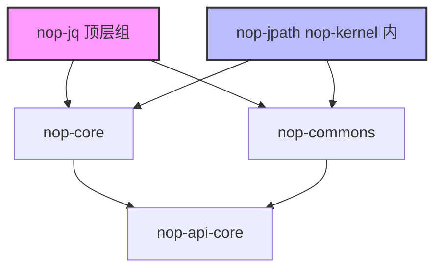
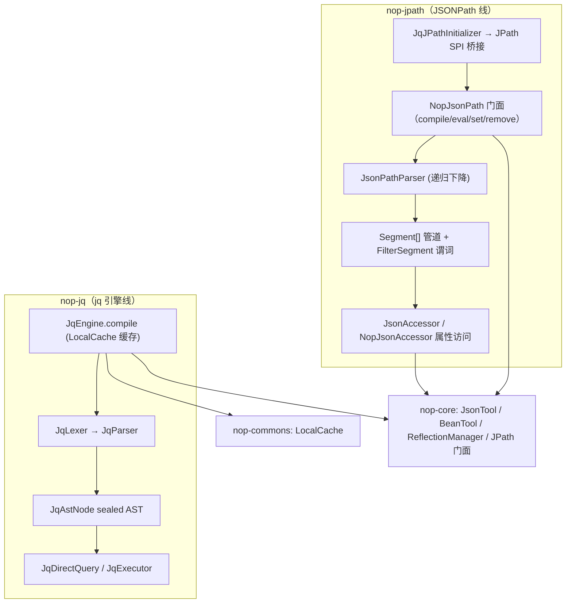

# nop-jq Architecture Baseline

**日期**：2026-09-18（2026-09-28 更新为最终状态：nop-jpath 拆分 + nop-jq 迁出 nop-kernel）
**状态**：active

---

## 一、模块定位与依赖

### 1.1 模块布局

```
nop-kernel/
├── nop-commons        ← 基础工具
├── nop-api-core       ← API 定义
├── nop-core           ← 核心框架（JSON 工具、反射、IoC）
├── nop-jpath          ← JSONPath 求值 + JPath SPI 桥接（kernel 保留的查询支持面）
├── nop-xlang          ← 表达式引擎
├── nop-xdefs          ← DSL 定义
└── nop-codegen        ← 代码生成

顶层模块组（nop-kernel 之外，parent = nop-entropy）：
nop-jq/               ← 纯 jq 1.7.1 查询引擎
```

### 1.2 依赖方向


```mermaid
flowchart TD
    JQ[nop-jq 顶层组] --> CORE[nop-core]
    JQ --> COMMONS[nop-commons]
    JPATH[nop-jpath nop-kernel 内] --> CORE
    JPATH --> COMMONS
    CORE --> API[nop-api-core]
    COMMONS --> API

    style JQ fill:#f9f,stroke:#333,stroke-width:2px
    style JPATH fill:#bbf,stroke:#333,stroke-width:2px
```

**约束**：nop-jq 与 nop-jpath 互不依赖（两条查询线零共享，仅各自独立使用 nop-core/nop-commons）。nop-core **不依赖** nop-jq/nop-jpath——JPath 求值经 SPI 桥接（见 `03-jpath-bridge-contract.md`）。nop-xlang **不依赖** nop-jq/nop-jpath。

nop-jq 对 nop-core 的实际使用仅 `JsonTool.parse`（`JqBuiltins`）一处；nop-jpath 使用 `JsonTool`、`BeanTool`、`ReflectionManager`、`ICoreInitializer`/`JPath` 门面。

### 1.3 Maven 坐标

```xml
<groupId>io.github.entropy-cloud</groupId>
<artifactId>nop-jq</artifactId>
```

### 1.4 外部依赖

**零外部依赖**。nop-jq 与 nop-jpath 均仅使用 nop 内部模块 + JDK 标准库（jayway json-path 仅 test scope，用于对比基准）。

## 二、系统分层


```mermaid
flowchart TD
    subgraph JPATH["nop-jpath（JSONPath 线）"]
        NJP["NopJsonPath 门面（compile/eval/set/remove）"]
        PARSER["JsonPathParser (递归下降)"]
        SEGS["Segment[] 管道 + FilterSegment 谓词"]
        ACC["JsonAccessor / NopJsonAccessor 属性访问"]
        BRIDGE["JqJPathInitializer → JPath SPI 桥接"]
    end
    subgraph JQ["nop-jq（jq 引擎线）"]
        JE["JqEngine.compile (LocalCache 缓存)"]
        JLEX["JqLexer → JqParser"]
        JAST["JqAstNode sealed AST"]
        JEXEC["JqDirectQuery / JqExecutor"]
    end
    CORE["nop-core: JsonTool / BeanTool / ReflectionManager / JPath 门面"]
    COMMONS["nop-commons: LocalCache"]

    NJP --> PARSER --> SEGS --> ACC
    BRIDGE --> NJP
    JE --> JLEX --> JAST --> JEXEC
    ACC --> CORE
    NJP --> CORE
    JE --> COMMONS
    JE --> CORE
```

## 三、核心对象职责

### 3.1 JqEngine / NopJsonPath（两条线的入口）

- **nop-jq 线**：`JqEngine.compile(expr)` 编译 jq 表达式为 `IJsonQuery`（`apply(root)` 多输出流 / `applyOne(root)` 单输出），编译结果按表达式文本缓存于 `LocalCache`。
- **nop-jpath 线**：`NopJsonPath.compile/eval/evalOne/set/remove/contains/paths` 等 fastjson 兼容签名；`set` 不创建中间容器（父缺失返回 false），`remove` 无命中返回 false。

### 3.2 JsonAccessor

统一的属性访问抽象，屏蔽 Map、DynamicObject、JavaBean 的差异。

实现类 `NopJsonAccessor` 复用 nop-core 的 `BeanTool.getProperty()` 和 `ReflectionManager`。与现有 `BeanJsonProvider` 的设计一致，但不依赖 Jayway 接口。

### 3.3 JsonPathParser

递归下降解析器，将 JsonPath 字符串编译为 `Segment[]` 数组。

参考 fastjson `JSONPathParser` 的设计（手写字符级解析），但：
- 不依赖 fastjson 的任何类型
- 属性访问通过 `JsonAccessor` 抽象
- 不提供 `extract()` 流式路径

### 3.4 Segment[]

JsonPath 的执行模型。每个 Segment 是管道中的一步：

```
$.store.book[?(@.price > 10)].title
  ↓      ↓       ↓            ↓
 root  prop    filter       prop
```

`JsonPathExecutor` 按 Segment 顺序执行，`SegmentOptimizer` 融合相邻 Segment（如 `FusedPropertySegment`）。

### 3.5 Filter 谓词

`FilterSegment` 承载谓词，谓词实现包括 `CompareFilter`（比较）、`RegexFilter`（正则）等，作用于当前迭代项。

### 3.6 jq 执行引擎（最终架构）

jq 采用 AST 直接执行：`JqLexer → JqParser → JqAstNode（sealed 节点树）→ JqDirectQuery/JqExecutor`。
早期"翻译到 XLang"路线已废弃——jq 特有语义（多输出流、label/break、解构、路径赋值、
惰性 limit/first/any/all）无法无损映射到 XLang 表达式。语义细节见 `02-jq-complete-design.md`。

## 四、关键设计决策

### 4.1 为什么用 Segment[] 管道模型而非 Visitor

JsonPath 的语义是线性的路径遍历，不是树形结构的递归访问。管道模型：
- 执行逻辑简单：一个 for 循环
- 易于优化：相邻 Segment 可以融合
- 与 fastjson 验证过的成熟方案一致

### 4.2 为什么不实现完整的 jq VM

jq 的 fork/backtrack 语义实现复杂度极高。本引擎以"急切求值 + 控制流异常"（break/stop 异常、短路输出收集）近似流语义，官方 jq 1.7.1 测试套件全量通过，证明该近似对全部被测行为等价。完整 VM 保留为后续独立计划。

### 4.3 为什么 jq 引擎与 JSONPath 分属两个模块

两条查询线零共享（jq 引擎不使用 JSONPath 的任何类，反之亦然），语义基线不同（jq 1.7.1 官方套件 vs fastjson 兼容 API），消费需求不对称（平台运行时只需 JSONPath 求值支撑 JPath 门面，jq 引擎仅 AI 工具消费）。拆分后 nop-kernel 只保留 `nop-jpath`，`nop-jq` 作为顶层独立模块组，缩小最小内核面。

### 4.4 类名和 API 为什么仿照 fastjson

nop-jq 的 JsonPath 公开 API 类名和方法签名仿照 fastjson `com.alibaba.fastjson.JSONPath`（如 `compile`、`eval`、`read`、`set`、`remove`），便于从 fastjson 迁移。nop-core 的 `JPath` 门面保留为兼容入口（compile 面），求值经 SPI 委托到 `NopJsonPath`，契约见 `03-jpath-bridge-contract.md`；nop-jq 感知的代码直接使用 `io.nop.jq.jsonpath.NopJsonPath`。

## 五、拒绝了什么

| 方案 | 拒绝理由 |
|------|---------|
| 继续使用 Jayway JsonPath | 外部依赖、无法深度集成 nop 的 DynamicObject/BeanTool 体系 |
| 使用 fastjson 的 JSONPath | 引入 fastjson 全家桶、ASM 字节码生成不符合需求 |
| 在 nop-core 内实现 | nop-core 已经很重（依赖 Jayway），新增独立模块更清晰 |
| 用 ANTLR4 做 JsonPath 解析器 | JsonPath 语法足够简单，手写递归下降更轻量、启动更快 |
| 完整移植 jq 的 fork/backtrack VM | 复杂度收益比不合理，翻译到 XLang 是更务实的选择 |
| 在 nop-ai-toolkit 中直接调用系统 jq | 有外部依赖、跨平台兼容性差、无法集成 nop 的 BeanTool 属性访问 |

## 六、与已有设计的关系

- **nop-core `jpath/`**：`JPath` 门面保留为兼容入口（compile 面在 core，求值面经 SPI 委托），契约见 `03-jpath-bridge-contract.md`；nop-jq 感知的调用方直接使用 `io.nop.jq.jsonpath.NopJsonPath`。
- **nop-core `JsonVisitState`**：保持不变。它用于 delta/merge 操作的路径追踪，与查询引擎正交。
- **nop-xlang 表达式引擎**：jq 引擎为独立 AST 执行，不依赖 nop-xlang。
- **ORM `jsonPath` 列属性**：ORM 层面不感知查询引擎的实现，如需直接求值使用 `io.nop.jq.jsonpath.NopJsonPath`。
- **nop-ai-toolkit `IToolExecutor`**：JqToolExecutor 实现 `IToolExecutor` 接口，通过 `*.tool.xml` 注册为 AI 工具，复用现有的工具发现和沙箱执行机制。
- **nop-ai-toolkit `IBashSandbox`**：JqToolExecutor 可选择通过沙箱执行，复用 `HostBashSandbox` 和 `DockerBashSandbox` 的进程隔离能力。

## 七、外部依赖状态

Jayway JsonPath 已从 nop 全平台的 main 依赖中移除，nop-jpath 是唯一 JSONPath 运行时实现；jayway json-path 仅作为 nop-jpath 的 test-scope 对比基准存在。

## 八、nop-ai-toolkit 集成

nop-jq 在 nop-ai-toolkit 中提供 `jq-query` 工具，使 AI Agent 可以通过标准工具调用执行 jq 风格的 JSON 查询。

工具定义：`jq-query.tool.xml`
- 输入：`expression`（jq 表达式）、`data`（JSON 字符串）或 `filePath`（JSON 文件路径）、可选 flags（`--raw-output`, `--slurp` 等）
- 输出：查询结果（JSON 字符串或原始字符串）
- 执行：委托 `JqEngine`，不启动外部进程

沙箱集成：可选通过 `IBashSandbox` 执行 NOPJQ CLI 入口，支持文件系统隔离和资源限制。
