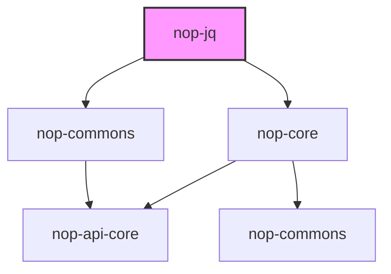
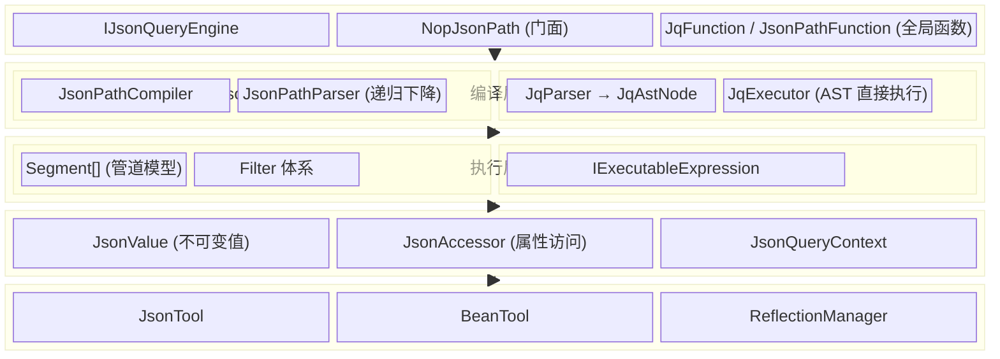

# nop-jq Architecture Baseline

**日期**：2026-09-18（2026-09-25 更新为最终状态）
**状态**：active

---

## 一、模块定位与依赖

### 1.1 在 nop-kernel 中的位置

```
nop-kernel/
├── nop-commons        ← 基础工具
├── nop-api-core       ← API 定义
├── nop-core           ← 核心框架（JSON 工具、反射、IoC）
├── nop-jq             ← [新增] JSON 查询引擎
├── nop-xlang          ← 表达式引擎
├── nop-xdefs          ← DSL 定义
└── nop-codegen        ← 代码生成
```

### 1.2 依赖方向


```mermaid
flowchart TD
    A[nop-jq] --> B[nop-core]
    A --> C[nop-commons]
    B --> D[nop-api-core]
    B --> E[nop-commons]
    C --> D

    style A fill:#f9f,stroke:#333,stroke-width:2px
```

**约束**：nop-jq 依赖 nop-core（使用 `BeanTool`、`ReflectionManager`、`JsonTool`、`LocalCache`），但 nop-core **不依赖** nop-jq。nop-xlang **不依赖** nop-jq（jq→XLang 翻译器在 nop-jq 侧，反向依赖 nop-xlang）。

### 1.3 Maven 坐标

```xml
<groupId>io.github.entropy-cloud</groupId>
<artifactId>nop-jq</artifactId>
```

### 1.4 外部依赖

**零外部依赖**。仅使用 nop-kernel 内部模块 + JDK 标准库。

当前状态：Jayway JsonPath 依赖已从 nop 全平台移除（roadmap stage 10-12 已完成），nop-jq 是唯一 JSON 查询实现。

## 二、系统分层


```mermaid
block-beta
    columns 1
    block:API["用户 API 层"]
        columns 3
        IJsonQueryEngine["IJsonQueryEngine"]
        NopJsonPath["NopJsonPath (门面)"]
        JqFunctions["JqFunction / JsonPathFunction (全局函数)"]
    end
    block:COMPILE["编译层"]
        columns 2
        block:JP["JsonPath"]
            JsonPathCompiler["JsonPathCompiler"]
            JsonPathParser["JsonPathParser (递归下降)"]
        end
        block:JQ["jq"]
            JqParser["JqParser → JqAstNode"]
            JqExecutor2["JqExecutor (AST 直接执行)"]
        end
    end
    block:EXEC["执行层"]
        columns 2
        block:JE["JsonPath"]
            Segment["Segment[] (管道模型)"]
            Filter["Filter 体系"]
        end
        block:XLE["XLang"]
            XLangExec["IExecutableExpression"]
        end
    end
    block:COMMON["共享基础设施"]
        columns 3
        JsonValue["JsonValue (不可变值)"]
        JsonAccessor["JsonAccessor (属性访问)"]
        Context["JsonQueryContext"]
    end
    block:CORE["nop-core 基础设施"]
        columns 3
        JsonTool["JsonTool"]
        BeanTool["BeanTool"]
        ReflectionMgr["ReflectionManager"]
    end

    API --> COMPILE
    COMPILE --> EXEC
    EXEC --> COMMON
    COMMON --> CORE
```

## 三、核心对象职责

### 3.1 IJsonQueryEngine

统一入口，负责表达式编译。

- `compile(expr)` — 自动检测语法并编译
- `compileJq(expr)` — 编译 jq 语法
- `compileJsonPath(expr)` — 编译 JsonPath 语法
- 内部维护编译缓存（`LocalCache`）

### 3.2 IJsonQuery

编译后的查询对象，可反复应用于不同输入。核心契约：

- `apply(root)` — 执行查询，返回结果列表
- `applyOne(root)` — 返回第一个结果
- `set(root, value)` — 设置值（JsonPath 写操作）
- `remove(root)` — 删除匹配项

### 3.3 JsonValue

不可变 JSON 值类型，使用 Java sealed interface 实现。类型集：`JsonNull`、`JsonBoolean`、`JsonNumber`、`JsonString`、`JsonArray`、`JsonObject`。

核心设计决策：**使用不可变值而非 mutable Map/List**。理由：
1. 查询结果可能被多处引用，不可变避免意外修改
2. 与 nop 的 delta/merge 体系（`JsonCleaner`、`JsonDiffer`）的不可变语义一致
3. 可安全缓存和共享

`fromObject()` 和 `toObject()` 提供与 nop 现有 `Map`/`List` 体系的双向转换。

### 3.4 JsonAccessor

统一的属性访问抽象，屏蔽 Map、DynamicObject、JavaBean 的差异。

实现类 `NopJsonAccessor` 复用 nop-core 的 `BeanTool.getProperty()` 和 `ReflectionManager`。与现有 `BeanJsonProvider` 的设计一致，但不依赖 Jayway 接口。

### 3.5 JsonPathCompiler / JsonPathParser

递归下降解析器，将 JsonPath 字符串编译为 `Segment[]` 数组。

参考 fastjson `JSONPathParser` 的设计（手写字符级解析），但：
- 不依赖 fastjson 的任何类型
- 属性访问通过 `JsonAccessor` 抽象
- 不提供 `extract()` 流式路径

### 3.6 Segment[]

JsonPath 的执行模型。每个 Segment 是管道中的一步：

```
$.store.book[?(@.price > 10)].title
  ↓      ↓       ↓            ↓
 root  prop    filter       prop
```

Segment 接口定义 `eval(JsonAccessor, root, current) → next`。

### 3.7 Filter 体系

JsonPath 谓词过滤器。接口 `Filter` 定义 `apply(root, item) → boolean`。

实现类覆盖：比较（EQ/NE/GT/GE/LT/LE）、集合（IN）、范围（BETWEEN）、正则（RLIKE）、空值（NULL）、逻辑组合（AND/OR/NOT）。

### 3.8 jq 执行引擎（最终架构）

jq 采用 AST 直接执行：`JqLexer → JqParser → JqAstNode（sealed 节点树）→ JqDirectQuery/JqExecutor`。
早期"翻译到 XLang"路线已废弃——jq 特有语义（多输出流、label/break、解构、路径赋值、
惰性 limit/first/any/all）无法无损映射到 XLang 表达式。语义细节见 `02-jq-complete-design.md`。

## 四、关键设计决策

### 4.1 为什么用 Segment[] 管道模型而非 Visitor

JsonPath 的语义是线性的路径遍历，不是树形结构的递归访问。管道模型：
- 执行逻辑简单：一个 for 循环
- 易于优化：相邻 Segment 可以融合
- 与 fastjson 验证过的成熟方案一致

### 4.2 为什么不实现完整的 jq VM

jq 的 fork/backtrack 语义实现复杂度极高。本引擎以"急切求值 + 控制流异常"（break/stop 异常、短路输出收集）近似流语义，官方 jq 1.7.1 测试套件全量通过，证明该近似对全部被测行为等价。完整 VM 保留为后续独立计划。

### 4.3 为什么 JsonValue 用 sealed interface 而非继承

Java 17 的 sealed interface + pattern matching 提供了编译期类型安全的穷举检查，比传统的 `abstract class` + `instanceof` 链更安全、更易维护。

### 4.4 类名和 API 为什么仿照 fastjson

nop-jq 的 JsonPath 公开 API 类名和方法签名仿照 fastjson `com.alibaba.fastjson.JSONPath`（如 `compile`、`eval`、`read`、`set`、`remove`），便于从 fastjson 迁移。nop-core 旧的 `JPath` 包装类不再保留，调用方直接使用 `io.nop.jq.jsonpath.JSONPath`。

## 五、拒绝了什么

| 方案 | 拒绝理由 |
|------|---------|
| 继续使用 Jayway JsonPath | 外部依赖、无法深度集成 nop 的 DynamicObject/BeanTool 体系 |
| 使用 fastjson 的 JSONPath | 引入 fastjson 全家桶、ASM 字节码生成不符合需求 |
| 在 nop-core 内实现 | nop-core 已经很重（依赖 Jayway），新增独立模块更清晰 |
| 用 ANTLR4 做 JsonPath 解析器 | JsonPath 语法足够简单，手写递归下降更轻量、启动更快 |
| 完整移植 jq 的 fork/backtrack VM | 复杂度收益比不合理，翻译到 XLang 是更务实的选择 |
| 在 nop-ai-toolkit 中直接调用系统 jq | 有外部依赖、跨平台兼容性差、无法集成 nop 的 BeanTool 属性访问 |

## 六、与已有设计的关系

- **nop-core `jpath/`**：旧包装类（JPath, BeanJsonProvider, BeanMappingProvider）将被移除。调用方直接使用 `io.nop.jq.jsonpath.JSONPath`，API 名称和签名仿照 fastjson `com.alibaba.fastjson.JSONPath`，便于从 fastjson 迁移。
- **nop-core `JsonVisitState`**：保持不变。它用于 delta/merge 操作的路径追踪，与查询引擎正交。
- **nop-xlang 表达式引擎**：jq 引擎为独立 AST 执行，不依赖 nop-xlang。
- **ORM `jsonPath` 列属性**：ORM 层面不感知查询引擎的实现，切换到 `io.nop.jq.jsonpath.JSONPath` 即可。
- **nop-ai-toolkit `IToolExecutor`**：JqToolExecutor 实现 `IToolExecutor` 接口，通过 `*.tool.xml` 注册为 AI 工具，复用现有的工具发现和沙箱执行机制。
- **nop-ai-toolkit `IBashSandbox`**：JqToolExecutor 可选择通过沙箱执行，复用 `HostBashSandbox` 和 `DockerBashSandbox` 的进程隔离能力。

## 七、全平台 Jayway 依赖移除

nop-jq 的最终目标是完全替代 Jayway JsonPath，从 nop 全平台中移除该外部依赖。

移除范围（按模块）：
- `nop-kernel/nop-dependencies/pom.xml` — 依赖声明（已移除）
- `nop-kernel/nop-core/pom.xml` — 依赖引用（已移除）
- `nop-core/jpath/` — 旧包装类（JPath, BeanJsonProvider, BeanMappingProvider）移除
- `nop-auth`、`nop-wf`、`nop-graphql`、`nop-ai-*` — 业务模块中的 import 引用切换到 `io.nop.jq.jsonpath.JSONPath`
- `nop-biz`、`nop-sys`、`nop-report` 等 — 其他上层模块

移除策略：逐模块迁移 → 全平台测试通过 → 最后执行移除。不提前移除，避免破坏编译。

## 八、nop-ai-toolkit 集成

nop-jq 在 nop-ai-toolkit 中提供 `jq-query` 工具，使 AI Agent 可以通过标准工具调用执行 jq 风格的 JSON 查询。

工具定义：`jq-query.tool.xml`
- 输入：`expression`（jq 表达式）、`data`（JSON 字符串）或 `filePath`（JSON 文件路径）、可选 flags（`--raw-output`, `--slurp` 等）
- 输出：查询结果（JSON 字符串或原始字符串）
- 执行：委托 `JqEngine`，不启动外部进程

沙箱集成：可选通过 `IBashSandbox` 执行 NOPJQ CLI 入口，支持文件系统隔离和资源限制。
