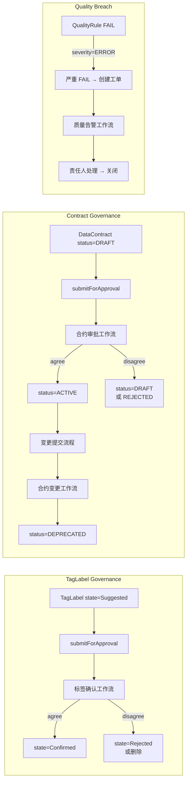
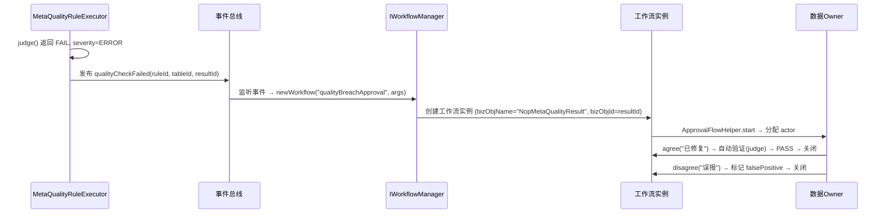
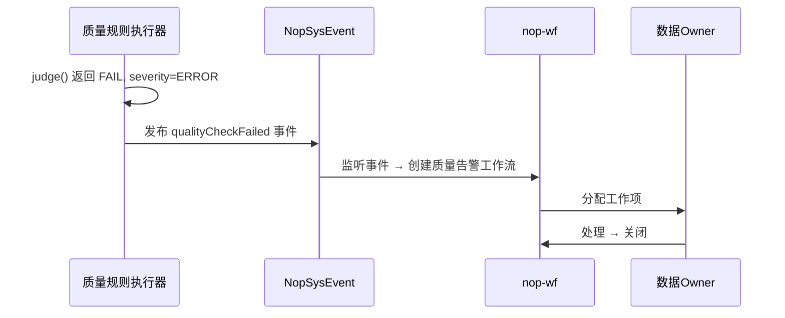

# nop-metadata 数据合约与治理工作流设计

**日期**：2026-07-20
**范围**：`nop-metadata` + `nop-wf` 模块的治理工作流集成
**状态**：草案
**灵感来源**：OpenMetadata DataContract ODCS 3.1 生命周期、nop-wf IApprovableBiz 模式

---

## 一、设计结论

1. **治理工作流不等于 nop-batch/nop-task**。治理工作流是**围绕元数据变更的人工审批流程**，主体是"人审"，驱动方式是元数据变更事件 + nop-wf 状态机，而非 ETL 管线或步骤编排
2. **三个场景接入 nop-wf**：TagLabel 状态确认（Suggested→Confirmed）、DataContract 变更审批（DRAFT→ACTIVE→DEPRECATED→RETIRED）、GlossaryTerm 发布审核
3. **现有 `NopMetaDataContract` 的硬编码状态机替换为 nop-wf 驱动**。当前 BizModel 中手写的 `activateContract`/`deprecateContract`/`retireContract` 逻辑改为通过 `tagSet="use-approval"` + 工作流 listener 委托给 nop-wf
4. **`tagSet="use-approval"` 是编译期决策（codegen 时启用），不是运行时可切换的**。DataContract 一旦启用审批，所有状态变更走工作流。不存在"运行时判断是否启用审批"的路径
5. **业务状态转换（如 DRAFT→ACTIVE）不由 `approval-support.xbiz` 的标准 approve 处理**，而是通过 `.xwf` 的 `on end` listener 回调 Java BizModel 的 `approve`/`reject` 方法完成，或通过 retention xbiz 覆盖标准 approve/reject 动作设置业务状态。`wf-approval.xlib:notifyResult` 根据 `approved` 布尔值决定调用 BizModel 的 `approve`(true) 或 `reject`(false) action
6. **质量告警工作流使用真实的 nop-wf 实例（`IWorkflowManager.newWorkflow()`），不是直接写 `NopWfWork` 记录**
7. **存量兼容**：现有 `activateContract`/`deprecateContract`/`retireContract` BizMutation 标记为 `@Deprecated`，引导调用者使用新的标准审批流程（`submitForApproval` + `approve`/`reject`）

---

## 二、背景与动机

### 当前痛点

| 痛点 | 表现 |
|------|------|
| **DataContract 状态机是硬编码的** | `NopMetaDataContractBizModel` 中 `activateContract`/`deprecateContract`/`retireContract` 是手写 Java 逻辑，线性状态转换，无审批环节 |
| **TagLabel 无治理路径** | Suggested 标签只能通过直接写库变为 Confirmed，没有"数据管家审查→确认/驳回"的流程 |
| **质量规则 breach 无升级机制** | `MetaQualityRuleExecutor` 执行发现 FAIL 后，只写 `NopMetaQualityResult`，不触发人工介入 |
| **nop-wf 已存在但未接入 metadata** | `IApprovableBiz` + `approval-support.xbiz` + `oa.xwf` 已完备，但 nop-metadata 没有任何实体使用 `tagSet="use-approval"` |
| **合约变更无消费者确认** | 合约从 ACTIVE 切到 DEPRECATED 不需要消费者确认，静态分析变更无影响评估 |

### 目标

将 nop-wf 的审批流能力接入 nop-metadata 的三个治理场景，让元数据变更经历"提交→审批→生效"的生命周期，而非直接写库。

---

## 三、核心设计

### 3.1 治理场景总览



### 3.2 实体改造

#### 3.2.1 NopMetaDataContract 接入 IApprovableBiz

当前 `NopMetaDataContract` 已有 `status`（DRAFT/ACTIVE/DEPRECATED/RETIRED）。改造方案：

| 改动 | 说明 |
|------|------|
| 增加 `tagSet="use-approval"` | 编译期启用 `approval-support.xbiz` 的注入（codegen 时生效） |
| 增加 `approveStatus` 字段 | `string(20)`，`UNSUBMITTED`/`SUBMITTED`/`APPROVED`/`REJECTED`（与 `IApprovableBiz` 兼容） |
| 增加 `approvedBy` 字段 | `string(50)`，审批人 |
| 增加 `approvedAt` 字段 | `timestamp`，审批时间 |
| 增加 `wf:wfName` 元数据 | 在实体对应的 `.xmeta` 中声明 `<meta wf:wfName="metaDataContractApproval"/>` |
| 新增 `approve` BizMutation（或 retention xbiz 覆盖） | `wf-approval:notifyResult approved=true` 回调 BizModel 的 approve action，执行业务状态转换（如 DRAFT→ACTIVE） |
| 新增 `reject` BizMutation（或 retention xbiz 覆盖） | `wf-approval:notifyResult approved=false` 回调 BizModel 的 reject action，设置 approveStatus=REJECTED，保持业务状态不变 |
| 现有 `activateContract`/`deprecateContract`/`retireContract` | 标记 `@Deprecated`，内部实现改为调用 `submitForApproval` |

**业务状态转换的驱动机制**：

`approval-support.xbiz` 的 `approve` action 只维护审批态（`approveStatus=APPROVED`），不处理业务状态。业务状态转换（如 `status=DRAFT→ACTIVE`）通过 retention xbiz 或 Java BizModel 覆盖 `approve`/`reject` action 实现，或在 `.xwf` 工作流的 `on end` 事件中配置单 `*end` listener 统一处理：

```xml
<!-- metaDataContractApproval/v1.xwf 的 end step -->
<listeners>
    <listener id="onEndNotify" eventPattern="*end">
        <source>
            <wf-approval:notifyResult bizObj="NopMetaDataContract"
                                       approved="${wfRt.status == 'APPROVED'}"/>
        </source>
    </listener>
</listeners>
```

`wf-approval.xlib:notifyResult` 只有 `bizObj`+`approved` 两个参数，无 `action` 属性；内部根据 `approved` 布尔值决定调用 BizObject 的 `approve`(true) 或 `reject`(false) action。

**状态关联**：`approveStatus` 管理审批流状态，`status` 管理合约生命周期状态。两者的映射关系：

```
                    submitForApproval              wf end listener
status=DRAFT ──────────────────────→ approveStatus=SUBMITTED ─────────────→ status=ACTIVE
                                         ↓                              approveStatus=APPROVED
                                    wf disagree (end listener)
                                         ↓
                              status=DRAFT, approveStatus=REJECTED
```

**不合并为一个字段的理由**：审批状态和生命周期状态是正交的。一个 ACTIVE 的合约也可能经过"变更审批"（重新 submitForApproval），此时 `approveStatus` 会变为 SUBMITTED 但 `status` 保持 ACTIVE 直到审批通过。

#### 3.2.2 NopMetaTagLabel 接入 IApprovableBiz

`NopMetaTagLabel` 在 Phase 1（11-enterprise-semantic-layer.md）已设计 `state` 字段（Suggested/Confirmed）。Phase 2 引入审批，对 Phase 1 实体追加字段：

| 改动 | 说明 |
|------|------|
| 增加 `tagSet="use-approval"` | 编译期启用审批流 |
| 增加 `approveStatus` 字段 | `string(20)`，追加到已有实体 |
| 增加 `approvedBy`/`approvedAt` 字段 | 追加到已有实体 |
| 增加 `wf:wfName` 元数据 | 在 `.xmeta` 中声明 `<meta wf:wfName="tagLabelConfirmApproval"/>` |
| state 与 approveStatus 正交关系 | `state=Suggested` + `approveStatus=SUBMITTED`（待审）；`state=Confirmed` + `approveStatus=APPROVED`（已通过）；`state=Suggested` + `approveStatus=REJECTED`（已驳回，保持 Suggested） |

**触发条件**：仅 `labelType=Derived | Propagated | Automated` 且 `state=Suggested` 的 TagLabel 需要审批。`labelType=Manual` 的标注直接为 `state=Confirmed`，跳过审批。

> **Phase 1/Phase 2 衔接**：Phase 1 的 `NopMetaTagLabel` 不包含 `approveStatus`/`approvedBy`/`approvedAt` 字段。Phase 2 在已有实体上追加这些列。Phase 1 实现的 CRUD 不受影响——新增字段 nullable，codegen 重新生成后自动扩展 API。

### 3.3 工作流定义

#### 3.3.1 标签确认工作流（tagLabelConfirmApproval）

```
start → reviewer-check → end

reviewer-check:
  actor: 数据管家角色（可配置）
  on agree: 
    → 通知 wf-approval.xlib → BizModel.afterApproved() → state=Confirmed
  on disagree:
    → 通知 wf-approval.xlib → BizModel.afterRejected() → state 不变（保持 Suggested），记录驳回理由

注：approvedBy/approvedAt 由 approval-support.xbiz 统一处理
```

配置文件位置：`nop-metadata-service/src/main/resources/_vfs/nop/metadata/wf/tagLabelConfirmApproval/v1.xwf`

**回调机制**：工作流的 `on end` 事件通过 `wf-approval.xlib:notifyResult` 回调 BizModel 的 `afterApproved`/`afterRejected` 方法（非直接调用 `approval-support.xbiz` 的标准 approve/reject），见 §3.2.1 的 listener 模式。

#### 3.3.2 合约审批工作流（metaDataContractApproval）

```
start → submit → owner-check → consumer-check → end

submit:
  actor: 合约创建者

owner-check:
  actor: 合约 Owner
  on agree → consumer-check
  on disagree → 退回 submit

consumer-check:
  actor: 合约消费者
  on agree → 
    - status=DRAFT → ACTIVE（新建生效）
    - status=ACTIVE → DEPRECATED（废弃确认）  
    - DEPRECATED → RETIRED（退役确认）
  on disagree → 退回 submit

注：status 的具体转换由 BizModel 的 approve/reject 方法根据当前 status 决定
```

配置文件位置：`nop-metadata-service/src/main/resources/_vfs/nop/metadata/wf/metaDataContractApproval/v1.xwf`

#### 3.3.3 质量告警工作流（qualityBreachApproval）

质量告警工作流的决策语义不同于合约审批——Owner 不是"同意/拒绝"一个变更，而是**处理一个告警**：

```
start → owner-investigate → verify → end

owner-investigate:
  actor: 规则表 Owner
  决策语义:
    agree("已修复"): 
      → 触发自动验证：重新执行 `MetaQualityRuleExecutor.judge(ruleId)`
         - PASS → verify 步骤设为自动通过，流转到 end
         - FAIL → 退回 owner-investigate，记录"验证未通过"
    disagree("误报"):
      → 标记 `NopMetaQualityResult.isFalsePositive=true`，不重测直接关闭
```

```
quality rule FAIL + severity=ERROR
  → `MetaQualityRuleExecutor` 发布 `QualityCheckFailedEvent`
  → 事件监听器创建 nop-wf 工作流实例（`IWorkflowManager.newWorkflow()`）
  → 工作流分配给规则表 Owner
  → Owner 处理（修复或标记误报）
```

使用真实的 nop-wf 工作流实例，而非直接写 `NopWfWork` 记录。流程：



`MetaQualityRuleExecutor` 中新增：在 `judge()` 方法返回 FAIL 且 `severity=ERROR` 时发布事件，不直接调用 nop-wf API（解耦职责）。新增独立 listener 监听该事件并发起工作流。

### 3.4 事件驱动的触发机制

治理工作流的触发不依赖用户点击 UI 按钮，而是通过**元数据变更事件**（`10-event-model.md` 设计）：



类似地：
- TagLabel `labelType=Derived` 创建时 → 发布事件 → 触发达人确认工作流
- DataContract 创建（status=DRAFT）时 → 不自动触发，等待用户 `submitForApproval`

### 3.5 存量兼容

| 存量元素 | 与新设计的关系 |
|---------|--------------|
| `NopMetaDataContractBizModel.activateContract()` | 标记 `@Deprecated`，内部改为调用 `submitForApproval`。因 `tagSet="use-approval"` 是编译期决定，一旦启用审批不存在"不走工作流"的路径 |
| `NopMetaDataContractBizModel.deprecateContract()` | 同上 |
| `NopMetaDataContractBizModel.retireContract()` | 同上 |
| 非审批实体的 TagLabel | 不加入 `tagSet="use-approval"`，state 直接写库，保持 Phase 1 的简单行为。`approveStatus`/`approvedBy`/`approvedAt` 字段仍然存在但 unused |

---

### 3.6 关键实现约束

#### 3.6.1 `wf:wfName` 元数据的存放位置

`wf:wfName` 必须在对应实体的 `.xmeta` 文件中声明（根 `<meta>` 元素），而非 ORM XML 或 Java 注解。`approval-support.xbiz:30` 通过 `thisObj.objMeta['wf:wfName']` 读取。示例：

```xml
<!-- NopMetaDataContract.xmeta -->
<meta wf:wfName="metaDataContractApproval" ...
      x:extends="_NopMetaDataContract.xmeta">
```

#### 3.6.2 `activateContract` 标记 @Deprecated 的调用者影响

`activateContract()` 从"立即改状态"变为"启动工作流等审批"，这是一个同步→异步的语义变化。客户端调用者须知：

- `submitForApproval` 返回后实体 `approveStatus=SUBMITTED`，`status` 未变
- 审批通过后，通过 `afterApproved` 回调更新 `status`
- 调用者可轮询 `approveStatus` 字段获知审批结果，或通过 nop-wf 的 webhook/消息通知获知
- 现有调用 `activateContract` 的客户端会收到 `@Deprecated` 警告和一个 `SUBMITTED`（非 ACTIVE）的返回

---

## 四、拒绝了什么

### 4.1 用 nop-batch 执行治理工作流

**拒绝理由**：nop-batch 是 ETL 管线的 load→process→consume 模式，没有人机交互环节（actor/approve/reject）。治理工作流的驱动力是"人审批"，不是"数据到达"。

### 4.2 用 nop-task 编排审批步骤

**拒绝理由**：nop-task 是 DAG 步骤编排引擎，适合"先执行 A、再执行 B、如果 C 则跳过 D"的场景。审批流需要 actor 分配、转办、会签、驳回、撤回等 BPMN 语义，这些是 nop-wf 的 `IWorkflowStep`/`WfTransitionModel`/`WfAssignmentModel` 的内置能力。nop-task 不提供 actor 解析和人工任务管理。

### 4.3 为治理工作流新建审批专用实体

**拒绝理由**：`IApprovableBiz` + `tagSet="use-approval"` 模式已经在 `NopWfApprovableItem` 和 `NopWfApprovableForm` 上验证过，直接在目标实体上加字段（`approveStatus`/`approvedBy`/`approvedAt`）可复用全部审批基础设施，不引入新实体。

### 4.4 用 `NopWfWork` 直接管理 TagLabel 审批

**拒绝理由**：TagLabel 审批需要变更被审批实体的字段（`state=Confirmed`），`NopWfWork` 只有工作项分配，不包含对被审批对象的回调。`IApprovableBiz.approve()` 的回调机制（`wf-approval.xlib` 的 `<notifyResult>`）是正确的方式。

---

## 五、与已有设计的关系

| 文档 | 关系 |
|------|------|
| `11-enterprise-semantic-layer.md` | 补充 TagLabel 的 `state` 字段治理路径：新增 `tagSet="use-approval"` 和 `approveStatus`/`approvedBy`/`approvedAt` |
| `04-data-governance.md` | 补充 DataContract 的治理视图：替代现有硬编码状态机，接入 nop-wf 审批流 |
| `10-event-model.md` | 治理工作流的自动化触发（quality breach）依赖此文档定义的事件模型 |
| `06-data-quality-extended.md` | 质量规则 FAIL 的处理链：原设计只写到 `MetaQualityResult`，现在补充 severity=ERROR 时的告警工作流触发 |

## 六、实现路径

### Phase 1: DataContract 接入审批流 ✅ 已实现

- ✅ `NopMetaDataContract` 增加 `tagSet="use-approval"` + `approveStatus`/`approvedBy`/`approvedAt` 字段（ORM model）
- ✅ 实体级 `tagSet="use-approval"` 触发 codegen 生成 `x:extends="/nop/wf/base/approval-support.xbiz"` 的 `_NopMetaDataContract.xbiz`
- ✅ xmeta 配置 `wf:wfName="metaDataContractApproval"`
- ✅ 保留现有 `activateContract`/`deprecateContract`/`retireContract` 签名兼容（标记 `@Deprecated`，委托给 `submitForApproval`）
- ✅ 定义 `metaDataContractApproval/v1.xwf` 工作流模型（`_vfs/nop/metadata/wf/metaDataContractApproval/v1.xwf`）
- ✅ `NopMetaDataContractBizModel` Java `@BizMutation` 全量 override `approve`/`reject`（设置 approveStatus/approvedBy/approvedAt + 驱动 status 业务状态转换 DRAFT→ACTIVE / ACTIVE→DEPRECATED / DEPRECATED→RETIRED；reject 回退 DRAFT + 写入 remark）
- ✅ 集成测试：approve/reject 守卫测试 + checkContract 全部通过
- 不修改 QualityRule/QualityCheckpoint 的行为
- **依赖**：ORM 模型变更 → codegen ✓

### Phase 2: TagLabel 治理 ✅ 已实现

- ✅ `NopMetaTagLabel` 增加 `tagSet="use-approval"` + `approveStatus`/`approvedBy`/`approvedAt` 字段（ORM model）
- ✅ 实体级 `tagSet="use-approval"` 触发 codegen 生成 `x:extends="/nop/wf/base/approval-support.xbiz"` 的 `_NopMetaTagLabel.xbiz`
- ✅ xmeta 配置 `wf:wfName="tagLabelConfirmApproval"`
- ✅ 定义 `tagLabelConfirmApproval/v1.xwf` 工作流模型（`_vfs/nop/metadata/wf/tagLabelConfirmApproval/v1.xwf`）
- ✅ retention `NopMetaTagLabel.xbiz` 覆盖 `approve`/`reject` action（设置 state=Confirmed/Suggested + approveStatus + approvedBy/approvedAt + 驳回理由）
- ✅ `NopMetaTagLabelBizModel` Java save hook 自动触发审批（Manual→Confirmed，Derived/Propagated/Automated→submitForApproval）
- ✅ 传播引擎路径：`syncTagLabels` 和 `propagateFromGlossaryTerm` 使用 BizModel invoke 创建 TagLabel（确保审批触发）
- ✅ 新增 `NopMetadataErrors` ErrorCode：`ERR_TAG_LABEL_NOT_FOUND`、`ERR_TAG_LABEL_INVALID_LABEL_TYPE`
- ✅ 新增 ErrorCode 参数常量：`ARG_TAG_LABEL_ID`、`ARG_LABEL_TYPE`
- ✅ 单元测试 6 个 + 集成测试 4 个（Manual/Derived 状态转换 + approve/reject GraphQL 路径 + 幂等性）
- **依赖**：Phase 1 of 11-enterprise-semantic-layer（Classification/Tag/TagLabel 实体到位）

### Phase 3: 质量告警工作流 ✅ 已实现

- ✅ `NopMetaQualityResult` 新增 `isFalsePositive` 列（boolFlag, nullable）
- ✅ 定义 `qualityBreachApproval/v1.xwf`（owner-investigate → verify → end）
- ✅ 新建 `QualityAlertWorkflowService`（`createAlertWorkflow` + `reJudge`）
- ✅ `NopMetaQualityRuleBizModel.executeQualityRule` 在 FAIL + severity=ERROR 时调用 `QualityAlertWorkflowService.createAlertWorkflow`
- ✅ `QualityAlertWorkflowService` 通过 `IWorkflowManager.newWorkflow("qualityBreachApproval", ...)` 创建 nop-wf 工作流实例
- ✅ `NopMetaQualityResultBizModel` override `approve` / `reject`（agree→re-judge, disagree→isFalsePositive）
- ✅ `NopMetaQualityRuleBizModel.judgeByRuleId` 公有方法：从 DB 加载 rule 全参并执行 judge
- ✅ 集成测试覆盖 FAIL+ERROR→workflow→agree→re-judge 和 disagree→falsePositive 两条路径
- **依赖**：06-data-quality-extended.md 的质量执行引擎已完备

### Phase 4: GlossaryTerm 发布审核（可选）

- `NopMetaGlossaryTerm` 增加 `tagSet="use-approval"` + `approveStatus`/`approvedBy`/`approvedAt` 字段 + `wf:wfName` 元数据（`glossaryTermApproval`）
- 触发时机：新建术语或修改关键字段（definition、synonyms、relatedTerms）时 → `submitForApproval`
- 定义 `glossaryTermApproval/v1.xwf`
- **依赖**：Phase 2 of 11-enterprise-semantic-layer（GlossaryTerm 实体已存在）
