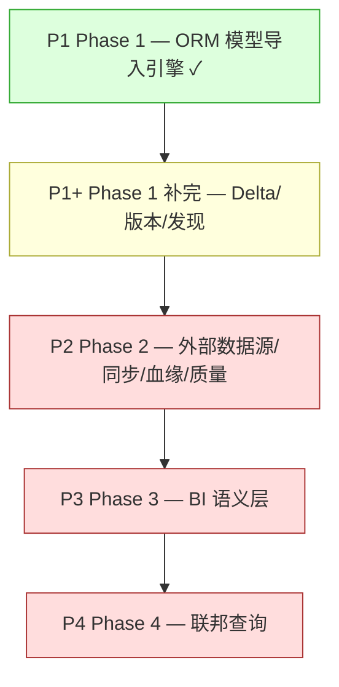

# nop-metadata Implementation Roadmap

> Last Updated: 2026-07-17 (P2-5++ CTE/子查询列穿透（列级血缘解析增强）completed via plan 0852-2; P4-3+ entity↔entity JOIN 聚合查询执行 completed via plan 0852-1; P4-2+ sql/external 端点联邦 JOIN 查询执行 completed via plan 0700-2; P3+/P4+ sql/external 表作为 NopMetaTableJoin 端点 + Measure 跨表校验 completed via plan 0700-1; P3+ 跨表 Measure/Dimension 校验 completed via plan 0228-3; P2-5+ 列级 SQL 血缘解析 completed via plan 0228-2; P-event completed via plan 0228-1; P4-5 completed via plan 0900-2; P4-4 completed via plan 0900-1; P4-2 + P4-3 completed via plan 0800-2; P4-1 completed via plan 0800-1; P2-7 completed via plan 0530-2; P2-5 completed via plan 0420-2; P2-4 completed via plan 0420-1; P2-3 completed via plan 0225-3; P3-2 + P3-3 + P3-4 + P3-5 completed via plan 0700-2; P3-1 + P3-6 completed via plan 0700-1; P1+ completed via plans 294+295; Phase 1 import engine via plan 292)
> Source: 设计体系 `ai-dev/design/nop-metadata/`（00-vision ~ 10-event-model）；`01-architecture-baseline.md` 为架构权威

## Purpose

本文是 nop-metadata 从设计到实现的全局状态索引。AI 或维护者读完本文即知各层工作项是否完成，无需重走全部设计文档与代码。

**本文是编排层，不是 execution plan。** 工作项的逐项实现细节（plan 级描述、代码改动）见各 plan 文件，不在本 roadmap 重复。审计发现、设计决策也各有归属（见 Pointers），不在此维护。

## Work Item Status

> **全文件唯一的动态状态区。更新状态只改这里。**
> 状态流转：draft review 通过 → `todo` 改 `planned`；closure audit 通过 → `planned` 改 `done`（不得提前）。
>
> **注意**：header 必须为 `## Work Item Status`，mission-driver 的 `roadmap-check.mjs` 只识别此标题或 `## 阶段状态`。

- P1. Phase 1 — ORM 模型导入引擎: `done`
- P1+. Phase 1 补完 — Delta 展开 + 版本发布 + 模块发现 + UniqueKey/Index 导入: `done`
- P2. Phase 2 — 外部数据源注册 + 外部表同步 + 血缘采集 + 质量执行: `todo`
- P3. Phase 3 — BI 语义层（视图定义 + 指标/维度管理）: `done`
- P3+/P4+. sql/external 表作为 NopMetaTableJoin 端点（建模 + 校验）+ 其 Measure/Dimension 跨表字段引用校验 + sql/external 端点联邦 JOIN 查询执行（queryJoinData 扩展）: `done`（plan 0700-1 建模+校验；plan 0700-2 JOIN 查询执行，端点组合路由 entity-entity / external-sql↔external-sql / 混合跨库拼接）
- P4. Phase 4 — 联邦查询执行（基于 ORM querySpace）: `todo`

## Status Values

| Status | 含义 |
|--------|------|
| `done` | 该层全部工作项已实现，且对应 plan 通过 closure audit |
| `planned` | 已有 execution plan，等待实现 |
| `todo` | 尚未开始，无对应 plan |

## Platform Reuse

以下能力由 Nop 平台已有模块提供，实现 metadata 层时不重建：

| 能力 | 提供方 | 说明 |
|------|--------|------|
| ORM 模型加载/解析 | `nop-dao` | `OrmModelLoader.loadFromResource`，解析 `*.orm.xml` 为 `IOrmModel` |
| GraphQL 自动暴露 | `nop-graphql` | CrudBizModel 自动生成 findPage/findList/get/save/delete；`@BizMutation` 自定义 action |
| Delta 合并 | `nop-xlang` | `DslModelParser` + `x:extends` 机制 |
| 数据库路由 | `nop-dao` (IOrmTemplate) | ORM 实体 `querySpace` 字段承担跨库路由，无额外 Driver 抽象 |
| RBAC 权限 | `nop-auth` | 角色级访问控制，MetaDataSource/MetaTable 的权限由 nop-auth 承担 |
| 数据字典 | `nop-dao` | `IOrmDictProvider` + `dict/*.dict.yaml`，MetaDict 为元数据层映射 |

## Current Baseline

**已实现：** Phase 1（ORM 模型导入引擎）。

- 21 实体完全建模（`nop-metadata.orm.xml`），覆盖：模块/版本管理（Module/OrmModel）、数据源（DataSource）、ORM 拆解（Entity/Field/Relation/UniqueKey/Index/Domain/SemanticType/Dict/DictItem）、BI 语义层（Table/Measure/Dimension/Filter/Join）、血缘（LineageEdge/Pipeline）、数据质量（QualityRule/QualityResult）
- 21 实体 GraphQL CRUD 自动暴露，无需手写 BizModel
- `importOrmModel` GraphQL action 可用：从平台 `orm.xml` 解析并写入 NopMetaModule / NopMetaOrmModel / NopMetaEntity / NopMetaEntityField / NopMetaEntityRelation / NopMetaDomain / NopMetaDict / NopMetaDictItem / NopMetaTable(tableType=entity)
- 2 个 AutoTest（`TestNopMetaModuleBizModel`）验证端到端链路
- BUILD SUCCESS（8 子模块全部编译通过）

**逐项实现描述** 见 plan 292。

---

## Work Items

> 此处按 Phase 摘要。**逐项实现细节**（含代码改动、测试）在 plan 文件。

### P1. Phase 1 — ORM 模型导入引擎

| 工作项 | 描述 | 状态 |
|--------|------|------|
| P1-1 | 确认 21 实体 CRUD 通过 xbiz 自动暴露 | done |
| P1-2 | `OrmModelImporter`（dao 层）：IOrmModel → NopMeta* 实体转换 | done |
| P1-3 | `NopMetaModuleBizModel.importOrmModel`（service 层）：解析 orm.xml → 导入 → 层级持久化 | done |
| P1-4 | AutoTest：导入 nop-metadata orm.xml 并断言实体/字段/关系数量 | done |

> Plan: 292

### P1+. Phase 1 补完 — Delta 展开 + 版本发布 + 模块发现

| 工作项 | 描述 | 状态 |
|--------|------|------|
| P1+-1 | **isDelta=false full 展开**：导入时同时存储 delta 定义（isDelta=true）和 x:extends 合并后的 full 定义（isDelta=false）| done |
| P1+-2 | **releaseModule action**：实现模块版本发布逻辑（version 自增、status: drafting → released、released 后不可变），替换 OrmModelImporter 中硬编码的 `setModuleVersion(1L)` / `setStatus(DRAFTING)` | done |
| P1+-3 | **MetaModule.baseModuleId 自引用 to-one 关系**：ORM 层补全 self-ref relation，支持 Delta 继承链查询 | done |
| P1+-4 | **MetaEntityUniqueKey / MetaEntityIndex 导入填充**：OrmModelImporter 补充唯一键和索引的导入逻辑 | done |
| P1+-5 | **自动模块发现 / 批量导入**：扫描注册的模块列表，批量导入所有 `orm.xml`，而非仅支持单文件路径 | done |
| P1+-6 | **NopMetaTableJoin to-one 关系补全**：left/right table 的 ORM to-one relation 缺失，需补全 | done |

> Plans: 294（P1+-4/5/6 导入引擎完整性）、295（P1+-1/2/3 Delta 展开 + 版本发布）。设计参考：`03-version-management.md` §三 Delta 链 + 版本不变量；plan 292 Deferred But Adjudicated

### P2. Phase 2 — 外部数据源注册 + 外部表同步 + 血缘采集 + 质量执行

| 工作项 | 描述 | 状态 |
|--------|------|------|
| P2-1 | **MetaDataSource CRUD + 连接验证**：数据源注册（JDBC/HTTP/REST/File），连接配置 JSON，状态管理 | done |
| P2-2 | **外部表元数据同步**：从已注册数据源扫描表结构，写入 MetaTable(tableType=external) + 列结构 JSON（方案 A+A2，见 `01-architecture-baseline.md` §2.5.1） | done |
| P2-3 | **MetaManifest 快照**（新实体）：导入时生成完整元数据快照（模块/模型/实体/依赖图），参考 dbt Manifest | done |
| P2-4 | **MetaCatalog 运行时收集**（新实体）：从数据库收集运行时统计（行数/大小/索引/分区），参考 dbt Catalog | done |
| P2-5 | **血缘采集**：MetaLineageEdge 填充机制（manual + sql_parse 表级，复用 nop-orm-eql AST），向上追溯 + 向下追踪 + 影响分析 + 路径查找（见 `01-architecture-baseline.md` §2.6.1/§2.6.2） | done |
| P2-5++ | **CTE/子查询列穿透（列级血缘解析增强）**：把列级 sql_parse 从「仅直查源表 FROM」扩展到支持 CTE（WITH）与派生表（FROM (...) alias）的别名列穿透，经 CTE/派生表别名引用的列能解析到底层物理源表源列并产出血缘边（见 `01-architecture-baseline.md` §2.6.1 D3 CTE/子查询 + §4.2.1） | done |
| P2-6 | **质量规则执行引擎**：MetaQualityRule 执行（not_null/unique/range/regex/freshness/volume/custom_sql），写入 MetaQualityResult 时序结果 | done |
| P2-7 | **数据剖析**：profiling 规则类型，值分布/统计指标/异常值检测，参考 Apache Griffin | done |

> 设计参考：`05-metadata-import.md`（Manifest + Catalog）；`04-data-governance.md` §三 血缘 + §四 质量；`06-data-quality-extended.md`

### P3. Phase 3 — BI 语义层（视图定义 + 指标/维度管理）

| 工作项 | 描述 | 状态 |
|--------|------|------|
| P3-1 | **SQL 视图创建**：用户输入 SQL，创建 MetaTable(tableType=sql)，运行时解析 SELECT 子句获取字段列表 | done |
| P3-2 | **MetaTableMeasure 管理**：指标定义（aggFunc: sum/count/avg/min/max/countDistinct），format + currencyUnit | done |
| P3-3 | **MetaTableDimension 管理**：维度定义，关联 MetaEntityField | done |
| P3-4 | **MetaTableFilter 管理**：过滤条件定义 | done |
| P3-5 | **MetaTableJoin 管理**：跨表关联（inner/left/right），leftField/rightField 关联条件 | done |
| P3-6 | **视图字段解析方案确定**：待定问题——EXPLAIN vs SELECT ... LIMIT 0 vs 手动录入 | done |

> 设计参考：`01-architecture-baseline.md` §2.5 逻辑表

### P4. Phase 4 — 联邦查询执行（基于 ORM querySpace）

| 工作项 | 描述 | 状态 |
|--------|------|------|
| P4-1 | **MetaTable 查询接口**：基于 ORM IOrmTemplate 的统一查询入口，通过实体 querySpace 路由到对应数据库 | done |
| P4-2 | **跨表 JOIN 执行**：MetaTableJoin 定义的关联条件在查询时翻译为 SQL JOIN（同库）或应用层拼接（跨库） | done |
| P4-3 | **指标/维度聚合查询**：MetaTableMeasure + MetaTableDimension → 聚合 SQL 自动生成 | done |
| P4-3+ | **entity↔entity JOIN 聚合查询执行**：queryAggregation + joinId → 同库 entity↔entity 跨表 Measure/Dimension 经 GROUP BY over JOIN 聚合（external/sql 端点、跨库 JOIN 聚合 deferred） | done |
| P4-4 | **数据契约 MetaDataContract**（新实体）：SLA 定义格式已裁定（JSON Schema/结构化 JSON，拒绝自定义 DSL） | done |
| P4-5 | **Reconciliation 对账**（3 个新实体）：MetaReconciliationConfig / MetaReconciliationResult / MetaReconciliationEntity，可插拔对账服务，兼容 OpenRefine Reconciliation API，支持表级/列级对账 | done |

> **设计决策**：架构基线 §七 明确拒绝了 QuerySpace + Driver 运行时抽象。所有查询走现有 ORM 层，实体 querySpace 字段已承担路由。不引入额外 Driver/QuerySpace 抽象层。
>
> 设计参考：`01-architecture-baseline.md` §设计结论 #9 + §七 拒绝清单；`04-data-governance.md` 数据契约

---

## 未建模实体（设计中存在，ORM 中尚未创建）

> 来源：plan 293 固化列表 + `06-data-quality-extended.md`。这些实体在设计文档中定义，但尚未写入 `nop-metadata.orm.xml`。

| 实体 | 目标 Phase | 设计文档 |
|------|-----------|---------|
| ~~`MetaManifest`~~ | ~~P2~~ | ~~`05-metadata-import.md`~~ **已建模（P2-3 done，plan 0225-3）** |
| ~~`MetaCatalog`~~ | ~~P2~~ | ~~`05-metadata-import.md`~~ **已建模（P2-4 done，plan 0420-1）** |
| ~~`MetaProfilingRule`~~ | ~~P2~~ | ~~`06-data-quality-extended.md` §3.1~~ **已建模（P2-7 done，plan 0530-2）** |
| ~~`MetaProfilingResult`~~ | ~~P2~~ | ~~`06-data-quality-extended.md` §3.2~~ **已建模（P2-7 done，plan 0530-2）** |
| ~~`MetaQualityCheckpoint`~~ | ~~P2~~ | ~~`06-data-quality-extended.md` §4.1~~ **已建模（P2-8 done，plan 2026-07-17-0027-1）** |
| ~~`MetaQualityScore`~~ | ~~P2~~ | ~~`06-data-quality-extended.md` §5.1~~ **已建模（P2-9 done，plan 2026-07-17-0027-2）** |
| `MetaDataContract` | ~~P4~~ | ~~`04-data-governance.md`~~ **已建模（P4-4 done，plan 0900-1）** |
| ~~`MetaReconciliationConfig`~~ | ~~P4~~ | ~~`08-reconciliation.md`~~ **已建模（P4-5 done，plan 0900-2）** |
| ~~`MetaReconciliationResult`~~ | ~~P4~~ | ~~`08-reconciliation.md`~~ **已建模（P4-5 done，plan 0900-2）** |
| ~~`MetaReconciliationEntity`~~ | ~~P4~~ | ~~`08-reconciliation.md`~~ **已建模（P4-5 done，plan 0900-2）** |
| ~~`MetaModelChangedEvent`~~ | ~~待定~~ | ~~`10-event-model.md`~~ **已建模（P-event done，plan 2026-07-17-0228-1）** |

---

## Dependency Graph

依赖说明：
- **P1 → P1+**：Delta 展开和版本发布依赖导入引擎已工作
- **P1+ → P2**：外部表同步需要完整的模块/版本模型
- **P2 → P3**：BI 语义层的 SQL 视图可能引用外部表；但 P3 的 Measure/Dimension 管理可基于 P1 已创建的 ORM-backed MetaTable 提前开展（P3 与 P2 可部分并行）
- **P3 → P4**：联邦查询需要 MetaTable + Join + Measure 模型就绪

---

## Pointers

非 roadmap 内容已拆分到各自归属，本文件不重复维护：

- **设计文档** → `ai-dev/design/nop-metadata/`（00-vision ~ 10-event-model，共 11 份编号文档 + README）
- **已完成 plan** → `292`（Phase 1 导入引擎）；`293`（设计一致性修复）；`294`（P1+ 导入引擎完整性）；`295`（P1+ Delta 展开 + 版本发布）；`2026-07-16-0225-1`（P2-1 数据源注册+连接验证）；`2026-07-16-0225-2`（P2-2 外部表同步）；`2026-07-16-0225-3`（P2-3 Manifest 快照）；`2026-07-16-0420-1`（P2-4 Catalog 运行时收集）；`2026-07-16-0420-2`（P2-5 血缘采集+遍历）；`2026-07-16-0800-1`（P4-1 单表联邦查询）；`2026-07-16-0900-1`（P4-4 数据契约 MetaDataContract）；`2026-07-16-0900-2`（P4-5 Reconciliation 对账）；`2026-07-16-1905-1`（P2 entity/sql 执行覆盖扩展：Catalog/Quality/Profiling 三大执行器从 external-only 扩展到 entity + sql 类型表）；`2026-07-17-0228-1`（P-event 元数据变更事件模型 MetaModelChangedEvent）；`2026-07-17-0228-2`（P2-5+ 列级 SQL 血缘解析）；`2026-07-17-0852-2`（P2-5++ CTE/子查询列穿透，列级血缘解析增强，successor of 0228-2）；`2026-07-17-0228-3`（P3+ 跨表 Measure/Dimension 校验）；`2026-07-17-0700-1`（P3+/P4+ sql/external 表作为 NopMetaTableJoin 端点 + Measure 跨表校验，关闭 0228-3 sql/external Join deferred 项）；`2026-07-17-0700-2`（P4-2+ sql/external 端点联邦 JOIN 查询执行 queryJoinData 扩展，successor of 0700-1，关闭 0800-2「sql/external 表作为 JOIN 右表」follow-up）；`2026-07-17-0027-1`（P2-8 质量检查点编排 Checkpoint）；`2026-07-17-0027-2`（P2-9 质量评分 QualityScore）；`2026-07-17-0540-1`（checkpoint→score 自动评分触发接线，关闭 0027-2 deferred 项）；`2026-07-17-0540-2`（checkpoint 结果动作 webhook/notify 投递，关闭 0027-1 notify/webhook deferred 项）
- **活跃 plan** → （无）
- **设计决策** → `01-architecture-baseline.md` §一 设计结论 + §七 拒绝清单
- **待定问题** → `01-architecture-baseline.md` §八 待定问题
- **Gap 分析** → `02-gap-analysis.md`（对比 DataHub/OpenMetadata/Atlas/Amundsen/Marquez）
- **审计发现** → plan 293 的 G1-G10 gap 清单

### Phase 编号映射

本文档的 Phase 划分（P1/P1+/P2-P4）与 `00-vision.md` §设计收敛路径的 4-Phase 列表不完全对齐：

| Vision Phase | Roadmap Phase | 差异说明 |
|---|---|---|
| Vision Phase 1（ORM 导入 + 版本化 + 搜索 + 血缘模型 + 质量规则） | P1 + P1+（+ 血缘/质量**建模**在 P1 ORM 中，**执行**在 P2） | Roadmap 将 Vision Phase 1 拆为 P1（导入引擎）和 P1+（版本化/Delta 展开），搜索能力尚未安排工作项 |
| Vision Phase 2 | P2 | 一致 |
| Vision Phase 3 | P3 | 一致 |
| Vision Phase 4（QuerySpace + Driver） | P4（联邦查询，基于 ORM querySpace） | **vision.md 的 "QuerySpace + Driver" 表述已过时**，架构基线 §七 明确拒绝了 Driver 抽象。以 roadmap P4 描述为准 |

> 注意：plan 292 的 Non-Goals 段（行 28-31）使用了旧的 phase 编号（"Phase 2" = BI 语义层、"Phase 3" = 血缘/质量执行、"Phase 4" = 对账/AI/事件），与 roadmap 编号不同。该编号在 plan 292 closure 时即已过时，以 roadmap 编号为准。

---

## Rule

- 本文档是状态索引和粗粒度 Phase 划分，不是 execution plan。实现细节在 plan 文件，不在本 roadmap。
- **可标记单位是 Phase**（P1 ~ P4 + P1+），当前 P1 为 `done`，其余为 `todo`。新工作项出现时在 Work Item Status 追加。
- **唯一动态块是 Work Item Status**（顶部）。状态不散落到 Work Items 表、Pointers 或别处。
- 审计发现不在此追踪；设计决策不在此重述；逐项实现描述不在此复制。
- 不得在 closure audit 通过前把 Phase 标为 `done`。
