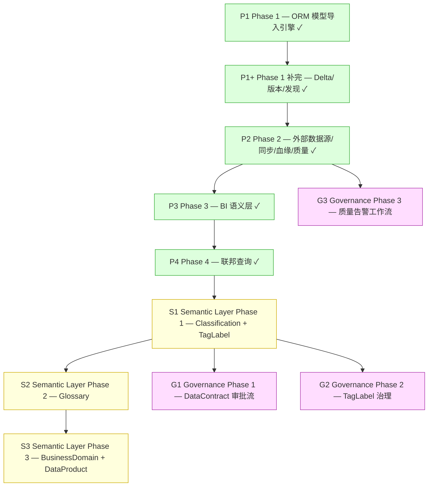

# nop-metadata Implementation Roadmap

> Last Updated: 2026-07-21 (G1 DataContract 审批流 plan 2026-07-20-2000-2 closure audit 落地：roadmap G1 子项全部 done；先前更新：expression 型 Measure 输出列的列级血缘实现 plan 2026-07-18-1800-1 落地：§2.6.1 D1-D5 裁定 + 本 plan 新增 D6 replace 语义裁定落地 + D5 失败处理分层精细化（表级前置失败 vs per-measure 隔离）+ D4 en label 跟随既有模式同步——`extractMeasureLineage` action 在 NopMetaLineageEdgeBizModel 实现 + dict `measure_parse` 新增值经 codegen 生成 `LINEAGE_SOURCE_MEASURE_PARSE` 常量 + flat-collect 自环边产出 + 直接边查询召回（D2，无 contract 变更）+ D6 replace 重抽语义 + case-insensitive 字段比对 + 8 e2e 测试，462 tests；收口 Opt-followup-impl + §八 follow-up 实现部分。先前更新：多列 having 算术表达式 plan 2026-07-18-1500-2 落地：§4.4.2 D11.4 裁定写入——TreeBean `expr` 属性承载（经 setAttr/getAttr，不修改 TreeBean 类）+ preprocess 落点（候选 b：translate 前预处理）+ post-substitution `ExpressionMeasureValidator.validateStatic(saveTimeLoose)` defense-in-depth + name→aggSql 替换 + `?` 安全边界沿用（D12.4）+ Phase 1 字面量禁止 + translate 单次遍历产出参数 + 三条 SQL 路径 6+ 注入点 + 跨库内存 `MemoryFilterEvaluator.evaluate` 入口显式失败；3 新 ErrorCode + 12 单元测试 + 8 e2e 测试，454 tests；收口 Opt-2/Opt-3 两处 `Deferred But Adjudicated`「多列 having 算术表达式」。先前更新：expression 型 Measure 输出列的列级血缘 design-first 裁定 plan 2026-07-18-1500-1 落地：§2.6.1 D1/D3/D4/D5 + §2.6.2 D2 五项裁定写入，§八 follow-up 划线标注裁定覆盖；实现属 successor plan Opt-followup-impl planned。先前更新：expression 型 Measure 表达式语言执行实现 plan 2026-07-18-1400-1 落地：§4.4.2 D12 实现部分收口，6 新 ErrorCode（unparseable/unsafe/dialect-unsupported/memory-not-computable/too-long/having-order-by-unsupported）+ 删除 ERR_AGGR_EXPRESSION_MEASURE；新增 ExpressionMeasureValidator（dialect-independent 静态校验 + dialect-specific 函数支持检查）；5 处抛点替换为真实执行（entity bypass EQL + external-sql withConnection + JOIN 同库注入 <agg>(<validatedExpr>)）+ 跨库内存显式失败；D12.5 save-time 校验经 BizModel.save 入口 + VARCHAR(1000) 容量；参数绑定顺序修正（expression 字面量 → filter → having）；HAVING/ORDER BY 引用 expression measure 显式失败；10 新增 e2e 测试 + 24 单元测试，434 tests)
> Source: 设计体系 `ai-dev/design/nop-metadata/`（00-vision ~ 10-event-model）；`01-architecture-baseline.md` 为架构权威

## Purpose

本文是 nop-metadata 从设计到实现的全局状态索引。AI 或维护者读完本文即知各层工作项是否完成，无需重走全部设计文档与代码。

**本文是编排层，不是 execution plan。** 工作项的逐项实现细节（plan 级描述、代码改动）见各 plan 文件，不在本 roadmap 重复。审计发现、设计决策也各有归属（见 Pointers），不在此维护。

## Work Item Status

> **全文件唯一的动态状态区。更新状态只改这里。**
> 状态流转：draft review 通过 → `todo` 改 `planned`；closure audit 通过 → `planned` 改 `done`（不得提前）。
>
> **注意**：header 必须为 `## Work Item Status`，mission-driver 的 `roadmap-check.mjs` 只识别此标题或 `## 阶段状态`。

- P1. Phase 1 — ORM 模型导入引擎: `done`
- P1+. Phase 1 补完 — Delta 展开 + 版本发布 + 模块发现 + UniqueKey/Index 导入: `done`
- P2. Phase 2 — 外部数据源注册 + 外部表同步 + 血缘采集 + 质量执行: `done`
- P3. Phase 3 — BI 语义层（视图定义 + 指标/维度管理）: `done`
- P3+/P4+. sql/external 表作为 NopMetaTableJoin 端点（建模 + 校验）+ 其 Measure/Dimension 跨表字段引用校验 + sql/external 端点联邦 JOIN 查询执行（queryJoinData 扩展）: `done`（plan 0700-1 建模+校验；plan 0700-2 JOIN 查询执行，端点组合路由 entity-entity / external-sql↔external-sql / 混合跨库拼接）
- P4-3++. external↔external 同库 JOIN 聚合（queryAggregation + joinId）+ Measure/Dimension 侧别建模: `done`（plan 1200-1：Measure/Dimension 新增 side 列；external↔external 同库原生 GROUP BY over JOIN；混合/跨库 JOIN 聚合仍 deferred）
- P4-dc-1. 混合端点（entity↔external/sql）同库 JOIN 聚合 — 机制裁定与实现: `done`（plan 1500-1，§4.4.1 D1.5 裁定：external `withConnection` 单连接 + 连接可达性实测判定同库 + entity 物理表直查绕过 ORM session；同库原生 GROUP BY over JOIN 实现；收口 1200-1「混合端点 JOIN 聚合」同库部分，跨库部分仍 deferred → 1500-2）
- P4-dc-2. 跨库 JOIN 聚合（全端点组合：entity↔entity / external↔external / 混合）— 复用 executeJoin + 内存 GROUP BY: `done`（plan 1500-2，§4.4.2 D10 裁定：精确-当-容纳/超限-失败 + 合并行按端点命名空间取值 entity=fieldName/table=物理列名/右侧冲突=`<alias>_<name>`；收口 0852-1/1200-1/0700-2 跨库 JOIN 聚合 deferred 项）
- P5-api-contract. nop-metadata API 契约 + 工程规范 + 文档对齐（I*Biz 接口 + DTO + ErrorCode 集中化 + *Service 改名 *Processor + System.currentTimeMillis/CoreMetrics 统一 + lineage.TableReference → SqlTableReference + nop-metadata-api 死模块移除 + docs/03-modules/nop-metadata.md + module-groups + source-anchors META-001..005 + roadmap 实体数 21→32）: `done`（plan 2026-07-19-1250-3，6 phase 全部完成；583 tests pass；docs link checker 0 errors；successor plan 2026-07-19-1250-4 已起草 — MetaAggregationExecutor 3474 行 → 7 Processor 拆分）
- P4. Phase 4 — 联邦查询执行（基于 ORM querySpace）: `done`
- Opt-1. sql 视图字段类型推断方案 B（LIMIT 0 + ResultSetMetaData）— 收口 0700-1/0800-1/1905-1/0700-2 Non-Blocking Follow-up: `done`（plan 2026-07-18-0900-1，§4.2.1 方案 B 已落地 + D1/D2/D3 裁定；querySpace 提供时显式推断真实类型、不提供时维持方案 A type=null；类型不持久化；不修改 `SqlSelectFieldExtractor`/`MetaTableFieldResolver`）
- Opt-2. queryAggregation 增加 having（聚合后过滤）+ orderBy（聚合结果排序）— 收口 0852-1/1200-1/1500-1/1500-2 Non-Blocking Follow-up「聚合 having/排序增强」: `done`（plan 2026-07-18-0900-2，§4.4.2 D11 裁定：D11.1 having TreeBean + FilterToSqlTranslator.translate(filter, fieldResolver) 重载 + name 反查表；D11.2 OrderFieldBean；D11.3 三条路径一致支持：entity/external-sql 单表 + JOIN 同库 3 条 SQL 生成 HAVING/ORDER BY + 跨库内存 MemoryFilterEvaluator/MemoryOrderByComparator；向后兼容：having=null+orderBy=null 零行为变化；395 tests）
- Opt-3. expression 型 Measure 表达式语言设计与执行契约（实现部分）: `done`（plan 2026-07-18-1400-1，§4.4.2 D12 实现落地：6 个新 ErrorCode（unparseable/unsafe/dialect-unsupported/memory-not-computable/too-long/having-order-by-unsupported）+ 删除 ERR_AGGR_EXPRESSION_MEASURE；新增 ExpressionMeasureValidator（关键字/函数黑名单 + 标识符白名单 + 字面量参数绑定 + parse 结构 + dialect-specific 函数支持检查）；5 处抛点替换为真实执行（entity bypass EQL + external-sql withConnection + JOIN 同库三路径注入 <agg>(<validatedExpr>)）+ 跨库内存显式失败；D12.5 save-time 校验（BizModel.save 入口 + VARCHAR(1000) 容量）；参数绑定顺序 R1 修正（expression 字面量 → filter → having）；HAVING/ORDER BY 引用 expression measure 显式失败避免参数计数错配；10 新增 e2e 测试覆盖三路径 + 6 类失败 + save-time，434 tests）
- Opt-4. entity 路径时间维度 granularity 分桶补齐（收口 §4.4.2 D7 follow-up「granularity 暂不下沉到 SQL」）: `done`（plan 2026-07-18-1100-2，§4.4.2 D7 收口 + 新增 D7.1 裁定：候选 a 选定 bypass EQL 经 TableReferenceExecutor 平台 JDBC Connection 直查物理 SQL，复用 GranularityBucketing.translate 同 external/sql 路径产出同一份分桶 SQL；拒绝候选 b（EQL 已知函数覆盖度不足且类型分叉）/候选 c（内存分桶违反 D6 pushdown）；与 §4.4.1 D1.5 拒绝候选 B 区别澄清（单表 entity 聚合物理表天然在平台库，混合端点拒绝理由不适用）；D6 ORM 隐式过滤旁路语义不变；MetaQueryContext 暴露 tableRefExecutor()，executeEntityAggregation 检测 temporal+granularity 时改走 bypass 路径否则维持 orm().executeQuery EQL 路径；5 新增 e2e 测试覆盖 entity 路径各 granularity 分桶 + entity vs external 一致性 + 失败路径 + GraphQL 端到端，400 tests）
- Opt-followup-design. expression 型 Measure 输出列的列级血缘（design-first）: `done`（plan 2026-07-18-1500-1，§2.6.1 D1/D3/D4/D5 + §2.6.2 D2 裁定写入：D1 自环边 + BFS 语义隔离（仅经边直接查询召回，不污染既有 BFS）+ D2 召回路径选直接边查询（拒绝扩展 getImpactAnalysis contract / 拒绝新增 measure-level API 首版）+ D3 flat-collect 多边（偏离 §八 占位符建议，理由：列级精确影响分析）+ D4 lineageSource 新增 measure_parse / transformType=aggregated + D5 复用 ValidatedExpression.identifiers + MetaTableFieldResolver 归属 + per-measure try/catch 隔离契约；§八 follow-up 划线标注裁定覆盖；§2.6 ASCII schema transformExpression→transformExpr 列名收敛；实现属 successor plan）
- Opt-followup-impl. expression 型 Measure 输出列的列级血缘（实现）: `done`（plan 2026-07-18-1800-1，§2.6.1 D1-D5 裁定 + 本 plan 新增 D6 replace 语义裁定落地：`extractMeasureLineage` action 在 NopMetaLineageEdgeBizModel 实现 + dict `measure_parse` 新增值（经 codegen 重新生成 `LINEAGE_SOURCE_MEASURE_PARSE` 常量）+ flat-collect 自环边产出 + 直接边查询召回（D2，仅经既有 CRUD 无新 API）+ D5 失败处理分层（表级前置失败直接中断 / per-measure validator 失败隔离）+ D6 replace 重抽语义 + case-insensitive 字段比对 + 8 条端到端测试覆盖（成功/召回/per-measure 隔离/BFS 非污染/dict 值/replace 幂等/aggFunc null 边界/resolver 表级前置失败），462 tests；收口 §八 follow-up「expression 型 Measure 输出列的列级血缘」实现部分）
- Opt-followup. queryAggregation having 支持多 measure 算术表达式（`HAVING SUM(a)-SUM(b)>100`）: `done`
- S1. Semantic Layer Phase 1 — Classification + TagLabel: `planned`（plan 302）
- S2. Semantic Layer Phase 2 — Glossary: `done`
- S3. Semantic Layer Phase 3 — BusinessDomain + DataProduct: `todo`
- G1. Governance Phase 1 — DataContract 接入审批流: `done`
- G2. Governance Phase 2 — TagLabel 治理: `todo`
- G3. Governance Phase 3 — 质量告警工作流: `todo`（plan 2026-07-18-1500-2，§4.4.2 D11.4 裁定：D11.4.1 TreeBean `expr` 属性承载（经 setAttr/getAttr，不修改 TreeBean 类）+ D11.4.2 preprocess 落点（候选 b：translate 前预处理 having TreeBean）+ post-substitution `ExpressionMeasureValidator.validateStatic(saveTimeLoose)` defense-in-depth + name→aggSql 替换（word-boundary，case-sensitive）+ `?` 安全边界沿用（D12.4）；D11.4.3 Phase 1 字面量禁止（避免 inner-SQL `?` 致参数计数错配）+ translate 单次遍历产出参数；D11.4.4 三条 SQL 路径 6+ 注入点 + 跨库内存 `MemoryFilterEvaluator.evaluate` 入口显式失败 `ERR_AGGR_HAVING_EXPR_MEMORY_NOT_COMPUTABLE`（对齐 D12.2）；3 新 ErrorCode + 12 单元测试 + 8 e2e 测试，454 tests；收口 Opt-2/Opt-3 两处 `Deferred But Adjudicated`「多列 having 算术表达式」）

## Status Values

| Status | 含义 |
|--------|------|
| `done` | 该层全部工作项已实现，且对应 plan 通过 closure audit |
| `planned` | 已有 execution plan，等待实现 |
| `todo` | 尚未开始，无对应 plan |

## Platform Reuse

以下能力由 Nop 平台已有模块提供，实现 metadata 层时不重建：

| 能力 | 提供方 | 说明 |
|------|--------|------|
| ORM 模型加载/解析 | `nop-dao` | `OrmModelLoader.loadFromResource`，解析 `*.orm.xml` 为 `IOrmModel` |
| GraphQL 自动暴露 | `nop-graphql` | CrudBizModel 自动生成 findPage/findList/get/save/delete；`@BizMutation` 自定义 action |
| Delta 合并 | `nop-xlang` | `DslModelParser` + `x:extends` 机制 |
| 数据库路由 | `nop-dao` (IOrmTemplate) | ORM 实体 `querySpace` 字段承担跨库路由，无额外 Driver 抽象 |
| RBAC 权限 | `nop-auth` | 角色级访问控制，MetaDataSource/MetaTable 的权限由 nop-auth 承担 |
| 数据字典 | `nop-dao` | `IOrmDictProvider` + `dict/*.dict.yaml`，MetaDict 为元数据层映射 |

## Current Baseline

**已实现：** Phase 1（ORM 模型导入引擎）。

- 32 实体完全建模（`nop-metadata.orm.xml`），覆盖：模块/版本管理（Module/OrmModel/Manifest/ModelChangedEvent）、数据源（DataSource/Catalog）、ORM 拆解（Entity/Field/Relation/UniqueKey/Index/Domain/SemanticType/Dict/DictItem）、BI 语义层（Table/Measure/Dimension/Filter/Join）、血缘（LineageEdge/Pipeline）、数据质量（QualityRule/QualityResult/QualityCheckpoint/QualityScore/ProfilingRule/ProfilingResult）、数据对账（ReconciliationConfig/ReconciliationEntity/ReconciliationResult）、数据契约（DataContract）
- 32 实体 GraphQL CRUD 自动暴露，无需手写 BizModel（S1 完成后追加 3 个实体至 35，G1 追加少量审批字段）
- `importOrmModel` GraphQL action 可用：从平台 `orm.xml` 解析并写入 NopMetaModule / NopMetaOrmModel / NopMetaEntity / NopMetaEntityField / NopMetaEntityRelation / NopMetaDomain / NopMetaDict / NopMetaDictItem / NopMetaTable(tableType=entity)
- 2 个 AutoTest（`TestNopMetaModuleBizModel`）验证端到端链路
- BUILD SUCCESS（8 子模块全部编译通过）

**逐项实现描述** 见 plan 292。

---

## Work Items

> 此处按 Phase 摘要。**逐项实现细节**（含代码改动、测试）在 plan 文件。

### P1. Phase 1 — ORM 模型导入引擎

| 工作项 | 描述 | 状态 |
|--------|------|------|
| P1-1 | 确认 32 实体 CRUD 通过 xbiz 自动暴露 | done |
| P1-2 | `OrmModelImporter`（dao 层）：IOrmModel → NopMeta* 实体转换 | done |
| P1-3 | `NopMetaModuleBizModel.importOrmModel`（service 层）：解析 orm.xml → 导入 → 层级持久化 | done |
| P1-4 | AutoTest：导入 nop-metadata orm.xml 并断言实体/字段/关系数量 | done |

> Plan: 292

### P1+. Phase 1 补完 — Delta 展开 + 版本发布 + 模块发现

| 工作项 | 描述 | 状态 |
|--------|------|------|
| P1+-1 | **isDelta=false full 展开**：导入时同时存储 delta 定义（isDelta=true）和 x:extends 合并后的 full 定义（isDelta=false）| done |
| P1+-2 | **releaseModule action**：实现模块版本发布逻辑（version 自增、status: drafting → released、released 后不可变），替换 OrmModelImporter 中硬编码的 `setModuleVersion(1L)` / `setStatus(DRAFTING)` | done |
| P1+-3 | **MetaModule.baseModuleId 自引用 to-one 关系**：ORM 层补全 self-ref relation，支持 Delta 继承链查询 | done |
| P1+-4 | **MetaEntityUniqueKey / MetaEntityIndex 导入填充**：OrmModelImporter 补充唯一键和索引的导入逻辑 | done |
| P1+-5 | **自动模块发现 / 批量导入**：扫描注册的模块列表，批量导入所有 `orm.xml`，而非仅支持单文件路径 | done |
| P1+-6 | **NopMetaTableJoin to-one 关系补全**：left/right table 的 ORM to-one relation 缺失，需补全 | done |

> Plans: 294（P1+-4/5/6 导入引擎完整性）、295（P1+-1/2/3 Delta 展开 + 版本发布）。设计参考：`03-version-management.md` §三 Delta 链 + 版本不变量；plan 292 Deferred But Adjudicated

### P2. Phase 2 — 外部数据源注册 + 外部表同步 + 血缘采集 + 质量执行

| 工作项 | 描述 | 状态 |
|--------|------|------|
| P2-1 | **MetaDataSource CRUD + 连接验证**：数据源注册（JDBC/HTTP/REST/File），连接配置 JSON，状态管理 | done |
| P2-2 | **外部表元数据同步**：从已注册数据源扫描表结构，写入 MetaTable(tableType=external) + 列结构 JSON（方案 A+A2，见 `01-architecture-baseline.md` §2.5.1） | done |
| P2-3 | **MetaManifest 快照**（新实体）：导入时生成完整元数据快照（模块/模型/实体/依赖图），参考 dbt Manifest | done |
| P2-4 | **MetaCatalog 运行时收集**（新实体）：从数据库收集运行时统计（行数/大小/索引/分区），参考 dbt Catalog | done |
| P2-5 | **血缘采集**：MetaLineageEdge 填充机制（manual + sql_parse 表级，复用 nop-orm-eql AST），向上追溯 + 向下追踪 + 影响分析 + 路径查找（见 `01-architecture-baseline.md` §2.6.1/§2.6.2） | done |
| P2-5++ | **CTE/子查询列穿透（列级血缘解析增强）**：把列级 sql_parse 从「仅直查源表 FROM」扩展到支持 CTE（WITH）与派生表（FROM (...) alias）的别名列穿透，经 CTE/派生表别名引用的列能解析到底层物理源表源列并产出血缘边（见 `01-architecture-baseline.md` §2.6.1 D3 CTE/子查询 + §4.2.1） | done |
| P2-6 | **质量规则执行引擎**：MetaQualityRule 执行（not_null/unique/range/regex/freshness/volume/custom_sql），写入 MetaQualityResult 时序结果 | done |
| P2-7 | **数据剖析**：profiling 规则类型，值分布/统计指标/异常值检测，参考 Apache Griffin | done |
| P2-multi-schema | **多 schema 数据源支持**：NopMetaTable 增加 schema 列，外部表同步持久化 schema，Catalog/Quality/Profiling 执行器默认取持久化 schema（显式 schemaPattern 可覆盖），去重键收敛为 `(metaModuleId, schema, tableName)`（plan 2026-07-17-0852-3，关闭 1905-1/0225-2/0027-1 反复 deferred 的「多 schema 数据源执行」项） | done |
| P2-cron | **质量检查点 cron 定时调度（nop-job 集成）**：经 nop-job 动态调度路径（`IJobScheduler.addJob/removeJob`）按 cron 表达式定时触发既有 `executeCheckpoint` 编排链；cron 存 `extConfig.schedule`（无 schema 变更）；启动 scanner 全量注册 + 运行时增量；包装 bean `MetaQualityCheckpointScheduler.executeScheduledCheckpoint`（规避 BizProxy/IServiceContext 绑定风险）（见 `01-architecture-baseline.md` §2.7.3.1，plan 2026-07-17-1308-1） | done |

> 设计参考：`05-metadata-import.md`（Manifest + Catalog）；`04-data-governance.md` §三 血缘 + §四 质量；`06-data-quality-extended.md`

### P3. Phase 3 — BI 语义层（视图定义 + 指标/维度管理）

| 工作项 | 描述 | 状态 |
|--------|------|------|
| P3-1 | **SQL 视图创建**：用户输入 SQL，创建 MetaTable(tableType=sql)，运行时解析 SELECT 子句获取字段列表 | done |
| P3-2 | **MetaTableMeasure 管理**：指标定义（aggFunc: sum/count/avg/min/max/countDistinct），format + currencyUnit | done |
| P3-3 | **MetaTableDimension 管理**：维度定义，关联 MetaEntityField | done |
| P3-4 | **MetaTableFilter 管理**：过滤条件定义 | done |
| P3-5 | **MetaTableJoin 管理**：跨表关联（inner/left/right），leftField/rightField 关联条件 | done |
| P3-6 | **视图字段解析方案确定**：待定问题——EXPLAIN vs SELECT ... LIMIT 0 vs 手动录入 | done |

> 设计参考：`01-architecture-baseline.md` §2.5 逻辑表

### P4. Phase 4 — 联邦查询执行（基于 ORM querySpace）

| 工作项 | 描述 | 状态 |
|--------|------|------|
| P4-1 | **MetaTable 查询接口**：基于 ORM IOrmTemplate 的统一查询入口，通过实体 querySpace 路由到对应数据库 | done |
| P4-2 | **跨表 JOIN 执行**：MetaTableJoin 定义的关联条件在查询时翻译为 SQL JOIN（同库）或应用层拼接（跨库） | done |
| P4-3 | **指标/维度聚合查询**：MetaTableMeasure + MetaTableDimension → 聚合 SQL 自动生成 | done |
| P4-3+ | **entity↔entity JOIN 聚合查询执行**：queryAggregation + joinId → 同库 entity↔entity 跨表 Measure/Dimension 经 GROUP BY over JOIN 聚合（external/sql 端点、跨库 JOIN 聚合 deferred） | done |
| P4-3++ | **external↔external 同库 JOIN 聚合 + Measure/Dimension 侧别建模**：Measure/Dimension 新增 side 列（left/right），query-time 侧别解析 + 校验（external/sql 端点 side 必填）；external↔external 同库原生 GROUP BY over JOIN 聚合（混合端点 / 跨库 JOIN 聚合仍 deferred） | done |
| P4-4 | **数据契约 MetaDataContract**（新实体）：SLA 定义格式已裁定（JSON Schema/结构化 JSON，拒绝自定义 DSL） | done |
| P4-5 | **Reconciliation 对账**（3 个新实体）：MetaReconciliationConfig / MetaReconciliationResult / MetaReconciliationEntity，可插拔对账服务，兼容 OpenRefine Reconciliation API，支持表级/列级对账 | done |

> **设计决策**：架构基线 §七 明确拒绝了 QuerySpace + Driver 运行时抽象。所有查询走现有 ORM 层，实体 querySpace 字段已承担路由。不引入额外 Driver/QuerySpace 抽象层。
>
> 设计参考：`01-architecture-baseline.md` §设计结论 #9 + §七 拒绝清单；`04-data-governance.md` 数据契约

### S1. Semantic Layer Phase 1 — Classification + TagLabel

> 设计参考：`11-enterprise-semantic-layer.md` §三 + §六

| 工作项 | 描述 | 状态 |
|--------|------|------|
| S1-1 | 新增 4 个 dict：`meta/tag-label-source`、`meta/tag-label-type`、`meta/tag-label-state`、`meta/tag-provider` | todo |
| S1-2 | 新增实体 `NopMetaClassification`（分类体系，含 to-many tags relation） | todo |
| S1-3 | 新增实体 `NopMetaTag`（分类标签，含自引用 parentTagId 层级） | todo |
| S1-4 | 新增实体 `NopMetaTagLabel`（统一桥接，含 entityType+entityId 索引） | todo |
| S1-5 | 集成测试：GraphQL CRUD + 按 entityType+entityId 查询 | todo |

> Plan: 302

### S2. Semantic Layer Phase 2 — Glossary（计划）

> 设计参考：`11-enterprise-semantic-layer.md` §三 + §六

| 工作项 | 描述 | 状态 |
|--------|------|------|
| S2-1 | 新增实体 `NopMetaGlossary`（业务词汇表） | done |
| S2-2 | 新增实体 `NopMetaGlossaryTerm`（业务术语，含 synonyms/relatedTerms/conceptMappings） | done |
| S2-3 | GlossaryTerm → Classification Tag 自动传播引擎 | done |
| S2-4 | 术语关系管理（broader/narrower/synonym） | done |
| S2-5 | TagLabel 追加审批字段（approveStatus/approvedBy/approvedAt） | todo |

### S3. Semantic Layer Phase 3 — BusinessDomain + DataProduct（计划）

> 设计参考：`11-enterprise-semantic-layer.md` §三 + §六

| 工作项 | 描述 | 状态 |
|--------|------|------|
| S3-1 | 新增实体 `NopMetaBusinessDomain`（业务组织域） | todo |
| S3-2 | 新增实体 `NopMetaDataProduct`（数据产品，含 SLA/ports/生命周期） | todo |
| S3-3 | 资产实体追加 `businessDomainId` 字段 + 域继承机制 | todo |
| S3-4 | DataProduct 资产关联（通过 TagLabel 桥接） | todo |

### G1. Governance Phase 1 — DataContract 接入审批流

> 设计参考：`12-data-contract-and-governance-workflow.md` §三 + §六

| 工作项 | 描述 | 状态 |
|--------|------|------|
| G1-1 | `NopMetaDataContract` 增加 `tagSet="use-approval"` + `approveStatus`/`approvedBy`/`approvedAt` 字段 | done |
| G1-2 | 定义 `.xwf` 工作流 `metaDataContractApproval/v1.xwf`（owner-check → consumer-check） | done |
| G1-3 | xmeta 增加 `wf:wfName` 元数据 + xwf 中配置 `wf-approval:notifyResult` listener | done |
| G1-4 | `NopMetaDataContractBizModel` `approve`/`reject` override + 标记旧方法 `@Deprecated`（实现上使用 full override of `approval-support.xbiz` semantics 而非 `afterApproved`/`afterRejected`，plan 2026-07-20-2000-2） | done |
| G1-5 | 集成测试：审批流程端到端验证（submit → approve → status 变更） | done |

### G2. Governance Phase 2 — TagLabel 治理（计划）

> 设计参考：`12-data-contract-and-governance-workflow.md` §三 + §六

| 工作项 | 描述 | 状态 |
|--------|------|------|
| G2-1 | `NopMetaTagLabel` 追加 `tagSet="use-approval"` + `approveStatus`/`approvedBy`/`approvedAt`（如果 S1 未包含） | todo |
| G2-2 | 定义 `tagLabelConfirmApproval/v1.xwf`（reviewer-check 单步审批） | todo |
| G2-3 | 自动传播引擎触发审批：labelType=Derived|Propagated|Automated 时自动 submitForApproval | todo |

### G3. Governance Phase 3 — 质量告警工作流（计划）

> 设计参考：`12-data-contract-and-governance-workflow.md` §三 + §六

| 工作项 | 描述 | 状态 |
|--------|------|------|
| G3-1 | `MetaQualityRuleExecutor` 在 FAIL + severity=ERROR 时发布 `QualityCheckFailedEvent` | todo |
| G3-2 | 事件监听器使用 `IWorkflowManager.newWorkflow()` 创建 `qualityBreachApproval` 工作流实例 | todo |
| G3-3 | 定义 `qualityBreachApproval/v1.xwf`（owner-investigate → 自动验证） | todo |

---

## 未建模实体（设计中存在，ORM 中尚未创建）

> 来源：plan 293 固化列表 + `06-data-quality-extended.md`。这些实体在设计文档中定义，但尚未写入 `nop-metadata.orm.xml`。

| 实体 | 目标 Phase | 设计文档 |
|------|-----------|---------|
| ~~`MetaManifest`~~ | ~~P2~~ | ~~`05-metadata-import.md`~~ **已建模（P2-3 done，plan 0225-3）** |
| ~~`MetaCatalog`~~ | ~~P2~~ | ~~`05-metadata-import.md`~~ **已建模（P2-4 done，plan 0420-1）** |
| ~~`MetaProfilingRule`~~ | ~~P2~~ | ~~`06-data-quality-extended.md` §3.1~~ **已建模（P2-7 done，plan 0530-2）** |
| ~~`MetaProfilingResult`~~ | ~~P2~~ | ~~`06-data-quality-extended.md` §3.2~~ **已建模（P2-7 done，plan 0530-2）** |
| ~~`MetaQualityCheckpoint`~~ | ~~P2~~ | ~~`06-data-quality-extended.md` §4.1~~ **已建模（P2-8 done，plan 2026-07-17-0027-1）** |
| ~~`MetaQualityScore`~~ | ~~P2~~ | ~~`06-data-quality-extended.md` §5.1~~ **已建模（P2-9 done，plan 2026-07-17-0027-2）** |
| `MetaDataContract` | ~~P4~~ | ~~`04-data-governance.md`~~ **已建模（P4-4 done，plan 0900-1）** |
| ~~`MetaReconciliationConfig`~~ | ~~P4~~ | ~~`08-reconciliation.md`~~ **已建模（P4-5 done，plan 0900-2）** |
| ~~`MetaReconciliationResult`~~ | ~~P4~~ | ~~`08-reconciliation.md`~~ **已建模（P4-5 done，plan 0900-2）** |
| ~~`MetaReconciliationEntity`~~ | ~~P4~~ | ~~`08-reconciliation.md`~~ **已建模（P4-5 done，plan 0900-2）** |
| ~~`MetaModelChangedEvent`~~ | ~~待定~~ | ~~`10-event-model.md`~~ **已建模（P-event done，plan 2026-07-17-0228-1）** |
| `NopMetaClassification` | S1 | `11-enterprise-semantic-layer.md` §3.2.1 |
| `NopMetaTag` | S1 | `11-enterprise-semantic-layer.md` §3.2.2 |
| `NopMetaTagLabel` | S1 | `11-enterprise-semantic-layer.md` §3.2.5 |
| `NopMetaGlossary` | S2 | `11-enterprise-semantic-layer.md` §3.2.3 |
| `NopMetaGlossaryTerm` | S2 | `11-enterprise-semantic-layer.md` §3.2.4 |
| `NopMetaBusinessDomain` | S3 | `11-enterprise-semantic-layer.md` §3.2.6 |
| `NopMetaDataProduct` | S3 | `11-enterprise-semantic-layer.md` §3.2.7 |

---

## Dependency Graph

依赖说明：
- **P1 → P1+**：Delta 展开和版本发布依赖导入引擎已工作
- **P1+ → P2**：外部表同步需要完整的模块/版本模型
- **P2 → P3**：BI 语义层的 SQL 视图可能引用外部表；但 P3 的 Measure/Dimension 管理可基于 P1 已创建的 ORM-backed MetaTable 提前开展（P3 与 P2 可部分并行）
- **P3 → P4**：联邦查询需要 MetaTable + Join + Measure 模型就绪

---

## Pointers

非 roadmap 内容已拆分到各自归属，本文件不重复维护：

- **设计文档** → `ai-dev/design/nop-metadata/`（00-vision ~ 12-data-contract-and-governance-workflow，共 13 份编号文档 + README）
- **已完成 plan** → `292`（Phase 1 导入引擎）；`293`（设计一致性修复）；`294`（P1+ 导入引擎完整性）；`295`（P1+ Delta 展开 + 版本发布）；`2026-07-16-0225-1`（P2-1 数据源注册+连接验证）；`2026-07-16-0225-2`（P2-2 外部表同步）；`2026-07-16-0225-3`（P2-3 Manifest 快照）；`2026-07-16-0420-1`（P2-4 Catalog 运行时收集）；`2026-07-16-0420-2`（P2-5 血缘采集+遍历）；`2026-07-16-0800-1`（P4-1 单表联邦查询）；`2026-07-16-0900-1`（P4-4 数据契约 MetaDataContract）；`2026-07-16-0900-2`（P4-5 Reconciliation 对账）；`2026-07-16-1905-1`（P2 entity/sql 执行覆盖扩展）；`2026-07-17-0228-1`（P-event 元数据变更事件模型）；`2026-07-17-0228-2`（P2-5+ 列级 SQL 血缘解析）；`2026-07-17-0852-2`（P2-5++ CTE/子查询列穿透）；`2026-07-17-0228-3`（P3+ 跨表 Measure/Dimension 校验）；`2026-07-17-0700-1`（P3+/P4+ sql/external 表作为 NopMetaTableJoin 端点）；`2026-07-17-0700-2`（P4-2+ sql/external 端点联邦 JOIN 查询执行）；`2026-07-17-0027-1`（P2-8 质量检查点编排）；`2026-07-17-0027-2`（P2-9 质量评分）；`2026-07-17-0540-1`（checkpoint→score 自动评分触发）；`2026-07-17-0540-2`（checkpoint 结果动作投递）；`2026-07-17-0852-3`（P2-multi-schema 多 schema 数据源）；`2026-07-17-1308-1`（P2-cron 质量检查点 cron 定时调度 nop-job 集成）；`2026-07-17-1500-1`（P4-dc-1 混合端点同库 JOIN 聚合）；`2026-07-17-1500-2`（P4-dc-2 跨库 JOIN 聚合全端点组合，收口 0852-1/1200-1/0700-2 跨库 deferred）；`2026-07-17-2055-1`（P2+P4 phase closure：系统级回归复核 + roadmap 状态翻转 + §八 待定问题收口）；`2026-07-18-0900-1`（Opt-1 sql 视图字段类型推断方案 B：LIMIT 0 + ResultSetMetaData，收口 0700-1/0800-1/1905-1/0700-2 Non-Blocking Follow-up）；`2026-07-18-0900-2`（Opt-2 queryAggregation having/orderBy 增强：FilterToSqlTranslator.translate 重载 + MemoryFilterEvaluator/MemoryOrderByComparator + 三条路径一致支持，收口 0852-1/1200-1/1500-1/1500-2 Non-Blocking Follow-up「聚合 having/排序增强」）；`2026-07-18-1100-1`（Opt-3 expression 型 Measure 表达式语言设计与执行契约 design-first：§4.4.2 D12 裁定 方言原生 SQL 片段 + 三条路径契约 + 安全模型 + 失败路径 ErrorCode + 容量约束，实现属 successor plan）；`2026-07-18-1100-2`（Opt-4 entity 路径时间维度 granularity 分桶补齐：§4.4.2 D7 收口 + 新增 D7.1 裁定，bypass EQL 经 TableReferenceExecutor 平台 JDBC Connection 直查物理 SQL，复用 GranularityBucketing.translate 同 external/sql 路径；收口 D7 follow-up「granularity 暂不下沉到 SQL」）；`2026-07-18-1400-1`（Opt-3 expression 型 Measure 表达式语言执行实现：§4.4.2 D12 实现部分收口，新增 ExpressionMeasureValidator（dialect-independent 静态 + dialect-specific 函数检查）+ 6 新 ErrorCode + 5 处抛点替换为真实执行 + D12.5 save-time 校验 + 参数绑定顺序修正 + HAVING/ORDER BY 引用 expression 显式失败，删 ERR_AGGR_EXPRESSION_MEASURE）；`2026-07-18-1500-1`（Opt-followup-design expression 型 Measure 输出列的列级血缘 design-first：§2.6.1 D1/D3/D4/D5 + §2.6.2 D2 五项裁定——D1 自环边 + BFS 语义隔离 + D2 直接边查询召回 + D3 flat-collect 多边 + D4 lineageSource 新增 measure_parse / transformType=aggregated + D5 复用 ValidatedExpression.identifiers + MetaTableFieldResolver 归属 + per-measure try/catch 隔离；§八 follow-up 划线标注裁定覆盖；§2.6 ASCII schema 列名收敛 transformExpression→transformExpr；实现属 successor plan Opt-followup-impl）；`2026-07-18-1500-2`（Opt-followup 多列 having 算术表达式：§4.4.2 D11.4 裁定 TreeBean `expr` 属性承载 + preprocess 落点（候选 b）+ post-substitution validator defense-in-depth + name→aggSql 替换 + `?` 安全边界沿用 + Phase 1 字面量禁止 + 三条 SQL 路径 6+ 注入点 + 跨库内存 `MemoryFilterEvaluator.evaluate` 入口显式失败；3 新 ErrorCode + 12 单元测试 + 8 e2e 测试，454 tests；收口 Opt-2/Opt-3 两处 `Deferred But Adjudicated`「多列 having 算术表达式」）
- **活跃 plan** → `302`（S1 Semantic Layer Phase 1 — Classification + TagLabel，draft 待执行）
- **设计决策** → `01-architecture-baseline.md` §一 设计结论 + §七 拒绝清单
- **待定问题** → `01-architecture-baseline.md` §八 待定问题
- **Gap 分析** → `02-gap-analysis.md`（对比 DataHub/OpenMetadata/Atlas/Amundsen/Marquez）
- **审计发现** → plan 293 的 G1-G10 gap 清单

### Phase 编号映射

本文档的 Phase 划分（P1/P1+/P2-P4）与 `00-vision.md` §设计收敛路径的 4-Phase 列表不完全对齐：

| Vision Phase | Roadmap Phase | 差异说明 |
|---|---|---|
| Vision Phase 1（ORM 导入 + 版本化 + 搜索 + 血缘模型 + 质量规则） | P1 + P1+（+ 血缘/质量**建模**在 P1 ORM 中，**执行**在 P2） | Roadmap 将 Vision Phase 1 拆为 P1（导入引擎）和 P1+（版本化/Delta 展开），搜索能力尚未安排工作项 |
| Vision Phase 2 | P2 | 一致 |
| Vision Phase 3 | P3 | 一致 |
| Vision Phase 4（QuerySpace + Driver） | P4（联邦查询，基于 ORM querySpace） | **vision.md 的 "QuerySpace + Driver" 表述已过时**，架构基线 §七 明确拒绝了 Driver 抽象。以 roadmap P4 描述为准 |

> 注意：plan 292 的 Non-Goals 段（行 28-31）使用了旧的 phase 编号（"Phase 2" = BI 语义层、"Phase 3" = 血缘/质量执行、"Phase 4" = 对账/AI/事件），与 roadmap 编号不同。该编号在 plan 292 closure 时即已过时，以 roadmap 编号为准。

---

## Rule

- 本文档是状态索引和粗粒度 Phase 划分，不是 execution plan。实现细节在 plan 文件，不在本 roadmap。
- **可标记单位是 Phase**（P1 ~ P4 + P1+ + S1 ~ S3 + G1 ~ G3），当前全 Old Phase（P1/P1+/P2/P3/P4 + 增量项）均为 `done`，新 Phase（S1/S2/S3/G1/G2/G3）为 `planned`/`todo`。新工作项出现时在 Work Item Status 追加。
- **唯一动态块是 Work Item Status**（顶部）。状态不散落到 Work Items 表、Pointers 或别处。
- 审计发现不在此追踪；设计决策不在此重述；逐项实现描述不在此复制。
- 不得在 closure audit 通过前把 Phase 标为 `done`。
