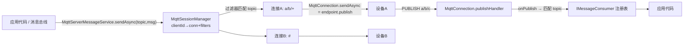

# MQTT 消息设计（下行推送 / 订阅路由 / 消息总线桥接）

**日期**：2026-09-05
**范围**：`nop-vertx-mqtt-server`（`MqttConnection.sendAsync`、`MqttServerMessageService`、`MqttSessionManager`、topic 路由）
**状态**：active

---

## 一、设计结论

1. **`MqttConnection.sendAsync` = 服务端到该客户端的下行 publish**：满足 `IMessageConsumeContext` 契约（消费上下文中回发消息），按 topic 直接投递给当前连接；连接已断开时立即失败，不静默丢弃。
2. **`MqttSessionManager` 升级为订阅感知的会话表**：`clientId → 连接 + 该连接的 topic 过滤器集合`。订阅/退订经 `MqttConnection` 的 handler 同步登记；这是 `MqttServerMessageService.sendAsync` 做服务端内路由的数据基础。
3. **Topic 匹配遵循 MQTT 3.1.1 规范通配**：`+`（单层）与 `#`（多层尾部），分隔符 `/`；匹配器为无状态纯函数（`MqttTopicMatcher.matches(filter, topic)`），入站路由与出站路由共用。
4. **`MqttServerMessageService` 是双向桥**：`sendAsync` = 按 topic 过滤器匹配所有连接并逐一 publish（应用 → 设备方向的广播路由）；`subscribe` = 注册进程内 `IMessageConsumer`，入站 publish（设备 → 应用）按同一匹配器分发。
5. **QoS 与消息转换固定默认，不做配置化**：下行默认 QoS1（AT_LEAST_ONCE，有 PUBACK 确认，`CompletionStage` 在确认后完成）；payload 支持 String（UTF-8）/ byte[]，其余对象 JSON 序列化为文本。QoS 级别等高级控制留给调用方拿 `IMqttConnection` 自行 publish。

## 二、背景与动机

2026-09 缺陷审查确认：`MqttConnection.sendAsync` 与 `MqttServerMessageService.sendAsync/subscribe` 是抛 `UnsupportedOperationException` 的占位，`IMqttAuthChecker` 旁路接入后整个模块无法作为"接入 MQTT 设备的进程内消息服务"使用——设备消息进不来（无 subscribe），应用指令出不去（无 sendAsync）。

## 三、核心设计

### 3.1 数据流



### 3.2 下行 publish 契约（`MqttConnection.sendAsync`）

伪代码：

```
sendAsync(topic, message, options):
  若 endpoint 未连接 → fail(ERR_MQTT_NOT_CONNECTED)     ; 不静默丢
  buffer = message 为 String ? utf8 : message 为 byte[] ? 原样 : JSON 序列化
  QoS1 publish(topic, buffer) → vertx Future<Integer>
  转 CompletionStage<Void>（异常包装为 NopException）
```

### 3.3 订阅登记与路由

- `MqttConnection` 在 `subscribeHandler`/`unsubscribeHandler` 中把过滤器集合登记到 `MqttSessionManager`（连接断开时随连接一起清理）。
- `MqttServerMessageService.sendAsync` 遍历会话表，`MqttTopicMatcher.matches(filter, topic)` 命中任一过滤器即向该连接 publish；无命中连接时正常完成（空广播，非错误）。
- `subscribe(topic, listener)` 的 topic 同样按过滤器语义注册（如 `a/#`）；入站消息按全量注册表匹配分发，`IMessageConsumer.onMessage(topic, data, context)` 收到的 data 为 payload 的 UTF-8 文本（二进制场景直接用 `IMqttHandler`）。
- 分发在 vertx 事件线程上同步执行；`IMessageConsumer.onMessage` 抛出的异常只记日志不中断其他监听器。

### 3.4 错误码

| 错误码 | 场景 |
|--------|------|
| `nop.err.mqtt.not-connected` | 对已断开连接 publish |
| `nop.err.mqtt.publish-fail` | endpoint.publish 异常/被拒 |

## 四、拒绝了什么

- **经 vertx EventBus 转发**：引入集群语义与第二套地址空间；进程内路由表已满足单节点场景，集群路由应在上层（消息中心）解决。
- **跨连接会话持久化 / retained message / QoS2 重投**：`CleanSession=1` 无状态服务是当前模块边界（与 2026-09 审查记录的"MQTT 模块早期定位"一致）；这些是完整 broker 能力，引入即变成第二个 MQTT broker。
- **`MessageSendOptions` 携带 QoS/retain 扩展字段**：`MessageSendOptions` 是 `nop-api-core` 的跨模块公共对象，为单一传输域塞 MQTT 专属字段会污染契约；需要精细控制的调用方直接用 `IMqttConnection`。
- **入站分发异步化（每消息每监听器一个 future）**：`IMessageConsumer.onMessage` 是同步契约；包装成异步链没有收益且放大乱序窗口。

## 五、与已有设计的关系

- 依赖同日缺陷修复建立的会话生命周期（断连清理、会话接管关闭旧连接），订阅登记复用同一清理路径。
- `MqttServerMessageService` 实现 `IMessageService`，可作为 `nop-ai-channel-integration-design.md` 中"传输信道"的候选实现（该设计将 `IMessageService` 定为可复用消息抽象）。
- 文件传输协议（HTTP 域）见本目录 `file-transfer-design.md`，两者无共享协议。
