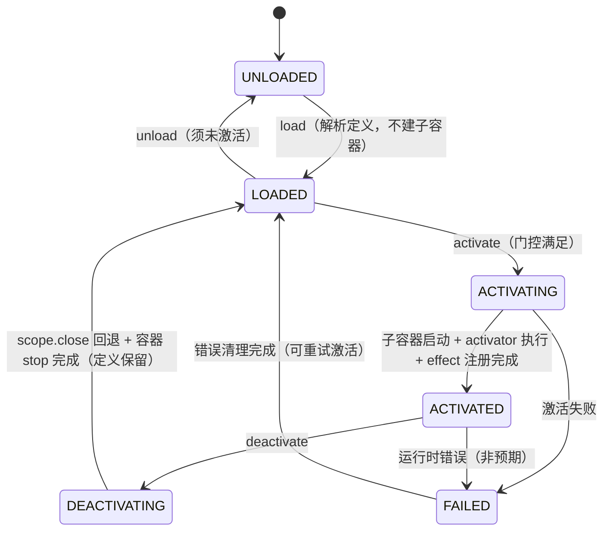
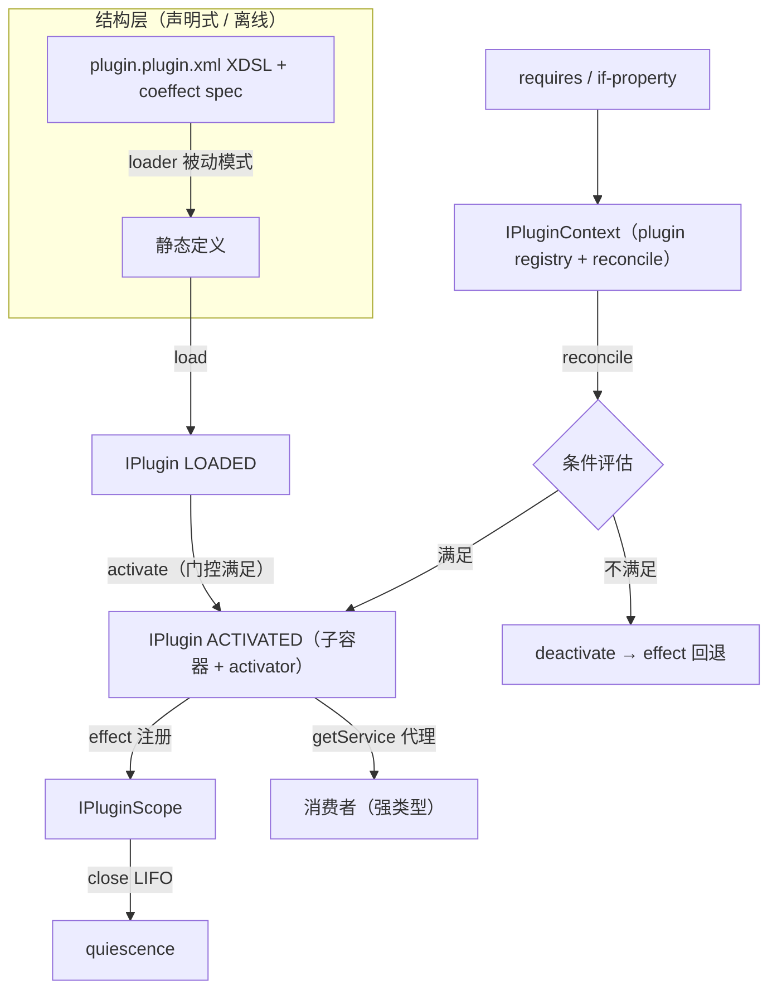

# nop-plugin 增强设计：架构基线

**日期**：2026-08-14（经独立审查第一轮修订）；**2026-08-22 定位反转修订**（单层状态机 + 插件级依赖，见 `00-vision.md` §〇）
**范围**：`nop-core-framework/nop-plugin`（api / manager / support）
**状态**：反转定稿（plan-first，重构实施待 plan audit）

---

## 一、设计结论

1. **plugin 框架与 IoC 解耦**：`nop-plugin-api` 零依赖 IoC 类型（`BeansModel`/`IBeanContainer` 不出现于公开 API）。IoC 仅是内部实现机制（子容器组装 bean），可替换。这保持 `nop-plugin-api` 既有定位："最小化插件接口，不要求插件使用 Nop 平台实现"。
2. **单层状态机（2026-08-22 反转）**：plugin 只有定义级状态 `UNLOADED → LOADED ⇄ ACTIVATED`（+ FAILED）。加载只产出静态定义，激活才实例化子容器并执行 activator。**一个定义至多一个激活**——删除多实例派生（IPluginInstance/createInstance/instanceKey/parent 层级/实例配置域）。理由：凡进入 plugin 层的内容均须加载期可静态声明（准入定义，见 `00-vision.md` §〇 定位声明），运行时变化收敛为激活态迁移 + effect 登记的可逆资源。
3. **依赖只声明在插件级**：coeffect 仅含 `requires`（其他 plugin 已 ACTIVATED）与 `if-property`（全局配置项）。关闭服务级依赖扩展点（原 W8 预留的 `requires-service`）——服务装配属 IoC/结构空间既有语义，插件内服务变更经 HMR 重载重新门控即可。
4. **Revertible effects 系统化**：`IPluginScope` 是 plugin 框架**自己的** effect 机制——`effect(disposable)` 注册、`effects()` 可观测、`close()` LIFO 回退、quiescence 可断言。scope 绑定**每次激活**。**不承诺观测 IoC 内部**。
5. **HMR 简化**：plugin 定义变更 → loader 依赖追踪 → `reloadPlugin`（去激活 → unload → load → reconcile 重新门控），无需重启宿主。无实例快照重建（无实例可重建）。

## 二、背景与动机

### 现状（W1-W7 已落地，待按本基线重构）

2026-08-14 版设计已实现两层状态机 + 多实例。本次反转保留其中与单层模型兼容的部分（load/unload 分离、effect 系统、activator 参数传递、getService 代理、双轨来源、SHA256 校验），收缩实例机制。现状锚点见文末源码锚点表（标注 R1-R4 重构去向）。

### 与 Cordis 思想的关系（反转后的取舍）

| Cordis 思想 | 反转后取舍 | 理由 |
|---|---|---|
| 加载≠激活（fiber PENDING 态） | **采纳**：LOADED/ACTIVATED 两态 + 插件级门控 | "依赖关系控制激活"的直接载体 |
| Revertible effects（ctx.effect 账本） | **采纳**：IPluginScope 绑定每次激活 | quiescence 可断言，卸载可逆 |
| Reactive coeffects | **部分采纳**：仅插件级 requires/if-property；不引入服务名级 inject | 服务坐标不是 Nop 的组合坐标（VFS 路径 + DSL 节点才是）；服务级装配已有 IoC 语义 |
| fiber 多实例/scope/realm | **拒绝** | 客户端 harness 的运行期注册内容需求；Nop 无此认识论需求（00 §〇） |
| 观测等价/quiescence | **采纳** | 与平台无关的可逆性边界 |

### 定义来源与资源解析（双轨，不变）

plugin 定义有**两种来源**，按场景并存，`IPluginManager` 按 id 类型路由：

| 来源 | 场景 | 定义位置 | id 约定 | 类加载 | 类隔离 |
|---|---|---|---|---|---|
| **本地 VFS plugin 定义** | 开发/本地 | VFS 路径的 `*.plugin.xml`（plugin.xdef，含 `<beans>` 子元素） | VFS 路径 | 宿主 classpath | 无 |
| **uber jar（现有）** | 发布/远程 | jar 内 beans.xml（`AppBeanContainerLoader` 现有路径） | Maven 坐标（`ArtifactCoordinates`） | `PluginClassLoader` | 有 |

**统一约束**：
- `getService(Class<T>)` 的接口类型 `T` 在两种场景下均须**宿主可见**。
- 两场景共用同一套状态机与接口契约。**jar 轨契约裁决（2026-08-22 审计补充）**：jar 轨无 plugin.xdef/VFS 定义载体（发现机制 = plugin.json 指定实现类 + 反射，非 ServiceLoader）——R1 后 jar 轨插件的门控属性缺省视为**无条件激活**（requires/if-property 为空集），activator 未声明则跳过激活回调（子容器启动即完成激活）；若未来 jar 轨需要门控，须先为其定义载体立项。
- artifact 远程下载 + SHA256 校验契约见 `05-artifact-loading-design.md`（反转仅影响其 §七 链路终点表述，已更正）。

## 三、状态模型：单层（定义即运行单元）

plugin 的生命周期是**一条单层状态机**：定义（load/unload）与激活（activate/deactivate）在同一对象上演进，一个定义至多一个激活。



> **R 裁决注解（2026-08-22，取代原两层状态机的 W8 六态注解）**：原设计的定义级（UNLOADED/LOADED）+ 实例级（ACTIVATED⇄DEACTIVATED/LOADING/UNLOADING/FAILED）两层坍缩为本单层六态。保留的价值：(a) 中间态可观测性（ACTIVATING/DEACTIVATING 对应原 LOADING/UNLOADING——quiescence 断言可精确表达"回退中 ≠ 已回退"）；(b) 异步生命周期串行化（per-plugin in-flight 单飞，对应 cordis `fiber.inertia`）；(c) 激活窗口时间静止语义（见 §五）。删除的价值：实例身份（instanceKey）、parent 层级、实例配置域、级联销毁——无认识论需求支撑（00 §〇）。

| 状态 | 静态定义 | 内部子容器 | bean 实例 | effect |
|---|---|---|---|---|
| UNLOADED | ✗ | ✗ | ✗ | ✗ |
| LOADED | ✓（可缓存，loader 被动失效） | ✗ | ✗ | ✗ |
| ACTIVATING | ✓ | build 中 | 部分 | 注册中 |
| ACTIVATED | ✓ | ✓（started） | ✓ | ✓（已注册） |
| DEACTIVATING | ✓ | stop 中 | destroy 中 | 回退中 |
| FAILED | ✓ | ✗（已清理） | ✗ | ✗（已回退） |

**关键不变量**：
- **一个定义至多一个激活**：ACTIVATED 态重复 `activate()` 幂等返回成功（并发重复经 in-flight 单飞收敛，不重跑）。
- **unload 前必须先 deactivate**（ACTIVATED/中间态时 unload 抛明确异常）。
- **异步生命周期串行化**：同一 plugin 的 `activate()/deactivate()` 不并发执行（in-flight 单飞）；HMR 与 reconcile 触发的转换经同一串行化入口。
- **跨插件去活性拓扑序（2026-08-22 审计补充，对应 cordis Theorem 63 的 ordering）**：reconcile 批量去激活时按依赖图**逆拓扑序**执行——依赖者（消费者）先于提供者退出；批量激活按**正拓扑序**执行。否则存在窗口期：提供者已完成 effect 回退而消费者尚在 DEACTIVATING，其 bean 调用已销毁的服务（getService 代理的 INACTIVE 快速失败在 DEACTIVATING **完成后**才生效，盖不住该窗口）。
- **去激活顺序**：先 `scope.close()`（LIFO 回退全部 effect）再子容器 stop（触发 bean destroy）——保证 activator 经 scope 注册的 effect 在容器销毁前回退。
- **失败处理**：激活失败置 FAILED 并记录错误，reconcile 下轮重试；失败计数超阈值后暂停该 plugin 的自动激活并报告。

**兼容语义（存量第三方插件）**：`isStateMachineAware()`（default false）检测保留。非 aware 插件走兼容路径：`start` = `load + activate`、`stop` = `deactivate + unload`（比原"createInstance(默认 key)/destroyInstance"更直接——不再需要默认实例 key）。

## 四、Revertible Effects 系统化

### 设计：IPluginScope（绑定每次激活）

```
effect 来源（plugin 框架层）
─────────────────────────
IPluginActivator.activate(scope, config) 返回值   ← 自动注册（便捷模式）
IPluginScope.effect(disposable)                  ← 手动注册
   └─ close(): LIFO 回退全部 → effects() 清空 = quiescence
```

**核心契约**：
- `IPluginScope.effect(Disposable d)`：注册可逆操作，返回可移除句柄。
- `IPluginScope.effects()`：当前已注册 effect 的可观测列表（调试 + quiescence 断言）。
- `IPluginScope.close()`：按 **LIFO** 执行全部 disposer（twisted composition，逆元反序累积）。

> **回退顺序补注（W9 注解保留，2026-08-21 机制核验）**：cordis 单个 effect 内部严格 LIFO、顶层多 effect 并发清理。Nop 选**全量全局 LIFO** 是更严格的超集，天然给出确定性回退序；不为并行回退优化。

**与子容器 destroy 的关系**：子容器 stop 触发 bean destroy（`@PreDestroy`/`<ioc:destroy>`）是实现层附带效果，非 API 契约——plugin 框架的可逆性由 `IPluginScope` 自身保证。未来换实现机制，`IPluginScope` 语义不变。

### scope 的获取机制：参数传递（激活入口）

```java
@FunctionalInterface
public interface IPluginActivator {
    /**
     * 激活入口：scope + config 参数传递（对齐 Cordis apply(ctx, config)）；
     * 返回值(disposer)自动注册为本次激活的 effect。
     */
    Disposable activate(IPluginScope scope, Map<String,Object> config);
}
```

**激活流程**：实例化子容器（bean 自动创建）→ 定位 activator bean → `activator.activate(scope, config)` → activator 内用 `scope.getService()` 取 bean、`scope.effect()` 注册可逆操作：

```java
public class AgentToolsActivator implements IPluginActivator {
    @Override
    public Disposable activate(IPluginScope scope, Map<String,Object> config) {
        FileTool fileTool = scope.getService(FileTool.class);
        fileTool.open();
        return fileTool::close;   // 返回值 = disposer，自动注册为 effect
    }
}
```

**activate 返回值的注册机制**：实现层在返回后若值非 null，自动执行 `scope.effect(returned)`（对应 cordis `safeCollect`）。

**config 来源（反转后）**：定义级配置域 = `loadPlugin(id, config?)` 传入的初始 config + `updateConfig(config)` 的累积合并视图。**不再存在实例配置域**（原 per-instance `IConfigProvider` 删除）；`<ioc:condition>` 等 bean 装配期条件仍读全局配置（定义级，语义一致）。

**close() 后再注册抛异常；重复 close() 幂等。**

### 观测等价边界

`close()` 追求 **quiescence**（所有注册 effect 已回退、无残留），不保证外部副作用可逆。`effects()` 列表使边界可审计：清空 = 内部 quiescence。

## 五、Reactive Coeffect 条件激活（仅插件级）

### 与 build 时条件的区别

`<ioc:condition>` 是 build 时一次性决定 bean 是否包含。coeffect 是运行时：plugin 已加载（LOADED），根据运行时 context 决定是否激活；条件变化可反复激活/去激活。

### 设计：coeffect spec + reconcile

plugin 声明激活条件（载体为 plugin.xdef 原生属性，见 §7.6）：
- `requires="model-provider tool-core"`：所列 plugin 均 ACTIVATED。
- `if-property="agent.tools.enabled|true"`：全局配置项匹配（缺省 expectedValue 视为 true）。

`IPluginContext.reconcile()` 在 context 变化时评估全部 LOADED plugin：

```
context 变化（plugin load/unload/activate/deactivate、配置变更）
    │
    ▼
对每个 LOADED 的 plugin：评估 requires + if-property
    ├─ 条件满足 且 未激活 → activating → activate（按依赖图正拓扑序）
    └─ 条件不满足 且 已激活 → deactivating → deactivate（按依赖图逆拓扑序：消费者先退出）
```

> **R 终裁注解（2026-08-22，取代 W8 依赖粒度注解）**：W8 曾记录"插件级 requires 存在语义缺口——同一插件内部的服务提供者被替换时 reconcile 不触发"，并将服务级依赖（`requires-service`）列为扩展点。**本裁决关闭该扩展点，缺口随之消解**：插件内服务变更属结构变更，走 loader 被动失效 → HMR 重载 → 重新门控，不需要服务级运行时 reconcile。dsh 的 inject 为何是服务名级而 Nop 不需要：dsh 的组合坐标系由 provide/inject 涌现生成（服务坐标即扩展坐标）；Nop 的组合坐标系是 VFS 路径 + DSL 节点，其被动追踪已由 DeltaLoader 提供。在更细粒度上重建一套响应式依赖是对 loader 能力的重复。
>
> **已知限制（同批审计补充，明文化）**：
> 1. **updateConfig 热应用不触发依赖方重门控**——ACTIVATED 态 `updateConfig` 只重算本插件配置视图；若未来某插件的门控或 `<ioc:condition>` 语义依赖另一插件的 updateConfig 结果，需让实现层在 updateConfig 后强制触发 reconcile（当前无此需求，记录为限制而非机制）。
> 2. **编程式 provider swap 在本装配模型下不存在**——子容器静态装配 + scope 不提供动态注册，故"不经文件变更的服务替换"场景当前无法发生；若未来引入编程式替换机制，本终裁的"缺口消解"论证须重新评估。
> 3. **requires 为合取，不可表达析取**——"服务 S 由 A 或 B 提供"无法声明（dsh 服务级 inject 天然支持备选提供者），只能退化为部署期 if-property 开关。服务端定位下可接受。

**环处理**：静态依赖图 DFS 环检测（环成员强制门控关闭并报告 unresolved）+ 防御性迭代上限（不动点收敛通常 ≤ 2 轮）。

**reconcile 不自动 load**：只评估已 LOADED 的 plugin；未加载的定义保持 UNLOADED（load 是显式调用）。

**配置变更触发（责任方）**：API 层只暴露显式 `reconcile()`；实现层订阅配置变更自动触发（API 层保持零依赖）。

**失败处理与同步语义**：
- reconcile 触发 `activate()/deactivate()` 后不阻塞等待（幂等设计可重入，下一轮收敛）。
- 显式 `activate()` 门控未满足时返回 false（no-op），不抛异常；意外失败置 FAILED。

**激活窗口的时间静止（保留原 W8 语义）**：activate 展开期间 coeffect 条件失效 → 不中途打断本次激活，激活完成后排入串行队列立即 deactivate（"完成再收敛"；Nop 的 Java 侧激活是同步资源建立 + 异步编排，展开窗口短，与 cordis epoch 检查"宁可作废"是等效取舍）；deactivate 展开期间条件恢复 → 回退完成后重激活。

## 六、HMR

```
plugin 定义变更（*.plugin.xml 资源 lastModified 变化）
    │ loader 依赖追踪（ResourceComponentManager 已有能力）
    ▼
reloadPlugin(pluginId)：
    若 ACTIVATED/中间态 → deactivate()          // 回退 effect
    unload()                                    // 丢弃旧定义
    load()                                      // 重解析 plugin.xml（重放 updateConfig 累积值）
    reconcile()                                 // 重新门控激活
```

**决策理由**：HMR 复用 loader 依赖追踪失效（被动模式），plugin 层只补"检测变更 → reload 编排"。宿主与其他 plugin 不受影响。无实例快照重建流程（原 P2-A 快照语义随多实例一并删除——唯一需重放的是定义级 updateConfig 累积值）。

> **热更语义取舍记录（继承自原 W8 注解）**：cordis 行级热更是 entry refresh → `fiber.restart()`（同 fiber 身份重激活）；Nop 保持 destroy+重建（定义级重解析），与"定义 = 静态模型"的两段式一致，且在定义级结构变更下语义更干净。**维持不变。**

**注**：远程 uber jar 不可编辑，HMR 主要针对本地/开发文件场景——jar 轨 `reloadPlugin` 显式失败（`ERR_PLUGIN_RELOAD_NOT_SUPPORTED`）。变更检测用资源真实 lastModified；框架核心不主动起轮询线程，提供显式检查入口。

## 七、核心接口契约

> 接口名是架构决策的表达；实现细节见源码。
> **原则：API 层零依赖 IoC 类型。**

### 7.1 IPlugin（定义 + 激活，单一对象）

状态机承载于 IPlugin 自身（不再有独立实例对象）：

| 方法 | 语义 |
|---|---|
| `PluginState getState()` | `UNLOADED / LOADED / ACTIVATING / ACTIVATED / DEACTIVATING / FAILED` |
| `void load(Map config)` | 解析定义到 LOADED（不建子容器） |
| `void unload()` | 丢弃定义（须未激活，否则抛异常） |
| `boolean activate()` | 激活：门控满足时建子容器 + 执行 activator + 注册 effect，返回 true；门控未满足 no-op 返回 false；已 ACTIVATED 幂等返回 true。**同步返回 boolean**（激活的资源建立为同步操作，展开窗口短）；deactivate 涉及异步 effect 回退故返回 CompletionStage——不对称是有意的（见 §四 时间静止语义） |
| `CompletionStage<Void> deactivate()` | 去激活：先 `scope.close()` LIFO 回退，再子容器 stop；回到 LOADED（定义保留） |
| `<T> T getService(Class<T> serviceType)` | 强类型服务获取，返回**激活态绑定代理**：ACTIVATED 时路由到实现，DEACTIVATING 完成后调用快速失败抛 INACTIVE。多候选规则：primary 优先 → bean id 与接口匹配的唯一实现 → 多候选抛明确异常 |
| `<T> Collection<T> getServices(Class<T> serviceType)` | 按类型获取全部实现（集合代理，重激活后恢复可用） |
| `invokeCommand/invokeCommandAsync(command, args, ...)` | **回归定义级路由**（单容器，恢复 W4 之前的原始语义；不再有 per-instance 路由） |
| `void updateConfig(config)` | LOADED 时缓存待激活应用；ACTIVATED 时热应用（合并视图重算 + provider 变更传播） |
| `start/stop` | **兼容保留**：`start` = `load + activate`；`stop` = `deactivate + unload` |

**getService 的代理语义**：代理绑定**插件激活态**（原为实例生命周期）——deactivate 完成后调用抛 INACTIVE 快速失败；重新激活后同一代理引用恢复可用。代理机制裁定（原 W4）全部保留：仅支持接口类型、按调用重新解析、包装时立即解析一次、equals/hashCode 同规则。**变更点仅为绑定对象从 instance 改为 plugin 激活态。**

**旧插件兼容机制**：`isStateMachineAware()` 双路径保留（见 §三 兼容语义）。

### 7.2 ~~IPluginInstance~~（已删除）

**R 裁决（2026-08-22）**：`IPluginInstance` 及相关概念整体移除——`createInstance(pluginId, instanceKey, config, parent)`、`getInstance(pluginId, key)`、`getInstances(pluginId)`、`destroyInstance`、instanceKey、parent 实例层级、级联销毁、实例配置域（per-instance `IConfigProvider`）、实例级 coeffect、per-instance 命令路由。原 W6/W5/P2-D 相关裁决随实例机制一并废止。职责去向：

| 原实例职责 | 去向 |
|---|---|
| 生命周期（activate/deactivate/effect） | `IPlugin` 直接承载（§7.1） |
| 服务获取（getService/getServices 代理） | `IPlugin.getService`（绑定插件激活态） |
| 实例配置域 | 删除；定义级配置域（§四 config 来源） |
| parent 层级/subagent 场景 | 非 plugin 层职责——agent 会话树由 nop-ai-agent session 模型承担 |
| per-instance invokeCommand | 回归定义级路由 |

### 7.3 IPluginManager（管理）

| 方法 | 语义 |
|---|---|
| `IPlugin loadPlugin(id, config?)` | 加载定义到 LOADED（双轨路由：Maven 坐标 → uber jar；路径 → VFS plugin.xml） |
| `void unloadPlugin(id)` | 卸载定义（须未激活） |
| `boolean activatePlugin(id)` | 委托 `IPlugin.activate()` |
| `CompletionStage<Void> deactivatePlugin(id)` | 委托 `IPlugin.deactivate()` |
| `IPlugin getPlugin(id)` | 查询 |
| `void reloadPlugin(id)` | HMR：§六 编排 |
| `void reconcilePlugins()` | 扫描全部 LOADED plugin 的 coeffect，批量 activating/deactivating（委托 context.reconcile） |

### 7.4 IPluginScope（新，不变）

激活期作用域句柄：effect 注册 + 服务获取（`IPluginActivator.activate(scope, config)` 参数传入）。

| 方法 | 语义 |
|---|---|
| `Disposable effect(Disposable d)` | 注册可逆操作，返回可移除句柄 |
| `List<Disposable> effects()` | 当前 effect 可观测视图 |
| `void close()` | LIFO 回退全部 effect（quiescence） |
| `<T> T getService(Class<T> serviceType)` | 激活期取 bean；多候选规则同 7.1；返回真实 bean 非代理（scope 是激活流程内部句柄，无失效语义需求——原 W4 裁定保留） |
| `<T> Collection<T> getServices(Class<T> serviceType)` | 集合版；返回真实 bean 非代理 |

**"注册额外服务"裁决（保留）**：scope 不提供 `provide(name, impl)` 动态注册——子容器静态装配下动态注册无法被同容器 bean 消费；需要时经 beans.xml 静态声明或外部注册表。

### 7.5 IPluginActivator（不变）

见 §四。双参数 `(scope, config)` 参数传递模式保留；返回 Disposable 自动注册为 effect。

### 7.6 IPluginContext（全局上下文）

职责收敛为两件事：**plugin registry** + **coeffect reconcile**。

| 方法 | 语义 |
|---|---|
| `IPlugin getPlugin(id)` | 取 plugin |
| `Collection<IPlugin> allPlugins()` | 全部已加载 plugin（供全局 quiescence 断言） |
| `void reconcile()` | 评估全部 LOADED plugin 的 coeffect spec，批量 activating/deactivating（环检测 + 最大迭代） |

**被移除的设计**（累计）：`resolveKey(key, realm)` 共享数据层（不做）；`getHostContainer()`（不做）；实例 registry（随实例机制删除）。

**coeffect spec 载体（决策保留）**：plugin 有自己的 XDef（`/nop/schema/plugin/plugin.xdef`）——`requires`/`if-property`/`activator` 是原生属性，beans 定义为 `<beans>` 子元素。不改 beans.xdef。**属性集冻结（R 裁决）**：不新增 `requires-service` 等服务级条件属性（§五终裁）。

### 7.7 三层关系（原四层收敛）

```
IPluginContext（全局：plugin registry + coeffect reconcile）
   ├─ IPluginManager（编排门面：load/activate/deactivate/reload/reconcile）
   └─ N × IPlugin（UNLOADED/LOADED ⇄ ACTIVATED，持 IPluginScope@ACTIVATED）
```

## 八、模块边界与数据流



**边界约束**：
- 结构层（loader → 静态定义）与运行时层（激活 → scope）严格分离，loader 不驱动运行时。
- 消费者只经 `getService` 与 plugin 交互，不接触内部子容器。
- `IPluginContext` 只做 registry + reconcile。
- 细粒度定制不经 plugin 层——走 Delta 文件系统对任意 DSL（含 plugin.xml 自身）的节点级合并。

## 九、拒绝了什么

1. **plugin 框架依赖 IoC 公开 API**：拒绝。api 零依赖定位不变。
2. **IPluginScope 聚合观测 IoC 的 destroy/subscription**：拒绝。可逆性由 scope 自证。
3. **realm 共享数据层（resolveKey）**：拒绝。
4. **完全独立新入口（不用 IoC 子容器）**：实现层仍用子容器组装 bean（实现选型，非 API 契约）。
5. **照搬 Cordis 形式化演算/元理论**：拒绝。
6. **退回配置行级 patch**：拒绝，节点级 Delta 优势不可放弃。
7. **coeffect 做成完整类型系统**：拒绝，仅取条件性激活的工程语义。
8. **单独的 Fiber 对象抽象**：拒绝（原裁定）；**2026-08-22 起进一步拒绝多实例本身**——原裁定"IPluginInstance 即 fiber"升级为"无 IPluginInstance"（§7.2）。若未来领域层（如 agent）出现真实的多作用域容器需求，在该层立项，不复用 plugin 层机制预置。
9. **服务级依赖声明（requires-service）**：拒绝（2026-08-22 关闭原扩展点，见 §五 R 终裁注解）。
10. **实例级配置域 / parent 配置层叠**：拒绝（2026-08-22）。租户/会话差异以 `IContext` 数据流经稳定结构；配置差异经部署期 Delta（配置文件分层）表达。**两类配置驱动行为的分界**：随部署环境固定的差异（不同环境不同实现/参数）走部署期 Delta 与配置分层，经定义重载生效；需要运行期开关的激活行为差异走 `if-property` 门控——前者改"内容"，后者改"是否激活"，不混用。

## 十、与已有设计的关系

- `../nop-ioc/bean-dependency-semantics.md`：plugin 实现层复用 IoC 的 bean 依赖语义。本设计不改变这些语义，且 plugin API 不依赖它们。
- beans.xml 的 XDSL/Delta 能力由 `nop-xlang` 提供，本设计直接复用（结构层），API 层不引用其类型。
- `05-artifact-loading-design.md`：artifact 下载 + SHA256 校验 + 类隔离。反转影响面的 §七加载链路终点表述与"ServiceLoader 发现"描述已随 R1 更正（实际机制为 plugin.json 指定实现类 + 反射实例化；05 §七已含 2026-08-22 审计更正注解）。
- `../../analysis/2026-08/2026-08-21-dsh-plugin-system-reference.md`：dsh 机制参考基线。**supersession 交代（2026-08-22）**：该文 §9 "核心结构对齐，无需推倒；instanceKey/parent 链作 agent 层基座"的结论已被本轮定位反转取代（其**机制事实**部分——三层模型/生命周期/可逆性语义核验——仍然有效）；agent 层承接机制以 tag 可见性系统为准（见 `02-dsh-usage-coverage.md` §三.E 改判理由）。
- `00-vision.md`（本目录）：约束与 non-goals 的权威来源。

## 源码锚点

> 标注 ★ 的条目受 R1-R4 重构影响（roadmap 见 `ai-dev/backlog/nop-plugin-enhancement-roadmap.md`）。

| 锚点 | 位置 | 说明 |
|---|---|---|
| ★ `IPluginInstance` | `nop-plugin-api/.../IPluginInstance.java` | **R1 删除**（职责并入 IPlugin，见 §7.2 去向表） |
| `IPluginScope`/`IPluginActivator`/`Disposable` | `nop-plugin-api/...` | 契约保留（scope 绑定对象改激活态） |
| ★ `PluginState`/`InstanceState` 枚举 | `nop-plugin-api/...` | **R1 合并**为单组六态枚举 |
| ★ `IPluginContext` | `nop-plugin-api/.../IPluginContext.java` | **R1 重写**：删 getInstance/allInstances（返回 IPluginInstance），改 getPlugin/allPlugins/reconcile |
| ★ `IPluginManager` | `nop-plugin-manager/.../IPluginManager.java` | **R1 签名收缩**：createInstance/destroyInstance/getInstance(key)/getInstances 为抽象方法（非 default），随接口收缩一并删除 |
| ★ `PluginManagerImpl.createInstance/getInstance/getInstances/destroyInstance` | `nop-plugin-manager/.../PluginManagerImpl.java:200/188/194/237` | **R1 随编译依赖删除方法**（Ownership Deviation：parentToChildren 映射、级联销毁、快照/pending 重建、`ICoeffectEvaluator.isInstanceConfigMatched` 均以 IPluginInstance 为类型或消费者，随 R1 一并移除）；**R2 = 残留引用审计 + InstanceConfigProvider→DefinitionConfigProvider 定义级重命名 + 宽松比较迁移（`PluginManagerImpl.configValueMatches`）+ 实例错误码族退役 + reconcile 拓扑序编排**（与 roadmap R2 条目执行裁定及 R1/R2 plan Closure 记录一致） |
| ★ `PluginInstanceImpl` | `nop-plugin-manager/.../impl/PluginInstanceImpl.java` | **R1 删除**（activate/deactivate/effect 生命周期并入 VfsPluginDefinition 或提取 PluginLifecycle 支持类） |
| ★ `ServiceProxy` | `nop-plugin-manager/.../impl/ServiceProxy.java` | **R1 改造保留**（绑定对象从 instance 改 plugin 激活态） |
| ★ `ICoeffectEvaluator.isInstanceConfigMatched` | `nop-plugin-manager/.../impl/ICoeffectEvaluator.java:31` | **R2 删除实例级条件**；仅保留定义级 requires/if-property |
| ★ `AbstractPlugin.doStart/doStop` | `nop-plugin-support/.../AbstractPlugin.java` | **R3 兼容语义简化**：start = load + activate（不再有默认实例 key）；注意两轨现状差异基线见 roadmap R3 |
| `HttpPluginResourceResolver` | `nop-plugin-manager/.../resolver/` | SHA256 校验链路不变（05 设计） |
| `plugin.xdef` | `nop-plugin-api/_vfs/nop/schema/plugin/plugin.xdef` | 属性集冻结：requires/if-property/activator + `<beans>`（不改 beans.xdef） |

> R 编号归属以 `ai-dev/backlog/nop-plugin-enhancement-roadmap.md` Work Items 为准（2026-08-22 审计对齐：公共 API 面收缩 = R1，编排实现清理 = R2，兼容路径 = R3，测试与 docs = R4）。
