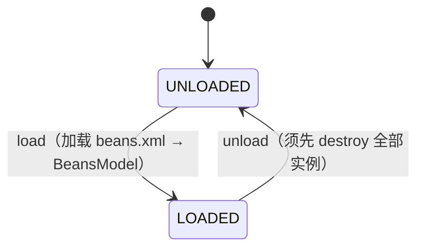
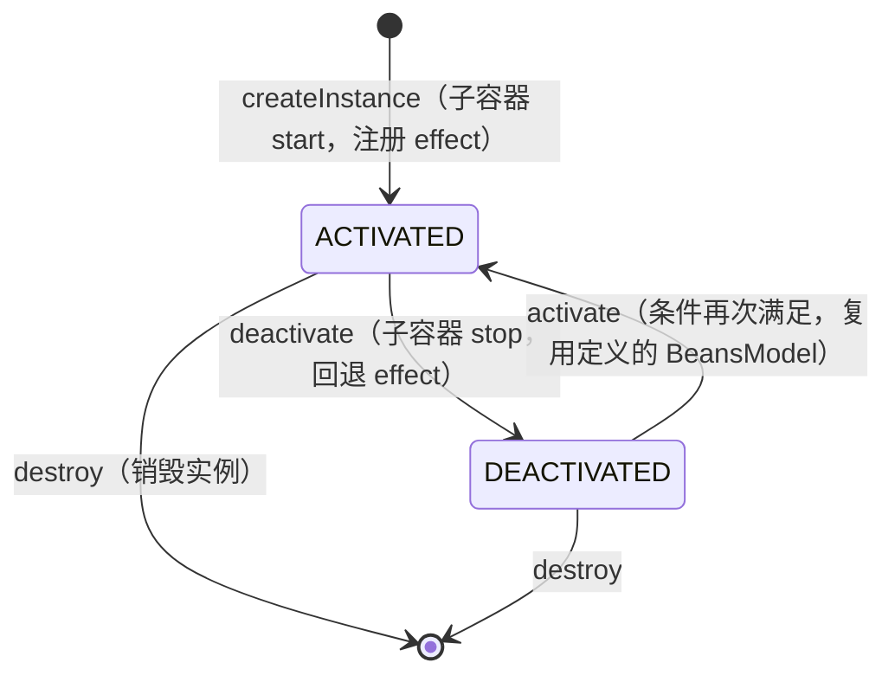
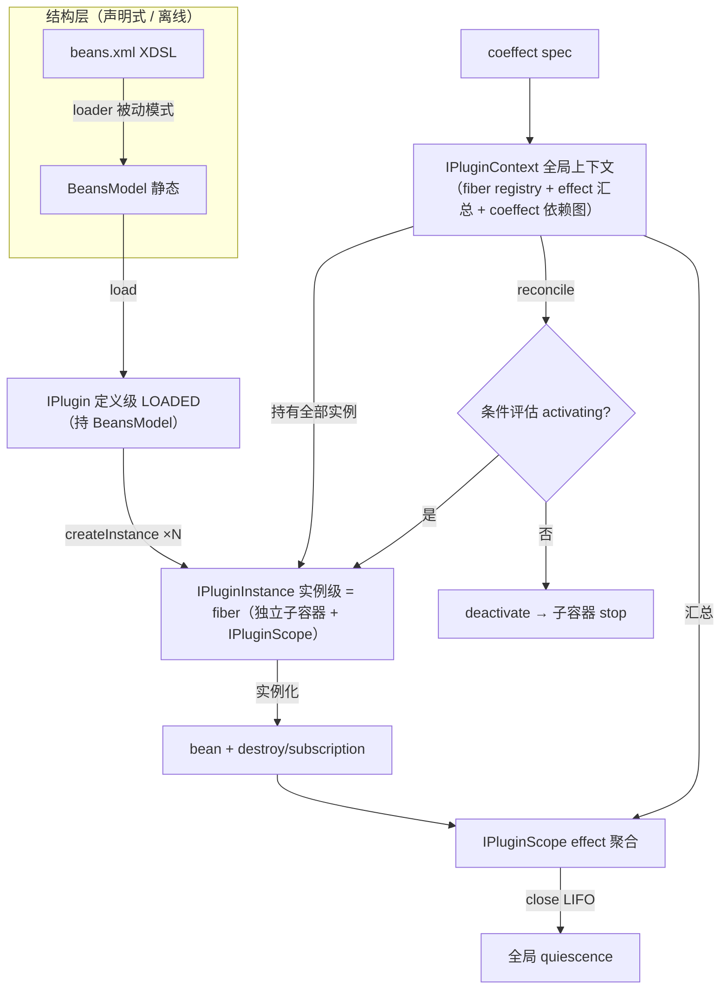

# nop-plugin 增强设计：架构基线

**日期**：2026-08-14
**范围**：`nop-core-framework/nop-plugin`（api / manager / support）
**状态**：草案（plan-first）

---

## 一、设计结论

1. **定义级/实例级两层 + 多实例**：状态机分两层——定义级（`UNLOADED → LOADED`，加载产出 `BeansModel`）与实例级（`ACTIVATED ⇄ DEACTIVATED`，激活创建子容器）。一个 LOADED 定义可派生 N 个独立激活实例（多租户/多 agent）。去激活销毁子容器但保留定义与实例，可重激活。
2. **Revertible effects 系统化**：新增 `IPluginScope`，自动聚合三类可逆操作（bean destroy、subscription cancel、手动回调）为统一可观测 effect 列表，LIFO 回退，支持 quiescence 断言。
3. **Reactive coeffect 条件激活**：plugin 声明激活条件（依赖的 plugin/bean、配置项）；运行时 context 变化时按条件分类 `activating / deactivating / neutral`，动态激活/去激活。
4. **HMR**：plugin 的 beans.xml（XDSL）变更 → loader 依赖追踪 → `BeansModel` 失效重算 → 自动 reload（去激活→重新加载→条件激活）。
5. **全程不改 nop-ioc**：以上全部在 `nop-plugin` 层实现，`BeanContainerImpl` / `IBeanContainer` 公开接口与核心实现不变。
6. **全局上下文 `IPluginContext`**：统一承载所有实例的 effect（全局汇总）+ coeffect（依赖图/共享数据/reconcile），是 `IPluginManager` 的全局状态后端。对应 Cordis context type Γ∞（effect+coeffect 统一实体，论文 §3.3）。
7. **多实例（fiber）**：plugin 定义（`IPlugin`）与实例（`IPluginInstance` = Cordis fiber）分离。一个 LOADED 定义可 `createInstance` 派生 N 个独立激活实例，各自独立子容器/scope/effect，支持 `instanceKey`（租户/agent/session）与 `parent` 层级实例化（agent→subagent）。

## 二、背景与动机

### 现状（已实现）

`nop-plugin` 已具备：load/unload（`PluginManagerImpl`）、plugin=子容器（`AbstractPlugin.doStart()` → `loadFromResource(parent=宿主)`）、卸载=stop→自动 destroy（`doStop()` → `beanContainer.stop()` → `singletonScope.close()` → 遍历 `destroyBean`）、类隔离（`PluginClassLoader`）、远程下载（`HttpPluginResourceResolver`）、cancel 回调（`IPluginCancelToken.appendOnCancel`）、结构层节点级 Delta（beans.xml 是完整 XDSL）。

### 与 Cordis 思想的差距（驱动本设计的四点）

| Cordis 思想 | nop-plugin 现状 | 差距 |
|---|---|---|
| **加载≠激活**：`assertEntriesLoaded`（entries settled）≠ `assertEntriesActivated`（fibers await） | `loadPlugin` 直接 `start`，加载与激活耦合 | 无"已加载未激活"态 |
| **Revertible effects**：`ctx.effect()` 自动跟踪每个副作用的 inverse | `appendOnCancel` 手动回调；destroy 散落各 bean | 无统一可观测 effect 列表 |
| **Reactive coeffects**：context 变化按 spec 分类 activating/deactivating/neutral | `<ioc:condition>` 仅 build 时一次 | 无运行时条件激活/去激活 |
| **观测等价**：recovery 只在 ≃ 下成立，追求 quiescence | stop 触发 destroy 但无 quiescence 验证 | 无系统化等价性边界 |

## 三、状态模型：定义级与实例级两层

多实例需求决定状态分两层：plugin **定义**（load/unload）与 **实例**（activate/deactivate，每个实例 = 一个 fiber）。一个 LOADED 的定义可派生 N 个独立激活实例（多租户/多 agent/多 session 场景）。

### 定义级状态（plugin 定义）



| 定义状态 | BeansModel | 已派生实例数 |
|---|---|---|
| UNLOADED | ✗ | 0 |
| LOADED | ✓（已缓存） | 0..N |

### 实例级状态（每个 fiber = IPluginInstance）



| 实例状态 | 子容器 | bean 实例 | effect | 说明 |
|---|---|---|---|---|
| ACTIVATED | ✓（started） | ✓ | ✓（已注册） | 正常工作 |
| DEACTIVATED | ✗（已 stop） | ✗（已 destroy） | ✗（已回退） | 暂停，可重激活 |
| destroyed | ✗ | ✗ | ✗ | 实例移除（定义仍在，可再 createInstance） |

### 决策理由

- **定义级**（load/unload）对应可逆计算 loader 被动模式第一段（`pluginPath => BeansModel`，静态、可缓存、依赖追踪失效）。
- **实例级**（createInstance/activate/deactivate）对应第二段（`BeansModel => 子容器.start()`，运行时实例化）。
- **一个定义派生多实例**：同一 BeansModel 被 N 个独立子容器实例化，每个实例独立子容器/scope/effect——对应 Cordis "one component instantiated many times over, each carrying a lifecycle state of its own"（论文 §4.1）。典型场景：同一工具 plugin 为每个 agent 会话派生独立实例、同一集成 plugin 为每个租户派生隔离实例。

### 关键不变量

- 实例创建复用所属定义的 BeansModel（不重新加载文件），仅创建新子容器 + 新 scope。
- 每个实例有独立 `instanceKey`（如 tenantId / agentId / sessionId），同一定义下唯一。
- **unload 定义前必须先 destroy 全部实例**（有活跃实例时 unload 抛异常），保证不泄漏子容器。
- 实例间隔离：各自独立子容器（`buildNewInstance(parent=宿主)`）+ 独立 `IPluginScope`，effect 互不干扰。

## 四、Revertible Effects 系统化

### 现状问题

当前可逆操作分散在三处：bean destroy（`BeanDefinition.destroyBean`）、subscription cancel（`subscriptionChecks.cancel()`）、手动 `IPluginCancelToken.appendOnCancel`。无统一视图，无法断言"卸载后所有 effect 已回退"。

### 设计：IPluginScope 聚合

plugin 处于 ACTIVATED 态时拥有一个 `IPluginScope`，统一管理三类 effect：

```
effect 三源                              IPluginScope 聚合
─────────────────                       ──────────────────
bean destroy        ─┐
subscription cancel ─┼─►  自动收集  ─►  effect 列表（可观测、可断言）
手动 appendOnCancel ─┘                   │ close(): LIFO 回退全部
```

**核心契约**（接口名是设计决策，实现见源码）：

- `IPluginScope.effect(Disposable d)`：注册一个可逆操作，返回可移除句柄。等价于 Cordis `ctx.effect()`。
- `IPluginScope.effects()`：返回当前已注册 effect 的可观测列表，供调试与 quiescence 断言。
- `IPluginScope.close()`：按 **LIFO**（后注册先回退）执行全部 disposer——对应 Cordis 论文的 twisted composition（逆元反序累积）。

**LIFO 回退的伪代码**（描述语义，非实现）：

```
close():
  while effects 非空:
    d = effects.popLast()      // 后注册先回退
    try: d.dispose()
    catch: 记录并继续（一个坏 disposer 不阻断其余回退）
  assert effects 为空            // quiescence
```

**自动收集机制**：子容器的 `stop()` 已自动遍历 destroy 全部 bean（`BeanScopeImpl.close()` → `remove()` → `destroyBean()`）。`IPluginScope` 在此基础上额外收集 subscription cancel 与手动回调，统一暴露为 `effects()` 视图——**不替换** IoC 的 destroy 链路，而是**聚合观测**。

### 观测等价边界

`close()` 追求 **quiescence**（所有内部 effect 已回退、无残留），不保证外部副作用（已发网络请求、已写文件）可逆。这与 Cordis 论文 §3.3.2 的观测等价立场一致：recovery 是 idealization，等式只在"无观测者能区分"的意义下成立。`effects()` 列表使这一边界**可审计**：列表清空 = 内部 quiescence 达成。

## 五、Reactive Coeffect 条件激活

### 与 build 时条件的区别

`<ioc:condition>` 是 **build 时**（加载时）一次性决定 bean 是否包含。本设计补充的是 **运行时**条件激活：plugin 已加载（LOADED），但根据运行时 context（其他 plugin 状态、配置值）决定是否激活；条件变化时可去激活再重新激活。

### 设计：coeffect spec + 分类

plugin 声明激活条件（coeffect spec），`IPluginManager` 在 context 变化时评估：

```
context 变化（plugin 加载/卸载、配置变更）
    │
    ▼
对每个 LOADED/ACTIVATED/DEACTIVATED 的 plugin 评估其 coeffect spec
    │
    ├─ 条件满足 且 当前 DEACTIVATED/LOADED  → activating  → activate()
    ├─ 条件不满足 且 当前 ACTIVATED         → deactivating → deactivate()
    └─ 无关                                 → neutral      → 不动
```

**条件来源**（coeffect spec 约束）：
- **依赖**：依赖的其他 plugin 已 ACTIVATED（plugin 间依赖，类比 `<ioc:condition on-bean>` 的运行时版）。
- **配置**：某个配置项为 true（类比 `if-property` 的运行时版）。

**决策理由**：不引入 Cordis 完整的 coeffect 类型系统，仅取其"条件性激活/去激活"的工程语义，用 Nop 已有的 `<ioc:condition>` 词汇（on-bean/if-property）扩展到运行时。复杂度可控，且与 build 时 condition 语义一致。

## 六、HMR

```
beans.xml 修改
    │ loader 依赖追踪（ResourceComponentManager 已有能力）
    ▼
BeansModel 缓存失效 → 重算静态模型
    │
    ▼
plugin reload:
    若 ACTIVATED: deactivate()      // 子容器 stop，但定义将变
    unload()                        // 丢弃旧定义
    load()                          // 加载新 BeansModel
    若条件满足: activate()           // 重新激活
```

**决策理由**：HMR 复用 loader 的依赖追踪失效（被动模式第二层含义），plugin 层只补"检测变更 → reload 编排"。宿主容器与其他 plugin 不受影响（子容器隔离）。

## 七、核心接口契约

> 接口名是架构决策的表达，定义对象间契约；实现细节见源码。

### IPlugin（定义级）

plugin 定义的生命周期：`load` 加载定义（产出 `BeansModel`），`unload` 丢弃定义。**不再含激活/去激活**——那是实例级（`IPluginInstance`）职责。

| 方法 | 语义 |
|---|---|
| `PluginDefState getState()` | 返回 `UNLOADED / LOADED` |
| `void load(groupId, artifactId, version, config)` | 加载定义到 LOADED（产出 BeansModel，不实例化） |
| `void unload()` | 丢弃定义（须先 destroy 全部实例，有活跃实例时抛异常） |
| `BeansModel getBeansModel()` | LOADED 态返回静态定义；否则 null |
| `List<IPluginInstance> getInstances()` | 该定义已派生的全部实例 |
| `void start()/stop()` | **兼容保留**：`start`=`load`+`createInstance(默认key)`，`stop`=`destroyInstance`+`unload`（适配旧单实例契约） |

### IPluginInstance（新，实例级 = fiber）

一个 plugin 定义的激活实例，对应 Cordis fiber。拥有独立子容器、独立 scope、独立生命周期。同一定义可 `createInstance` 多次（多租户/多 agent/多 session）。

| 方法 | 语义 |
|---|---|
| `String getInstanceKey()` | 实例标识（如 tenantId/agentId/sessionId），同一定义下唯一 |
| `InstanceState getState()` | 返回 `ACTIVATED / DEACTIVATED` |
| `CompletionStage<Void> activate()` | 激活（创建子容器、实例化、注册 effect）；异步 |
| `CompletionStage<Void> deactivate()` | 去激活（子容器 stop、回退 effect）；异步 |
| `IPluginScope getScope()` | ACTIVATED 态返回该实例的 effect 聚合器；否则 null |
| `<T> T getService(Class<T> serviceType)` | **按强类型接口获取此实例提供的服务，返回生命周期绑定代理**：ACTIVATED 时路由到 bean（内部委托子容器 `getBeanByType`，父容器回退），deactivate/destroy 后调用快速失败，reload 后指向新实例。须 ACTIVATED 态。**不暴露内部子容器与裸 bean 引用**——子容器是实现细节，消费者只通过此方法获取强类型服务 |
| `IPluginInstance getParent()` | 父实例（可选，支持层级实例化如 agent→subagent）；顶层为 null |
| `void destroy()` | 销毁实例（从定义的实例表中移除） |

### IPluginManager 增强（定义管理 + 实例管理）

| 方法 | 语义 |
|---|---|
| `IPlugin loadPlugin(id)` | 加载定义到 LOADED |
| `void unloadPlugin(id)` | 卸载定义（须先 destroy 全部实例） |
| `IPluginInstance createInstance(pluginId, instanceKey, config)` | 为已 LOADED 的定义派生一个激活实例（coeffect 条件满足时） |
| `void destroyInstance(pluginId, instanceKey)` | 销毁指定实例 |
| `IPluginInstance getInstance(pluginId, instanceKey)` | 查询实例 |
| `List<IPluginInstance> getInstances(pluginId)` | 该定义的全部实例 |
| `void reloadPlugin(id)` | HMR：unload + load + 按原 instanceKey 重建实例 |
| `void reconcileInstances()` | 扫描全部实例的 coeffect，批量 activating/deactivating |

### IPluginScope（新）

| 方法 | 语义 |
|---|---|
| `Disposable effect(Disposable d)` | 注册可逆操作，返回可移除句柄 |
| `List<Disposable> effects()` | 当前 effect 可观测视图 |
| `void close()` | LIFO 回退全部 effect（quiescence） |

### IPluginContext（新，全局上下文）

对应 Cordis 的 context type Γ∞（论文 §3.3）：统一承载所有 plugin 的 effect 与 coeffect 的 first-class 运行时实体。`IPluginManager` 是其编排门面，`IPluginContext` 是它管理的全局状态。

| 方法 | 语义 |
|---|---|
| `IPluginInstance getInstance(pluginId, instanceKey)` | 取实例（fiber） |
| `Collection<IPluginScope> allScopes()` | 全局 effect 视图：所有激活实例的 scope 聚合，支持全局 quiescence 断言 |
| `void reconcile()` | 评估全部实例的 coeffect spec，批量 activating/deactivating/neutral |
| `Object resolveKey(key, realm)` | 共享数据解析：plugin 间 coeffect key 按 realm 隔离（对应 Cordis coeffect isolation） |
| `IBeanContainer getHostContainer()` | 宿主容器（所有 plugin 子容器的 parent） |

**四层关系**：

```
IPluginContext（全局：fiber registry + effect 汇总 + coeffect 依赖图 + 共享数据）
   ├─ IPluginManager（编排门面：load/unload + createInstance/destroyInstance，委托 context）
   ├─ N × IPlugin（定义级：UNLOADED/LOADED，持 BeansModel）
   └─ N × IPluginInstance（实例级 = fiber：ACTIVATED/DEACTIVATED，持子容器 + IPluginScope）
```

### fiber 与多实例（对应 Cordis fiber，显式建模）

Cordis 的 fiber = component 的实例化，携带独立生命周期状态（论文 §4.1：一个 component 可多次实例化，每个 fiber 独立状态、有 identity、有 parent）。本设计**显式建模**多实例：

| Cordis | Nop 对应 |
|---|---|
| component（定义） | `IPlugin`（定义级，持 BeansModel） |
| fiber（实例化 + 生命周期） | `IPluginInstance`（实例级，持子容器 + IPluginScope） |
| fiber 可多次实例化 | 一个 `IPlugin` 可 `createInstance` 多个 `IPluginInstance` |
| fiber identity（name） | `instanceKey`（tenantId / agentId / sessionId） |
| fiber parent（实例化层级） | `IPluginInstance.getParent()`（agent→subagent 层级） |
| registry（持有所有 fiber） | `IPluginContext`（持有所有实例） |
| fiber realm 隔离 | `resolveKey(key, realm)`（实例间共享数据隔离） |

**多实例的典型场景**：
- **多租户**：同一集成 plugin 为每个租户派生独立实例，各自隔离的连接配置与状态。
- **多 agent**：同一工具 plugin 为每个 agent 会话派生独立实例，各自独立的 scope/effect。
- **层级实例化**：agent 实例在其 context 中创建 subagent 实例（`parent` = agent 实例），subagent 子容器 parent 指向 agent 子容器（而非宿主），实现层级隔离与继承。

**实例创建的可逆性**：`createInstance` 建子容器 + 注册 effect；`destroyInstance` 子容器 stop（→ destroyBean → effect 回退）+ 移除实例。定义（BeansModel）不动，可继续派生新实例——这正是可逆计算"结构层（定义）与运行时层（实例）分离"的体现。

**non-goal**：不实现 Cordis 的 fiber 并发交错（interleaved）形式化演算与 Confluence 定理——工程上实例串行创建/销毁已足够，并发用 `CompletionStage.allOf` 即可。

## 八、模块边界与数据流



**边界约束**：
- 结构层（loader → BeansModel）与运行时层（子容器 → effect）严格分离，loader 不驱动运行时。
- `IPluginScope` 只在运行时层存在（ACTIVATED 态）；结构层不感知 effect。
- coeffect 评估跨两层：读结构层（spec 声明）+ 运行时层（当前 context），输出激活决策。

## 九、拒绝了什么

1. **改 nop-ioc 加动态 register/unregister**：`enabledBeans` 改可变会破坏 build 时依赖解析/循环检测不变量，违反静态结构哲学，且属 plan-first 核心区。plugin 可逆性通过子容器 create/stop 已足够。
2. **完全独立新入口（不用 IoC 子容器）**：重复造轮子（IoC 已有 scope/destroy/父子容器），两套生命周期难以协调。
3. **照搬 Cordis 形式化演算/元理论**：Preservation/Confluence 定理证明对工程目标（条件激活、effect 系统化、HMR）无直接收益，徒增复杂度。
4. **退回配置行级 patch**：放弃 beans.xml 节点级 Delta 优势不可接受——这是相对 Cordis 的核心差异化。
5. **将 coeffect 做成完整类型系统**：仅取"条件性激活/去激活"语义，用已有 `<ioc:condition>` 词汇扩展到运行时，不引入新的类型推导机制。

## 十、与已有设计的关系

- `../nop-ioc/bean-dependency-semantics.md`：plugin 子容器复用 IoC 的 bean 依赖语义（ref / depends-on / ioc:before-after）。本设计不改这些语义，仅在其上叠加 plugin 生命周期。
- `../xlang-scope-access-design.md`：`IPluginScope` 的 scope 访问遵循该设计的通用 scope 机制。
- beans.xml 的 XDSL/Delta 能力由 `nop-xlang` 提供（`_BeansModel extends AbstractDslModel`），本设计直接复用，不改动。

## 源码锚点

| 锚点 | 位置 | 说明 |
|---|---|---|
| `AbstractPlugin.doStart/doStop` | `nop-plugin-support/.../AbstractPlugin.java:108/97` | 现有子容器创建/销毁，增强为 load/activate/deactivate |
| `PluginManagerImpl.loadPlugin/unloadPlugin` | `nop-plugin-manager/.../PluginManagerImpl.java:45/64` | 增强为分离的 load/activate/reload |
| `IPluginCancelToken.appendOnCancel` | `nop-plugin-api/.../IPluginCancelToken.java:16` | effect 雏形，`IPluginScope` 系统化其上 |
| `BeanContainerImpl.stop → singletonScope.close` | `nop-ioc/.../BeanContainerImpl.java:558` / `BeanScopeImpl.java:92` | 不改，`IPluginScope` 聚合观测此链路 |
| `BeanDefinition.destroyBean` | `nop-ioc/.../BeanDefinition.java:641` | destroy + subscription cancel，不改，被 effect 聚合 |
