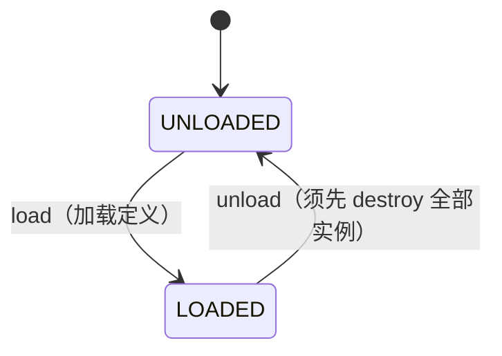
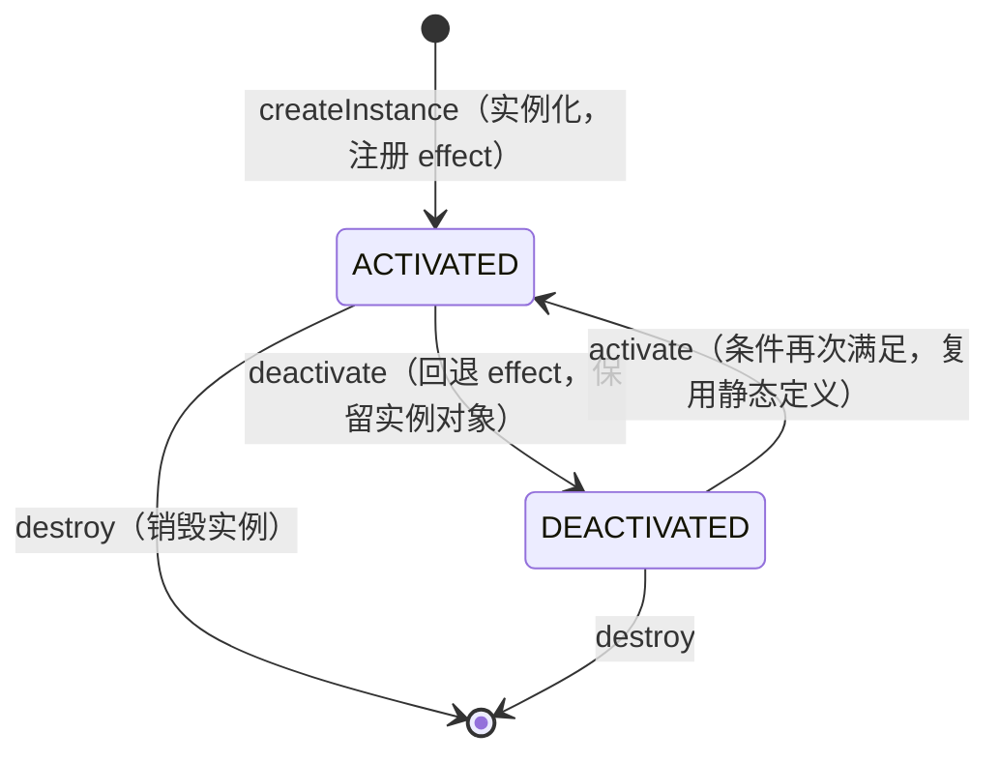
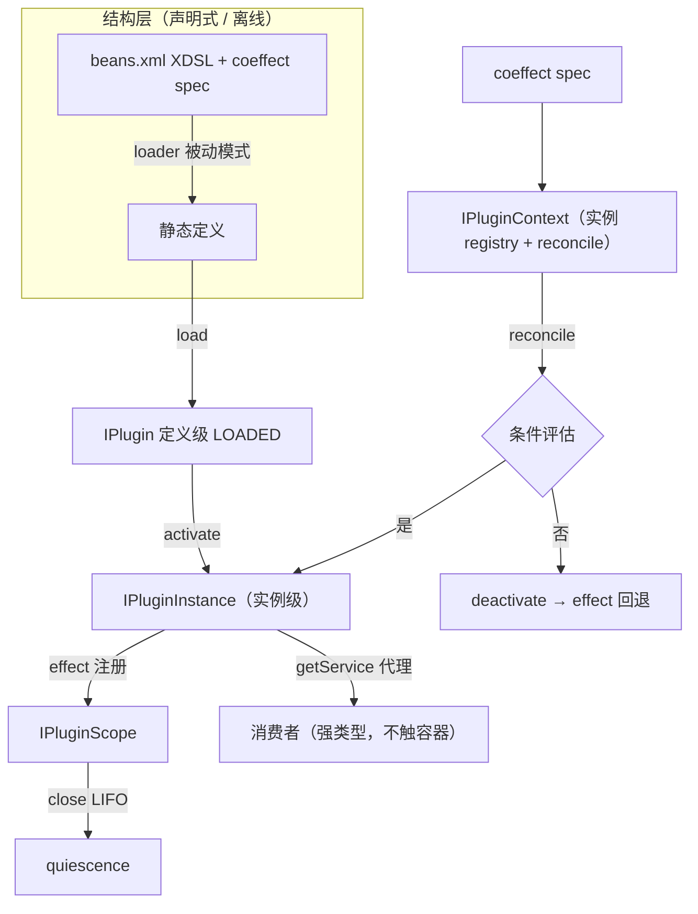

# nop-plugin 增强设计：架构基线

**日期**：2026-08-14（经独立审查第一轮修订）
**范围**：`nop-core-framework/nop-plugin`（api / manager / support）
**状态**：草案（plan-first）

---

## 一、设计结论

1. **plugin 框架与 IoC 解耦**：`nop-plugin-api` 零依赖 IoC 类型（`BeansModel`/`IBeanContainer` 不出现于公开 API）。IoC 仅是内部实现机制（子容器组装 bean），可替换。这保持 `nop-plugin-api` 既有定位："最小化插件接口，不要求插件使用 Nop 平台实现"。
2. **定义级/实例级两层状态（多实例）**：定义级（`UNLOADED → LOADED`）+ 实例级（`ACTIVATED ⇄ DEACTIVATED`）。加载只产出静态定义，激活才实例化。一个定义可派生 **N 个独立激活实例**（多租户/多 agent），每实例独立 scope/effect/配置域，支持 `instanceKey` 与 `parent` 层级实例化（见 §三）。
3. **Revertible effects 系统化**：`IPluginScope` 是 plugin 框架**自己的** effect 机制——`effect(disposable)` 注册、`effects()` 可观测、`close()` LIFO 回退、quiescence 可断言。**不承诺观测 IoC 内部**（子容器 stop 触发 bean destroy 是实现细节，非 API 契约）。
4. **Reactive coeffect 条件激活**：plugin 声明激活条件——**定义级**（依赖其他 plugin 已激活、配置项为 true）决定能否派生实例，**实例级**（基于实例自身配置域）决定该实例是否激活；`IPluginContext.reconcile()` 在 context 变更时评估，activating / deactivating / neutral。
5. **HMR**：plugin 定义变更 → loader 依赖追踪 → `reloadPlugin`（unload + load + 重新激活），无需重启宿主。

## 二、背景与动机

### 现状（已实现）

`nop-plugin` 已具备：load/unload（`PluginManagerImpl`）、plugin=子容器（`AbstractPlugin.doStart()` → `loadFromResource(parent=宿主)`）、卸载=stop→自动 destroy（`doStop()` → `beanContainer.stop()` → `singletonScope.close()` → 遍历 `destroyBean`）、类隔离（`PluginClassLoader`）、远程下载（`HttpPluginResourceResolver`）、命令取消（`IPluginCancelToken`）、结构层节点级 Delta（beans.xml 是完整 XDSL）。

### 与 Cordis 思想的差距（驱动本设计的四点）

| Cordis 思想 | nop-plugin 现状 | 差距 |
|---|---|---|
| **加载≠激活**：fiber 状态机 PENDING（声明未激活，依赖未就绪）→ ACTIVE | `loadPlugin` 直接 `start`，加载与激活耦合 | 无"已加载未激活"态 |
| **Revertible effects**：`ctx.effect()` 自动跟踪每个副作用的 disposer | 仅 `IPluginCancelToken.appendOnCancel`（命令级取消，非插件生命周期 effect）；bean destroy 散落实现层 | 无统一可观测 effect 列表 |
| **Reactive coeffects**：context 变化按 spec 分类 activating/deactivating/neutral | `<ioc:condition>` 仅 build 时一次 | 无运行时条件激活/去激活 |
| **观测等价**：recovery 只在 ≃ 下成立，追求 quiescence | stop 触发 destroy 但无 quiescence 验证 | 无系统化等价性边界 |

**注**：dsh 的 fiber 有 PENDING 态（依赖未就绪则未激活），但它的"激活"仍是加载流程的一部分（inject 驱动，无独立 activate 阶段）；Nop 的增量价值是**定义（静态模型）与实例生命周期显式分离**。

### 定义来源与资源解析（双轨）

plugin 定义有**两种来源**，按场景并存，`IPluginManager` 按 id 类型路由：

| 来源 | 场景 | 定义位置 | id 约定 | 类加载 | 类隔离 |
|---|---|---|---|---|---|
| **本地 VFS plugin 定义** | 开发/本地 | VFS 路径的 `*.plugin.xml`（如 `/plugins/agent-tools/plugin.plugin.xml`，含 beans 子元素） | VFS 路径 | 宿主 classpath | 无（bean 类宿主可见） |
| **uber jar（现有）** | 发布/远程 | jar 内 beans.xml（`AppBeanContainerLoader` 现有路径） | Maven 坐标（groupId/artifactId/version，保留 `ArtifactCoordinates`） | `PluginClassLoader` | 有（独立 ClassLoader） |

**统一约束**：
- `getService(Class<T>)` 的接口类型 `T` 在两种场景下均须**宿主可见**（本地场景宿主 classpath；uber jar 场景接口类由宿主加载），否则消费者无法类型化访问。
- 两场景共用同一套状态机与接口契约（`IPlugin`/`IPluginInstance`/`IPluginScope`）。
- `loadPlugin(id)` 的 `id` 抽象为统一标识（内部区分 VFS 路径与 Maven 坐标）。

**取舍**：本地 beans.xml 是新增的开发友好来源（支持节点级 Delta 定制与 HMR）；uber jar 是现有发布来源（类隔离）。**两者并存**，加载器按 id 类型路由，不替换现有场景。

## 三、状态模型：定义级与实例级两层（多实例）

状态分两层：plugin **定义**（load/unload）与 **实例**（createInstance/activate/deactivate，每个实例 = 一个 fiber）。一个 LOADED 的定义可派生 N 个独立激活实例（多租户/多 agent）。

### 定义级状态（plugin 定义）



| 定义状态 | 静态定义 | 已派生实例数 |
|---|---|---|
| UNLOADED | ✗ | 0 |
| LOADED | ✓（可缓存） | 0..N |

### 实例级状态（每个 fiber = IPluginInstance）



| 实例状态 | 实例对象（固定持有） | 内部子容器 | bean 实例 | effect |
|---|---|---|---|---|
| ACTIVATED | ✓ | ✓（started） | ✓ | ✓（已注册） |
| DEACTIVATED | ✓ | ✗（已 stop） | ✗ | ✗（已回退） |
| destroyed | ✗（从定义移除） | ✗ | ✗ | ✗ |

**决策理由**：
- 定义级对应 loader 被动模式第一段（`pluginPath => 静态定义`，纯静态、可缓存、依赖追踪失效）；实例级对应第二段（`定义 => 实例化`，运行时）。
- 与 Cordis fiber 状态机（PENDING → ACTIVE）同构：LOADED ≈ PENDING、ACTIVATED ≈ ACTIVE。区别：Cordis 激活由 inject 依赖驱动（加载时），Nop 由 coeffect 条件驱动（独立 activate 阶段）。
- **一个定义派生多实例**：同一静态定义被 N 个独立实例化（每实例独立 scope/effect/配置域），对应 Cordis "one component instantiated many times over, each carrying a lifecycle state of its own"（论文 §4.1）。典型场景：同一工具 plugin 为每个 agent 会话派生独立实例、同一集成 plugin 为每个租户派生隔离实例。**多实例是 plugin 框架接口层面的概念**（instanceKey / 独立 scope / 独立配置域），与 IoC 内部实现细节无关。

**关键不变量**：
- 实例创建复用所属定义的静态定义（不重新加载文件），仅创建新实例（scope/effect/配置域）。
- 每个实例有独立 `instanceKey`（tenantId/agentId/sessionId），同一定义下唯一；`getInstance(key)` 按 key 查询。
- **unload 定义前必须先 destroy 全部实例**（有实例时 unload 抛异常）。
- 实例间隔离：独立 `IPluginScope`（effect 互不干扰）、独立配置域（`instance.getConfig()`，plugin 框架自己管理，**不写全局配置**）。
- **异步生命周期串行化**：per-instance 生命周期**串行**——同一实例的 `activate()/deactivate()` 不并发执行（in-flight transition 单飞，类似 dsh `fiber.inertia`）；并发重复 activate 幂等返回既有实例；HMR 与 reconcile 触发的转换经同一串行化入口，无竞争。
- **parent 层级继承语义**（subagent，对应 dsh `ctx.extend` 三重机制）：(a) **服务查找沿链回退**——子实例子容器 parent = 父实例容器 → 宿主，子实例 `getService` 可见父实例服务（与 dsh `this.ctx = parent.extend(...)` 对应）；(b) **生命周期挂靠**——destroy 父实例时**级联 destroy** 子实例（与 dsh `parent.fiber.effect(...)` 级联 dispose 对应）；(c) **配置层叠**——子实例配置域 = 父配置 + 子配置的合并视图（子覆盖父）。

## 四、Revertible Effects 系统化

### 设计：IPluginScope（plugin 框架自己的 effect 机制）

`IPluginScope` 管理 plugin 框架**自己的**可逆操作——不依赖、不承诺观测 IoC 内部：

```
effect 来源（plugin 框架层）
─────────────────────────
IPluginScope.effect(disposable)   ← 手动注册（主要来源）
   └─ close(): LIFO 回退全部 → effects() 清空 = quiescence
```

**核心契约**（接口名是设计决策，实现见源码）：
- `IPluginScope.effect(Disposable d)`：注册可逆操作，返回可移除句柄。等价于 Cordis `ctx.effect()`。
- `IPluginScope.effects()`：当前已注册 effect 的可观测列表，供调试与 quiescence 断言。
- `IPluginScope.close()`：按 **LIFO**（后注册先回退）执行全部 disposer——对应 Cordis 论文的 twisted composition（逆元反序累积）。

**回退伪代码**（描述语义，非实现）：
```
close():
  while effects 非空:
    d = effects.popLast()          // 后注册先回退
    try: d.dispose()
    catch: 记录并继续（一个坏 disposer 不阻断其余）
  assert effects 为空                // quiescence
```

**与子容器 destroy 的关系（实现细节，非 API 契约）**：当前实现用 IoC 子容器组装 bean 时，实例 deactivate 会触发子容器 stop → bean destroy（`@PreDestroy`/`<ioc:destroy>`）。这是**实现层的附带效果**，不是 `IPluginScope` 的 API 承诺——plugin 框架的可逆性由 `IPluginScope` 自身保证（注册即回退），不依赖也不观测 IoC 的 destroy 链路。未来若换实现机制（不用子容器），`IPluginScope` 语义不变。

**`IPluginCancelToken.appendOnCancel` 的定位**：它是**命令级取消**回调（`invokeCommandAsync(command, ..., cancelToken)` 中取消命令执行），与插件生命周期 effect 是两回事，**不是** `IPluginScope` 的聚合来源。若命令执行中注册了资源，由命令实现自行通过 scope 管理。

### scope 的获取机制：参数传递（激活入口）

plugin 定义声明**激活器**（activator），激活时 `scope` **作为参数传入**——与 Cordis `apply(ctx)`、NopBatch `setup(context)` 同构，避免"成员变量保存 context"的 SpringBatch 式坏设计（`docs/theory/why-springbatch-is-bad.md` §3.1：context 应参数传递而非保存为类成员；Hooks 类比：闭包传参优于 this 指针）。

```java
@FunctionalInterface
public interface IPluginActivator {
    /** 激活入口：scope + config 参数传递；返回值(disposer)自动注册为该实例的 effect（等价 scope.effect()） */
    Disposable activate(IPluginScope scope, Map<String,Object> config);
}
```

> `Disposable` 为 plugin 框架自定的函数式接口（`@FunctionalInterface`，保持 `nop-plugin-api` 零依赖）。

**激活流程**：实例化子容器（bean 自动创建）→ 定位 activator bean → `activator.activate(scope, config)`（scope + config 参数传入）→ 激活器内用 `scope.getService()` 取 bean、`scope.effect()` 注册可逆操作：

```java
public class AgentToolsActivator implements IPluginActivator {
    @Override
    public Disposable activate(IPluginScope scope, Map<String,Object> config) {  // 双参数，对齐 apply(ctx, config)
        FileTool fileTool = scope.getService(FileTool.class);   // 从实例取 bean
        fileTool.open();
        // 返回值 = disposer，自动注册为 effect（便捷模式，等价 scope.effect()）
        return fileTool::close;
    }
}
```

**activate 返回值的注册机制**（对应 dsh `safeCollect`）：实现层在 `activator.activate(scope, config)` 返回后，若返回值非 null，**自动执行 `scope.effect(returned)`**——与显式 `scope.effect()` 完全等价（便捷模式 `return () -> cleanup`）。回退时机：实例 `deactivate()/destroy()` 时 `scope.close()` LIFO 回退全部 effect（含返回值注册的）。

**createInstance 同 key 两次**：抛明确异常（instanceKey 同定义下唯一，避免静默覆盖）。

与 Cordis `apply(ctx, config)` 的对应：ctx 参数 → scope 参数；config 参数 → config 参数（**实例配置域**，createInstance 传入 + 定义默认合并视图，**不写全局 AppConfig**）；`ctx.effect()` → `scope.effect()`；`ctx.tools.register()` → 经 `scope.getService()` 获取后调用。

**实例配置域的实现路径**：aware 路径下实例子容器持**独立 `IConfigProvider`**（全局 AppConfig + 实例配置覆盖的合并视图），**不调用 `AppConfig.assignConfigValue`**（现状 `AbstractPlugin.start` 的全局写入仅兼容路径保留）；bean 装配期条件（`<ioc:condition>`）仍走全局（定义级，与"定义级 coeffect 读全局"一致）。

**close() 与子容器 stop 的顺序**：deactivate 时**先 `scope.close()`（回退全部注册 effect）再子容器 stop**（触发 bean destroy）——保证 activator 经 scope 注册的 effect 在容器销毁前回退；子容器 stop 是后续清理（实现细节）。`close()` 后再次 `effect()` 注册抛异常、重复 `close()` 幂等（已关闭则直接返回）。

### 观测等价边界

`close()` 追求 **quiescence**（所有注册 effect 已回退、无残留），不保证外部副作用（已发网络请求、已写文件）可逆。与 Cordis 论文 §3.3.2 一致：recovery 是 idealization，等式只在"无观测者能区分"的意义下成立。`effects()` 列表使边界可审计：清空 = 内部 quiescence。

## 五、Reactive Coeffect 条件激活（定义级 + 实例级）

### 与 build 时条件的区别

`<ioc:condition>` 是 **build 时**一次性决定 bean 是否包含。coeffect 是**运行时**：plugin 已加载（LOADED），根据运行时 context（其他 plugin 状态、配置值）决定是否激活；条件变化可反复激活/去激活。

### 设计：coeffect spec + reconcile

plugin 声明激活条件（载体见 §7.6）：
- **定义级**：依赖其他 plugin 有 ACTIVATED 实例、全局配置项为 true——决定该定义**能否派生实例**。
- **实例级**：基于**实例自身配置域**（`instance.getConfig()`）的条件——决定该实例**是否激活**（多租户/多 agent 下不同实例条件可不同，如 agent-1 开 sandbox、agent-2 不开）。

`IPluginContext.reconcile()` 在 context 变化时评估（定义级 + 实例级）：

```
context 变化（plugin load/unload、实例 create/destroy、配置变更）
    │
    ▼
对每个 LOADED 的 plugin：评估定义级 spec
    不满足 → 不可派生实例（保持 LOADED）
    满足   → 允许 createInstance
对每个实例：评估实例级 spec（基于实例配置域）
    ├─ 条件满足 且 未激活 → activating → activate
    ├─ 条件不满足 且 已激活 → deactivating → deactivate
    └─ 无关 → neutral → 不动
```

**条件来源**：
- **定义级**：依赖的其他 plugin 有 ACTIVATED 实例、全局配置项为 true。
- **实例级**：实例配置域（`instance.getConfig()`）中的配置项为 true。

**环处理**：reconcile 迭代到不动点，设最大迭代次数（如 N=plugin 数）；依赖成环时（A 依赖 B、B 依赖 A）在最大迭代后报告 unresolved（不激活环内 plugin），避免死循环。

**配置变更触发（责任方）**：API 层只暴露显式 `reconcile()`；实现层（manager/support）订阅配置变更并自动触发 `reconcile()`。03 §1.4 示例中"`config.agent.sandbox.enabled=true → 自动 activate`"由实现层的配置订阅保证——不依赖 API 层做任何配置监听（API 层保持零依赖）。

**失败处理与同步语义**：
- reconcile 触发 `activate()/deactivate()` 后**不阻塞等待**（幂等设计使其可重入，下一轮 reconcile 自然收敛）。
- 实例化失败将实例置回 DEACTIVATED/移除并记录错误，下次 reconcile 重试；失败计数超阈值后暂停该实例的激活并报告（避免无限重试）。
- `createInstance` 在定义级 coeffect 不满足时 **no-op（返回 null）**，不抛异常。

**决策理由**：不引入 Cordis 完整 coeffect 类型系统，仅取其"条件性激活/去激活"的工程语义。定义级条件决定"能否派生实例"，实例级条件决定"实例是否激活"（基于实例配置域，plugin 框架自己管理，与 IoC 无关）。

## 六、HMR

```
plugin 定义变更
    │ loader 依赖追踪（ResourceComponentManager 已有能力）
    ▼
静态定义缓存失效 → 重算
    │
    ▼
reloadPlugin:
    若 ACTIVATED: deactivate()          // 回退 effect
    unload()                            // 丢弃旧定义
    load()                              // 加载新定义
    若 coeffect 条件满足: activate()     // 重新激活
```

**决策理由**：HMR 复用 loader 的依赖追踪失效（被动模式），plugin 层只补"检测变更 → reload 编排"。宿主与其他 plugin 不受影响（实例隔离）。**注**：远程下载的 uber jar（发布场景）不可编辑，HMR 主要针对本地/开发文件场景。

## 七、核心接口契约

> 接口名是架构决策的表达，定义对象间契约；实现细节见源码。
> **原则：API 层零依赖 IoC 类型。**

### 7.1 IPlugin（定义级）

**新增方法（均为 `default`——默认实现收敛到状态机，不破坏现有第三方插件实现）**：

| 方法 | 语义 |
|---|---|
| `PluginState getState()` | 返回 `UNLOADED / LOADED` |
| `void load(config)` | 加载定义到 LOADED（不实例化） |
| `void unload()` | 丢弃定义（须先 destroy 全部实例） |
| `IPluginInstance getInstance(String instanceKey)` | 按 key 查询实例（不存在返回 null） |
| `List<IPluginInstance> getInstances()` | 该定义的全部实例 |

**既有方法在新状态机下的语义**：

| 方法 | 态语义 |
|---|---|
| `invokeCommand/invokeCommandAsync` | **兼容语义**：仅当实例数=1 时经该实例路由；多实例时抛明确异常（要求经 `IPluginInstance.invokeCommand` 显式指定实例，避免静默路由错误）；无 ACTIVATED 实例抛 `INACTIVE` |
| `updateConfig(config)` | DEACTIVATED 时缓存待下次激活应用；ACTIVATED 时热应用 |
| `start/stop` | **兼容保留**：`start` = `load` + `createInstance(默认key)`；`stop` = `destroyInstance` + `unload` |

**实例身份模型（多实例）**：每个实例是**独立对象**——`createInstance` 创建，持有独立 `instanceKey`/scope/effect/配置域；**非"定义持有一个固定实例"**。`deactivate` 只销毁实例内部子容器与回退 effect，实例对象保留（可重新 activate）；`destroy` 移除实例。多实例是 plugin 框架接口层面概念，与 IoC 内部实现无关。

**旧插件兼容机制**：新增 `boolean isStateMachineAware()`（default false）。`PluginManagerImpl` 检测：aware → 新状态机（load/activate 分离）；非 aware（存量第三方插件，只有 `start/stop`）→ **兼容路径**：`loadPlugin` 执行旧 `start` 语义（= load + activate，无"已加载未激活"态），`unloadPlugin` 执行旧 `stop`。两套路径并存，不破坏现有第三方实现。

### 7.2 IPluginInstance（实例级）

| 方法 | 语义 |
|---|---|
| `String getInstanceKey()` | 实例标识（tenant/agent/session），同定义下唯一 |
| `InstanceState getState()` | 返回 `ACTIVATED / DEACTIVATED` |
| `CompletionStage<Void> activate()` | 激活（实例化、注册 effect）；异步 |
| `CompletionStage<Void> deactivate()` | 去激活（回退 effect）；异步 |
| `IPluginScope getScope()` | ACTIVATED 态返回 effect 聚合器；否则 null |
| `<T> T getService(Class<T> serviceType)` | **按强类型接口获取服务，返回生命周期绑定代理**：ACTIVATED 时路由到实现，deactivate/destroy 后调用快速失败。**多候选规则**：按 primary 优先；无 primary 时按 bean id 与接口匹配的唯一实现；多候选且无 primary 时抛明确异常（不静默返回集合） |
| `<T> Collection<T> getServices(Class<T> serviceType)` | 按类型获取全部实现（集合） |
| `IPluginInstance getParent()` | 父实例（层级实例化 subagent）；顶层为 null |
| `Map<String,Object> getConfig()` | **实例配置域**（createInstance 传入 + 定义默认合并视图，定义默认 ← 实例覆盖）；**随实例持有、任何态可读**（DEACTIVATED 仍可读——实例级 coeffect 依此评估） |
| `invokeCommand/invokeCommandAsync(command, args, ...)` | **per-instance 命令路由**：路由到本实例子容器（与现有命令 bean 分发复用），多实例下命令隔离由此保证 |
| `void destroy()` | 销毁实例（回退 effect，从定义移除） |

**getService 的代理语义**：返回的代理绑定实例生命周期——deactivate/destroy 后调用抛 `INACTIVE` 异常（快速失败），不悬空。对应 Cordis 的 traceable proxy（访问非活跃 fiber 抛 INACTIVE 错）。

**代理机制裁定**（W4 Phase 1 落定，实现见 `ServiceProxy`）：
- 实现 = `ReflectionManager.instance().newProxyInstance`（GraalVM 原生镜像注册代理类，仓库惯例）；**仅支持接口类型**——`serviceType.isInterface()` 为 false 时抛 `ERR_PLUGIN_SERVICE_PROXY_ONLY_INTERFACE`（带 beanType 参数），`getServices(具体类)` 同规则抛错（具体类无法代理，禁止静默返回裸引用/裸集合）。
- **按调用重新解析**：代理 handler 每次调用从实例**当前** scope 重新解析目标 bean（不捕获一次性引用）——重新 activate 后同一代理引用恢复可用；scope 为 null（deactivate 窗口内已置空）按 INACTIVE 处理，不 NPE；**包装时立即解析一次**（多候选/无候选错误在 getService 调用点抛出，不延迟到首次代理调用）。
- `getServices` 集合代理以 `getBeansOfType` 的 bean id 为候选键，重激活后按 id 重新解析。
- `equals/hashCode/toString` 与业务方法同规则（需 ACTIVATED，deactivated 抛 INACTIVE——一致且无悬空）。

**不暴露内部容器**：子容器是实现细节，API 层不出现 `IBeanContainer`/`BeansModel`。

### 7.3 IPluginManager（管理）

| 方法 | 语义 |
|---|---|
| `IPlugin loadPlugin(id)` | 加载定义到 LOADED |
| `void unloadPlugin(id)` | 卸载定义（须先 destroy 全部实例） |
| `IPluginInstance createInstance(pluginId, instanceKey, config, parent)` | 为已 LOADED 的定义派生一个激活实例（定义级 coeffect 满足时）；`parent` 可空（层级实例化 subagent）；返回实例 |
| `void destroyInstance(pluginId, instanceKey)` | 销毁指定实例（回退 effect、从定义移除） |
| `IPluginInstance getInstance(pluginId, instanceKey)` | 查询实例 |
| `List<IPluginInstance> getInstances(pluginId)` | 该定义的全部实例 |
| `void reloadPlugin(id)` | HMR：unload + load + 重建实例 |
| `void reconcileInstances()` | 扫描全部实例的 coeffect（定义级+实例级），批量 activating/deactivating |

### 7.4 IPluginScope（新）

激活期作用域句柄：effect 注册 + 服务获取（`IPluginActivator.activate(scope, config)` 参数传递的对象）。

| 方法 | 语义 |
|---|---|
| `Disposable effect(Disposable d)` | 注册可逆操作，返回可移除句柄 |
| `List<Disposable> effects()` | 当前 effect 可观测视图 |
| `void close()` | LIFO 回退全部 effect（quiescence） |
| `<T> T getService(Class<T> serviceType)` | 激活期等价 instance 的 `getService`（activator 取 bean 用）；多候选规则同 7.2。**注（W4 裁定）**：等价仅指调用语义（多候选规则相同）；scope 是激活期句柄（activator 在激活流程内调用，无失效语义需求），**返回真实 bean 非代理**——instance 级（7.2）才是代理边界 |
| `<T> Collection<T> getServices(Class<T> serviceType)` | 集合版（`getServices`）；同注：返回真实 bean 非代理 |

**实例配置域（权威在 7.2）**：实例配置（createInstance 传入 + 定义默认合并视图）随 `IPluginInstance` 持有、任何态可读（DEACTIVATED 仍可读，实例级 coeffect 依此评估）；activator 经**参数** `config` 直接获取（不绕 scope）。

**"注册额外服务"裁决**：scope **不提供** `provide(name, impl)` 动态注册——子容器静态装配下，动态注册的服务无法被同容器 bean 消费。activator 需要"注册额外服务"时：经 `scope.getService()` 取 bean 后做**外部注册**（如宿主 context 的注册表），或由 beans.xml 静态声明。

### 7.5 IPluginActivator（新，激活入口）

plugin 定义声明的激活器——激活时 `scope` 与 `config` **作为参数传入**（与 Cordis `apply(ctx, config)` 双参数完全对齐；避免成员变量保存 context 的 SpringBatch 式坏设计）：

| 方法 | 语义 |
|---|---|
| `Disposable activate(IPluginScope scope, Map<String,Object> config)` | 激活入口：scope（实例作用域，服务/effect）+ config（实例配置，createInstance 传入的合并视图）参数传递；**返回值 = disposer（可空），自动注册为该实例的 effect**（与 `scope.effect()` 等价——便捷模式 `return () -> cleanup`，对应 dsh `apply` 返回 `Effect`） |

plugin 定义（`*.plugin.xml`）中通过 `activator="beanId"` 声明（激活时实例化子容器后调用）。**重激活语义**：deactivate 后 activate 重新执行 activator（scope 已 close，需重新注册 effect）；"重复 activate 幂等"仅指并发重复（in-flight 单飞，不重跑）。

### 7.6 IPluginContext（全局上下文）

职责收敛为两件事：**实例 registry** + **coeffect reconcile**（不承担共享数据、不暴露宿主容器）。

| 方法 | 语义 |
|---|---|
| `IPluginInstance getInstance(pluginId, instanceKey)` | 取实例 |
| `Collection<IPluginInstance> allInstances()` | 全部实例（供全局 quiescence 断言：逐个 scope.effects() 清空） |
| `void reconcile()` | 评估全部 plugin 的 coeffect spec，批量 activating/deactivating（环检测 + 最大迭代） |

**被移除的设计**（审查修正）：
- `resolveKey(key, realm)` 共享数据层——不做（`00-vision` non-goals 6；Cordis `ctx.isolate` 是服务名级隔离，非共享数据）。
- `getHostContainer()` 暴露宿主容器——不做（与"不暴露容器"原则冲突；实现层内部自持）。

**coeffect spec 载体（决策）**：plugin 有**自己的 XDef**（`/nop/schema/plugin/plugin.xdef`）——plugin 定义是独立 DSL（`*.plugin.xml`），`requires`/`if-property`/`activator` 是其**原生属性**，beans 定义为其 `<beans>` 子元素（复用 bean 定义模型）。走标准 XDSL 的 Delta/校验管线（`DslModelParser` + plugin.xdef）。**不改 beans.xdef**。

**plugin.xdef 决策（记录，替代此前的 beans.xdef 扩展方案）**：此前方案"`plugin:` 命名空间属性写入 beans.xdef 根元素"被否决——虽与 `ioc:` 历史模式同构，但 beans.xdef 是全平台共享 schema（Protected Area，blast radius = 所有 beans.xml），且"plugin 属性寄生在 beans 根上"与"plugin 框架独立"原则不符。**plugin.xdef 方案**：新增 plugin 专属 schema（新文件，附加式，零共享 schema 变更），plugin 概念在结构层独立成型；备选"独立 plugin.meta.xml 无 XDef"方案仍被拒（丧失 Delta/校验管线）。plan 中不再是 Protected Area 前置（新增 schema 低风险）。

### 7.7 四层关系

```
IPluginContext（全局：实例 registry + coeffect reconcile）
   ├─ IPluginManager（编排门面：load/activate/deactivate/reload，委托 context）
   ├─ N × IPlugin（定义级：UNLOADED/LOADED）
   └─ N × IPluginInstance（实例级：ACTIVATED/DEACTIVATED，持 IPluginScope）
```

## 八、模块边界与数据流



**边界约束**：
- 结构层（loader → 静态定义）与运行时层（实例 → scope）严格分离，loader 不驱动运行时。
- 消费者只经 `getService`/`getScope` 与实例交互，**不接触内部子容器**。
- `IPluginContext` 只做 registry + reconcile，不承担共享数据、不暴露宿主容器。

## 九、拒绝了什么

1. **plugin 框架依赖 IoC 公开 API**：拒绝。`nop-plugin-api` 零依赖 IoC，保持"最小化接口、不要求 Nop 实现"定位（审查 P0-1）。
2. **IPluginScope 聚合观测 IoC 的 destroy/subscription**：拒绝。那是 IoC 内部实现细节，plugin 框架不承诺观测；可逆性由 `IPluginScope` 自身保证（审查 P0-2 重新框架）。
3. **realm 共享数据层（resolveKey）**：拒绝。Cordis `ctx.isolate` 是服务名级隔离，与共享数据无关，不映射（审查 P1-8）。
4. **完全独立新入口（不用 IoC 子容器）**：实现层仍用子容器组装 bean（现成机制）；但这是实现选型，不是 API 契约，未来可替换。
5. **照搬 Cordis 形式化演算/元理论**：Preservation/Confluence 定理证明对工程目标无直接收益。
6. **退回配置行级 patch**：放弃 beans.xml 节点级 Delta 优势不可接受。
7. **coeffect 做成完整类型系统**：仅取"条件性激活/去激活"的工程语义（定义级 + 实例级）。
8. **单独的 Fiber 对象抽象**：`IPluginInstance` 即 fiber，不额外引入 `Fiber` 类型（避免与实例对象重复）。

## 十、与已有设计的关系

- `../nop-ioc/bean-dependency-semantics.md`：plugin 实现层复用 IoC 的 bean 依赖语义（ref / depends-on / ioc:before-after）。本设计不改变这些语义，且 plugin API 不依赖它们。
- beans.xml 的 XDSL/Delta 能力由 `nop-xlang` 提供，本设计直接复用（结构层），API 层不引用其类型。
- `00-vision.md`（本目录）：约束与 non-goals 的权威来源。

## 源码锚点

| 锚点 | 位置 | 说明 |
|---|---|---|
| `AbstractPlugin.doStart/doStop` | `nop-plugin-support/.../AbstractPlugin.java:108/97` | 现有子容器创建/销毁，增强为 load/activate/deactivate |
| `PluginManagerImpl.loadPlugin/unloadPlugin` | `nop-plugin-manager/.../PluginManagerImpl.java:45/64` | 增强为分离的 load/activate/reload |
| `IPluginCancelToken` | `nop-plugin-api/.../IPluginCancelToken.java` | 命令级取消（非生命周期 effect，不混入 IPluginScope） |
| `BeanContainerImpl`/`BeanScopeImpl` | `nop-ioc/...` | 仅实现层使用（子容器组装 bean），API 层不引用 |
| `plugin.xdef`（新增） | plugin 模块 `_vfs/nop/schema/plugin/plugin.xdef` | plugin 专属结构层 schema：requires/if-property/activator 属性 + beans 子元素（复用 bean 定义模型）；不改 beans.xdef |
