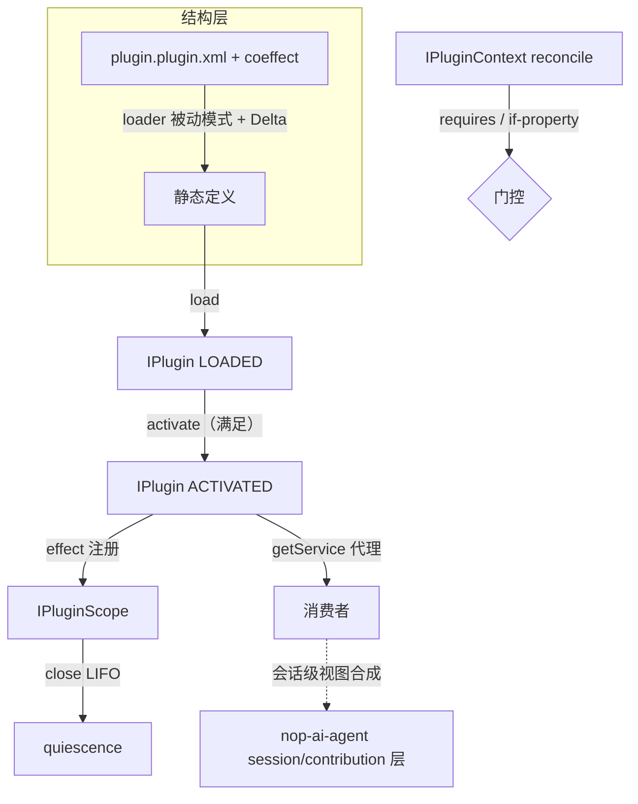

# coeffect 用法与 agent 场景组装示例

**日期**：2026-08-14（经独立审查第一轮修订）；**2026-08-22 定位反转修订**（单激活流）
**范围**：说明 coeffect 的具体用法，以及在 agent 领域如何创建、组装 plugin
**状态**：active（基于 `01-architecture-baseline` 反转后设计，尚未重构实现）
**关联**：`01-architecture-baseline.md`（§五 coeffect、§七 接口契约）

---

## 一、coeffect 到底怎么用

### 1.1 coeffect spec 是什么

coeffect spec 是 plugin 声明的**激活条件**——描述"这个 plugin 在什么条件下才该激活"。它是**运行时动态评估**的（区别于 `<ioc:condition>` 的 build 时一次性）：条件变化时，plugin 可被自动激活或去激活。

两类条件（对应 `01` §五，仅插件级）：

| 条件类型 | 语义 | 示例 |
|---|---|---|
| **依赖** | 依赖的其他 plugin 已 ACTIVATED | `tool-core` 需要 `model-provider` 已激活 |
| **配置** | 某全局配置项为 true | `sandbox-tool` 需要 `agent.sandbox.enabled=true` |

> **R 注解（2026-08-22）**：原设计的实例级条件（基于实例配置域差异化激活）随多实例一并删除。部署内"开/关"粒度是插件级；请求级差异是数据（IContext / 领域层），不是激活条件。

### 1.2 载体：plugin 有自己的 XDef

plugin 定义是独立的 DSL（`/nop/schema/plugin/plugin.xdef`），coeffect/activator 是其**原生属性**，走标准 XDSL 的 Delta/校验管线；不改 beans.xdef：

```xml
<!-- /plugins/agent-tools/plugin.plugin.xml -->
<plugin name="agent-tools"
        requires="model-provider"
        if-property="agent.tools.enabled|true"
        activator="agentToolsActivator">
  <beans>
    <bean id="tool.bash" class="io.nop.agent.tool.BashTool" ioc:sort-order="100" primary="true"/>
    <bean id="tool.search" class="io.nop.agent.tool.SearchTool" ioc:sort-order="200"/>
  </beans>
</plugin>
```

属性集冻结：仅 `requires`/`if-property`/`activator`（服务级依赖扩展点已关闭，01 §五 R 终裁）。

### 1.3 评估时机与 reconcile

coeffect 由 `IPluginContext.reconcile()` 在 context 变更时统一评估。触发事件：plugin load/unload/activate/deactivate、配置变更、外部显式调用。

reconcile 伪代码（描述语义）：

```
reconcile():
  iter = 0
  repeat until 无变化 or iter > MAX_ITER:      // 环检测：DFS 环成员门控关闭并报告 unresolved
    iter++
    for each LOADED 且 未激活 的 plugin:
      if 定义级 spec 满足: → activating → activate
    for each ACTIVATED 的 plugin:
      if 定义级 spec 不满足: → deactivating → deactivate
```

**与 build 时 `<ioc:condition>` 的区别**：`<ioc:condition>` 加载时一次性决定 bean 是否存在，不可逆；coeffect 是运行时的，条件变化可反复激活/去激活，定义（LOADED）始终在，只是激活态随条件生灭。

### 1.4 具体例子：依赖链自动激活

```
model-provider   coeffect: 无（基础，无条件激活）
tool-core        coeffect: model-provider 已 ACTIVATED
sandbox-tool     coeffect: tool-core 已 ACTIVATED AND config agent.sandbox.enabled = true
```

```
loadPlugin(model-provider) → reconcile → 无条件 → 自动 activate
loadPlugin(tool-core)      → reconcile → model-provider 已 ACTIVATED → 自动 activate
loadPlugin(sandbox-tool)   → reconcile → tool-core 已激活, sandbox.enabled=false → 保持 LOADED
config.agent.sandbox.enabled = true
  → 实现层配置订阅自动触发 reconcile（API 层只暴露显式 reconcile()）
  → sandbox-tool 条件满足 → 自动 activate
```

> **R 注解（2026-08-22）**：反转前该示例需区分"定义级允许派生实例"与"实例是否激活"两层评估；单层模型下只有一条评估路径——LOADED ⇄ ACTIVATED 直接由 spec 驱动。

---

## 二、agent 场景：完整组装示例（单激活）

### 2.1 场景

一个 AI agent 平台。plugin 以**粗粒度能力单元**的形式引入工具集、记忆服务等——每类能力一个 plugin、一次激活、进程内单例服务。**不同 agent 会话共享同一批激活服务**；会话级差异（哪个 agent 看到哪些工具、per-session 记忆）由 nop-ai-agent 的 session/contribution 机制处理，不经 plugin 实例化表达。

| plugin | 提供的服务接口 | coeffect |
|---|---|---|
| `model-provider` | `IModelAdapter` | 无 |
| `agent-tools` | `IToolExecutor`（多实现） | `model-provider` 已激活 |
| `session-memory` | `ISessionMemory` | 无 |
| `file-tool` | `IFileOperator` | `agent-tools` 已激活 |

### 2.2 Step 1：定义 plugin（plugin.plugin.xml + coeffect）

见 §1.2 示例。`agent-tools` 声明 `requires="model-provider"`（plugin.xdef 原生属性）。

### 2.3 Step 2：Delta 定制（为研究型部署定制工具集）

利用结构层节点级 Delta 定制 plugin 定义本身——这是细粒度定制的正确入口（编译期结构空间），无需改原文件：

```xml
<!-- /agents/researcher/agent-tools.plugin.xml —— 对 plugin 定义的 Delta -->
<plugin x:extends="/plugins/agent-tools/plugin.plugin.xml">
  <beans>
    <!-- 增加联网搜索工具 -->
    <bean id="tool.web-search" class="io.nop.agent.tool.WebSearchTool" ioc:sort-order="150"/>
    <!-- 精确移除 bash（研究型部署不允许执行命令）——dsh patch 做不到 -->
    <bean id="tool.bash" x:override="remove"/>
  </beans>
</plugin>
```

> **R 注解（2026-08-22）**：反转前文档此处之后还有"Step 4 为每个 agent 会话派生实例"。删除。研究型/标准型的差异属于**部署形态差异**——用 Delta 定制定义即可，不需要运行期多容器。若需求升级为"同一个部署里不同 agent 会话用不同工具集"，那是 agent 层视图合成的职责（见 §2.8）。

### 2.4 Step 3：加载 + 门控激活

> 示例中 `id("platform", "...")` 为占位助手（VFS 轨实际 id 是资源路径、uber jar 轨是 Maven 三段坐标，见 01 §二双轨表）；`configOf(...)` 同为占位。

```java
IPluginManager pm = ...;
IPluginContext ctx = ...;

pm.loadPlugin(id("platform", "model-provider"), configOf("llm.provider", "openai"));
pm.loadPlugin(id("platform", "agent-tools"));
pm.loadPlugin(id("platform", "session-memory"));
pm.loadPlugin(id("platform", "file-tool"));
pm.loadPlugin(id("platform", "sandbox-tool"));   // 已加载；门控不满足则保持 LOADED

ctx.reconcile();   // 依赖链满足（model-provider → agent-tools → file-tool）→ 自动 activate
// sandbox-tool 因 sandbox.enabled=false 保持 LOADED（reconcile 不自动 load 未加载定义，故须显式 load）
```

### 2.5 Step 4：getService 获取强类型服务

```java
IPlugin tools = ctx.getPlugin(id("platform", "agent-tools"));

// 单值获取：primary 优先（tool.bash 已标 primary="true"）；无 primary 时取唯一实现；多候选无 primary 抛明确异常
IToolExecutor primary = tools.getService(IToolExecutor.class);

// 集合获取：全部实现（多工具集的标准方式）
Collection<IToolExecutor> all = tools.getServices(IToolExecutor.class);
Map<String,IToolExecutor> byName = all.stream()
        .collect(toMap(IToolExecutor::getName, t -> t));
```

代理语义：`primary`/`all` 都是**激活态绑定代理**——plugin deactivate 后再调用抛 `INACTIVE`（快速失败），重新激活后同一引用恢复可用。

### 2.6 Step 5：effect 注册可逆副作用（参数传递）

`file-tool` 持有文件句柄。plugin 定义声明激活器，激活时 `scope` + `config` 作为参数传入：

```java
// plugin 定义声明的激活器（plugin.plugin.xml 中 activator="fileToolActivator"）
public class FileToolActivator implements IPluginActivator {
    @Override
    public Disposable activate(IPluginScope scope, Map<String,Object> config) {  // 双参数，对齐 apply(ctx, config)
        FileTool fileTool = scope.getService(FileTool.class);
        fileTool.open();
        return fileTool::close;                             // 返回值 = disposer，自动注册为 effect
    }
}
```

plugin deactivate 时**先 `scope.close()`（LIFO 回退全部 effect）再子容器 stop**——文件自动关闭。

### 2.7 Step 6：下线 → deactivate → effect 回退

```java
pm.deactivatePlugin(id("platform", "agent-tools"));   // 或 reconcile 因依赖丧失自动去激活
// 内部：scope.close() → LIFO 回退全部 effect（关文件等）→ effects() 清空 = quiescence
// 实现细节：子容器 stop 触发 bean destroy（不承诺观测）

// 其他 plugin 不受影响；定义仍 LOADED，条件恢复后 reconcile 自动重新激活
```

### 2.8 会话级差异去哪了（agent 层职责示意）

```java
// 反转前的写法（已废止）：为每个会话 createInstance 派生独立容器 —— 不再存在。
// 反转后的分工：
//
// plugin 层（粗基座）：agent-tools 激活后贡献 IToolExecutor 单例 bean 集合
// agent 层（细视图）：nop-ai-agent 按 sessionId 合成每个会话可见的工具子集
Collection<IToolExecutor> all = tools.getServices(IToolExecutor.class);
agentSession.useTools(
    contributionRegistry.viewFor(sessionId, all));   // 近遮蔽远 / 限制交集 / per-session 注册
// per-session 状态（工作记忆等）由 IMemoryStoreProvider.getOrCreate(sessionId) 键控，
// 服务本体保持单例无状态。
```

### 2.9 组装关系图



## 三、核心能力在示例中的落点

| 核心能力 | 示例中的落点 |
|---|---|
| 加载/激活两态 | Step 3：loadPlugin（LOADED）+ reconcile 自动 activate |
| coeffect 条件激活 | §1.4 依赖链；配置开关变化自动激活/去激活 |
| getService 强类型代理 | Step 4：getService/getServices，deactivate 后快速失败 |
| effect 可逆副作用 | Step 5：scope.effect(close file)；Step 6：LIFO 回退 |
| 结构层 Delta 定制 | Step 2：researcher delta.xml 增/删工具（细粒度定制的正确入口） |
| HMR | reloadPlugin：定义变更 → deactivate → unload → load → reconcile |
| 不暴露内部容器 | 全程消费者只用 getService，不接触子容器 |
| 下线清理 | Step 6：deactivate → effect 回退 → quiescence |
| 会话级差异 | §2.8：agent 层视图合成，plugin 提供单例基座 |

## 四、与 dsh 用法的映射

| 示例步骤 | dsh 对应 | 差异说明 |
|---|---|---|
| plugin 定义 = plugin.plugin.xml + coeffect | plugin contributes services + `inject` | Nop 依赖坐标是 plugin id（非服务名） |
| coeffect 依赖链激活 | `inject` 驱动 PENDING→ACTIVE | Nop 两态显式分离 |
| 激活单例服务 | fiber 内注册服务 | **Nop 无 fiber**——服务端定位下单次激活即进程级单例 |
| getService 强类型代理 | `ctx.<key>` traceable proxy | 失效语义基本等价（见 §5.3 统一注解） |
| scope.effect | `ctx.effect()` disposer | 机制等价 |
| Delta 定制工具集 | patch（行级） | Nop 节点级 + remove，更细 |
| （无对应步骤）per-agent scope/shadowing | createScope + ScopedLayers | Nop 划归 agent 层（§2.8） |

---

## 五、dsh 对照：同一场景在 dsh 中的实现

展示 §二 的 agent 场景在 dsh/Cordis 里如何用其**自身 plugin 机制**实现。使用 dsh 真实 API（`ctx.plugin` 挂载、`ctx.<key>` 服务访问、fiber/scope 生命周期）。

### 5.1 定义 plugin（Cordis Service）

```typescript
// agent-tools plugin（对象形态：inject 声明依赖 + apply(ctx, config) 双参数）
export const AgentTools = {
    inject: ['llm'],                     // 声明依赖：等 ctx.llm 就绪才激活（否则 PENDING）
    apply(ctx: Context, config: { tools: string[] }) {
        const disposers = config.tools.map(name => ctx.tools.register(name, toolRegistry[name]))
        return () => disposers.forEach(d => d())   // 返回值 = disposer：卸载时逆序注销全部工具
    }
}
```

### 5.2 层叠配置（cordis.yml + patch）

```yaml
# profile/cordis.yml
plugins:
    - model-provider
    - agent-tools
    - session-memory
```

定制（patch，**配置行级**，替换整行、无 deep-merge）：

```yaml
# cordis.patch.yml —— 为研究型 preset 定制
- id: agent-tools
  config: { tools: [search, web-search] }   # 必须重述整行；无法精确"移除 bash"
```

**对照 Nop**：dsh patch 无法精确移除单个工具（只能整行替换）；Nop `<bean id="tool.bash" x:override="remove"/>` 节点级精确移除——结构层 Delta 的核心优势。

### 5.3 挂载 + 服务获取（fiber + traceable proxy）

```typescript
// 挂载 plugin 得到 fiber（真实 API：ctx.plugin）
const fiber = ctx.plugin(AgentTools, { agentId: 'agent-1' })

// 服务获取：ctx.<key>（traceable proxy；失效行为见下方统一注解）
const tools = fiber.ctx.tools

// 卸载：dispose fiber → 自动 unwind 全部 effect
fiber.dispose()
```

> **dsh 失效语义统一注解（2026-08-22 审计裁定）**：既有文档对 dsh 非活跃访问行为存在两种表述——"属性弱读经 `ctx.get` 返回 undefined"与"traceable proxy 方法调用抛 INACTIVE 错"。两者描述的是不同访问路径，均可能成立；**R4 阶段对照 cordis 源码终核后回填本文与 04 的对应行**。Nop 侧语义单一且严格：任何路径调用已 deactivate plugin 的代理一律抛 INACTIVE。

**对照 Nop**：

| | dsh | Nop |
|---|---|---|
| 挂载 | `ctx.plugin(plugin, opts)` → fiber | `loadPlugin` + reconcile/activate → LOADED⇄ACTIVATED |
| 多实例 | 每次 `ctx.plugin()` 一个新 fiber | **有意不做**（non-goal；一个定义至多一个激活） |
| 服务获取 | `fiber.ctx.<key>`（弱类型 key） | `plugin.getService(Class)`（强类型代理） |
| 失效行为 | 属性弱读 undefined / 方法调用抛 INACTIVE（路径待终核，见统一注解） | 调用已 deactivate plugin 的代理一律抛 INACTIVE |
| 销毁 | `fiber.dispose()` | `deactivatePlugin` / `unloadPlugin` |
| 内部容器 | ctx 是公开服务仓库 | 子容器隐藏，只 getService |
| per-agent 差异 | scope 层（注册路由 + 近遮蔽远）+ realm（逐名字槽位） | agent 层 session/contribution 机制（§2.8），plugin 层不建模 |

**注**：dsh 的 ctx 是 traceable proxy（非活跃访问抛错），与 Nop 激活态代理失效语义等价。

### 5.4 可逆副作用 + 依赖条件激活

```typescript
// reversible effect
ctx.effect(() => {
    const fh = openFile(path)
    return () => fh.close()     // disposer
})

// 依赖条件激活：inject 驱动——ctx.llm 未就绪则 plugin 保持 PENDING，就绪才 apply；llm 变更则重跑
```

**对照 Nop**：`ctx.effect` = `scope.effect`（机制等价）。`inject`（服务坐标，加载时驱动）≈ requires（插件坐标，独立 activate 阶段驱动）——语义骨架覆盖，坐标与时机不同（R 终裁：有意为之）。

### 5.5 关键差异总结

| 维度 | dsh | Nop | 优劣 |
|---|---|---|---|
| 结构层定制粒度 | 配置行级 patch（无 remove/deep-merge） | 节点级 Delta（x:override merge/remove） | **Nop** |
| 服务获取类型安全 | ctx.\<key\> 弱类型 | getService(Class) 强类型 | **Nop** |
| 失效语义 | 弱读 undefined / 调用抛 INACTIVE | 激活态代理一律抛 INACTIVE | **持平偏 Nop**（严格性不低于 dsh 任一路径；待 R4 终核） |
| 内部容器暴露 | ctx 公开服务仓库 | 子容器隐藏 | **Nop** |
| 细粒度定制上限 | 插件内部是代码，无字段级坐标 | 插件定义是结构，Delta 到字段级 | **Nop** |
| 多实例/fiber | fiber（客户端 harness 必需） | 无（服务端定位 non-goal） | 各按定位取舍 |
| 运行时动态注册 | provide/accessor/set | 裁决不做（静态装配 + 外部注册表） | dsh |
| 生命周期入口 | restart/update + waterfall 否决 | deactivate/activate 组合 + HMR 编排 | dsh |

**总结**：核心机制（可逆副作用、失效语义、依赖条件激活、参数传递激活）两者**能力对等**；多实例/fiber 是 dsh 客户端场景的必需品而非普适必需品——Nop 按自身定位有意省略，将等价能力放在更合适的层（编译期 Delta + 领域层会话模型）。Nop 在结构层定制粒度、类型安全、封装性上占优。
