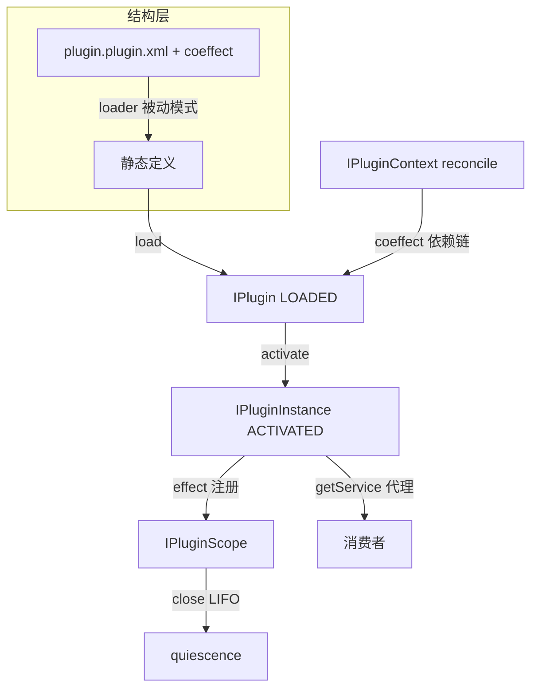

# coeffect 用法与 agent 场景组装示例

**日期**：2026-08-14（经独立审查第一轮修订）
**范围**：说明 coeffect 的具体用法，以及在 agent 领域如何创建、组装 plugin
**状态**：active（基于 `01-architecture-baseline` 的目标设计，尚未实现）
**关联**：`01-architecture-baseline.md`（§五 coeffect、§七 接口契约）

---

## 一、coeffect 到底怎么用

### 1.1 coeffect spec 是什么

coeffect spec 是 plugin 声明的**定义级激活条件**——一个布尔表达式，描述"这个 plugin 在什么条件下才该激活"。它是**运行时动态评估**的（区别于 `<ioc:condition>` 的 build 时一次性）：条件变化时，plugin 可被自动激活或去激活。

两类条件（对应 `01` §五）：

| 条件类型 | 语义 | 示例 |
|---|---|---|
| **依赖** | 依赖的其他 plugin 已 ACTIVATED | ToolRegistry 需要 ModelProvider 已激活 |
| **配置** | 某配置项为 true | SandboxTool 需要 `agent.sandbox.enabled=true` |

### 1.2 载体：plugin 有自己的 XDef

plugin 定义是独立的 DSL（`/nop/schema/plugin/plugin.xdef`），coeffect/activator 是其**原生属性**，走标准 XDSL 的 Delta/校验管线；**不改 beans.xdef**：

```xml
<!-- /plugins/agent-tools/plugin.plugin.xml -->
<plugin name="agent-tools"
        requires="model-provider"
        if-property="agent.tools.enabled|true"
        activator="agentToolsActivator">
  <beans>
    <bean id="tool.bash" class="io.nop.agent.tool.BashTool" ioc:sort-order="100" primary="true"/>
    <bean id="tool.search" class="io.nop.agent.tool.SearchTool" ioc:sort-order="200"/>
  </beans>
</plugin>
```

### 1.3 评估时机与 reconcile

coeffect 由 `IPluginContext.reconcile()` 在 context 变更时统一评估。触发事件：plugin load / activate / deactivate、配置变更、外部显式调用。

reconcile 伪代码（描述语义）：

```
reconcile():
  iter = 0
  repeat until 无变化 or iter > MAX_ITER:    // 环检测：最大迭代后 unresolved 不激活
    iter++
    for each LOADED 的 plugin:               // 定义级：能否派生实例
      if 定义级 spec 满足: 允许 createInstance
      else: 保持 LOADED（不可派生）
    for each 实例:                           // 实例级：该实例是否激活（基于实例配置域）
      if 实例级 spec 满足 且 未激活: → activating → activate
      if 不满足 且 已激活:           → deactivating → deactivate
```

### 1.4 具体例子：依赖链自动激活

```
ModelProvider    coeffect: 无（基础，无条件激活）
ToolRegistry     coeffect: ModelProvider 已 ACTIVATED
SandboxTool      coeffect: ToolRegistry 已 ACTIVATED AND config agent.sandbox.enabled = true
```

```
loadPlugin(ModelProvider) → reconcile → 无条件 → 自动 activate
loadPlugin(ToolRegistry)  → reconcile → ModelProvider 已 ACTIVATED → 自动 activate
loadPlugin(SandboxTool)   → reconcile → ToolRegistry 已激活, sandbox.enabled=false → 保持 LOADED
config.agent.sandbox.enabled = true
  → 实现层配置订阅自动触发 reconcile（API 层只暴露显式 reconcile()）
  → SandboxTool 条件满足 → 自动 activate
```

**与 build 时 `<ioc:condition>` 的区别**：`<ioc:condition>` 加载时一次性决定 bean 是否存在，不可逆；coeffect 是运行时的，条件变化可反复激活/去激活，定义（LOADED）始终在，只是实例随条件生灭。

---

## 二、agent 场景：完整组装示例（多实例）

### 2.1 场景

一个 AI agent 平台，多个 agent 会话并发运行。每个 agent 会话使用 plugin 提供的模型、工具、记忆服务——**同一 plugin 定义为每个 agent 派生独立实例**（独立 scope/effect/配置域），会话结束清理自己的实例，互不干扰。subagent 经 parent 层级实例化。

| plugin | 提供的服务接口 | coeffect |
|---|---|---|
| `model-provider` | `IModelAdapter` | 无 |
| `agent-tools` | `IToolExecutor`（多实现） | `model-provider` 已激活 |
| `session-memory` | `ISessionMemory` | 无 |
| `file-tool` | `IFileOperator` | `agent-tools` 已激活 |

### 2.2 Step 1：定义 plugin（plugin.plugin.xml + coeffect）

见 §1.2 示例。`agent-tools` 声明 `requires="model-provider"`（plugin.xdef 原生属性）。

### 2.3 Step 2：Delta 定制（为研究型 agent 定制工具集）

利用结构层节点级 Delta，定制工具集，无需改原文件：

```xml
<!-- /agents/researcher/agent-tools.plugin.xml —— 对 plugin 定义的 Delta -->
<plugin x:extends="/plugins/agent-tools/plugin.plugin.xml">
  <beans>
    <!-- 增加联网搜索工具 -->
    <bean id="tool.web-search" class="io.nop.agent.tool.WebSearchTool" ioc:sort-order="150"/>
    <!-- 精确移除 bash（研究型 agent 不允许执行命令）——dsh patch 做不到 -->
    <bean id="tool.bash" x:override="remove"/>
  </beans>
</plugin>
```

### 2.4 Step 3：加载 + coeffect 条件激活

```java
IPluginManager pm = ...;
IPluginContext ctx = ...;

pm.loadPlugin(id("platform", "model-provider"));
pm.loadPlugin(id("platform", "agent-tools"));
pm.loadPlugin(id("platform", "session-memory"));
pm.loadPlugin(id("platform", "file-tool"));

ctx.reconcile();   // 定义级 coeffect 评估：依赖链满足（model-provider → agent-tools → file-tool），允许派生实例
```

### 2.5 Step 4：为 agent 会话派生实例（多实例）

```java
// agent-1 会话：派生独立实例（独立 scope/effect/配置域；parent 传 null）
IPluginInstance agent1Tools = pm.createInstance(
    id("platform", "agent-tools"), "agent-1", configOfAgent1, null);

// agent-2 会话：同一定义，独立实例，完全隔离
IPluginInstance agent2Tools = pm.createInstance(
    id("platform", "agent-tools"), "agent-2", configOfAgent2, null);

// subagent（层级实例化，parent = agent1Tools：服务查找沿链回退、级联销毁、配置层叠）
IPluginInstance subTools = pm.createInstance(
    id("platform", "agent-tools"), "agent-1/sub-research", configOfSub, agent1Tools);
```

### 2.6 Step 5：getService 获取强类型服务

```java
IPluginInstance tools = ctx.getInstance(id("platform", "agent-tools"), "agent-1");

// 单值获取：primary 优先（tool.bash 已标 primary="true"）；无 primary 时取唯一实现；多候选无 primary 抛明确异常
IToolExecutor primary = tools.getService(IToolExecutor.class);

// 集合获取：全部实现（多工具集的标准方式）
Collection<IToolExecutor> all = tools.getServices(IToolExecutor.class);
Map<String,IToolExecutor> byName = all.stream()
        .collect(toMap(IToolExecutor::getName, t -> t));
```

代理语义：`primary`/`all` 都是**生命周期绑定代理**——实例 deactivate 后再调用抛 `INACTIVE`（快速失败），不悬空。对应 Cordis traceable proxy（访问非活跃 fiber 的服务抛 INACTIVE 错）。

### 2.7 Step 6：effect 注册可逆副作用（参数传递）

`file-tool` 持有文件句柄。plugin 定义声明激活器，激活时 `scope` + `config` **作为参数传入**（与 Cordis `apply(ctx, config)`、NopBatch `setup(context)` 同构，不用字段注入）：

```java
// plugin 定义声明的激活器（plugin.plugin.xml 中 activator="agentToolsActivator"）
public class AgentToolsActivator implements IPluginActivator {
    @Override
    public Disposable activate(IPluginScope scope, Map<String,Object> config) {  // 双参数，对齐 apply(ctx, config)
        FileTool fileTool = scope.getService(FileTool.class);  // 从实例取 bean
        fileTool.open();
        return fileTool::close;                             // 返回值 = disposer，自动注册为 effect（销毁时关文件）
    }
}
```

实例 deactivate 时**先 `scope.close()`（LIFO 回退全部 effect）再子容器 stop**——文件自动关闭。

### 2.8 Step 7：会话结束 → destroyInstance → effect 回退

```java
pm.destroyInstance(id("platform", "agent-tools"), "agent-1");
// 内部：实例 → IPluginScope.close() → LIFO 回退全部 effect（关文件等）→ effects() 清空 = quiescence
// 实现细节：子容器 stop 触发 bean destroy（不承诺观测）

// agent-2 / sub 实例不受影响（实例隔离）；定义仍 LOADED，可继续为 agent-3 派生新实例
```

### 2.9 组装关系图



## 三、核心能力在示例中的落点

| 核心能力 | 示例中的落点 |
|---|---|
| 加载/激活两态 | Step 3-4：loadPlugin（LOADED）+ createInstance（ACTIVATED） |
| coeffect 定义级条件激活 | Step 3：依赖链自动激活；§1.4 配置条件变化 |
| getService 强类型代理 | Step 5：getService/getServices，deactivate 后快速失败 |
| effect 可逆副作用 | Step 6：scope.effect(close file)；Step 7：LIFO 回退 |
| 结构层 Delta 定制 | Step 2：researcher delta.xml 增/删工具 |
| HMR | （同 reloadPlugin：定义变更 → 重建实例） |
| 不暴露内部容器 | 全程消费者只用 getService/getScope，不接触子容器 |
| 会话结束清理 | Step 7：deactivate → effect 回退 → quiescence |

## 四、与 dsh 用法的映射

| 示例步骤 | dsh 对应 |
|---|---|
| plugin 定义 = plugin.plugin.xml + coeffect | dsh plugin contributes services；`inject` 依赖声明 |
| coeffect 依赖链 | dsh `inject`（服务未就绪则 PENDING，服务变更重跑） |
| 实例隔离 | dsh fiber/scope |
| getService 强类型代理 | dsh `ctx.<key>`（Cordis traceable proxy，非活跃抛 INACTIVE） |
| scope.effect | dsh `ctx.effect()` disposer |
| Delta 定制工具集 | dsh patch（但 Nop 节点级 + remove，更细） |

---

## 五、dsh 对照：同一场景在 dsh 中的实现

展示 §二 的 agent 场景在 dsh/Cordis 里如何用其**自身 plugin 机制**实现。使用 dsh 真实 API（`ctx.plugin` 挂载、`ctx.<key>` 服务访问、fiber/scope 生命周期）。

### 5.1 定义 plugin（Cordis Service）

```typescript
// agent-tools plugin（对象形态：inject 声明依赖 + apply(ctx, config) 双参数）
export const AgentTools = {
    inject: ['llm'],                     // 声明依赖：等 ctx.llm（model provider）就绪才激活（否则 PENDING）
    apply(ctx: Context, config: { tools: string[] }) {   // config 驱动注册（与 cordis.patch.yml 联动）
        const disposers = config.tools.map(name => ctx.tools.register(name, toolRegistry[name]))
        return () => disposers.forEach(d => d())   // 返回值 = disposer：卸载时逆序注销全部工具
    }
}
```

### 5.2 层叠配置（cordis.yml + patch）

```yaml
# profile/cordis.yml
plugins:
    - model-provider
    - agent-tools
    - session-memory
```

定制（patch，**配置行级**，替换整行、无 deep-merge）：

```yaml
# cordis.patch.yml —— 为研究型 agent 定制
- id: agent-tools
  config: { tools: [search, web-search] }   # 必须重述整行；无法精确"移除 bash"
```

**对照 Nop**：dsh patch 无法精确移除单个工具（只能整行替换）；Nop `<bean id="tool.bash" x:override="remove"/>` 节点级精确移除——Nop 结构层 Delta 的核心优势。

### 5.3 挂载 + 服务获取（fiber + traceable proxy）

```typescript
// 挂载 plugin 得到 fiber（真实 API：ctx.plugin）
const fiber = ctx.plugin(AgentTools, { agentId: 'agent-1' })

// 服务获取：ctx.<key>，traceable proxy——访问非活跃 fiber 的服务抛 INACTIVE 错
const tools = fiber.ctx.tools

// 会话结束：dispose fiber → 自动 unwind 全部 effect
fiber.dispose()
```

**对照 Nop**：

| | dsh | Nop |
|---|---|---|
| 挂载 | `ctx.plugin(plugin, opts)` → fiber | `loadPlugin` + `createInstance` → IPluginInstance |
| 服务获取 | `fiber.ctx.<key>`（弱类型字符串 key，traceable proxy） | `instance.getService(Class)`（**强类型**代理） |
| 失效行为 | 访问非活跃 fiber 抛 INACTIVE | 调用已 deactivate 实例的代理抛 INACTIVE（**能力等价**） |
| 销毁 | `fiber.dispose()` | `destroyInstance` |
| 内部容器 | ctx 是公开服务仓库 | 子容器隐藏，只 getService |

**注**：dsh 的 ctx 是 traceable proxy（非活跃访问抛错），与 Nop 生命周期代理**失效语义等价**——不存在"dsh 裸引用悬空"的差异（审查修正）。

### 5.4 可逆副作用 + 依赖条件激活

```typescript
// reversible effect
ctx.effect(() => {
    const fh = openFile(path)
    return () => fh.close()     // disposer
})

// 依赖条件激活：inject 驱动——ctx.llm 未就绪则 plugin 保持 PENDING，就绪才 apply；llm 变更则重跑
```

**对照 Nop**：`ctx.effect` = `scope.effect`（机制等价）。`inject`（加载时依赖驱动）≈ coeffect（激活时条件驱动）——语义覆盖等价，时机不同（加载时 vs 激活时）。

### 5.5 关键差异总结

| 维度 | dsh | Nop | 优劣 |
|---|---|---|---|
| 结构层定制粒度 | 配置行级 patch（无 remove/deep-merge） | 节点级 Delta（x:override merge/remove） | **Nop** |
| 服务获取类型安全 | ctx.\<key\> 弱类型 | getService(Class) 强类型 | **Nop** |
| 失效语义 | traceable proxy 抛 INACTIVE | 生命周期代理抛 INACTIVE | **持平** |
| 内部容器暴露 | ctx 公开服务仓库 | 子容器隐藏 | **Nop** |
| 激活时机 | inject 驱动（加载时，PENDING→ACTIVE） | coeffect 驱动（独立 activate 阶段） | 持平（语义等价） |
| 可逆副作用 | ctx.effect disposer | scope.effect disposer | 持平 |
| 多实例/fiber | fiber | IPluginInstance（createInstance/instanceKey/parent） | 持平 |

**总结**：核心机制（可逆副作用、失效语义、依赖条件激活、多实例/fiber）两者**能力对等**；Nop 在结构层定制粒度（节点级 Delta）、服务获取类型安全（强类型）、封装性（隐藏子容器）上更优。
