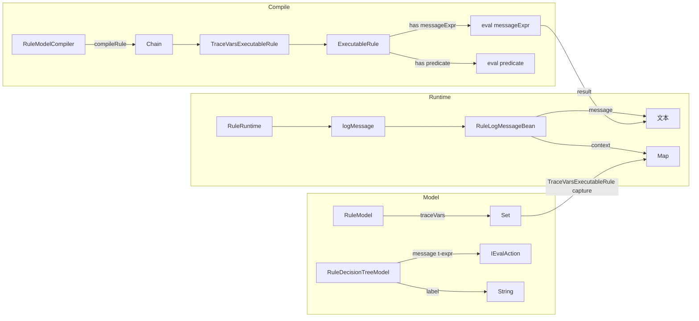

# nop-rule 执行追踪设计

**日期**：2026-07-17
**范围**：nop-rule-core、nop-rule-api、nop-kernel/nop-xdefs (rule.xdef)
**状态**：active

---

## 一、设计结论

1. **每个 decision tree 节点增加 `message` 属性，类型 `t-expr`**：规则作者用模板表达式自定义执行时输出的追踪信息，支持 `"age=${age}, expected>=18"` 这种内嵌变量值的格式。如果没有 `message`，回落为现有 `label` 的行为。
2. **Rule 级别增加 `traceVars` 属性**：声明需要从 eval scope 捕获的变量路径列表。执行时自动从 scope 取值，附带在每条日志的 `context` 结构中。
3. **`RuleLogMessageBean` 增加 `context` 字段**：承载结构化追踪数据（键值对），与 `message` 文本互补。`message` 负责"人类可读的描述"，`context` 负责"机器可查的结构化数据"。
4. **不改造 `CompareOpExecutable`、`AndEvalPredicate` 等通用 predicate 类**：单节点内的复杂 predicate 不自动分解为子条件日志，避免 nop-rule 对 nop-core/nop-xlang 的侵入。
5. **`label` 保留为纯字符串**：用于 UI 展示和节点标识，不被 `message` 替代。两者职责分离——`label` 是静态的，`message` 是动态的。

---

## 二、背景与动机

### 当前问题

`ExecutableRule` 和 `RuleDecider` 只在节点级调用 `logMessage("MATCH"/"MISMATCH", id, label)`，日志内容只有 "MATCH"/"MISMATCH" 两个字面常量（定义在 `RuleConstants.MESSAGE_MATCH` / `MESSAGE_MISMATCH`）。

这导致：

- **无法知道判断过程中用了什么值**：比如 `eq(age, 18)` 失败了，日志只有 MISMATCH，看不出 age 的实际值。
- **复杂 BO 对象无法序列化**：inputs 可能是 Order、User 等复杂业务对象，不可能直接 toString 进日志。
- **没有结构化追踪数据**：即使知道 age 是 15，也做不到用日志做自动分析——缺乏机器可读的键值对上下文。
- **单一粒度**：整个 rule 或整棵 decision tree 的输入/输出可以记录，但每个判断节点处的局部上下文是盲区。

### 设计目标

1. 每个 decision tree 节点执行时能输出带上下文信息的人类可读追踪消息
2. 支持机器可读的结构化追踪数据（key-value pairs）
3. 对现有 rule 模型和后向兼容——老规则不加 message 时行为不变
4. 零侵入通用 predicate 体系

---

## 三、核心设计

### 3.1 message t-expr

#### XDef 定义

在 `rule.xdef` 的 `RuleDecisionTreeModel` 上增加 `message` 属性：

```xml
<xdef:define xdef:name="RuleDecisionTreeModel" id="string" label="string"
             message="t-expr" multiMatch="!boolean=false" leafIndex="!int=0">
```

- `message` 类型为 `t-expr`，由 `XplStdDomainHandlers.TplExprType` 处理为 `IEvalAction`
- 空值时行为不变，回落 `label`
- 自动生成代码层：`_RuleDecisionTreeModel` 获得 `IEvalAction _message` 字段

#### Java 模型层

`RuleDecisionTreeModel` 从 `_gen` 继承 `getMessage()` → `IEvalAction`，不再需要额外辅助方法。求值时的异常安全包装在 `ExecutableRule.buildTraceMessage()` 中处理。

#### 编译层

`RuleModelCompiler.compileTree()` / `compileDecider()` 不需要对 message 做特殊处理——XDef 的 `t-expr` 域已经在 deserialize 阶段把字符串编译为 `IEvalAction` 了。只需将它从 `RuleDecisionTreeModel` 传递到 `ExecutableRule` / `RuleDecider`。

```java
// RuleModelCompiler.compileTree()
public IExecutableRule compileTree(RuleDecisionTreeModel node) {
    IEvalPredicate predicate = compilePredicate(node);
    IEvalAction action = compileOutputAction(node.getOutputs());
    List<IExecutableRule> children = compileChildren(node);

    return new ExecutableRule(
        node.getLocation(),
        node.getId(),
        node.getLabel(),
        node.getMessage(),  // ← 新增，IEvalAction
        predicate,
        action,
        children,
        node.isMultiMatch()
    );
}

`RuleModelCompiler.compileDecider()` 同理——每个 matrix 子 condition 对应一个 `RuleDecider`，各自接收自己的 `messageExpr`:

```java
// RuleModelCompiler.compileDecider()
public RuleDecider compileDecider(RuleDeciderModel decider, List<RuleConditionModel> conditions) {
    RuleDecider ruleDecider = new RuleDecider(decider.getDisplayName());
    for (RuleConditionModel condition : conditions) {
        IEvalPredicate predicate = compileConditionPredicate(condition);
        IEvalAction messageExpr = condition.getMessage();  // ← 新增
        List<IExecutableRule> actions = compileConditionActions(condition);
        ruleDecider.addCondition(predicate, messageExpr, actions);
    }
    return ruleDecider;
}
```

#### 执行层

`ExecutableRule.execute()` 改造。保持 `logMessage()` 的无条件调用（保留文件日志输出 `addToLogFile()`），仅在 `collectLogMessage=true` 且 `messageExpr` 存在时求值模版：

```java
protected String buildMessage(IRuleRuntime ruleRt, boolean passed) {
    if (ruleRt.isCollectLogMessage() && messageExpr != null) {
        try {
            Object result = messageExpr.invoke(ruleRt);
            if (result != null) return result.toString();
        } catch (Exception e) {
            LOG.warn("rule:message-expr-error,id={}", id, e);
        }
    }
    return passed ? RuleConstants.MESSAGE_MATCH : RuleConstants.MESSAGE_MISMATCH;
}

public boolean execute(IRuleRuntime ruleRt) {
    boolean passed = (predicate == null || predicate.passConditions(ruleRt));

    if (id != null || label != null) {
        String msg = buildMessage(ruleRt, passed);
        ruleRt.logMessage(msg, id, label);
    }

    if (passed) {
        // ... 执行 action 和 children
    }
    return passed;
}
```

`RuleDecider` 同理。

### 3.2 traceVars

#### XDef 定义

在 `RuleModel` 上增加 `traceVars`：

```xml
<rule displayName="string" ruleName="string" ruleVersion="long"
      traceVars="csv-set" ...>
```

- `traceVars` 类型为 `csv-set`（逗号分隔的集合），值是变量名或点路径（如 `"age, order.status, applicant.deptId"`）
- 规则作者在规则级别声明一次，所有节点共享
- 也可以留空，表示不自动捕获上下文

#### Java 模型层

`_RuleModel` 获得 `Set<String> _traceVars` 字段。`RuleModel` 不需要额外逻辑。

#### 执行层

新增 `TraceVarsExecutableRule` 装饰器，在规则链中位于 `NormalizeInputExecutableRule` 之后、`NormalizeOutputExecutableRule` 之前，确保 scope 变量已就绪且 `logMessage()` 调用时 `traceContext` 已设置：

```
MainExecutableRule
  → DecoratedExecutableRule (before/after hooks)
    → NormalizeInputExecutableRule (validate inputs, set scope)
      → TraceVarsExecutableRule ← NEW (capture traceVars from scope BEFORE inner rule)
        → NormalizeOutputExecutableRule
          → ExecutableRule / ExecutableMatrixRule
```

`TraceVarsExecutableRule` 职责：

```java
public class TraceVarsExecutableRule implements IExecutableRule {
    private final Set<String> traceVars;
    private final IExecutableRule rule;

    public boolean execute(IRuleRuntime ruleRt) {
        // 先设 context（确保 inner rule 中 logMessage() 能获取到）
        if (ruleRt.isCollectLogMessage() && traceVars != null) {
            IEvalScope scope = ruleRt.getEvalScope();
            Map<String, Object> ctx = new LinkedHashMap<>();
            for (String var : traceVars) {
                Object value = scope.getValueByPropPath(var);
                if (value != null) {
                    ctx.put(var, sanitizeTraceValue(value));
                }
            }
            if (!ctx.isEmpty()) {
                ruleRt.setTraceContext(ctx);
            }
        }
        return rule.execute(ruleRt);
    }

    Object sanitizeTraceValue(Object value) {
        if (value instanceof String || value instanceof Number
            || value instanceof Boolean || value instanceof java.util.Date)
            return value;
        String str = value.toString();
        if (str.length() > 200) str = str.substring(0, 200) + "...";
        return str;
    }
}
```

#### 日志输出

`RuleLogMessageBean` 增加 `context` 字段，类型为 `Map<String, Object>`：

```json
{
  "logTime": "...",
  "message": "age=15, expected>=18",
  "ruleNodeId": "ageCheck",
  "ruleNodeLabel": "年龄验证",
  "context": {
    "age": 15,
    "deptId": "ENG",
    "order.status": "PENDING"
  }
}
```

### 3.3 IRuleRuntime 扩展

```java
public interface IRuleRuntime extends IEvalContext {
    // 现有方法...

    // 新增
    Map<String, Object> getTraceContext();
    void setTraceContext(Map<String, Object> traceContext);
}
```

`RuleRuntime` 实现：

```java
public class RuleRuntime implements IRuleRuntime {
    private Map<String, Object> traceContext;

    public Map<String, Object> getTraceContext() { return traceContext; }
    public void setTraceContext(Map<String, Object> ctx) { this.traceContext = ctx; }

    public void logMessage(String message, String ruleNodeId, String ruleNodeLabel) {
        addToLogFile(message, ruleNodeId, ruleNodeLabel);

        if (collectLogMessage) {
            RuleLogMessageBean logMessage = new RuleLogMessageBean();
            logMessage.setLogTime(CoreMetrics.currentTimestamp());
            logMessage.setMessage(message);
            logMessage.setRuleNodeId(ruleNodeId);
            logMessage.setRuleNodeLabel(ruleNodeLabel);
            logMessage.setContext(traceContext);  // ← 新增
            logMessages.add(logMessage);
        }
    }
}
```

### 3.4 完整数据流



### 3.5 message 与 traceVars 的关系

| | `message` t-expr | `traceVars` |
|---|---|---|
| **层级** | 节点级 | 规则级 |
| **内容** | 自由文本，规则作者自己组织 | 结构化键值对，系统自动采集 |
| **执行时机** | 每次节点执行 | 整个规则执行完成后一次 |
| **是否必须** | 否（回落 "MATCH"/"MISMATCH"） | 否（不配置则不采集） |
| **典型用法** | `"age=${age}, threshold=18"` | `"age, deptId, order.status"` |

两者互补：`message` 提供"人类可读的描述 + 现场值"的紧凑文本，`traceVars` 提供"机器可检索"的结构化字典。

---

## 四、拒绝了什么

### 4.1 在 `CompareOpExecutable` 等 predicate 中加日志

**拒绝理由**：
- `CompareOpExecutable`、`AndEvalPredicate` 等位于 `nop-core`/`nop-xlang`，是通用 filter 求值引擎，不应感知 rule 的日志契约。
- 会导致核心层依赖 nop-rule（反向依赖），破坏模块层次。

### 4.2 自动分解 and/or 复合条件并逐一报告子结果

**拒绝理由**：
- `AndEvalPredicate` 不暴露子 predicate 数组（`private` 无 getter），要分解必须修改 `nop-core`。
- 即使分解了，子条件也只产生 true/false，不携带"用的什么值"——还需要额外反射或 wrapper。
- 收益有限：用户完全可以用 decision tree 的子节点来表达需要独立追踪的每个条件，树结构本身已经是条件分解。
- 代价高：需要修改 `nop-core` 的两个核心 predicate 类 + 增加递归解释器。

### 4.3 将 `label` 改为 `t-expr` 而非新增 `message`

**拒绝理由**：
- `label` 在 XDef 注释中写明是"对当前判断条件的描述信息"，在可视化 rule tree 编辑器中用作静态节点名。
- 将 `label` 改为 `t-expr` 后，它在 UI 中的显示需要 eval scope 才能求值，增加 UI 层的复杂性。
- 职责分离：`label` = 静态节点标识（UI/调试），`message` = 动态追踪信息（日志/审计）。两者可以同时存在且语义不重叠。

### 4.4 用 JSON Schema 自动决定 trace 值采集策略

**拒绝理由**：
- 虽然 `RuleInputDefineModel` 已有 `type` 和 `schema`，但 schema 是可选的，且实际使用中很多规则未定义 type。
- 自动采集策略的判断规则多、边界情况多，不如用户显式声明 `traceVars` 来得确定。
- 在 `traceVars` 基础上，后续可以增强 `sanitizeTraceValue` 的智能程度（根据 type/schema），但不作为初始设计。

---

## 五、与已有设计的关系

### 模块边界

所有变更均在 nop-rule 模块内部完成，不修改：
- `nop-core`：`IEvalPredicate`、`AndEvalPredicate`、`OrEvalPredicate` 不变
- `nop-xlang`：`CompareOpExecutable`、`BetweenOpExecutable`、`AssertOpExecutable` 不变
- 唯一的外部改动：`rule.xdef` XDef 模式定义（在 `nop-kernel/nop-xdefs`）

### 生成文件

以下文件由 codegen 从 `rule.xdef` 生成，需要在 `rule.xdef` 修改后重新生成或同步手动更新：

| 文件 | 变更类型 |
|------|---------|
| `nop-rule-core/.../_gen/_RuleDecisionTreeModel.java` | 新增 `_message` 字段 + getter/setter |
| `nop-rule-core/.../_gen/_RuleModel.java` | 新增 `_traceVars` 字段 + getter/setter |
| `nop-rule-api/.../_gen/_RuleLogMessageBean.java` | 新增 `_context` 字段 + getter/setter |

### 涉及的手工维护文件

| 文件 | 变更 |
|------|------|
| `nop-rule-core/.../model/RuleDecisionTreeModel.java` | 无变更（`getMessage()` 继承自 `_gen`） |
| `nop-rule-core/.../execute/ExecutableRule.java` | 构造参数增加 `messageExpr`，`execute()` 增加 message 求值 |
| `nop-rule-core/.../execute/RuleDecider.java` | 同上 |
| `nop-rule-core/.../execute/RuleRuntime.java` | 实现 `getTraceContext()`/`setTraceContext()`，`logMessage()` 附带 context |
| `nop-rule-core/.../IRuleRuntime.java` | 新增 `getTraceContext()`/`setTraceContext()` |
| `nop-rule-core/.../model/compile/RuleModelCompiler.java` | `compileTree()` 和 `compileDecider()` 传递 `messageExpr`；`compileRule()` 插入 `TraceVarsExecutableRule` |
| `nop-rule-core/.../execute/TraceVarsExecutableRule.java` | 新增装饰器类 |
| `nop-rule-api/.../beans/RuleLogMessageBean.java` | 新增 `context` 字段委托 |
