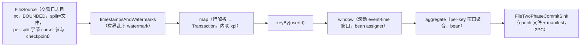

# 复合场景设计（S1 CDC→CEP→窗口聚合→2PC JDBC sink / S2 文件→keyBy 聚合+Delta→文件 sink+rescale）

**日期**：2026-09-01
**范围**：`nop-stream/nop-stream-fraud-example/`（场景落地模块裁定）、`nop-stream-flow`（XDSL 声明面）、`nop-stream-connector[-debezium|-jdbc]`（S1 连接器）、`nop-stream-runtime`（恢复/rescale/多 JVM 验证）
**状态**：active（设计已裁定；实现归单进程落地与分布式落地两个执行计划）

---

## 一、设计结论

1. **只派生 S1/S2 两个场景，不派生 S3**（独立裁定，维持既有裁定不重开）：S1 + S2 已覆盖 checkpoint 恢复 / exactly-once / rescale 边界全部相关运行语义；提交前校验类能力落地后仅作为 S1 的可选提交前步骤，不构成新运行场景。
2. **S1 驱动形态 = replayable CDC 事件源**：以 `DebeziumCdcSourceFunction` 的受保护工厂方法为注入点，替换引擎为确定性事件重放源；offset checkpoint / 恢复路径完全走生产代码路径。embedded Debezium + 真实源库不进入验收矩阵。
3. **S1 JDBC 2PC sink 目标库 = H2**（单进程 in-memory；分布式矩阵用 MiniStreamCluster 既有的 H2 AUTO_SERVER 共享库），零外部依赖。
4. **S2 = 文件 source → keyBy + 窗口聚合 → `FileTwoPhaseCommitSink`，XDSL 主形态 + DataStream API 等价对照变体**；Delta 演示 = 显式路径 `x:extends` 叠加拓扑级 delta（新增过滤算子 + 边改接）；rescale 验证 = restore-time parallelism rescale（必验）+ 离线 `MaxParallelismReshardMigration`（必验一次，单进程形态即可）。
5. **场景落地模块 = 扩展 `nop-stream-fraud-example`**（统一欺诈检测产品域叙事，S1/S2 均为该域的复合场景），不新建 demo 模块。
6. **连接器参数表达形态 = bean 引用**（显式 bean 定义承载全部配置）；不使用 `params`/`outputType`/`inputType`/`maxParallelism`/非默认 `consistencyCapability`/per-transform `parallelism` 声明（build 期 fail-fast，消费未落地）。
7. **窗口 assigner 不目录化为正式 builtin**（一次裁定关闭既有 watch-only 项）：场景一律经 bean 引用显式注册；flow builder 内置的少量魔法目录 id 维持测试便利定位，不扩充、不文档化为正式声明面。
8. **场景恢复/检查点测试驱动形态 = XDSL 入口（拓扑 + `<checkpoint>` 配置）+ runtime 恢复编排 harness 组合**：XDSL 负责声明，恢复（savepoint/restore/rescale/真 kill）由 runtime 侧执行器与多 JVM 测试基建编排。

## 二、背景与动机

nop-stream 已具备技术完备性（五层编译管线、分布式/HA/failover、RocksDB 增量状态、CDC/2PC 连接器、XDSL 编排 + Delta 定制、多 JVM 测试基建），但缺少**从用户入口到最终输出的复合场景**把这些能力串成可运行、可验收的产品证据；同时现有示例模块（`nop-stream-fraud-example`）未展示产品正门（DataStream API / XDSL 两扇入口），存在三个已确认缺口：

- **Gap A — 可运行的 XDSL 声明式欺诈管线**：产品声明的主入口（XDSL）在整个示例族零覆盖；现有一份无人引用的破损 `.stream.xml` 死文件。
- **Gap B — keyBy + 窗口聚合 + keyed state 示例**：入门者建立核心流心智模型所必需的分区/窗口/keyed state 组合零覆盖；模块内有一份为此而写但零实例化的 keyed-state 用法类（`UserTransactionHistory`）和一个诚实标注为 demo stub 的均值模式（`UnusualAmountPattern`，固定 $100 而非真实 per-user 历史）。
- **Gap C — checkpoint/恢复 + 状态后端切换 kill-recover 演示**：产品差异化能力（checkpoint 协调器 + RocksDB 增量后端）在示例族零展示。

本设计定义 S1/S2 两个复合场景（拓扑、声明形态、输入输出契约、可运行验收断言、分布式验证矩阵），并裁定上述三个缺口的映射归属，作为单进程落地与分布式落地两个执行计划的自包含输入。

## 三、核心设计

### 3.0 场景硬约束（本设计的边界，全部内联自包含）

以下六条约束是场景设计与验收断言的硬边界，任何场景拓扑、断言、矩阵格子不得违反：

| # | 约束 | 对场景的直接要求 |
|---|------|----------------|
| 1 | **不得依赖声明式异常处理策略**（可插拔异常策略处于 defer 状态；既有语义 = 默认 fail-fast + 恢复路径 best-effort 跳过留证） | 场景不出现异常策略声明；执行中发现 poison-record 类需求只能记录为 defer 的 revisit 证据，不得在场景内私造策略机制 |
| 2 | **rescale 只能走 restore 时 parallelism rescale 或显式离线 reshard 工具**（`MaxParallelismReshardMigration`）；运行时在线/自动重分片是显式 non-goal | S2 rescale 验证只允许这两条路径；矩阵不得设计运行时自动重分片格子 |
| 3 | **不得包含 standby 热备组件或状态查询接口**（两者均被裁定排除） | 拓扑与矩阵不含 standby 任务、changelog 复制、状态查询 API |
| 4 | **checkpoint 断言以「最新 durable epoch manifest 恢复 + exactly-once 结果」为准**；manifest 级 checksum 字段落地前不得断言 manifest 完整性校验行为 | 恢复断言 = 恢复后结果无丢失/无重复；不断言 manifest 校验/校验和拒绝路径 |
| 5 | **分布式验证矩阵以 `MiniStreamCluster` 真实多 JVM 为基线**，不引入 K8s | 矩阵全部格子的分布式形态 = ProcessBuilder 真实 spawn 的 JVM 组合；不出现容器编排依赖 |
| 6 | **语义不降级**：S1 声明 `STRICT_EXACTLY_ONCE` 的前提 = CDC source 可重放（offset checkpoint）+ 2PC JDBC sink 严格提交；S2 文件 sink 走 `FileTwoPhaseCommitSink` | S1/S2 的 exactly-once 断言建立在两端严格契约上，不得以 at-least-once + 去重凑数 |

独立裁定行：**S3 不派生，维持 S1/S2**。理由：产品化要求清单中已裁定为 go 的项（提交前工具、文档化、存储字段增量）均不构成新运行场景；defer/exclude 项无场景验证面；S1 + S2 已覆盖 checkpoint 恢复 / exactly-once / rescale 边界全部相关运行语义。落地提交前校验能力后，可把「dry-run 校验 S1 拓扑」作为 S1 的**可选提交前步骤**（非独立场景、非验收矩阵格子）。

### 3.1 S1：CDC source → CEP → 窗口聚合 → 2PC JDBC sink

#### 3.1.1 拓扑与数据流

```mermaid
flowchart LR
    SRC["CDC source<br/>(replayable 事件源，ChangeEvent 外壳)"]
    WM["timestampsAndWatermarks<br/>(BoundedOutOfOrderness，event-time=交易时间)"]
    DEC["flatMap（解码：ChangeEvent → Transaction）"]
    KB1["keyBy(userId)"]
    ENR["process（keyed state 均值富化<br/>KeyedProcessFunction bean）"]
    KB2["keyBy(userId)"]
    CEP["CEP pattern（4 欺诈模式，<patterns> 声明）"]
    KB3["keyBy(userId)"]
    WIN["window（滚动 event-time 窗口，bean assigner）"]
    AGG["aggregate（告警聚合，bean）"]
    SNK["2PC JDBC sink<br/>(JdbcTwoPhaseCommitSink)"]
    SRC --> WM --> DEC --> KB1 --> ENR --> KB2 --> CEP --> KB3 --> WIN --> AGG --> SNK
```

数据流语义：

- **输入外壳**：事件以 `ChangeEvent` 形状进入（op/表名/after 负载），与真实 CDC 记录形状一致，使「换 source bean 即接入真实 Debezium」成立；解码算子仅放行 insert/update 语义的事件进入管线。
- **乱序与迟到**：事件携带 event-time，经有界乱序 watermark；窗口归属由 event-time 决定（乱序输入不改变归属结果）。**迟到语义 = watermark 之后丢弃**（声明式 allowedLateness 在 DSL build 期即被拒绝，场景不得声明；迟到事件不进入任何输出是可断言行为）。
- **keyed state 富化**：`process` 阶段以 keyed `ValueState` 维护 per-user 交易历史均值（素材即模块内既有 keyed-state 用法类），输出「事件 + 用户历史均值」富化记录——`UnusualAmountPattern` 去 stub 化（真实 per-user 均值替代固定 $100）在这一层完成，CEP 条件保持对富化字段的纯谓词。
- **CEP**：4 个欺诈模式（快速连续交易 / 地理异常 / 金额异常 / 账户接管）在 `<patterns>` 注册表声明（`pattern.xdef` 模型），条件为内联 xpl 谓词（`event`/`ctx` 上下文）；匹配输出 `FraudAlert`。
- **窗口聚合**：alert 流按 userId 再分区，滚动 event-time 窗口内聚合（计数 + 金额累计），产出 per-user per-window 告警汇总行。
- **输出**：`JdbcTwoPhaseCommitSink` 每 checkpoint epoch 一个 JDBC 事务原子写入数据行 + epoch ledger 行（ledger 主键 = (epoch_id, subtask_id)，幂等提交 guard）；恢复后 durable-but-uncommitted epoch 重提交被 ledger 跳过。

#### 3.1.2 XDSL 声明形态（bean/xpl 双函数取舍）

| 算子 | XDSL 声明 | 函数形态取舍 | 理由 |
|------|-----------|-------------|------|
| source | `<source bean="cdcSource"/>` | **bean** | replayable CDC 源需要构造参数与工厂注入点，bean 是唯一能承载复杂构造的形态；内联 xpl source 仅适合无状态发射 |
| timestampsAndWatermarks | `watermarkStrategyBean` 引用 | **bean**（策略级构造） | BoundedOutOfOrderness 是策略级对象；时间戳提取器可留内联 xpl（缺失时 NoOp 透传兜底，时间戳已在解码阶段可得） |
| flatMap 解码 | `<flatMap><source>…xpl…</source></flatMap>` | **内联 xpl** | 纯记录变换，无状态无配置，xpl 内联即配置透明 |
| keyBy | `<keyBy keyExpr="…"/>` ×3 | 内联表达式 | 既定 DSL 形态 |
| process 富化 | `<process bean="userHistoryEnricher"/>` | **bean** | keyed state 生命周期归 `KeyedProcessFunction`，xpl 无状态承载面 |
| CEP | `<cep patternRef="…" bean="…select"/>` + `<patterns>` | **pattern 声明式 + select bean** | pattern 序列/条件声明式（`<where>` 内联 xpl）；匹配输出函数必须是 `PatternProcessFunction` bean（DSL 唯一支持形态） |
| window | `<window strategyRef="…"/>` + `<windowingStrategies>`（windowFnId → bean） | **bean assigner**（见 §3.4.7） | 显式注册是产品正门 |
| aggregate | `<aggregate bean="alertAggregator"/>` | **bean** | `AggregateFunction` 是带类型的累计语义，DSL 仅支持 bean 形态 |
| sink | `<sink bean="jdbc2pcSink"/>` | **bean** | 2PC sink 需要 `IJdbcTemplate`/表名/列映射/recordMapper 构造，bean 定义承载全部配置 |

`<checkpoint>` 声明：`enabled/interval/processingGuarantee=STRICT_EXACTLY_ONCE/storageType` 等既定字段（build 期全量映射），场景不使用任何 fail-fast 声明面（`params`/`outputType`/`maxParallelism`/非默认 `consistencyCapability`/per-transform `parallelism` 不匹配值）。

#### 3.1.3 输入输出契约

- **输入**（确定性事件集，场景 fixture）：
  - 正常交易若干（多用户、多窗口、乱序注入：部分事件按 event-time 乱序到达）；
  - 4 类欺诈序列各至少一组（含**跨用户干扰序列**——同窗口穿插其他用户事件，验证 keyed 匹配不串扰）；
  - 迟到事件至少一条（event-time 落在已过 watermark 的窗口）；
  - 事件总量与顺序固定（可复算期望输出）。
- **输出**：
  - 数据表 `fraud_alerts_summary`（主键约束含 window 起止 + user_id + pattern 维度），行 = per-user per-window 告警聚合；
  - ledger 表 `stream_epoch_ledger`（(epoch_id, subtask_id) 主键），行集 = 已提交 epoch × 并发 subtask 全集。

#### 3.1.4 验收断言集（逐条 repo-observable）

**正确性：**

- A1-1 乱序不变性：给定乱序输入，sink 表行集 == 按 event-time 归属计算的期望聚合行集（精确集合相等，非计数）。
- A1-2 迟到丢弃：迟到事件（watermark 后到达）不改变任何输出行；期望集预先排除之，断言表内容不受其影响。
- A1-3 CEP 精确匹配：欺诈序列产生且仅产生期望 alert 集合；跨用户干扰序列零误报（多用户流行为钉定模式，沿用模块既有加固测试的断言风格）。
- A1-4 keyed state 富化生效：金额异常模式的判定基于 per-user 历史均值（期望集按真实均值预计算，与固定阈值 stub 的输出可区分）。

**exactly-once：**

- A1-5 无重复无丢失：单次完整运行后 sink 表行集 == 期望集（主键维度无重复行、无缺行）；ledger 行集 == 实际提交 epoch 全集 × subtask 全集。

**恢复：**

- A1-6 中断重放语义：运行至 checkpoint durable 后中断 → 从最新 durable epoch 恢复 → 源从 checkpoint 位点重放 → 最终表内容仍 == 全量期望集（幂等 guard 跳过已提交 epoch，重放不产生重复行）。
- A1-7 checkpoint 语义锚点：断言只以「恢复后结果 + durable epoch 存在」为准；不断言 manifest 完整性校验行为（约束 4）。

### 3.2 S2：文件 source → keyBy 聚合 + Delta 定制拓扑 → exactly-once 文件 sink + rescale

#### 3.2.1 拓扑与数据流

- **S2-delta 变体**（Delta 演示形态，见 §3.4.4）：base 拓扑经 `x:extends` 叠加黑名单过滤算子 + 边改接。
- **S2-java 变体**（DataStream API 等价对照，Gap B 承载）：以 DataStream API 装配同一拓扑（`env.addSource(fileSource)` 起步），与 XDSL 主形态跑同一输入，断言输出一致——验证三入口合一（不同入口 → 同一 StreamModel 语义）。

数据流语义：

- **输入**：交易日志文件集（多文件 = 多 split，round-robin 分配）；行格式 `userId,amount,eventTime`；行集固定（含乱序与跨 key 混排）。
- **聚合**：per-user 滚动窗口聚合（次数 + 金额累计）。
- **输出**：`FileTwoPhaseCommitSink` 输出目录，每 epoch 一个 `epoch-N[.sK].txt` 行文件 + `manifest.properties`（key `N[.sK]` → final 路径）；temp + 原子改名 + manifest 幂等 guard。
- **rescale**：见 §3.4.5。

#### 3.2.2 XDSL 声明形态

source 用 bean 引用一个**有界文件源适配 bean**（`SourceFunction` 形态包装目录文件读取；FLIP-27 `Source` 接口目前未接入 flow DSL 的 source 声明面——`env.addSource(Source)` 重载存在于 core，但 DSL builder 只解析 `SourceFunction`；适配 bean 内部可委托 `FileSource`/`FileSourceReader` 既有实现，split cursor 语义保留）。其余算子形态同 S1 惯例：map/时间戳内联 xpl，keyBy 内联表达式，window/aggregate/sink bean。

#### 3.2.3 输入输出契约

- 输入：固定行集文件目录（每文件行数、key 分布、乱序程度固定）。
- 输出：`epoch-N[.sK].txt` 行集（每行 = 一条 per-key per-window 聚合结果）+ `manifest.properties`。

#### 3.2.4 验收断言集

**聚合正确性：**

- A2-1 输出行集 == 按 key×window 预计算的期望聚合行集（精确集合相等）。

**Delta 生效证明：**

- A2-2 合并后模型含 delta 算子（delta-unique 行为）：S2-delta 输出 == S2-base 输出 − 黑名单 key 的全部行（差集精确）；且 S2-delta 运行时输出与 S2-base 可区分（黑名单 key 行不出现）。

**入口等价（Gap B 承载）：**

- A2-3 DataStream API 对照变体输出 == XDSL 主形态输出（同一输入目录、同一期望集）。

**恢复与 rescale：**

- A2-4 restore-rescale 一致性：运行至 checkpoint durable → savepoint → 以不同 parallelism 恢复（maxParallelism 固定）→ 补放余量输入 → 最终输出 == 全量期望集（keyed 状态跨 key-group 再路由后聚合不重不漏）。
- A2-5 离线 reshard：savepoint → `MaxParallelismReshardMigration`（maxParallelism 变更，如 128→256）→ 以新 savepoint 恢复执行 → 输出 == 全量期望集；迁移报告 key 守恒（原 key 集 == 新 key 集）。
- A2-6 状态后端切换变体：同一恢复断言（A2-4）在 memory 与 RocksDB（增量）后端各跑一遍，断言集相同（后端切换是纯配置变化，语义不变）。

**exactly-once：**

- A2-7 文件 sink 断言（见 §3.4.6）：按 epoch 排序拼接全部 epoch 文件内容 == 每输入行恰一次的期望全局输出；manifest key 集 == 已提交 epoch × subtask 全集；输出目录无 `.tmp` 残留。

### 3.3 分布式验证矩阵

基线：`MiniStreamCluster`（ProcessBuilder 真实 spawn `JobCoordinatorMain` + N × `TaskManagerMain`，H2 `AUTO_SERVER=TRUE` 共享库），gated（`-Dnop.stream.test.multi-jvm.enabled=true`），沿用既有 gated 用例模式；不引入 K8s（约束 5）。

| 组合 | S1 | S2 |
|------|----|----|
| **C0 基线部署**（JC + 2 TM，无故障） | 全语义断言 A1-1..A1-5（表 + ledger，多 TM 并发 subtask 下成立） | 全语义断言 A2-1、A2-7（多 subtask epoch 文件后缀不冲突） |
| **C1 kill TM + 恢复 + fencing**（`killTaskManager` 真实 SIGTERM → `restartTaskManager`） | 恢复后 A1-6 成立（offset 恢复 + ledger 幂等重提交）；fencing 验收点：共享库 task_assignment 行的 fencing epoch **严格递增**（恢复重部署可观察副作用） | 恢复后 A2-4 成立（split cursor + keyed 状态恢复 + manifest 幂等）；同 S1 fencing 验收点 |
| **C2 restore-rescale**（TM 2→3，restore 时 parallelism rescale） | 附加格：恢复后 A1-5/A1-6 仍成立（keyed 富化/CEP/窗口状态跨 key-group 再路由） | **必格**：A2-4 在分布式形态成立（rescale 是 S2 主题）；验收点 = 恢复后输出 == 全量期望 + 3 TM 各自 subtask 的输出合并无重无漏 |
| **C3 backpressure 触发**（限速 sink：sink bean 内节流） | 验收点：背压期间 checkpoint 仍推进（checkpoint 存储产物 epoch 单调前进，无死锁）；解除节流后 A1-5 成立（结果完整、无丢失） | 验收点：同 S1（checkpoint 推进 + 解除后 A2-7 成立） |

矩阵约束合规（逐条对照 §3.0 六条）：C1/C2 的恢复断言均以 durable epoch + 结果为准（约束 4）；C2 只走 restore-time rescale，离线 reshard 工具不入矩阵（约束 2：工具与 JVM 拓扑无关，操作对象是 savepoint 产物，单进程验证即可覆盖其语义）；C3 观察代理 = checkpoint 产物推进 + 结果完整性（metrics 暴露属可观测性工作项，落地前无直接背压指标——**这是代理不是语义**，背压行为的稳定性演练属后续稳定性演练工作项，矩阵只定义场景验收所需的触发组合，如 bounded sink 限速）；无 standby/状态查询组件（约束 3）；无声明式异常策略（约束 1）；分布式全部真实多 JVM（约束 5）；两端严格契约（约束 6）。

### 3.4 关键决策记录（选择 + 理由 + 拒绝的替代方案）

#### 3.4.1 D1 — S1 CDC 可运行驱动形态

- **选择**：replayable CDC 事件源。以 `DebeziumCdcSourceFunction` 的受保护工厂方法（`createMessageSource`，既有测试注入点）替换消息引擎为确定性重放源：固定 `ChangeEvent` 序列按位点发布，发布位点写入 offset store（`NopStreamOffsetBackingStore` 既有契约），checkpoint 时经生产 `snapshotState` 落入 operator state（`cdc-offsets` 键），恢复时经生产 `initializeState` 复位续放。offset checkpoint/恢复是**生产代码路径**，只有事件供给是替身。
- **理由**：S1 验收核心是「offset checkpoint + 2PC sink 严格提交」的端到端语义，不是 Debezium 引擎自身的正确性（引擎 wrapper 契约已有模块级测试覆盖）；确定性事件集使 exactly-once 断言可计算（精确集合相等，非弱计数）；场景零外部依赖可从零跑通；「换 source bean 即真实 CDC」的升级路径真实存在（`ChangeEvent` 记录形状 + 同一 source 函数基类）。
- **拒绝**：
  - *embedded Debezium + 真实源库（MySQL binlog）*：外部 DB + binlog 依赖破坏从零跑通标准；binlog 事件顺序/快照行为引入不确定性，断言只能弱化为计数式（重复+丢失可抵消，无法证明 exactly-once）；与多 JVM 矩阵组合的运行成本失控。裁定其**不进入验收矩阵**、不构成落地计划的交付面（需要时作为手动 gated 演练素材，无验收义务）。
  - *不经 `DebeziumCdcSourceFunction`、自造裸 `SourceFunction` 发事件*：绕开了 CDC offset checkpoint 的生产路径，S1 的「CDC 可重放」语义前提（约束 6）将失去载体，沦为普通自定义源。

#### 3.4.2 D2 — S1 JDBC 2PC sink 可运行目标库

- **选择**：H2。单进程 = in-memory `MODE=MySQL`（连接器模块测试既定模式：`JdbcFactory.newJdbcTemplateFor(DataSource)`）；分布式矩阵 = 复用 `MiniStreamCluster` 既有 H2 `AUTO_SERVER=TRUE` 共享文件库（多 JVM sink 写同一库，exactly-once 断言跨 JVM 成立）。
- **理由**：sink 对目标库的最小要求 = JDBC 事务 + 主键约束（ledger 幂等 guard 依赖），H2 完整满足且零外部依赖；2PC 语义（同事务写数据 + ledger、幂等重提交 guard）与具体数据库无关；测试既定模式直接复用。
- **拒绝**：
  - *外部 MySQL/PostgreSQL*：引入部署依赖，矩阵每个格子都要管理外部库生命周期；不覆盖任何 H2 覆盖不了的 2PC 语义。
  - *以内存集合 sink 替代 JDBC sink*：直接违背约束 6（S1 的 exactly-once 前提 = 2PC JDBC sink 严格提交）。

#### 3.4.3 D3 — 场景连接器参数表达形态

- **选择**：bean 引用（显式 bean 定义承载 source/sink 全部构造配置，配置对读者完全透明）。
- **理由**：source/sink 的 `params`/`outputType`/`inputType`/`maxParallelism`/非默认 `consistencyCapability` 与 per-transform `parallelism` 声明在 build 期 fail-fast（无执行消费者）；连接器配置 bean 的构造期校验是已确认的既有链路。场景 XDSL 使用这些声明必然 build 失败。
- **拒绝**：
  - *在场景落地时顺手实施 `params` 等声明的消费*：超出场景计划范围；声明面消费按既有路由归场景落地计划（按需）+ 后续 DSL 编译器收敛/配置校验工作项。本设计只裁定表达形态，不实施消费。
  - *内联 xpl 构造连接器*：连接器是需要连接资源的复杂构造，xpl 无此承载面（内联 xpl 只适合无状态函数体）。

#### 3.4.4 D4 — S2 Delta 演示形态

- **选择**：显式路径 `x:extends` 的**拓扑级 delta**：S2-delta 在 base 上新增黑名单过滤算子（内联 xpl filter）+ 两条边改接（复刻既有 delta fixture 模式：新增 transform + edge 重定向），S2-base 与 S2-delta 是两个可独立运行的模型。
- **理由**：拓扑级 delta（增算子 + 改边）是「Delta 定制拓扑」的最小完整证明；显式路径使 base/delta 可在同一测试上下文分别加载运行，输出差异断言（A2-2）直接可算；黑名单过滤的风控语义与产品域叙事连贯。
- **拒绝**：
  - *层叠 `_delta/default` 自动合并形态作为主演示*：加载即合并、base 变体无法独立运行，对照断言（A2-2 需要 base 输出）在同一上下文不可得；该形态作为既有 fixture 已钉定，不损失能力覆盖。
  - *config-only delta*：不改拓扑，无法证明「定制拓扑」这一主题。
  - *删除/替换既有算子的 removal delta*：能力等价（增 + 改已覆盖拓扑定制证明），额外引入 removal 语义验证面，超出场景需要。

#### 3.4.5 D5 — rescale 验证技术路径

- **选择**：**两条路径都验**——① restore-time parallelism rescale（savepoint 恢复时改变 parallelism，maxParallelism 固定，keyed 状态按 key-group 再路由）：LOCAL 必验（A2-4）+ 分布式矩阵必格（C2，TM 2→3）；② 离线 `MaxParallelismReshardMigration`（读 savepoint 产物 → 新 maxParallelism 下重算 key→group 映射 → 重分布写新 savepoint + 迁移报告）：必验一次（A2-5），单进程形态即可（工具操作对象是 savepoint 产物，与 JVM 拓扑正交）。
- **理由**：两条路径是**不同产品能力**（前者 = 扩缩容不改分片上限的恢复路由；后者 = 分片上限变更的显式迁移），约束 2 要求两者都只能显式触发；离线 reshard 的输入要求（全量快照 savepoint、旧 maxParallelism 一致性检查、key 守恒报告）已有模块级 E2E 先例，场景级只需把「迁移后恢复执行 + 输出正确」接上。
- **拒绝**：
  - *只验 restore-time rescale*：丢失 maxParallelism 变更能力的产品证据，且 vision non-goal 边界（「在线/自动」排除、「显式离线」保留）的另一半无验证面。
  - *离线 reshard 入分布式矩阵*：工具与 JVM 拓扑无关，入矩阵只增加运行成本不增加语义覆盖。

#### 3.4.6 D6 — exactly-once 文件 sink 断言方式

- **选择**：**输出目录规范断言**（不依赖 sink 内部 API）：① 按 epoch 序拼接全部 `epoch-N[.sK].txt` 的行集 == 期望全局输出（每输入行恰一次，多重集相等）；② `manifest.properties` 的 key 集 == 已提交 epoch × subtask 全集；③ 目录内无 `.tmp` 残留（abort 路径清理后）；④ 文件名/manifest key 的 subtask 后缀规约（`.sK`）使并发 subtask 互不覆盖——分布式断言按「合并全部 subtask 文件」口径。
- **理由**：断言面全部是磁盘可见产物（对测试与对用户同构——用户验收 exactly-once 文件输出也是看目录）；manifest 是 sink 的公开提交面（幂等 guard 的可见载体）。
- **拒绝**：
  - *仅计数断言*（总行数 == 期望数）：重复 + 丢失可抵消，无法证明 exactly-once。
  - *经 sink 实例内部查询 API 断言*（如 epoch 是否已提交的实例方法）：单元级便利方法不适合场景级断言（跨 JVM/跨目录实例不可达），且绕开用户可见产物面。

#### 3.4.7 D7 — W-F5：窗口 assigner 是否目录化正式 builtin

- **选择**：**不目录化**。flow builder 现有的少量内置 assigner 魔法目录（标注 test convenience）维持现状：不扩充 id、不文档化为正式声明面；S1/S2 窗口 assigner 一律 bean 引用（`windowFnId` 指向显式注册的 bean）。
- **理由**：正式目录化 = DSL 层引入隐式内置注册表，与「bean 显式注册」的既有契约形成双轨（同一能力两种声明方式、不同的可替换性/Delta 行为）；产品示例必须展示正门（显式 bean = 配置透明 + 可被 Delta 替换）；魔法目录当前有边界（未知 id fail-fast）且不产生行为缺陷。
- **拒绝**：
  - *目录化 + 参数化（如 `tumbling-event-time` + size 属性）*：需要在 xdef/builder 定义参数化构造协议，超出场景设计需要，且与 D3 同源的「声明面消费」问题耦合（参数声明同样无消费者）。
  - *删除魔法目录*：既有测试依赖它（test convenience 定位），删除是纯破坏性变更无产品收益。

#### 3.4.8 D8 — 模块放置

- **选择**：**扩展 `nop-stream-fraud-example`**，不新建模块。S1/S2 统一在欺诈检测产品域叙事下（S1 = 实时 CDC 欺诈管线；S2 = 交易日志风控聚合），模块名语义成立、无需重命名。
- **理由**：模块定位就是「快速起步示例」（产品脚手架诉求的载体）；Gap A/B/C 素材（4 个 pattern 类、keyed-state 用法类、破损 `.stream.xml` 死文件）全在该模块；路线图对场景落地的模块裁定留白明确允许 fraud-example 扩展。依赖面增量（模块现仅依赖 cep）：+ flow（XDSL 主入口，传递 core；含 CEP 声明接线）、+ connector-debezium（S1 source 基类与 `ChangeEvent` 形状）、+ connector-jdbc（S1 sink）、+ connector（S2 文件源适配）、+ runtime（恢复/rescale/执行编排）、+ rocksdb（后端切换变体）、+ nop-ioc（beans 容器装配）。依赖方向全部单向（示例模块 → 框架模块），无反向依赖。
- **拒绝**：
  - *新建 `nop-stream-demo`/`nop-stream-scenario` 模块*：fraud 素材要么搬家（churn）要么跨模块引用（示例互依）；双示例模块定位重叠；roadmap 未要求。
  - *把场景放进 flow/runtime 的测试资产*：场景是产品交付面（可运行示例 = 用户入口），不是框架测试；且会反向加重框架模块测试依赖面。

#### 3.4.9 D9 — 场景恢复与检查点测试的驱动形态

- **选择**：**XDSL 入口 + runtime 恢复编排 harness 组合**：拓扑与 checkpoint 配置全部经 XDSL 声明（parse → DSL builder → `StreamExecutionEnvironment`，含 `<checkpoint>` 全字段映射）；恢复/中断/rescale 编排由 runtime 侧驱动（单进程 = savepoint → 新 env 恢复执行；分布式 = `MiniStreamCluster` kill/restart）。真 SIGTERM kill 只出现在分布式矩阵；单进程「kill-recover」以 savepoint/restore 语义承载（进程内无真 kill）。
- **理由**：现无 XDSL + checkpoint + 恢复的组合执行先例（flow 模块 E2E 停在无 checkpoint 的 `env.execute`；恢复编排能力在 runtime 执行器与多 JVM 基建）；按模块边界，声明归 flow、执行编排归 runtime，组合形态是对两者正门的最小拼接，不给任何模块加新执行器职责。
- **拒绝**：
  - *XDSL 直驱恢复（给 flow 加恢复编排入口）*：模块边界冲突（执行/恢复编排是 runtime 职责），为场景示例扩展框架模块的职责面。
  - *纯 DataStream API 组装（不经 XDSL）*：违背「XDSL 声明式优先」（落地计划的既定要求），且丢失声明面（`<checkpoint>`/`<patterns>`/Delta）的验证覆盖。

### 3.5 Gap A/B/C 映射裁定

| Gap | 裁定 | 并入点 / 交付序 |
|-----|------|----------------|
| **Gap A** 可运行 XDSL 声明式欺诈管线 | **并入 S1** | S1 即 XDSL 声明式欺诈管线（source→watermark→解码→keyBy→富化→CEP→窗口→2PC sink 全声明化）；破损死文件 `fraud-detection.stream.xml` 由 S1 场景 XDSL 取代后**删除**（落地计划执行）。交付序：单进程落地（先）→ 分布式落地 |
| **Gap B** keyBy + 窗口聚合 + keyed state 示例 | **双点并入** | 语义并入 S1（keyBy×3 + keyed state 均值富化 = `UnusualAmountPattern` 去 stub 化，素材 = 既有 keyed-state 用法类复活）与 S2（keyBy + 窗口聚合主轴）；「DataStream API 入口」面并入 **S2-java 对照变体**（A2-3，同拓扑双入口，验证三入口合一）。交付序：单进程落地 |
| **Gap C** checkpoint/恢复 + 状态后端切换 kill-recover | **并入 S1/S2 恢复验收轴** | kill-recover = A1-6/A2-4 + 矩阵 C1 格（真 kill）；后端切换 = A2-6 变体格（memory ↔ RocksDB 增量，同一恢复断言集）；单进程（savepoint/restore 形态）先行、真 kill 形态归分布式落地。无独立交付面 |

映射闭环声明：三条路由（Gap 三缺口 + demo 重写 → 场景设计/落地；`UnusualAmount` 去 stub → S1 富化层；`UserTransactionHistory` 复活 → S1 富化 bean 素材）逐条有归属，无静默降级项；demo 直连 CEP 内部 API 的旧 main 保留为「引擎直连」教学面，产品正门叙事以 S1/S2 为准（旧 main 去留由落地计划按「与 S1/S2 叙事冲突时让位」原则处置）。

### 3.6 落地计划消费契约（自包含输入清单）

单进程落地计划应从本设计直接获得（无需回读任何过程文档）：

1. 场景拓扑（§3.1/§3.2 的 Mermaid + 算子表）与 XDSL 声明形态（bean/xpl 取舍表）；
2. 输入输出契约与全部验收断言（A1-1..A1-7、A2-1..A2-7，全部 repo-observable）；
3. 全部关键决策（§3.4 D1..D9，含拒绝理由——防止落地时重新发明）；
4. 模块依赖增量清单（§3.4.8）；
5. 约束六条 + S3 不派生（§3.0，内联）；
6. 可行性锚点（附录 A：live 组件契约事实，含注入点/断言面/先例测试）。

分布式落地计划额外消费：矩阵（§3.3）+ fencing 验收点（task_assignment 共享库行）+ backpressure 观察代理口径（checkpoint 产物推进 + 结果完整性）。

## 四、拒绝了什么（场景层面的整体替代方案）

- **三场景（派生 S3）**：拒绝。已裁定的 go 项（提交前校验、文档化、存储字段增量）均不构成新运行场景；S1/S2 已覆盖全部相关运行语义（checkpoint 恢复 / exactly-once / rescale 边界）。dry-run 类能力落地后仅作 S1 可选提交前步骤。
- **以真实外部系统（MySQL binlog / 容器编排）撑「产品级」场景**：拒绝。外部依赖破坏从零跑通与断言确定性；分布式验证以 `MiniStreamCluster` 真实多 JVM 为基线是既定规则；「真实 CDC 升级路径」以记录形状一致 + 同一 source 基类保证，而非在验收矩阵引入外部库。
- **场景内实施声明面消费（params/maxParallelism/per-transform parallelism 等）**：拒绝。声明面 build 期 fail-fast 是诚实契约；消费实施归既有 Follow-up 路由，场景只裁定表达形态（bean 引用）。
- **在场景内引入 standby 热备 / 状态查询 / 在线自动 reshard 展示**：拒绝。三者均为显式排除项或 non-goal（§3.0 约束 2/3）。

## 五、与已有设计的关系

- `stream-dsl-design.md`（三入口合一 + XDef 合同）：S1/S2 是该设计的最大复合消费者；S2-java 对照变体直接验证三入口合一。
- `checkpoint-design.md`（Epoch 协议 + 2PC + 恢复模型）：S1/S2 的恢复断言锚定其 durable epoch 语义；本设计不改动其字段表（manifest 级 checksum 属存储增量的 Follow-up，落期前约束 4 生效）。
- `connector-design.md`（Split-based Source + 2PC sink 框架）：S2 文件源复用 FileSource/FileSourceReader 契约；两端 2PC sink 语义直接引用。
- `cep-design.md`（Pattern DSL + NFA）：S1 的 `<patterns>` 声明消费其声明式模型（pattern.xdef）。
- `failover-design.md` / `state-management-design.md`（恢复模型 / StateShard 路由）：矩阵 C1/C2 的恢复与 rescale 语义依据；key-group 再路由与离线 reshard 的边界即其「restore 时 rescale + 显式离线 reshard」二分。
- `00-vision.md` non-goals：本设计全部裁定在 non-goal 边界内（无在线/自动 reshard、无 standby、无状态查询）。

## 附录 A — 约束与可行性锚点（live 组件契约事实，2026-09-01 核对）

> 本附录是场景设计断言与 live 能力一致性的核对结论（live 类/fixture 名锚点），落地计划直接消费。

### A.0 落地裁定记录（2026-09-02，item 13 执行回写）

落地执行中现场裁定的实现级偏差（不改变 §3.0 六条约束与验收断言语义）：

1. **S1 四链拓扑**：flow DSL 的 `<cep>` 每次引用一个 `patternRef` 且 `<union>` 为 build 期 fail-fast，故 S1 以「共享前缀（source→wm→decode→keyBy→enrich→keyBy）+ 4 条 cep→keyBy→window→aggregate→sink 链」落地；4 个 sink 写同一张 `fraud_alerts_summary`，各用独立 per-chain ledger 表（ledger 主键 (epoch_id, subtask_id) 无 vertex 维度，跨 sink 共享会互相吞提交——这本身是 §3.1.1 单链图的实现化形，语义等价：每 (user, window, pattern) 行恰一条）。
2. **CEP 条件的纯谓词化**：地理异常的城市突变经富化字段 `prevCity` 表达为纯谓词（`<where>` 内联 xpl），不使用 `ctx.getEventsForPattern` 跨事件遍历——keyed 流上相邻事件语义等价（§3.1.1 mermaid 单 CEP 框的行为不变）。
3. **S1 decode 与 S2 行解析用 bean 而非内联 xpl**：类型化构造与校验超出纯表达式（D3 的 bean/xpl 取舍原则的自然延伸；内联 xpl 在场景中仍由 delta filter、`<where>` 条件与 `keyExpr` 覆盖）。
4. **S2 watermark 位置**：解析 map 之后（事件时间来自解析后的记录；与 S1 的 ChangeEvent.timestamp 前置 watermark 语义等价）。
5. **A2-4 LOCAL 路由裁定**（**supersession 注记 2026-09-04**：CONN-01 successor plan `2026-09-04-1043-1` 已落地——2PC sink 并行门禁解除，keyed-P>1 + 2PC sink 复合形态 LOCAL 端到端证明由 `TestParallel2PcJdbcE2E`/`TestParallel2PcFileE2E` 承载，多 JVM 形态由 `TestParallel2PcMultiJvmE2E` 承载；跨并行度**恢复**仍受 typed 拒绝（D1，checkpoint-design §8.5.2），restore-time rescale 的 P>1 形态维持不支持。原文留档）：restore-time parallelism rescale 的 LOCAL P>1 形态路由 plan 3（item 14）——引擎对 2PC sink 在有效并行度 >1 显式 fail-fast（`ERR_STREAM_2PC_SINK_PARALLELISM_NOT_SUPPORTED`，CONN-01 P1 有意 defer，checkpoint-design §6.4.1，不可降级硬门禁），与 exactly-once 文件 sink 无法在当前引擎同表。LOCAL 覆盖：P=1 keyed 窗口状态跨恢复续算（W1 跨运行）+ memory/RocksDB 双后端恢复（A2-6）+ 离线 reshard 128→256 后以新 maxParallelism 恢复执行（A2-5，keyed 状态在新 key-group 布局下的再路由）。分布式矩阵 C2 格维持 plan 3 必格。
6. **有界源水印机械**：场景 fixture 尾部携带 flush/terminator 事件推进 watermark，使窗口在运行中（而非仅 EOS）触发并经周期 checkpoint 提交；末窗（terminator 自身窗口）在 EOS 保持 in-flight、由恢复运行补齐——这是引擎语义（2PC sink 仅在完成的 checkpoint 上提交；CANCEL 末 checkpoint best-effort）下的确定性构造，A2-7 断言口径为「全部已关闭窗口的精确多重集 + 无 .tmp + manifest 与 epoch 文件一致」。
7. **落地修复的引擎缺陷**（item 13 执行中发现并就地修复，见 `ai-dev/bugs/2026-09/2026-09-02-composite-scenario-uncovered-engine-defects.md`）：JobGraphGenerator 虚拟节点链映射顺序依赖与 partitioner 丢失、ProcessOperator keyed backend 未装配、CEP NFA/SharedBuffer 状态 JSON 持久化不可用（P2-INV-6 就地解决：JavaStreamSerializer + 可序列化比较器 + @DataBean 键类型）、2PC pendingCommits JSON 键类型回归、终态 checkpoint barrier 写入已完成 partition 的竞态。

### A.0-D 分布式落地裁定记录（2026-09-02，item 14 执行回写）

分布式矩阵（§3.3）落地执行中的裁定（不改变六条约束；矩阵逐格结论见 plan 3 closure）：

1. **测试归属 = 路径①**（runtime test-jar 导出）：`nop-stream-runtime` 挂 maven-jar-plugin test-jar（沿用 core test-jar 先例），gated 场景测试放 fraud-example（test 依赖 runtime test-jar）。理由：fraud-example 已依赖 runtime main，反向（runtime test → fraud-example）构成禁戒环。
2. **XDSL 管线跨 JVM 以「声明 spec」运输**（`RemotePipelineSpec`）：XDSL 编译图内嵌非可序列化表达式对象（`ExprEvalAction` 等），无法整体 Java 序列化进 `TaskDeploymentDescriptor`；launch 侧改为运输 (VFS 路径 + 可序列化 bean 集)，各 TM 经 `RemotePipelineResolver`（ServiceLoader 注册）本地重建**同一**图（`buildJobGraph` 的稳定 transformation id 保证跨 JVM 同构，fingerprint 一致——`TestDistributedScenarioSerialization` 钉定）。非 XDSL（Java 拼装）管线仍直接序列化携带编译图。
3. **TM 侧 checkpoint 接线补全**（`RemoteTaskDeploySupport`）：remote-deploy 路径此前的三个空白——无 barrier tracker（triggerCheckpoint 被静默丢弃）、无状态后端装配、无 restore-on-deploy——全部补齐（状态后端预置 → checkpoint plan → tracker + RPC ACK → manifest-first 恢复，恢复支持 KeyGroupRange 路由的 restore-time rescale）。
4. **barrier 扇出面 = 全部承载节点**（非仅 source 节点）：各 TM 的 tracker 需先注册 in-flight epoch，否则 barrier 到达时 ACK 被 drop（"no matching in-flight epoch"）。
5. **checkpoint timeout abort 不取消任务**：timeout 是常规背压事件（丢弃 epoch、任务继续、下轮重试）；仅 SNAPSHOT-FAILURE abort 走 cancelTask（原控制通道设计意图）。此前 timeout 即取消会把慢恢复窗口放大为 cancel/recover 级联。
6. **自然完成的任务保留注册表项**（bounded-run tail commits）：有界运行末尾数据恰在 EOS 后、最后 checkpoint 前 reach 2PC sink——任务完成后若立即注销，提交通知找不到任务、该 epoch 缓冲输出永久丢失；保留条目使完成后的 sink 仍可被 `notifyCheckpointComplete` 触达（被重部署覆盖、stop 清理）。`getRunningTaskCount()` 相应只统计未到终态的任务。
7. **C2 必格的分布式形态 = TM 拓扑变更恢复演练**（`TestS2RestoreRescaleMultiJvmE2E`，TM 2→3 + 相同 jobId/checkpoint 身份 + 更大 fencing epoch。**supersession 注记 2026-09-04**：其时被显式路由的 keyed-PARALLELISM（P>1 + 2PC sink）形态已由 CONN-01 successor plan `2026-09-04-1043-1` 落地——`TestParallel2PcMultiJvmE2E`（kill TM → fencing 严格递增 → exactly-once + 共享台账 per-subtask 行）；跨并行度恢复维持 typed 拒绝（D1，checkpoint-design §8.5.2）。原路由理由留档）：keyed-PARALLELISM（P>1 + 2PC sink）形态受裁定 A.0-5 同一引擎硬门禁约束，**显式路由** CONN-01 successor（并行 2PC sink）+ per-transform parallelism 消费（roadmap item 29 家族）；keyed 再路由语义已由 executor 级（`TestKeyGroupRescaleDispatchE2E`）+ 离线 reshard 恢复（A2-5）覆盖，D5 的离线 reshard 不入矩阵裁定维持。
8. **C3 触发形态 = sink bean 内有界节流**（`ThrottledScenarioSinks`，生产 2PC 类的子类，仅数据路径加 per-record 延迟，提交语义不变；release marker 文件跨 JVM 控制解除）：验收 = 节流期间 durable epoch 严格推进（无死锁）+ 解除后精确期望集；行为稳定性量化路由 item 15。

### A.1 S1 组件

| 组件 | live 契约事实 | 锚点 |
|------|--------------|------|
| CDC source 函数 | `DebeziumCdcSourceFunction implements DrainableSource<ChangeEvent>, CheckpointedSourceFunction`；offset map 经 operator state 键 `cdc-offsets` 快照/恢复；`DebeziumConfig.name` 必填（缺失 fail-fast， unnamed 连接器共享 `_default_` 桶）；`createMessageSource(config, offsetStore)` 为 protected 注入点（Javadoc 明示测试替身用途）；一致性 `REPLAYABLE` | `nop-stream/nop-stream-connector-debezium/src/main/java/io/nop/stream/connector/debezium/DebeziumCdcSourceFunction.java` |
| offset 承载 | `NopStreamOffsetBackingStore.forConnector(name)/setOffsets/getOffsets/toSerializable/fromSerializable`——重放源推进位点、checkpoint 回转的契约面 | `nop-message/nop-message-debezium/src/main/java/io/nop/message/debezium/engine/NopStreamOffsetBackingStore.java` |
| 事件形状 | `ChangeEvent`/`ChangeEventMetadata`/`DebeziumConfig`（Serializable；connectorType=mysql/postgres/sqlserver 等字段全集） | `nop-message/nop-message-debezium/src/main/java/io/nop/message/debezium/` |
| 既有驱动先例 | 4 个测试全部经手工 `ChangeEvent` + `SourceContext` 或 `createMessageSource` 覆盖驱动，无真实 Debezium engine/源库——S1 重放源形态与之同构、且走完整 checkpoint 生产路径 | 同模块 `src/test/.../TestDebeziumCdc{SourceFunction,Checkpoint,SourceCompletion}.java`、`TestDebeziumResourceManagement.java` |
| JDBC 2PC sink | `JdbcTwoPhaseCommitSink`：saveState-first（buffer 先入 `pendingCommits[epoch]`）；commit = 独立连接单事务（数据行 + ledger 行同 commit）；ledger 主键 (epoch_id, subtask_id) 幂等 guard；`copyForSubtask(int)` 并发隔离；`getLedgerTableDDL()/initializeLedgerTable()` 可移植 DDL；builder 承载 jdbcTemplate/querySpace/tableName/columns/recordMapper | `nop-stream/nop-stream-connector-jdbc/src/main/java/io/nop/stream/connector/jdbc/JdbcTwoPhaseCommitSink{,Builder}.java` |
| H2 目标库先例 | 测试既定模式：`org.h2.Driver` + `jdbc:h2:mem:...;MODE=MySQL` + `JdbcFactory.newJdbcTemplateFor(DataSource)` | 同模块 `src/test/.../TestJdbcTwoPhaseCommitSink{Skeleton,Deep,ParallelIsolation}.java` |
| CEP XDSL 接线 | `<cep patternRef bean>`：上游必须 KeyedStream；pattern 经 `<patterns><pattern>`（`pattern.xdef`：`<single><where>xpl-fn:(event,ctx)=>any</where>` 内联条件 + within/quantifier/skip 策略）+ `CepPatternBuilder` 编译；select 仅 bean（`PatternProcessFunction`）——S1 声明形态的直接依据 | `nop-stream/nop-stream-flow/src/main/java/io/nop/stream/flow/builder/AdvancedTransforms.java`（buildCep）；`nop-kernel/nop-xdefs/src/main/resources/_vfs/nop/schema/stream/pattern.xdef` |

### A.2 S2 组件

| 组件 | live 契约事实 | 锚点 |
|------|--------------|------|
| 文件 source | `FileSource implements Source<String, FileSplit, FileSplitEnumeratorState>`：BOUNDED；split = 整文件；per-split 字节 cursor（`currentOffset`）随 split 序列化进 checkpoint；enumerator state 含 discovered/assigned/finished/splitById/nextSubtaskIndex——恢复后续读位点语义完整 | `nop-stream/nop-stream-connector/src/main/java/io/nop/stream/connector/file/FileSource.java`（+ `FileSplit{,Enumerator,EnumeratorState}`） |
| 文件 2PC sink | `FileTwoPhaseCommitSink`：saveState 写 temp → commit `ATOMIC_MOVE` 改名 + manifest 原子更新；manifest key `N[.sK]`、final 文件 `epoch-N[.sK].txt`（`.sK` = subtask>0 后缀）；幂等 guard（manifest 已含则跳过）+ final-exists-but-manifest-missing 修复分支；abort 删 temp | 同目录 `FileTwoPhaseCommitSink.java` |
| 断言面先例 | 输出目录产物（epoch 文件 + manifest + 无 temp 残留）即场景断言面；同模块测试已按此口径断言 | 同模块测试 |
| FLIP-27 接入缝 | `StreamExecutionEnvironment.addSource(Source, name)` 重载存在（core 支持两类 source）；但 flow DSL `<source>` 只解析 `SourceFunction`（bean/xpl）——S2 文件源经适配 bean 接入的依据 | `nop-stream-core/.../environment/StreamExecutionEnvironment.java`；`nop-stream-flow/.../builder/StreamModelDslBuilder.java`（buildSource） |

### A.3 flow 声明面（XDSL 形态与 fail-fast 边界）

| 面向 | live 契约事实 |
|------|--------------|
| 双函数形态 | source/sink/map/filter/flatMap/reduce 支持 bean 或内联 xpl（`resolveFunction` 分派）；process/custom/aggregate/CEP-select 仅 bean；`<keyBy keyExpr>` 内联表达式（`EvalActionKeySelector`）；`<timestampsAndWatermarks>` 支持 `watermarkStrategyBean` 或（timestampAssigner + watermarkGenerator）内联 xpl（assigner 缺失 NoOp 透传兜底） |
| 窗口 | `<window strategyRef>` → `<windowingStrategies><strategy windowFnId>`：bean 优先，未命中走 4 个内置魔法 id（`tumbling-global`/`global`/`tumbling-event-time-1s`/`tumbling-event-time-5s`，标注 test convenience）——D7 裁定不目录化的对象；策略级 `triggerId`/`allowedLateness` 非 0/非 DISCARDING accumulation **build 期 fail-fast**（迟到语义 = 丢弃的依据） |
| fail-fast 声明面（场景禁用） | source/sink/custom 的 `params`/`outputType`/`inputType`/`maxParallelism`/非默认 `consistencyCapability`、per-transform `parallelism` ≠ 生效值、顶层 registries（streams/sideInputs/environments/schemas/coders/requirements/checkpointParticipants/lifecycle）——全部 build 期显式拒绝 |
| checkpoint 声明 | `<checkpoint>` 13 字段（enabled/interval/timeout/barrierAlignmentTimeout/minPause/maxConcurrentCheckpoints/maxRetainedCheckpoints/maxConsecutiveCheckpointFailures/processingGuarantee=STRICT_EXACTLY_ONCE/storageType/jobId/pipelineId/jobTerminationMode/storageConfig）build 期全量映射至 env `CheckpointConfig` |
| Delta 先例 | transform 级 + 边改接：`test-delta-{base,extends}`；层叠：`test-delta-layered`（`_delta/default` 自动合并）；config-only：`test-delta-config-*`；fail-fast：`test-delta-failfast-*`（fixtures 于 `nop-stream-flow/src/test/resources/_vfs/nop/stream/test/`） |
| E2E 驱动先例 | parse（`DslModelParser`）→ `StreamModelDslBuilder.of(model).build()` → `env.execute(name)` → 断言 sink bean 输出（`TestStreamModelDslBuilderE2E`，含 beans 容器装配模式）；**无 XDSL+checkpoint+恢复组合先例**（D9 组合形态的依据） |

### A.4 恢复 / rescale / 后端切换

| 能力 | live 契约事实 | 锚点 |
|------|--------------|------|
| restore-time rescale | `GraphModelCheckpointExecutor.restoreTaskStatesFromSource` 按 KeyGroupRange 感知路由 keyed 状态跨 parallelism 变化（maxParallelism 固定）；E2E 先例 = savepoint staged at P_old → restore at P_new → union-of-keys 无丢失/重复断言 | `nop-stream/nop-stream-runtime/.../execution/GraphModelCheckpointExecutor.java`；`.../integration/TestKeyGroupRescaleDispatchE2E.java` |
| 离线 reshard | `MaxParallelismReshardMigration.migrate(oldSavepointPath, oldMaxP, newMaxP, outputBaseDir)`（+ `reshardCheckpoint` 纯函数 + newParallelismOverride）：输入 = 全量快照 savepoint（`.checkpoint` JSON，LocalFileCheckpointStorage 产物）；原 savepoint 只读；产出新 savepoint + 迁移报告（key 守恒/分组校验）；E2E 先例 = 128→256 + 双后端恢复正确性 | `nop-stream/nop-stream-runtime/.../checkpoint/reshard/MaxParallelismReshardMigration.java`；`.../reshard/TestMaxParallelismReshardMigrationE2E.java` |
| 后端切换 | `StreamExecutionEnvironment.setStateBackend(IStateBackend)`（env 级配置，Gap C 切换面）；memory/RocksDB 双后端实现 live | `nop-stream-core/.../environment/StreamExecutionEnvironment.java` |
| 处理保证 | `ProcessingGuarantee`：`STRICT_EXACTLY_ONCE` / `AT_LEAST_ONCE` / `EFFECTIVELY_ONCE` / `BEST_EFFORT` | `nop-stream-core/.../checkpoint/ProcessingGuarantee.java` |

### A.5 分布式基建与 backpressure 代理

| 能力 | live 契约事实 | 锚点 |
|------|--------------|------|
| 多 JVM 基建 | `MiniStreamCluster`：ProcessBuilder spawn `TaskManagerMain`×N + `JobCoordinatorMain`（HA 模式可加备用协调者）；共享 H2 `jdbc:h2:file:...;AUTO_SERVER=TRUE;MODE=MySQL`；`killTaskManager`（真实 SIGTERM）/`restartTaskManager`/`spawnJobCoordinator`；暴露 jdbcUrl/checkpointDir/harnessJdbcTemplate/registry | `nop-stream/nop-stream-runtime/src/test/java/io/nop/stream/runtime/multijvm/MiniStreamCluster.java` |
| gated 先例 | `TestMultiJvmExactlyOnceRecovery`（deployTask RPC 跨 JVM + kill/恢复 + fencing epoch 严格递增，经共享库 `nop_stream_task_assignment` 行可观察）；`TestMultiJvmCoordinatorFailover`；gate = `-Dnop.stream.test.multi-jvm.enabled=true` | 同目录 |
| fencing 可观察点 | kill→恢复重部署后 task_assignment 行 fencing epoch 严格递增（协调者写行在 deployTask RPC 之前 → 行 = RPC 发出的可观察副作用）；既有真实 3 进程（JC + TM 独立 spawn + 测试 JVM 扮 zombie）fencing 回滚防护 gated 测试先例 | 同目录 multijvm gated 用例 + `nop-stream-runtime` test 侧 fencing 回滚防护 gated 用例 |
| backpressure 机制 | `BufferPool`（公平 Semaphore，元素计数许可）+ `ResultPartition` 阻塞写（per-partition 有界队列 + 全局池）——限速 sink 填满队列即阻塞上游生产者；**无背压直接指标**（metrics 暴露属可观测性工作项未落地）——观察代理 = checkpoint 存储产物 epoch 推进 + 解除后结果完整性 | `nop-stream-core/.../execution/buffer/BufferPool.java`、`.../execution/ResultPartition.java` |

### A.6 模块依赖面

| 模块 | 现依赖 | 场景需增量 |
|------|--------|-----------|
| `nop-stream-fraud-example` | `nop-stream-cep`（仅此一个框架依赖） | + `nop-stream-flow`（传递 core/cep）+ `nop-stream-connector-debezium`（传递 nop-message-debezium）+ `nop-stream-connector-jdbc`（传递 nop-dao；test: h2 先例在 connector-jdbc，场景模块需自加 H2 test 依赖）+ `nop-stream-connector`（文件源）+ `nop-stream-runtime`（恢复/rescale 编排，传递 core）+ `nop-stream-rocksdb`（后端切换变体）+ `nop-ioc`（beans 容器装配，flow 测试同模式） |

依赖方向全部为 示例模块 → 框架模块 单向，无既有模块需要变更。
