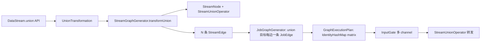

# multi-input-model——union 多输入模型设计（WI6）

> Status: active
> 本文覆盖：union 顶点模型、多入边拓扑的图生成与执行语义、平行边与边去重的边界、多输入内核约束的处置。
> 读者：nop-stream 内核维护者、WI13（join 算子）与 WI7（多输入回归）的实现者。
> 实现锚点：`nop-stream/nop-stream-core/src/main/java/io/nop/stream/core/`（transformation/UnionTransformation、operators/StreamUnionOperator、graph/StreamGraphGenerator、jobgraph/JobGraphGenerator、execution/GraphExecutionPlan）；`nop-stream/nop-stream-flow/src/main/java/io/nop/stream/flow/builder/AdvancedTransforms.java`（buildUnion）。
> 相关裁定：`sql-landing-decision.md`（D14）、`ai-dev/backlog/nop-stream-sql-roadmap.md` §3.2（约束 1/2/3/4 证据链）。

## 1. 定位与决策

nop-stream 的图模型此前只支持单输入 Transformation。union 多输入通路是 SQL 双流 join（WI13）与多源合流的地基。本档记录 WI6 落地的最终设计状态。

### 1.1 关键决策

| 决策 | 选择 | 理由 | 拒绝的替代 |
|---|---|---|---|
| union 顶点形态 | **真实执行顶点**（pass-through `StreamUnionOperator`） | 下游 OneInputTransformation 单 input 字段无法承载多入边；真实顶点复用既有多 channel InputGate，合流发生在顶点的 gate 层 | 逻辑塌缩（把 union 折进下游）——需改下游契约，破坏面大 |
| 数据元素溯源 | **不保留 channelIndex** | union 语义是合流，元素无输入身份；需要区分两条输入的算子（join）用 union 后 keyBy + process 形态表达 | InputGate 数据元素携带 channelIndex——内核改动大，仅 join 需要，归 join 形态解决（约束 3 处置） |
| 平行边合法性 | **union 目标保留每声明边一条 JobEdge**；非 union 目标维持顶点对去重 | union 按声明边数消费输入通道（self-union 必须双份交付）；非 union 目标的重复边来自链内扇入，不去重会元素双写 | 全局按边建 JobEdge——链内扇入回归 |
| 平行边 matrix 键控 | **IdentityHashMap** | JobEdge 的 equals 是「顶点对+partitionType」，平行边 equals 相等但必须各自持独立 matrix；identity 键控不改 JobEdge 公共 equals 契约（可序列化、双 builder 共用） | JobEdge 增边序号字段——public contract 变更，波及 checkpoint 恢复面 |
| operator 级水位合并 | **维持二输入上界并显式落档**（roadmap FU-6） | 运行时主路径经 InputGate 按 channel min 合并（任意 channel 数），`AbstractStreamOperator` 的 `forInputsCount(2)` 仅影响直接调 processWatermark1/2 的 wire 级使用者；参数化收益不抵改动面 | 参数化 forInputsCount——无消费场景（约束 4 处置） |

## 2. 组件与协作

- **DataStream.union(DataStream<T>...)**：校验非空数组与 null 元素（fail-fast `nop.err.stream.invalid-arg`），构造 UnionTransformation 注册 env。
- **UnionTransformation**：`getInputs()` 返回全部上游；outputType 取首输入。
- **transformUnion**：union 节点注册进 StreamGraph 的 unionIDs（链边界——canChain 的多入边判据天然保证不可链入），每输入各建一条 StreamEdge。
- **registerStreams**：重复 `source->target` 键加 `#序号` 后缀（仅重复出现时；既有拓扑键形式不变）。
- **StreamUnionOperator**：record/watermark/watermarkStatus 全转发，processBarrier 继承基类快照协议；Shareable（无状态）。

## 3. 语义契约

- **合流顺序不定义**：输入间元素交错顺序无保证；每元素恰好一次到达输出（按声明边数）。
- **重复声明边=重复合流**：DSL 对同一上游声明两条边入同一 union，等价于流合入两次——builder 不去重（no-silent-drop），运行时按边交付。
- **HASH 边禁入 union**：`validateEdgeDeclarations` fail-fast（`ERR_STREAM_EDGE_HASH_REDUNDANT`，指引 union 后 keyBy）——union 合流原始记录，无法承载 per-input keyBy。
- **多入边 gate 配置一致性**：declared-vs-declared 四字段值不一致 fail-fast（`ERR_STREAM_INVALID_ARG`）；undeclared 边让位于 declared（文档化继承，WI6 前首边静默继承的缺陷面由 declared 间冲突 fail-fast 消除）。
- **remote topic 消歧**：平行边 topic 加 `#序号`（仅重复对出现；既有拓扑 topic 名不变）。

## 4. 边界与义务归属

| 项 | 归属 |
|---|---|
| barrier 对齐/水位 min 合并/exactly-once 多输入回归三件套 | WI7（TestMultiInputBarrierAlignment / TestMultiInputWatermarkMinMerge / TestMultiInputExactlyOnceCheckpoint） |
| join 的输入区分（需要 left/right 身份） | WI13（union 后 keyBy + process，不依赖 channelIndex） |
| operator 级二输入水位合并参数化 | FU-6 |
| 平行边命名规范（非 union 拓扑） | FU-5 残余范围 |
| 本地 runner 同 JVM 首次 execute 后不交付（既有平台限制，与 union 无关） | 观察项：WI7/WI18 的 E2E 设计需每 execute 独立 init/destroy 周期 |
