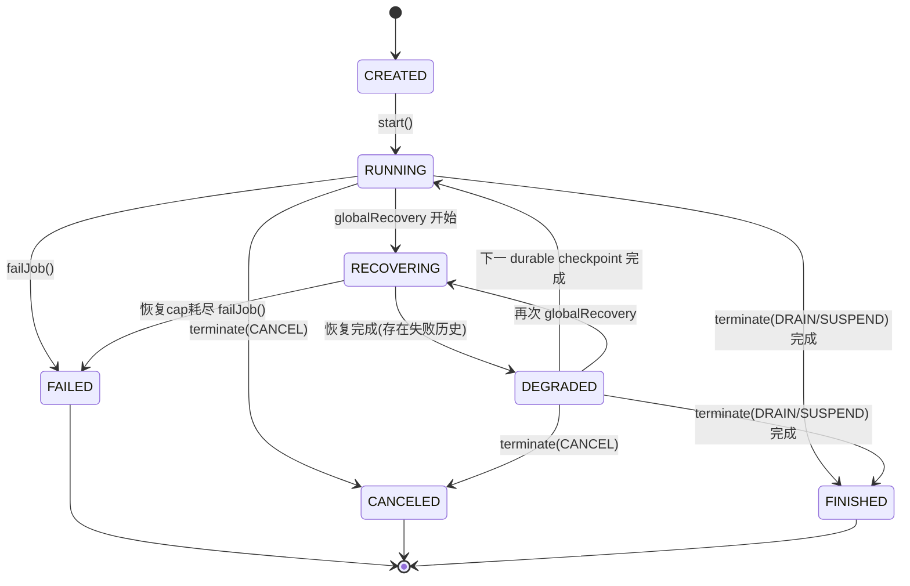

# nop-stream 可观测性与运维面设计（item 16）

**日期**：2026-09-02
**范围**：`nop-stream/nop-stream-runtime/`（指标、事件、暴露面、运维 API、健康状态机、告警、重置、治理）、`nop-stream/nop-stream-core/`（任务级仪表挂点）、`nop-stream/nop-stream-rocksdb/`（状态后端指标）、`docs-for-ai/03-modules/nop-stream.md`（owner doc 落点）
**状态**：active

---

## 一、设计结论

1. **指标基座复用 micrometer**：nop-commons 已以 compile 依赖引入 micrometer-core 与 micrometer-registry-prometheus，nop-stream 全部指标经 micrometer `MeterRegistry` 注册，不引入新指标框架。stream 侧使用一个进程级组合注册表（composite）承载全部 `nop.stream.*` meter；Prometheus 暴露启用时把 PrometheusMeterRegistry 挂为组合成员，任何时刻注册的 meter 都可被 scrape。
2. **暴露载体 = 运维 HTTP 端点（JDK 内建 HttpServer）**：runtime 是独立进程（无 servlet 容器），`/metrics` 与 REST 运维端点由 coordinator 进程内嵌的运维 HTTP 服务承载，默认关闭、按配置启用。Prometheus 暴露默认输出 TextFormat 0.0.4，按 `Accept` 头协商输出 OpenMetrics。
3. **REST 提交语义 = 工厂引用**：提交对象是「jobId + pipelineFactoryClass + 启动参数」的作业提交描述符，由 coordinator 进程受理，走既有 `JobCoordinator.start() → assignTasks() → deployTask` 执行路径。
4. **健康状态机扩展自既有 JobStatus**：以 `JobCoordinator` 真实生命周期事件（start / globalRecovery / failJob / terminate / durable checkpoint）驱动 `StreamJobHealth` 七态状态机，迁移合法性表 + 可注册监听器；不另起平行体系。
5. **告警渠道 = runtime 内轻量渠道抽象**：`IAlertChannel` 抽象 + Logging / Webhook 两个内建渠道，由真实失败/恢复事件触发；不引入 nop-integration 模块依赖。
6. **重置与 reshard 入口收敛**：状态重置工具与离线 reshard 归并到同一运维工具入口族（同一 main 类的子命令），共享「先校验、后动作」的前置语义。

## 二、背景与动机

nop-stream 容错语义（region failover、unaligned checkpoint、2PC sink、fencing）已达产品水位，但运维面仅有 `CheckpointMetrics` 单点计数：无分层指标体系、无 Prometheus 暴露、无 REST 运维 API、无逻辑健康状态机、无告警外发、无状态重置工具、无历史/日志治理。运维人员只能读日志与 checkpoint 目录产物。本设计把这七个空白面收敛为「一个运维进程面」：进程内组合指标注册表 + 一个可配置启用的运维 HTTP 端点 + 一个事件/健康/告警监听体系。

竞品基线（Flink metrics reporter 体系 + REST、SeaTunnel REST 30+ 端点与 Helm 暴露、Kafka Streams 七态健康与 StreamsResetter、Spark metrics.properties 模板）证明这些是流引擎产品化的应有项；本设计按 nop-stream 独立进程 + 控制面 RPC 形态裁剪，不复制其规模。

## 三、核心设计

### 3.1 分层指标模型（P-REQ-1）

五层标准指标，命名规范：`nop.stream.<layer>.<name>`（snake_case；Prometheus 输出时 `.`→`_`），层内以 tag 维度（`jobId` / `nodeId` / `vertexId` / `subtask`）区分实例：

| 层（layer） | 关注对象 | 注册/更新点（真实执行路径） |
|---|---|---|
| `engine` | 作业/集群/协调器：活跃节点数、checkpoint 完成/失败/中止计数与时长、恢复次数 | JobCoordinator / CheckpointCoordinator 的真实生命周期路径 |
| `task` | 任务部署/取消/失败计数、在跑任务数 | TaskManager 部署/取消/终态上报路径 |
| `operator` | 算子输入/输出记录数、单记录处理时长 | StreamTaskInvokable 数据面热路径（输入分发 + 发射点） |
| `io` | source 消费记录数 / sink 发射记录数（按 vertex 维度） | 与 operator 层同挂点，按角色（source/sink vertex）归类 |
| `state` | checkpoint 大小、快照时长、RocksDB 内部统计 | CheckpointCoordinator 完成路径 + RocksDB 状态后端 |

- **具体指标名表唯一权威位置**：`docs-for-ai/03-modules/nop-stream.md`（owner doc）。设计文档只定命名规范与层语义，不复制名表。
- **五层视图与 job/cluster/node 指标族视图的映射**：Prometheus 消费者按 tag 聚合出两级视图——job 级（`jobId` tag 全族）/ node 级（`nodeId` tag 全族）；cluster 级视图 = 无 job 维度聚合的 engine 层指标（`nop.stream.engine.nodes.active` 等）。engine 层等价 cluster 族、task+operator 层按 tag 归并为 node/job 族。
- 任务级仪表在 core 中以可注入的轻量挂点存在（默认 no-op，不改变序列化与本地路径行为），由 runtime 侧在 LOCAL（GraphModelCheckpointExecutor）与 REMOTE（TaskManager 部署）两条真实路径注入。
- 指标注册总是生效（进组合注册表）；暴露与否是运维 HTTP 端点的配置，不影响注册。

### 3.2 作业事件监听（P-REQ-2）

- `StreamJobEventListener`：作业生命周期事件监听接口（JOB_STARTED / CHECKPOINT_COMPLETED / CHECKPOINT_FAILED / CHECKPOINT_ABORTED / RECOVERY_STARTED / RECOVERY_COMPLETED / JOB_FAILED / JOB_CANCELED / JOB_FINISHED / JOB_DEGRADED）。
- 事件由 coordinator 侧真实路径派发（JobCoordinator 生命周期方法 + CheckpointCoordinator 完成路径），经 job 级事件总线回调全部注册监听器；监听器异常被捕获并记录，不影响主路径。
- 内建 `LoggingJobEventListener`（日志输出）随运维面启用自动注册。
- 「progress」等价物 = CHECKPOINT_COMPLETED / RECOVERY_* 事件流（连续流模型下无批次边界，checkpoint 周期即进度锚点）。

### 3.3 暴露面：运维 HTTP 端点（P-REQ-3/5/6 载体）

- 载体：JDK 内建 HttpServer（`com.sun.net.httpserver`），独立线程池、默认绑定 127.0.0.1、配置项控制 enabled/port/bind/path。**默认关闭**；未启用时无任何 HTTP 监听（显式关闭语义，不是静默空输出）。
- 端点族（JSON over HTTP，错误返回结构化 error code + message，非静默空响应）：

| 方法+路径 | 语义 |
|---|---|
| `GET /metrics` | Prometheus 抓取。默认 TextFormat 0.0.4（`text/plain; version=0.0.4`）；`Accept: application/openmetrics-text` 协商输出 OpenMetrics |
| `GET /jobs` | 运行中作业列表（本进程受理的全部作业 + 状态） |
| `GET /jobs/{jobId}` | 作业详情：逻辑健康状态、JobStatus、failureCause、restart 计数、checkpoint overview |
| `POST /jobs` | 提交作业（§3.4 语义） |
| `POST /jobs/{jobId}/stop?mode=CANCEL\|DRAIN` | 停止作业（四态终止模式的 CANCEL/DRAIN 两态入口） |
| `GET /jobs/{jobId}/checkpoints` | checkpoint 观测：overview（计数/最新时长/大小/失败原因）+ history（最近 N 条记录，含 failureCause） |
| `GET /jobs/{jobId}/threaddump` | 线程诊断（coordinator 进程全线程栈文本） |

- 端点对未知 jobId / 非法参数返回显式错误码（404/400 + 结构化 body）。
- thread-dump 诊断端点分期裁定：**随本设计交付**（实现成本为纯读取 `ThreadMXBean`/`Thread.getAllStackTraces` 渲染，无并发风险；D-GAP 初步建议的「后置」仅在成本高时成立，live 证据不支持后置）。

### 3.4 REST 提交语义（P-REQ-5 前置决策）

- **提交对象**：`{jobId, pipelineFactoryClass, 启动参数}`——工厂引用（与 item 14 已交付的 ClusterPipelineFactory seam 完全一致的制品契约：JobGraph + DeploymentPlan + 可选 RemotePipelineSpec + checkpoint 调优）。
- **受理进程**：coordinator 进程。运维面内的作业管理器为每个 jobId 组装一个进程内 JobCoordinator（共享该进程的消息服务 / 集群注册表 / checkpoint 存储配置），复用 launch 路径的全部接线（durable 恢复推进 id counter、分布式 commit forwarder、abort handler、周期 checkpoint）。
- **执行路径**：submit → 工厂构建制品 → JobCoordinator.start() → assignTasks() → `deployTask` RPC（与 JobCoordinatorMain 完全同路径，无旁路）。
- 重复 jobId / 工厂类不存在 / 制品构建失败 → 显式错误，无静默回落（沿用 launch 路径「工厂失败不回落 trivial 管线」语义）。

### 3.5 checkpoint 运维观测（P-REQ-6）

- `CheckpointCoordinator` 完成路径在更新既有 `CheckpointMetrics` 的同时，记录**有界历史**（每条：checkpointId、状态 COMPLETED/FAILED/ABORTED、触发时间戳、时长、大小、failureCause）。
- 查询载体 = 运维 HTTP 端点（§3.3）：overview 来自 CheckpointMetrics 快照（failureCause 已有），history 来自有界历史队列；容量与过期由治理配置（§3.8）约束。
- 历史保留策略与 durable checkpoint 清理（`maxRetainedCheckpoints`）解耦：前者是观测面记录，后者是存储面保留。

### 3.6 逻辑健康状态机（P-REQ-7）

以既有 `JobStatus`/coordinator 状态迁移为基线扩展。七态（KS 七态参照按 nop-stream 连续流 + 全局恢复语义裁剪）：

- 语义对照：`RECOVERING` ≈ KS REBALANCING（拓扑重建中）；`DEGRADED` ≈ KS PENDING_ERROR（仍在服务但存在未收敛故障痕迹——重启计数 > 0）；KS 的 NOT_RUNNING/PENDING_SHUTDOWN 在独立进程形态下无对应生命周期事件，不引入（FINISHED 由 DRAIN/SUSPEND 覆盖）。
- 迁移合法性表 + 非法迁移 fail-fast（显式异常而非静默忽略）；`JobHealthListener` 可注册，随事件总线派发 JOB_* 事件。
- 健康迁移由真实事件驱动（start/globalRecovery/failJob/terminate/durable checkpoint 完成回调），非定时推断。

### 3.7 告警与事件外发（P-REQ-12）

- `IAlertChannel`（send(AlertEvent)，AlertEvent = jobId/severity/eventType/message/timestamp）+ `AlertService`（订阅事件总线，把 JOB_FAILED / RECOVERY_STARTED / JOB_DEGRADED 等故障语义事件路由到全部配置渠道；渠道异常记录不外抛）。
- 内建渠道：`LoggingAlertChannel`（结构化日志）、`WebhookAlertChannel`（HTTP POST JSON，JDK HttpClient；URL/超时/重试次数可配）。
- 渠道配置键（用户可见契约）落 owner doc；渠道抽象稳定，后续若需要邮件/IM 渠道可在 runtime 外扩展而不动抽象。

### 3.8 状态重置与运维工具入口（P-REQ-10）

- `StreamStateResetTool`：清理指定 jobId 的本地 checkpoint 状态（LocalFileCheckpointStorage 目录布局 `<base>/<jobId>/`，含 source cursor/manifest——位点随 durable 状态一并重置）+ 集群注册表中该作业的任务分派记录。清理后以同 jobId 重新拉起即全新重跑（文件源等可重放 source 从起点重读）。
- **前置校验（无静默清空）**：作业仍在运行（注册表活跃 / 最近心跳内）→ 显式报错要求先 stop；调用方声明 source 不可重放 → 显式报错（重置后无法从起点重放，重置无意义）；目录不存在 → 显式报错（防止拼错路径静默成功）。
- **入口收敛**：重置与离线 reshard（MaxParallelityReshardMigration）收敛为同一运维工具入口族的子命令（`reset-state` / `reshard`），共享「先校验、后动作、结果报告」语义；runbook 以同一章节族文档化。

### 3.9 历史与日志生命周期治理（P-REQ-11）

- 配置项（含默认值，均为用户可见契约）：checkpoint 观测历史最大条数（默认 100）、观测历史保留时长（默认 1440 分钟）、durable checkpoint 保留数沿用既有 `maxRetainedCheckpoints`（默认 3）、治理扫描周期（默认 5 分钟）。
- 治理动作：coordinator 侧周期扫描裁剪观测历史（条数 + 时长双约束）；durable checkpoint 滚动清理沿用既有 `cleanupOldCheckpoints` 路径，治理层只做观测历史与配置面收敛。
- 治理配置由运维 HTTP 端点与 runbook 暴露；清理行为有单测断言。

### 3.10 RocksDB 状态后端指标（P-REQ-8）

- `RocksDBMetricsRecorder`：状态后端打开时注册 block cache / memtable / compaction / key 量级统计（RocksDB aggregated properties 直读，gauge 形式注册进组合注册表，`nop.stream.state.rocksdb.*` 命名）。
- 挂点：`RocksDBKeyedStateBackend` 打开路径（真实状态后端生命周期，非独立工具类）；注册无副作用（组合注册表），暴露与否由运维 HTTP 端点配置决定——与其余 `nop.stream.*` meter 同一契约，不设独立开关。

### 3.11 metrics 配置模板（P-REQ-4）

- 模板文件随 runtime 资源目录提供（`_vfs/nop/stream/conf/metrics.properties.template`），含 ≥3 类 sink 注释样例（Prometheus pull / PushGateway / JMX / 日志周期打印，4 类）。
- 文档（owner doc / runbook）引用该模板路径与各 sink 启用方法。

### 3.12 owner doc 落点裁定

- **裁定：新建 `docs-for-ai/03-modules/nop-stream.md` owner doc**（本 plan 各 phase 的文档增量统一落位；指标名表、REST 契约、健康语义表、告警/治理配置键、运维操作说明的唯一权威位置）。
- 拒绝替代方案「最小扩展 `01-repo-map/module-groups.md`」：本设计交付的用户可见契约面（指标名表/REST 端点/健康状态/配置键）远超 module-groups 的路由表承载粒度；且 03-modules/ 已是各业务模块 owner doc 的既有惯例位置。item 17（文档产品化）后续在此 owner doc 基础上扩展用户指南与连接器目录，不另起炉灶。

## 四、拒绝了什么

| 决策点 | 被拒方案 | 拒绝理由 |
|---|---|---|
| 指标框架 | 自研计数器体系 / 直接复用 `CheckpointMetrics` 扩展 | 平台已统一 micrometer（nop-commons compile 引入）；自研体系失去 Prometheus/JMX/日志等 registry 生态与 GlobalMeterRegistry 互操作 |
| 暴露载体 | 引入 nop-http / Jetty / servlet 容器 | runtime 为独立进程，运维端点只需只读抓取 + 少量控制端点；引入容器与「优先复用平台设施、不引入新框架」的 D-GAP 约束冲突（nop-http 属 Web 应用栈，不是独立进程的最小设施）；JDK 内建 HttpServer 零新依赖 |
| 暴露载体 | 经 IMessageService 控制面 RPC 暴露指标 | Prometheus 是 pull-over-HTTP 模型；经消息表轮询转发需自建协议适配且仍要 HTTP 出口，复杂度无收益 |
| 指标可见性 | 全局替换 GlobalMeterRegistry 单实例 | 替换时已注册 meter 留在旧 registry（scrape 不可见）；组合注册表（composite + member add）使任意时刻注册的 meter 都可被后续挂载的 Prometheus registry 抓取 |
| REST 提交对象 | 提交 XDSL 文本 / 序列化 JobGraph | XDSL 解析依赖 vfs/资源上下文，独立 JC 进程的路径解析语义未定义；compiled JobGraph 含不可序列化 invokable；工厂引用与 item 14 已交付 seam 一致、已有多 JVM 场景验证 |
| 受理进程 | TM 进程受理 / 独立 ops 进程受理 | 作业生命周期的唯一权威在 JobCoordinator（assignment/fencing/termination）；TM 无全局视图；独立 ops 进程需复制 JC 接线且引入新部署单元 |
| 健康状态机 | 另起独立健康推断体系（定时探测） | 健康信号必须来自真实生命周期事件（Anti-Hollow）；既有 JobStatus/coordinator 状态已是权威事实源，扩展而非平行 |
| 告警渠道 | 复用 nop-integration 渠道抽象 | runtime 需新增 nop-integration 模块依赖（重依赖 + IoC 容器要求），引擎进程不宿主集成层 bean；log/webhook 两渠道已满足验收，渠道抽象稳定可后扩 |
| 重置入口 | 重置/reshard 各自独立 CLI 入口族 | D-GAP §2.5 观察成立：职能邻接（均为状态维护操作），两套入口体系造成运维记忆负担 |
| OpenMetrics | 只实现 TextFormat 004 | P-REQ-3 要求两种格式；PrometheusMeterRegistry 底层 exposition formats 原生支持 Accept 协商，成本为零 |

## 五、与已有设计的关系

- `checkpoint-design.md` §可观测性契约：本设计是其运维观测面的落地与扩展（overview/history/failureCause 查询面）；durable checkpoint 语义不变。
- `distributed-runbook.md`：本设计交付后由 item 16 Phase 6 深化为完整运维手册（metrics/REST/健康/重置/治理章节）并落 `docs-for-ai/03-modules/nop-stream.md`。
- `00-vision.md`「最小控制面」约束：运维 HTTP 端点默认关闭、只读为主 + 少量生命周期控制端点，不引入 Web 控制台（P-REQ-9 defer 裁定见下）。

## 六、P-REQ-1..12 正式三态裁定

> 每条自包含复述要求与验收基线；状态 = met（随本设计交付）/ deferred（附条件与 revisit 触发点）。裁定与 D-GAP §3.3 初步建议一致，无 live 证据支持的修正。

| # | 要求摘要（验收基线） | 裁定 | 依据 |
|---|---|---|---|
| P-REQ-1 | 分层指标标准集，每层 ≥3 指标注册 + 单测，指标名语义成表 | **go / met by this design**（§3.1） | P0 前置：3/4/6/8 的数据源 |
| P-REQ-2 | 作业进度事件监听 API + ≥1 内建实现 + 回调断言 | **go / met**（§3.2） | 低成本高杠杆 |
| P-REQ-3 | Prometheus/OpenMetrics HTTP 暴露，job/cluster/node ≥3 级指标族 | **go / met**（§3.1/§3.3） | D4 最大空白；平台 micrometer-prometheus 设施复用 |
| P-REQ-4 | metrics 配置模板（≥3 类 sink 样例） | **go / met**（§3.11） | 随 P-REQ-3 顺手交付 |
| P-REQ-5 | REST 运维 API（submit/stop/running-jobs 至少三类 + 文档） | **go / met**（§3.3/§3.4） | P0；thread-dump 端点随本设计交付（§3.3 分期裁定：不后置） |
| P-REQ-6 | checkpoint overview/history 查询 + 失败原因 | **go / met**（§3.5） | CheckpointMetrics/failureCause 已有，增量是查询面与历史保留 |
| P-REQ-7 | 逻辑健康状态机（枚举+迁移表+监听器，e2e 断言） | **go / met**（§3.6） | KS 命题「引擎形态取逻辑健康信号面」 |
| P-REQ-8 | RocksDB 指标 recorder（非空读数断言） | **go / met**（§3.10） | KS-3 参照；依赖 P-REQ-1 注册体系 |
| P-REQ-9 | Web 控制台/流式页签（交付或显式裁定） | **defer** | REST+指标+健康面落地后按用户反馈裁定是否以 AMIS 低成本实现；defer 而非 exclude 保留实现路径。**revisit 条件**：(a) 首个试用/生产用户提出控制台需求；(b) item 18 最终验收前复核一次。届时若 go，载体建议为平台 AMIS 体系消费本设计 REST/指标面，不在引擎内建 UI |
| P-REQ-10 | 作业状态重置工具 + 手册章节 + e2e 重放断言 | **go / met**（§3.8） | KS-7 参照；与 reshard 入口收敛（D-GAP §2.5 观察） |
| P-REQ-11 | 历史作业与日志生命周期治理配置 | **go / met**（§3.9） | 配置项级交付，成本低 |
| P-REQ-12 | AlertChannel 抽象 + ≥2 渠道 + 故障注入断言 | **go / met**（§3.7） | tis 源码级参照；渠道边界裁定为 runtime 内轻量渠道（§四） |

F-2 过渡说明：stop-edit-restart（item 16 语义追加告警渠道闭环）尚未执行，P-REQ-12 按 D-GAP §2.4 过渡安排归属本设计交付；语义追加后本裁定不变。
