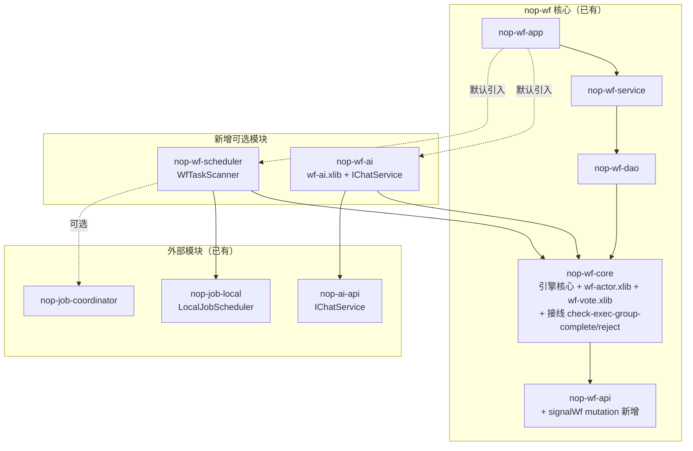

# nop-wf 扩展机制设计

**日期**：2026-07-02（审计修正于 2026-07-02）
**范围**：nop-wf 的功能扩展机制——AI 审批、调度器、离职转办、票签策略、动态审批模式
**状态**：草案（已经过 3 轮独立子 agent 源码审计，核心事实错误已修正）

> **审计修正说明**：本设计初稿曾错误地把两个已声明但未接线的"死槽位"（`<check-complete>` / `<check-exec-group-complete>`）当作可用扩展点。经源码核查确认：`isExecGroupComplete` 无调用者，`getCheckComplete` 仅被生成代码的序列化方法调用——引擎执行路径根本不读取它们。本版已据此修正：票签策略改为"先接线死槽位（引擎修复，plan-first）再提供标签库"；AI 异步改为"纯 signal + 新增公共 signal 端点"。详见各章节。

---

## 一、设计结论

1. **AI 审批**：新建 `nop-wf-ai` 可选模块，通过 `wf-ai.xlib` 标签库封装 AI 决策调用，复用 action `<source>` / `<when>` / signal 扩展点。**不新增 step 类型，不新增步骤状态枚举**。异步 AI 的外部唤醒需在 `WorkflowService` 新增 `signalWf` mutation（跨模块公共 API，plan-first）。
2. **调度器**：新建 `nop-wf-scheduler` 可选模块，通过 nop-job 的 YAML 任务注册 + `WfTaskScanner` bean 扫描 `dueTime`/`remindTime`，调用 `WorkflowService.invokeAction`。**引擎不内置调度循环**。
3. **离职转办**：在 `WorkflowService` 新增 `transferActors` mutation，内部逐工作流循环调用已有的 `IWorkflowStep.changeOwnerId`。**非原子**（跨工作流），返回成功/失败清单。
4. **票签策略**：当前 `<check-exec-group-complete>` 槽位是**死代码**（声明在 wf.xdef 但引擎不调用）。需先在 `WorkflowEngineImpl.doInvokeAction` 接线该槽位 + 新增对称的 `<check-exec-group-reject>` 槽位（框架核心引擎修改，plan-first），再提供 `wf-vote.xlib` 标签库封装常用策略。
5. **动态审批**（运行时增减节点）：**不提供原生支持**（explicit non-goal）。用三种等价模式覆盖可参数化的需求——预定义可选步骤 + 条件路由、子流程参数化、`addActor` 加人。运行时组装未知结构的审批链明确不支持。

**关于"是否修改引擎"的诚实说明**：本设计**优先**用扩展点和外置模块实现，不新增引擎分支逻辑。但有两处**引擎修复**工作（接线两个已声明但未接线的死槽位）和一处**公共 API 扩展**（新增 signal 端点），这些属框架核心修改，标记为 plan-first，须独立 plan + 回归测试。这两类工作的边界：**修复已声明契约的接线缺口**（让 schema 里声明的槽位真正生效），**不是**新增引擎能力或改变状态机语义。

---

## 二、背景：与开源工作流引擎的能力差距

对比 FlowLong（com.aizuda）和 Warm-Flow（org.dromara）两款开源工作流引擎，发现 nop-wf 在引擎核心能力（节点/路由/会签/驳回/转办/子流程/审批人解析）上**基本等价或更强**，但在以下 5 个维度存在差距。本设计记录如何补齐或如何重新定义这些差距。

| 差距点 | FlowLong 的实现 | Warm-Flow 的实现 | nop-wf 现状（经源码核实） |
|--------|----------------|-----------------|------------|
| AI 审批 | `FlowAiHandler` SPI + `AiConfig`/`AiResponse` + 置信度阈值 + 降级策略 + 异步回调 + AI 路由决策 | 不支持 | 不支持 |
| 内置调度器 | `FlowLongScheduler`（cron 默认 `*/5`）+ `JobLock` + `RemindParam`（cron/工作日/工作时间/最大次数）+ 超时自动通过/拒绝 | 不支持 | `dueTime`/`remindTime`/`remindCount` 已持久化（`nop-wf.orm.xml`），`dueAction` 仅是 step 模型属性（非实例列），无内置调度 |
| 离职转办 | `TaskService.transferTask(flowCreator, assignee)` 批量转交 | 不支持 | 仅有单步 `transferToActor`/`changeOwnerId`，无批量 |
| 票签策略可插拔 | `voteSign` + `passWeight` | `nodeRatio` 支持 `passCount=N`/`rejectCount=N`/`spel@@...`/`default@@...` | `vote-group` + 固定 `passWeight`/`passPercent` 语义（`ExecGroupSupport`）。**`<check-exec-group-complete>` 槽位虽在 schema 声明但引擎未接线（死代码），当前不可插拔** |
| 运行时动态增减节点 | `executeAppendNodeModel`/`executeRemoveNodeModel` | 不支持 | 不支持（设计上不允许运行时改模型） |

nop-wf **领先于** 这两个开源项目的维度（XDSL 可逆计算、DAG 校验、trampoline 执行队列、信号机制、业务实体绑定、错误重试、全局事件订阅、动态汇聚分组）不在本设计范围内。

---

## 三、设计原则

### P1. 扩展点优先，引擎修复须显式标记

`WorkflowEngineImpl`（`nop-wf-core/.../engine/WorkflowEngineImpl.java`）是工作流状态机的唯一实现。新增能力**优先**通过扩展点达成，不新增引擎分支逻辑。**但**：经审计发现，引擎中存在"schema 已声明、模型已解析、但执行路径未调用"的死槽位。修复这类接线缺口（让已声明契约生效）是允许的，但必须：
- 显式标记为 plan-first（框架核心引擎修改）
- 独立 plan + 回归测试
- 不改变状态机语义，仅"接通"已声明的扩展点

**扩展点现状表（经源码核实）**：

| 扩展点 | schema 位置 | 引擎是否调用 | 适用场景 |
|--------|------------|------------|---------|
| step `<source>` XPL | `wf.xdef:236` | ✅ `runSource`（`WorkflowEngineImpl.java:803`，auto-transition 时执行） | 步骤激活时运行自定义逻辑 |
| action `<source>` XPL | `wf.xdef:138` | ✅ `doInvokeAction` 中 `runSource`（`WorkflowEngineImpl.java:1141`，action 调用时执行） | action 调用时运行（调 AI、外部服务） |
| `<when>` xpl-predicate | `wf.xdef:102,131` | ✅ `doTransition` | 条件路由、分支选择 |
| `<check-complete>` XPL | `wf.xdef:241` | ❌ **死代码**（`getCheckComplete` 仅被 `_gen` 序列化调用） | 预期用途：异步完成判定。当前不生效 |
| `<check-exec-group-complete>` xpl-predicate | `wf.xdef:244` | ❌ **死代码**（`isExecGroupComplete` 无调用者） | 预期用途：会签完成判定可插拔。当前不生效，走 `ExecGroupSupport` 硬编码 |
| `<listeners eventPattern>` | `wf.xdef:83` | ✅ `WfRuntime.triggerEvent`（通配符匹配） | 事件钩子（25 个内置事件，`NopWfCoreConstants.java:58-94`） |
| signal 机制 | — | ✅ `turnSignalOn`（`WorkflowEngineImpl.java:717`）唤醒 WAITING 步骤 | 异步唤醒 |
| `IWorkflowStep` 运行时 API | `IWorkflowStep.java` | ✅ | changeOwnerId/changeActor/addActor/cancelStep/transferToActor/transitTo |
| 标签库 `*.xlib` | — | ✅ XPL 内可调用 | `wf-actor.xlib`（11 个动态审批人标签） |
| 外置模块（app 装配） | — | ✅ | 调度器、批量操作等不属引擎职责的能力 |

**本设计涉及的两处引擎修复**（plan-first）：
1. 接线 `<check-exec-group-complete>` + 新增 `<check-exec-group-reject>` 槽位（见 §七）
2. 接线 `<check-complete>` 或在 AI 异步方案中明确放弃它（见 §四，本设计选择放弃 check-complete，改用纯 signal）

### P2. 外置模块优先于内置

能力边界不清晰或依赖外部系统（AI 模型、调度集群）的功能，放入**独立的可选 Maven 模块**，通过 app 层 `beans.xml` 装配。`nop-wf-core` 保持零外部依赖。

### P3. 模型即代码，运行时不可变

工作流定义是 `.xwf` 文件，模型加载后不可变。**建模期**的可变性通过 `x:extends` 继承与 Delta 定制达成（部署时覆盖，非运行时）；运行时动态性通过**声明式条件**（`<when>` 决定走哪些预定义步骤）或**子流程参数化**达成。这与 FlowLong "运行时插节点"根本分歧（见 §八）。

---

## 四、AI 审批集成

### 4.1 设计目标

覆盖 FlowLong 的全部 AI 语义，通过标签库 + 扩展点实现，不引入新的 step 类型和步骤状态枚举。

### 4.2 语义映射

| FlowLong AI 语义 | nop-wf 实现方式 | 使用的扩展点 |
|-----------------|---------------|------------|
| 同步审批（AI 返回 PASS/REJECT） | action `<source>` 调 `wf-ai:decide` 标签，按返回设置 `wfRt.currentStep.appState` | action source（`wf.xdef:138`）+ transition 按 appState 流转 |
| AI 路由（条件分支决策） | step `<source>` 预先调 `wf-ai:route` 写结果到 wfVars，`<when>` 只读 wfVars 不重复调 AI | step source + `<when>` 读 wfVars + splitType=or |
| AI 异步处理 | step 配 `waitSignals`；外部 AI 完成后调 `WorkflowService.signalWf`（**新增端点**，见 §4.7）置信号为 on，唤醒 WAITING 步骤 | signal（`turnSignalOn` 唤醒） |
| 低置信度降级转人工 | 标签内判 confidence，低于阈值时不设置 appState，改调 `changeOwnerId`（转给具体用户） | `IWorkflowStep.changeOwnerId`（`IWorkflowStep.java:145`） |
| AI 提取业务变量 | 标签内将 AI 返回的 variables 合并到 wfVars | wfVars（`WfRuntime` 绑定的 `IVarSet`） |

### 4.3 模块设计

新建 Maven 模块 `nop-wf-ai`：

- **依赖**：`nop-wf-core` + `nop-ai-api`（仅复用 `IChatService`；不引入额外强类型 AI SPI）
- **聚合根扩展**：
  - `IWorkflowStore` 新增 action 查询方法：`getActionRecords(IWorkflowStepRecord stepRecord)` 和 `getActionRecords(IWorkflowRecord wfRecord, Predicate<? super IWorkflowActionRecord> filter)`
  - `IWorkflowStep` 新增 facade：`getActionRecords()`（包装 store 调用）
  - `IWorkflow` 新增 facade：`getActionRecords()`（聚合全工作流 action 历史）
- **设计原则**：不引入 `IWfAiAdvisor` / `WfAiPromptContext` / `WfAiDecision` 这类强类型包装接口。Nop 的扩展点是 **xlib 标签 + 聚合根组合**——标签内部直接复用 `IWfRuntime` / `IWorkflow` / `IWorkflowStep` / `IWorkflowActionRecord` 既有对象，再直接调用 `IChatService`
- **审批上下文组装**（标签内部完成）：
  - 业务数据：`wfRt.getBizEntity()` / `wfRt.getWf().getGlobalVars()`
  - 审批历史：`wfRt.getWf().getActionRecords()`（聚合根 facade）或 `wfRt.getCurrentStep().getActionRecords()`
  - 历史步骤轨迹：`wfRt.getWf().getSteps(true)`
  - 当前步骤：`wfRt.getCurrentStep()`
- **AI JSON 输出契约（关键）**：标签内部通过 `ChatOptions.responseFormat="json"` 要求模型返回固定 JSON 结构：
  ```json
  { "decision": "PASS|REJECT|ADVICE", "confidence": 0.0-1.0, "advice": "...", "variables": {...} }
  ```
  标签解析该 JSON，并按 `decision` / `confidence` / `variables` 驱动流程；解析失败按 `onError` 处理（不默认 reject）
- **标签库** `wf-ai.xlib`：标签内通过 `wfRt`（implicit 变量）取工作流上下文，通过 `BeanContainer.instance().getBean(IChatService.class)` 获取 chat 服务

### 4.4 标签库契约（`wf-ai.xlib`）

| 标签 | 用途 | 典型位置 |
|------|------|---------|
| `wf-ai:decide` | AI 审批决策，标签内部组装上下文并调用 `IChatService`，按结果设置 appState | action `<source>` |
| `wf-ai:route` | AI 路由决策，返回目标步骤名（**结果缓存到 wfVars 避免重复调用**） | step `<source>`（预计算），`<when>` 读结果 |
| `wf-ai:extract` | AI 提取结构化业务变量，合并到 wfVars | action `<source>` |
| `wf-ai:judge` | 通用 AI 判断，返回 boolean | `<when>` predicate |

标签属性：`prompt`（内联字符串或标签体内 XLang 模板）、`confidenceThreshold`（默认 0.8）、`onLowConfidence`（manual/pass/reject）、`onError`（retry/manual/suspend/fail）、`timeoutSeconds`、`responseFormat`（json 结构化输出）。

**异常路径设计（审计补充）**：区分两条降级路径——
- `onLowConfidence`：AI 成功返回但置信度低（AI 的判断）
- `onError`：AI 调用本身失败（超时/网络/JSON 解析失败，基础设施故障）
- `onError=retry` 时复用 step 已有的 `<retry>` 配置（`wf.xdef:228`，指数退避）
- `onError=suspend` 时调 `wf.suspend()` 挂起整个流程等待人工介入
- **禁止**把超时/异常默认当作 reject（会导致申请被错误驳回）

**AI 路由幂等性（审计补充）**：`<when>` 在 `doTransition` 中可能被多次求值（splitType=and 时每个分支都求值；`runAutoTransitions` 循环也会重复触发）。`wf-ai:route` **不直接放 `<when>`**，而是在 step `<source>` 中预计算一次写入 `wfVars.__aiRouteResult`，`<when>` 只读 wfVars。标签内部只依赖 `wfRt`、`wfRt.getWf()`、`wfRt.getCurrentStep()` 等聚合根对象，不引入额外服务接口层。

### 4.5 可选 `<ai-config>` 语法糖

在 `wf.xdef` 的 `<step>` 上增加可选 `<ai-config>` 子元素，由 XDSL 编译器加载期**宏展开**为 step `<source>` 中的 `wf-ai:decide` 调用。

```xml
<step name="ai-review">
    <ai-config prompt="expense-review"
               confidenceThreshold="0.85" onLowConfidence="manual"/>
    <transition onAppStates="agree">
        <to-step stepName="manager-approve"/>
    </transition>
</step>
```

**冲突检测（审计补充）**：`<ai-config>` 与手写 step `<source>` 互斥。在 `<ai-config>` 上标注 `xdef:check-unique-with="source"`，编译期检测到同时存在时报错 `ERR_WF_AI_CONFIG_CONFLICT_WITH_SOURCE`。

**关键约束**：`<ai-config>` 是纯语法糖，编译期展开为标准标签调用，**不引入新的运行时语义**。引擎对 `<ai-config>` 完全无感知。

### 4.6 状态处理

nop-wf **不新增步骤状态枚举**：

- AI 异步处理 → step 进入 `WAITING(20)`（已有状态），配合 `waitSignals`，**不依赖** `<check-complete>`（死槽位，见 §三）
- AI 转人工复核 → step 保持 `ACTIVATED(30)`，通过 `changeOwnerId` 切换处理人
- AI 相关语义用 `appState`（自由字符串）标记，如 `appState="ai-pending"`

**已知 trade-off**（审计提示）：appState 是自由字符串无枚举校验，"查询所有 AI 处理中的任务"需 `WHERE status=20 AND appState LIKE 'ai-%'`，且 appState 无索引约定。这是为避免污染状态机而有意识接受的代价。如后续监控/统计需求强烈，可考虑给 appState 增加字典约束或专用索引。

### 4.7 AI 异步唤醒端点（新增公共 API，plan-first）

**问题**：`turnSignalOn/Off`（`IWorkflow.java:181`）是进程内 API，外部 AI 系统（独立进程/微服务）无法调用。`WorkflowService` 当前仅 6 个 mutation，无 signal 操作。

**方案**：在 `WorkflowService` 新增 `signalWf` mutation（跨模块公共 API 修改，plan-first）：
- 请求 Bean `WfSignalRequestBean`：`wfName` + `wfVersion` + `wfId` + `signals: Set<String>` + `on: boolean`
- 内部调 `wf.turnSignalOn(signals)` 或 `turnSignalOff(signals)`
- 唤醒靠 `turnSignalOn`（置信号为 on），**不是** turnSignalOff

外部 AI 系统在异步处理完成后，携带 `wfId` + 预约的 signal 名调此端点，唤醒 WAITING 步骤继续流转。

---

## 五、调度器集成

### 5.1 设计目标

提供开箱即用的超时审批和任务提醒，但不把调度循环焊死在引擎里。

### 5.2 模块设计

新建 Maven 模块 `nop-wf-scheduler`：
- **依赖**：`nop-wf-core` + `nop-job-local`（单机）或 `nop-job-coordinator`（分布式）
- **核心类** `WfTaskScanner`：提供 `scanDueTasks()` 和 `scanRemindTasks()`
- **装配**：nop-job YAML 注册

### 5.3 任务注册（YAML 驱动）

利用 nop-job 的 `LocalJobConfigLoader`（`@PostConstruct`，`nop-job-local/.../config/LocalJobConfigLoader.java:43`）+ `BeanMethodJobInvoker`，在 `/nop/job/conf/scheduler.yaml` 注册：

```yaml
jobs:
  - jobName: wf-due-task-scan
    jobGroup: nop-wf
    trigger: { cronExpr: "0 */1 * * * ?" }   # 每分钟
    invoker: { bean: wfTaskScanner, method: scanDueTasks }
  - jobName: wf-remind-task-scan
    jobGroup: nop-wf
    trigger: { cronExpr: "0 */5 * * * ?" }   # 每5分钟
    invoker: { bean: wfTaskScanner, method: scanRemindTasks }
```

### 5.4 扫描逻辑（`WfTaskScanner`）

**`scanDueTasks()` 行为契约**：

1. 查询 DB：`NopWfStepInstance WHERE dueTime <= now AND status = ACTIVATED`（`dueTime` 是实例列，`nop-wf.orm.xml:420`；**`dueAction` 不是实例列，不能作为查询条件**）
2. 对每条候选记录，加载其 step 模型，从 `step.getModel().getDueAction()` 取超时动作名（`wf.xdef:194`，step 模型属性）。若 dueAction 为空则跳过
3. 调用 `WorkflowService.invokeAction(wfId, stepId, dueAction, ctx)`
4. **竞态处理（审计补充）**：每条 invokeAction 包裹 try-catch。若捕获 `ERR_WF_NOT_ALLOW_ACTION_IN_CURRENT_STEP_STATUS`（用户已手动处理该 step），视为正常情况记 INFO 日志，不重试不告警

**`scanRemindTasks()` 行为契约**：
1. 查询 `WHERE remindTime <= now AND status = ACTIVATED AND remindTime IS NOT NULL`
2. 从 step 模型读取提醒策略（见 5.7），判断是否超过最大提醒次数
3. 触发提醒（通过 listener 或消息发送），递增 `remindCount`，重置 `remindTime`

### 5.5 性能与索引（审计补充）

`NopWfStepInstance` 当前对 `dueTime`/`remindTime` **无索引**。建议新增（需 plan-first，ORM 模型修改）：
- `IX_WF_STEP_DUE_TIME`（`status, dueTime`）—— status 在前（高选择性）
- `IX_WF_STEP_REMIND_TIME`（`status, remindTime`）

### 5.6 分布式部署

- **单机**：`nop-job-local` 的 `LocalJobScheduler`，天然单实例（`IJobScheduler` 契约保证同一 jobName 同时只有一个实例执行）
- **多节点**：`nop-job-coordinator` 架构，基于数据库乐观锁（`tryLockSchedulesForPlan` / `tryLockFiresForDispatch` / `tryLockTasksForExecute` 三层争抢），无需自研分布式锁

### 5.7 提醒策略配置（审计补充，待定）

当前 `NopWfStepInstance` 有 `remindCount` 列但无 `maxRemindCount`，模型层 `WfStepModel` 也无提醒策略属性。需补充（plan-first，wf.xdef 扩展）：
- step 级 `maxRemindCount`（int）和 `remindIntervalExpr`（xpl，计算下次提醒时间）
- 可选 `workCalendar`（引用日历配置）或 `workDays`/`workHours`，避免非工作时间提醒（对齐 FlowLong 的 `RemindParam.weeks`/`workTime`）
- **时区**：`dueTime`/`remindTime` 以 UTC 持久化，scanner 用 `CoreMetrics.currentTimeMillis()` 比较；cron 时区跟随 nop-job 配置

### 5.8 app 层默认引入

`nop-wf-app` 默认依赖 `nop-wf-scheduler`，开箱即用。禁用方式：不装配 `wfTaskScanner` bean 或不引入该模块依赖。

---

## 六、离职转办

### 6.1 设计目标

支持批量将某用户的所有在办任务转交给另一用户（离职/岗位调动场景）。

### 6.2 方案

在 `nop-wf.api.xml` 新增 mutation `transferActors`，请求 Bean `WfTransferActorsRequestBean`（`fromUserId` + `toUserId`，可选 `wfIds` 限定范围）。

**事务边界（审计修正）**：`workflowExecutor.execute` 是**单工作流粒度**（`IWorkflowExecutor.java:21` 签名接受单个 `WfReference`）。批量转办跨 N 个工作流 = N 次独立 execute() = N 个独立事务，**无法原子化**。因此：
- 明确语义为"尽力而为、逐个转办"
- mutation 返回 `WfTransferResultBean { successCount, failedItems: List<{wfId, stepId, reason}> }`
- 每个 wf 的转办独立 try-catch，单个失败不影响其他

**实现**：对每个 `ownerId=fromUserId AND status=ACTIVATED` 的 step，在其所属工作流的 `workflowExecutor.execute` 内调 `step.changeOwnerId(toUserId, ctx)`（`IWorkflowStep.java:145`，仅改 record 不建新步骤）。

### 6.3 权限

`checkManageAuth`（`WorkflowEngineImpl.java:649`）是**每个工作流定义各自配置的 xpl**。批量转办须**逐个工作流检查**（无法统一检查）。权限失败记入 `failedItems`，不影响其他 wf。

### 6.4 审计记录（审计补充）

`changeOwnerId` **不创建 `NopWfAction` 记录**（不走 doInvokeAction）。离职转办是重大管理操作，必须有审计轨迹。实现中需额外手动创建一条 `NopWfAction`（`actionName="transfer"`），记录操作人、原 ownerId、新 ownerId。

### 6.5 转办通知（审计补充）

通过 listener 监听 `EVENT_CHANGE_OWNER`（`NopWfCoreConstants.java`）事件，调 nop-message 发送通知。文档给出此推荐模式，不在引擎内置。

---

## 七、票签策略（含引擎槽位接线，plan-first）

### 7.1 现状：死槽位

`<check-exec-group-complete>` 槽位在 `wf.xdef:244` 声明为 xpl-predicate，被解析进 `_WfStepModel._checkExecGroupComplete`。**但**：
- 唯一读取它的 `isExecGroupComplete`（`WorkflowEngineImpl.java:1207`）是 **private 死代码**，无任何调用者（codegraph 确认）
- 生产路径 `doInvokeAction`（`WorkflowEngineImpl.java:1152`）直接调 `ExecGroupSupport.shouldExecGroupComplete(step)`——**硬编码权重逻辑**，完全忽略用户写的 xpl
- 不存在 `<check-exec-group-reject>` 槽位；拒绝判定 `shouldExecGroupReject` 也是硬编码

因此当前票签策略**不可插拔**，只有固定的 `passWeight`/`passPercent` 语义。

### 7.2 引擎接线方案（plan-first，框架核心修改）

在 `WorkflowEngineImpl.doInvokeAction` 中接线：

**完成判定**（`WorkflowEngineImpl.java:1152` 附近）：
```
若 stepModel.getCheckExecGroupComplete() != null:
    执行该 xpl-predicate（传入 wfRt），返回值决定组是否完成
否则:
    fallback 到 ExecGroupSupport.shouldExecGroupComplete(step)  // 现有硬编码逻辑
```

**拒绝判定**（`doReject`，`WorkflowEngineImpl.java:1242` 附近）：
- 新增 `<check-exec-group-reject>xpl-predicate</check-exec-group-reject>` 槽位到 `wf.xdef`（与 complete 对称）
- 同样：配置了则执行，否则 fallback 到 `ExecGroupSupport.shouldExecGroupReject`

**slot 与属性的优先级（审计补充）**：若配置了 `<check-exec-group-complete>`，则忽略 `passWeight`/`passPercent` 属性，完全由 slot 决定。`wf.xdef` 注释中标注此优先级。

### 7.3 标签库契约（`wf-vote.xlib`，接线后才有意义）

接线完成后，提供标签库封装常用策略：

| 标签 | 语义 | 等价 Warm-Flow |
|------|------|---------------|
| `wf-vote:passCount` | 固定通过人数达 N 即完成 | `passCount=N` |
| `wf-vote:passPercent` | 通过权重占比达阈值即完成 | `nodeRatio=0~100` |
| `wf-vote:rejectCount` | 固定驳回人数达 N 即拒绝（放 `<check-exec-group-reject>`） | `rejectCount=N` |
| `wf-vote:expr` | 自定义表达式判定 | `spel@@...` |

**标签输入契约**：标签可访问 implicit 变量 `wfRt`（`WfRuntime`，含 `currentStep`）。标签内部调 `wfRt.getCurrentStep().getStepsInSameExecGroup(true, true)` 遍历成员统计（与 `ExecGroupSupport.isVoteGroupComplete` 等价逻辑）。

```xml
<step name="committee-vote" execGroupType="vote-group">
    <check-exec-group-complete>
        <wf-vote:passCount count="3"/>
    </check-exec-group-complete>
    <check-exec-group-reject>
        <wf-vote:rejectCount count="2"/>
    </check-exec-group-reject>
</step>
```

### 7.4 放置位置

`wf-vote.xlib` 放入 `nop-wf-core` 的 `/nop/wf/xlib/`（与 `wf-actor.xlib` 同级）。仅依赖引擎 execGroup 数据模型，无外部依赖。**注意：接线前此标签库无效果。**

---

## 八、动态审批模式（不补代码的决策）

### 8.1 设计立场

FlowLong 的 `executeAppendNodeModel`/`executeRemoveNodeModel` 允许运行时修改实例模型 JSON。nop-wf **明确不提供等价能力**。

**理由**：
- 运行时改模型违背"模型即代码"原则（§P3），导致模型与代码不一致、无法版本管理、调试困难
- nop-wf 的模型受 XDef schema 校验和 DAG 拓扑分析保护，运行时改模型会破坏这些保证

### 8.2 覆盖盲区（审计补充，诚实声明）

三种等价模式覆盖**可参数化**的需求，但**不覆盖**以下场景（explicit non-goal）：
- **运行时才知道审批层数**：例如"根据外部合规检查结果动态插入 1-N 个审批节点"，节点数量运行时才确定，条件路由的分支数量必须在建模时穷举
- **运行时动态组装未知结构的审批链**：例如从数据库配置表读取审批链定义并动态执行，节点的 stepName/actor 在建模时完全未知

这些场景 nop-wf 不支持，使用者需在建模期固定结构或用外部编排系统驱动多个独立工作流。

### 8.3 等价模式一：预定义可选步骤 + 条件路由

在模型中定义所有可能出现的审批步骤，运行时通过 `<when>` 条件决定走哪些。

```xml
<step name="router">
    <transition splitType="or">
        <to-step stepName="manager-approve" order="1">
            <when><le name="wfVars.amount" value="@:10000"/></when>
        </to-step>
        <to-step stepName="vp-approve" order="2">
            <when><gt name="wfVars.amount" value="@:10000"/></when>
        </to-step>
    </transition>
</step>
```

适用：审批路径的分支条件在建模时已知。

### 8.4 等价模式二：子流程参数化

主流程调用"动态审批"子流程，actor 和模式由 `<arg>` 参数化。**注意**：子流程参数化只能参数化 actor/变量，不能参数化"步骤结构本身"（结构在子流程 .xwf 中固定）。

```xml
<flow name="dynamic-review">
    <start wfName="dynamic-approval" wfVersion="1">
        <arg name="approvers" value="${wfVars.selectedApprovers}"/>
    </start>
</flow>
```

### 8.5 加减签（execGroup 成员管理，已内置）

> 加签/减签是 **execGroup 层面的成员增减**，属于引擎已支持的内置能力，与 §8.1-8.4 的"动态审批（节点模型层面）"是不同层级。

**加签**：`IWorkflowStep.addActor(WfActorAndOwner, ctx)`（`IWorkflowStep.java:150`，`WorkflowEngineImpl.java:934`），在 execGroup 内追加 step 实例。

**减签**：对 execGroup 内目标成员 step 调 `cancelStep`（`IWorkflowStep.java:210`，即 `exitStep(CANCELLED)`）。该 step 变历史态后自动从 execGroup 活跃成员退出——`ExecGroupSupport.shouldExecGroupComplete`（`ExecGroupSupport.java:20-31`）对 and-group 检查 `getStepsInSameExecGroup(false,false)` 是否为空（CANCELLED 不再计入）；对 vote-group 走权重计算（`getStepsInSameExecGroup(true,true)`，CANCELLED 不计入 completeWeight）。

**"至少保留 1 人"约束**：引擎不强制（and-group 全 cancel 会直接判定完成）。由调用方在 cancelStep 前检查 `getStepsInSameExecGroup(false,false).size() > 1`。

### 8.6 文档同步

此决策需同步到 `docs-for-ai/02-core-guides/workflow-configuration.md`，新增"动态审批模式"章节，**诚实说明**三种等价模式的适用范围和不支持的场景。

---

## 九、模块边界与依赖



**依赖方向约束**：
- `nop-wf-api` 保持零外部依赖；`signalWf` 是纯接口新增
- `nop-wf-core` 接线两个死槽位（不引入外部依赖）；`wf-vote.xlib` 也可放入 core
- `nop-wf-ai` / `nop-wf-scheduler` 是叶子模块，可独立排除
- `nop-wf-app` 默认引入两者

---

## 十、拒绝了什么

### R1. 拒绝"新增 AI step 类型"

**方案**：在 `WfStepType` 新增 `ai` 类型。
**拒绝理由**：AI 审批语义可用 action `<source>` + 标签库表达。step 类型的引擎级生命周期优势（统一状态转换、专属 UI、自动审计区分）在 nop-wf 中通过 action 属性（`specialType`）+ listener + appState 即可实现等价的"AI 步骤"标识，无需新增状态机分支。
**独立论证**：action source 是图灵完备的 XPL，能表达"调 AI→判置信度→设 appState→触发降级"的完整逻辑；新增 step 类型会迫使引擎为 AI 增加专门的状态转换规则，而这些规则用 appState + transition 已可声明式表达。

### R2. 拒绝"新增 aiProcessing/aiManualReview 步骤状态"

**方案**：在 `wf/wf-step-status` 字典新增两个状态。
**拒绝理由**：AI 异步用 `WAITING(20)` + signal + appState=`ai-pending` 已可表达；AI 转人工用 `ACTIVATED(30)` + changeOwnerId 已可表达。
**已知 trade-off**（不回避）：appState 是自由字符串，"查询所有 AI 处理中任务"需 `WHERE status=20 AND appState LIKE 'ai-%'`，无枚举校验、无索引约定，监控面板中 AI 任务会混入 WAITING 总量。这是为避免扩大状态机维度而有意识接受的代价。若监控需求强烈，可后续给 appState 加字典约束。

### R3. 拒绝"调度器内置到引擎"

**方案**：在 `WorkflowEngineImpl` 启动定时线程。
**拒绝理由**：调度涉及线程管理、cron 解析、分布式锁，属运维关切，不应耦合进状态机引擎。nop-job 已提供成熟方案（含分布式乐观锁）。`nop-wf-app` 默认引入 `nop-wf-scheduler` 解决开箱即用性。

### R4. 拒绝"运行时动态修改模型"

**方案**：运行时向实例追加/删除步骤定义。
**拒绝理由**：违背 §P3。见 §八。**诚实声明**：三种等价模式不覆盖"运行时组装未知结构审批链"的场景，此为 explicit non-goal。

### R5. 拒绝"多 ORM 解耦"

**方案**：实体改成接口 + Supplier 工厂，支持 MyBatis/JPA。
**拒绝理由（审计重写）**：**nop-wf 是 Nop 平台的组成部分，不以独立可嵌入引擎形式分发**。这是产品定位决策。如果企业已有 JPA/MyBatis 技术栈的现有项目，引入 nop-wf 意味着采用 Nop 平台的持久化层（Nop Dao），而非把 nop-wf 嵌入现有持久化栈。"Nop Dao 支持所有数据库"是方言适配能力，与"支持多 ORM 框架"是不同维度，不构成多 ORM 解耦的理由。

### R6. 拒绝"AI 审批绑定具体大模型"

**方案**：在 `nop-wf-ai` 直接调 OpenAI/通义千问 SDK。
**拒绝理由**：直接复用 nop-ai 的 `IChatService` 抽象，具体模型由 nop-ai 的 `llm.xml` 多模型配置提供。模型可替换性来自 nop-ai 现有抽象，不需要在 nop-wf 再包一层 AI SPI。

---

## 十一、与已有设计的关系

| 文档 | 关系 |
|------|------|
| `approval-flow-design.md`（本目录） | 基底。审批流核心模式复用。**注意**：该文档的状态机图缺 4 个状态（SUSPENDED/EXPIRED/FAILED/SKIPPED）且 KILLED 排序错，需后续修正 |
| `docs-for-ai/02-core-guides/workflow-configuration.md` | 使用手册。实现后同步 `<ai-config>`/`wf-vote`/动态审批模式 |
| `docs-for-ai/03-runbooks/build-approval-flow.md` | 实操指南。AI 审批和调度器实现后新增 runbook |
| nop-ai（`nop-ai-api`） | 上游依赖。复用 `IChatService` |
| nop-job（`nop-job-local`） | 上游依赖。复用 `IJobScheduler` + `LocalJobConfigLoader` + `BeanMethodJobInvoker` |

---

## 十二、实现优先级与后续工作

> P0/P1 按业务价值与用户需求频率划分，非按实现难度。

| 优先级 | 工作项 | 类型 | 前置条件 |
|--------|--------|------|---------|
| P0 | `nop-wf-scheduler` + `WfTaskScanner` | 新模块（纯装配）+ ORM 索引（plan-first） | 无 |
| P0 | `transferActors` mutation | 公共 API 新增 | 无（复用 changeOwnerId） |
| P0 | `WorkflowService.signalWf` mutation | 公共 API 新增（plan-first） | 无（AI 异步的前置） |
| P1 | 接线 `<check-exec-group-complete/reject>` 槽位 | **引擎修复（plan-first）** | 无（死代码修复） |
| P1 | `wf-vote.xlib` 标签库 | 新标签库 | **依赖 P1 槽位接线完成** |
| P1 | `nop-wf-ai` + `wf-ai.xlib` + 聚合根 facade 扩展 | 新模块 + 公共契约扩展 | nop-ai `IChatService` 就绪；异步需 P0 signalWf |
| P2 | `<ai-config>` 语法糖 | XDSL 宏展开 | `wf-ai.xlib` 就绪 |
| P2 | `workflow-configuration.md` 新增"动态审批模式" | 文档 | 无 |
| P2 | 提醒策略配置（maxRemindCount/workDays） | wf.xdef 扩展（plan-first） | 无 |

**标记为 plan-first 的工作项**（框架核心引擎修改/公共 API）：槽位接线、signalWf 端点、ORM 索引、提醒策略扩展。这些须独立 plan + 回归测试。

本设计为**草案**状态（已经过 3 轮独立审计修正）。评审通过后，各工作项进入 `ai-dev/plans/` 拆分执行计划。
