# 通用工作流设计器集成设计

> Status: active
> Created: 2026-08-10
> Scope: nop-wf 集成 nop-chaos-flux flow-designer（`designer-page` renderer），提供通用工作流模型（.xwf）的可视化编辑能力
> 关联: `approval-flow-design.md`、`dingflow-json-format.md`、`extensions-design.md`、`ai-dev/design/flux-web-container-body-rendering.md`

---

## 一、设计结论

1. **复用 flux `designer-page`（graph mode），本仓库不实现任何前端图编辑器代码**。DesignerConfig 与 GraphDocument 全部由服务端生成/装配，页面 JSON 通过 flux `dynamic-renderer` 加载。
2. **文档契约是通用工作流图**：GraphDocument.nodes = `.xwf` 的步骤（`WfStepModel`），GraphDocument.edges = transitions（to-step / to-end / to-empty）。双向转换（.xwf ⇄ GraphDocument）在服务端单一实现，不绑定 DingFlow 格式或 tree mode。
3. **加载/保存走专用 GraphQL 服务**：`WorkflowDesignerService__loadDesignerPage(wfDefId)` 返回完整 designer-page schema；保存由工具栏按钮触发 `designer:export` → 链式 ajax 提交 `WorkflowDesignerService__saveDocument(wfDefId, doc)`，服务端完成转换、`WfModelParser` 校验、modelText 落库。
4. **DesignerConfig 由固定通用模板 + 步骤 `specialType` 派生**：nodeTypes 基线为 start / end / step，`specialType` 只影响图标与颜色（未知值回退默认 step），不依赖 `*.graph-designer.xml` 模型；输出字段严格限定于 flux `DesignerConfig` 契约内。
5. **前端 bundle 升级为外部前置**：nop-chaos-flux 的 `flux-bundle` 必须注册 `flow-designer-renderers`，并经 flux → nop-chaos-next → nop-web-site 三仓链路重建 `pkg-nop-chaos-flux-*.js.gz`，本仓库负责校验 bundle 已含设计器并复制资产。
6. **转换器工作在原始 XNode 层**：start/end/empty 用保留 id 合成节点呈现（保存时剔除）；`x:extends` 头、未识别属性与 xpl 片段原样保留，零编辑保存接近零 diff；保存校验与引擎加载路径完全同源。

## 二、背景与动机

- nop-chaos-flux 已提供成熟的通用流程设计器：`flow-designer-core`（纯图运行时）+ `flow-designer-renderers`（`designer-page` / `designer-canvas` / `designer-palette` 等 renderer），以 `DesignerConfig` + `GraphDocument` JSON 为宿主契约，支持撤销/重做/剪贴板/快捷键/两阶段创建/端口校验等能力。
- 本仓库 `nop-wf` 目前只有 AMIS 时代的 `nop-flow-editor` 自定义组件（`designer.page.yaml` + `designer.flux.yaml` 均引用它），它依赖独立 JS 组件库、仅加载 `demo-data.page.json`、未与真实 `NopWfDefinition` 数据接线，且 `nop-flow-editor` 组件实现不在本仓库内，无法维护。
- `NopWfDefinition.view.xml` 的"设计"行操作打开 `designer.page.yaml` 抽屉，但**没有传递 `wfDefId`**，任何真实工作流定义都无法进入编辑器（现状是演示页）。
- 目标：让用户能在浏览器中以图形方式编辑 `NopWfDefinition.modelText` 中的 `.xwf` 模型（通用步骤 + 迁移线），编辑完成后保存回定义，且不影响工作流引擎既有行为。

## 三、核心设计

### 3.1 整体数据流

```mermaid
flowchart LR
    A[NopWfDefinition 行操作 design] -->|wfDefId| B[designer.flux.yaml<br/>dynamic-renderer]
    B -->|ajax loadAction| C[WorkflowDesignerService__loadDesignerPage]
    C -->|modelText .xwf| D[XNodeParser 原始 XNode<br/>x:extends 不合并]
    D -->|XNode| E[WfGraphDocumentCodec]
    E -->|GraphDocument + DesignerConfig| F[designer-page schema]
    F -->|渲染| G[flux designer-page]
    G -->|toolbar 保存: designer:export + ajax| H[WorkflowDesignerService__saveDocument]
    H -->|GraphDocument| I[WfGraphDocumentCodec]
    I -->|.xwf XNode| J[引擎加载路径校验<br/>WfModelParser + DAG]
    J -->|modelText| K[NopWfDefinition.modelText 落库]
```



入口 → 动态加载 → 服务端装配 → 前端编辑 → 服务端转换校验回存，全程只有一条业务链路。

### 3.2 文档契约（GraphDocument ⇄ WfModel）

#### 3.2.1 模型映射规则

| 图概念 | .xwf 模型元素 | 映射规则 |
|--------|--------------|---------|
| `GraphDocument.id` | — | wfDefId 或 "wf://{wfName}:{version}" |
| `GraphDocument.nodes[]` | `<steps><step>` | 每个 step 一个节点；`node.id = step.name`（模型内唯一） |
| `node.type` | `specialType` | start / end 特殊步骤、其余映射到 DesignerConfig nodeTypes；未知 specialType 回退 `step` |
| `node.data` | step 属性（`displayName`、`assignment`、`execGroupType`、`waitSignals`、`internal` 等） | 白名单提取 + 未识别属性原样保留（round-trip 保真） |
| `node.data.specialType` | — | 从 `WfStepModel.specialType` 派生（缺省节点为普通 step） |
| `GraphDocument.edges[]` | `<transition><to-step>` / `<to-end>` / `<to-empty>` | 每个迁移目标一条边；`edge.id = "{source}->{target}"` 规则确定 |
| `edge.type` | transition 目标类型 | `to-step` / `to-end` / `to-empty` 三种边类型 |
| `edge.data` | transition 属性（`splitType`、`onAppStates`、`appState`、`backLink` 等） | 白名单提取 + 未识别属性保留 |
| `node.position` | — | 编辑态附加的纯 UI 布局信息，保存时忽略（模型不含坐标） |
| `node.data` | `waitSignals`/`source`/`on-enter` 等 xpl 内容 | v1 以原始 XML 文本透传保留，不结构化编辑 |

**合成节点**：`<start startStepName>` 起始步骤、`<transition><to-end/>`、`<transition><to-empty/>` 没有步骤目标节点，codec 用保留 id 的合成节点呈现：`start` / `end` / `empty`。保留 id 不参与步骤 name 唯一性约束，保存时从 `.xwf` 剔除（`.xwf` 中不存在对应名称的 step）；步骤名为保留 id 冲突（如步骤恰好命名 `end`）时保存拒绝并报错。

#### 3.2.2 转换不变量

- **可往返**：`codec.wfToDoc(model) → codec.docToWf(doc)` 对任意解析成功的 `.xwf` 模型不丢失已识别属性；未识别属性（含全部 xpl 片段与扩展节点）原样保留。
- **原始保真层级**：codec 工作在原始 XNode 层（对应 `DaoWorkflowModelLoader` 的 `XNodeParser` 产出，不做 x:extends 合并）；`x:extends` 头、未识别子元素与属性按原样保留，零编辑保存接近零 diff，且不破坏既有 base 模型（`oa.xwf`）的 delta 结构。
- **id 一致性**：节点 `id` 与步骤 `name` 一一对应；新增节点时服务端生成唯一 name，冲突时拒绝。
- **校验职责与对齐**：数据库落库前必须能经**引擎加载路径**成功解析——即 `DaoWorkflowModelLoader` 等价通道（`XNodeParser` + `WfModelParser` + `WfModel.init()` 触发的 `WfModelAnalyzer` DAG 检查）；失败返回英文错误消息与具体位置，不落库（快速失败，禁止静默丢弃）。DAG 语义与引擎启动校验完全一致（`allowStepLoop` 允许环、`backLink` 边不计入环检测），不引入更强或更弱的第二套校验规则，避免"保存通过、启动失败"或反之。
- **图示仅辅助**：viewport、节点坐标是视图状态，不进入持久化模型。

### 3.3 DesignerConfig 生成

服务端按固定模板装配（v1 硬编码于服务，不读 `*.graph-designer.xml`）：

- `version`/`kind`：`"1.0"` / `"workflow"`。
- `nodeTypes`：
  - `start`：input 端口 + 出边（无输入端口）；
  - `end`：仅 input 端口；
  - `step`（含 specialType 映射变体）：input + output 端口，`defaults` 提供空数据集；
  - 每个步骤节点类型的 `inspector.body` 与 `createDialog.body` 由通用属性表单 schema 生成（v1 提供名称/显示名/assignment 等基础字段，xpl 类高级属性作为只读文本字段透传）。
- `edgeTypes`：`to-step`（默认）、`to-end`、`to-empty`。拓扑约束用 flux 契约内的合法字段表达（flux `DesignerConfig` **没有** `allowTargets` 字段，且对未知 schema 字段静默忽略，禁止使用）：经 `EdgeTypeConfig.match`（`when`/`sourceRoles`/`targetRoles`）与 `NodeTypeConfig.constraints`/`ports`（`allowIncoming`/`allowOutgoing`、`PortConfig.roles`）约束 start 仅能指向非 start、end 为终态；顶层强制仍由服务端保存校验兜底。
- `palette`：基础分组（start/end/step）。
- `features`：`undo`/`redo`/`clipboard`/`shortcuts`。
- `documentMode`：不设置（graph mode）。

**字段合法性**：装配产出的 DesignerConfig 只允许出现 flux `DesignerConfig` 契约（flow-designer-core 的 `types.ts`）内的字段（`EdgeTypeConfig` 为 id/label/body/appearance/defaults/inspector/match；`NodeTypeConfig` 含 ports/roles/constraints 等），实施期以 fixture 对照该契约做断言，防止字段静默丢失。

可视外观映射：`specialType` → 颜色/图标登记表（内置常见值：approver/cc/notify/route/condition 等），未知值使用默认样式。该登记表位于服务端常量，可后续用 Delta 扩展。

### 3.4 服务端 API 契约

命名空间 `WorkflowDesignerService`（实现位于 `nop-wf-service`）：

| 操作 | 入参 | 返回 | 语义 |
|------|------|------|------|
| `loadDesignerPage` | `wfDefId: string` | designer-page schema（`type: 'designer-page'` + `config` + `document` + `toolbar` + `inspector`） | 读取 modelText → 解析 → 生成 config + document |
| `saveDocument` | `wfDefId: string`, `doc: string`（设计器导出的 JSON） | 保存结果（成功/失败 + 错误位置） | GraphDocument → .xwf → 校验 → 写回 modelText |

保存语义约束：

- 已发布（`status=1`）的定义拒绝保存（沿用 UI 既有 `visibleOn` 策略，服务端也要校验）。
- 保存仅更新 `modelText`，不改变版本号、status、发布/归档字段。
- 权限沿用 `NopWfDefinition` 的既有 Crud 权限模型（`wfDefinitionAuths`），不在设计器服务中建立第二套鉴权。
- 落库通道：经 `NopWfDefinition` 实体 DAO 更新 `modelText`（`IWorkflowDefinitionDO.getSourceObject()` 解出实体后写入、保存），写后调用 `IWorkflowDefinitionDO.validateModel()` 类型接口复核（v2 若契约变化以 live 为准）。
- 注册方式：`WorkflowDesignerService` 是非实体 BizModel，NopIoC 无注解扫描，必须在 `nop-wf-service` 的 retention bean 文件（`app-service.beans.xml`）显式声明 `<bean>`，否则 `/r/WorkflowDesignerService__*` 不可达。

### 3.5 前端页面与入口

```
/nop/wf/designer/designer.flux.yaml
┌────────────────────────────────────────────────────────┐
│ type: page                                              │
│ body:                                                   │
│   - type: dynamic-renderer        ← flux 动态加载       │
│       loadAction: ajax → /r/WorkflowDesignerService__loadDesignerPage
│       args: { wfDefId: ${...} }   ← 入口传入            │
│       body: [ { type: spinner } ] ← 加载中 fallback     │
└────────────────────────────────────────────────────────┘
```

- 入口：`NopWfDefinition.view.xml` 的 design 行操作 → draw 抽屉（flux 模式下 flux-web.xlib 映射为 `openDrawer` action）→ 必须携带行数据 `${id}` 作为 `wfDefId`。
- 若现有 view.xml → flux 的 drawer 映射无法传递页面数据，则改为路由式入口（页面地址携带 `wfDefId` 查询参数），实施阶段以一个为主并验证；两者都不改变后端契约。
- 页面 JSON 中仅含 `dynamic-renderer` 装配，所有领域 schema 由服务端返回——保证"页面可变、契约稳定"。

### 3.6 前端 bundle 前置（三仓链路）

浏览器 bundle **不是** flux 仓产物：flux 仓的打包脚本（`scripts/` 下的 `pack-flux-bundle`）产出的是 npm 包（`dist-packages/nop-chaos-flux-*.tgz`）。实际终态 bundle 由 nop-chaos-next 仓构建（`apps/main/dist/assets/pkg-nop-chaos-flux-*.js`，与 `nop-web-site` 现有资产 hash 一致）。升级链路：

1. flux 仓：`flux-bundle/src/index.tsx` 注册 `registerFlowDesignerRenderers`（设计前提）→ `pnpm build` → `pack-flux-bundle.mjs` 产 tgz；
2. nop-chaos-next 仓：导入新 tgz 到 `libs/` → 重建 `apps/main`；
3. 复制 `apps/main/dist/assets/pkg-nop-chaos-flux-*.js`（+ 设计器 CSS）到 `nop-web-site` 并 gzip，两个仓均记录来源 commit hash。

本仓库集成以"bundle 已含 `designer-page` renderer"为前置验证项（解压 grep `designer-page` 或运行时渲染验证）；若 bundle 未更新，集成计划必须先推进上述链路。

### 3.7 错误处理

- 错误码：新增 `NopWfDesignerErrors`（`io.nop.wf.service.designer`），覆盖：定义不存在、模型解析失败、DAG 有环、导出 JSON 非法、已发布禁止保存、节点名冲突。
- 消息英文；服务层遵循模块内部异常类 + 英文消息的两层策略（见 `docs-for-ai/02-core-guides/error-handling.md`）。
- 前端保存失败：flux `onError` 链展示后端错误 toast，页面保持编辑状态不丢失。

## 四、拒绝了什么

| 被拒方案 | 拒绝理由 |
|---------|---------|
| 继续维护 `nop-flow-editor`（AMIS 时代自定义组件） | 组件实现不在本仓库、仅 demo-data 接线、无真实保存链路；与 flux 生态分裂，无法演进 |
| 在本仓库自研前端图编辑器组件 | 与 flux 侧已验证的 designer-core/renderers 重复造轮子；本仓库没有前端 JS 构建管线产物位 |
| 使用 tree mode（DingFlow 风格流程树） | 通用 `.xwf` 允许任意 DAG 与 `backLink` 回边，graph mode 保真度更高；tree mode 是 DingFlow 领域形状，与"通用设计器"目标冲突（`dingflow-json-format.md` 承接 DingFlow 场景） |
| 客户端（浏览器）执行 .xwf ⇄ GraphDocument 转换 | flux design.md §6.4 明确 parse/serialize/validate 属领域适配器职责；服务端实现保证"模型即代码"、可单测、与引擎校验共用同一代码 |
| 扩展 PageProvider / nop-web 页面管线支持参数化动态页面 | 改动平台核心页面缓存与加载链路，成本高、影响面大；`dynamic-renderer` 是 flux 既有原语，零平台改动 |
| 用全局自定义 flux action（打包 JS）实现保存 | 需要自定义 JS + 构建链路；`designer:export` + `then` 链（`prevResult`/`result` 传递）是 flux 既有原语，优先使用；若实施中发现绑定不可行，再回退此方案（已在计划中设验证门） |
| GraphDocument 直接采用 DingFlow JSON | DingFlow 是具体审批域格式（链式 tree 形状），通用工作流设计器需要通用的图结构与保留任意 ×wf 属性；两个契约并存，`dingflow-json-format.md` 管 DingFlow 侧 |

## 五、与已有设计的关系

- `approval-flow-design.md` — 目标模型语义（step/transition 执行语义、DAG 约束）；设计器不改变模型语义，仅提供编辑入口。
- `dingflow-json-format.md` — DingFlow 审批域 JSON 契约。本设计采用**通用图契约**（GraphDocument），与 DingFlow JSON 并行；未来 DingFlow 前端可改为复用本设计器 + 独立的 tree 适配器（不在本设计范围）。
- `extensions-design.md` — 引擎核心不可侵蚀原则：设计器是 nop-wf-web/service 的编辑能力，不触碰 `WorkflowEngineImpl`、不修改 wf.xdef。
- `flux-web-container-body-rendering.md` — flux 页面 JSON 与 schema 契约的既有裁定（动态加载、页面 shell 约定）作为本设计的前端兼容基础。
- 模块边界：新增代码全部落在 `nop-wf-service`（设计器服务 + 转换器）与 `nop-wf-web`（页面 yaml + 入口 view.xml 修改）；不修改 `nop-wf-core`、`nop-wf-api` 的既有契约（`WorkflowServiceImpl` 等保持不动）。