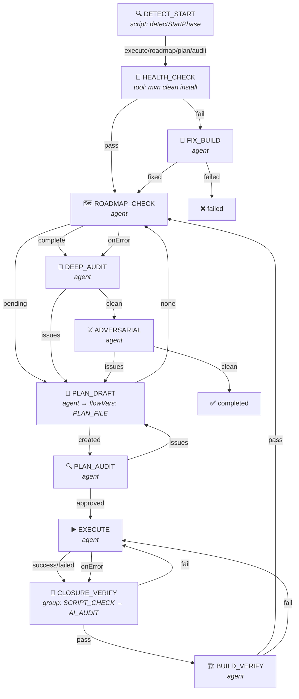
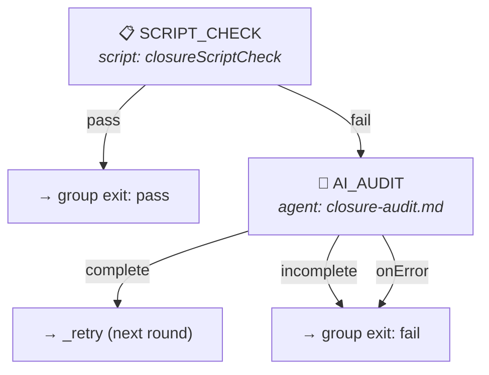
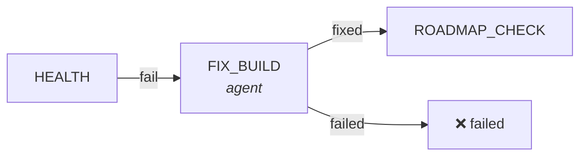
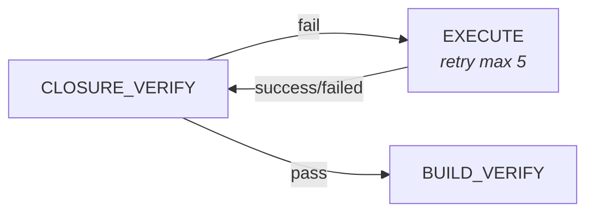

# Goal Driver Flow Engine Design

> Status: v5
> Last Reviewed: 2026-06-10
> Changes: Added §2.7 Subflow Execution, file-system subflow loading
> Source: ai-dev/tools/opencode-goal-driver (src/ only)

## 1. Motivation

Refactor hardcoded workflow into a declarative Flow DSL + generic engine. Core principles:

1. **Engine has no business logic** — all semantics in flow definition (DSL), engine only does "execute step → extract result → lookup transition"
2. **Each step is atomic** — one script call OR one AI prompt OR one subflow invocation
3. **Result-driven transitions** — step return value is looked up in transitions table to decide next step
4. **Unified fault tolerance** — each step has independent retry/degradation config

## 2. Core Concepts

### 2.1 Flow

A Flow is a **finite state machine** composed of Steps connected by Transitions.

```javascript
const flow = {
  name: "goal-driver",
  entry: "FIX_TESTS",
  maxTotalSteps: 120,
  maxCycleVisits: 20,

  markerAliases: {
    "已创建": "created", "已批准": "approved", "有问题": "issues",
    "无": "none", "完成": "complete", "已完成": "complete",
    "未完成": "incomplete", "成功": "success", "失败": "failed",
    "修复": "fixed", "无错误": "no_errors", "通过": "approved",
    "待处理": "pending", "干净": "clean", "需要": "needed", "不需要": "not_needed",
  },

  steps: { /* ... */ },
};
```

### 2.2 Step

Each Step is an atomic work unit. Five types:

| Type | Execution | Result extraction |
|------|-----------|-------------------|
| `script` | Execute JS function | Return value used directly as marker |
| `tool` | Execute bash command | `exit 0` → marker=`pass`, non-zero → marker=`fail` |
| `agent` | Spawn `opencode run` subprocess | Extract `<resultTag>value</resultTag>` from AI output |
| `subflow` | Spawn child FlowEngine | Child engine returns `complete`/`failed`/`all_complete`/`some_failed`/`all_failed` |

Step definition:

```typescript
interface Step {
  name: string;
  type: "script" | "tool" | "agent" | "subflow";

  // === Execution config ===
  run?: string | ((delegates, args?) => string | { marker: string; vars?: Record<string, any> });
  command?: string;
  prompt?: string;
  promptFile?: string;
  resultTag?: string;
  system?: string;

  // === Variable extraction via <FLOW_VARS> (agent steps only) ===

  // === Subflow config (type=subflow only) ===
  flow?: string;                         // Sub-flow name (resolved via delegates.loadSubFlow)
  forEach?: string;                      // Context var containing array to iterate
  flowArgs?: Record<string, string>;     // Template-resolved args passed to child
  onItemError?: { stopOnError?: boolean };

  // === Transitions ===
  transitions: Record<string, Action>;

  // === Fault tolerance ===
  maxRetries?: number;
  onError?: Action;
  onUnknown?: Action;
  onUnknownMaxRetries?: number;
  onMaxRetries?: Action;
}
```

#### flowVars (engine-level variable environment)

The engine maintains a shared `flowVars` Map that accumulates variables across steps. Variables are automatically extracted from agent step output via the `<FLOW_VARS>` XML convention:

**Agent step output:**
```
<FLOW_VARS>
  <PLAN_FILE>ai-dev/plans/2026-06-10-001-my-plan.md</PLAN_FILE>
</FLOW_VARS>
```

**Step definition** — no per-step config needed. The engine automatically parses `<FLOW_VARS>` from any agent step output and merges into `flowVars`.

```javascript
{
  type: "agent",
  prompt: "Draft a plan...",
  transitions: { created: { goto: "PLAN_AUDIT" } }
  // No extractVars needed — engine parses <FLOW_VARS> automatically
}
```

**Template substitution** — `flowVars` takes precedence over static `delegates.vars`:

```
Priority: flowVars (dynamic) > delegates.vars (static) > literal {VAR} retained
```

**Script steps** can also set flowVars by returning `{ marker, vars }`:

```javascript
run: (delegates, flowVars) => {
  return { marker: "done", vars: { ACTIVE_PLANS: "3" } };
}
```

#### Variable Scope

Variables are **flow-scoped** (not step-scoped). Once set, they persist until overwritten or the flow ends. This is intentional: the plan file path set by PLAN_DRAFT should be available to all downstream steps (PLAN_AUDIT, EXECUTE, CLOSURE_VERIFY).

### 2.3 Action

Action describes "what to do next":

```typescript
type Action =
  | { goto: string }
  | { goto: string; append: AppendSpec }
  | { done: string }
  | { retry: string; maxRetries?: number; append?: AppendSpec }
```

**goto vs retry**:

| | goto | retry |
|---|---|---|
| Target step counting | +1 visit | +1 retry (independent of visit count) |
| Context append | Per append spec | Per append spec, feedback **accumulates** |
| Overflow handling | maxCycleVisits → terminate | maxRetries → onMaxRetries |
| Prompt assembly | Original prompt + append | Original prompt + all accumulated append |

**retry fallback chain**: `transition.maxRetries` → `stepDef.maxRetries` → `3` (default).

### 2.4 Template Variables

`{variable}` in prompts and commands are resolved at runtime from two sources:

| Priority | Source | Set by |
|----------|--------|--------|
| 1 (highest) | `flowVars` (dynamic) | Agent `<FLOW_VARS>` output or script `{ marker, vars }` return |
| 2 (base) | `delegates.vars` (static) | `main.js` at startup |

Unresolved variables (e.g. `{DATE}`) are kept as literal text for the AI to interpret.

### 2.5 AppendSpec

```typescript
type AppendSpec =
  | true
  | string
  | { template: string }
  | { extract: string; template: string }
```

### 2.6 Result Extraction & Marker Aliases

**agent step extraction chain**:

```
AI output → find <resultTag>tag</resultTag>
         → not found → spawn parse agent
         → not found → use onUnknown action

Found marker → lookup transitions table
           → no match → try markerAliases
           → no match → try case-insensitive
           → no match → session correction (up to onUnknownMaxRetries times)
           → no match → use onUnknown action
```

**markerAliases** is a flow-level config for fault tolerance. AI might return Chinese text like "已创建" instead of "created" — alias mapping lets the engine understand both.

### 2.7 Subflow Execution

Subflow steps spawn a child `FlowEngine` that runs a separate flow definition loaded from the filesystem. Two modes:

**Single execution** (`forEach` not set):
- `delegates.loadSubFlow(flowName)` reads `<subflowDir>/{name}.json` from the filesystem
- Child engine receives resolved `flowArgs` as `delegates.vars` (merged with parent vars)
- Child `completed` → marker `complete`; any other status → marker `failed`
- Child `flowVars` propagate back to parent engine

**forEach mode** (`forEach: "varName"`):
- Resolves `varName` from parent context (JSON array string or comma-separated string)
- Runs child subflow once per item, with `forEachItem`, `forEachIndex`, `forEachTotal` injected into child vars
- Aggregated markers:

| All children | Some failed | All failed |
|-------------|-------------|------------|
| `all_complete` | `some_failed` | `all_failed` |

- Empty list → `all_complete` (no child spawned)
- `onItemError: { stopOnError: true }` stops iteration on first failure

**File loading**: `loadSubFlow` reads from `delegates.config.subflowDir` (default: `flows/` relative to tool root). Subflow JSON files follow the same format as the main flow and undergo the same prompt resolution and script registration.

**Template resolution**: `flowArgs` values have `{{var}}` resolved against parent `allVars` before passing to child. The child inherits parent's `delegates.vars` merged with `flowArgs`.

```json
{
  "type": "subflow",
  "flow": "commit-flow",
  "flowArgs": {
    "planFile": "{{PLAN_FILE}}",
    "module": "{{module}}"
  },
  "transitions": {
    "complete": { "goto": "NEXT" },
    "failed": { "goto": "HANDLE_FAILURE" }
  }
}
```

## 3. Fault Tolerance

### 3.1 Error Classification

| Error type | Trigger | Handling |
|-----------|---------|---------|
| **subprocess killed** | agent step `ok=false` | `onError` action |
| **execution exception** | try/catch caught | `onError` action |
| **marker extraction failed** | No resultTag in output | parse agent → `onUnknown` |
| **marker not in transitions** | Unexpected AI value | alias → case-insensitive → correction → `onUnknown` |
| **retry exhausted** | retry count > maxRetries | `onMaxRetries` action |
| **too many cycles** | visit count > maxCycleVisits | Return `max_cycles` |
| **too many steps** | totalSteps > maxTotalSteps | Return `max_total_steps` |

### 3.2 Result Success Markers

| Step type | Success | Failure |
|----------|---------|---------|
| tool | exit 0 → `pass` | exit ≠ 0 → `fail` (normal marker, NOT onError) |
| script | Function returns → return value as marker | Function throws → onError |
| agent | `ok=true` → extract marker from output | `ok=false` (killed) → onError |
| subflow | Child `completed` → `complete`/`all_complete` | Child failed → `failed`/`some_failed`/`all_failed` |

### 3.3 Retry Mechanism

```
Step executes → marker hits retry action
  → compute retryKey = "fromStep→targetStep"
  → retryCount++
  → if > maxRetries → execute onMaxRetries
  → else → append feedback to target step's appendBuffer → goto target step
```

**Prompt assembly on retry**:

```
[Original prompt]
                              ← 1st append (if 2nd+ retry)
──────────────               ← separator (inserted on 2nd+ retry)
[2nd append]                 ← newly appended feedback
```

### 3.4 Commit Error → Agent Fix Pattern

Both main flow and sub-flow use the same pattern for git commit errors:

```
COMMIT (script: gitCommit --no-verify)
  → committed → next step
  → nothing → next step (skip)
  → error → COMMIT_FIX (agent: fix conflicts/lint/secrets using nop-git-master)
              → fixed → next step
              → skipped → next step
              → onError → next step (graceful)
```

This pattern is critical: git hooks (lint, secrets detection) can reject commits. The agent fallback handles these gracefully without terminating the flow.

## 4. Engine Execution Loop

```
function run(entry):
  currentStep = entry || flow.entry

  while totalSteps < maxTotalSteps:
    stepDef = flow.steps[currentStep]
    if !stepDef → return "unknown_step"

    visitCount[currentStep]++
    if visitCount > maxCycleVisits → return "max_cycles"
    totalSteps++

    try:
      result = executeStep(currentStep, stepDef)
    catch:
      → execute onError action

    extractFlowVars(result)
    context[currentStep] = result

    if result.ok == false AND step is not tool:
      → execute onError action

    marker = resolveMarker(result, stepDef)
    if !marker → execute onUnknown action

    transition = findTransition(stepDef, marker)
    // try: exact → alias → case-insensitive → session correction

    if transition.done → return transition.done
    if transition.retry → handleRetry(transition) → goto target
    if transition.goto → handleGoto(transition) → goto target
```

## 5. File Organization

```
ai-dev/tools/opencode-goal-driver/
├── src/
│   ├── main.js                    # CLI entry: parse args, create flow + runner, start engine
│   ├── config.js                  # Config: module directory discovery
│   ├── engine.js                  # Generic FlowEngine (no business logic) — 41 tests
│   ├── executor.js                # Process spawn + fd redirect + watchdog
│   ├── runner.js                  # opencode CLI wrapper (real execution + mock/dry-run mode)
│   ├── flow-loader.js             # Load flow JSON + prompts + script registry
│   └── prompts.js                 # Test-only: mock step configs
├── prompts/                       # Prompt files (loaded at runtime by flow-loader)
│   ├── fix-build.md
│   ├── roadmap-check.md
│   ├── plan-draft.md
│   ├── plan-audit.md
│   ├── execute.md
│   ├── closure-audit.md
│   ├── build-verify.md
│   ├── deep-audit.md
│   └── adversarial-review.md
├── flows/
│   └── goal-driver.json           # Main flow definition (DSL)
├── test/
│   └── engine.test.js             # 41 tests
└── package.json

### Responsibility Matrix

| File | Responsibility | Business logic? |
|------|---------------|----------------|
| engine.js | Generic FSM executor | No |
| flow-loader.js | Load flow JSON + prompt files + script functions | **Yes** (script functions) |
| goal-driver.json | Flow definition | **Yes** |
| runner.js | opencode CLI wrapper + mock mode | No |
| executor.js | Process spawn + fd redirect + watchdog | No |
| config.js | Parameter parsing + module discovery | No |
| main.js | Glue code | No |

## 6. Flow Diagram

The actual flow definition is the authoritative source: `ai-dev/tools/opencode-goal-driver/flows/goal-driver.json`.



### 6.1 CLOSURE_VERIFY Sub-flow (group step)



### 6.2 Error Recovery

**Build fix → retry**:


**Closure audit → retry execution**:


## 7. Script Functions

| Function | File | Returns |
|----------|------|---------|
| `detectStartPhase(delegates)` | flow-loader.js | `"execute"` / `"roadmap"` / `"plan"` / `"audit"` (string marker) |
| `closureScriptCheck(delegates)` | flow-loader.js | `"pass"` / `"fail"` (string marker) |

## 8. Session Strategy

### 8.1 Design Decision: Independent Sessions by Default

Each agent step spawns an **independent `opencode run` session**. The engine does NOT carry a session ID from one step to the next.

**Decision reason**:

 1. **Context is passed via template variables, not conversation history.** The engine already has a complete context-passing mechanism (`{steps.X.text}`, `{steps.X.marker}`, `append` buffers, `flowVars`). Every downstream step receives all necessary information through its prompt — no reliance on opencode's conversation memory.
2. **Each step has a clearly defined role.** `FIX_TESTS` does not need to see `ROADMAP_CHECK`'s dialogue history. Its `promptFile` already contains sufficient instructions and injected context.
3. **Avoids cross-step contamination.** Shared sessions risk the agent referencing stale or irrelevant context from previous steps, producing unpredictable behavior.
4. **Predictable token usage.** Independent sessions guarantee each step starts from a clean context window, independent of cumulative conversation length.

**Rejected alternative**: Shared session across the entire flow. Would require managing conversation compaction, risk context window overflow in long flows, and add tight coupling between steps that should be independent.

### 8.2 Exception: Session Reuse for Marker Correction

When an agent returns a marker not found in the transitions table, the engine performs **marker correction** — it re-prompts the same agent (in the same session) to output a valid marker value.

```
agent step → marker not in transitions
  → spawn correction prompt IN SAME SESSION (up to onUnknownMaxRetries times)
  → agent sees its own previous output and corrects the marker
  → if still invalid → onUnknown action
```

**Why reuse session here**: The correction prompt is a small follow-up asking the agent to fix a formatting error in its own output. The agent needs to see its previous response to produce the corrected marker. Starting a new session would lose the context of what it just said.

Implementation: `engine.js` `_executeAgentStep` receives `sessionId` parameter. Normal flow calls it with `null`; the marker correction path (`_resolveMarker` → correction retry) passes `this.lastSessionId`.

### 8.3 Session Lifecycle Summary

| Scenario | Session | Rationale |
|----------|---------|-----------|
| Normal agent step | **New** (sessionId=null) | Context via template vars, no history needed |
| Marker correction retry | **Reuse** (sessionId=lastSessionId) | Agent needs to see its own output to correct |
| Subprocess killed → onError | **New** (no sessionId) | Previous session is from a dead process |

## 9. Module Compatibility

Engine uses `config.js` `findModuleDir()` for module directory discovery:

- Top-level module (e.g., `nop-stream`): `{projectRoot}/nop-stream/`
- Nested module (e.g., `nop-ai-agent`): `{projectRoot}/nop-ai/nop-ai-agent/` (searches one level of subdirectories)
- Manual override: `--module-dir nop-ai/nop-ai-agent`

Maven `-pl` uses artifactId (e.g., `nop-ai-agent`), Maven reactor resolves nested modules.
