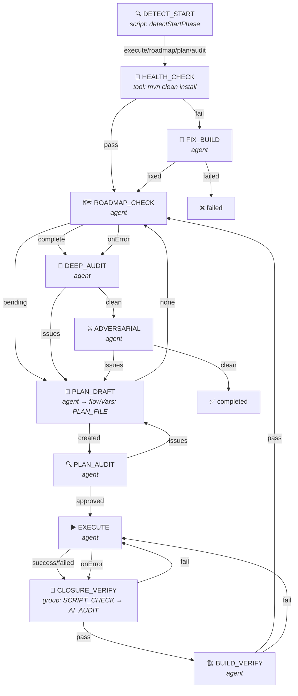
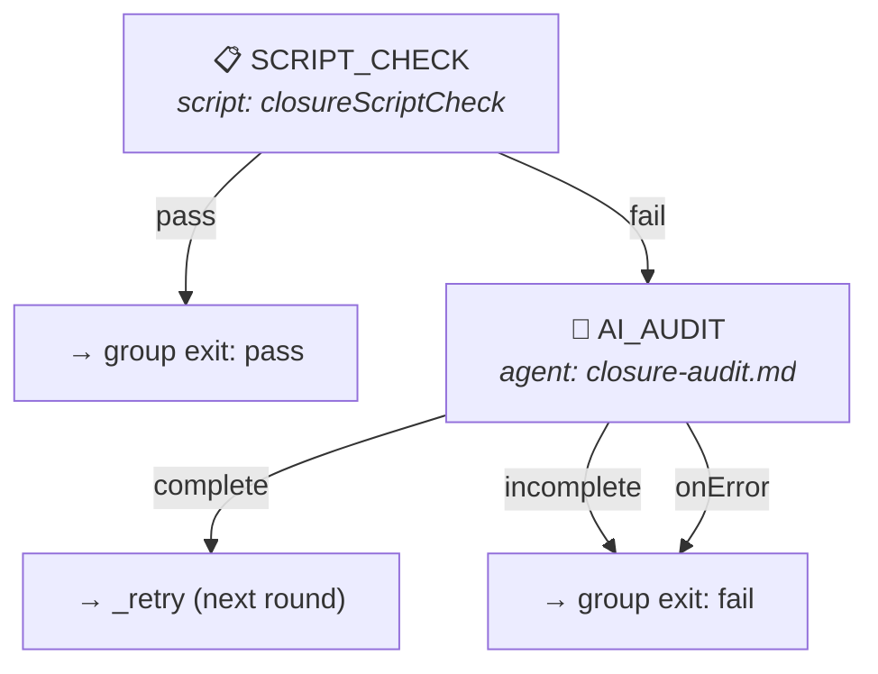
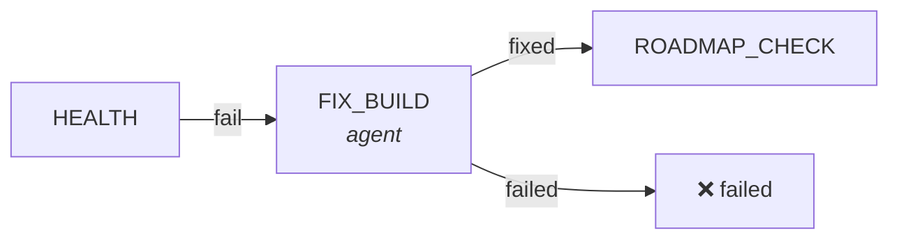
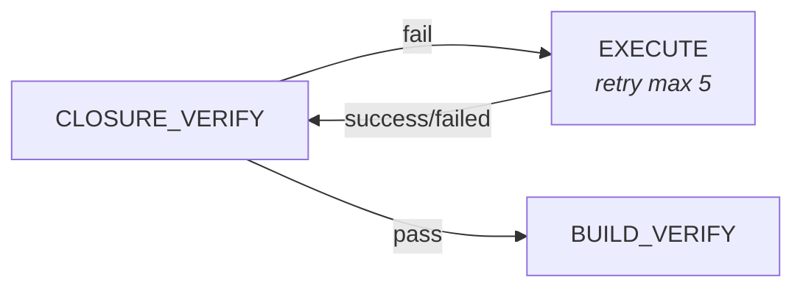

# Goal Driver Flow Engine Design

> Status: v7
> Last Reviewed: 2026-06-10
> Changes: Step executor encapsulation — each step type internally resolves its own marker and vars, engine only consumes StepResult
> Source: ai-dev/tools/opencode-goal-driver (src/ only)

## 1. Motivation

Refactor hardcoded workflow into a declarative Flow DSL + generic engine. Core principles:

1. **Engine has no business logic** — engine only does "execute step → read StepResult → lookup transition"
2. **Step executor encapsulation** — each step type internally resolves its own marker and vars; the engine never does type-specific extraction
3. **Unified return format** — every step type returns `StepResult { marker, text?, vars?, ok }`; the engine consumes this single format
4. **Result-driven transitions** — `result.marker` is looked up in transitions table to decide next step
5. **Unified fault tolerance** — each step has independent retry/degradation config

**Rejected alternative**: Engine has a `resolveMarker()` that does type-specific extraction (e.g. "if tool → check ok, if agent → parse XML, if script → read return value"). This couples the engine to step internals and makes adding new step types error-prone.

## 2. Core Concepts

### 2.1 Flow

A Flow is a **finite state machine** composed of Steps connected by Transitions.

```javascript
const flow = {
  name: "goal-driver",
  entry: "FIX_TESTS",
  maxTotalSteps: 120,
  maxCycleVisits: 20,
  steps: { /* ... */ },
};
```

### 2.2 Step

Each Step is an atomic work unit. Five types:

| Type | Execution | Internally resolves marker from |
|------|-----------|-------------------------------|
| `script` | Execute JS function | Function return value |
| `tool` | Execute bash command | Process exit code (0→pass, ≠0→fail) |
| `agent` | Spawn `opencode run` subprocess | `<resultTag>` XML in AI output + fallback chain |
| `group` | Execute sub-steps in a retry loop | Sub-step exit marker or `onExhausted` |
| `subflow` | Spawn child FlowEngine | Child engine completion status |

Step definition:

```typescript
interface Step {
  name: string;
  type: "script" | "tool" | "agent" | "group" | "subflow";

  // === Execution config ===
  run?: string | ((delegates, args?) => string | StepResult);
  command?: string;
  prompt?: string;
  promptFile?: string;
  resultTag?: string;
  system?: string;

  // === Group config (type=group only) ===
  maxRounds?: number;
  onExhausted?: string;
  steps?: Record<string, Step>;

  // === Subflow config (type=subflow only) ===
  flow?: string;
  forEach?: string;
  flowArgs?: Record<string, string>;
  onItemError?: { stopOnError?: boolean };

  // === Transitions ===
  transitions: Record<string, Action>;

  // === Fault tolerance ===
  maxRetries?: number;
  onError?: Action;
  onUnknown?: Action;
  onUnknownMaxRetries?: number;
  onMaxRetries?: Action;
}
```

### 2.3 StepResult (unified return format)

Every step executor MUST produce a result in this format:

```typescript
interface StepResult {
  marker: string | null;               // null = step could not determine marker → engine fires onUnknown
  text?: string;                       // Optional. Raw output for append/context.
  vars?: Record<string, string>;       // Optional. Variables to merge into flowVars.
  ok: boolean;                         // true = normal, false = subprocess killed / fatal
}
```

**Contract between step executor and engine:**

1. `marker` — a string for normal routing, or `null` if the step cannot determine a marker (engine fires `onUnknown`).
2. `vars` — key-value pairs to merge into flowVars. Omit or empty object if no variables.
3. `ok` — `true` for normal completion. `false` signals a fatal error (subprocess killed). The engine uses `ok=false` solely for error detection (triggering `onError`), never for transition routing.
4. `text` — raw output text, used by the engine for `append` context propagation.

**How each step type internally produces StepResult:**

#### script executor

The function returns either a plain string (marker) or a `StepResult` object:

```
function returns string        → { marker: returnValue, ok: true, vars: {} }
function returns { marker, vars } → { marker, vars, ok: true }
function throws                → caught by engine, triggers onError
```

#### tool executor

Runs command via child process. Internally maps exit code to marker:

```
exit 0   → { marker: "pass", ok: true, vars: {}, text: "" }
exit ≠0  → { marker: "fail", ok: true, vars: {}, text: "" }
           (fail is a normal transition, NOT an error)
spawn error → { marker: "fail", ok: false }
```

Note: tool `fail` on non-zero exit has `ok=true` because non-zero exit is a normal business outcome (e.g. build failed). Only spawn failures (process could not start) set `ok=false`.

#### agent executor

The most complex executor. Internally runs a multi-stage extraction chain:

```
1. Spawn opencode run subprocess → get AI output text
2. Parse <FLOW_VARS> from text → extract vars
3. Parse <resultTag> from text → extract marker
   → if not found → spawn parse agent (same session) → retry extraction
   → if still not found → return { marker: null, ok: true, vars, text }
4. Return { marker, vars, ok, text }
```

Marker correction (session-based retry) is entirely internal to the agent executor. The engine never participates in this process.

#### group executor

Runs sub-steps in a bounded loop:

```
for round = 1..maxRounds:
  currentSub = first sub-step
  loop:
    subResult = executeSubStep(currentSub)   // recursive: sub-steps also return StepResult
    transition = subDef.transitions[subResult.marker]

    if transition.exit → return { marker: exitValue, text: subResult.text, vars: subResult.vars }
    if transition.goto == "_retry" → break (start next round)
    if transition.goto → move to that sub-step, continue inner loop

return { marker: onExhausted, text: "", vars: {}, ok: true }
```

Sub-steps within a group follow the exact same StepResult contract. Variable propagation: the group aggregates vars from all sub-steps executed in the current round (last write wins per key).

#### subflow executor

Spawns a child `FlowEngine`:

```
Single mode:  child completed → { marker: "complete", vars: childFlowVars }
              child failed    → { marker: "failed", vars: childFlowVars }

forEach mode: all succeeded   → { marker: "all_complete" }
              some failed     → { marker: "some_failed" }
              all failed      → { marker: "all_failed" }
              empty list      → { marker: "all_complete" }

vars always propagated from child engine's flowVars.
```

### 2.4 flowVars (engine-level variable environment)

The engine maintains a shared `flowVars` Map. After every step execution, the engine merges `result.vars` into flowVars:

```
result = executeStep(...)
for (k, v) in result.vars: flowVars[k] = v
```

Variables are flow-scoped: once set, they persist until overwritten or the flow ends.

**Template substitution** — `flowVars` takes precedence over static `delegates.vars`:

```
Priority: flowVars (dynamic) > delegates.vars (static) > literal {{VAR}} retained
```

### 2.5 Action

Action describes "what to do next":

```typescript
type Action =
  | { goto: string }
  | { goto: string; append: AppendSpec }
  | { done: string }
  | { retry: string; maxRetries?: number; append?: AppendSpec }
```

**goto vs retry**:

| | goto | retry |
|---|---|---|
| Target step counting | +1 visit | +1 retry (independent of visit count) |
| Context append | Per append spec | Per append spec, feedback **accumulates** |
| Overflow handling | maxCycleVisits → terminate | maxRetries → onMaxRetries |
| Prompt assembly | Original prompt + append | Original prompt + all accumulated append |

**retry fallback chain**: `transition.maxRetries` → `stepDef.maxRetries` → `3` (default).

### 2.6 Template Variables

`{{variable}}` in prompts and commands are resolved at runtime from two sources:

| Priority | Source | Set by |
|----------|--------|--------|
| 1 (highest) | `flowVars` (dynamic) | Any step's `StepResult.vars` |
| 2 (base) | `delegates.vars` (static) | `main.js` at startup |

Unresolved variables are kept as literal text for the AI to interpret.

### 2.7 AppendSpec

```typescript
type AppendSpec =
  | true
  | string
  | { template: string }
  | { extract: string; template: string }
```

### 2.8 Subflow Execution

Subflow steps spawn a child `FlowEngine` that runs a separate flow definition loaded from the filesystem.

**Single execution** (`forEach` not set):
- `delegates.loadSubFlow(flowName)` reads `<subflowDir>/{name}.json`
- Child engine receives resolved `flowArgs` as `delegates.vars` (merged with parent vars)
- Child `completed` → marker `complete`; any other status → marker `failed`
- Child `flowVars` propagated back as `result.vars`

**forEach mode** (`forEach: "varName"`):
- Resolves `varName` from parent context (JSON array or comma-separated string)
- Runs child subflow once per item, with `forEachItem`, `forEachIndex`, `forEachTotal` injected
- Aggregated markers:

| All children | Some failed | All failed |
|-------------|-------------|------------|
| `all_complete` | `some_failed` | `all_failed` |

- Empty list → `all_complete`
- `onItemError: { stopOnError: true }` stops on first failure

**File loading**: `loadSubFlow` reads from `delegates.config.subflowDir` (default: `flows/` relative to tool root).

```json
{
  "type": "subflow",
  "flow": "commit-flow",
  "flowArgs": {
    "planFile": "{{PLAN_FILE}}",
    "module": "{{module}}"
  },
  "transitions": {
    "complete": { "goto": "NEXT" },
    "failed": { "goto": "HANDLE_FAILURE" }
  }
}
```

## 3. Fault Tolerance

### 3.1 Error Classification

| Error type | Trigger | Handling |
|-----------|---------|---------|
| **subprocess killed** | `result.ok === false` | `onError` action |
| **execution exception** | try/catch in engine loop | `onError` action |
| **marker is null** | Step executor could not determine marker | `onUnknown` action |
| **marker not in transitions** | Unexpected marker value | Engine tries case-insensitive match → `onUnknown` |
| **retry exhausted** | retry count > maxRetries | `onMaxRetries` action |
| **too many cycles** | visit count > maxCycleVisits | Return `max_cycles` |
| **too many steps** | totalSteps > maxTotalSteps | Return `max_total_steps` |

### 3.2 ok=true vs ok=false

| Step type | `ok=true` | `ok=false` |
|----------|-----------|------------|
| tool | Any exit code (both pass and fail are normal markers) | Spawn error → engine fires onError |
| script | Function returns normally | Function throws → engine fires onError |
| agent | Subprocess exited normally | Subprocess was killed → engine fires onError |
| group | Always true (sub-step errors produce markers, not ok=false) | Never |
| subflow | Always true (child failure is a normal marker) | Never |

**Key rule**: `ok=false` is ONLY used for error detection (triggering onError). It is NEVER used for transition routing. Only `marker` drives transitions.

### 3.3 Retry Mechanism

```
Step executes → marker hits retry action
  → compute retryKey = "fromStep→targetStep"
  → retryCount++
  → if > maxRetries → execute onMaxRetries
  → else → append feedback to target step's appendBuffer → goto target step
```

**Prompt assembly on retry**:

```
[Original prompt]
                              ← 1st append (if 2nd+ retry)
──────────────               ← separator (inserted on 2nd+ retry)
[2nd append]                 ← newly appended feedback
```

## 4. Engine Execution Loop

The engine is intentionally thin — it only consumes StepResult and follows transitions.

```
function run(entry):
  currentStep = entry || flow.entry

  while totalSteps < maxTotalSteps:
    stepDef = flow.steps[currentStep]
    if !stepDef → return "unknown_step"

    visitCount[currentStep]++
    if visitCount > maxCycleVisits → return "max_cycles"
    totalSteps++

    try:
      result = executeStep(currentStep, stepDef)
      // Step executor internally resolves marker and vars.
      // Engine receives a complete StepResult.
    catch:
      → execute onError action

    // 1. Merge variables
    if result.vars:
      for (k, v) in result.vars: flowVars[k] = v

    context[currentStep] = result

    // 2. Error detection (uniform for all types)
    if result.ok == false:
      → execute onError action

    // 3. Marker normalization (thin layer, not type-specific extraction)
    marker = result.marker
    if !marker → execute onUnknown action

    // 4. Transition lookup with case-insensitive fallback
    transition = stepDef.transitions[marker]
           || stepDef.transitions[marker.toLowerCase()]
    if !transition → execute onUnknown action

    // 5. Follow transition
    if transition.done → return transition.done
    if transition.retry → handleRetry(transition) → goto target
    if transition.goto → handleGoto(transition) → goto target
```

**Key difference from v5**: No `resolveMarker()`. The engine reads `result.marker` directly. All type-specific extraction (XML parsing, exit code mapping, etc.) is inside each step executor.

## 5. File Organization

```
ai-dev/tools/opencode-goal-driver/
├── src/
│   ├── main.js                    # CLI entry: parse args, create flow + runner, start engine
│   ├── config.js                  # Config: module directory discovery
│   ├── engine.js                  # Generic FSM executor — consumes StepResult only
│   ├── executor.js                # Process spawn + fd redirect + watchdog
│   ├── runner.js                  # opencode CLI wrapper (real execution + mock/dry-run mode)
│   ├── flow-loader.js             # Load flow JSON + prompts + script registry
│   └── prompts.js                 # Test-only: mock step configs
├── prompts/                       # Prompt files (loaded at runtime by flow-loader)
│   ├── fix-build.md
│   ├── roadmap-check.md
│   ├── plan-draft.md
│   ├── plan-audit.md
│   ├── execute.md
│   ├── closure-audit.md
│   ├── build-verify.md
│   ├── deep-audit.md
│   └── adversarial-review.md
├── flows/
│   └── goal-driver.json           # Main flow definition (DSL)
├── test/
│   └── engine.test.js
└── package.json
```

### Responsibility Matrix

| File | Responsibility | Knows about step types? |
|------|---------------|------------------------|
| engine.js | Generic FSM executor: dispatch by type, consume StepResult, lookup transitions | Minimal (dispatches to type-specific executor, but does not interpret results) |
| flow-loader.js | Load flow JSON + prompt files + script functions | Yes (script registry) |
| goal-driver.json | Flow definition | Yes (business logic) |
| runner.js | opencode CLI wrapper + mock mode | No |
| executor.js | Process spawn + fd redirect + watchdog | No |
| config.js | Parameter parsing + module discovery | No |
| main.js | Glue code | No |

## 6. Flow Diagram

The actual flow definition is the authoritative source: `ai-dev/tools/opencode-goal-driver/flows/goal-driver.json`.



### 6.1 CLOSURE_VERIFY Sub-flow (group step)



### 6.2 Error Recovery

**Build fix → retry**:


**Closure audit → retry execution**:


## 7. Script Functions

| Function | File | Returns |
|----------|------|---------|
| `detectStartPhase(delegates)` | flow-loader.js | `"execute"` / `"roadmap"` / `"plan"` / `"audit"` (marker) |
| `closureScriptCheck(delegates)` | flow-loader.js | `"pass"` / `"fail"` (marker) |

## 8. Session Strategy

### 8.1 Design Decision: Independent Sessions by Default

Each agent step spawns an **independent `opencode run` session**. The engine does NOT carry a session ID from one step to the next.

**Decision reason**:

 1. **Context is passed via template variables, not conversation history.** The engine already has a complete context-passing mechanism (flowVars, append buffers). Every downstream step receives all necessary information through its prompt.
2. **Each step has a clearly defined role.** `FIX_TESTS` does not need to see `ROADMAP_CHECK`'s dialogue history.
3. **Avoids cross-step contamination.** Shared sessions risk the agent referencing stale or irrelevant context.
4. **Predictable token usage.** Independent sessions guarantee each step starts from a clean context window.

**Rejected alternative**: Shared session across the entire flow. Would require managing conversation compaction, risk context window overflow, and add tight coupling between steps.

### 8.2 Exception: Session Reuse Inside Agent Executor

When the agent executor's internal marker extraction fails (no valid `<resultTag>` in output), it may perform marker correction — re-prompting the same session to get a valid marker. This is entirely internal to the agent executor.

```
agent executor internally:
  1. Parse AI output → no valid marker found
  2. Re-prompt same session with correction request (up to onUnknownMaxRetries times)
  3. If corrected → return StepResult with corrected marker
  4. If still invalid → return StepResult with marker=null → engine fires onUnknown
```

### 8.3 Session Lifecycle Summary

| Scenario | Session | Rationale |
|----------|---------|-----------|
| Normal agent step | **New** (sessionId=null) | Context via template vars |
| Marker correction (inside executor) | **Reuse** (same session) | Agent sees its own output |
| Subprocess killed → onError | **New** | Previous session is from a dead process |

## 9. Module Compatibility

Engine uses `config.js` `findModuleDir()` for module directory discovery:

- Top-level module (e.g., `nop-stream`): `{projectRoot}/nop-stream/`
- Nested module (e.g., `nop-ai-agent`): `{projectRoot}/nop-ai/nop-ai-agent/` (searches one level of subdirectories)
- Manual override: `--module-dir nop-ai/nop-ai-agent`

Maven `-pl` uses artifactId (e.g., `nop-ai-agent`), Maven reactor resolves nested modules.
