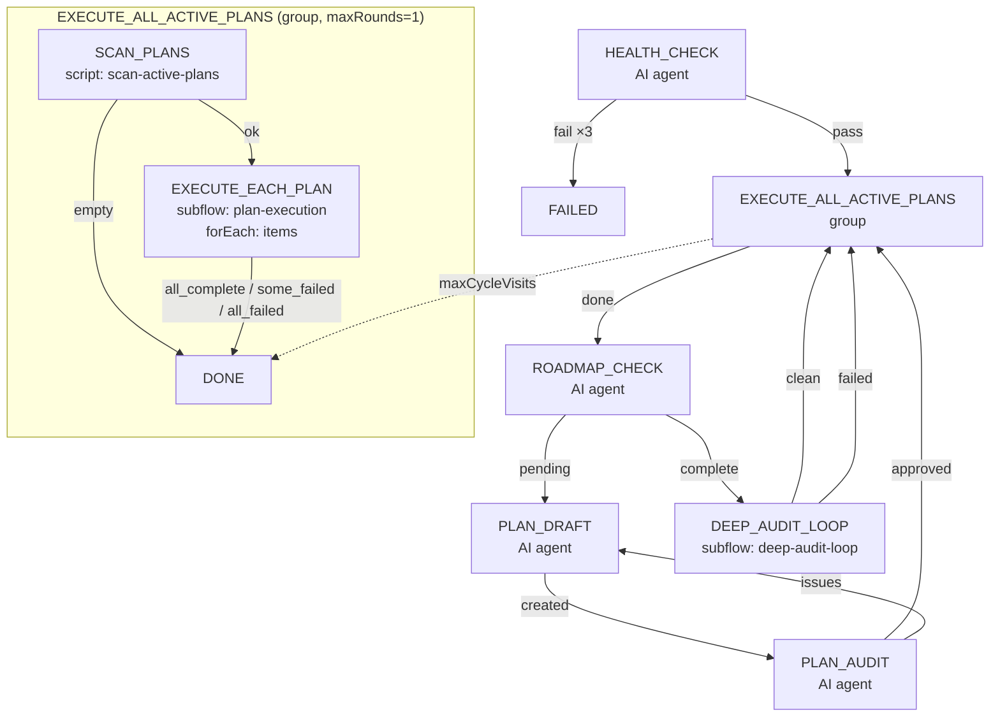
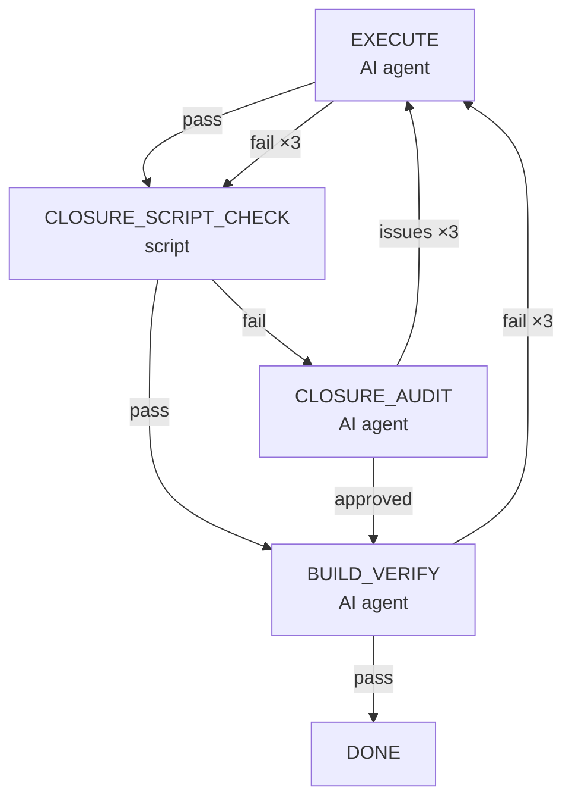
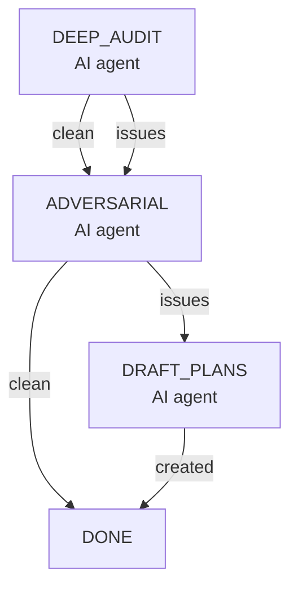

# Goal Driver 流程设计

**日期**：2026-06-15（v3 堆栈嵌套重构，v4 移除 execute-all-active-plans 子流程改用 group + forEach）
**范围**：`flows/goal-driver.json`，子流程 `flows/plan-execution.json`、`flows/deep-audit-loop.json`
**状态**：active
**取代**：v3 `execute-all-active-plans` 子流程 + `plan-router` 脚本

---

## 一、设计结论

1. **堆栈嵌套流程**：主流程 + 两个可复用子流程（`plan-execution`、`deep-audit-loop`），替代 v3 的 `execute-all-active-plans` 子流程
2. **AI 修复前置**：`HEALTH_CHECK` 是 AI agent 步骤，可在编译失败时自动诊断修复，**支持无上下文重试**（每次 fresh session）
3. **EXECUTE_ALL_ACTIVE_PLANS 用 group + forEach**：`scan-active-plans` 脚本扫描所有活跃计划写入 `items`，`EXECUTE_EACH_PLAN` 用 `forEach` 对每个计划执行 `plan-execution` 子流程。不循环——主流程从 `ROADMAP_CHECK` 或 `DEEP_AUDIT_LOOP` 返回后重新扫描
4. **深度审计流程**：`deep-audit-loop` 子流程三步骤（DEEP_AUDIT → ADVERSARIAL → DRAFT_PLANS），在子流程内完成审计和计划创建，不包含执行（执行由主流程的 `EXECUTE_ALL_ACTIVE_PLANS` 处理）
5. **Plan Draft 单输出**：`PLAN_DRAFT` 只输出 `created`+PLAN_FILE，移除 `none`/`revised` 两个易混淆的分支
6. **深度审计出口**：`DEEP_AUDIT_LOOP` `clean` → `EXECUTE_ALL_ACTIVE_PLANS`（审计可能创建新计划，需要重新执行）
7. **子流程 marker 透传**：子流程返回内部最后一步的实际 marker，而非硬编码 `"complete"`/`"failed"`
8. **容错兜底路由到 EXECUTE_ALL_ACTIVE_PLANS**：所有子流程和 agent 步骤的意外失败都回到计划执行，不中断整体循环

---

## 二、背景与动机

旧流程的问题：

| 问题 | 影响 |
|------|------|
| `DETECT_START` 所有 transition 都指向 `HEALTH_CHECK` | 白跑一个子进程，结果不用 |
| `HEALTH_CHECK` 是 tool step（只跑 `mvnw`） | 编译失败只能转 `FIX_BUILD`，不能自愈 |
| `FIX_BUILD` 没有 retry 循环 | 修复失败一次就结束 |
| 无活跃 plan 检测 | 整个流程一次只处理一个 plan，没有"先处理所有活跃 plan"的逻辑 |
| `DEEP_AUDIT` 只有单步 | 审计完发现问题 → 拟制计划 → 执行 → 没有再审计，不能确保所有问题都被处理 |

v2 引入了子流程和 PLAN_ROUTER，但 PLAN_ROUTER 的 goto 跳转导致："执行一个计划 → 跳回路由 → 再跳转"的乒乓语义，不符合"把所有计划执行完再说"的直觉。

v3 改用了堆栈嵌套：`EXECUTE_ALL_ACTIVE_PLANS` 是一个自包含的循环步骤，执行时遍历所有活跃计划逐个调用 `plan-execution` 子流程，执行完毕才返回。这类似于函数调用堆栈——"push 执行帧，pop 执行帧"。

---

## 三、顶层流程



### 步骤说明

**HEALTH_CHECK**（`prompts/health-check.md`）
- AI agent 步骤，运行 `mvnw clean install`，失败时 AI 自行诊断并修复
- `fail` transition 配置了 `retry: HEALTH_CHECK, maxRetries: 3`，无 append buffer，因此每次重试是**空上下文 + 新 session**
- 仍失败时通过 `onMaxRetries` 结束

**EXECUTE_ALL_ACTIVE_PLANS**（`type: "group"`，`maxRounds: 1`）
- 内部两步：`SCAN_PLANS`（`scan-active-plans` 脚本）→ `EXECUTE_EACH_PLAN`（`forEach: "items"`）
- `SCAN_PLANS` 扫描 `ai-dev/plans/`，找到所有活跃 plan 路径的 JSON 数组写入 `flowVars.items`
- 无活跃计划 → `exit: "done"`，跳过执行
- 有活跃计划 → `EXECUTE_EACH_PLAN` 用 `forEach` 对每个 item 执行 `plan-execution` 子流程
- 每个 item 通过 `flowArgs: { PLAN_FILE: "{{forEachItem}}" }` 传入子流程（模板变量在每次迭代中 resolve）
- 不循环——主流程从 `ROADMAP_CHECK` 创建的 plan 或 `DEEP_AUDIT_LOOP` 创建的计划返回后重新扫描
- 见 §四

**ROADMAP_CHECK** → **PLAN_DRAFT** → **PLAN_AUDIT** → **EXECUTE_ALL_ACTIVE_PLANS**
- 标准 roadmap → 拟制 → 审计 → 执行链路
- `PLAN_DRAFT` 始终输出 `created`（不再有 `none`/`revised` 分支）
- `PLAN_AUDIT` 的 `issues` 会回退到 `PLAN_DRAFT` 并追加 REVISION REQUEST
  - 重试时 agent 编辑已有 plan 文件，输出 `created`（不含 FLOW_VARS）
- 审计通过后回到 `EXECUTE_ALL_ACTIVE_PLANS`，新创建的计划将被发现并执行
- 审计超过 `maxRetries` 退回到 `EXECUTE_ALL_ACTIVE_PLANS`（降级执行）

**DEEP_AUDIT_LOOP**（子流程 `deep-audit-loop.json`）
- 见 §六

**退出机制**
- `EXECUTE_ALL_ACTIVE_PLANS` `done` → `ROADMAP_CHECK` `complete` → `DEEP_AUDIT_LOOP` `clean` → `EXECUTE_ALL_ACTIVE_PLANS` → ...
- 引擎的 `maxCycleVisits`（默认 30）或 `maxTotalSteps`（默认 500）触发自然终止
- 当所有活跃计划执行完毕、roadmap 无待办、深度审计无新问题时，循环空转直到 `maxCycleVisits`
- `EXECUTE_ALL_ACTIVE_PLANS` 是 group（`maxRounds: 1`），没有内部循环——重新扫描靠主流程从 `ROADMAP_CHECK`/`DEEP_AUDIT_LOOP` 返回

---

## 四、SCAN_PLANS + forEach 模式

`EXECUTE_ALL_ACTIVE_PLANS` 是一个 `type: "group"` 步骤（`maxRounds: 1`），内部包含两个子步骤：

### SCAN_PLANS（`scan-active-plans` 脚本）

```javascript
function scanActivePlans(delegates, flowVars) {
  // 扫描 ai-dev/plans/ 下所有非 00- 开头的 .md 文件
  // 提取 Plan Status: 状态，收集所有 active/planned/in progress 的计划
  // 将 JSON 数组 ['path1.md', 'path2.md', ...] 写入 flowVars.items
  // 返回 "ok"（有活跃计划）或 "empty"（无）
}
```

### EXECUTE_EACH_PLAN（forEach subflow）

```json
{
  "type": "subflow",
  "flow": "plan-execution",
  "forEach": "items",
  "flowArgs": { "PLAN_FILE": "{{forEachItem}}" }
}
```

### 流程

1. `SCAN_PLANS` 扫描并设置 `flowVars.items` → 返回 `ok`（有 plan）或 `empty`（无）
2. `ok` → `EXECUTE_EACH_PLAN` 遍历 `items`，每个 item 调用一次 `plan-execution` 子流程
3. `forEachItem` 通过 `flowArgs` 映射到 `PLAN_FILE`（引擎在每次迭代中 resolve 模板变量，确保 `{{forEachItem}}` 正确展开）
4. `EXECUTE_EACH_PLAN` 返回 `all_complete`/`some_failed`/`all_failed` → 组退出 `done`
5. `empty` → 组直接退出 `done`

### 为什么要改（v3 → v4）

| v3（`execute-all-active-plans` 子流程） | v4（group + forEach） |
|----|----|
| `PLAN_ROUTER` 脚本一次只返回一个 plan（goto 跳转形成内部循环） | `SCAN_PLANS` 脚本一次返回所有 plan（forEach 一次执行） |
| 子流程内部循环——`PLAN_ROUTER` ↔ `EXECUTE_PLAN` 来回跳转 | 无内部循环——主流程从 `ROADMAP_CHECK`/`DEEP_AUDIT_LOOP` 返回后重新扫描 |
| 需要单独的 `execute-all-active-plans.json` 子流程 | 直接在主流程用 group 内联 |
| `plan-router` 脚本只设置 `PLAN_FILE`（单计划） | `scan-active-plans` 脚本设置 `items`（多计划 JSON 数组） |
| `flowArgs` 对 `forEachItem` 的模板变量 resolve 在循环外（`{{forEachItem}}` 不展开） | 引擎修复：`flowArgs` 在每次 forEach 迭代中 resolve 模板变量 |

---

## 五、plan-execution 子流程



### 步骤说明

**EXECUTE**（`prompts/execute.md`）
- AI 执行 plan 文件的每个 Phase（从第一个 `- [ ]` 开始到最后一个 Phase 全部 `[x]`）
- 每完成一个 Phase 跑 `mvnw test` 确认测试通过
- 完成后更新 plan 的 `Plan Status: completed` + roadmap 对应 item 从 ❌ 改为 ✅
- 返回 `success`（alias → `pass`）或 `failed`

**CLOSURE_SCRIPT_CHECK**（`closureScriptCheck` 脚本函数）
- 调用 `check-plan-checklist.mjs` 的 `inspectPlan()` 检查：
  - 所有 checklist 项目是否已勾选 `[x]`
  - 状态一致性（Status completed 且有 Closure evidence）
- **pass → BUILD_VERIFY**：机械检查通过，跳过 AI audit（AI audit 的核心价值是失败时诊断修复，通过时无需冗余确认）
- **fail → CLOSURE_AUDIT**：脚本发现不合规项，AI 介入诊断修复

**CLOSURE_AUDIT**（`prompts/closure-audit.md`）
- AI 驱动的关闭审计（仅在 script check 失败时进入）：
  - 按 plan guide 严格修复（强制段名、字段名、Phase 格式）
  - 修复后返回 `approved` → BUILD_VERIFY
  - 无法修复则返回 `issues` → 重试 EXECUTE，带审计反馈追加

**BUILD_VERIFY**（`prompts/build-verify.md`）
- 运行 `mvnw clean install` 确认编译通过
- 失败时诊断修复并重试
- 返回 `pass` → 子流程完成
- 返回 `fail` → 重试 EXECUTE（带构建错误信息）

### 重试策略

| 步骤 | 失败后 | 最大重试 |
|------|--------|---------|
| EXECUTE | retry EXECUTE | 3 次 |
| CLOSURE_AUDIT issues | retry EXECUTE | 3 次（带审计反馈） |
| BUILD_VERIFY | retry EXECUTE | 3 次（带构建错误） |
| CLOSURE_AUDIT onMaxRetries | goto BUILD_VERIFY | — |

---

## 六、deep-audit-loop 子流程



### 循环原理

1. **DEEP_AUDIT**：执行深度审计，发现 P0/P1 问题。无论 `clean`/`issues` 都进入 ADVERSARIAL
2. **ADVERSARIAL**：对抗性审查，验证审计发现的可靠性：
   - `clean` → 子流程完成（审计 + 对抗均无问题）
   - `issues` → 进入 DRAFT_PLANS，制定修复计划
3. **DRAFT_PLANS**：一次创建 1-3 个计划，通过子 agent 审查质量
4. 计划创建后子流程完成，返回 `clean`（主流程的 `EXECUTE_ALL_ACTIVE_PLANS` 会拾取新计划执行）
5. 不在子流程内循环——审计闭环由主流程的 `EXECUTE_ALL_ACTIVE_PLANS` 循环保证（执行完审计创建的计划后，再回到 DEEP_AUDIT_LOOP 重新审计）

### 为什么这样设计

- **ADVERSARIAL 始终执行**：即使 DEEP_AUDIT 返回 `clean`，也经过对抗审查确保没有遗漏。对抗审查发现的问题可能触发计划创建
- **DRAFT_PLANS 可创建多个计划**：一次审计可能发现多个独立问题，拆分为多个 plan 分别执行
- **不在子流程内执行**：执行交给外部循环复用 `plan-execution` 子流程，避免逻辑重复

---

## 七、子流程 marker 传播规则

子流程步骤（`type: "subflow"`）的结果处理采用**透明透传**——子流程返回内部最后一步的实际 marker。

### 对流程的影响

| 步骤类型 | 返回 marker | 消费步骤 |
|---------|------------|---------|
| `EXECUTE_ALL_ACTIVE_PLANS` (group) | `"done"`（SCAN_PLANS 无活跃 plan 或执行完毕） | 主流程 → `ROADMAP_CHECK` |
| `plan-execution` (subflow) | `"pass"`（BUILD_VERIFY 通过时） | `EXECUTE_EACH_PLAN` (forEach) |
| `plan-execution` (subflow) | `"failed"`（BUILD_VERIFY 或 EXECUTE 超限） | `EXECUTE_EACH_PLAN` (forEach) |
| `deep-audit-loop` (subflow) | `"clean"`（ADVERSARIAL 通过时） | `DEEP_AUDIT_LOOP` |
| `deep-audit-loop` (subflow) | `"failed"`（onError 时） | `DEEP_AUDIT_LOOP` |

---

## 八、容错设计

### AI 输出意外 marker 时的恢复链

| 层级 | 机制 | 效果 |
|------|------|------|
| **markerAliases** | `none→created`、`revised→created` 等别名映射 | 旧版 marker 或常见变体被自动归一化 |
| **修正重试** | `onUnknownMaxRetries: 2`，用系统 prompt 要求 AI 输出合法值 | 全新 marker 值经重试得到纠正 |
| **子流程失败传导** | 子流程内部 `no_transition` → 子流程 `failed` → 父 transition `failed→EXECUTE_ALL_ACTIVE_PLANS` | 子流程内任何步骤的意外输出不会卡死；父流程路由到计划执行循环继续 |
| **onError 兜底** | 对 agent/subprocess 被杀（`ok:false`），指向 `EXECUTE_ALL_ACTIVE_PLANS` | 进程级故障也能恢复 |

### 子流程故障传播示例

```
DRAFT_PLAN (deep-audit-loop 子流程内)
  → AI 输出 "none" (已移除的旧 marker)
  → markerAliases: none → created ✅ (若无 alias)
  → 修正重试 2 次仍失败 → no_transition
  → deep-audit-loop 子流程返回 status="no_transition"
  → 父步骤 DEEP_AUDIT_LOOP: marker="failed"
  → transition: failed → EXECUTE_ALL_ACTIVE_PLANS
  → 流程继续（无活跃 plan，回到 ROADMAP_CHECK）
```

### 子流程注意事项

- `EXECUTE_ALL_ACTIVE_PLANS` 是 `type: "group"`（内联步骤，无隔离 flowVars）；`EXECUTE_EACH_PLAN` 和 `DEEP_AUDIT_LOOP` 是 `type: "subflow"`
- group 内子步骤共享 main flow 的 `flowVars`，子流程的 `flowVars` 与父流程隔离（通过 `flowArgs`/`delegates.vars` 传入）
- `flowArgs` 中的 `{{forEachItem}}` 模板变量在引擎的每个 forEach 迭代中 resolve（v4 engine 修复）
- 子流程/group 内部任何步骤的 `onError`/`onUnknown` 失效不会直接导致父流程终止

---

## 九、拒绝了什么

| 替代方案 | 拒绝理由 |
|----------|---------|
| `HEALTH_CHECK` 继续用 tool step | AI 有诊断和修复能力，tool step 只跑 `mvnw` 无法自动修复 |
| `DEEP_AUDIT` 在主流程中直线排布 | 无法形成审计-执行-再审计的闭环 |
| `execute-all-active-plans` 子流程保持内部循环 | 子流程内 PLAN_ROUTER ↔ EXECUTE_PLAN 来回跳转，违背"堆栈嵌套"语义；改用 group + forEach 一次执行所有活跃计划，外部循环（ROADMAP_CHECK/DEEP_AUDIT_LOOP）负责重新扫描 |
| v2 `PLAN_ROUTER` goto 跳转 | PLAN_ROUTER 既要扫描 plan 又要决定 roadmap vs audit 路由，职责混杂；goto 跳转语义导致"执行一个计划 → 跳回路由 → 再跳转"的乒乓 |
| `plan-router` 脚本保持单计划扫描 | 改用 `scan-active-plans` 一次扫描所有活跃计划写入 `items`，配合 `forEach` 一次执行多条 |
| PLAN_DRAFT 保留 `none`/`revised` 分支 | AI 频繁选错分支导致计划被跳过；单输出 `created` 强制始终创建 plan |
| 把 `plan-execution` 逻辑内联到主流程 | 两个地方（EXECUTE_ALL_ACTIVE_PLANS + deep-audit-loop）都用到，抽成子流程避免重复 |

---

## 十、与已有设计的关系

- 本设计依赖 `flow-engine-design.md` 的 Step/Transition/Subflow/Group/forEach 机制
- 流程定义位于 `flows/goal-driver.json`，子流程位于 `flows/plan-execution.json`、`flows/deep-audit-loop.json`
- 脚本函数 `scanActivePlans`、`closureScriptCheck` 位于 `src/flow-loader.js`
- `flowArgs` 模板变量在 forEach 循环中每次迭代 resolve（`src/engine.js`）
