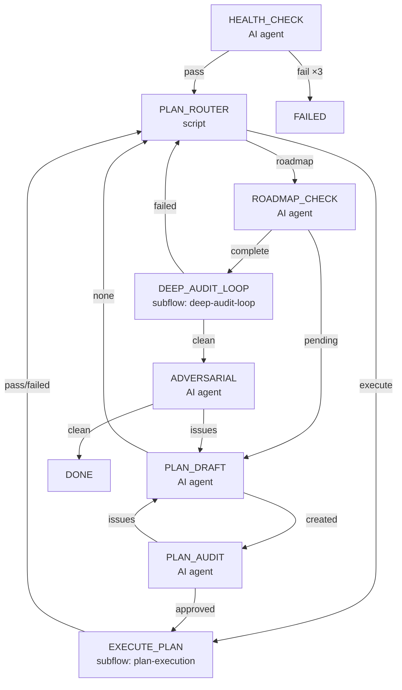
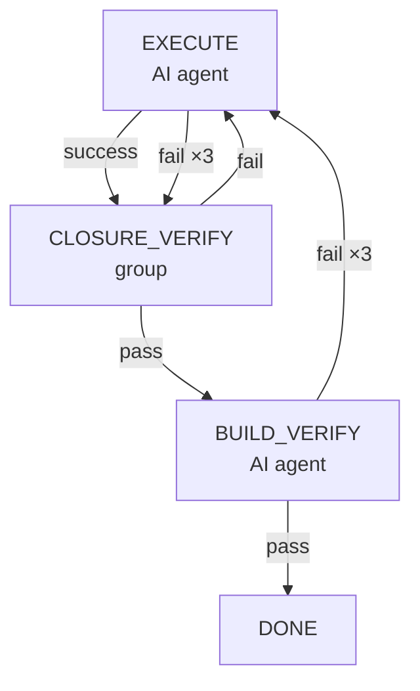
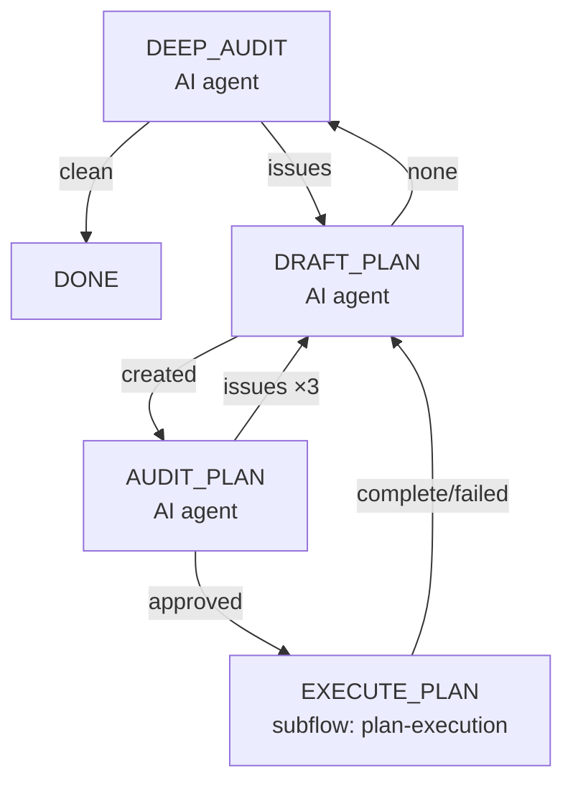

# Goal Driver 流程设计

**日期**：2026-06-11
**范围**：`ai-dev/tools/opencode-goal-driver/flows/goal-driver.json`，以及子流程 `flows/plan-execution.json`、`flows/deep-audit-loop.json`
**状态**：active
**取代**：旧版 `DETECT_START` → `HEALTH_CHECK` → `FIX_BUILD` → `ROADMAP_CHECK` → ... 扁平流程

---

## 一、设计结论

1. **树形流程**：主流程 + 可复用子流程（`plan-execution`、`deep-audit-loop`），替代旧的单层扁平步骤链
2. **AI 修复前置**：`HEALTH_CHECK` 是 AI agent 步骤，可在编译失败时自动诊断修复，**支持无上下文重试**（每次 fresh session）
3. **路由驱动**：`PLAN_ROUTER` 脚本扫描活跃 plan 并决定是继续执行还是转向 roadmap/深度审计
4. **深度审计循环**：`deep-audit-loop` 子流程内部自循环（审计 → 拟制多计划 → 逐个执行 → 再审计），直到 P0/P1 问题清空
5. **无死代码**：所有步骤的 transition 都有实际分支，不再有全部指向同一节点的伪路由
6. **子流程 marker 透传**：子流程返回内部最后一步的实际 marker，而非硬编码 `"complete"`/`"failed"`。父步骤的 transition 直接对原子流程的内部 marker（如 `"pass"`、`"clean"`）

---

## 二、背景与动机

旧流程的问题：

| 问题 | 影响 |
|------|------|
| `DETECT_START` 所有 transition 都指向 `HEALTH_CHECK` | 白跑一个子进程，结果不用 |
| `HEALTH_CHECK` 是 tool step（只跑 `mvnw`） | 编译失败只能转 `FIX_BUILD`，不能自愈 |
| `FIX_BUILD` 没有 retry 循环 | 修复失败一次就结束 |
| 无活跃 plan 检测 | 整个流程一次只处理一个 plan，没有"先处理所有活跃 plan"的逻辑 |
| `DEEP_AUDIT` 只有单步 | 审计完发现问题 → 拟制计划 → 执行 → 没有再审计，不能确保所有问题都被处理 |

新流程以"处理活跃 plan → roadmap → 深度审计"的优先级循环工作，每一步都可以失败重试。

---

## 三、顶层流程



### 步骤说明

**HEALTH_CHECK**（`prompts/health-check.md`）
- AI agent 步骤，运行 `mvnw clean install`，失败时 AI 自行诊断并修复
- `fail` transition 配置了 `retry: HEALTH_CHECK, maxRetries: 3`，无 append buffer，因此每次重试是**空上下文 + 新 session**
- 仍失败时通过 `onMaxRetries` 结束

**PLAN_ROUTER**（`planRouter` 脚本函数）
- 扫描 `ai-dev/plans/` 下 state 为 `in progress` / `active` / `planned` 的 plan 文件
- 找到第一个活跃 plan 时：将路径写入 `flowVars.PLAN_FILE`，返回 `execute`
- 无活跃 plan 时：返回 `roadmap`

**ROADMAP_CHECK** → **PLAN_DRAFT** → **PLAN_AUDIT** → **EXECUTE_PLAN**
- 标准 roadmap → 拟制 → 审计 → 执行链路
- `PLAN_AUDIT` 的 `issues` 会回退到 `PLAN_DRAFT` 并累积 feedback
- 执行完成后回到 `PLAN_ROUTER`，可能发现其他活跃 plan

**EXECUTE_PLAN**（子流程 `plan-execution.json`）
- 见 §四

**DEEP_AUDIT_LOOP**（子流程 `deep-audit-loop.json`）
- 见 §五

**ADVERSARIAL**
- 最终对抗性审查。发现 issues 时回到 `PLAN_DRAFT` 修复

---

## 四、plan-execution 子流程



### CLOSURE_VERIFY group 步骤

```
          ┌──────────────────┐
          │  SCRIPT_CHECK    │ ← inspectPlan(planFile) 直接 JS 调用
          │  (script)        │
          └──────┬───────────┘
      pass │     │ fail
           ▼     ▼
          ┌──────────────────┐
          │  AI_AUDIT        │ ← 独立的 AI 子代理
          │  (agent)         │
          └──────┬───────────┘
   complete │     │ incomplete
            ▼     ▼
        _retry   exit fail
```

- `SCRIPT_CHECK`：直接 import `check-plan-checklist.mjs` 的 `inspectPlan()` 函数，检查指定 plan 的 checklist 完整性（不再用 `--active-only` 子进程）
- `AI_AUDIT`：AI 驱动的 closure audit，支持多轮 fix-review 循环
- group 的 `maxRounds: 3`：SCRIPT_CHECK 失败时进入 AI_AUDIT，AI_AUDIT 返回 `complete` 时重试 SCRIPT_CHECK，最多 3 轮

### 重试策略

| 步骤 | 失败后 | 最大重试 |
|------|--------|---------|
| EXECUTE | retry EXECUTE | 3 次 |
| CLOSURE_VERIFY group | 回退到 EXECUTE | group 轮次 3 轮 |
| BUILD_VERIFY | retry EXECUTE | 3 次 |

---

## 五、deep-audit-loop 子流程



### 循环原理

1. **DEEP_AUDIT**：执行深度审计，发现 P0/P1 问题
2. **DRAFT_PLAN**：为审计发现的一个问题拟制 plan
   - 每次只创建一个 plan（由 `plan-draft.md` prompt 约束）
   - 创建成功后转入执行
   - 返回 `none` 时表示当前所有审计发现都已覆盖
3. **AUDIT_PLAN** → **EXECUTE_PLAN**：走标准 plan 审计和执行
4. **回到 DRAFT_PLAN**：尝试拟制下一个审计发现对应的 plan
5. 当所有审计发现都已拟制 plan 并执行后，**回到 DEEP_AUDIT**：重新审计（验证 fix 是否生效，以及是否发现新问题）
6. 直到 DEEP_AUDIT 返回 `clean` → 子流程完成

### 为什么这样设计

- **多次拟制**：一次审计可能发现多个问题，每个问题需要独立 plan。`DRAFT_PLAN` 的单次拟制 + 后续 loop 自然地处理了"一个问题一个 plan"的需求
- **审计闭环**：执行完所有 plan 后回到 DEEP_AUDIT，确保 fix 生效、且没有引入新问题
- **退路**：`DRAFT_PLAN` 返回 `none` 后回到 DEEP_AUDIT —— 即使某个问题无法拟制 plan（比如根本没代码修改方向），仍能给审计一次机会确认或发现新问题

---

## 六、拒绝了什么

| 替代方案 | 拒绝理由 |
|----------|---------|
| `HEALTH_CHECK` 继续用 tool step | AI 有诊断和修复能力，tool step 只跑 `mvnw` 无法自动修复 |
| `DEEP_AUDIT` 在主流程中直线排布 | 无法形成审计-执行-再审计的闭环 |
| 用一个 script 同时扫描所有 active plan 并 forEach 执行 | 一次只执行一个 plan（由 `PLAN_FILE` 指定），通过 `PLAN_ROUTER` 循环回到执行入口更简单可靠 |
| 把 `plan-execution` 逻辑内联到主流程 | 两个地方（主流程 + deep-audit-loop）都用到，抽成子流程避免重复 |
| `PLAN_ROUTER` 传给 `ROADMAP_CHECK` 的 `roadmap` 和 `audit` 分开 | `PLAN_ROUTER` 只区分"有活跃 plan → 执行"和"无 →  roadmap"，roadmap 完成后自然进入 audit，不需要第三个分支 |

---

## 六、子流程 marker 传播规则

子流程步骤（`type: "subflow"`）的结果处理有透明与封装两种设计选择。本系统采用**透明透传**：

| 设计方案 | 行为 | 选用理由 |
|----------|------|---------|
| **封装式** | 子流程总是返回 `"complete"`/`"failed"` | 接口清晰，但丢失内部信息 |
| **透明式 ✅** | 子流程返回内部最后一步的实际 marker（如 `"pass"`、`"clean"`） | 父步骤可感知具体结果 |

### 实现机制

1. `_result()` 新增 `marker` 字段（`{ status, marker, stepCount, ... }`）
2. `_executeSubflowStep()` 优先取用 `childResult.marker`，若为空则回退到 `"complete"`/`"failed"`（基于 child status）
3. `_result()` 在 `transition.done` 路径记录 `result.marker`，确保 marker 从最后一步传递到顶

### 对流程的影响

| 子流程 | 之前返回的 marker | 现在返回的 marker | 消费步骤 |
|--------|------------------|-------------------|---------|
| `plan-execution` | `"complete"` | `"pass"`（BUILD_VERIFY 成功时） | `EXECUTE_PLAN` |
| `deep-audit-loop` | `"complete"` | `"clean"`（DEEP_AUDIT 通过时） | `DEEP_AUDIT_LOOP` |

对应 flow JSON 的 transitions 已同步更新。

---

## 七、与已有设计的关系

- 本设计依赖 `flow-engine-design.md` 的 Step/Transition/Subflow 机制
- `SCRIPT_CHECK` 的实现见 `group-step-design.md`（group step 的轮次和子步骤机制）
- 流程定义位于 `flows/goal-driver.json`，子流程位于 `flows/plan-execution.json`、`flows/deep-audit-loop.json`
- 脚本函数 `planRouter`、`closureScriptCheck` 位于 `src/flow-loader.js`
