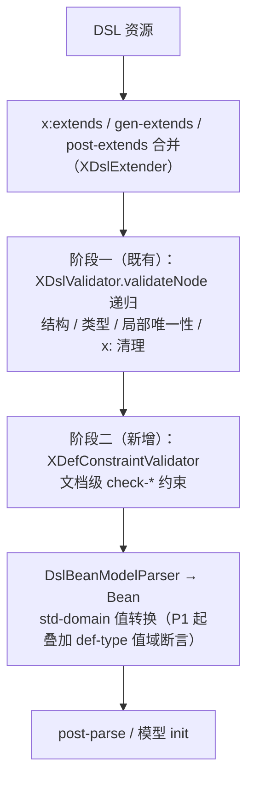

# XDef 描述式校验设计（声明式约束规则）

**日期**：2026-09-20
**范围**：`nop-kernel/nop-xlang`（xdef 解析 + XDslValidator 校验管线）、`nop-kernel/nop-xdefs`（`xdef.xdef` 元模型）
**状态**：草案——约束语法已在元模型中声明（2026-01/02 间提交 `bfe3301402`、`f2ba0e7896` 加入，`3f6aa07a92` 补齐 def-type 元模型声明并重新生成模型类），执行器未实现。本文档定义目标语义、对既有声明的修订以及落地收敛路径。

---

## 一、设计结论

1. **保留既有四类约束元素的语法骨架**（`xdef:check-unique` / `check-ref` / `check-mutex` / `check-require`）与 `xdef:def-type` 自定义类型声明，修订元模型四处：`check-ref` 增加 target 侧声明、`check-require` 补 `unique-attr="id"` 变为列表、`errorCode` 改为可选（缺省用平台默认错误码）、所有约束在 xdef 解析期做 fail-fast 静态校验。
2. **校验执行采用两阶段模型**：既有 `XDslValidator.validateNode` 递归（节点局部校验）之后，新增文档级约束校验阶段。阶段二实现在 **`XDslValidator.validate(XNode, IXDefNode, boolean)` 公有入口的尾部**——这是覆盖全部现存调用方（`DslNodeLoader`、`DslModelParser`、`AiCoderHelper`、`LocalFileOperator`、`ModelBasedPromptTemplate`）的唯一单点收敛；触发条件为 `defNode instanceof IXDefinition`。
3. **`select` 编译绑定 `XPathHelper.parseXSelector`**（静态 `LocalCache`，无初始化前置），不经 `XPathProvider.instance()`，不新造选择器语言。
4. **落地分期**：P0 打通解析与过渡报错、unique（document/siblings 两档 scope）与 mutex/require（无 scope 属性、天然文档级）、xdef.xdef 修订与 `_gen` 再生成链路；P1 承接 def-type 全量、check-ref、global 范围（仅 v-path 存在性）、空 key 修补、check-cardinality；P2 面向工具链（IDEA 标注、JSON Schema 导出、收集式报告）。
5. **声明式规则保持"只读断言"边界**：不带逻辑副作用；判据是"单值只读谓词"（可静态编译、无副作用、布尔结果）与"可执行标签体"（可产生结构变换）之间的分界。需要后者的复杂校验继续走既有 `x:post-parse` XPL 逃生舱。

## 二、背景与动机

### 2.1 已实现的校验能力

XDSL 实例按 xdef 校验的现行管线（加载 → 合并 → 校验 → 解析）中，以下校验真实执行：

| 校验 | 声明方式 | 执行点 |
|------|---------|--------|
| 结构合法性（标签/属性白名单、必填属性 `!` 前缀、mandatory 子节点、body 非空） | 节点声明 + 类型前缀 | `XDslValidator.validateNode`（`XDslValidator.java:85-173`） |
| 局部唯一性（unique-attr 同 tag 兄弟去重；key-attr 同父跨 tag 去重） | `xdef:unique-attr` / `xdef:key-attr` | `XDslValidator.checkUniqueOrKeyAttr`（`:342-408`） |
| delta 合并期校验（空 key 报错、重复 key、final 节点禁覆盖） | 同上 | `delta/ChildNodeMap.java:211-216`、`DeltaMerger` |
| 值域/格式（100+ std-domain、`enum:` 常量类、`dict:` 字典） | 属性类型声明 | `DslBeanModelParser.parseValue`（继承自 `DslXNodeToJsonTransformer.parseValue:397-422`）→ `IStdDomainHandler.parseProp` |
| 命名空间白名单 | `xdef:check-ns` | `XDslValidator.java:203-213, 256-264` |
| xdef 自身元模型合法性 | — | `XDefinitionParser.validateNode`（`:546-599`） |
| 任意逻辑（逃生舱） | `xdef:pre-parse` / `xdef:post-parse` / `x:post-parse` | `AbstractDslParser` |

### 2.2 已声明、从未执行的约束

约束语法在多个提交中陆续加入 `xdef.xdef` 并生成了模型类，**但没有任何执行器**。根因在解析侧：`XDefinitionParser.parseChildren` 跳过所有元模型名字空间的子元素（`XDefinitionParser.java:654-661`，内部 `checkTagNames` 校验被注释），只有 `pre-parse`/`post-parse`（`:210-218`）和 `define` 片段（`:671-684`）被单独处理。生成的 `_XDefinition` 字段（`_XDefinition.java:47-86`）因从不填充而恒为空，对应 getter 除生成类自身序列化外无任何消费点。

| 声明 | 元模型位置 | 已生成字段 | 备注 |
|------|-----------|-----------|------|
| `xdef:check-unique`（scope/prop） | `xdef.xdef:125-127` | `_xdefCheckUniques` | 文档级唯一性 |
| `xdef:check-ref`（scope/prop/disallowSelf） | `:137-140` | `_xdefCheckRefs` | 引用完整性 |
| `xdef:check-mutex`（props/atLeastOne） | `:143-145` | `_xdefCheckMutexs` | 互斥约束 |
| `xdef:check-require`（condition/requiredProps/forbiddenProps） | `:152-153` | `_xdefCheckRequire`（单数） | 条件必填/禁止；**未声明 unique-attr** |
| `xdef:def-type`（min/max/minLength/maxLength/pattern/minItems/maxItems/dict/type） | `:107-109` | `_xdefDefTypes` | 文件级自定义类型 |
| `xdef:transform` | `:22, :34` | `_xdefTransform` | 解析器只读 `transformer-class` |
| `xdef:bean-ref-prop` | XDefNode 声明 | — | 解析代码被注释（`XDefinitionParser.java:345`） |
| `xdef:meta` | `:93` | XDefNode 字段 | 解析器跳过 |
| `deprecated` / `internal` | 属性与类型前缀 `~`/`&` | — | 无运行时强制，仅 IDEA 文档提示 |

另有 `XDefCheckScope` 枚举（`document`/`siblings`/`global`）已定义但无处消费。`XDefCheckUnique` 等四个实现类均为空壳（仅构造函数）。

除"声明未实现"外，现行校验还有两处已知漏洞在本文档范围内一并收口：

- **空 key 静默跳过**：结构校验期对空 key 直接 continue（`XDslValidator.java:370-372, 398-400`），合并期却报错（`ChildNodeMap.java:211-216`）——不做 `x:extends` 合并的文件漏检。
- **v-path 只验格式不验存在性**（`SimpleStdDomainHandlers.VPathType`）：引用目标文件是否存在无人断言。

### 2.3 痛点

1. **跨节点引用完整性无标准声明位**。"depends 引用 step name"这类外键式约束，目前只能靠各模型 `init()` 手写 Java 或 `x:post-parse` XPL，每个 DSL 重复造轮子。
2. **文档级唯一性缺失**。unique-attr/key-attr 只覆盖同父兄弟；同 tag 不同父的文档级查重无表达。
3. **互斥/条件必填无表达**。只能写成 XPL 或放弃校验。
4. **数值/长度/pattern 约束无标准写法**。要么为局部需求注册全局 std-domain（跨 DSL 泄漏命名），要么放弃。
5. **工具链拿不到约束元数据**。IDEA 插件与 AI coder（`AiCoderHelper.java:82-102` 直接调用 `XDslValidator`）无法从 xdef 中获知上述约束，校验能力不能自动进入 AI 生成闭环。

## 三、核心设计

### 3.1 总体架构：两阶段校验



- **集成点是 `XDslValidator.validate(XNode, IXDefNode, boolean)` 公有入口的尾部**（`validateNode` 递归返回后）：`defNode instanceof IXDefinition` 时执行 `XDefConstraintValidator.validate(node, (IXDefinition) defNode)`。选此处的依据：`validate` 是非递归公有入口，现存全部调用方——`DslNodeLoader`（经 `SchemaLoader.validateNode`，`DslNodeLoader.java:97-101`）、`DslModelParser.parseWithXDef`（`checkRootName=false`，仍传根 def）、`AiCoderHelper` 的 `validateForXDef`/`validate`、`LocalFileOperator`、`ModelBasedPromptTemplate`——**都传根 defNode**，而 `XDefinition.getRootNode()` 返回 `this`，故 IXDefinition 天然可达（`mergeCheckNs` 已依赖同一事实）。传入非根 defNode 的调用方不触发阶段二（现无此类调用方，需在 Javadoc 契约写明）。
- 阶段二在阶段一**之后**执行：此时树已完成 delta 合并、x: 名字空间属性与子节点已被删除、orderAttr 已排序，`select` 求值结果不受编译期语法干扰。**约束作用于合并与清理之后的最终树**——被 `x:override="remove"`/abstract/virtual 删除的节点不参与校验，也不为其触发 required 类规则。
- 阶段二只读断言不改树，对 validate 之后的 dump 输出无影响；`x:validated="true"` 快路径语义对两阶段一致（`XDslExtender` 置 validated 后根本不会调 validate）。
- 约束规则经 **`IXDefinition` 接口**读取——现接口只有 `getXdefCheckNs()`，`getXdefCheckUniques()` 等五类 getter 仅存在于 `_XDefinition` 生成类，接口补声明是 P0 的一部分；xdef 无约束声明时阶段二为零开销直通。

### 3.2 约束元素语义契约

公共部分（继承自 `XDefAbstractCheck`）：`id`（文件内唯一标识）、`select`（选择参与校验的节点集合）、`errorCode`（修订为**可选**，缺省用平台默认错误码）、`message`（覆盖默认文案）。

**check-unique**：

```text
nodes  = xpath(select).eval(root)
buckets = 分桶(nodes, scope 缺省 document)     # document: 单桶；siblings: 按父节点分桶
for bucket in buckets:
    for n in bucket:
        k = n.attrText(prop ?? defOf(n) 的唯一键属性)
        k 为空 ⇒ 按空值策略处理（缺省跳过，与既有 checkUniqueAttr:371 行为一致）
        k 重复 ⇒ 报错(nodeA=首次节点, nodeB=重复节点, ruleId, message)
```

**prop 缺省回退的求值方式**：阶段二以 XPath 选中结果为输入，本身无 defNode 上下文，需显式定义映射——

- **defOf(n) 定位**：优先由阶段一的 `validateNode` 递归顺带构建 `XNode→IXDefNode` 映射（仅当本 xdef 声明了缺 `prop` 的 check-unique 时才构建，O(n)）；否则从 `xdef.getRootNode()` 逐层 `getChild(tagName)` 下探（未命中自动回落 `unknown-tag`）。
- **唯一键属性解析顺序**：节点自身 def 的 `unique-attr` 优先；其次**父 def** 的 `key-attr` 在该子 def 上声明的同名属性——key-attr 是父节点作用域的声明（与 `checkUniqueOrKeyAttr` 的取值口径一致）；两者都缺 ⇒ 声明期报错（此时 `prop` 必填）。

**check-ref**（修订：补 target 侧声明）：

```text
refs    = 对 select 选中节点，按 prop 抽取引用值集合
          # split 规则由该属性在 def 中声明的类型决定：csv-set/csv-list → 拆分，string → 单值
targetProp 解析链：targetProp → keyProp → 目标节点 def 声明的 key-attr（同上回退规则）；全缺省 ⇒ 声明期报错
targets = 对 targetSelect 选中节点，按 targetProp 抽取 key 集合（targetSelect 缺省 = select）
断言：refs ⊆ targets；disallowSelf=true 时 refs 不得包含自身 keyProp 值
```

既有声明只有引用方（select + prop），没有被引用方与自身标识，`disallowSelf` 无从实现。修订为在 `xdef.xdef` 上增加三个**可选**属性（向后兼容）：`targetSelect`、`targetProp`、`keyProp`。

典型场景（DAG 依赖校验）：`select="//steps/step" prop="depends" targetProp="name" disallowSelf="true"`。

**check-mutex**：

```text
count = props 中在当前节点上非空的属性个数
恒定断言：count ≤ 1                    # 互斥
atLeastOne=true 时附加：count ≥ 1      # 两者同开 = 恰好一个
```

两条约束正交组合，不引入"恰好一个"专用语法。

**check-require**：

```text
condition 为 XLang 表达式，编译一次（xdef 解析期），求值上下文绑定变量 node（当前 XNode）
condition(node) 为真 ⇒ requiredProps 中每个属性必须非空，
                      forbiddenProps 中每个属性必须不存在或为空
```

**check-cardinality**（新增提案，语义见第五节，已纳入 P1）：`select` + `min`/`max` 断言选中节点数量。

**约束的继承与片段语义**：

- 约束声明在 xdef 根上，实例校验只读**声明文件根上**的约束集合。
- **不随 `xdef:ref` 复制**：`XDefRefResolver.mergeDefNode` 只合并 XDefNode 级结构（属性/子节点/unknown-tag），不搬运 XDefinition 级 check-* 字段——片段内声明的约束不生效。跨 xdef 共享约束的唯一通道是下一条。
- **随 `x:extends` 继承**：xdef 文件自身 `x:extends` 另一 xdef 时（`XDefinitionParser.doParseResource:131` 走完整 xtend），父文件的 check-* 子元素作为带唯一键的业务子节点参与 delta 合并，被继承后随解析进入子文件约束集合。

### 3.3 select 与 scope 语义

- `select` 编译绑定 **`XPathHelper.parseXSelector`**（`XPathHelper.java:25-30`，自带静态 `LocalCache(1000)`，约束规则按 select 字符串共享缓存）。不经 `XPathProvider.instance()`——后者未注册时抛 `ERR_XML_NO_XPATH_PROVIDER`（`XPathProvider.java:30-34`），注册依赖 `XLangCoreInitializer`，为阶段二引入初始化前置是不必要的风险；直接用静态路径即归零。`XPathProvider` 仍是 nop-core 的门面（`XNodeSplitter` 等使用），与本设计无关。
- 仅当 xdef 声明了 check-* 才触发 XPath 编译，程序化构造 def 树的单元测试零影响。
- `scope` 统一定义为**校验所考察节点集合的分桶边界**：`select` 决定桶内成员，`scope` 决定分桶方式；**scope 省缺 = document**。
  - `document`：select 从根选出的全部节点构成单桶。
  - `siblings`：按父节点分桶，桶内成员为该子树内 select 选中的节点。
  - `global`：跨文件收集（P1，仅限 v-path 存在性，见 3.7）。
- 对 `check-unique`，scope 是查重范围；对 `check-ref`，scope 是被引用 key 空间的收集范围；**check-mutex / check-require 元模型中无 scope 属性，天然为文档级**。
- 性能量级承诺：每模型加载每规则一次 select 求值，规则对象随 xdef 组件缓存复用；编译产物跨模型共享（静态缓存）。

### 3.4 错误报告契约

- 每类规则一个默认错误码，新增于 `XLangErrors`（现行 `ERR_XDSL_*`/`ERR_XDEF_*` 共 90 个，无 check 族占位），后缀统一为 `_VIOLATION`：`ERR_XDSL_CHECK_UNIQUE_VIOLATION`、`ERR_XDSL_CHECK_REF_VIOLATION`、`ERR_XDSL_CHECK_MUTEX_VIOLATION`、`ERR_XDSL_CHECK_REQUIRE_VIOLATION`、`ERR_XDEF_DEF_TYPE_VIOLATION`。
- 声明中的 `errorCode`（修订为可选）非空时运行时构造动态 ErrorCode：code 取声明值，**status 取 -1**——与 `XLangErrors` 全部既有错误码一致（该文件现行 `define()` 调用均未使用 status 重载，默认 -1；全 kernel 仅 `ApiErrors` 一处用 `define(400,...)`）；`message` 声明覆盖默认文案。
- 统一携带参数：`ARG_RULE_ID`、`ARG_NODE`（首个违规节点）、规则相关参数（如 `ARG_ATTR_NAME`/`ARG_ATTR_VALUE`），保证 `NopException` 的 SourceLocation 精确到节点。
- 运行时管线保持 **fail-fast**（首个违规即抛出），与现有校验语义一致；收集式（非 fail-fast）报告是 P2 的独立入口，供 IDEA/AI 批量修复场景调用，不改变加载期行为。

### 3.5 xdef:def-type 自定义类型

- **定位**：xdef 文件级命名类型。`name` 为类型名，`ref` 特化基础类型（内置 std-domain 或另一 def-type），叠加 `min`/`max`/`minLength`/`maxLength`/`pattern`/`minItems`/`maxItems`/`dict`/`type` 约束。
- **解析期**：`XDefinitionParser` 在 `parseNode(def, node, ...)` **之前**收集根级 `xdef:def-type`（按 3.6 的 keys.NS 判别）构建文件级局部类型表——属性类型在 `parseNode` 内解析，收集顺序是硬要求。存在性检查挂点在 `XDefinitionParser.getStdDomainHandler`（现行查全局 `StdDomainRegistry` 之处，已带 `allowUnknownStdDomain` 回退模式）：命中局部名时返回**动态包装的 `IStdDomainHandler`**（`parseProp` 委托基础域转换后断言数值/长度/pattern），或生成携带约束的独立 `XDefTypeDecl` 副本。
- **硬约束——全局缓存隔离**：`XDslParseHelper.defTypeCache` 是按类型文本键的**静态全局缓存**（`XDslParseHelper.java:337-347`），跨文件共享 `XDefTypeDecl` 实例。命中局部 def-type 的类型必须绕过该缓存 new 独立副本再挂约束，**禁止装饰共享实例**（否则约束跨文件污染）。
- **执行期**：值域断言落在 `DslXNodeToJsonTransformer.parseValue`（`DslBeanModelParser` 继承）完成基础域转换**之后**——先转换后断言，比较发生在强类型值上，避免字符串比较。
- `dict` 属性复用既有 `dict:` std-domain（`DictStdDomainHandler`）。
- 约束项命名与 JSON Schema 的 numeric/string/array 约束语义对齐（minimum/maximum/minLength/maxLength/pattern/minItems/maxItems），为将来 xdef → JSON Schema 导出保留同构映射，IDEA 与 AI 工具链可直接消费。
- **JSON 链路边界**：`DeltaJsonLoader` 纯 JSON 链路无 xdef 依赖，不受影响；YAML/JSON 经 `dslModelToXNode` 回树再走 `parseValue` 的路径会吃到 def-type 断言。

### 3.6 声明期校验（xdef 文件自身的 fail-fast）

约束声明自身的合法性必须在 xdef 解析期（`XDefinitionParser.validateNode` 扩展）报错，不允许拖到实例校验期才发现：

1. `select` 必须可编译（`XPathHelper` 试编译，进静态缓存）；`condition` 表达式必须可编译。
2. `check-unique`/`check-ref` 的 `prop`/`targetProp`、`check-mutex`/`check-require` 的 `props`/`requiredProps`/`forbiddenProps`，在能静态确定 select 命中节点类型时，必须对应到已声明属性。
3. 规则 `id` 文件内唯一（check-require 修订为列表后统一校验）。
4. **未实现声明显式化（含自举安全判别符）**：在 P0 落地前，解析器遇到元模型名字空间的 check-*/def-type 子元素应显式报"约束语法未实现"错误而非静默忽略。判别符必须是 `XDefKeys.of(node).NS`（该文件实际解析出的元模型名字空间前缀），**不是字面 `"xdef:"`**——`xdef.xdef` 自举时以 `xdef-meta` 为元模型前缀、`xdef:` 为普通业务名字空间（`xdef.xdef:27-40`），其 check-*/def-type 元素不在 keys.NS 下，天然不触发；实现可叠加 `resourcePath != /nop/schema/xdef.xdef` 双保险（对齐 `XDefinitionParser.doParseResource:130` 既有守卫口径）。若误用字面前缀，xdef.xdef 自解析即失败，连锁导致 `SchemaLoader.loadXDefinition` 全部失败——这是按字面实现会炸掉平台的坑，P0 的解析填充逻辑同样必须用 keys.NS 判别。

### 3.7 落地收敛路径

| 阶段 | 内容 | 边界 |
|------|------|------|
| P0 | ① 过渡显式报错先行提交（§3.6 第 4 条，keys.NS 判别）；② `parseChildren` 按 keys.NS 识别并填充约束字段；③ `XDefConstraintValidator` 实现 unique（document/siblings 两档 scope）与 mutex/require（天然文档级）；④ `xdef.xdef` 修订（check-require 补 `unique-attr="id"`、check-ref 补 target 三属性、errorCode 可选化）+ **`_gen` 再生成链路**；⑤ `IXDefinition` 接口补五类 getter；⑥ 错误码族；⑦ 回归测试 | 不含 check-ref 执行、不含 def-type、不含 global |
| P1 | ① def-type 全量（局部表 + 包装 handler + 缓存绕开）；② check-ref 执行（含 target/disallowSelf）；③ global 范围限定为 v-path 存在性——`VirtualFileSystem.getResource(path).exists()` 纯文件层操作不触发模型加载（`XDefinition.getDefaultExtendsNode` 为既有先例；"存在"指当前 VFS 分层视图含 delta 层）；④ 空 key 漏检修补；⑤ check-cardinality | — |
| P2 | IDEA annotator 集成；deprecated 强制化（warn/error 分级开关）；收集式报告入口；约束元数据 → JSON Schema 导出 | — |

**`_gen` 再生成链路（P0 ④ 的展开）**：`_XDefinition`/`_XDefCheck*` 由 `nop-xlang/precompile/gen-xlang-xdsl.xgen` 从 `xdef.xdef` 渲染生成（`CodeGenTask`，绑定 `generate-sources` 阶段）。修订 xdef.xdef 后必须：`mvn generate-sources -pl nop-kernel/nop-xlang` → 审查 `_gen` 受保护区 diff（check-require 字段单数 → KeyedList，getter 签名变化，现无外部消费点，安全）→ 再进入解析器实现。`_gen/*` 是受保护区（plan-first），禁止手改。

## 四、对既有声明的设计评估

### 4.1 合适、应保留的部分

1. **声明位于元模型侧**。约束一次声明、全部实例生效；IDEA 插件与 AI coder 拿到的是可机读约束元数据。阶段二挂在 `XDslValidator.validate` 单点后，`AiCoderHelper` 等直接调用方自动获得新校验（见 §3.1），P0 落地即自动约束 AI 生成物，无需 nop-ai 侧改动。
2. **四类约束与关系完整性约束同构**：unique=key、ref=外键、mutex/require=条件约束，心智模型直接，覆盖了声明式校验最常用的高频区间。
3. **select + prop 与 XDSL 树模型同像**（"模板即约束"的延续）；`XDefAbstractCheck` 公共部分（id/select/errorCode/message）抽象干净。
4. **scope 三档分层**（document/siblings/global）方向正确——绝大多数约束是文档内的，global 是显式升级。
5. **errorCode/message 开放定制**，与 `NopException` + ErrorCode 体系一致。

### 4.2 需要修订的部分

1. **check-ref 声明不完整**（见 3.2）：缺 target 侧与自身标识，是语义级缺陷而非实现细节。
2. **check-require 漏声明 `unique-attr="id"`**（其余三个约束都有）：生成单数字段；当前 `parseChildren` 静默跳过掩盖了这一问题，一旦实现解析，同文件两条 check-require 将触发重复子节点报错而非正常解析，属元模型笔误。
3. **check-ref 注释与声明矛盾**："引用集合的解析由字段 defType 决定"但 `prop="string"` 未说明 defType 从何而来——应明确为 select 命中节点 def 定义中该属性的类型。
4. **缺声明期校验要求**：select/condition 写错只能在实例校验期暴露，与平台"元模型即契约、尽早失败"的原则不符（3.6 补齐）。
5. **scope=global 无边界定义**：跨文件校验触碰模型加载顺序与循环加载（校验 A 需加载 B、B 又依赖 A），必须限定为非加载路径的惰性存在性检查（3.7 P1），否则破坏加载器单遍性。
6. **静默未实现的中间态**：语法先行、执行器缺位且无任何警告，是本次盘点发现的最大风险，按 3.6 第 4 条显式报错过渡（含自举安全判别符）。

## 五、进一步补充的描述式规则（提案及接受状态）

1. **check-cardinality（子节点基数）**——**已纳入 P1**。现有表达能力只有 mandatory（0/1）与 list（0..n），缺 `min`/`max` 出现次数。声明 `select` + `min` + `max`。典型：实体至少一个主键列、索引最多一个 partition key。实现成本低（select 求值 + 计数断言），与 check-unique 共用分桶框架。
2. **check-assert（Schematron 风格兜底断言）**——**未排期，P2 评估**。`select` + `expr`（XLang，上下文绑定 node）+ errorCode/message。定位是"结构性元素表达不了时的最后手段"，应保持低使用频度（lint 统计告警同在 P2）——所有能映射到专用元素的约束优先用专用元素，保证可静态分析和工具链可读。
3. **v-path 存在性校验**——**已纳入 P1**（与 global scope 同一机制，见 3.7）。配置开关缺省关闭（构建期 CLI 全量开启、运行期按需），消除"引用的模型文件不存在但直到装配期才炸"的盲区。
4. **deprecated 强制化**——**已纳入 P2**。`deprecated` 目前仅 IDEA 提示。提案校验分级（warn/error），error 级别用于大版本语法清理（"用了废弃语法直接构建失败"）。
5. **空 key 漏检修补**——**已纳入 P1**（权威表述在 3.7，此处不重复）。结构校验期空 key 与合并期行为对齐；key/unique 属性未声明为 mandatory 时在 xdef 解析期提示补声明（元模型级 lint）。
6. **约束元数据导出**——**已纳入 P2**。`XDefCheck*` → JSON Schema / 规则 JSON，供 IDEA 补全校验与可视化设计器消费。描述式校验的价值一半在校验本身，一半在约束元数据对工具链开放。

## 六、拒绝了什么

1. **不引入 JSON Schema 语法或做全量对齐**。XDef 的同像性（元模型结构与实例结构基本同构）是根本优势；JSON Schema 语法独立于实例结构，会破坏"模板即约束"。仅对齐 def-type 约束项**语义**（命名同构），不引入其语法。
2. **不在约束元素中嵌入 XPL 逻辑**。边界判据：表达式（`condition`/`expr`）是**单值只读谓词**——可静态编译、求值无副作用、结果为布尔、可同构导出 JSON Schema if/then；XPL 标签体是**可执行体**——可产生结构变换与副作用，无法静态分析。前者允许，后者拒绝。带逻辑的校验走既有 `x:post-parse`/XPL 逃生舱。一旦约束元素允许内嵌可执行体，就会退化为"又一种脚本位置"，工具链无法机读。
3. **第一期不做收集式报告**。运行时加载管线保持 fail-fast 单错误语义；批量报告（IDEA/AI 场景）由 P2 独立入口承担，不为工具场景复杂化运行时。
4. **global scope 不做任意跨文件 join**。只做 v-path 存在性与显式声明的目标集合检查，拒绝"任意两文件节点集合做引用闭包"类设计——模型缓存、加载顺序、循环依赖的复杂度会吞掉收益。
5. **不为 select 新造选择器语言，也不经 `XPathProvider.instance()`**。直接绑定 `XPathHelper.parseXSelector` 静态缓存（理由见 3.3），XDef 不维护第二套选择器语义，也不引入初始化顺序前置。
6. **def-type 不进全局 StdDomainRegistry**。文件级命名类型全局注册会跨 DSL 泄漏名字、引发隐式耦合；需要跨 DSL 共享的类型仍走 std-domain 显式注册通道。
7. **不做跨 xdef 的约束 import**。`xdef:ref` 片段不携带约束（`XDefRefResolver` 只合并节点级结构，见 3.2）；需要共享约束时用 `x:extends` 继承整个 xdef。拒绝理由：约束 import 引入"部分继承"语义，与 delta 合并模型耦合，收益不抵复杂度。

## 七、与已有设计的关系

- **实现锚点**：`xdef.xdef`（`nop-kernel/nop-xdefs/src/main/resources/_vfs/nop/schema/xdef.xdef`，VFS 路径 `/nop/schema/xdef.xdef`）、`XDefinitionParser` / `_XDefinition` / `XDefCheck*`（`nop-kernel/nop-xlang/.../xdef/`）、`XDslValidator` / `DslNodeLoader`（`.../xdsl/`）、`XPathHelper`（`nop-xlang/.../xpath/`）、`XDslParseHelper.defTypeCache` / `ChildNodeMap`（`.../delta/`）、`XPathProvider`（`nop-core`，本设计不经其 instance()）。
- **`_gen` 再生成**：`nop-xlang/precompile/gen-xlang-xdsl.xgen` 渲染链路见 §3.7；`_gen/*` 受保护区按仓库 Protected Area 规则 plan-first。
- **`xlang-execution/`**：约束校验发生在模型加载期（XDslExtender 管线），不涉及 XLang 三执行后端，边界无交叉。
- **`docs-for-ai/02-core-guides/xdef-and-xdsl.md`**：本设计落地后，"xdef:bean-* 属性族"章节之后需同步"约束元素（check-*）"使用规范；`docs-for-ai/` 为使用面权威，本文档为决策面权威。
- **AI 生成闭环**：`AiCoderHelper`（`nop-ai/nop-ai-coder`）对 `XDslValidator` 的直接复用经 §3.1 单点挂载自动获得阶段二，P0 落地即自动约束 AI 生成物，无需 nop-ai 侧改动。
