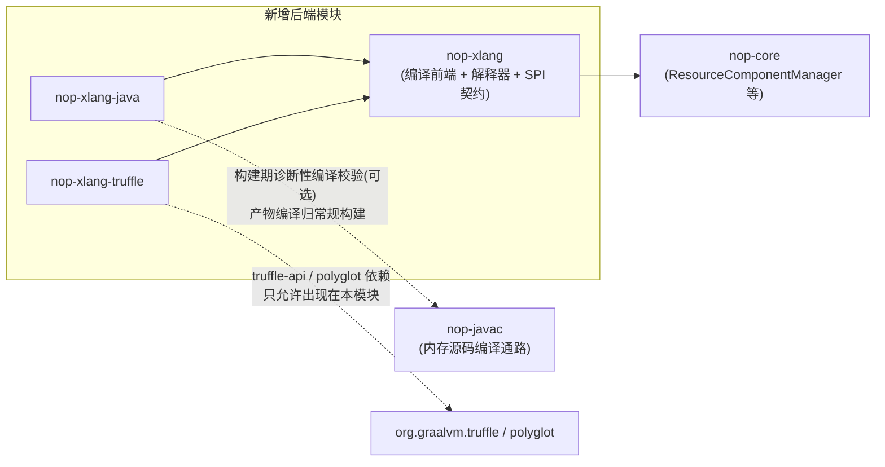

# XLang 执行子系统架构基线（xlang-execution）

**日期**：2026-08-19
**范围**：三后端统一架构：后端选择机制、后端注册 SPI、三后端对拍验证框架、模块边界与依赖方向、与模型加载/构建管线的集成边界
**状态**：active

---

## 一、设计结论

1. 新增 `nop-xlang-java` / `nop-xlang-truffle` 两个执行后端模块，均依赖 `nop-xlang`；后端注册 SPI 契约与注册表定义在 `nop-xlang`，后端模块实现契约并显式注册。
2. 后端选择在**模型加载期**（编译期确定资源：生成类绑定）与**运行时求值期**（动态脚本：后端裁决）两个时机判定，判定逻辑统一为"能力查询 + 降级链"，决策输入与降级路径全仓唯一（本文 §三）。
3. 后端注册采用**显式注册表**（`ScriptCompilerRegistry` 先例），不引入 classpath 扫描或注解发现。
4. 对拍验证框架复用 Nop AutoTest 既有机制，后端作为用例执行参数矩阵化，三后端 any-divergence 即 FAIL。

## 二、模块边界与依赖方向



模块职责边界：

| 模块 | 职责 | 禁止事项 |
|---|---|---|
| `nop-xlang-java` | Executable→Java 转译器、生成类加载与校验、`_gen/` 构建任务 | 依赖 `nop-xlang-truffle`；感知 GraalVM |
| `nop-xlang-truffle` | Executable→Truffle AST 翻译器、XLangLanguage/Context、Context 池运行时 | 依赖 `nop-xlang-java`；向内核泄漏 Truffle 类型 |
| `nop-xlang` | 编译前端、解释器、**后端注册 SPI 契约与注册表**、选择机制裁决入口 | 依赖任何后端模块；import GraalVM |
| `nop-core` | 模型加载与缓存（`ResourceComponentManager` / `IResourceLoadingCache`） | 感知后端概念 |

SPI 契约放在 `nop-xlang` 而非 `nop-core` 的理由：选择机制的判定对象是"编译单元 / Executable 树"这两个 `nop-xlang` 概念，`nop-core` 只见组件模型缓存；契约下沉到 `nop-core` 会让核心层感知 XLang 语义。

## 三、后端选择机制

### 判定输入（四个）

1. **资源产生时机**：构建期静态资源（`_vfs` 内可扫描的 xpl / xlib 等，见下"构建期扫描清单"）vs 运行时动态源（字符串表达式、规则配置产物、经 RCM 动态注册/加载的资源）。
2. **后端可用性**：classpath 是否含后端模块、后端初始化是否成功（truffle 的 `Engine` 创建可能失败）、生成类是否已注册且校验通过。
3. **部署形态**：native image 内 truffle 后端不启用（该模块可不进镜像）；java 后端生成类作为普通类直编进镜像。
4. **配置开关**：按后端启用开关（java / truffle 各自 enable）、强制解释器模式（诊断用）。不设"全局默认后端"取值——默认语义固定为 auto（按判据自动裁决）：可配置的"默认后端=truffle"会与"判据互斥、单跳降级"的决策树冲突（静态资源被配置改道 truffle 后，降级语义不再可预测），故拒绝。

### 判定时机（三个）

| 时机 | 动作 | 归属 |
|---|---|---|
| 构建期 | codegen/xgen 任务扫描 `_vfs/**/*.xpl` / `*.xlib`（live 平台既有可执行资源类型；其余 `_vfs` XDSL 类型是否纳入编译单元由 I6 按 live 清点定稿）→ 产出**构建期扫描清单**（resourcePath should-set）+ java 后端转译产出 `_gen/` 源码，随应用常规编译 | `nop-xlang-java` 构建任务（见 java 组架构 §六） |
| 模型加载期 | 编译单元经差量合并、Executable 树固化后，绑定可执行体：**扫描清单内资源**才做生成类绑定（生成类优先 / 解释器兜底）；扫描清单外资源不做 java 绑定，走动态路径裁决 | 模型加载层 + java 后端注册表 |
| 运行时求值期 | 动态脚本编译为 Executable 树后，按后端可用性裁决执行体 | 统一裁决入口（契约级接入缝）：所有"运行时字符串 → Executable 树"的编译出口统一回调注册表裁决，禁止各动态编译入口自带后端 if/else |

**构建期扫描清单（静态性判定的操作化）**：扫描清单是构建任务的独立产物（resourcePath should-set），与生成类清单**分离**——静态路径的判定测试即 `resourcePath ∈ 扫描清单`。清单内资源必有对应生成类，缺失/指纹失配即降级观测事件（见 java 组架构 §五）；清单外资源（含经 RCM 动态注册/加载的资源，live `ResourceComponentManager` 支持非 `_vfs` 静态来源的组件加载）不适用 java 绑定，一律走动态路径（不记降级事件）。codegen 整体漏跑的可观测性由注册阶段保证：java 后端启用但扫描清单缺失 → 注册"不可用"条目（原因=构建管线漏跑）+ 全局 WARN，全部资源走动态路径/解释器。

### 选择决策树（统一逻辑）

```
selectBackend(compilationUnit c):
  if c ∈ 构建期扫描清单:                         # 静态路径（判定测试即清单成员资格）
    if java 后端启用 and 生成类已注册 and 校验通过:
      return JAVA
    if 生成类本应存在但缺失/校验失败: 记观测事件(降级原因)   # 不允许静默
    return INTERPRETER
  else:                                          # 动态路径（含 RCM 加载的清单外资源）
    if truffle 后端启用 and 初始化成功:
      return TRUFFLE
    if truffle 初始化失败: 记观测事件(降级原因)
    return INTERPRETER
```

### 降级路径与观测要求

- 降级链只有一跳：java → interpreter、truffle → interpreter。不存在 java → truffle 或反向跳转——两后端适用判据互斥（按产生时机），跨跳会让降级语义不可预测。
- 每次降级必须携带原因落日志（`WARN` 级）并计入指标；诊断配置下可强制 interpreter 全跑以隔离后端问题。
- 后端初始化失败不阻断启动：注册时探测，失败标记为不可用并降级，错误保留在注册表条目中供诊断查询。

## 四、后端注册 SPI

### 先例与契约

`nop-xlang` 已有脚本引擎注册先例：`ScriptCompilerRegistry`（`nop-kernel/nop-xlang/src/main/java/io/nop/xlang/script/ScriptCompilerRegistry.java`）以 `@GlobalInstance` 单例 + `registerCompiler / getCompiler` 管理外部脚本引擎，`JaninoScriptCompiler` 在模块初始化时显式注册 `java` 语言。执行后端注册 SPI 沿用同一模式，契约级约定：

| 契约项 | 约定 |
|---|---|
| 后端条目 | 每个后端以**后端标识**（java / truffle）注册，条目声明：能力集（静态生成物 / 动态翻译）、可用性状态与不可用原因、参与选择机制所需的元信息 |
| 注册时机 | 后端模块初始化代码显式注册 / 反注册；注册表为全局单例（`@GlobalInstance` 模式） |
| 查询方式 | 选择机制通过注册表查询可用后端与能力，**不做 classpath 扫描**；`nop-xlang` 对后端实现的全部感知止步于本契约 |
| 失败语义 | 后端初始化失败 → 注册"不可用"条目（保留原因），不抛出阻断启动的异常；对不可用后端的请求按降级路径走解释器 |

### 为什么显式注册而不是自动发现

- 与 NopIoC "beans.xml 显式注册、无注解扫描"的平台约定同构（AGENTS.md 明确：Nop IoC 不做注解驱动的 bean 扫描）。
- Truffle 侧语言注册本身也是编译期生成 provider 服务文件（`truffle-dsl-processor` 生成 `META-INF/services/...Provider`），无反射扫描——两层显式主义一致，无机制冲突。
- 后端是重量级组件（Engine、生成类表），错误配置应在注册时显式暴露，而非被扫描顺序掩盖。

拒绝了什么：Spring 风格 `@Component` 扫描式自动发现（与平台 IoC 显式主义冲突，且后端可用性受扫描顺序影响）；OSGi 式服务活化（引入平台没有的复杂度）。

## 五、三后端对拍验证框架

### 对拍对象

同一**编译产物**——同一份源资源经同一编译前端（含 Delta 合并）得到的同一棵 Executable 树——分别在解释器、java 后端（生成类）、truffle 后端（翻译 AST）执行。对拍的是"树"，不是"源文本重新编译"，保证差异只来自后端。

### 断言口径（三层，缺一不可）

1. **返回值一致**：`equals` 语义比对（含类型信息，避免 `1L` vs `1` 的隐式相等）。
2. **副作用一致**：求值后 EvalScope 可见变量集与值、输出缓冲（IEvalOutput）内容逐项比对。
3. **异常语义一致**：错误码一致；`SourceLocation` 回映射到同一源位置；不允许一侧抛异常另一侧正常返回。

### 纳入回归的方式

- 复用 Nop AutoTest 机制：autotest 用例文件保持一份，后端标识作为用例执行参数矩阵化（同一用例对三后端各跑一遍）。
- 对拍差异 = 用例 FAIL（fail-fast），不做"允许少量漂移"的弱化断言。
- 回归不允许削弱现解释器测试（roadmap 纪律 3）；现解释器本身就是对拍基线的一侧，天然持续覆盖。
- **列适用性（矩阵构成规则）**：对拍矩阵的列按单元静态/动态分类适用——**静态单元（扫描清单内）三列**（解释器 / java / truffle）；**动态单元两列**（解释器 / truffle，java 列"不适用"——动态单元结构上无生成类，不构成"后端未启用跳过"也不构成"单元级降级 FAIL"）。顶层不变式口径：单元**在其适用后端上**执行结果一致（vision §四），动态单元不因 java 列缺席而无法 PASS。
- 后端未启用时（如 native 形态无 truffle）对应矩阵列自动跳过，跳过必须显式记录，不算通过。
- **单元级降级判 FAIL，不判跳过**：后端已启用、但该编译单元发生降级（java 列生成类缺失/指纹失配走解释器；truffle 列翻译失败）时，该用例在该列判 FAIL——单元级降级本身就是对拍要拦截的回归（stale 生成类 / codegen 漏跑 / 翻译器缺陷），跳过或降级执行会使该列与解释器列恒等，形成 vacuous pass。对拍 harness 必须断言每列实际执行的后端身份（如 java 列断言执行体为生成类实例而非解释器树），不允许只比对结果不断言身份。

## 六、与 ResourceComponentManager 和构建管线的集成边界

### 与 ResourceComponentManager（RCM）

- RCM 的职责边界**不变**：模型按 `IResourceLoadingCache` 缓存、资源变更检测、多租户缓存隔离均维持现状。
- 后端接入点在"编译单元加载完成之后"：差量合并 → Executable 树固化 → 此时才做生成类绑定（java）或翻译缓存（truffle）。后端不感知 Delta，差量定制全部发生在上游。
- java 后端"生成类优先 / 解释器兜底"的绑定决策树、生成类与树的一致性校验，定义在 java 组架构（`../xlang-java/01-architecture-baseline.md` §五）；RCM 只负责把绑定结果随 `ComponentCacheEntry` 缓存。

### 与构建管线

- java 后端产物经既有 codegen / xgen 任务体系产出 `_gen/` 源码，任务定义与接入方式定义在 java 组架构 §六；**不绕过 codegen 管线另起构建通道**，`_` 前缀产物不可手改。
- truffle 后端无构建期产物：翻译发生在运行时（模型加载完成后），按 resourcePath 做翻译缓存。
- GraalVM native image 兼容（反射/资源配置生成）复用 `nop-codegen` 既有 `GraalvmConfigGenerator` 管线，归属 roadmap I6。

## 七、拒绝了什么

| 拒绝方案 | 拒绝理由 |
|---|---|
| 单后端路线（只做 truffle 或只做 java） | truffle 无法服务 native image 提速（宿主无 JIT、guest 路线已被愿景层否决）；java 后端无法服务运行时动态源（closed-world 限制）。两类场景必须各自有结构性解 |
| 后端选择逻辑以 if/else 散布在各调用点 | 判定规则会随场景增殖失控；集中为统一决策树（§三）后，降级语义全仓唯一、可测试 |
| classpath 扫描自动发现后端 | 见 §四；与平台 IoC 显式主义冲突 |
| 运行时反射探测生成类存在性作为主判定 | 反射探测无法校验生成类与树的版本一致性（模型改了、生成类没重新生成会静默执行旧逻辑）；改用注册表 + 构建期产物清单 + 一致性校验 |
| 对拍只比对返回值 | 副作用（输出缓冲、scope 变更）与异常语义不一致在模板/规则场景是真实缺陷；三层断言缺一不可 |
| java → truffle 跨后端降级链 | 两后端适用判据互斥，跨跳降级语义不可预测；统一单跳降级到解释器 |
| "全局默认后端"配置项 | 与判据互斥、单跳降级的决策树冲突（配置改道会破坏降级语义可预测性）；默认即 auto（§三判定输入 4） |

## 八、与已有设计的关系

- 愿景层：[00-vision.md](00-vision.md)
- java 后端架构：[../xlang-java/01-architecture-baseline.md](../xlang-java/01-architecture-baseline.md)
- truffle 后端愿景与架构：[../xlang-truffle/00-vision.md](../xlang-truffle/00-vision.md)、[../xlang-truffle/02-architecture-baseline.md](../xlang-truffle/02-architecture-baseline.md)
- 复用锚点（live 源码）：`nop-kernel/nop-core/src/main/java/io/nop/core/resource/component/ResourceComponentManager.java`、`nop-kernel/nop-xlang/src/main/java/io/nop/xlang/script/ScriptCompilerRegistry.java`
