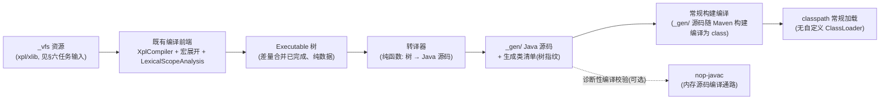

# nop-xlang-java 转译器架构基线（xlang-java）

**日期**：2026-08-19
**范围**：Executable→Java 转译器、~137 节点类映射策略、SourceLocation 保真、生成类加载与 ResourceComponentManager 集成、`_gen/` 构建任务、EvalMethod 调用约定
**状态**：active（目标模块 `nop-kernel` 下 `nop-xlang-java` 由实现阶段创建）

---

## 一、设计结论

1. 转译器输入是编译前端产出的 **Executable 树**（宏全展开、slot 已分配），输出是**普通 Java 源码**到 `_gen/`，构建期常规编译——运行期零解释、零生成、零动态类加载。
2. 全节点覆盖以"**节点类分类翻译模式 + 覆盖矩阵**"保证：live `nop-kernel/nop-xlang/src/main/java/io/nop/xlang/exec/` 的 137 个文件为基线清单，缺 translator 即转译失败（fail-fast），不允许部分生成。
3. SourceLocation 保真采用"**生成类内嵌静态 SourceLocation 常量**"，不做行号映射表。
4. 加载集成遵循统一选择机制（`../xlang-execution/01-architecture-baseline.md` §三静态路径）：**生成类优先 / 解释器兜底**，一致性校验失配即降级并观测。
5. 调用约定沿用 janino **EvalMethod 先例骨架**（static 方法、首参 `IEvalScope $scope`），并按 live 事实扩展：输出经 `IEvalOutput $out` 追加隐参传递（输出缓冲在 live 中由 `EvalRuntime` 携带、非 `IEvalScope`）；语义保真优先依赖"与解释器共享 helper"。

## 二、转译器总体结构



结构决策：

- **只做树→源码的纯函数翻译**。转译器不感知 Delta（差量定制全部发生在上游，运行时/翻译时只见最终树）、不做字节码级操作、无运行期组件参与生成。
- **编译执行主体是常规构建，不是 nop-javac**：`_gen/` 源码作为构建的一部分由常规 Maven/javac 编译为 class，随 classpath 常规加载。既有 `nop-javac`（`JdkJavaCompiler`）是 `javax.tools` **内存编译 + 自定义 ClassLoader** 通路（服务运行时动态编译场景），与本架构"无自定义 ClassLoader、native image 直编"的硬决策不兼容，**不承担产物编译职责**；至多作为构建任务的诊断性编译校验（可选：任务内提前暴露生成源码的编译错误，fail-fast），其结论不改变产物由常规构建编译的事实。
- **编译单元粒度**：每个编译单元生成一个类（类型集以 §六任务输入口径为准：xpl / xlib 为确定成员，其余 `_vfs` 类型由 I6 按 live 清点定稿）；类名从 resourcePath 确定性派生，栈帧可直接追溯到资源。
- **为什么源码级生成而不是字节码级（ASM）**：生成物可读、可审查、可在 IDE/栈帧中直接定位；javac 的优化免费获得；与平台既有源码级编译产物（`nop-javac` 先例同为源码输入）同构。拒绝字节码生成：调试成本高、产物不可读、构建期排错困难。

## 三、节点映射策略（~137 节点类全覆盖）

节点清单基线以 live `exec/` 目录 **137 个文件**为准（含抽象基类与少量非节点辅助类），按求值语义分类，每类一个翻译模式：

| 类别 | 代表节点类 | 翻译模式 |
|---|---|---|
| 字面量/常量 | `LiteralExecutable`、`CloneLiteralExecutable`、`NullExecutable` | 直译为 Java 字面量/常量表达式 |
| slot 变量读写 | `SlotIdentifierExecutable`、`SlotAssignExecutable`、自增自减族 | 直译为局部变量读写（slot 布局编译期已定） |
| 作用域链访问 | `ScopeIdentifierExecutable`、`GlobalVarExecutable`、`ScopeAssignExecutable` 族、引用赋值族 | 经 `$scope` 参数的作用域访问 API 调用（无法 slot 化的按名访问） |
| 算术/逻辑/比较 | `Plus/Minus/Multiply/Divide`、`Eq/Ne/Gt/Ge/Lt/Le`（含 Strict 变体）、`And/Or/Not/Neg/BitNot`、`NullCoalesce`、`BetweenOp/AssertOp` | 直译 + 语义对齐：XLang 宽松比较/数值提升语义统一走**共享 helper**（见下） |
| 类型操作 | `CastExecutable`、`ConvertExecutable`、`InstanceOfExecutable`、`TypeOfExecutable` | 共享 helper / 直译 |
| 对象/集合构造与访问 | `NewObject/NewList/NewMap`、`Get/SetProperty`、`Get/SetAttr`、`ListItem/MapItem`、`MakeProperty` 族 | 反射语义走共享 helper（与解释器同一实现） |
| 函数/闭包 | `FunctionExecutable`、`ExecutableFunction`、`CallFuncExecutable`、`BuildClosureBodyExecutable`、`ObjFunction` 族、`StaticFunctionExecutable` | 生成私有方法 / lambda + `IEvalFunction` 适配包装 |
| 控制流 | `IfExecutable`、`SwitchExecutable`、`For/ForIn/ForOf`、`While/DoWhile`、`Break/Continue/Return`、`TryExecutable`、`Throw*Executable`、`Block/Seq` | Java 控制流直译；`Break/Continue/Return` 在生成方法内为原生语句（解释器中它们经 `ExitMode` 传递，语句位置语义一一对应）。**传播边界不变式**：`ExitMode` 不跨函数/闭包边界传播（live `ExecutableFunction` 在函数边界清零），生成代码以生成方法边界为传播边界——闭包/函数体内的非局部跳转映射为该函数体的返回，不外传（否则 Java 原生 break 在私有方法内无目标循环，编译即错） |
| 输出/节点生成 | `OutputText/OutputValue/OutputXmlAttr` 族、`GenNode/GenNodeAttr/GenXJson`、`CollectJson/CollectNode/CollectSql/CollectText`、`EscapeOutput` | 输出缓冲（`IEvalOutput`）API 调用序列 |
| 绑定/守卫/调试 | `BindVarExecutable`、`Array/ObjectBindingAssign`、`InitRefSlot/EnhanceRefSlot`、`Guard*`、`DebugExecutable` | 直译 / `$scope` API 调用 |

### 全覆盖路径（两条硬保证）

1. **覆盖矩阵**：以 137 文件清单为基线的矩阵测试，逐一断言每个节点类已注册 translator；新增节点类（前端演进）未注册时矩阵红灯，不允许无声漏译。
2. **fail-fast 转译**：树中出现未注册 translator 的节点 → 转译失败并报节点类名与 SourceLocation；不允许静默跳过该节点、不允许"部分生成 + 剩余解释"的混合产物（混合产物使后端行为不可推理，破坏对拍基准）。

### 语义一致性策略

数值提升、宽松相等、属性反射、异常传播等**与解释器存在微妙差异风险**的语义，生成代码统一调用**与解释器共享的 helper**（helper 定义在 `nop-xlang`，依赖方向合法）。同一份逻辑两个后端复用：行为一致优先于生成代码的"纯度"，对拍三层断言（返回值/副作用/异常语义）因此更易成立。拒绝"为生成代码重写一套语义等价实现"——两套实现的漂移是对拍失败的恒定来源。

**可变 slot 的闭包捕获契约**：Java lambda/匿名类要求被捕获局部变量为有效终值（effectively final），而 XLang slot 可变且可被闭包捕获（live `SlotAssignExecutable`/自增自减族证明 slot 写、`BuildClosureBodyExecutable` 证明闭包捕获）。被闭包捕获的可变 slot 一律经显式可变 cell（单元素数组包装等）读写，语义与解释器的 slot 写读一致；未被捕获的可变 slot 保持普通局部变量直译。

## 四、SourceLocation 保真

**决策**：生成类内嵌**静态 SourceLocation 常量**（转译期从节点固化），所有可抛错点（除零、类型转换失败、属性缺失、`Throw*Executable`、守卫失败等）抛 `NopException` 时携带对应常量；`.param()` 语义照旧。

- **为什么不用"生成代码行号 ↔ 源位置映射表"**：映射表依赖生成代码文本布局稳定，格式化调整、语句包裹变化都会使映射漂移；常量直嵌没有中间层，不受生成代码形状演化影响。
- **栈帧可读性**：类名含 resourcePath 派生段、生成方法名对应编译单元入口，异常栈可直接定位资源；生成文件头部附 `// source: <resourcePath>` 注释（仅辅助人工排查，不承载逻辑）。
- 对拍第三层断言（异常语义一致：错误码 + 回映射到同一源位置）依赖本机制成立。

## 五、生成类加载与 ResourceComponentManager 集成

嵌入统一选择机制静态路径的绑定决策树：

```
onCompilationUnitLoaded(unit):
  if java 后端未启用(配置开关/强制解释器模式):    # 统一决策树静态路径首条件
      executable = tree; 缓存; return
  if unit ∉ 构建期扫描清单:                      # 清单外资源：不适用 java 绑定
      走统一决策树动态路径裁决(truffle/解释器)       # 不记降级事件
      return
  tree = 编译产物(差量合并后固化的 Executable 树)
  entry = java后端生成类清单.lookup(unit.resourcePath)
  if entry 存在 and entry.树指纹 == tree.树指纹:
      executable = 生成类实例(EvalMethod 约定调用)      # 生成类优先
  else:
      记观测事件(缺失/失配原因, WARN)                    # 清单内本应存在——不允许静默
      executable = tree                                 # 解释器兜底
  executable 随 RCM ComponentCacheEntry 一起缓存
```

- **静态性判定 = 扫描清单成员资格**（统一架构 §三"构建期扫描清单"）：扫描清单（should-set）与生成类清单分离产出，杜绝"以生成类命中反推静态性"（那会使 codegen 漏跑不可观测——清单与扫描集同为漏跑产物时两者俱缺，缺失分支永不触发）。java 后端启用但扫描清单缺失 → 注册不可用条目 + 全局 WARN（构建管线漏跑可观测）。

- **一致性校验（防 stale 生成类）**：指纹的施加对象统一为 **Executable 树**（构建期树固化时计算树指纹并写入生成类清单；运行时树固化后比对树指纹）。**不采用"源资源指纹"**：Delta 参与合并时二者不等价（改 delta 不改基资源，源指纹不变而树已变），按源资源指纹实现会漏检 Delta 变更导致的 stale 生成类。失配（模型改了、`_gen/` 未重生成——构建管线漏跑）→ 降级解释器 + WARN。为什么必须校验：静默执行旧逻辑是最危险的缺陷形态，比"没有生成类"严重得多。
- **加载机制**：生成类是构建期编译产物（常规构建编译 `_gen/` 源码），经 classpath 常规加载；**无运行时动态编译、无自定义 ClassLoader**——这是 native image 兼容的前提（closed-world 内类加载不可用）。
- **RCM 职责边界不变**：`ResourceComponentManager` 继续负责 `IResourceLoadingCache` 模型缓存与资源变更检测；java 后端只在"编译单元加载完成之后"接入绑定，绑定结果随缓存条目复用（统一架构 §六）。

## 六、`_gen/` 构建任务接入方式

- **任务输入**：`_vfs/**/*.xpl` / `*.xlib`（live 平台既有可执行资源类型，`XLangConstants` FILE_TYPE_XPL/XLIB；其余 `_vfs` XDSL 类型如 xtask/xgen/xrun 是否构成独立 Executable 编译单元，由 I6 实现时按 live 清点定稿并显式记录纳入/排除及理由——不引入 live 不存在的类型）。与统一选择机制构建期扫描口径一致。
- **任务产出**：`_gen/` 下 Java 源码 + **构建期扫描清单**（resourcePath should-set，静态性判定依据，统一架构 §三）+ **生成类清单**（resourcePath → 类名 + 树指纹，供运行期加载与校验；指纹口径见 §五一致性校验）。扫描清单与生成类清单为分离的两份产物。
- **接入方式**：作为既有 codegen / xgen 任务体系的任务注册，纳入正常构建生命周期；任务经与运行时**相同的编译前端**取树（不复制前端逻辑）；重新生成幂等。
- **不绕过 codegen 管线**：不自建独立构建通道、不在运行期补生成；`_` 前缀产物不可手改（仓库硬规则，AGENTS.md）。
- **native image**：生成类作为普通类直编进镜像；反射调用所需的 GraalVM 配置由 `nop-codegen` 既有 `GraalvmConfigGenerator` 管线生成（实现归属 roadmap I6，非本架构展开）。

## 七、EvalMethod 调用约定

先例：`JaninoScriptCompiler`（`nop-kernel/nop-xlang/src/main/java/io/nop/xlang/janino/JaninoScriptCompiler.java`）——生成方法为 **static**，**第一个参数固定为 `IEvalScope $scope`**（`ExprConstants.SYS_VAR_SCOPE`），其后为声明的参数；经 `MethodInvoker` / `EvalMethodInvoker` 包装为 `IEvalFunction`（EvalMethod 约定：首参为 `IEvalScope`）。

本转译器**沿用"static + 首参 `$scope`"骨架**并**显式扩展输出通路**（janino 先例只服务无输出的 `java:` 表达式脚本，不构成 xpl 模板的完整先例）。live 事实修正：变量可见性经 `IEvalScope`，但**输出缓冲（`IEvalOutput`）、帧、`ExitMode` 是 `EvalRuntime` 的并列字段**（`IExecutableExpression.execute(executor, EvalRuntime)` 的 `rt.getOut()`），**不经 `IEvalScope` 携带**。因此约定：

- **隐参前缀**：生成入口方法统一以 `IEvalScope $scope` 为首参（保持 EvalMethod/`MethodInvoker` 包装兼容）；**有输出语义的编译单元（xpl / xlib）追加固定第二隐参 `IEvalOutput $out`**（位于声明参数之前），生成代码的输出节点（§三输出族）经 `$out` 发出 API 调用序列。纯表达式单元（无输出）不追加——与 janino 先例签名完全一致，走既有 `EvalMethodInvoker` 包装；模板单元由模板入口包装器承载（包装器契约随 I1 对拍框架定稿）。
- **拒绝了"`EvalRuntime` 单参承载一切"**：把解释器运行时结构（`currentFrame`/`executor` 等生成代码不需要的字段）泄漏为生成代码契约，且破坏 EvalMethod 首参兼容。

异同对照：

| 维度 | janino 先例 | nop-xlang-java 转译器 |
|---|---|---|
| 输入层级 | 表达式/脚本文本（字符串级） | Executable 树（树级，宏已全展开） |
| 编译时机 | 运行时（in-memory cook） | 构建期（`_gen/` + 常规构建编译） |
| 单元粒度 | 单个脚本串一个方法 | 每编译单元一个生成类（可含多个私有方法） |
| 首参 `$scope` | 是 | 是（一致：变量可见性经 `IEvalScope`） |
| 输出缓冲 | 无此概念（表达式无输出） | xpl/xlib 单元追加 `IEvalOutput $out` 隐参（live 中输出经 `EvalRuntime` 携带，非 `IEvalScope`） |
| 语义来源 | janino 编译器自身语义 | 与解释器共享的 helper（§三语义一致性策略） |

为什么沿用首参骨架：生成方法天然满足 EvalMethod 格式，表达式单元可直接复用既有 `MethodInvoker` / `EvalMethodInvoker` 包装与 `IEvalFunction` 体系，不为后端新造调用约定；`IEvalScope` 是 XLang 变量可见性语义不可省略的隐参，首参化使生成方法签名自解释。

## 八、在统一架构中的位置（与 xlang-execution 对齐）

- **注册**：java 后端按统一注册 SPI（`../xlang-execution/01-architecture-baseline.md` §四）显式注册，能力声明为"静态生成物"；参与选择机制**静态路径**判定（§五决策树即统一决策树静态路径的展开）。
- **对拍**：生成类执行体是对拍矩阵的 java 列，三层断言（返回值 / 副作用 / 异常语义）由统一对拍框架承载（统一架构 §五）。
- **依赖**：`nop-xlang-java` → `nop-xlang`（+ 构建期 `nop-javac` 源码编译通路）；不依赖 `nop-xlang-truffle`，不感知 GraalVM。

## 九、拒绝了什么

| 拒绝方案 | 拒绝理由 |
|---|---|
| 字节码级生成（ASM 直出 .class） | 产物不可读、栈帧不可定位、构建期排错困难；javac 优化与既有通路全部放弃 |
| 行号映射表式 SourceLocation 保真 | 依赖生成代码文本布局稳定，格式演化即漂移（§四） |
| 运行时动态编译 Java 源（janino 式）作为 xpl/expr 执行路线 | native image 内不可用；类加载/卸载管理复杂度。运行时动态场景按统一分工归 truffle 后端 |
| 生成类缺失/失配时构建失败硬阻断 | 可用性优先：降级解释器 + WARN 观测，缺陷可发现但不放大为不可用 |
| 每节点类一个生成类的粒度 | 类爆炸、加载开销；改为每编译单元一类 |
| "部分生成 + 剩余节点解释执行"的混合产物 | 后端行为不可推理，破坏对拍基准；未覆盖节点必须整体回退解释器（fail-fast） |
| 为生成代码重写一套语义等价 helper | 双实现漂移是对拍失败的恒定来源；共享 helper 一致性优先（§三） |

## 十、与已有设计的关系

- 统一架构：[../xlang-execution/00-vision.md](../xlang-execution/00-vision.md)、[../xlang-execution/01-architecture-baseline.md](../xlang-execution/01-architecture-baseline.md)
- 互补后端：[../xlang-truffle/02-architecture-baseline.md](../xlang-truffle/02-architecture-baseline.md)（运行时动态路径）
- 源码锚点（live）：`nop-kernel/nop-xlang/src/main/java/io/nop/xlang/exec/`（137 文件基线）、`nop-kernel/nop-xlang/src/main/java/io/nop/xlang/janino/JaninoScriptCompiler.java`、`nop-kernel/nop-core/src/main/java/io/nop/core/resource/component/ResourceComponentManager.java`、`nop-kernel/nop-javac/src/main/java/io/nop/javac/jdk/JdkJavaCompiler.java`
