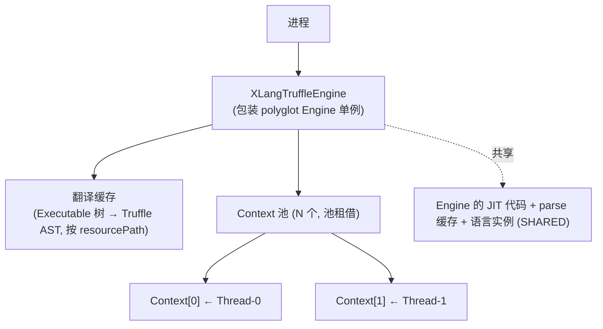

# nop-xlang-truffle 后端架构基线（xlang-truffle）

**日期**：2026-08-19
**范围**：XLangLanguage / XLangContext 设计、对象与帧/slot 映射、多线程架构、两级内联缓存准则、与 nop-js Engine 的共享评估、依赖钉版
**状态**：active（目标模块 `nop-kernel` 下 `nop-xlang-truffle` 由实现阶段创建）

---

## 一、设计结论

1. XLangLanguage 以 `ContextPolicy.SHARED` 注册（id `xl`），无 parser——`Source` 为合成源，AST 由 Executable 树程序化翻译构造；`isThreadAccessAllowed` 保持默认（Context 内串行）。
2. 多线程架构选定**路 A：Context 池 + 共享 Engine + SHARED**；正确性验证阶段允许以 EXCLUSIVE 单 Context 对拍作为保守过渡。
3. 帧映射直译前端产物：`LexicalScopeAnalysis` 的 slot 布局 → `FrameDescriptor`/`FrameSlot`（标注 primitive kind）；残余按名访问走 context 持有的 scope 链对象。
4. 函数调用内联缓存按**两级准则**：一级缓存 CallTarget 身份、二级缓存直达调用形态；**禁止**缓存函数实例身份或任何运行时值身份。
5. 一期**不与 nop-js 共享 Engine**（独立 Engine），触发条件满足时重评估。
6. 依赖钉 25.x LTS 线（truffle-api / truffle-dsl-processor / polyglot 同线对齐）；源码级证据支持与 nop JDK 21 基线兼容，最终构件实测为条件钉版条款。

## 二、模块边界与依赖钉版

### 模块边界

- `nop-xlang-truffle` → `nop-xlang`（翻译器消费 Executable 树与统一 SPI 契约）；不依赖 `nop-xlang-java`。
- **Truffle 依赖不泄漏**：`org.graalvm.truffle:truffle-api`、`org.graalvm.truffle:truffle-dsl-processor`（注解处理器）、`org.graalvm.polyglot:polyglot` 三个坐标**只允许**出现在本模块 pom；`nop-xlang` / `nop-core` 及内核其他模块不得出现 `org.graalvm.*` import（统一架构约束，`../xlang-execution/01-architecture-baseline.md` §二）。

### 依赖坐标钉版（25.x LTS 线）

- 三个坐标钉**同一条 25.x LTS 版本线**（Truffle Unchained 后 Maven Central 独立分发、与 GraalVM JDK 解耦；GraalVM 25 线 Oracle 支持至 2030-09，是 native 构建与运行时 JIT 的共同 LTS 基线）。truffle-api 与 polyglot 版本必须对齐，dsl-processor 同线。
- 同一二进制两种形态：stock JDK 21+ 上嵌入运行 = 解释执行（monotonic frames）；GraalVM 运行时 = partial evaluation JIT。
- **JDK 基线兼容性（条件钉版条款）**：源码级证据——上游 oracle/graal 仓库源码（证据文件：truffle 模块与 sdk 模块各自的 mx suite 配置，本地镜像为 `~/sources/graal` sparse clone，引用以上游仓库为准）中 `com.oracle.truffle.api` 基线 `javaCompliance "17+"`，multi-release overlay（`jdk9` 版 9 / `jdk21` 版 21）；sdk 模块版本 25.3.4.1。即 class file 层面与 nop JDK 21 基线兼容。构件级证据：Maven Central 25.2.4 线实测（truffle-api / polyglot / truffle-dsl-processor 基础 class 均 major 61（Java 17），multi-release overlay 仅 versions/9 与 versions/21、无更高版本目录），与源码证据一致——**JDK 21 兼容确认点已关闭**，I3 引入所钉版本时做常规冒烟复核即可（若 I3 钉 25.x 线内更新版本，重跑一次同口径检查）。

## 三、XLangLanguage / XLangContext 设计

### XLangLanguage（语言入口）

| 设计点 | 决策 | 理由 |
|---|---|---|
| 注册 | id `xl`、name `XLang`、defaultMimeType `application/x-xlang`、`contextPolicy = SHARED` | SHARED 是池化并发下多存活 Context 共享 AST / parse 缓存 / JIT 的唯一途径（§五） |
| parse | 无 parser：`parse(ParsingRequest)` 返回的 CallTarget 由**翻译缓存**查找/构建（合成 Source：路径 + 行号） | 框架允许无 parser 语言（Source 可合成、AST 可程序化构造）；XLang 自有编译前端，Truffle 层只承担执行后端 |
| 线程钩子 | `isThreadAccessAllowed` 保持默认（Context 内串行）；`initializeMultipleContexts` 按 SHARED 要求实现 | 并发由多 Context 承担（§五路 A），不要求节点支持并发访问 |
| 注册机制 | DSL 处理器编译期生成 provider 服务文件（无反射扫描） | 与 Nop 平台显式注册主义同构，无 NopIoC 冲突 |
| 控制流 | `ExitMode`（CONTINUE/BREAK/RETURN）翻译为控制流异常族（SL 模式，三值一一对应） | 框架惯例：非局部跳转用异常实现；与 Truffle 嵌入侧 Context Exit（soft/hard/cancel）无关，不对接 |
| 异常 | `NopException` 语义保持：语言异常携带 SourceSection（合成 Source 回映射源位置），`.param()` 参数在 host 侧可见 | 对拍第三层断言（异常语义一致）依赖此映射 |

### XLangContext（语言上下文）

- 每次 Context 持有：**输出缓冲（`IEvalOutput`，线程绑定，绝不可跨 Context 共享）**、本次求值的全局作用域句柄、宿主交互辅助。
- **语言实例只存可共享数据**：按 resourcePath + 树指纹的翻译缓存（享受 parse 缓存语义，键口径见 §七）、函数表等；可变部分需同步。节点不得持有 context 数据或运行时值（context-independent 准则，SHARED 硬要求）。
- 为什么这样切分：SHARED 下一个语言实例服务多个同时存活的 Context，任何 context 私有状态进语言实例都是跨 Context 污染缺陷。

## 四、对象映射与帧/slot 映射

### 对象映射总表

| XLang（现解释器） | Truffle 运行时 | 说明 |
|---|---|---|
| `IExecutableExpression.execute(executor, EvalRuntime)` | `Node.execute(VirtualFrame)` | **树翻译而非适配包装**：逐节点类写翻译器（`exec/` 137 文件基线；全覆盖策略与 java 后端同构——分类翻译 + 覆盖矩阵 + fail-fast，见 `../xlang-java/01-architecture-baseline.md` §三） |
| `ExprEvalAction` / 编译产物根 | `RootNode` + `CallTarget` | 每个编译单元一个 CallTarget = JIT 编译粒度 |
| `EvalFrame(Object[] stack)` + slot 下标 | `VirtualFrame` + `FrameSlot` | 见下"帧/slot 映射" |
| 按名访问（`ScopeIdentifierExecutable` 等无法 slot 化部分） | context 持有的 scope 链对象查找节点 | 翻译期 slot 化优先，残余走本路径（§九 Q3） |
| `EvalScopeImpl`（parentScope + Map 链） | 语言 context 内 scope 对象 / `MaterializedFrame` | 闭包捕获场景用物化帧；全局作用域放 context（SHARED 下放 context 而非 language 实例的运行时状态） |
| `ExecutableFunction.invoke` | `CallTarget.call` / 直接节点调用 | 保持 `IEvalFunction` 外观不变，内部换 CallTarget |
| `IEvalOutput`（xpl 输出缓冲） | 语言 context 持有、线程绑定 | 绝不可跨 Context 共享 |
| `SourceLocation` | `SourceSection`（合成 Source） | 异常 / 诊断 / instrumentation 的定位基础 |
| `NopException` / `.param()` | 语言异常携带 SourceSection | `.param()` 语义在 host 侧可见 |

**为什么树翻译而不是适配包装**：包装（把解释器节点原样包进 Truffle Node）内部仍是解释器虚调用树，partial evaluation 无法展开、特化机制失效，且包装对象持有可变状态破坏 context-independent 准则——性能目标与正确性准则双双落空。

### 帧/slot 映射（与 LexicalScopeAnalysis 的关系）

- **slot 布局不是新设计**：编译前端 `LexicalScopeAnalysis` 产出的 slot 分配直接映射为 `FrameDescriptor`（每 RootNode 一份）+ `FrameSlot`；`SlotIdentifierExecutable` 直译为 slot 读写节点。
- FrameDescriptor 声明时标注 primitive kind：帮助 PE 消除装箱（long/double/boolean 通道）。**类型信息来源有前置约束**：live `EvalFrame` 为 `Object[]`、`LexicalScopeAnalysis` 只产 slot 布局不产静态类型——只有能从字面量节点/显式类型声明推断出类型的 slot 才标注 kind，推断不出的 slot 保持 Object kind（不虚构类型信息；覆盖率实测归实现计划）。
- 帧访问模式（READ/WRITE/MATERIALIZE）按节点实际用法声明，帮助编译器优化。
- 规则：能进 VirtualFrame 的变量不放语言 context；帧 slot 类型单调升级（monotonic）以减少重新检查。
- 闭包捕获：`MaterializedFrame`（物化帧），对应解释器的 `EvalScope` 捕获语义。

## 五、多线程架构（Context 池 + 共享 Engine + ContextPolicy.SHARED）

### 架构

- 嵌入模式：Context 构建时显式绑定共享 Engine；`enter()/leave()` 包住一批求值，消除每次调用的进出开销（可重入）。
- 语言侧：`contextPolicy = SHARED`；Context 内保持串行（`isThreadAccessAllowed` 默认），并发由多 Context 承担。

### 为什么选路 A（每线程一 Context + 共享 Engine），拒绝路 B（单 Context 多线程并发）

| 维度 | 路 A（选定） | 路 B（拒绝） |
|---|---|---|
| 语言要求 | SHARED + context-independent 准则；节点无需支持并发访问 | `isThreadAccessAllowed → true` + 全部节点线程安全 |
| 隔离性 | 语言 context 天然隔离（各线程独立状态） | 共享语言 context，全局状态需自行同步 |
| JIT 复用 | 同一 Engine 内共享（SHARED 下 parse 一次、AST 一份） | 同一份 AST |
| XLang 适配成本 | 低：`IEvalScope` 求值模型本来就是"每次求值独立作用域链"，无共享可变状态假设 | 高：`EvalScopeImpl` 的 Map 链需重设计为并发结构；`IEvalOutput` 等线程绑定资源需重审 |
| 风险 | Context 创建开销（池化缓解） | DSL 节点自改写在高并发下的争用；调试困难 |

**为什么 SHARED 而不是 REUSE/EXCLUSIVE 作终态**：REUSE 语义是"context 销毁后回收复用语言实例"，同一时刻一个实例只服务一个存活 Context——池化并发下多个 Context **同时存活**，跨 Context 复用 AST / parse 缓存 / JIT 只有 SHARED 一条路；EXCLUSIVE 无任何复用。SHARED 的代价（context-independent 准则、禁值身份推测、`ContextReference` 多 Context 下不折叠的开销）对 xlang 影响小：翻译 AST 源自**无状态 Executable 树**（纯数据、宏全展开、不含运行时值），slot 布局编译期已定，本来就不依赖运行时值身份。

### context-independent 准则（SHARED 硬要求，翻译纪律）

1. 禁止对运行时**值身份**做推测（多 Context 下必然二次 deopt）；
2. 函数调用内联缓存按 §六两级准则（禁函数实例身份一级缓存）；
3. 根 Shape 等语言级结构存 language 实例而非 context；
4. 节点不存储 context 相关数据或运行时值；
5. 源码加载/翻译一律走翻译缓存路径（language 实例作用域）；Assumption 存 language 实例。

### Context 池策略（§九 Q2 裁定）

- **池租借模式**：求值线程从池租借 Context，`enter()/leave()` 包住批求值，用毕归还；不做每线程固定绑定（线程池弹性伸缩时固定绑定会泄漏 Context）。
- **租借状态协议（契约）**：租借时注入本次求值的输出缓冲（`IEvalOutput`）与全局作用域句柄，归还前清空；context 内状态只在 `enter()..leave()` 窗口内有效，归还后的 Context 不得残留上一批求值的任何可变状态（翻译缓存等可共享数据除外，存语言实例作用域）。缺此协议，池化复用即跨求值污染的天然来源。
- 池大小为配置项，缺省随并发工作线程规模；**Context 创建/销毁成本实测与池大小调优归 I7 基准**，本层不发明数值。
- **保守过渡路径**：正确性验证阶段用 EXCLUSIVE 单 Context 与解释器对拍（不追求共享），对拍通过后切 SHARED 上池——分两步走是为了把"翻译正确性"与"共享正确性"两类缺陷分离定位。**切换机制**：`contextPolicy` 是 `@Registration` 编译期常量，"切"指注解取值变更（EXCLUSIVE → SHARED）后重新编译的形态切换，不是运行时开关；两形态各自都是验证载体（EXCLUSIVE 形态验证翻译正确性，SHARED+池形态验证共享正确性）。**SHARED 形态的正确性验证载体**：切 SHARED 后必须补并发正确性验证——多线程经池并发求值同一/不同编译单元，断言结果与单线程求值一致、无跨 Context 串值（输出缓冲、作用域隔离）；该验证纳入 I4 实现计划的验收标准（EXCLUSIVE 期对拍发现不了共享缺陷，两形态都要验证）。

## 六、两级内联缓存准则

函数调用节点（`CallFuncExecutable` / `ObjFunction` 族的翻译产物）的内联缓存设计：

| 层级 | 缓存内容 | guard 语义 |
|---|---|---|
| 一级 | **CallTarget 身份**（language 实例作用域内稳定，SHARED 下跨 Context 成立） | 命中即免函数表/scope 查找 |
| 二级 | **直达调用形态**（已解析的直接调用路径） | 命中即 PE 可内联，免重复解析 |

- **禁止**：函数实例身份作一级缓存（SL 在非共享模式的 `SLInvokeNode` 模式不能照抄——多 Context 下值身份推测必然 deopt）；禁止对任何运行时值身份建缓存。
- 缓存上限与泛化：遵循 DSL 规范（`limit` + generic/fallback 状态），避免 polymorphism 缓存爆炸；超限进泛化路径而非无限扩容。
- 方法/属性访问（宿主对象，biz bean 等）：互操作消息走 `@CachedLibrary`（`limit="3"`）缓存模式。
- 为什么两级：跨函数调用经 CallTarget 边界（JIT 编译根）——一级缓存把"查找被调者"退化为一次身份检查，二级缓存让热点调用被 PE 内联；这是 Truffle 内联缓固有的标准结构，准则只裁剪"身份"取哪一层。

## 七、翻译器与运行时接入

- 翻译器：Executable 树 → Truffle AST 的纯函数翻译，逐节点类翻译器，全覆盖策略（分类 + 覆盖矩阵 + fail-fast）与 java 后端同构，节点基线同为 `exec/` 137 文件。
- **语义一致性策略（与 java 后端对称）**：特化节点（`@Specialization` fast-path）仅承担**已证实语义等价**的加速路径；数值提升、宽松比较、属性反射等语义敏感操作，其 generic/fallback 路径一律调用与解释器**共享的 helper**（定义在 `nop-xlang`，依赖方向合法）——拒绝在特化节点内重写一套语义等价实现（双实现漂移是对拍失败的恒定来源，与 java 组架构 §三同一裁定）。
- 翻译缓存：**缓存键 = resourcePath + 树指纹**（与 java 后端生成类清单的指纹纪律对称）、language 实例作用域（SHARED 下跨 Context 复用）。为什么键必须含树指纹：统一架构 §六声明 RCM 的资源变更检测与多租户缓存隔离维持现状（live 支持同 resourcePath 按租户解析为不同内容），纯 resourcePath 键会使"同路径不同树"（租户差异、资源热变更后重载）串用旧 AST——静默执行旧逻辑是本设计在 java 侧自认的最危险缺陷形态，truffle 侧同样禁止；键含树指纹后不同树自然分键，不依赖失效通知，旧条目按容量淘汰（上限/LRU 归实现）。无 resourcePath 的动态源（运行时字符串表达式、规则配置产物——统一架构 §三动态路径的主场景）按**源内容哈希键**入翻译缓存，或由编译出口持有翻译产物（避免高频重复求值每次重翻译；具体形态归 I3/I4 实现计划定稿）；**Delta 无关**——翻译发生在模型加载完成后（差量合并已完成、树已固化），Truffle 层不感知 Delta。
- 接入统一选择机制**动态路径**：truffle 后端按统一注册 SPI 显式注册，能力声明为"动态翻译"；初始化失败（Engine 创建失败/依赖缺失）→ 注册不可用条目并降级解释器（统一架构 §三/§四）。
- JIT 粒度：每编译单元一个 CallTarget（= `RootNode.getCallTarget()` 惰性获取并缓存）。

## 八、与 nop-js Engine 的共享评估（§九 Q4 裁定）

事实基础：Engine 是代码共享的作用域——多个 Context 显式传同一 Engine 即共享已编译代码、parse 缓存、instrument；`nop-js` 已以 polyglot Context 嵌入 GraalJS（平台既有先例）。

**一期决策：不共享，独立 Engine。** 理由：

1. **故障域隔离**：JS 引擎崩溃 / OOM / 配置问题不波及 XLang 求值路径（反之亦然）；共享 Engine 把两个子系统的可用性耦合成一个故障域。
2. **配置解耦**：Engine 级选项（instrument 集合、预初始化、资源限额）按语言诉求独立演进，共享后每次调整都是跨子系统协商。
3. **收益未量化且无互操作需求**：共享收益 = 编译线程预算统一 + 跨语言互操作；XLang↔JS 互操作需求当前不存在，编译线程预算收益需基准证明。

**重评估触发（watch-only）**：I7 基准确认编译线程成为吞吐瓶颈，或出现 xl↔js 互操作需求时重新评估。拒绝"一期即共享"：为未量化收益引入跨子系统故障耦合。

## 九、Open Questions 裁定汇总（原 01 §10 清账）

| 原问题 | 裁定 | 落点 |
|---|---|---|
| Q1 Bytecode DSL（`@GenerateBytecode`）vs 传统 AST DSL | **一期采用传统 AST DSL**：与"逐节点类翻译器"结构对齐、SL 参考实现与 DSL 规范齐备；Bytecode DSL 改写翻译器结构、对"翻译型语言"的收益数据不充分。列为后续重评估项（watch-only）：官方 bytecode_dsl 生态成熟或 I7 显示 AST 解释开销占比显著时重评 | 本节 + `01-truffle-knowledge.md` §十 |
| Q2 Context 池大小与工作线程映射、创建/销毁成本 | 池租借模式 + 配置化池大小（缺省随工作线程规模）；实测与调优归 I7 | §五"Context 池策略" |
| Q3 按名访问（`ScopeIdentifierExecutable`）slot 化覆盖率与残余路径 | 翻译期 slot 化优先（`LexicalScopeAnalysis` 已有分析）；残余按名访问走 **context 持有的 scope 链对象查找节点**；覆盖率实测归实现计划验收 | §四 |
| Q4 与 nop-js 共享 Engine 的可行性与收益 | 一期不共享（独立 Engine），理由与重评估触发见本表所引节 | §八 |
| Q5 GraalVM 版本钉法与 JDK 21 基线兼容矩阵 | 钉 25.x LTS 线；源码级证据（truffle 基线 javaCompliance 17+ + multi-release overlay 9/21，sdk 25.3.4.1）+ 构件级实测（25.2.4：class 61 / overlay ≤21）双证据确认 JDK 21 兼容，**确认点已关闭**（§二）；I3 引入时常规冒烟复核 | §二 |

**移交 W2-review 输入清单**（本设计显式标注"暂缓/待确认"的点，未以留白方式跳过；W2-review 处置结论见下）：

1. Q5 条件钉版确认：**已关闭**（Maven Central 25.2.4 构件实测 class 61 / overlay ≤21，与源码证据一致；证据与处置记录见 §二，I3 仅常规冒烟复核）。
2. Q1 watch-only 重评估的触发阈值口径（"解释开销占比显著"的量化标准在 I7 基准计划中定义）：维持移交——量化口径归 I7，W2-review 无需行动。
3. Q4 重评估的前置条件（编译线程预算基准数据）依赖 I7 输出：维持移交——归 I7，W2-review 无需行动。

## 十、拒绝了什么

| 拒绝方案 | 拒绝理由 |
|---|---|
| 路 B：单 Context 多线程并发 | 节点全线程安全要求高、`EvalScopeImpl` 并发重设计、`IEvalOutput` 线程绑定冲突、DSL 节点改写争用（§五） |
| EXCLUSIVE / REUSE 作为终态 | 无跨存活 Context 复用（REUSE 仅销毁后回收）；池化并发下共享 AST/JIT 只有 SHARED（§五） |
| 适配包装（解释器节点包进 Truffle Node） | PE 无法展开、特化失效、包装状态破坏 context-independent（§四） |
| 函数实例身份一级内联缓存 | 多 Context 值身份推测必然 deopt（§六） |
| 无上限内联缓存 | polymorphism 缓存爆炸；超限进泛化路径（§六） |
| 一期与 nop-js 共享 Engine | 未量化收益 + 跨子系统故障耦合（§八） |
| 一期走 Bytecode DSL | 翻译器结构改写、参考生态与收益数据不足（§九 Q1） |
| XLang parser 的 Truffle 化 | 自有编译前端（宏/标签全展开）已是既定资产，重写 parser 无收益（00-vision §四） |
| native image 形态 Truffle 后端 | 见 00-vision §四（native 提速唯一路线是构建期 java 转译） |

## 十一、与已有设计的关系

- 本后端愿景：[00-vision.md](00-vision.md)
- 统一愿景与架构：[../xlang-execution/00-vision.md](../xlang-execution/00-vision.md)、[../xlang-execution/01-architecture-baseline.md](../xlang-execution/01-architecture-baseline.md)
- 互补后端：[../xlang-java/01-architecture-baseline.md](../xlang-java/01-architecture-baseline.md)
- 框架知识速查与 SimpleLanguage 源码地图：[01-truffle-knowledge.md](01-truffle-knowledge.md)（知识参考层）
- 源码锚点（live）：`nop-kernel/nop-xlang/src/main/java/io/nop/xlang/exec/`（137 文件基线）、`nop-kernel/nop-xlang/src/main/java/io/nop/xlang/`（LexicalScopeAnalysis 等前端）；外部参考：`~/sources/graal`（oracle/graal sparse clone，SL 参考实现）
