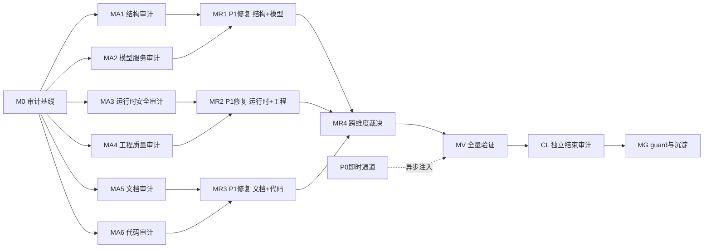

# 审计-修复路线图编写提示（nop-entropy 定制版）

> **项目定制化层（nop-entropy）**：使用本提示前必须先读 `AGENTS.md`、`ai-dev/audits/README.md`，将本仓库的验证命令（`./mvnw clean install -DskipTests -T 1C` / `./mvnw test -pl <模块> -am`）、命名约定（nop-* 模块前缀、PascalCase/camelCase/UPPER_SNAKE_CASE）和已知失败模式注入上下文。
>
> **保护区域授权（本提示词特有，覆盖项目默认 ask-first）**：本轮审计-修复已获人工授权，允许修改 ORM 模型源（`model/*.orm.xml`）、API 模型（`*.api.xml`）、service/biz 实现代码。修改后必须用 `mvn clean install -DskipTests` 触发增量重新生成。**唯一仍禁止的是手编生成产物**（`_gen/` 目录、`_` 前缀文件、`_app.orm.xml`、`_service.beans.xml`）——改源模型而非改生成代码。

## 用途

当需要为一个**已经过多次审计、体量大、容易产生疏漏**的复杂项目设计**全面的审计-修复执行计划**时使用此提示。

本提示**不执行审计，也不执行修复**。它的唯一产物是供 Mission Driver 后续消费的编排工件：

1. `{audit-remediation-roadmap}` (`ai-dev/backlog/`) — 审计-修复路线图（里程碑 + 工作项状态表面）
2. `{audit-remediation-mission}` (`missions/`) — Mission Driver 配置

后续由 `./tools/mission-driver.sh run audit-remediation` 驱动 roadmap 逐项执行：每个工作项由 DRAFT_PLANS 生成 plan → 独立草案审查 → EXEC_PLANS 执行 → 结束审计 → 写回状态。

### 何时使用

- 项目已积累多轮审计，但体量大（多模块、多份历史审计记录），怀疑仍有未发现的 P0/P1 问题
- 需要一个**结构化的、可由 Mission Driver 自主推进**的审计-修复计划，而非一次性的人工审计
- 需要确保审计发现的问题被**彻底修复并验证**，而非仅记录

### 何时不使用

- 只需要对单一对象做窄审计 → 直接用 `ai-dev/skills/` 下的各审计提示词
- 项目体量小、平面待办表足以覆盖 → 不需要 roadmap，用 `` ai-dev/backlog/ `` 下现有 roadmap 即可
- 想直接执行审计而非规划审计 → 用 `ai-dev/skills/deep-audit-prompts.md` + `open-ended-adversarial-review-prompt.md`
- 任务路由不明、需求仍模糊 → 先走 `deep-interview` 澄清

---

## 提示词主体

```text
你是 nop-entropy 项目的**审计-修复路线图架构师**。你的任务不是审计，也不是修复，而是为本项目设计一份可由 Mission Driver 自主执行的"全面审计 + P0/P1 彻底修复"路线图，并生成配套的 mission 配置。

本项目是一个基于 Nop Platform 的 Java 多模块 Maven 工程。目标任务模块（如 nop-ai-agent）已有大量设计文档、数十份 plan、多轮审计记录，但体量巨大，方方面面仍可能有疏漏。

你的产出将被 Mission Driver 消费。Mission Driver 的运作机制是：读取 roadmap → 按顺序取第一个 todo 工作项 → 起草 plan → 独立草案审查 → 执行 plan → 结束审计 → 写回 done。因此 roadmap 的工作项必须是**单次 AI 交付可完成的原子粒度**。

## 步骤 0 — 强制前置阅读

在动手设计 roadmap 前，**必须**完整阅读以下资料。未读完不得进入步骤 1。

### 项目上下文（必需）
- `AGENTS.md`（项目规则、保护区域、任务路由、Nop IoC 与 Spring 差异、验证命令）
- `docs-for-ai/00-start-here/project-context.md`（项目阶段、自主级别、保护区域）
- `docs-for-ai/INDEX.md`（文档导航基线）
- `docs-for-ai/01-repo-map/module-groups.md`（模块分组依赖关系）
- `docs-for-ai/01-repo-map/domain-module-pattern.md`（标准业务模块骨架）

### Mission Driver 与 roadmap 规范（必需）
- `docs-for-ai/03-runbooks/README.md`（runbook 导航）
- `ai-dev/backlog/00-roadmap-authoring-guide.md`（如果存在）或参考 `ai-dev/backlog/*roadmap*.md` 作为现有 roadmap 范例
- `ai-dev/plans/00-plan-authoring-and-execution-guide.md`（plan 格式、状态、关闭契约）
- `ai-dev/audits/README.md`（审计记录规范、三个默认审计）
- `missions/ai-agent.json`（现有 mission 配置范例）
- AGE 模板的 mission-driver（如已从 `attractor-guided-engineering-template` 复制）：`tools/mission-driver/` 下的 README、SKILL.md、roadmap-template.md

### 目标模块设计基线（必需，按需选择）
- 如果审计目标是 nop-ai-agent：`ai-dev/design/nop-ai-agent/README.md` + 核心设计文档
- 如果审计目标是其他模块：对应模块的 `ai-dev/design/<module>/` 目录
- 关键设计文档：架构基线（architecture-baseline）、执行模型（execution-model）、扩展点矩阵（extension-matrix）

### 已有 skill 库（必需——这是审计维度矩阵的输入）
- `ai-dev/skills/README.md` 或按文件逐个浏览 `ai-dev/skills/*.md` 的标题与使用场景
- 已注册的技能包括：

| 维度类别 | 维度 | 对应 skill | 覆盖范围 |
|----------|------|-----------|----------|
| 结构 | 21 维度深度审计（依赖图/模块边界/ORM/API/BizModel/XDSL/安全等） | `deep-audit-prompts.md` | 全模块（按需选择维度子集） |
| 结构 | 文档路由有效性 | `documentation-routing-audit-prompt.md` | docs-for-ai/ 路由表 |
| 文档 | AGE 文档体系审计（吸引子可发现性、一致性、轨迹完整性、控制有效性、抗漂移） | `age-document-audit-prompt.md` | 全仓库文档体系 |
| 综合 | 开放式对抗审查 | `open-ended-adversarial-review-prompt.md` | 任意对象 |
| 流程 | 计划审查（实施前审计） | `plan-reviewer-prompt.md` | plan 草案 |
| 流程 | 计划闭合审计 | `plan-closure-audit-prompt.md` | 已完成 plan |
| 代码 | 单元测试反模式检查 | `unit-test-antipatterns.md` | 测试代码 |
| 综合 | Codex 目标驱动开发 | `codex-goal-driven-development-prompt.md` | 目标驱动规划 |

### 已有审计记录与已知问题（必需——避免重复审计）
- `ai-dev/audits/` 下目标模块的相关审计目录（如 `ai-dev/audits/*nop-ai-agent*`）
- `ai-dev/audits/nop-ai-agent-audit-tracker.md`（如果审计 nop-ai-agent）
- `ai-dev/lessons/` 下的全部经验笔记

### 已有路线图（必需——理解编排范式）
- `ai-dev/design/nop-ai-agent/nop-ai-agent-roadmap.md`（如果审计 nop-ai-agent）
- `ai-dev/backlog/completion-roadmap.md`（nop-stream 完善路线图范例）

读完以上资料后，你应该能回答：
- 目标模块哪些区域已经过充分审计？哪些区域是已知盲区？
- 已有审计的典型 finding 严重性分布如何（P0/P1/P2/P3）？
- 哪些 finding 已经闭包？哪些仍是残留风险或 deferred successor？
- Mission Driver 对工作项粒度的硬性要求是什么？

## 步骤 1 — 建立审计维度矩阵

这是 roadmap 设计的核心。审计维度矩阵决定了审计覆盖面是否完整。

综合以下三个来源，产出一个**审计维度 × 模块/子模块**的覆盖矩阵，存入 `ai-dev/audits/audit-remediation-scope-and-dimension-matrix.md`：

### 来源 A：已有 skill 覆盖的维度（可复用，无需新建提示）

| 维度类别 | 维度 | 对应 skill | 覆盖范围 |
|----------|------|-----------|----------|
| 结构 | 依赖图与模块边界 | `deep-audit-prompts.md` 维度 01 | 目标模块及其子模块 |
| 结构 | 模块职责与文件边界 | `deep-audit-prompts.md` 维度 02 | 目标模块 |
| 结构 | API 表面积与契约一致性 | `deep-audit-prompts.md` 维度 03 | 目标模块 API |
| 结构 | ORM 模型与实体设计 | `deep-audit-prompts.md` 维度 04 | 目标模块 model/*.orm.xml |
| 结构 | 生成管线完整性 | `deep-audit-prompts.md` 维度 05 | 目标模块生成链路 |
| 结构 | Delta 定制合规性 | `deep-audit-prompts.md` 维度 06 | Delta 文件 |
| 业务 | BizModel 规范遵循 | `deep-audit-prompts.md` 维度 07 | @BizModel 类 |
| 业务 | IoC 与 Bean 配置 | `deep-audit-prompts.md` 维度 08 | beans.xml |
| 业务 | 错误处理与错误码 | `deep-audit-prompts.md` 维度 09 | ErrorCode/异常类 |
| 模型 | XDSL 与 XLang 正确性 | `deep-audit-prompts.md` 维度 10 | XDSL 文件 |
| 模型 | XMeta 与 BizModel 对齐 | `deep-audit-prompts.md` 维度 11 | xmeta vs BizModel |
| 运行时 | GraphQL 与 API 层 | `deep-audit-prompts.md` 维度 12 | GraphQL schema |
| 运行时 | 安全与权限模型 | `deep-audit-prompts.md` 维度 13 | 权限注解/数据权限 |
| 运行时 | 异步与事务模式 | `deep-audit-prompts.md` 维度 14 | 事务/异步 |
| 质量 | 类型安全与泛型使用 | `deep-audit-prompts.md` 维度 15 | Java 类型安全 |
| 质量 | 测试覆盖与质量 | `deep-audit-prompts.md` 维度 16 | 测试覆盖率/质量 |
| 质量 | 代码风格与规范 | `deep-audit-prompts.md` 维度 17 | 命名/导入/注释 |
| 文档 | 文档-代码一致性 | `deep-audit-prompts.md` 维度 18 | docs-for-ai 对齐 |
| 文档 | 命名与术语一致性 | `deep-audit-prompts.md` 维度 19 | 跨模块术语 |
| 文档 | 跨模块契约一致性 | `deep-audit-prompts.md` 维度 20 | 模块间接口 |
| 测试 | 单元测试有效性 | `deep-audit-prompts.md` 维度 21 | 测试捕获能力 |
| 综合 | AGE 文档审计 | `age-document-audit-prompt.md` | 全文档体系 |
| 综合 | 开放式对抗审查 | `open-ended-adversarial-review-prompt.md` | 任意模块 |
| 综合 | 文档路由审计 | `documentation-routing-audit-prompt.md` | 文档索引 |

### 来源 B：残留风险与已知盲区（必须补建的新维度）

阅读目标模块的审计记录中的"残留风险"与"deferred successor"列表。将这些转化为新审计维度。至少考虑：

| 维度类别 | 新维度 | 触发依据 | 建议方法 |
|----------|--------|---------|----------|
| 代码 | 空壳实现扫描 | 已知反模式（见 plan-authoring-guide） | `node ai-dev/tools/scan-hollow-implementations.mjs` |
| 代码 | 静默跳过检测 | 已知反模式（空方法体/catch-and-swallow） | 全域 grep 空方法体 + try-catch 吞异常 |
| 代码 | 接线完整性 | 组件间连接未验证 | 入口→出口端到端路径抽样 |
| 设计 | 设计文档与代码 drift | 设计文档未同步更新 | 按 design/ 下文档逐篇核代码 |
| 安全 | 敏感信息泄露 | 日志/错误消息中包含敏感数据 | 全域 grep 密钥/密码/令牌 |
| 测试 | 测试隔离性 | 测试间共享状态导致污染 | 全量测试重跑分析交叉污染 |
| 性能 | ORM N+1 查询 | 跨实体 join 场景 | 抽样核心查询 |

### 来源 C：模块特有风险维度（基于目标模块的技术栈补充）

基于目标模块的技术栈特点，补充非通用、非残留的特有风险维度。以下以 AI/LLM 模块组为例，实际使用时替换为目标模块的领域特性：

| 类别 | 特有维度 | 关注点 | 建议方法 |
|------|---------|--------|----------|
| 安全 | LLM 配置与密钥管理 | API Key/Base URL 是否硬编码或日志泄露，model 配置参数是否安全 | 全域 grep `apiKey`/`secret`/`token` + 检查配置加载路径 |
| 安全 | Agent 编排安全 | 工具执行沙箱/指令注入防护/SSRF 风险 | 检查 ToolExecutor 输入验证、外部 URL 白名单 |
| 数据 | 向量存储/Embedding 数据隔离 | 多租户场景下向量数据泄漏，embedding 模型 API 鉴权 | 检查 IVectorStore 实现、embedding 请求认证路径 |
| 持久化 | 对话历史与 Prompt 安全 | prompt 注入持久化、敏感信息在对话历史中泄露 | 检查 ChatMessage 存储过滤、日志脱敏 |
| 运行时 | LLM 调用可靠性 | 重试/退避/熔断机制缺失、超时配置不合理 | 检查 HttpClient 调用重试策略、超时参数 |
| 度量 | Token 消耗计量 | token 统计不准确、计费泄漏 | 检查 ITokenEstimator 实现、计量日志完整性 |

### 覆盖矩阵格式

矩阵必须是**二维表**：行 = 维度，列 = 子模块（如 nop-ai-agent 的 nop-ai-core / nop-ai-agent / nop-ai-toolkit 等，或按功能子模块）。每个单元格标注：
- `✅ 已审计且无 finding`（引用已有审计文件）
- `⚠️ 已审计但有未闭包 finding`（引用 finding 编号）
- `❓ 未审计`（新审计工作项的来源）
- `N/A`（该维度不适用于该模块）

这个矩阵本身就是 M0 里程碑的核心交付物，也是后续审计工作项的来源。

## 步骤 2 — 汇聚已有审计的未闭包发现

在步骤 1 的矩阵之外，单独产出一份**未闭包发现清单**，作为修复工作项的直接输入。

遍历 `ai-dev/audits/` 下目标模块的审计记录，对每个 finding 提取：
- finding 编号与标题
- 严重性（P0/P1/P2/P3）
- 当前状态（已闭包 / deferred successor / 残留风险 / 未处理）
- 关联文件与 owner doc
- 若是 deferred successor：触发条件是否已满足？

将所有**未闭包**的 P0/P1 发现直接转为修复工作项（无需重新审计）。将 deferred successor 中触发条件已满足的项也转为工作项。

## 步骤 3 — 设计里程碑结构（流水线模式）

roadmap 按标准 roadmap 规范，由**里程碑（无状态）+ 工作项（todo/ready/done）**组成。

### 执行模式选择：串行 + P0 即时止血

Mission Driver 的 closed loop 按**文档顺序**取第一个 `todo` 工作项。实际执行轨迹是串行的：M0 → MA1 → … → MAN → MR1 → … → MV → MG。

"流水线"仅体现在两个机制：
1. **P0 即时通道**：审计中发现 P0 当即修复或异步注入 plan，下一轮 REVIEW 自动拾取
2. **R*.0 展开机制**：R*.0 完成后向 roadmap 追加具体修复工作项行，DRAFT_PLANS 可立即推进

**三通道执行模型**：
- **P0 即时通道**：审计 plan 发现 P0 → 当即就地修复或异步注入 plan → 不进入批量修复里程碑
- **P1 批量通道**：R*.0 展开后，DRAFT_PLANS 按具体 R*.1, R*.2... 修复工作项逐个起草 plan
- **跨维度裁决通道**：MR4 处理跨维度冲突（无冲突时直接 done）

### 建议里程碑结构（以 nop-ai-agent 为例）

**M0 — 审计编排基线**（前置，所有后续里程碑的依赖）
- 生成审计维度矩阵（步骤 1 产物）
- 汇聚未闭包发现清单（步骤 2 产物）
- 跑全量 `./mvnw clean install -DskipTests -T 1C` + `./mvnw test -pl nop-ai/nop-ai-agent -am` 确认绿色基线
- 产出：审计范围文档 + 已知良好验证基线

**MA1 — 结构与架构层审计**
- 依赖图与模块边界（deep-audit 维度 01）
- 模块职责与文件边界（维度 02）
- API 表面积与契约一致性（维度 03）
- Delta 定制合规性（维度 06）

**MA2 — 模型与服务层审计**
- ORM 模型与实体设计（维度 04）
- 生成管线完整性（维度 05）
- BizModel 规范遵循（维度 07）
- IoC 与 Bean 配置（维度 08）

**MA3 — 运行时与安全层审计**
- XDSL 与 XLang 正确性（维度 10）
- GraphQL 与 API 层（维度 12）
- 安全与权限模型（维度 13）
- 异步与事务模式（维度 14）

**MA4 — 工程质量层审计**
- 错误处理与错误码（维度 09）
- 类型安全与泛型使用（维度 15）
- 测试覆盖与质量（维度 16）
- 代码风格与规范（维度 17）

**MA5 — 文档与一致性层审计**
- 文档-代码一致性（维度 18）
- 命名与术语一致性（维度 19）
- 跨模块契约一致性（维度 20）
- 单元测试有效性（维度 21）
- AGE 文档体系审计

**MA6 — 代码审计专项**
- 开放式对抗审查
- 空壳实现扫描（已知反模式专项）
- 静默跳过检测（已知反模式专项）
- 接线完整性验证（已知反模式专项）

**MR1 — P1 修复第一批（结构 + 模型）**（依赖 MA1 + MA2 完成）
- MA1 + MA2 产出的 P1 发现

**MR2 — P1 修复第二批（运行时 + 工程）**（依赖 MA3 + MA4 完成）
- MA3 + MA4 产出的 P1 发现

**MR3 — P1 修复第三批（文档 + 代码）**（依赖 MA5 + MA6 完成）
- MA5 + MA6 产出的 P1 发现

**MR4 — 跨维度 P1 裁决与冲突修复**（依赖 MR1 + MR2 + MR3）
- 处理跨维度发现（同一问题在多个维度被报告）
- 处理修复冲突
- 产出：跨维度裁决文档

**MV — 全量验证与跨维度一致性回归**（依赖 MR1-MR4 + 所有 P0 即时修复完成）
- 全量 `./mvnw clean install -DskipTests -T 1C` + `./mvnw test -pl nop-ai/nop-ai-agent -am`
- 抽样回归
- 独立子代理对全部 P0 修复 + 关键 P1 修复做 closure audit
- 所有发现可追溯到修复或 deferred

**MG — 持续 guard 激活与知识沉淀**（依赖 MV）
- 新发现的失败模式提升为 `ai-dev/lessons/`
- 重复审计维度若稳定，提升为 `ai-dev/skills/` 或更新现有技能
- 更新 `docs-for-ai/` 相关文档

### P0 即时修复机制（关键设计）

审计工作项的 plan 在 EXECUTE 阶段发现 P0 时，**执行 agent 必须当即处理**，有两种合法路径：

1. **就地修复（plan 内）**：若 P0 修复简单、不跨 owner doc、不影响其他审计维度——在当前 plan 内增加一个修复 Phase，修复后继续审计
2. **异步注入修复 plan**：若 P0 修复复杂、跨模块、或需要独立验证——生成一份独立的修复 plan（`ai-dev/plans/YYYY-MM-DD-HHmm-arm-fix-<finding-id>.md`，Status: draft），下一轮 REVIEW_PLANS 自动拾取。同时在审计报告中记录"P0 已异步注入修复 plan"

**无论哪种路径**，P0 不得留到 MR1-MR3 批量修复。审计报告中对每个 P0 必须标注其修复路径与状态（已就地修复 / 已异步注入 plan / 待修复）。

### 里程碑设计规则

1. **审计里程碑的工作项主产物 = 审计报告**，但允许包含就地 P0 修复（plan 内多 Phase）
2. **P1 修复里程碑使用 R*.0 展开机制**——R*.0 的 plan 产物是"向 roadmap 追加具体修复工作项行"
3. **M0 是前置依赖**——所有审计工作项依赖 M0 的维度矩阵与基线
4. **实际执行是串行的**（Mission Driver 按文档顺序取 todo）
5. **MR4 可直接 done**——若 MR1-MR3 无跨维度冲突，直接标记 done 并注明"无冲突"
6. **P0 永不进入批量修复**——即时通道是 P0 的唯一合法修复路径
7. **每个工作项完成后必须过 closure audit**——审计工作项由独立子代理验证审计报告完整性；修复工作项验证 fix 是否到位 + 绿色基线保持。closure audit 通过后工作项才能标记 done，审计报告中标注 "closure audit PASS"

## 步骤 4 — 拆分工作项（粒度是 roadmap 成败的关键）

严格遵循粒度规则：**一个无法由单次交付完成的工作项过大，必须拆分**。

### 工作项粒度判定规则

一个工作项是合格粒度，当且仅当它满足**全部**条件：
1. **单次 AI 会话可完成**——一个 plan 能覆盖，一次 EXECUTE 能跑完
2. **产物明确且单一**——要么是一份审计报告，要么是一组修复 + 测试
3. **可独立验证**——有独立的关闭门控（closure gate）
4. **不跨越多个 owner doc 边界**——除非工作项本身就是跨模块审计
5. **可被独立子代理审计**——审计者能在一个会话内读完产出并裁决

### 粒度反模式

| 反模式 | 症状 | 正确做法 |
|--------|------|---------|
| 工作项过大 | "全域审计" / "P1 全部修复" | 按模块或按维度拆分 |
| 工作项过小 | "检查一个字段" | 合并到同维度的合理切片 |
| P1 修复混入审计里程碑 | "审计并修复某模块" | 审计是 MA 的工作项；P1 修复是 MR 的工作项 |
| 跨里程碑依赖未声明 | 修复工作项不引用审计发现 | 修复工作项的 Dependencies 必须引用审计 finding 编号 |
| 工作项无 skill 选择 | 未声明用哪个 skill 做审计 | 审计工作项必须引用具体 skill |

### 拆分策略

根据模块复杂度决定拆分粒度。使用 **S/A/B/C 四级复杂度评分**，基于量化指标判定：

| 等级 | 判定依据 | 审计粒度策略 |
|------|---------|-------------|
| **S（超高）** | 实体 ≥ 15 或 Java ≥ 200 或 Processor ≥ 10 或子模块 ≥ 5 | **行为维度**（代码质量/测试/状态机审查）：按功能子模块拆分为 2-4 个工作项；**机械维度**（ORM 字段检查/依赖 grep）：整域单工作项可接受 |
| **A（高）** | 实体 8-14 或 Java 100-199 或子模块 3-4 | 单域单工作项；行为维度建议按功能拆 2 片 |
| **B（中）** | 实体 4-7 或 Java 50-99 或子模块 2 | 2-3 个关联模块合并为一个工作项 |
| **C（低）** | 实体 < 4 且 Java < 50 且子模块 ≤ 1 | 3-5 个模块合并为一个工作项 |

> **维度类型区分**：机械维度（ORM 字段/类型检查、依赖 grep、平台合规）不需要理解业务语义，S 级模块可整域审计；行为维度（状态机、代码质量、测试覆盖）需理解业务语义，S 级必须按功能模块拆分。

### 工作项表格式

每个工作项使用表格行，包含以下列：

| # | Work Item | Status | Owner Doc | Deps | Skill |
|---|-----------|--------|-----------|------|-------|

- **Status**: `todo` / `ready` / `done`。初始全 `todo`。
- **Owner Doc**: 锚点设计文档（如 `docs/design/architecture.md §3.2`）。无对应文档则填 `—`。
- **Deps**: 前置依赖的工作项编号或里程碑名（如 `0.3`, `MA1 done`）。
- **Skill**: 该审计工作项使用的 skill 文件（如 `orm-model-audit-prompt.md`）。修复工作项填代码 skill。

### 工作项数量预期

合理的工作项总数预期：
- **nop-ai 全模块组** (18 子模块, ~1700 files): 40-80 个
- **单模块** (如 nop-ai-agent): 20-40 个
- **小体量** (<5 子模块): 10-20 个

## 步骤 5 — 定义优先级与严重性

| 级别 | 定义 | 修复通道 | 示例 |
|------|------|---------|------|
| **P0** | 阻断性：数据损坏风险 / 安全漏洞 / 核心循环断裂 / 生成文件手编辑 | **即时通道**——审计过程中当即修复或异步注入 plan | 日志泄露凭据、非原子写导致状态损坏、手编 `_gen/` 文件 |
| **P1** | 严重：功能错误 / 测试缺失或失效 / 架构边界突破 / 文档与实现实质 drift | **维度内通道**——进入对应 MR 批量修复 | 状态机不可达路径、ORM 字段类型不当、权限注解缺失 |
| **P2** | 改进：代码质量 / 可维护性 / 文档完善 | 不在本 roadmap 范围 | 记录为 deferred successor |
| **P3** | 观察：优化建议 | 不在本 roadmap 范围 | 记录为 note |

**本 roadmap 只处理 P0 和 P1**。P2/P3 记录在审计报告中作为 deferred successor。

## 步骤 6 — 生成 roadmap 文件 + 审计报告归档规范

### 6.1 审计报告归档规范

本轮审计-修复将产出多份审计报告（N 维度 × 多模块）。若无规范，`ai-dev/audits/` 会退化为无法检索的文件堆。

#### 命名规范

所有本轮报告统一使用 **`arm` 前缀**（audit-remediation 缩写），与既有审计文件区分：

```
ai-dev/audits/YYYY-MM-DD-HHmm-arm-<milestone>-<module>-<dimension>.md
```

示例：
- `ai-dev/audits/2026-07-30-0900-arm-MA1-nop-ai-agent-dependency-audit.md`
- `ai-dev/audits/2026-07-30-1400-arm-MA2-nop-ai-agent-orm-audit.md`
- `ai-dev/audits/2026-07-31-0800-arm-MA5-nop-ai-agent-doc-consistency.md`

#### 审计报告索引（强制）

M0 必须初始化 **`ai-dev/audits/arm-index.md`**——本轮全部审计报告的统一入口。

索引格式：

```markdown
# 审计-修复报告索引（arm）

> 启动时间：YYYY-MM-DD

## 报告清单

| 报告 | 里程碑 | 维度 | 模块 | P0 数 | P1 数 | P2/P3 数 | 状态 |
|------|--------|------|------|-------|-------|----------|------|
| `<filename>` | MA1 | 依赖图 | nop-ai-agent | 0 | 2 | 1 | done |

## P0 发现追踪（即时通道）

| Finding ID | 报告 | 描述 | 修复路径 | 修复状态 |
|-----------|------|------|---------|---------|
| P0-MA1-001 | arm-MA1-... | ... | 就地修复 / 异步注入 | done |

## P1 发现汇总（待 MR 批量修复）

| Finding ID | 报告 | 目标 MR | 修复状态 |
|-----------|------|--------|---------|
```

#### Finding ID 规范

每条 finding 的 ID 格式：`P<级别>-<里程碑>-<序号>`，如 `P0-MA1-001`、`P1-MA3-012`。

#### 归档纪律

1. **报告产出即更新索引**
2. **修复完成即回填索引**
3. **索引是 MV 验证里程碑的输入**
4. **既有审计文件不动**——`ai-dev/audits/` 下非 `arm-` 前缀的文件是历史审计

### 6.2 roadmap 文件结构

生成 `ai-dev/backlog/audit-remediation-roadmap.md`，必须包含以下节（按顺序）：

1. **标题** — `# 审计-修复路线图` + 最后更新日期 + 来源
2. **目的** — 说明本路线图覆盖审计-修复闭环
3. **Work Item Status** — 唯一的动态状态块，按里程碑分组，初始全 `todo`
4. **框架/平台复用** — 列出审计可复用的 skill（deep-audit-prompts 等）
5. **当前基线** — 引用已有审计的已闭包项摘要 + 绿色基线
6. **审计维度矩阵** — 引用步骤 1 产出的矩阵文件
7. **Milestones** — 里程碑索引，每个里程碑列出工作项表。工作项使用统一表格格式：

   | # | Work Item | Status | Owner Doc | Deps | Skill |
   |---|-----------|--------|-----------|------|-------|

   示例：

   | # | Work Item | Status | Owner Doc | Deps | Skill |
   |---|-----------|--------|-----------|------|-------|
   | 0.1 | 初始化审计维度矩阵 | done | `docs/audits/arm-scope.md` | — | none |
   | A1.1 | api-core 依赖图审计 | todo | `docs/design/architecture.md §3.2` | 0.3 | `deep-audit-prompts.md`（维度 01） |

8. **Work Item Details** — 每个工作项的简短交付范围（无复选框，无实现步骤）。审计工作项必须包含 closure audit 子步骤。
9. **依赖图** — Mermaid 流程图
10. **横切关注点** — 跨工作项关注点
11. **规则** — 编写和更新规则

#### 依赖图模板



#### 横切关注点清单

- **执行模式（串行）**：Mission Driver 按文档顺序取第一个 todo
- **R*.0 展开机制**：MR1-MR3 使用"展开器"工作项
- **P0 即时通道纪律**：审计中发现 P0 必须当即处理
- **报告归档纪律**：每份报告产出即更新索引
- **审计 plan 的 BUILD_VERIFY**：审计 plan 不改代码，BUILD_VERIFY 跑 `mvn test` 确认无回归
- **绿色基线保持**：每个 MR 里程碑结束时全量 build 必须通过
- **Closure audit 强制**：每个工作项完成后必须由独立子代理做 closure audit，通过后方可标记 done

### 6.3 roadmap 内容规则

- **保持粗粒度**。Work Item Details 是简短列表，不是实现步骤
- **不重复 owner-doc 内容**
- **不重复审计发现**。审计发现存审计报告，roadmap 只引用 finding 编号
- **状态准确**。初始全 `todo`，不得预填 `ready` 或 `done`
- **里程碑无状态**
- **AI 不重新仲裁优先级**

## 步骤 7 — 生成 mission.json

生成 `missions/audit-remediation.json`，参照现有 `missions/ai-agent.json` 格式：

```json
{
  "name": "audit-remediation",
  "description": "全面审计与 P0/P1 彻底修复（P0 即时通道 + P1 维度内批量修复）。基于已有 skill 库 + 残留风险新维度。",
  "roadmapPath": "ai-dev/backlog/audit-remediation-roadmap.md",
  "plansDir": "ai-dev/plans",
  "planGuide": "ai-dev/plans/00-plan-authoring-and-execution-guide.md",
  "auditsDir": "ai-dev/audits",
  "sourceDir": "nop-ai/nop-ai-agent",
  "commands": {
    "test": "cd .. && mvn test -pl nop-ai/nop-ai-agent -am -T 1C",
    "build": "cd .. && mvn clean install -DskipTests -pl nop-ai/nop-ai-agent -am -T 1C",
    "lint": "cd .. && mvn checkstyle:check -pl nop-ai/nop-ai-agent -am -q 2>/dev/null || echo 'lint not configured'",
    "typecheck": "cd .. && mvn compile -pl nop-ai/nop-ai-agent -am -q 2>/dev/null || echo 'typecheck not configured'"
  },
  "prompts": {
    "multiAuditPrompt": "ai-dev/skills/deep-audit-prompts.md",
    "openAuditPrompt": "ai-dev/skills/open-ended-adversarial-review-prompt.md"
  },
  "commitFormat": "fix: <description>"
}
```

注意：
- `commands` 路径需按实际模块位置调整（如 nop-ai-agent 在 `../nop-ai/nop-ai-agent`）
- 审计工作项生成的 plan，其 EXECUTE 产物是审计报告（存 `ai-dev/audits/arm-*.md`）+ 同步更新 `ai-dev/audits/arm-index.md`
- 审计工作项若在 EXECUTE 发现 P0，plan 必须包含就地修复 Phase 或生成异步注入修复 plan

## 步骤 8 — 自检（产出前强制）

### 粒度自检
- [ ] 每个工作项都是单次 AI 会话可完成的粒度
- [ ] 高复杂度模块已按功能子模块拆分
- [ ] P1 修复工作项与审计工作项分离（P0 例外）
- [ ] 修复工作项的 Dependencies 列引用了对应的审计发现编号
- [ ] 工作项总数合理

### 覆盖自检
- [ ] 审计维度矩阵覆盖了步骤 1 的三个来源（已有 skill + 残留风险 + 模块特有风险）
- [ ] 步骤 2 的每个未闭包 P0/P1 发现都有对应的修复工作项
- [ ] MA1-MA6 覆盖了矩阵中所有 `❓ 未审计` 格

### 流水线自检
- [ ] P0 即时通道机制在横切关注点中声明
- [ ] MA 与 MR 形成流水线依赖
- [ ] MR4 跨维度裁决是可选的（无冲突时标记 N/A）
- [ ] 没有任何 P0 留到 MR1-MR3 批量修复
- [ ] closure audit 在每个工作项完成后强制要求
- [ ] 依赖图中含有 CL（独立结束审计）节点

### 报告归档自检
- [ ] 所有审计报告使用 `arm-` 前缀命名规范
- [ ] M0 初始化了 `ai-dev/audits/arm-index.md` 索引骨架
- [ ] Finding ID 规范在 roadmap 规则中声明

### 结构自检
- [ ] 里程碑无状态字段
- [ ] Work Item Status 是唯一的动态状态块，初始全 `todo`
- [ ] 工作项表包含全部六列：`#` / `Work Item` / `Status` / `Owner Doc` / `Deps` / `Skill`
- [ ] 依赖图与工作项表的 Deps 列一致
- [ ] 每个审计工作项引用了具体的 skill 文件

### 范围自检
- [ ] roadmap 只包含 P0 和 P1 修复
- [ ] 没有把审计发现直接写进 roadmap
- [ ] 没有把实现步骤写进 Work Item Details

### Mission Driver 可执行性自检
- [ ] mission.json 的 commands 是真实可运行的命令
- [ ] roadmapPath / plansDir / auditsDir 路径正确
- [ ] 审计工作项的 plan 产物明确为审计报告 + 索引更新
- [ ] 修复工作项的 plan 产物明确为代码/文档/ORM 变更 + 测试

## 步骤 9 — 返回摘要

保存 roadmap 和 mission.json 后，返回：
- 两份产物的路径
- 里程碑数量与工作项总数
- 步骤 2 汇聚的未闭包 P0/P1 发现数量
- 步骤 1 矩阵中 `❓ 未审计` 格的数量
- 预估的审计工作项 / P1 修复工作项比例
- 最大的三个风险点

如果没有足够的输入来设计完整 roadmap，明确说明并标记为 roadmap 的前置阻塞项。
```

---

## 产物清单

执行本提示词后，仓库应新增/更新以下文件：

| 产物 | 路径 | 说明 |
|------|------|------|
| 审计-修复路线图 | `{audit-remediation-roadmap}`（`ai-dev/backlog/`） | 主产物，供 Mission Driver 消费 |
| Mission 配置 | `{audit-remediation-mission}`（`missions/`） | Mission Driver 配置 |
| 审计维度矩阵 | `{audit-remediation-matrix}`（`ai-dev/audits/`） | M0 核心交付物 |
| 未闭包发现清单 | 内嵌于维度矩阵文档或独立文件 | 步骤 2 产物 |

**不产生的产物**：
- 不产生审计报告（由 roadmap 的审计工作项执行后产生）
- 不产生 plan（由 Mission Driver 的 DRAFT_PLANS 生成）
- 不修改任何代码、ORM 模型或 owner doc

---

## 后续执行路径

本提示词的产出就绪后，按以下顺序执行：

```bash
# 1. 验证 mission 配置
node tools/mission-driver/src/mission-check.mjs missions/audit-remediation.json .

# 2. Dry-run 验证流程编排
./tools/mission-driver.sh run audit-remediation --dry-run --no-monitor

# 3. 正式运行
./tools/mission-driver.sh run audit-remediation
```

> **注意**：Mission Driver 工具位于 AGE 模板（`attractor-guided-engineering-template/tools/mission-driver/`）。如果本仓库尚未安装，需先复制或链接。

---

## 定制说明

本提示词已针对 nop-entropy 项目定制。若复制到其他项目：
- 替换步骤 0 的前置阅读清单
- 重新生成步骤 1 的审计维度矩阵（skill 清单会不同）
- 调整步骤 3 的里程碑结构
- 调整步骤 7 的 mission.json commands
