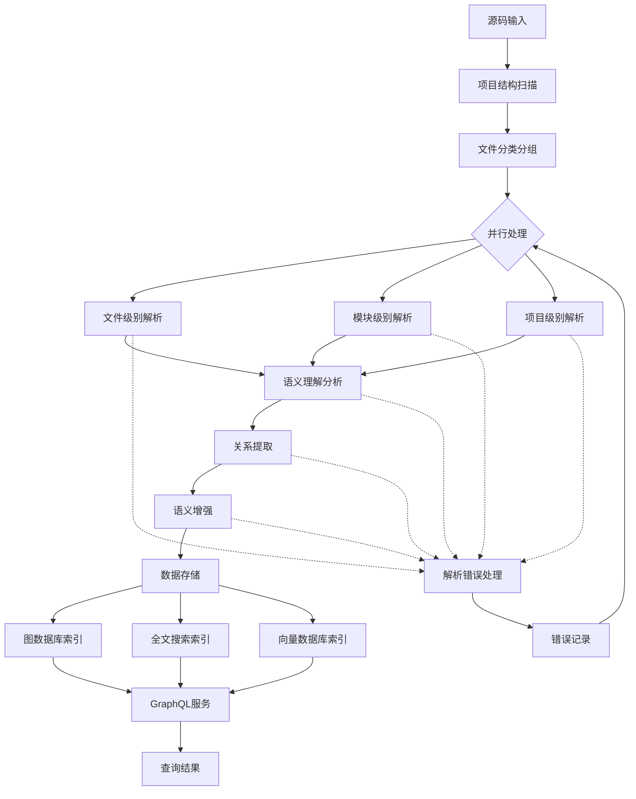

# AI源码分析预处理工作流

## 概述

本工作流采用AI直接解析源码的方式，跳过传统的AST解析，利用大语言模型的语义理解能力进行多层次源码分析。

## 完整工作流mermaid图

## 详细处理步骤说明

### 步骤1：项目结构扫描

**输入数据**：
- 项目根目录路径
- 文件类型过滤器（.java, .xml, .yml, .properties等）

**处理逻辑**：
1. 递归扫描项目目录结构
2. 识别Java源码文件、配置文件、构建文件
3. 构建项目模块依赖关系图
4. 生成文件清单和项目结构元数据

**输出数据**：
- 文件清单（包含文件路径、大小、修改时间）
- 项目结构树（模块、包、文件层次关系）
- 依赖关系图（模块间依赖关系）

**使用的提示词**：无（纯文件系统操作）

**错误处理**：
- 文件权限错误：记录并跳过
- 目录不存在：终止处理并报错
- 符号链接循环：检测并跳过

### 步骤2：文件分类和分组

**输入数据**：
- 步骤1生成的文件清单和项目结构

**处理逻辑**：
1. 按模块分组：基于Maven/Gradle模块结构
2. 按功能分组：基于包名和目录结构分析功能模块
3. 按类型分组：接口、实现类、工具类、配置类等
4. 按相关性分组：基于import语句和依赖关系

**输出数据**：
- 分组文件集合（模块组、功能组、类型组）
- 文件相关性矩阵
- 处理优先级队列

**使用的提示词**：无（基于规则的分组算法）

**错误处理**：
- 无法识别的文件类型：记录警告并归入其他类别
- 分组冲突：采用优先级策略解决

### 步骤3：并行处理 - 文件级别解析

**输入数据**：
- 单个Java文件内容
- 文件元数据（路径、大小、修改时间）

**处理逻辑**：
1. 读取文件完整内容
2. 识别类/接口定义结构
3. 提取方法签名和参数信息
4. 分析字段和属性定义
5. 提取注释和文档信息

**输出数据**：
- 类/接口结构信息
- 方法签名列表
- 字段属性信息
- 注释文档内容

**使用的提示词**：`docs/prompts/code-analysis.md` - **类结构分析模板**

**提示词参数填充**：
- `{代码内容}`：文件完整内容
- `{文件路径}`：文件相对路径

**输出格式**：JSON格式，符合 `config/ai-prompt-templates.xdef` 中的 `ClassStructureAnalysis` 模型

**错误处理**：
- 文件读取错误：记录错误并跳过
- AI解析失败：重试机制（最多3次）
- 格式解析错误：记录原始响应供人工检查

### 步骤4：并行处理 - 模块级别解析

**输入数据**：
- 模块内所有文件的结构信息
- 模块配置文件内容
- 模块依赖关系

**处理逻辑**：
1. 分析模块内类间关系
2. 识别模块的主要功能和职责
3. 分析模块的接口和对外依赖
4. 评估模块的复杂度和质量

**输出数据**：
- 模块功能描述
- 模块接口定义
- 模块依赖关系图
- 模块质量评估

**使用的提示词**：`docs/prompts/semantic-extraction.md` - **模块功能分析模板**

**提示词参数填充**：
- `{模块文件列表}`：模块内所有文件的结构化信息
- `{配置文件内容}`：模块相关配置文件
- `{依赖关系}`：模块的依赖信息

**输出格式**：JSON格式，符合 `config/ai-prompt-templates.xdef` 中的 `ModuleFunctionAnalysis` 模型

**错误处理**：
- 模块信息不完整：使用可用信息继续分析
- 依赖关系循环：检测并记录警告

### 步骤5：并行处理 - 项目级别解析

**输入数据**：
- 所有模块的分析结果
- 项目配置文件
- 项目整体结构

**处理逻辑**：
1. 分析项目整体架构模式
2. 识别项目的核心业务领域
3. 评估项目的技术栈和框架使用
4. 分析项目的部署和运维特性

**输出数据**：
- 项目架构描述
- 业务领域模型
- 技术栈分析
- 部署架构分析

**使用的提示词**：`docs/prompts/architecture-patterns.md` - **项目架构分析模板**

**提示词参数填充**：
- `{模块分析结果}`：所有模块的分析数据
- `{项目配置}`：项目级配置文件内容
- `{项目结构}`：项目整体组织结构

**输出格式**：JSON格式，符合 `config/ai-prompt-templates.xdef` 中的 `ProjectArchitectureAnalysis` 模型

**错误处理**：
- 架构模式识别困难：提供多个可能的模式选项
- 技术栈识别不全：基于已知信息进行推断

### 步骤6：语义理解分析

**输入数据**：
- 步骤3、4、5的解析结果
- 跨文件上下文信息

**处理逻辑**：
1. 深度理解代码语义和业务逻辑
2. 识别设计模式和架构模式
3. 分析代码复杂度和维护难度
4. 提取最佳实践和优化建议

**输出数据**：
- 语义功能描述
- 设计模式识别结果
- 复杂度评估报告
- 优化建议列表

**使用的提示词**：`docs/prompts/semantic-extraction.md` - **语义深度理解模板**

**提示词参数填充**：
- `{代码结构信息}`：所有解析的结构化数据
- `{业务上下文}`：基于项目分析的业务理解
- `{技术上下文}`：技术栈和框架信息

**输出格式**：JSON格式，符合 `config/ai-prompt-templates.xdef` 中的 `SemanticDeepUnderstanding` 模型

**错误处理**：
- 语义理解偏差：提供置信度评分
- 模式识别不确定：标记为待确认

### 步骤7：关系提取

**输入数据**：
- 所有解析的代码结构信息
- 语义理解结果

**处理逻辑**：
1. 提取方法调用关系链
2. 分析类依赖关系
3. 识别接口实现关系
4. 构建继承关系网络
5. 分析数据流关系

**输出数据**：
- 方法调用图
- 类依赖关系图
- 接口实现关系图
- 数据流关系图

**使用的提示词**：`docs/prompts/relationship-extraction.md` - **关系网络构建模板**

**提示词参数填充**：
- `{代码结构}`：完整的代码结构信息
- `{语义信息}`：语义理解结果
- `{调用上下文}`：跨文件调用信息

**输出格式**：JSON格式，符合 `config/ai-prompt-templates.xdef` 中的 `RelationshipNetwork` 模型

**错误处理**：
- 关系提取不完整：标记为部分关系
- 循环依赖：检测并记录警告

### 步骤8：语义增强

**输入数据**：
- 关系提取结果
- 语义理解结果

**处理逻辑**：
1. 生成功能摘要和使用说明
2. 创建典型使用场景示例
3. 提取最佳实践指南
4. 生成API文档片段
5. 创建测试用例建议

**输出数据**：
- 功能摘要文档
- 使用示例代码
- 最佳实践指南
- API文档片段
- 测试用例建议

**使用的提示词**：`docs/prompts/semantic-extraction.md` - **知识增强模板**

**提示词参数填充**：
- `{关系网络}`：关系提取结果
- `{语义理解}`：语义分析结果
- `{使用场景}`：基于业务上下文的使用场景

**输出格式**：JSON格式，符合 `config/ai-prompt-templates.xdef` 中的 `KnowledgeEnhancement` 模型

**错误处理**：
- 示例生成不准确：提供多个示例选项
- 文档质量不足：标记为需要人工审核

### 步骤9：数据存储

**输入数据**：
- 所有处理阶段的结果数据

**处理逻辑**：
1. 数据格式标准化和验证
2. 数据关系完整性检查
3. 数据分片和批量存储
4. 存储事务管理

**输出数据**：
- 标准化的数据记录
- 存储操作日志
- 数据质量报告

**使用的提示词**：无（数据存储操作）

**错误处理**：
- 数据格式错误：记录并跳过无效数据
- 存储失败：重试机制和事务回滚
- 数据一致性错误：数据校验和修复

### 步骤10：图数据库索引（Neo4j）

**输入数据**：
- 标准化的数据记录

**处理逻辑**：
1. 创建节点和关系索引
2. 构建图查询优化结构
3. 设置节点属性索引
4. 配置关系类型索引

**输出数据**：
- Neo4j图数据库索引
- 图查询优化结构
- 索引性能统计

**使用的提示词**：无（数据库索引操作）

**错误处理**：
- 索引构建失败：记录错误并尝试重建
- 性能问题：索引优化和调整

### 步骤11：全文搜索索引（Elasticsearch）

**输入数据**：
- 标准化的数据记录
- 文本内容（源码、注释、文档）

**处理逻辑**：
1. 文本分词和分析
2. 创建倒排索引
3. 配置同义词扩展
4. 设置相关性评分

**输出数据**：
- Elasticsearch全文索引
- 分词器配置
- 搜索优化配置

**使用的提示词**：无（搜索引擎操作）

**错误处理**：
- 分词错误：使用默认分词器
- 索引性能问题：分片和副本调整

### 步骤12：向量数据库索引

**输入数据**：
- 语义向量数据
- 功能描述文本

**处理逻辑**：
1. 语义向量生成和标准化
2. 向量索引构建（HNSW/IVF）
3. 相似度计算配置
4. 聚类分析设置

**输出数据**：
- 向量数据库索引
- 相似度搜索配置
- 聚类分析结果

**使用的提示词**：无（向量数据库操作）

**错误处理**：
- 向量生成失败：使用备用模型
- 索引构建错误：重新生成向量

### 步骤13：GraphQL服务提供

**输入数据**：
- 所有索引数据
- 查询请求

**处理逻辑**：
1. GraphQL查询解析和验证
2. 多存储查询协调
3. 结果聚合和排序
4. 分页和缓存处理

**输出数据**：
- 查询结果数据
- 查询性能统计
- 缓存命中信息

**使用的提示词**：无（服务接口操作）

**错误处理**：
- 查询语法错误：返回详细的错误信息
- 查询超时：超时控制和结果限制
- 存储不可用：降级服务和错误提示

## 性能优化策略

### 并行处理策略
- **文件级别并行**：多个文件同时处理，最大并发数可配置
- **模块级别并行**：不同模块独立分析，互不干扰
- **流水线处理**：解析、关系、语义分阶段并行处理

### 缓存策略
- **解析结果缓存**：避免重复解析相同文件
- **关系网络缓存**：缓存构建的关系图，支持增量更新
- **语义向量缓存**：缓存生成的语义向量，提高查询性能

### 增量处理机制
- **文件变更检测**：基于文件哈希和修改时间检测变更
- **关系增量更新**：只更新受影响的关系网络部分
- **索引增量构建**：只重建变更部分的索引，减少重建时间

## 错误处理和容错机制

### 解析错误处理
- **语法错误容忍**：跳过无法解析的文件，记录错误日志
- **部分解析支持**：即使部分错误也能继续处理其他部分
- **错误恢复机制**：记录错误并继续处理其他文件，支持重试

### 数据一致性保障
- **事务性操作**：确保数据的一致性，支持回滚
- **数据校验**：验证生成的数据质量，标记可疑数据
- **备份机制**：定期备份处理结果，支持数据恢复

## 监控和日志系统

### 处理进度监控
- **文件处理进度**：实时跟踪每个文件的处理状态
- **关系构建进度**：监控关系网络的构建进度和复杂度
- **索引构建进度**：跟踪索引构建的完成情况和性能

### 性能指标收集
- **处理时间**：每个阶段的处理时间统计和分析
- **内存使用**：内存使用情况监控和优化建议
- **存储占用**：存储空间使用情况和增长预测

这个工作流设计充分利用了AI的语义理解能力，避免了传统AST解析的复杂性，同时提供了详细的步骤说明和mermaid流程图，为后续的智能查询和分析提供了坚实的基础。