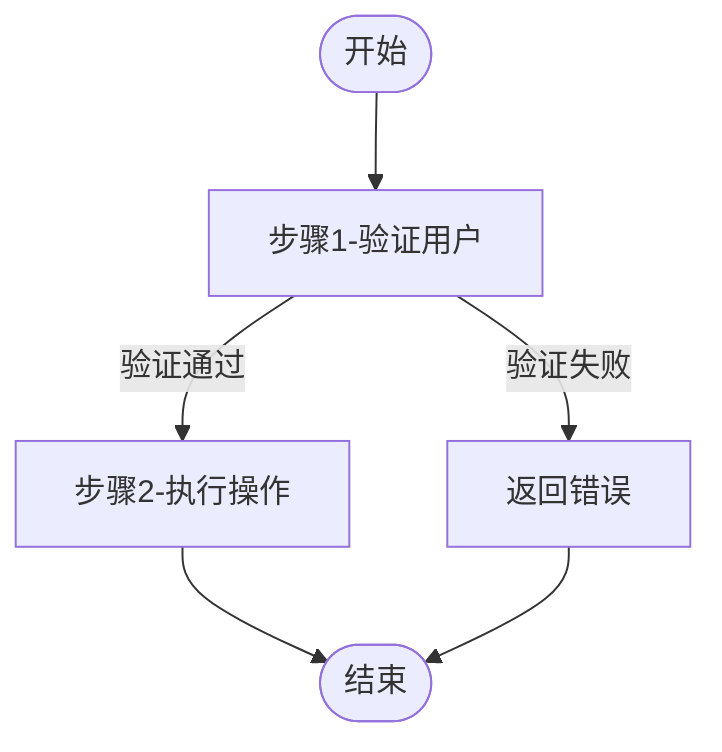

# 从Java项目反向生成业务需求文档

## 目标

深入分析指定的Java后端项目，理解其业务逻辑，并反向抽取出与技术实现无关的纯业务需求文档。生成的文档应达到专业需求规格说明书的深度和完整性，可直接用于指导任何技术栈的开发。

## 分析范围

### 1. 项目结构分析

- 识别核心业务模块（按业务功能划分，而非技术模块）
- 理解模块之间的依赖关系和交互方式
- 识别用户端、管理端等服务边界
- 提取模块的层次结构和分层关系
- 分析包结构识别业务领域划分

### 2. 数据模型分析

- 分析数据库设计（SQL文件、实体类、DO对象）
- 提取核心实体及其属性（用业务术语描述）
- 理解实体之间的关系（一对一、一对多、多对多）
- 识别业务关键字段（状态码、枚举、标志位）
- 分析实体的索引设计理解业务查询模式
- 提取实体约束（唯一性、非空、外键等）

### 3. 业务逻辑分析

- 分析Service层的核心业务方法
- 理解业务规则和约束（包括边界条件、数值范围）
- 提取关键业务流程（如：审批流程、订单流程、数据同步流程等）
- 识别业务状态机（如：订单状态、申请状态、审批状态等）
- 分析事务场景和一致性要求
- 识别异常处理逻辑和错误码定义
- 分析定时任务和异步处理逻辑

### 4. 接口功能分析

- 分析Controller层的接口功能
- 理解每个接口的业务目的和使用场景
- 提取输入输出参数（用业务术语详细描述）
- 识别接口权限要求（登录态、角色权限）
- 识别接口的异常处理和错误码
- 分析接口的分组和分类

### 5. 常量配置分析

- 分析系统常量定义（状态码、业务规则参数、默认值）
- 理解可配置的业务参数
- 识别枚举类型及其业务含义
- 分析配置文件中的业务相关配置

## 输出要求

### 文档结构（必须完整）

生成的文档应严格遵循 `templates/requirements-template.md` 模板结构：

1. **文档信息** - 项目信息、版本、创建日期、文档性质
2. **系统概述** - 系统定位、目标、特点、适用场景
3. **业务模块划分** - 模块架构图（Mermaid）、模块列表表格、模块职责说明
4. **数据模型定义** - 实体描述、关系说明、实体属性详解（必须完整）
5. **业务功能详述** - 每个模块的功能细节（包含输入输出、业务规则、权限、异常、事务要求）
6. **核心业务流程** - 关键业务流程图解（Mermaid）、步骤详细说明、异常处理
7. **数据关系说明** - 实体关系图（Mermaid）、数据一致性规则
8. **业务规则约束** - 业务规则、限制、约束条件（按类别组织）
9. **状态机定义** - 状态码表格、状态转换规则
10. **非功能需求** - 性能、安全、可用性、兼容性、可维护性
11. **对外服务接口说明** - 接口功能、输入输出、使用场景、权限要求
12. **附录** - 术语表、状态码说明、错误码说明、业务规则配置

### 模板使用

- 使用 `templates/requirements-template.md` 作为输出模板
- 替换模板中的 `{占位符}` 为实际业务内容
- 根据项目实际情况调整模板结构，但核心章节必须保留
- 确保文档语言与项目代码注释语言一致（中文或英文）

### 核心原则

#### 必须剥离的技术细节

- ❌ 不提及具体框架（Spring Boot、Spring Security、MyBatis等）
- ❌ 不指定数据库类型（MySQL、PostgreSQL、Oracle等）
- ❌ 不固定API路径（`/api/xxx`、`POST /xxx`等）
- ❌ 不涉及具体技术实现（配置文件、依赖注入、缓存实现等）
- ❌ 不描述技术架构细节（微服务、单体、分布式事务等）
- ❌ 不提及具体第三方SDK（如具体的支付SDK、存储SDK）
- ❌ 不提及具体的中间件（Redis、RabbitMQ、Kafka等）
- ❌ 不使用技术术语描述业务（如：Controller、Service、DAO等）

#### 必须聚焦的内容

- ✅ 用业务术语描述实体和关系（用户、订单、申请单、工单等）
- ✅ 用功能名称描述服务（获取订单列表、创建订单、提交申请等）
- ✅ 用业务规则描述约束（库存不能为负、订单超时取消、申请金额不能超过限额等）
- ✅ 用流程图描述业务流转（申请→审批→执行→完成）
- ✅ 用自然语言描述输入输出（筛选条件、返回结果）
- ✅ 描述事务场景（创建记录时需在同一事务中完成多个操作）
- ✅ 描述异常情况（数据不存在、状态不允许、权限不足等）
- ✅ 描述业务场景（适用什么业务场景、什么情况下使用）

### 接口描述格式

使用业务功能命名，不限制技术实现：

- "获取订单列表（用户）" ✅
- "用户查询自己的所有订单" ✅
- "提交审批申请" ✅
- `GET /order/list` ❌
- `POST /api/approval/submit` ❌
- "订单列表查询接口" ✅（不够具体，建议使用更明确的描述）
- "审批提交接口" ✅

### 模块划分原则

按业务功能划分，而非技术模块：

- **用户管理模块** ✅
- **订单交易模块** ✅
- **审批流程模块** ✅
- **数据统计模块** ✅
- `user-service` ❌
- `order-controller` ❌
- `approval-service` ❌

### 实体命名原则

使用业务术语命名，而非技术术语：

- **用户（User）** ✅
- **订单（Order）** ✅
- **申请单（Application）** ✅
- **审批单（Approval）** ✅
- `UserDO` ❌
- `OrderEntity` ❌
- `ApplicationPO` ❌

### 功能描述详细要求

每个功能必须包含以下要素（如不涉及某项，可注明"不涉及"）：

```
**功能名称**

**业务规则**：
- 规则1（详细描述，如：验证用户权限、检查数据有效性、状态约束等）
- 规则2（数值要求，如：最多N个、必须在X天内、不能为负等）
- 规则3（状态约束，如：只能在特定状态下执行）
- 规则4（其他业务规则）

**输入参数**：
- 参数名1：参数说明（类型、是否必填、取值范围、格式要求）
- 参数名2：参数说明
- 参数名3：参数说明

**输出结果**：
- 结果1：说明
- 结果2：说明
- 结果3：说明

**异常处理**：
- 异常情况1：错误原因、错误提示
- 异常情况2：错误原因、错误提示
- 异常情况3：错误原因、错误提示

**权限要求**：
- 需要登录用户 / 管理员权限 / 指定角色 / 无需权限

**事务要求**（如涉及）：
- 需要在同一事务中完成的操作列表
- 数据一致性要求
```

**注意**：

- 如果某个功能不涉及异常处理或事务要求，也必须明确说明"不涉及异常处理"或"不涉及事务要求"
- 数值范围要求必须明确（如：1-100、大于0、不超过1000等）
- 时间限制要求必须明确（如：7天内、30天后、当前时间之前等）

## 分析步骤建议

### 阶段1：快速扫描（15-30分钟）

- **浏览项目结构**
  - 识别项目的整体架构（单体/微服务）
  - 识别核心业务包（如：service、controller、domain、entity等）
  - 识别配置文件位置（application.yml、pom.xml等）
  - 识别数据库相关文件（SQL脚本、实体类）
  - 识别常量和枚举类位置

### 阶段2：数据模型分析（30-60分钟）

- **分析SQL文件**（如果存在）
  - 读取SQL建表脚本，理解数据库设计
  - 提取表结构、字段类型、约束条件
  - 识别外键关系和索引设计
- **分析实体类**
  - 遍历所有实体类（Entity、DO、PO等）
  - 提取实体名称、字段列表、字段类型
  - 识别实体关系（通过@OneToMany、@ManyToOne等注解或字段命名）
  - 记录关键字段（状态、时间戳、创建者、更新者等）

### 阶段3：常量分析（15-30分钟）

- **分析状态码和枚举**
  - 查找状态相关的常量类、枚举类
  - 提取状态码、状态名称、状态说明
  - 识别状态转换规则
- **分析业务规则常量**
  - 查找业务规则参数（如：超时时间、最大数量、金额限制等）
  - 识别可配置参数（从配置文件或常量类中）

### 阶段4：业务逻辑分析（60-120分钟）

- **分析Service层**
  - 逐个分析Service类的业务方法
  - 理解每个方法的业务目的
  - 提取业务规则和约束（if条件、循环限制、数值比较等）
  - 识别事务注解（@Transactional）和事务边界
  - 识别异常处理逻辑（try-catch、抛出异常）
- **提取关键业务流程**
  - 识别跨多个方法的复杂流程
  - 提取流程步骤、条件分支、异常处理
  - 识别定时任务（@Scheduled）和异步处理（@Async）

### 阶段5：接口功能分析（30-60分钟）

- **分析Controller层**
  - 遍历所有Controller类
  - 提取接口的功能描述、输入参数、输出结果
  - 识别权限控制（@PreAuthorize、@RequiresPermissions等）
  - 识别接口分组和分类
  - 识别异常处理（统一异常处理、错误码）

### 阶段6：规则总结（30-60分钟）

- **提取业务约束**
  - 汇总所有业务规则（数值限制、时间限制、状态限制等）
  - 汇总权限要求（哪些功能需要什么权限）
  - 汇总事务场景（哪些操作需要事务保证）
- **提取异常场景**
  - 汇总所有错误码和错误信息
  - 识别异常触发条件和处理方式

### 阶段7：关系梳理（15-30分钟）

- **整理实体关系图**
  - 绘制实体关系图（1:1、1:N、N:M）
  - 标注关键关系（如：订单-用户、订单-商品等）
- **整理数据一致性规则**
  - 识别跨实体的数据一致性要求
  - 识别需要事务保证的场景

### 阶段8：结构化输出（60-120分钟）

- **按照模板填充内容**
  - 使用 `requirements-template.md` 模板
  - 替换占位符为实际内容
  - 根据项目实际情况调整结构
- **检查完整性**
  - 检查是否遗漏重要功能
  - 检查描述是否清晰完整
  - 检查是否保留了技术细节
- **格式化输出**
  - 使用Markdown格式
  - 使用表格和Mermaid图示提高可读性

### 分析优先级

1. **最高优先级**：核心业务实体、核心业务流程、状态机定义
2. **高优先级**：主要功能模块、业务规则、数据一致性规则
3. **中优先级**：辅助功能、异常处理、接口描述
4. **低优先级**：非功能需求、附录信息（可根据项目实际情况调整）

## 通用化建议

### 识别业务模式

不同项目可能使用不同的技术栈，但业务逻辑本质是相通的。常见业务模式包括：

**生命周期管理模式**

- 实体创建→审核→执行→完成（如：申请单、工单）
- 状态机转换（如：待处理→处理中→已完成）
- 版本控制和历史记录

**主从关系模式**

- 主实体-明细实体（如：订单-订单商品、申请单-申请明细）
- 树形结构（如：组织架构、分类树）
- 多对多关联

**审批流程模式**

- 提交申请→审批通过/拒绝→执行→完成
- 多级审批（串行/并行）
- 审批规则和权限控制

**权限控制模式**

- 基于角色的访问控制（RBAC）
- 基于资源的访问控制
- 数据权限（行级、字段级）

**通知模式**

- 业务事件触发通知（如：审批通过、订单变更）
- 消息队列异步处理
- 定时任务处理

### 文档编写原则

- **识别业务实体**而非技术类（User、Order、Application等，而非UserDO、OrderVO）
- **关注"做什么"而非"怎么做"**（描述业务目的，而非技术实现）
- **提取可复用的业务模式**（状态机、审批流程、权限控制等）
- **保持文档语言简洁明了**，避免技术黑话
- **重要信息用表格、Mermaid图示呈现**，提高可读性
- **每个功能点要足够详细**，让不同技术栈的开发者都能理解
- **使用业务术语**而非技术术语（如："提交申请"而非"POST /api/submit"）

### 常见实体类型

根据系统类型，常见的核心实体包括：

- **用户/角色/权限**（几乎每个系统都有）
- **业务单据**（订单、申请单、工单、报销单等）
- **主数据**（商品、客户、供应商、产品等）
- **配置数据**（系统配置、业务规则配置等）
- **日志数据**（操作日志、审计日志等）

### 常见业务流程

根据系统类型，常见的核心流程包括：

- **数据录入流程**（创建→验证→保存）
- **审批流程**（提交→审批→通过/拒绝→执行）
- **状态流转流程**（状态A→状态B→状态C）
- **数据同步流程**（从外部系统获取→处理→保存）
- **报表统计流程**（定时任务→聚合计算→生成报表）

### 注意事项

- **不要遗漏重要功能**：如果某个功能在代码中有实现但文档中没有描述，需要补充
- **不要混淆技术细节**：将技术实现细节剥离，只保留业务逻辑
- **不要过度简化**：重要业务规则必须详细描述，不能省略
- **不要使用模糊描述**：如"若干"、"一些"等，要明确具体数值
- **不要遗漏异常情况**：重要异常场景必须说明处理方式

## 开始分析

请按照以上要求，对指定项目进行深入分析，生成与技术无关的业务需求文档。

### 执行步骤

1. 读取 `templates/requirements-template.md` 模板文件
2. 按照分析步骤对项目进行全面分析
3. 按照模板结构填充实际业务内容
   - 使用Mermaid语法绘制流程图和关系图
   - 参考模板中的Mermaid示例编写自定义流程图
4. 检查完整性和准确性
5. 输出最终的Markdown格式文档

---

## 补充说明

### 关于数据一致性规则

在分析数据操作时，需要特别关注以下通用场景：

- **记录创建**：创建主记录+创建明细记录+更新统计数据+发送通知
- **记录更新**：更新记录+更新关联数据+记录操作日志
- **记录删除**：标记删除+清理关联数据+恢复统计数据
- **状态变更**：更新状态+触发后续操作+发送通知

### 关于异常处理

需要提取系统定义的错误码和异常场景：

- **业务异常**（数据不存在、状态不允许、权限不足、数据冲突等）
- **参数异常**（必填参数缺失、参数格式错误、参数范围越界等）
- **权限异常**（未登录、无权限、角色不符等）
- **系统异常**（网络异常、服务不可用等）

### 关于状态机

需要完整提取状态机的定义：

- 状态列表及说明（状态码、状态名称、状态描述）
- 状态之间的转换条件和转换操作
- 每个状态下可执行的操作（用户操作、管理员操作、系统自动操作）

### 关于权限控制

需要提取权限相关的信息：

- 角色定义（管理员、普通用户、审核员等）
- 权限定义（增删改查权限、审批权限、特殊操作权限等）
- 权限分配（角色-权限映射关系）
- 数据权限（行级权限、字段级权限）

### 关于定时任务

需要识别定时任务相关的业务逻辑：

- 定时任务的业务目的
- 定时任务的执行频率
- 定时任务执行的业务操作
- 定时任务的异常处理

### 关于异步处理

需要识别异步处理相关的业务逻辑：

- 异步处理的触发时机
- 异步处理的业务操作
- 异步处理的结果处理（成功/失败）

### 关于业务配置

需要识别可配置的业务参数：

- 系统级配置（超时时间、限制数量等）
- 业务规则配置（金额限制、审批流程等）
- 第三方服务配置（接口地址、密钥等）
- 提示：区分系统级配置和业务级配置

### 关于Mermaid图表

模板中使用Mermaid语法来绘制流程图和关系图，常见的Mermaid图表类型包括：

**流程图（Flowchart）**

- 用于展示业务流程、审批流程等
- 语法：`graph TD`（从上到下）或`graph LR`（从左到右）
- 节点：`Start([开始])`（圆形）、`Step1[步骤1]`（矩形）、`Decision{判断}`（菱形）
- 连接：`Start --> Step1`（箭头连接）、`Step1 -->|条件| Step2`（带标签的箭头）

**示例代码**：



**注意事项**：

- 节点名称使用英文或中文都可以，但建议使用中文以提高可读性
- 复杂的流程可以拆分为多个子图
- 使用`subgraph`可以将相关节点分组

---

## 常见系统类型示例

### 1. 业务管理系统（CRM/ERP/OA）

**核心实体**：客户、联系人、销售机会、订单、合同、发票、审批单、任务
**核心流程**：客户开发→商机跟进→合同签订→订单执行→收款→售后
**核心功能**：

- 客户管理（新增、编辑、查询、分配）
- 销售管理（商机、报价、合同、订单）
- 审批管理（申请、审批、驳回、撤回）
- 任务管理（创建、分配、执行、完成）
- 报表统计（销售统计、客户统计、业绩统计）

### 2. 审批流程系统

**核心实体**：审批单、审批流程、审批节点、审批记录、审批模板
**核心流程**：提交申请→流程审批→通过/拒绝→执行→完成
**核心功能**：

- 审批申请（发起、撤回、查询）
- 审批处理（通过、拒绝、转办、加签）
- 流程配置（流程定义、节点配置、权限配置）
- 审批监控（流程跟踪、超时提醒、统计分析）

### 3. 内容管理系统（CMS）

**核心实体**：内容、分类、标签、评论、用户、角色
**核心流程**：创建内容→审核→发布→展示→评论→归档
**核心功能**：

- 内容管理（新增、编辑、删除、发布、下架）
- 分类管理（分类树、分类配置）
- 评论管理（评论审核、评论回复）
- 用户管理（用户注册、用户信息、用户权限）
- 数据统计（内容统计、访问统计）

### 4. 数据分析平台

**核心实体**：数据源、数据集、报表、仪表板、数据权限
**核心流程**：数据采集→数据处理→数据分析→报表生成→展示
**核心功能**：

- 数据源管理（数据库、文件、API）
- 数据处理（数据清洗、数据转换、数据聚合）
- 报表管理（报表设计、报表配置、报表查询）
- 仪表板管理（仪表板设计、指标配置、图表展示）
- 权限管理（数据权限、报表权限、操作权限）

### 5. 电商平台

**核心实体**：用户、商品、订单、购物车、优惠券、评论
**核心流程**：浏览商品→加入购物车→下单→支付→发货→收货→评价
**核心功能**：

- 用户管理（注册、登录、个人信息、收货地址）
- 商品管理（商品分类、商品信息、商品搜索）
- 购物车管理（加入购物车、修改数量、结算）
- 订单管理（下单、支付、发货、收货、评价）
- 营销管理（优惠券、团购、促销活动）

---

## 输出检查清单

完成需求文档后，请检查以下内容：

### 必须包含的内容

- [ ] 文档信息完整（项目名称、版本、日期等）
- [ ] 系统概述清晰（定位、目标、特点、场景）
- [ ] 模块划分合理（架构图、模块列表、职责说明）
- [ ] 数据模型完整（所有核心实体及属性）
- [ ] 业务功能详细（输入、输出、规则、权限、异常、事务）
- [ ] 核心流程清晰（Mermaid流程图、步骤说明、异常处理）
- [ ] 数据关系明确（关系图、一致性规则）
- [ ] 业务规则完整（约束条件、限制条件）
- [ ] 状态机定义完整（状态码、转换规则）
- [ ] 非功能需求（性能、安全、可用性等）
- [ ] 接口描述完整（功能、输入、输出、权限）
- [ ] 附录信息（术语表、状态码、错误码、配置）

### 必须剥离的技术细节

- [ ] 无具体框架提及（Spring、MyBatis等）
- [ ] 无数据库类型提及（MySQL、PostgreSQL等）
- [ ] 无API路径（/api/xxx、POST等）
- [ ] 无技术术语（Controller、Service、DAO等）
- [ ] 无技术实现细节（配置、依赖注入等）

### 文档质量检查

- [ ] 语言简洁明了，无技术黑话
- [ ] 描述清晰完整，无模糊表述
- [ ] 数值范围明确（不是"若干"、"一些"）
- [ ] 异常情况处理完整
- [ ] 权限要求明确
- [ ] 事务场景清晰
- [ ] 可读性好（表格、Mermaid图示使用合理）
