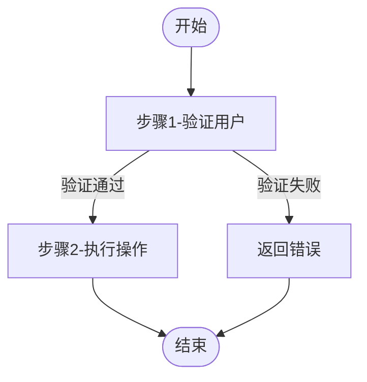

# 从TypeScript/Node.js项目反向生成业务需求文档

## 目标

深入分析指定的TypeScript/Node.js项目，理解其业务逻辑，并反向抽取出与技术实现无关的纯业务需求文档。生成的文档应达到专业需求规格说明书的深度和完整性，可直接用于指导任何技术栈的开发。

## 适用项目类型

本指南适用于以下类型的TypeScript/Node.js项目：

### 前端应用
- **框架**：React、Vue 2/3、SolidJS、Svelte、Angular
- **构建工具**：Vite、Webpack、Next.js、Remix、Nuxt
- **UI框架**：AMIS、Ant Design、Element UI、Chakra UI、Radix UI、Kobalte
- **状态管理**：Zustand、Pinia、Redux、Jotai、Valtio、Context API

### 后端API
- **框架**：Express、NestJS、Fastify、Hono、Elysia
- **ORM**：Prisma、Drizzle ORM、TypeORM、Mongoose、Sequelize
- **认证**：JWT、OAuth、Passport.js、NextAuth.js

### 全栈应用
- **框架**：Next.js、Remix、Nuxt 3、SvelteKit、Astro
- **部署**：Vercel、Netlify、Cloudflare Workers、Bun、Deno

### 无服务器应用
- **平台**：SST (Serverless Stack)、AWS Lambda、Google Cloud Functions
- **数据库**：PlanetScale、Neon、Supabase、Turso

## 分析范围

### 1. 项目结构分析

- **前端项目**：
  - 识别页面组件（pages、components、views）
  - 理解路由配置（路由表、嵌套路由、动态路由）
  - 识别状态管理方案（Context、Store、Signal）
  - 提取主题配置和样式系统
  - 分析API调用层（fetch、axios、tRPC、GraphQL）

- **后端项目**：
  - 识别API路由（路由处理器、中间件）
  - 理解控制器/处理器逻辑
  - 识别服务层和业务逻辑
  - 分析数据模型（Schema、Entity、Model）
  - 提取认证和授权机制

- **全栈项目**：
  - 识别前后端共享的类型定义
  - 理解API边界和接口契约
  - 分析数据流向和状态同步
  - 识别服务端渲染和客户端渲染的边界

### 2. 数据模型分析

- **ORM Schema分析**（Prisma/Drizzle/TypeORM）：
  - 读取Schema定义文件（schema.prisma、drizzle schema、entity文件）
  - 提取实体名称和属性
  - 理解字段类型和约束
  - 识别关系（@relation、belongsTo、hasMany）
  - 提取索引和唯一约束

- **Type/Interface分析**：
  - 分析TypeScript类型定义
  - 提取业务实体类型
  - 识别枚举类型（enum）和联合类型（union）
  - 理解泛型参数和约束

- **数据库模型分析**：
  - 分析迁移文件
  - 理解表结构、字段、约束
  - 识别外键关系
  - 分析索引设计

### 3. 业务逻辑分析

- **前端逻辑**：
  - 分析组件的业务方法和事件处理
  - 理解表单验证规则
  - 识别状态转换逻辑
  - 提取数据格式化逻辑
  - 分析条件渲染和权限控制

- **后端逻辑**：
  - 分析服务层方法
  - 理解业务规则和约束
  - 识别数据验证逻辑
  - 提取事务场景
  - 分析错误处理和错误码

- **共享逻辑**：
  - 分析工具函数和助手方法
  - 理解常量定义
  - 识别配置参数

### 4. 接口功能分析

- **前端接口**：
  - 分析组件Props和事件
  - 理解用户交互流程
  - 识别表单输入输出
  - 提取用户操作权限

- **后端接口**：
  - 分析API路由和HTTP方法
  - 理解请求参数和响应格式
  - 识别权限控制要求
  - 提取接口分组和分类

- **API定义**：
  - 分析OpenAPI/Swagger文档
  - 理解GraphQL Schema（如适用）
  - 识别tRPC路由定义
  - 分析接口契约和类型

### 5. 状态和配置分析

- **状态管理**：
  - 分析全局状态结构
  - 理解状态更新逻辑
  - 识别派生状态（computed/selectors）
  - 分析状态持久化策略

- **配置管理**：
  - 分析环境变量配置
  - 理解应用配置文件
  - 识别业务规则参数
  - 提取常量和枚举定义

### 6. 流程和交互分析

- **用户流程**：
  - 分析页面跳转逻辑
  - 理解多步骤表单流程
  - 识别弹窗和对话框交互
  - 分析导航结构

- **业务流程**：
  - 识别跨组件的业务操作
  - 理解异步操作链
  - 分析错误处理流程
  - 提取通知和提示逻辑

## 输出要求

### 文档结构（必须完整）

生成的文档应严格遵循 `templates/requirements-template.md` 模板结构：

1. **文档信息** - 项目信息、版本、创建日期、文档性质
2. **系统概述** - 系统定位、目标、特点、适用场景
3. **业务模块划分** - 模块架构图（Mermaid）、模块列表表格、模块职责说明
4. **数据模型定义** - 实体描述、关系说明、实体属性详解（必须完整）
5. **业务功能详述** - 每个模块的功能细节（包含输入输出、业务规则、权限、异常、事务要求）
6. **核心业务流程** - 关键业务流程图解（Mermaid）、步骤详细说明、异常处理
7. **数据关系说明** - 实体关系图（Mermaid）、数据一致性规则
8. **业务规则约束** - 业务规则、限制、约束条件（按类别组织）
9. **状态机定义** - 状态码表格、状态转换规则
10. **非功能需求** - 性能、安全、可用性、兼容性、可维护性
11. **对外服务接口说明** - 接口功能、输入输出、使用场景、权限要求
12. **附录** - 术语表、状态码说明、错误码说明、业务规则配置

### 模板使用

- 使用 `templates/requirements-template.md` 作为输出模板
- 替换模板中的 `{占位符}` 为实际业务内容
- 根据项目实际情况调整模板结构，但核心章节必须保留
- 确保文档语言与项目代码注释语言一致（中文或英文）

### 核心原则

#### 必须剥离的技术细节

- ❌ 不提及具体框架（React、Vue、Express、Next.js等）
- ❌ 不指定运行时（Node.js、Bun、Deno、浏览器）
- ❌ 不固定API路径（`/api/xxx`、`GET/POST`等）
- ❌ 不涉及具体技术实现（useState、useEffect、中间件、装饰器等）
- ❌ 不描述技术架构细节（SPA、SSR、微前端、Serverless等）
- ❌ 不提及具体ORM（Prisma、Drizzle、TypeORM等）
- ❌ 不提及具体的UI库（Ant Design、Chakra UI、AMIS等）
- ❌ 不使用技术术语描述业务（如：Component、Hook、Controller、Service等）

#### 必须聚焦的内容

- ✅ 用业务术语描述实体和关系（用户、订单、申请单、工单等）
- ✅ 用功能名称描述服务（获取订单列表、创建订单、提交申请等）
- ✅ 用业务规则描述约束（库存不能为负、订单超时取消、申请金额不能超过限额等）
- ✅ 用流程图描述业务流转（申请→审批→执行→完成）
- ✅ 用自然语言描述输入输出（筛选条件、返回结果）
- ✅ 描述事务场景（创建记录时需在同一事务中完成多个操作）
- ✅ 描述异常情况（数据不存在、状态不允许、权限不足等）
- ✅ 描述业务场景（适用什么业务场景、什么情况下使用）
- ✅ 描述用户界面元素（表单字段、按钮、列表、详情页等，但以业务视角）

### 接口描述格式

使用业务功能命名，不限制技术实现：

- "获取订单列表（用户）" ✅
- "用户查询自己的所有订单" ✅
- "提交审批申请" ✅
- `GET /order/list` ❌
- `POST /api/approval/submit` ❌
- "订单列表查询接口" ✅（不够具体，建议使用更明确的描述）
- "审批提交接口" ✅

### 模块划分原则

按业务功能划分，而非技术模块：

- **用户管理模块** ✅
- **订单交易模块** ✅
- **审批流程模块** ✅
- **数据统计模块** ✅
- `user-service` ❌
- `order-controller` ❌
- `pages/order` ❌
- `components/UserList` ❌

### 实体命名原则

使用业务术语命名，而非技术术语：

- **用户（User）** ✅
- **订单（Order）** ✅
- **申请单（Application）** ✅
- **审批单（Approval）** ✅
- `UserDO` ❌
- `OrderEntity` ❌
- `IApplication` ❌
- `User` interface ❌

### 功能描述详细要求

每个功能必须包含以下要素（如不涉及某项，可注明"不涉及"）：

```
**功能名称**

**业务规则**：
- 规则1（详细描述，如：验证用户权限、检查数据有效性、状态约束等）
- 规则2（数值要求，如：最多N个、必须在X天内、不能为负等）
- 规则3（状态约束，如：只能在特定状态下执行）
- 规则4（其他业务规则）

**输入参数**：
- 参数名1：参数说明（类型、是否必填、取值范围、格式要求）
- 参数名2：参数说明
- 参数名3：参数说明

**输出结果**：
- 结果1：说明
- 结果2：说明
- 结果3：说明

**异常处理**：
- 异常情况1：错误原因、错误提示
- 异常情况2：错误原因、错误提示
- 异常情况3：错误原因、错误提示

**权限要求**：
- 需要登录用户 / 管理员权限 / 指定角色 / 无需权限

**事务要求**（如涉及）：
- 需要在同一事务中完成的操作列表
- 数据一致性要求
```

**注意**：

- 如果某个功能不涉及异常处理或事务要求，也必须明确说明"不涉及异常处理"或"不涉及事务要求"
- 数值范围要求必须明确（如：1-100、大于0、不超过1000等）
- 时间限制要求必须明确（如：7天内、30天后、当前时间之前等）

## 分析步骤建议

### 阶段1：快速扫描（15-30分钟）

- **识别项目类型**
  - 前端项目？后端项目？全栈项目？
  - 使用的主要框架和库
  - 项目的整体架构（Monorepo？多应用？）

- **浏览项目结构**
  - 识别核心目录结构（src、pages、components、api、services等）
  - 识别配置文件（package.json、tsconfig.json、vite.config等）
  - 识别入口文件（index.ts、main.ts、app.tsx等）
  - 识别路由配置
  - 识别状态管理方案

- **识别数据相关文件**
  - Schema文件（schema.prisma、drizzle schema、entity files）
  - 类型定义文件（types、interfaces）
  - API定义文件（router、handler、controller）
  - 数据模型文件（models、entities）

### 阶段2：数据模型分析（30-60分钟）

- **分析Schema文件**（Prisma/Drizzle/TypeORM）
  - 读取Schema定义
  - 提取实体名称和字段列表
  - 理解字段类型和约束
  - 识别实体关系
  - 记录索引和约束

- **分析TypeScript类型**
  - 查找所有 interface 和 type 定义
  - 提取核心业务类型
  - 识别枚举类型
  - 理解泛型参数
  - 记录类型别名

- **分析数据库迁移**
  - 读取迁移文件（如适用）
  - 理解表结构变化
  - 提取约束和索引

### 阶段3：常量和配置分析（15-30分钟）

- **分析常量定义**
  - 查找 const、enum 定义
  - 提取状态码和枚举
  - 识别业务规则参数
  - 记录默认值

- **分析配置文件**
  - 读取环境变量定义
  - 理解配置参数
  - 识别可配置的业务参数
  - 提取第三方服务配置

### 阶段4：业务逻辑分析（60-120分钟）

- **前端逻辑分析**
  - 遍历主要组件（pages、views）
  - 理解组件的业务方法
  - 提取表单验证规则
  - 识别状态转换逻辑
  - 分析事件处理逻辑

- **后端逻辑分析**（如适用）
  - 遍历路由处理器
  - 理解每个方法的业务目的
  - 提取业务规则和约束
  - 识别中间件和守卫
  - 分析异常处理

- **共享逻辑分析**
  - 分析工具函数
  - 理解数据转换逻辑
  - 识别格式化方法

### 阶段5：接口和交互分析（30-60分钟）

- **前端接口分析**
  - 分析组件Props接口
  - 理解事件回调
  - 提取表单字段定义
  - 识别用户操作权限

- **后端接口分析**（如适用）
  - 遍历所有API路由
  - 提取请求参数和响应
  - 识别权限控制
  - 分析接口分组

- **API定义分析**
  - 读取OpenAPI文档（如适用）
  - 分析GraphQL Schema（如适用）
  - 理解接口契约

### 阶段6：状态和流程分析（30-60分钟）

- **状态管理分析**
  - 分析全局状态结构
  - 理解状态更新逻辑
  - 识别派生状态
  - 分析状态持久化

- **用户流程分析**
  - 跟踪页面跳转
  - 理解多步骤流程
  - 识别弹窗和对话框
  - 分析导航结构

### 阶段7：规则总结（30-60分钟）

- **提取业务约束**
  - 汇总所有业务规则
  - 汇总权限要求
  - 汇总事务场景（如适用）

- **提取异常场景**
  - 汇总所有错误码和错误信息
  - 识别异常触发条件
  - 分析错误处理方式

### 阶段8：关系梳理（15-30分钟）

- **整理实体关系图**
  - 绘制实体关系图（1:1、1:N、N:M）
  - 标注关键关系

- **整理数据一致性规则**
  - 识别跨实体的数据一致性要求
  - 识别需要事务保证的场景（如适用）

### 阶段9：结构化输出（60-120分钟）

- **按照模板填充内容**
  - 使用 `requirements-template.md` 模板
  - 替换占位符为实际内容
  - 根据项目实际情况调整结构

- **检查完整性**
  - 检查是否遗漏重要功能
  - 检查描述是否清晰完整
  - 检查是否保留了技术细节

- **格式化输出**
  - 使用Markdown格式
  - 使用表格和Mermaid图示提高可读性

### 分析优先级

1. **最高优先级**：核心业务实体、核心业务流程、状态机定义
2. **高优先级**：主要功能模块、业务规则、数据一致性规则
3. **中优先级**：辅助功能、异常处理、接口描述
4. **低优先级**：非功能需求、附录信息（可根据项目实际情况调整）

## 通用化建议

### 识别业务模式

不同项目可能使用不同的技术栈，但业务逻辑本质是相通的。常见业务模式包括：

**生命周期管理模式**

- 实体创建→审核→执行→完成（如：申请单、工单）
- 状态机转换（如：待处理→处理中→已完成）
- 版本控制和历史记录

**主从关系模式**

- 主实体-明细实体（如：订单-订单商品、申请单-申请明细）
- 树形结构（如：组织架构、分类树、目录树）
- 多对多关联

**审批流程模式**

- 提交申请→审批通过/拒绝→执行→完成
- 多级审批（串行/并行）
- 审批规则和权限控制

**权限控制模式**

- 基于角色的访问控制（RBAC）
- 基于资源的访问控制
- 数据权限（行级、字段级）

**通知模式**

- 业务事件触发通知（如：审批通过、订单变更）
- 消息队列异步处理
- 定时任务处理

### 文档编写原则

- **识别业务实体**而非技术类（User、Order、Application等，而非IUser、UserEntity）
- **关注"做什么"而非"怎么做"**（描述业务目的，而非技术实现）
- **提取可复用的业务模式**（状态机、审批流程、权限控制等）
- **保持文档语言简洁明了**，避免技术黑话
- **重要信息用表格、Mermaid图示呈现**，提高可读性
- **每个功能点要足够详细**，让不同技术栈的开发者都能理解
- **使用业务术语**而非技术术语（如："提交申请"而非"POST /api/submit"）

### 常见实体类型

根据系统类型，常见的核心实体包括：

- **用户/角色/权限**（几乎每个系统都有）
- **业务单据**（订单、申请单、工单、报销单等）
- **主数据**（商品、客户、供应商、产品等）
- **配置数据**（系统配置、业务规则配置等）
- **日志数据**（操作日志、审计日志、活动日志等）

### 常见业务流程

根据系统类型，常见的核心流程包括：

- **数据录入流程**（创建→验证→保存）
- **审批流程**（提交→审批→通过/拒绝→执行）
- **状态流转流程**（状态A→状态B→状态C）
- **数据同步流程**（从外部系统获取→处理→保存）
- **报表统计流程**（定时任务→聚合计算→生成报表）

### 注意事项

- **不要遗漏重要功能**：如果某个功能在代码中有实现但文档中没有描述，需要补充
- **不要混淆技术细节**：将技术实现细节剥离，只保留业务逻辑
- **不要过度简化**：重要业务规则必须详细描述，不能省略
- **不要使用模糊描述**：如"若干"、"一些"等，要明确具体数值
- **不要遗漏异常情况**：重要异常场景必须说明处理方式

## TypeScript/Node.js 特定分析要点

### 前端项目分析要点

#### 组件分析

- **识别页面组件**（Pages/Views）
  - 页面的主要功能和用途
  - 页面之间的导航关系
  - 页面需要的权限

- **识别业务组件**（Components）
  - 可复用的业务组件
  - 组件的输入（Props）和输出（Events）
  - 组件的状态管理

- **识别布局组件**（Layout）
  - 页面布局结构
  - 公共区域（Header、Footer、Sidebar）
  - 响应式设计规则

#### 路由分析

- **提取路由表**
  - 路由路径和对应页面
  - 动态路由参数
  - 路由守卫和权限控制
  - 嵌套路由结构

#### 状态管理分析

- **全局状态**
  - 状态结构和类型
  - 状态更新逻辑
  - 派生状态（Computed/Selectors）

- **本地状态**
  - 组件内部状态
  - 表单状态
  - 临时数据状态

#### 表单分析

- **表单字段**
  - 字段名称、类型、验证规则
  - 必填字段和可选字段
  - 字段之间的依赖关系

- **表单验证**
  - 验证规则和错误提示
  - 实时验证还是提交验证
  - 自定义验证逻辑

#### API调用分析

- **API客户端**
  - API基础URL和认证方式
  - 请求/响应拦截器
  - 错误处理逻辑

- **API定义**
  - 端点路径和方法
  - 请求参数和类型
  - 响应数据结构

### 后端项目分析要点

#### 路由/控制器分析

- **识别API端点**
  - HTTP方法（GET/POST/PUT/DELETE）
  - 路由路径和参数
  - 中间件链

- **控制器逻辑**
  - 请求参数验证
  - 业务逻辑调用
  - 响应数据格式

#### 服务层分析

- **业务服务**
  - 服务方法的目的
  - 业务规则和约束
  - 事务边界
  - 异常处理

#### 数据访问分析

- **Repository/DAO**
  - 数据操作方法
  - 查询逻辑
  - 关联加载策略

#### 中间件分析

- **认证中间件**
  - 认证方式（JWT、Session、OAuth）
  - Token验证逻辑
  - 用户信息提取

- **授权中间件**
  - 权限检查逻辑
  - 角色验证
  - 资源所有权验证

### 数据模型分析要点

#### Prisma Schema

```prisma
model User {
  id        String   @id @default(uuid())
  email     String   @unique
  name      String?
  status    UserStatus @default(ACTIVE)
  createdAt DateTime @default(now())
  orders    Order[]
}

enum UserStatus {
  ACTIVE
  INACTIVE
  SUSPENDED
}
```

**分析要点**：
- 实体名称和字段
- 字段类型和默认值
- 约束（@unique、@default）
- 关系（@relation）

#### Drizzle Schema

```typescript
export const users = pgTable('users', {
  id: uuid('id').primaryKey().defaultRandom(),
  email: varchar('email', { length: 255 }).notNull().unique(),
  name: varchar('name', { length: 255 }),
  status: userStatusEnum().default('active').notNull(),
  createdAt: timestamp('created_at').defaultNow(),
});

export const userStatusEnum = pgEnum('user_status', ['active', 'inactive', 'suspended']);
```

**分析要点**：
- 表名和列名
- 列类型和约束
- 枚举定义
- 主键和外键

#### TypeScript Interface

```typescript
interface User {
  id: string;
  email: string;
  name?: string;
  status: 'active' | 'inactive' | 'suspended';
  createdAt: Date;
}

interface CreateUserInput {
  email: string;
  name?: string;
}
```

**分析要点**：
- 接口名称和属性
- 可选属性（?）
- 联合类型（|）
- 泛型参数

### 全栈项目分析要点

#### 共享类型

- **类型共享机制**
  - 共享的TypeScript类型定义
  - API契约定义
  - 数据模型类型

- **类型同步**
  - 前后端类型如何保持同步
  - 自动生成类型（如tRPC、openapi-typescript）

#### SSR/SSG分析

- **渲染策略**
  - 服务端渲染的页面
  - 静态生成的页面
  - 客户端渲染的页面

- **数据获取**
  - 服务端数据获取
  - 客户端数据获取
  - 缓存策略

## 开始分析

请按照以上要求，对指定TypeScript/Node.js项目进行深入分析，生成与技术无关的业务需求文档。

### 执行步骤

1. 读取 `templates/requirements-template.md` 模板文件
2. 按照分析步骤对项目进行全面分析
3. 按照模板结构填充实际业务内容
   - 使用Mermaid语法绘制流程图和关系图
   - 参考模板中的Mermaid示例编写自定义流程图
4. 检查完整性和准确性
5. 输出最终的Markdown格式文档

---

## 补充说明

### 关于数据一致性规则

在前端项目中，数据一致性通常涉及：

- **表单提交**：客户端验证 → API调用 → 成功/失败处理
- **状态更新**：本地状态更新 → 同步到服务器 → 刷新数据
- **乐观更新**：先更新本地状态，失败时回滚

在后端项目中，数据一致性涉及：

- **记录创建**：创建主记录+创建明细记录+更新统计数据
- **记录更新**：更新记录+更新关联数据+记录操作日志
- **记录删除**：标记删除+清理关联数据+恢复统计数据
- **状态变更**：更新状态+触发后续操作+发送通知

### 关于异常处理

需要提取系统定义的错误码和异常场景：

- **业务异常**（数据不存在、状态不允许、权限不足、数据冲突等）
- **参数异常**（必填参数缺失、参数格式错误、参数范围越界等）
- **权限异常**（未登录、无权限、角色不符等）
- **网络异常**（请求超时、服务器错误等）

### 关于状态机

需要完整提取状态机的定义：

- 状态列表及说明（状态码、状态名称、状态描述）
- 状态之间的转换条件和转换操作
- 每个状态下可执行的操作（用户操作、管理员操作、系统自动操作）

### 关于权限控制

需要提取权限相关的信息：

- 角色定义（管理员、普通用户、审核员等）
- 权限定义（增删改查权限、审批权限、特殊操作权限等）
- 权限分配（角色-权限映射关系）
- 数据权限（行级权限、字段级权限）

### 关于异步处理

需要识别异步处理相关的业务逻辑：

- 异步处理的触发时机
- 异步处理的业务操作
- 异步处理的结果处理（成功/失败）

### 关于业务配置

需要识别可配置的业务参数：

- 系统级配置（超时时间、限制数量等）
- 业务规则配置（金额限制、审批流程等）
- 第三方服务配置（API地址、密钥等）

### 关于Mermaid图表

模板中使用Mermaid语法来绘制流程图和关系图，常见的Mermaid图表类型包括：

**流程图（Flowchart）**

- 用于展示业务流程、审批流程等
- 语法：`graph TD`（从上到下）或`graph LR`（从左到右）
- 节点：`Start([开始])`（圆形）、`Step1[步骤1]`（矩形）、`Decision{判断}`（菱形）
- 连接：`Start --> Step1`（箭头连接）、`Step1 -->|条件| Step2`（带标签的箭头）

**示例代码**：



**注意事项**：

- 节点名称使用英文或中文都可以，但建议使用中文以提高可读性
- 复杂的流程可以拆分为多个子图
- 使用`subgraph`可以将相关节点分组

---

## 常见系统类型示例

### 1. 内容管理系统（CMS）

**核心实体**：内容、分类、标签、评论、用户、角色
**核心流程**：创建内容→审核→发布→展示→评论→归档
**核心功能**：

- 内容管理（新增、编辑、删除、发布、下架）
- 分类管理（分类树、分类配置）
- 评论管理（评论审核、评论回复）
- 用户管理（用户注册、用户信息、用户权限）
- 数据统计（内容统计、访问统计）

### 2. 电商平台

**核心实体**：用户、商品、订单、购物车、优惠券、评论
**核心流程**：浏览商品→加入购物车→下单→支付→发货→收货→评价
**核心功能**：

- 用户管理（注册、登录、个人信息、收货地址）
- 商品管理（商品分类、商品信息、商品搜索）
- 购物车管理（加入购物车、修改数量、结算）
- 订单管理（下单、支付、发货、收货、评价）
- 营销管理（优惠券、团购、促销活动）

### 3. 协作工具

**核心实体**：用户、工作区、项目、任务、评论、文件、通知
**核心流程**：创建项目→分配任务→执行任务→提交完成→审核→归档
**核心功能**：

- 项目管理（创建、编辑、删除、归档）
- 任务管理（创建、分配、执行、完成）
- 团队协作（评论、@提醒、文件共享）
- 通知管理（实时通知、消息中心）
- 数据统计（任务统计、成员统计）

### 4. SaaS平台

**核心实体**：租户、用户、订阅、计费、配额、使用记录
**核心流程**：注册→试用→订阅→使用→续费/取消
**核心功能**：

- 租户管理（注册、验证、配置）
- 订阅管理（套餐选择、支付、续费）
- 配额管理（资源限制、扩容）
- 使用统计（使用量统计、账单生成）
- 账户管理（用户管理、角色权限）

### 5. 开发工具平台

**核心实体**：项目、会话、任务、模型、文件、配置、日志
**核心流程**：创建项目→选择模型→执行任务→查看结果→保存输出
**核心功能**：

- 项目管理（创建、编辑、删除）
- 会话管理（创建、继续、历史、分叉）
- 任务执行（运行、监控、取消）
- 模型管理（选择、配置、切换）
- 文件操作（选择、读取、编辑）

---

## 输出检查清单

完成需求文档后，请检查以下内容：

### 必须包含的内容

- [ ] 文档信息完整（项目名称、版本、日期等）
- [ ] 系统概述清晰（定位、目标、特点、场景）
- [ ] 模块划分合理（架构图、模块列表、职责说明）
- [ ] 数据模型完整（所有核心实体及属性）
- [ ] 业务功能详细（输入、输出、规则、权限、异常、事务）
- [ ] 核心流程清晰（Mermaid流程图、步骤说明、异常处理）
- [ ] 数据关系明确（关系图、一致性规则）
- [ ] 业务规则完整（约束条件、限制条件）
- [ ] 状态机定义完整（状态码、转换规则）
- [ ] 非功能需求（性能、安全、可用性等）
- [ ] 接口描述完整（功能、输入、输出、权限）
- [ ] 附录信息（术语表、状态码、错误码、配置）

### 必须剥离的技术细节

- [ ] 无具体框架提及（React、Vue、Express、Next.js等）
- [ ] 无运行时提及（Node.js、Bun、Deno、浏览器）
- [ ] 无API路径（/api/xxx、GET/POST等）
- [ ] 无技术术语（Component、Hook、Controller、Service等）
- [ ] 无技术实现细节（useState、useEffect、中间件、装饰器等）

### 文档质量检查

- [ ] 语言简洁明了，无技术黑话
- [ ] 描述清晰完整，无模糊表述
- [ ] 数值范围明确（不是"若干"、"一些"）
- [ ] 异常情况处理完整
- [ ] 权限要求明确
- [ ] 事务场景清晰
- [ ] 可读性好（表格、Mermaid图示使用合理）
