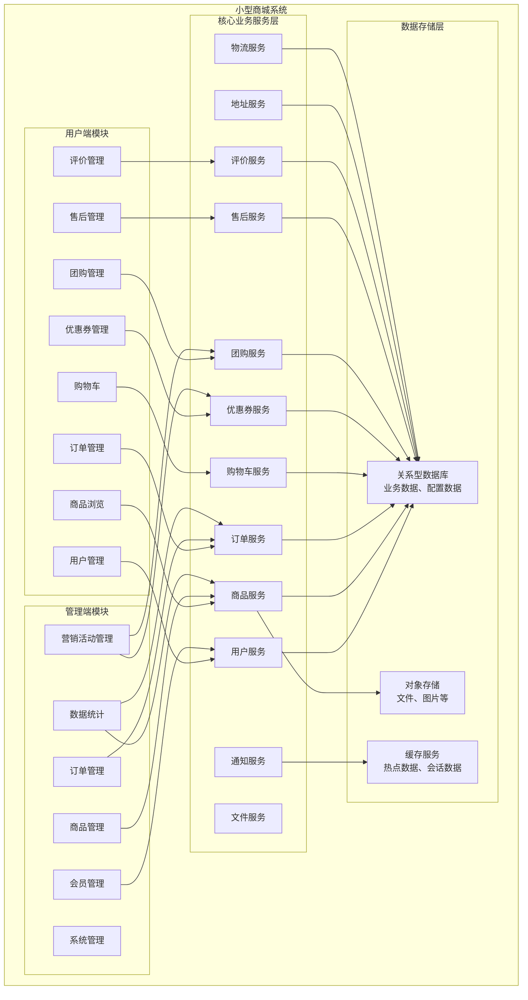
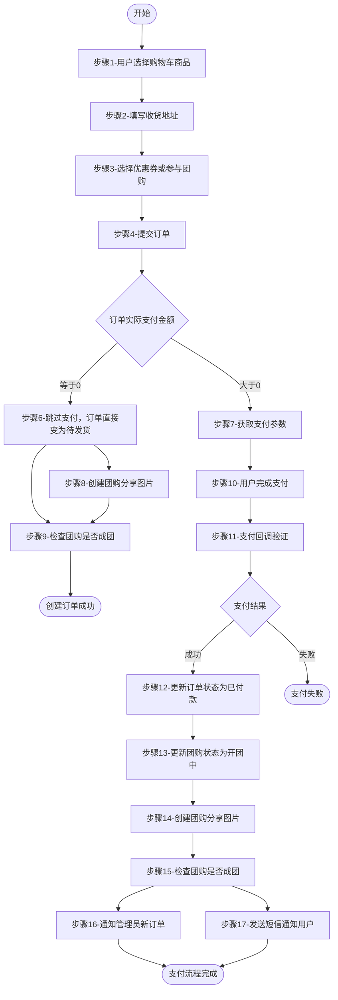
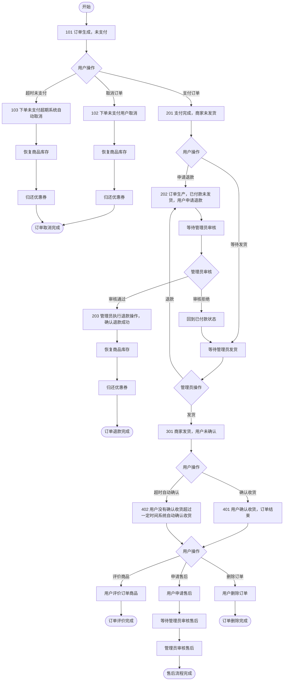
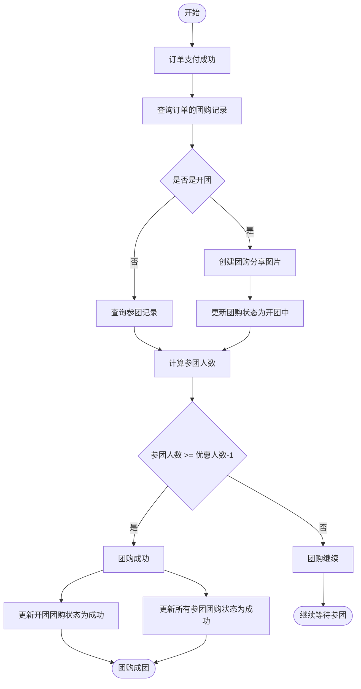
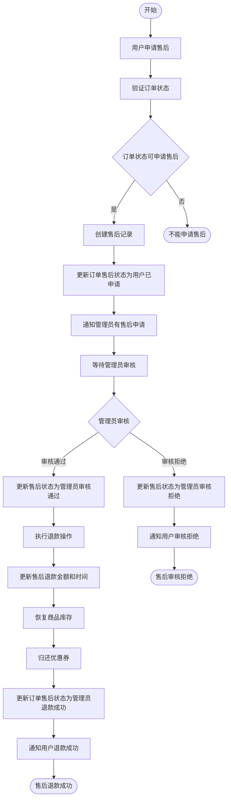
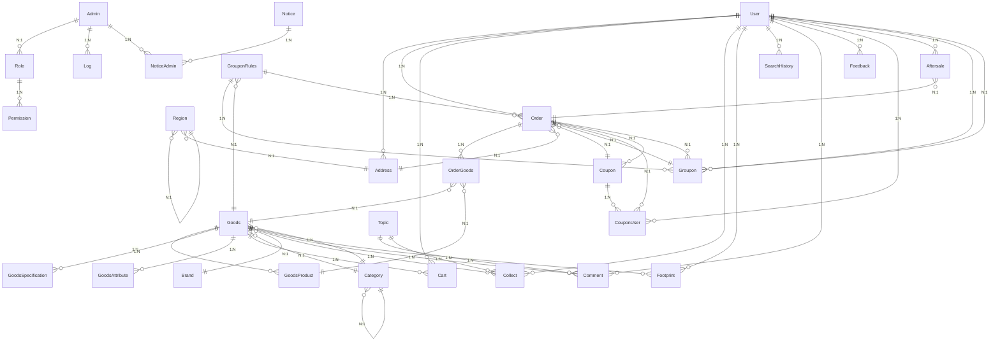

# 小型商城系统业务需求规格说明书

## 文档信息

| 项目信息   | 内容               |
| ------ | ---------------- |
| 项目名称   | 小型商城系统（Litemall） |
| 版本     | 0.1.0            |
| 文档创建日期 | 2026-01-12       |
| 文档性质   | 业务需求规格说明书        |

---

## 一、系统概述

### 1.1 系统定位

小型商城系统是一个完整的电商平台业务管理平台，支持多端访问（小程序端、管理后台），提供从商品展示、购物车管理、订单下单、支付发货、售后退款、评价反馈到数据统计的完整电商业务闭环。

### 1.2 系统目标

- 为用户提供便捷的浏览商品、加入购物车、下单购买、团购优惠、优惠券使用的购物体验
- 为管理员提供高效的商品管理、订单管理、营销活动管理、会员管理、数据统计的管理能力
- 支持普通购买、团购购买、优惠券使用、售后退款、商品评价等多种业务模式
- 提供完善的数据统计和分析能力（订单统计、用户统计、商品统计）
- 确保订单状态流转的准确性和数据一致性

### 1.3 系统特点

- 多端统一后台服务（小程序端、管理端）
- 灵活的权限管理体系（基于角色的权限控制）
- 完整的订单流程管理（从下单到评价）
- 可配置的业务规则（运费规则、超时时间、数量限制等）
- 支持多种营销活动（团购、优惠券、专题、优惠券）
- 完善的售后和退款流程

### 1.4 适用场景

- 中小型电商平台运营
- 微信小程序商城
- 团购优惠活动管理
- 优惠券营销活动
- 商品评价和售后服务
- 数据运营统计分析

---

## 二、业务模块划分

### 2.1 模块架构图



### 2.2 模块列表

| 模块名称  | 模块类型 | 主要职责                               |
| ----- | ---- | ---------------------------------- |
| 用户管理  | 双端   | 用户注册、登录、个人信息管理、收货地址管理              |
| 商品管理  | 双端   | 商品信息、商品分类、商品品牌、商品规格、商品参数管理         |
| 购物车管理 | 用户端  | 加入购物车、修改数量、删除商品、清空购物车、结算           |
| 订单管理  | 双端   | 订单提交、订单支付、订单发货、订单确认、订单取消、订单退款、订单删除 |
| 团购管理  | 双端   | 团购规则配置、团购活动创建、参团、开团、团购状态管理         |
| 优惠券管理 | 双端   | 优惠券配置、优惠券领取、优惠券使用、优惠券验证、优惠券有效期管理   |
| 评价管理  | 双端   | 商品评价、管理员回复、评价展示、星级评分               |
| 售后管理  | 双端   | 售后申请、售后审核、退款处理、退货处理                |
| 分类管理  | 管理端  | 商品分类树管理、分类层级、分类排序                  |
| 品牌管理  | 管理端  | 品牌信息管理、品牌排序、品牌图片                   |
| 搜索管理  | 用户端  | 关键字搜索、热门关键字、搜索历史、分类筛选              |
| 收藏管理  | 用户端  | 商品收藏、专题收藏、取消收藏、收藏列表                |
| 浏览足迹  | 用户端  | 商品浏览记录、足迹列表、清除足迹                   |
| 专题管理  | 管理端  | 专题内容管理、专题商品关联、专题图片                 |
| 广告管理  | 管理端  | 广告内容配置、广告位置、广告展示时间、广告启用            |
| 反馈管理  | 双端   | 用户反馈提交、反馈处理、反馈状态                   |
| 常见问题  | 管理端  | 问题管理、问题答案、FAQ展示                    |
| 关键字管理 | 管理端  | 热门关键字、默认关键字、关键字排序、搜索跳转             |
| 通知管理  | 管理端  | 系统通知发布、通知阅读状态、管理员通知                |
| 操作日志  | 管理端  | 管理员操作记录、操作日志查询                     |
| 数据统计  | 管理端  | 订单统计、商品统计、用户统计                     |
| 角色权限  | 管理端  | 角色管理、权限分配、权限控制                     |
| 文件存储  | 双端   | 文件上传、文件存储、文件访问                     |

---

## 三、数据模型定义

### 3.1 核心实体说明

#### 3.1.1 用户相关实体

**用户（User）**

```
核心属性：
- 用户唯一标识
- 用户名
- 密码（加密存储）
- 昵称
- 性别（0未知，1男，2女）
- 生日
- 手机号
- 头像URL
- 用户级别（0普通用户，1VIP用户，2高级VIP用户）
- 微信OpenID（用于小程序登录）
- 会话密钥
- 用户状态（0可用，1禁用，2注销）
- 最后登录时间
- 最后登录IP
- 创建时间
- 更新时间
```

**收货地址（Address）**

```
核心属性：
- 地址唯一标识
- 用户ID
- 收货人名称
- 手机号
- 省份ID
- 城市ID
- 区县ID
- 详细地址
- 地区编码
- 邮政编码
- 是否默认地址（0否，1是）
- 创建时间
- 更新时间
```

**管理员（Admin）**

```
核心属性：
- 管理员唯一标识
- 管理员名称
- 密码（加密存储）
- 头像
- 最后登录IP
- 最后登录时间
- 角色ID列表
- 创建时间
- 更新时间
```

**角色（Role）**

```
核心属性：
- 角色唯一标识
- 角色名称
- 角色描述
- 状态（0启用，1禁用）
- 创建时间
- 更新时间
```

**权限（Permission）**

```
核心属性：
- 权限唯一标识
- 角色ID
- 权限标识
- 创建时间
- 更新时间
```

#### 3.1.2 商品相关实体

**商品（Goods）**

```
核心属性：
- 商品唯一标识
- 商品编号
- 商品名称
- 所属分类ID
- 品牌ID
- 商品关键字
- 商品简介
- 是否上架（0下架，1上架）
- 排序值
- 商品图片
- 分享图片URL
- 是否新品（0否，1是）
- 是否热门（0否，1是）
- 商品单位
- 专柜价格
- 零售价格
- 商品详细介绍（富文本）
- 创建时间
- 更新时间
```

**商品货品（GoodsProduct）**

```
核心属性：
- 货品唯一标识
- 商品ID
- 规格值列表（JSON数组格式）
- 货品价格
- 货品库存数量
- 货品图片
- 创建时间
- 更新时间
```

**商品规格（GoodsSpecification）**

```
核心属性：
- 规格唯一标识
- 商品ID
- 规格名称（如：颜色）
- 规格值（如：红色）
- 规格图片
- 创建时间
- 更新时间
```

**商品参数（GoodsAttribute）**

```
核心属性：
- 参数唯一标识
- 商品ID
- 参数名称（如：产地）
- 参数值（如：中国）
- 创建时间
- 更新时间
```

**商品分类（Category）**

```
核心属性：
- 分类唯一标识
- 分类名称
- 分类关键字（JSON数组）
- 分类广告语
- 父分类ID（0表示顶级分类）
- 分类图标
- 分类图片
- 分类级别（L1一级，L2二级等）
- 排序值
- 创建时间
- 更新时间
```

**品牌（Brand）**

```
核心属性：
- 品牌唯一标识
- 品牌名称
- 品牌简介
- 品牌图片
- 排序值
- 最低价格
- 创建时间
- 更新时间
```

#### 3.1.3 订单交易实体

**订单（Order）**

```
核心属性：
- 订单唯一标识
- 订单编号
- 用户ID
- 订单状态
- 售后状态（0可申请，1用户已申请，2管理员审核通过，3管理员退款成功，4管理员审核拒绝，5用户已取消）
- 收货人名称
- 收货人手机号
- 收货详细地址
- 用户订单留言
- 商品总费用
- 配送费用
- 优惠券减免
- 用户积分减免
- 团购优惠价减免
- 订单费用（=商品费+运费-优惠券）
- 实付费用（=订单费-积分）
- 支付编号
- 支付时间
- 发货编号
- 发货快递公司
- 发货时间
- 实际退款金额
- 退款方式
- 退款备注
- 退款时间
- 用户确认收货时间
- 待评价订单商品数量
- 订单关闭时间
- 团购优惠价
- 创建时间
- 更新时间
```

**订单商品（OrderGoods）**

```
核心属性：
- 订单商品唯一标识
- 订单ID
- 商品ID
- 商品名称
- 商品编号
- 货品ID
- 购买数量
- 商品售价
- 规格列表
- 商品图片
- 评论ID（0未评价，-1超期不能评价，其他值表示评论ID）
- 创建时间
- 更新时间
```

**购物车（Cart）**

```
核心属性：
- 购物车唯一标识
- 用户ID
- 商品ID
- 商品编号
- 商品名称
- 货品ID
- 货品价格
- 货品数量
- 规格值列表（JSON数组）
- 是否选中（0未选中，1已选中）
- 商品图片
- 创建时间
- 更新时间
```

#### 3.1.4 营销活动实体

**优惠券（Coupon）**

```
核心属性：
- 优惠券唯一标识
- 优惠券名称
- 优惠券介绍
- 优惠券标签（如：新人专用）
- 优惠券数量（0表示无限量）
- 优惠金额
- 最少消费金额
- 用户领券限制数量（0不限制，1限领一张）
- 优惠券赠送类型（0通用券用户领取，1注册赠券，2优惠券码兑换）
- 优惠券状态（0正常可用，1已过期，2已下架）
- 商品限制类型（0全商品，1类目限制，2商品限制）
- 商品限制值（JSON数组，根据类型为空、类目集合或商品集合）
- 优惠券兑换码
- 有效时间限制（0基于领取时间的有效天数，1指定起止时间）
- 有效天数
- 使用券开始时间
- 使用券截止时间
- 创建时间
- 更新时间
```

**用户优惠券（CouponUser）**

```
核心属性：
- 用户优惠券唯一标识
- 用户ID
- 优惠券ID
- 使用状态（0未使用，1已使用，2已过期，3已下架）
- 使用时间
- 有效期开始时间
- 有效期截至时间
- 订单ID
- 创建时间
- 更新时间
```

**团购规则（GrouponRules）**

```
核心属性：
- 规则唯一标识
- 商品ID
- 商品名称
- 商品图片
- 优惠金额
- 达到优惠条件的人数
- 团购过期时间
- 团购规则状态（0正常上线，1到期自动下线，2管理员手动下线）
- 创建时间
- 更新时间
```

**团购活动（Groupon）**

```
核心属性：
- 团购唯一标识
- 关联订单ID
- 团购ID（开团用户为0，参团用户为团购活动ID）
- 团购规则ID
- 用户ID
- 团购分享图片地址
- 开团用户ID
- 开团时间
- 团购活动状态（0开团未支付，1开团中，2开团失败）
- 创建时间
- 更新时间
```

#### 3.1.5 评价售后实体

**评论（Comment）**

```
核心属性：
- 评论唯一标识
- 关联对象ID（type=0为商品ID，type=1为专题ID）
- 评论类型（0商品评论，1专题评论）
- 评论内容
- 管理员回复内容
- 用户ID
- 是否含有图片
- 图片地址列表（JSON数组）
- 评分（1-5星）
- 创建时间
- 更新时间
```

**售后（Aftersale）**

```
核心属性：
- 售后唯一标识
- 售后编号
- 订单ID
- 用户ID
- 售后类型（0未收货退款，1已收货无需退货退款，2用户退货退款）
- 退款原因
- 退款金额
- 退款凭证图片链接数组
- 退款说明
- 售后状态（0可申请，1用户已申请，2管理员审核通过，3管理员退款成功，4管理员审核拒绝，5用户已取消）
- 管理员操作时间
- 创建时间
- 更新时间
```

#### 3.1.6 其他核心实体

**收藏（Collect）**

```
核心属性：
- 收藏唯一标识
- 用户ID
- 关联对象ID
- 收藏类型（0商品，1专题）
- 创建时间
- 更新时间
```

**浏览足迹（Footprint）**

```
核心属性：
- 足迹唯一标识
- 用户ID
- 浏览商品ID
- 创建时间
- 更新时间
```

**搜索历史（SearchHistory）**

```
核心属性：
- 历史唯一标识
- 用户ID
- 搜索关键字
- 搜索来源（pc、wx、app）
- 创建时间
- 更新时间
```

**关键字（Keyword）**

```
核心属性：
- 关键字唯一标识
- 关键字
- 跳转链接
- 是否热门关键字
- 是否默认关键字
- 排序值
- 创建时间
- 更新时间
```

**专题（Topic）**

```
核心属性：
- 专题唯一标识
- 专题标题
- 专题子标题
- 专题内容（富文本）
- 专题相关商品最低价
- 专题阅读量
- 专题图片
- 排序值
- 专题相关商品（JSON数组）
- 创建时间
- 更新时间
```

**广告（Ad）**

```
核心属性：
- 广告唯一标识
- 广告标题
- 广告链接地址
- 广告图片
- 广告位置（1首页）
- 活动内容
- 广告开始时间
- 广告结束时间
- 是否启用
- 创建时间
- 更新时间
```

**常见问题（Issue）**

```
核心属性：
- 问题唯一标识
- 问题标题
- 问题答案
- 创建时间
- 更新时间
```

**反馈（Feedback）**

```
核心属性：
- 反馈唯一标识
- 用户ID
- 用户名称
- 手机号
- 反馈类型
- 反馈内容
- 状态
- 是否含有图片
- 图片地址列表
- 创建时间
- 更新时间
```

**通知（Notice）**

```
核心属性：
- 通知唯一标识
- 通知标题
- 通知内容
- 创建通知的管理员ID（0表示系统内置通知）
- 创建时间
- 更新时间
```

**管理员通知（NoticeAdmin）**

```
核心属性：
- 通知唯一标识
- 通知ID
- 通知标题
- 接收通知的管理员ID
- 阅读时间（NULL表示未读）
- 创建时间
- 更新时间
```

**操作日志（Log）**

```
核心属性：
- 日志唯一标识
- 管理员
- 管理员地址
- 操作分类
- 操作动作
- 操作状态
- 操作结果（成功消息或失败消息）
- 补充信息
- 创建时间
- 更新时间
```

**系统配置（System）**

```
核心属性：
- 配置唯一标识
- 配置名
- 配置值
- 创建时间
- 更新时间
```

**文件存储（Storage）**

```
核心属性：
- 文件唯一标识
- 文件唯一索引
- 文件名
- 文件类型
- 文件大小
- 文件访问链接
- 创建时间
- 更新时间
```

**行政区域（Region）**

```
核心属性：
- 区域唯一标识
- 父区域ID（省的pid为0，市的pid指向省，区县的pid指向市）
- 区域名称
- 区域类型（1省，2市，3区县）
- 区域编码
```

---

## 四、业务功能详述

### 4.1 用户管理模块

#### 4.1.1 用户注册登录

**用户登录（小程序）**

- **业务规则**：
  - 验证用户微信OpenID
  - 如果用户不存在则自动注册
  - 支持微信授权登录
  - 保存用户会话信息
- **输入参数**：
  - 微信授权码
- **输出结果**：
  - 用户基本信息
  - 登录令牌
- **异常处理**：
  - 授权失败：微信授权验证失败
  - 用户禁用：用户已被禁用
- **权限要求**：
  - 无需权限
- **事务要求**：
  - 不涉及

**用户信息更新**

- **业务规则**：
  - 用户可以修改昵称、头像、性别、生日
  - 手机号验证
- **输入参数**：
  - 用户昵称（字符串，非必填）
  - 用户头像（URL，非必填）
  - 性别（0/1/2，非必填）
  - 生日（日期，非必填）
  - 手机号（字符串，非必填）
- **输出结果**：
  - 更新后的用户信息
- **异常处理**：
  - 用户不存在：用户ID无效
  - 数据格式错误：参数格式不正确
- **权限要求**：
  - 需要登录用户
- **事务要求**：
  - 不涉及

#### 4.1.2 收货地址管理

**添加收货地址**

- **业务规则**：
  - 用户最多可添加20个收货地址（系统限制）
  - 可以设置默认地址
  - 省市区信息必须完整
- **输入参数**：
  - 收货人名称（字符串，必填，1-63字符）
  - 手机号（字符串，必填，11位数字）
  - 省份ID（数字，必填）
  - 城市ID（数字，必填）
  - 区县ID（数字，必填）
  - 详细地址（字符串，必填，1-127字符）
  - 是否默认地址（0/1，必填）
- **输出结果**：
  - 添加成功
- **异常处理**：
  - 参数错误：必填参数缺失或格式错误
  - 数量超限：收货地址数量超过限制
- **权限要求**：
  - 需要登录用户
- **事务要求**：
  - 不涉及

**删除收货地址**

- **业务规则**：
  - 只能删除自己的地址
  - 如果删除的是默认地址，需要设置其他地址为默认
- **输入参数**：
  - 地址ID（数字，必填）
- **输出结果**：
  - 删除成功
- **异常处理**：
  - 地址不存在：地址ID无效
  - 无权操作：不是当前用户的地址
- **权限要求**：
  - 需要登录用户
- **事务要求**：
  - 不涉及

### 4.2 商品管理模块

#### 4.2.1 商品浏览

**商品列表查询**

- **业务规则**：
  - 支持按分类筛选
  - 支持按品牌筛选
  - 支持按关键字搜索
  - 支持按价格区间筛选
  - 支持排序（价格、销量、上架时间）
  - 分页查询
  - 只显示上架商品
- **输入参数**：
  - 分类ID（数字，非必填）
  - 品牌ID（数字，非必填）
  - 关键字（字符串，非必填）
  - 价格区间起始（数字，非必填）
  - 价格区间结束（数字，非必填）
  - 排序字段（字符串，非必填，默认add_time）
  - 排序方式（asc/desc，非必填，默认desc）
  - 页码（数字，必填，默认1）
  - 每页数量（数字，必填，默认10）
- **输出结果**：
  - 商品列表（含商品ID、名称、价格、库存、图片、是否新品、是否热门）
  - 总记录数
  - 当前页码
  - 总页数
- **异常处理**：
  - 参数错误：参数格式错误
- **权限要求**：
  - 无需权限
- **事务要求**：
  - 不涉及

**商品详情查询**

- **业务规则**：
  - 显示商品基本信息
  - 显示商品规格列表
  - 显示商品货品列表
  - 显示商品参数列表
  - 显示商品详细描述
  - 显示商品评论列表
- **输入参数**：
  - 商品ID（数字，必填）
- **输出结果**：
  - 商品基本信息
  - 商品规格列表
  - 商品货品列表
  - 商品参数列表
  - 商品详细描述
- **异常处理**：
  - 商品不存在：商品ID无效
- **权限要求**：
  - 无需权限
- **事务要求**：
  - 不涉及

#### 4.2.2 购物车管理

**加入购物车**

- **业务规则**：
  - 必须选择商品货品（规格）
  - 检查货品库存是否足够
  - 同一用户同一货品，增加数量
  - 默认选中状态
- **输入参数**：
  - 商品ID（数字，必填）
  - 货品ID（数字，必填）
  - 数量（数字，必填，1-999）
- **输出结果**：
  - 购物车商品数量
  - 加入成功
- **异常处理**：
  - 库存不足：商品库存不足
  - 商品下架：商品已下架
  - 参数错误：参数格式错误
- **权限要求**：
  - 需要登录用户
- **事务要求**：
  - 不涉及

**购物车列表**

- **业务规则**：
  - 只显示当前用户的购物车
  - 显示商品信息、货品信息、价格、数量
  - 显示选中状态
- **输入参数**：
  - 无
- **输出结果**：
  - 购物车商品列表
  - 购物车总数量
  - 购物车总金额
- **异常处理**：
  - 不涉及异常处理
- **权限要求**：
  - 需要登录用户
- **事务要求**：
  - 不涉及

**修改购物车商品数量**

- **业务规则**：
  - 只能修改自己的购物车
  - 检查库存是否足够
  - 数量必须大于0
- **输入参数**：
  - 购物车ID（数字，必填）
  - 数量（数字，必填，1-999）
- **输出结果**：
  - 修改成功
  - 购物车总数量
  - 购物车总金额
- **异常处理**：
  - 库存不足：商品库存不足
  - 购物车不存在：购物车ID无效
  - 参数错误：参数格式错误
- **权限要求**：
  - 需要登录用户
- **事务要求**：
  - 不涉及

**删除购物车商品**

- **业务规则**：
  - 只能删除自己的购物车商品
  - 支持单个删除和清空购物车
- **输入参数**：
  - 购物车ID（数字，非必填，清空时不传）
- **输出结果**：
  - 删除成功
  - 购物车总数量
  - 购物车总金额
- **异常处理**：
  - 购物车不存在：购物车ID无效
- **权限要求**：
  - 需要登录用户
- **事务要求**：
  - 不涉及

**购物车结算**

- **业务规则**：
  - 只结算选中的购物车商品
  - 检查选中商品的库存
  - 计算商品总价
  - 计算运费（满足免邮金额则免运费）
  - 显示可用优惠券
- **输入参数**：
  - 购物车ID列表（数组，必填，0表示选中全部）
- **输出结果**：
  - 购物车商品列表
  - 商品总价
  - 运费
  - 可用优惠券列表
  - 最终需支付金额
- **异常处理**：
  - 购物车为空：未选中任何商品
  - 库存不足：商品库存不足
- **权限要求**：
  - 需要登录用户
- **事务要求**：
  - 不涉及

### 4.3 订单管理模块

#### 4.3.1 订单提交

**提交订单**

- **业务规则**：
  - 验证用户是否登录
  - 验证收货地址是否存在
  - 验证购物车商品库存
  - 验证团购活动是否有效（如果参与团购）
  - 验证优惠券是否可用（如果使用优惠券）
  - 计算商品总价
  - 计算运费（满足免邮金额则免运费）
  - 计算团购优惠（如果参与团购）
  - 计算优惠券折扣（如果使用优惠券）
  - 生成订单编号（日期+6位随机数）
  - 如果订单实际支付金额为0，则直接跳过支付成为待发货状态
  - 创建订单记录和订单商品记录
  - 减少商品货品库存
  - 清空购物车商品
  - 标记优惠券为已使用状态
  - 如果是团购，创建团购记录
  - 如果订单金额为0，更新团购状态为开团中，创建团购分享图片
  - 检查团购是否成团（参团人数满足条件），更新团购状态为成功
  - 如果订单金额大于0，创建订单超时未支付任务
  - 通知管理员新订单
- **输入参数**：
  - 购物车ID（数字，必填，0表示全部选中）
  - 地址ID（数字，必填）
  - 优惠券ID（数字，必填，0表示没有优惠券，-1表示不使用优惠券）
  - 用户优惠券ID（数字，必填）
  - 订单留言（字符串，非必填，0-512字符）
  - 团购规则ID（数字，非必填）
  - 团购链接ID（数字，非必填，参团时使用）
- **输出结果**：
  - 订单ID
  - 是否已支付（true/false）
  - 团购链接ID（如果参与团购）
- **异常处理**：
  - 用户未登录：需要先登录
  - 地址不存在：收货地址无效
  - 购物车为空：未选择任何商品
  - 库存不足：商品库存不足
  - 团购已过期：团购活动已过期
  - 团购已下线：团购活动已下线
  - 团购人数已满：团购活动人数已满
  - 已参加团购：已参加该团购活动
  - 优惠券不可用：优惠券验证失败
  - 参数错误：必填参数缺失
- **权限要求**：
  - 需要登录用户
- **事务要求**：
  - 创建订单记录
  - 创建订单商品记录
  - 减少商品货品库存
  - 清空购物车商品
  - 标记优惠券为已使用状态
  - 如果参与团购，创建团购记录
  - 如果订单金额为0，更新团购状态、检查团购成团
  - 以上操作必须在同一事务中完成

#### 4.3.2 订单支付

**订单预支付（获取支付参数）**

- **业务规则**：
  - 验证订单状态必须是未支付状态
  - 验证订单归属当前用户
  - 调用支付平台获取支付参数
  - 订单金额转换为分（金额*100）
- **输入参数**：
  - 订单ID（数字，必填）
- **输出结果**：
  - 支付参数（包含支付会话标识）
- **异常处理**：
  - 用户未登录：需要先登录
  - 订单不存在：订单ID无效
  - 订单不属于当前用户：无权操作此订单
  - 订单状态不允许：订单不能支付
  - 微信OpenID为空：用户未绑定微信
  - 支付失败：支付平台返回错误
- **权限要求**：
  - 需要登录用户
- **事务要求**：
  - 不涉及

**支付回调处理**

- **业务规则**：
  - 验证支付结果（支付成功或失败）
  - 验证订单支付金额是否一致
  - 更新订单状态为已付款
  - 更新订单支付编号和支付时间
  - 如果订单有团购，更新团购状态为开团中
  - 如果是开团，创建团购分享图片
  - 检查团购是否成团（参团人数满足条件），更新团购状态为成功
  - 发送短信通知用户支付成功
  - 发送邮件通知管理员新订单
  - 取消订单超时未支付任务
- **输入参数**：
  - 订单编号（字符串，必填）
  - 支付编号（字符串，必填）
  - 支付金额（字符串，必填，单位：分）
  - 支付结果状态（字符串，必填）
- **输出结果**：
  - 处理成功
- **异常处理**：
  - 订单不存在：订单编号无效
  - 订单已处理：订单已经处理过
  - 金额不一致：支付金额与订单金额不符
- **权限要求**：
  - 无需权限（支付平台回调）
- **事务要求**：
  - 更新订单状态为已付款
  - 更新订单支付编号和支付时间
  - 如果有团购，更新团购状态
  - 如果团购成团，更新所有团购记录状态
  - 以上操作必须在同一事务中完成

#### 4.3.3 订单取消

**取消订单（用户）**

- **业务规则**：
  - 验证订单状态必须是未支付状态
  - 验证订单归属当前用户
  - 更新订单状态为已取消
  - 更新订单结束时间
  - 增加商品货品库存
  - 如果使用过优惠券，归还优惠券（状态改为可使用）
- **输入参数**：
  - 订单ID（数字，必填）
- **输出结果**：
  - 取消成功
- **异常处理**：
  - 用户未登录：需要先登录
  - 订单不存在：订单ID无效
  - 订单不属于当前用户：无权操作此订单
  - 订单状态不允许：订单不能取消
  - 库存恢复失败：库存增加失败
- **权限要求**：
  - 需要登录用户
- **事务要求**：
  - 更新订单状态为已取消
  - 更新订单结束时间
  - 增加商品货品库存
  - 归还优惠券（如果使用过）
  - 以上操作必须在同一事务中完成

#### 4.3.4 订单退款

**申请退款（用户）**

- **业务规则**：
  - 验证订单状态必须是已付款状态
  - 验证订单归属当前用户
  - 更新订单状态为申请退款
  - 通知管理员用户申请退款
- **输入参数**：
  - 订单ID（数字，必填）
- **输出结果**：
  - 申请成功
- **异常处理**：
  - 用户未登录：需要先登录
  - 订单不存在：订单ID无效
  - 订单不属于当前用户：无权操作此订单
  - 订单状态不允许：订单不能申请退款
- **权限要求**：
  - 需要登录用户
- **事务要求**：
  - 更新订单状态为申请退款
  - 不涉及其他复杂操作

**执行退款（管理员）**

- **业务规则**：
  - 验证订单状态是申请退款
  - 调用退款平台执行退款
  - 更新订单状态为已退款
  - 更新订单退款编号、退款时间、退款金额
  - 增加商品货品库存
  - 归还优惠券（状态改为可使用）
  - 更新订单售后状态为管理员退款成功
  - 通知用户退款成功
- **输入参数**：
  - 订单ID（数字，必填）
  - 退款金额（数字，必填）
  - 退款方式（字符串，必填）
  - 退款备注（字符串，非必填）
- **输出结果**：
  - 退款成功
- **异常处理**：
  - 订单不存在：订单ID无效
  - 订单状态不允许：订单不能执行退款
  - 退款失败：退款平台返回错误
  - 库存恢复失败：库存增加失败
- **权限要求**：
  - 需要管理员权限
- **事务要求**：
  - 更新订单状态为已退款
  - 更新订单退款信息
  - 增加商品货品库存
  - 归还优惠券
  - 更新订单售后状态
  - 以上操作必须在同一事务中完成

#### 4.3.5 订单发货

**订单发货（管理员）**

- **业务规则**：
  - 验证订单状态必须是已付款状态
  - 更新订单状态为已发货
  - 更新订单发货编号、发货快递公司、发货时间
  - 通知用户订单已发货
- **输入参数**：
  - 订单ID（数字，必填）
  - 发货编号（字符串，必填）
  - 发货快递公司（字符串，必填）
- **输出结果**：
  - 发货成功
- **异常处理**：
  - 订单不存在：订单ID无效
  - 订单状态不允许：订单不能发货
  - 快递公司无效：快递公司代码错误
- **权限要求**：
  - 需要管理员权限
- **事务要求**：
  - 更新订单状态为已发货
  - 更新订单发货信息
  - 以上操作必须在同一事务中完成

#### 4.3.6 订单确认收货

**确认收货（用户）**

- **业务规则**：
  - 验证订单状态必须是已发货状态
  - 验证订单归属当前用户
  - 更新订单待评价商品数量
  - 更新订单状态为已收货
  - 更新订单确认收货时间
- **输入参数**：
  - 订单ID（数字，必填）
- **输出结果**：
  - 确认成功
- **异常处理**：
  - 用户未登录：需要先登录
  - 订单不存在：订单ID无效
  - 订单不属于当前用户：无权操作此订单
  - 订单状态不允许：订单不能确认收货
- **权限要求**：
  - 需要登录用户
- **事务要求**：
  - 更新订单待评价商品数量
  - 更新订单状态为已收货
  - 更新订单确认收货时间
  - 以上操作必须在同一事务中完成

**自动确认收货（系统任务）**

- **业务规则**：
  - 查询已发货超过N天的订单（系统可配置）
  - 更新订单待评价商品数量
  - 更新订单状态为已收货（系统）
  - 更新订单确认收货时间
- **输入参数**：
  - 无（系统定时任务）
- **输出结果**：
  - 自动确认成功
- **异常处理**：
  - 不涉及
- **权限要求**：
  - 系统权限
- **事务要求**：
  - 批量更新订单状态
  - 每个订单独立处理

#### 4.3.7 订单查询

**订单列表（用户）**

- **业务规则**：
  - 只查询当前用户的订单
  - 支持按订单状态筛选（全部订单、待付款、待发货、待收货、待评价）
  - 支持排序
  - 分页查询
  - 显示订单基本信息、订单商品列表、订单状态文字、可执行操作
- **输入参数**：
  - 显示类型（数字，必填，0全部订单，1待付款，2待发货，3待收货，4待评价）
  - 页码（数字，必填，默认1）
  - 每页数量（数字，必填，默认10）
  - 排序字段（字符串，非必填，默认add_time）
  - 排序方式（asc/desc，非必填，默认desc）
- **输出结果**：
  - 订单列表（含订单ID、订单编号、实付金额、订单状态、是否团购、订单商品列表）
  - 总记录数
  - 当前页码
  - 总页数
- **异常处理**：
  - 用户未登录：需要先登录
  - 参数错误：参数格式错误
- **权限要求**：
  - 需要登录用户
- **事务要求**：
  - 不涉及

**订单详情（用户）**

- **业务规则**：
  - 验证订单归属当前用户
  - 显示订单基本信息
  - 显示订单商品列表
  - 如果订单已发货，显示物流信息
  - 显示订单状态文字和可执行操作
- **输入参数**：
  - 订单ID（数字，必填）
- **输出结果**：
  - 订单基本信息（订单编号、收货人、手机号、地址、商品总价、运费、优惠券、实付金额、订单状态等）
  - 订单商品列表
  - 物流信息（如果已发货）
- **异常处理**：
  - 用户未登录：需要先登录
  - 订单不存在：订单ID无效
  - 订单不属于当前用户：无权查看此订单
- **权限要求**：
  - 需要登录用户
- **事务要求**：
  - 不涉及

**订单删除（用户）**

- **业务规则**：
  - 验证订单状态必须是已取消、已退款、已收货状态
  - 验证订单归属当前用户
  - 删除订单（逻辑删除）
  - 如果订单有售后，同时删除售后
- **输入参数**：
  - 订单ID（数字，必填）
- **输出结果**：
  - 删除成功
- **异常处理**：
  - 用户未登录：需要先登录
  - 订单不存在：订单ID无效
  - 订单不属于当前用户：无权删除此订单
  - 订单状态不允许：订单不能删除
- **权限要求**：
  - 需要登录用户
- **事务要求**：
  - 删除订单（逻辑删除）
  - 删除售后（如果有）
  - 以上操作必须在同一事务中完成

### 4.4 团购管理模块

#### 4.4.1 团购活动配置

**创建团购规则（管理员）**

- **业务规则**：
  - 验证商品是否存在
  - 优惠人数必须大于1
  - 优惠金额必须大于0
  - 过期时间必须大于当前时间
  - 默认状态为正常上线
- **输入参数**：
  - 商品ID（数字，必填）
  - 优惠金额（数字，必填）
  - 达到优惠条件的人数（数字，必填，>=2）
  - 团购过期时间（日期时间，必填）
- **输出结果**：
  - 创建成功
  - 团购规则ID
- **异常处理**：
  - 商品不存在：商品ID无效
  - 参数错误：参数格式错误
  - 管理员权限不足：无权限创建团购
- **权限要求**：
  - 需要管理员权限
- **事务要求**：
  - 不涉及

#### 4.4.2 参与团购

**开团**

- **业务规则**：
  - 在提交订单时指定团购规则ID
  - 团购链接ID为0表示开团
  - 创建团购记录，状态为开团未支付
  - 开团用户ID为当前用户
  - 开团时间为当前时间
- **输入参数**：
  - 团购规则ID（数字，必填）
- **输出结果**：
  - 团购链接ID
  - 团购记录ID
- **异常处理**：
  - 团购不存在：团购规则ID无效
  - 团购已过期：团购活动已过期
  - 团购已下线：团购活动已下线
  - 团购已参加：已参加该团购
- **权限要求**：
  - 需要登录用户
- **事务要求**：
  - 已包含在订单提交事务中

**参团**

- **业务规则**：
  - 在提交订单时指定团购规则ID和团购链接ID
  - 验证团购人数是否已满（参团人数>=优惠人数-1）
  - 验证是否已参加该团购
  - 验证是否是自己的团购
  - 创建团购记录，状态为开团未支付
  - 开团用户ID为原开团用户
  - 团购ID为团购链接ID
- **输入参数**：
  - 团购规则ID（数字，必填）
  - 团购链接ID（数字，必填）
- **输出结果**：
  - 团购记录ID
- **异常处理**：
  - 团购不存在：团购规则ID无效
  - 团购已过期：团购活动已过期
  - 团购已下线：团购活动已下线
  - 团购人数已满：团购活动人数已满
  - 团购已参加：已参加该团购
  - 是自己的团购：不能参加自己开的团
- **权限要求**：
  - 需要登录用户
- **事务要求**：
  - 已包含在订单提交事务中

**团购成团检测**

- **业务规则**：
  - 支付成功后检查参团人数
  - 如果参团人数 >= 优惠人数-1，则团购成功
  - 更新开团团购状态为成功
  - 更新所有参团团购记录状态为成功
  - 开团用户生成团购分享图片（支付成功时）
- **输入参数**：
  - 无（系统自动检测）
- **输出结果**：
  - 团购状态更新
- **异常处理**：
  - 不涉及
- **权限要求**：
  - 系统权限
- **事务要求**：
  - 更新团购状态（批量）

#### 4.4.3 团购列表查询

**团购列表（用户）**

- **业务规则**：
  - 只查询状态为正常的团购规则
  - 显示团购商品信息
  - 显示团购规则信息（优惠金额、优惠人数、过期时间）
- **输入参数**：
  - 无
- **输出结果**：
  - 团购规则列表（含商品ID、商品名称、商品图片、优惠金额、优惠人数、过期时间）
- **异常处理**：
  - 不涉及
- **权限要求**：
  - 无需权限
- **事务要求**：
  - 不涉及

### 4.5 优惠券管理模块

#### 4.5.1 优惠券配置

**创建优惠券（管理员）**

- **业务规则**：
  - 优惠券名称不能为空
  - 优惠金额必须大于0
  - 最少消费金额必须大于等于优惠金额
  - 优惠券数量为0表示无限量
  - 优惠券类型（0通用券，1注册赠券，2优惠券码兑换）
  - 商品限制类型（0全商品，1类目限制，2商品限制）
  - 有效时间类型（0基于领取时间，1指定起止时间）
  - 默认状态为正常可用
- **输入参数**：
  - 优惠券名称（字符串，必填，1-63字符）
  - 优惠券介绍（字符串，非必填，0-127字符）
  - 优惠券标签（字符串，非必填，0-63字符）
  - 优惠券数量（数字，必填，0表示无限量）
  - 优惠金额（数字，必填）
  - 最少消费金额（数字，必填）
  - 用户领券限制数量（数字，必填，0不限制，1限领一张）
  - 优惠券赠送类型（数字，必填）
  - 商品限制类型（数字，必填）
  - 商品限制值（数组，非必填）
  - 优惠券兑换码（字符串，非必填）
  - 有效时间类型（数字，必填）
  - 有效天数（数字，非必填）
  - 使用券开始时间（日期时间，非必填）
  - 使用券截止时间（日期时间，非必填）
- **输出结果**：
  - 创建成功
  - 优惠券ID
- **异常处理**：
  - 参数错误：参数格式错误
  - 管理员权限不足：无权限创建优惠券
- **权限要求**：
  - 需要管理员权限
- **事务要求**：
  - 不涉及

#### 4.5.2 优惠券领取和使用

**领取优惠券（用户）**

- **业务规则**：
  - 验证优惠券是否存在
  - 验证优惠券状态为正常
  - 验证优惠券数量是否已领完（总量为0表示无限量）
  - 验证用户是否已领过该优惠券
  - 验证用户是否超过限领数量
- **输入参数**：
  - 优惠券ID（数字，必填）
- **输出结果**：
  - 领取成功
  - 用户优惠券ID
- **异常处理**：
  - 优惠券不存在：优惠券ID无效
  - 优惠券已过期：优惠券已过期或已下架
  - 优惠券已领完：优惠券数量已领完
  - 已领取该优惠券：已领取过该优惠券
  - 超过限领数量：已达到该优惠券限领数量
  - 用户未登录：需要先登录
- **权限要求**：
  - 需要登录用户
- **事务要求**：
  - 创建用户优惠券记录
  - 如果是固定有效期，设置有效期起止时间
  - 如果是相对有效期，设置有效天数
  - 以上操作必须在同一事务中完成

**优惠券码兑换（用户）**

- **业务规则**：
  - 验证优惠券是否存在
  - 验证优惠券状态为正常
  - 验证优惠券类型为优惠券码兑换
  - 验证优惠券兑换码是否正确
  - 验证优惠券是否已过期
  - 验证优惠券数量是否已领完
  - 验证用户是否已领过该优惠券
- **输入参数**：
  - 优惠券兑换码（字符串，必填）
- **输出结果**：
  - 兑换成功
  - 用户优惠券ID
- **异常处理**：
  - 优惠券不存在：优惠券兑换码无效
  - 优惠券已过期：优惠券已过期或已下架
  - 优惠券已领完：优惠券数量已领完
  - 已领取该优惠券：已领取过该优惠券
  - 用户未登录：需要先登录
- **权限要求**：
  - 需要登录用户
- **事务要求**：
  - 创建用户优惠券记录
  - 设置有效期为固定时间
  - 以上操作必须在同一事务中完成

**使用优惠券（下单时）**

- **业务规则**：
  - 验证优惠券是否存在
  - 验证优惠券状态为正常
  - 验证用户优惠券是否可使用（状态为未使用）
  - 验证用户优惠券是否已过期
  - 验证订单金额是否满足最少消费金额
  - 验证商品限制类型（全商品、类目限制、商品限制）
  - 验证订单商品是否符合优惠券限制
  - 如果验证通过，返回优惠券信息
- **输入参数**：
  - 用户ID（数字，必填）
  - 优惠券ID（数字，必填）
  - 用户优惠券ID（数字，必填）
  - 订单商品总价（数字，必填）
  - 订单商品列表（数组，必填）
- **输出结果**：
  - 优惠券信息（含优惠金额）
- **异常处理**：
  - 优惠券不存在：优惠券ID无效
  - 用户优惠券不存在：用户优惠券ID无效
  - 用户优惠券不可用：优惠券已使用、已过期或已下架
  - 金额不足：订单金额未达到最少消费金额
  - 商品限制：订单商品不符合优惠券商品限制
- **权限要求**：
  - 需要登录用户
- **事务要求**：
  - 不涉及（仅验证）

### 4.6 评价管理模块

#### 4.6.1 商品评价

**提交评价（用户）**

- **业务规则**：
  - 验证订单商品是否存在
  - 验证订单状态必须是已收货状态
  - 验证订单商品是否已评价
  - 验证评价时间是否过期（确认收货后7天内可评价）
  - 评分为1-5星
  - 评价内容不能为空
  - 图片地址列表最多10张
- **输入参数**：
  - 订单商品ID（数字，必填）
  - 评价内容（字符串，必填，0-1023字符）
  - 评分（数字，必填，1-5）
  - 是否含有图片（布尔值，非必填）
  - 图片地址列表（数组，非必填）
- **输出结果**：
  - 评价成功
  - 评论ID
- **异常处理**：
  - 用户未登录：需要先登录
  - 订单商品不存在：订单商品ID无效
  - 订单状态不允许：当前商品不能评价
  - 订单商品不属于用户：当前商品不属于用户
  - 评价已过期：当前商品评价时间已经过期
  - 订单商品已评价：订单商品已评价
  - 评分错误：评分必须在1-5之间
- **权限要求**：
  - 需要登录用户
- **事务要求**：
  - 创建评价记录
  - 更新订单商品的评论ID
  - 减少订单的待评价商品数量
  - 以上操作必须在同一事务中完成

**评价列表**

- **业务规则**：
  - 只显示已评价的商品评论
  - 显示商品ID对应的评论列表
  - 支持分页
  - 显示评分、评价内容、评价时间、管理员回复
- **输入参数**：
  - 商品ID（数字，必填）
  - 页码（数字，必填，默认1）
  - 每页数量（数字，必填，默认10）
  - 排序字段（字符串，非必填，默认add_time）
  - 排序方式（asc/desc，非必填，默认desc）
- **输出结果**：
  - 评论列表（含用户昵称、头像、评分、评价内容、评价时间、管理员回复）
  - 总记录数
  - 当前页码
  - 总页数
- **异常处理**：
  - 参数错误：参数格式错误
- **权限要求**：
  - 无需权限
- **事务要求**：
  - 不涉及

**管理员回复评价（管理员）**

- **业务规则**：
  - 只能回复已存在的评价
  - 回复内容不能为空
- **输入参数**：
  - 评论ID（数字，必填）
  - 回复内容（字符串，必填，0-511字符）
- **输出结果**：
  - 回复成功
- **异常处理**：
  - 评论不存在：评论ID无效
  - 管理员权限不足：无权限回复评论
- **权限要求**：
  - 需要管理员权限
- **事务要求**：
  - 更新评价的管理员回复内容
  - 不涉及其他复杂操作

### 4.7 售后管理模块

#### 4.7.1 售后申请

**申请售后（用户）**

- **业务规则**：
  - 验证订单是否存在
  - 验证订单归属当前用户
  - 验证订单是否可以申请售后（订单状态为已收货）
  - 验证订单是否已有售后申请
  - 售后类型（0未收货退款，1已收货无需退货退款，2用户退货退款）
  - 退款原因不能为空
  - 退款凭证图片不能为空
- **输入参数**：
  - 订单ID（数字，必填）
  - 售后类型（数字，必填，0/1/2）
  - 退款原因（字符串，必填，0-31字符）
  - 退款金额（数字，必填）
  - 退款凭证图片列表（数组，必填）
  - 退款说明（字符串，非必填，0-511字符）
- **输出结果**：
  - 申请成功
  - 售后ID
- **异常处理**：
  - 用户未登录：需要先登录
  - 订单不存在：订单ID无效
  - 订单不属于当前用户：无权申请此订单售后
  - 订单状态不允许：订单状态不能申请售后
  - 已有售后申请：订单已有售后申请
  - 参数错误：参数格式错误
- **权限要求**：
  - 需要登录用户
- **事务要求**：
  - 创建售后记录
  - 更新订单售后状态为用户已申请
  - 以上操作必须在同一事务中完成

#### 4.7.2 售后审核

**审核售后（管理员）**

- **业务规则**：
  - 验证售后记录是否存在
  - 验证售后状态为用户已申请
  - 审核通过：
    - 更新售后状态为管理员审核通过
    - 执行退款操作
    - 更新售后退款金额、退款时间
    - 增加商品货品库存
    - 归还优惠券（如果使用过）
    - 更新订单售后状态为管理员退款成功
    - 通知用户售后审核通过
  - 审核拒绝：
    - 更新售后状态为管理员审核拒绝
    - 更新订单售后状态为管理员审核拒绝
    - 通知用户售后审核拒绝
- **输入参数**：
  - 售后ID（数字，必填）
  - 审核结果（字符串，必填，通过/拒绝）
  - 退款金额（数字，审核通过时必填）
  - 退款方式（字符串，审核通过时必填）
  - 退款备注（字符串，非必填）
  - 拒绝原因（字符串，审核拒绝时必填）
- **输出结果**：
  - 审核成功
- **异常处理**：
  - 售后不存在：售后ID无效
  - 售后状态不允许：售后状态不允许审核
  - 管理员权限不足：无权限审核售后
  - 退款失败：退款平台返回错误
  - 库存恢复失败：库存增加失败
- **权限要求**：
  - 需要管理员权限
- **事务要求**：
  - 更新售后状态
  - 如果审核通过：执行退款、增加库存、归还优惠券、更新订单售后状态
  - 以上操作必须在同一事务中完成

### 4.8 搜索管理模块

#### 4.8.1 商品搜索

**关键字搜索**

- **业务规则**：
  - 支持商品名称搜索
  - 支持商品编号搜索
  - 支持商品关键字搜索
  - 只搜索上架商品
  - 记录用户搜索历史
  - 支持分页
- **输入参数**：
  - 关键字（字符串，必填）
  - 页码（数字，必填，默认1）
  - 每页数量（数字，必填，默认10）
  - 排序字段（字符串，非必填，默认add_time）
  - 排序方式（asc/desc，非必填，默认desc）
- **输出结果**：
  - 商品列表（含商品ID、名称、价格、库存、图片）
  - 总记录数
  - 当前页码
  - 总页数
- **异常处理**：
  - 参数错误：参数格式错误
- **权限要求**：
  - 无需权限
- **事务要求**：
  - 不涉及

**搜索历史记录**

- **业务规则**：
  - 用户每次搜索后记录搜索关键字
  - 记录搜索来源
  - 按时间倒序显示
  - 限制历史记录数量
- **输入参数**：
  - 无（根据当前登录用户自动获取）
- **输出结果**：
  - 搜索历史列表（含关键字、搜索时间）
- **异常处理**：
  - 用户未登录：需要先登录
- **权限要求**：
  - 需要登录用户
- **事务要求**：
  - 记录搜索历史
  - 不涉及其他复杂操作

### 4.9 系统管理模块

#### 4.9.1 角色权限管理

**创建角色（管理员）**

- **业务规则**：
  - 角色名称不能重复
  - 角色名称不能为空
  - 默认状态为启用
  - 分配权限列表
- **输入参数**：
  - 角色名称（字符串，必填，1-63字符）
  - 角色描述（字符串，非必填，0-1023字符）
  - 权限列表（数组，非必填）
- **输出结果**：
  - 创建成功
  - 角色ID
- **异常处理**：
  - 角色名称重复：角色名称已存在
  - 参数错误：参数格式错误
  - 管理员权限不足：无权限创建角色
- **权限要求**：
  - 需要超级管理员权限
- **事务要求**：
  - 创建角色记录
  - 创建权限记录
  - 以上操作必须在同一事务中完成

**分配权限（管理员）**

- **业务规则**：
  - 验证角色是否存在
  - 删除角色原有权限
  - 分配新的权限列表
- **输入参数**：
  - 角色ID（数字，必填）
  - 权限列表（数组，必填）
- **输出结果**：
  - 分配成功
- **异常处理**：
  - 角色不存在：角色ID无效
  - 参数错误：参数格式错误
  - 管理员权限不足：无权限分配权限
- **权限要求**：
  - 需要超级管理员权限
- **事务要求**：
  - 删除角色原有权限
  - 创建新权限记录
  - 以上操作必须在同一事务中完成

#### 4.9.2 商品配置管理

**添加商品（管理员）**

- **业务规则**：
  - 商品名称不能为空
  - 商品编号不能重复
  - 商品必须选择分类
  - 商品必须设置价格
  - 商品必须设置库存（通过货品）
  - 商品必须设置规格（至少一个货品）
  - 商品默认上架
  - 支持富文本商品详情
  - 支持上传商品图片
- **输入参数**：
  - 商品名称（字符串，必填，1-127字符）
  - 商品编号（字符串，必填，1-63字符）
  - 分类ID（数字，必填）
  - 品牌ID（数字，非必填）
  - 商品关键字（字符串，非必填）
  - 商品简介（字符串，非必填，0-255字符）
  - 是否上架（数字，非必填，默认1）
  - 排序值（数字，非必填，默认100）
  - 商品图片（字符串，非必填）
  - 是否新品（数字，非必填，默认0）
  - 是否热门（数字，非必填，默认0）
  - 商品单位（字符串，非必填，默认件）
  - 专柜价格（数字，非必填）
  - 零售价格（数字，必填）
  - 商品详细描述（富文本，非必填）
  - 商品规格列表（数组，必填，含价格、库存、规格值）
- **输出结果**：
  - 添加成功
  - 商品ID
- **异常处理**：
  - 商品编号重复：商品编号已存在
  - 参数错误：参数格式错误
  - 管理员权限不足：无权限添加商品
- **权限要求**：
  - 需要管理员权限（admin:goods:create）
- **事务要求**：
  - 创建商品记录
  - 创建商品货品记录
  - 创建商品规格记录
  - 以上操作必须在同一事务中完成

**商品上下架（管理员）**

- **业务规则**：
  - 验证商品是否存在
  - 更新商品上架状态
- **输入参数**：
  - 商品ID（数字，必填）
  - 是否上架（数字，必填，0下架，1上架）
- **输出结果**：
  - 更新成功
- **异常处理**：
  - 商品不存在：商品ID无效
  - 参数错误：参数格式错误
  - 管理员权限不足：无权限更新商品
- **权限要求**：
  - 需要管理员权限（admin:goods:update）
- **事务要求**：
  - 更新商品状态
  - 不涉及其他复杂操作

#### 4.9.3 系统配置管理

**配置系统参数（管理员）**

- **业务规则**：
  - 新品上架数量限制
  - 热门商品数量限制
  - 品牌数量限制
  - 专题数量限制
  - 分类列表数量限制
  - 分类更多数量限制
  - 运费
  - 免邮金额
  - 订单超时未支付时间（分钟）
  - 订单自动确认收货时间（天）
  - 订单评价时间限制（天）
  - 商场名称、地址、电话、QQ、经纬度
  - 是否自动生成分享图片
- **输入参数**：
  - 新品数量限制（数字，非必填）
  - 热门商品数量限制（数字，非必填）
  - 品牌数量限制（数字，非必填）
  - 专题数量限制（数字，非必填）
  - 分类列表数量限制（数字，非必填）
  - 分类更多数量限制（数字，非必填）
  - 是否自动生成分享图片（布尔值，非必填）
  - 运费（数字，非必填）
  - 免邮金额（数字，非必填）
  - 订单超时未支付时间（数字，非必填，单位分钟）
  - 订单自动确认收货时间（数字，非必填，单位天）
  - 订单评价时间限制（数字，非必填，单位天）
  - 商场名称（字符串，非必填）
  - 商场地址（字符串，非必填）
  - 商场电话（字符串，非必填）
  - 商场QQ（字符串，非必填）
  - 商场经度（字符串，非必填）
  - 商场纬度（字符串，非必填）
- **输出结果**：
  - 配置成功
- **异常处理**：
  - 参数错误：参数格式错误
  - 管理员权限不足：无权限配置系统
- **权限要求**：
  - 需要超级管理员权限
- **事务要求**：
  - 更新系统配置
  - 不涉及其他复杂操作

---

## 五、核心业务流程

### 5.1 订单下单流程

**流程名称**：订单提交和支付流程

**流程描述**：用户从购物车选择商品、填写收货地址、选择优惠券、提交订单、支付订单、发货、收货、评价的完整流程

**流程图**：



**详细说明**：

1. **步骤1**：用户从购物车选择要购买的商品，可以单个商品也可以全部商品
2. **步骤2**：用户选择或填写收货地址（收货人、手机号、地址）
3. **步骤3**：用户可以选择使用优惠券（验证优惠券可用性），或者参与团购活动
4. **步骤4**：提交订单，系统验证收货地址、验证购物车商品库存、验证团购活动、验证优惠券、计算商品总价、计算运费、计算优惠、生成订单编号、创建订单和订单商品记录、减少商品库存、清空购物车、标记优惠券已使用
5. **步骤5**：判断订单实际支付金额是否为0
6. **步骤6**：如果订单实际支付金额为0，直接跳过支付，订单状态更新为待发货，创建团购分享图片，检查团购是否成团
7. **步骤7**：如果订单实际支付金额大于0，调用支付平台获取支付参数（支付会话标识）
8. **步骤8**：如果是开团，创建团购分享图片（用于分享给好友参团）
9. **步骤9**：检查团购参团人数是否达到优惠条件，如果满足则团购成功，更新团购状态
10. **步骤10**：用户在支付平台完成支付
11. **步骤11**：支付平台回调系统，系统验证支付结果
12. **步骤12**：判断支付结果是否成功
13. **步骤13**：如果支付成功，更新订单状态为已付款，更新支付编号和支付时间
14. **步骤14**：如果订单参与团购，更新团购状态为开团中
15. **步骤15**：如果是开团用户，创建团购分享图片
16. **步骤16**：检查团购参团人数是否达到优惠条件，如果满足则团购成功，更新团购状态
17. **步骤17**：发送邮件通知管理员有新订单
18. **步骤18**：发送短信通知用户支付成功（订单号后6位）

**异常处理**：

- 用户未登录：返回未登录错误
- 收货地址不存在：返回地址无效错误
- 购物车为空：返回未选择商品错误
- 库存不足：返回库存不足错误
- 团购已过期：返回团购已过期错误
- 团购已下线：返回团购已下线错误
- 团购人数已满：返回团购人数已满错误
- 优惠券不可用：返回优惠券验证失败错误
- 支付失败：返回支付失败错误

---

### 5.2 订单状态流转流程

**流程名称**：订单状态机流转

**流程描述**：订单从创建到结束的完整状态流转过程，包括用户操作和管理员操作

**流程图**：



**详细说明**：

1. **步骤1**：订单创建成功，状态为101（未支付）
2. **步骤2**：用户取消订单，状态变为102（用户取消），恢复库存，归还优惠券
3. **步骤3**：用户完成支付，状态变为201（已付款）
4. **步骤4**：订单超时未支付，系统自动取消，状态变为103（系统取消），恢复库存，归还优惠券
5. **步骤5-6**：取消订单时恢复商品库存和归还优惠券
6. **步骤7-9**：用户申请退款，状态变为202（申请退款），等待管理员审核
7. **步骤10-13**：管理员审核退款，通过则状态变为203（已退款），恢复库存，归还优惠券；拒绝则回到201状态
8. **步骤14-15**：退款时恢复商品库存和归还优惠券
9. **步骤16**：管理员发货，状态变为301（已发货）
10. **步骤17-18**：用户确认收货，状态变为401（已收货），或者超时自动确认收货，状态变为402（系统确认收货）
11. **步骤19-21**：订单完成后，用户可以评价商品、申请售后、删除订单

**异常处理**：

- 订单状态不允许：订单当前状态不允许执行该操作
- 库存操作失败：库存增加或减少失败
- 优惠券操作失败：优惠券状态更新失败
- 退款失败：退款平台返回错误

---

### 5.3 团购成团流程

**流程名称**：团购活动成团检测

**流程描述**：团购订单支付成功后，检测参团人数是否达到优惠条件，达到则团购成功

**流程图**：



**详细说明**：

1. **步骤1**：订单支付成功
2. **步骤2**：查询订单关联的团购记录
3. **步骤3**：判断是否是开团用户（团购ID为0）
4. **步骤4**：如果是开团用户，创建团购分享图片（用于分享给好友参团）
5. **步骤5**：如果是参团用户，查询所有参团记录
6. **步骤6**：如果是开团用户，更新团购状态为开团中
7. **步骤7**：计算参团人数（开团用户不包括在内，所以是优惠人数-1）
8. **步骤8**：判断参团人数是否达到优惠条件
9. **步骤9**：如果满足成团条件，团购成功
10. **步骤10**：如果不满足成团条件，团购继续等待参团
11. **步骤11**：团购成功时，更新开团团购状态为成功
12. **步骤12**：团购成功时，更新所有参团团购状态为成功

**异常处理**：

- 团购记录不存在：订单没有团购记录
- 团购状态更新失败：团购状态更新失败
- 图片生成失败：团购分享图片生成失败

---

### 5.4 售后退款流程

**流程名称**：售后申请和审核退款流程

**流程描述**：用户申请售后，管理员审核，审核通过则执行退款

**流程图**：



**详细说明**：

1. **步骤1**：用户提交售后申请
2. **步骤2**：验证订单状态是否为已收货状态
3. **步骤3**：判断订单是否可以申请售后
4. **步骤4**：如果可以申请，创建售后记录（包含售后类型、退款原因、退款金额、退款凭证等）
5. **步骤5**：更新订单售后状态为用户已申请
6. **步骤6**：通知管理员有新的售后申请
7. **步骤7**：等待管理员审核
8. **步骤8**：管理员审核售后申请
9. **步骤9**：如果审核通过，更新售后状态为管理员审核通过
10. **步骤10**：如果审核拒绝，更新售后状态为管理员审核拒绝
11. **步骤11**：审核通过后，调用退款平台执行退款
12. **步骤12**：退款成功后，更新售后退款金额和退款时间
13. **步骤13**：恢复商品货品库存
14. **步骤14**：归还优惠券（如果订单使用过优惠券）
15. **步骤15**：更新订单售后状态为管理员退款成功
16. **步骤16**：通知用户退款成功
17. **步骤17**：通知用户审核拒绝及拒绝原因

**异常处理**：

- 订单状态不允许：订单状态不能申请售后
- 已有售后申请：订单已有售后申请
- 退款失败：退款平台返回错误
- 库存恢复失败：库存增加失败
- 优惠券归还失败：优惠券状态更新失败

---

## 六、数据关系说明

### 6.1 核心实体关系图



**实体关系说明**：

- 用户 → 收货地址(1:N)、订单(1:N)、购物车(1:N)、收藏(1:N)、浏览足迹(1:N)、评论(1:N)、反馈(1:N)、用户优惠券(1:N)、售后(1:N)、团购(1:N)
- 订单 → 订单商品(1:N)、收货地址(N:1)、优惠券(N:1)、团购(N:1)
- 订单商品 → 商品(N:1)、商品货品(N:1)
- 商品 → 商品货品(1:N)、商品规格(1:N)、商品参数(1:N)、购物车(1:N)、分类(N:1)、品牌(N:1)、收藏(1:N)、评论(1:N)、浏览足迹(1:N)、团购规则(1:N)
- 分类 → 分类(N:1)、商品(1:N)
- 优惠券 → 用户优惠券(1:N)、订单(N:1)
- 用户优惠券 → 订单(N:1)
- 团购规则 → 团购(1:N)、商品(N:1)、订单(1:N)
- 团购 → 订单(N:1)、用户(N:1)
- 专题 → 评论(1:N)、收藏(1:N)
- 行政区域 → 行政区域(N:1)、收货地址(N:1)
- 管理员 → 角色(N:1)、操作日志(1:N)、管理员通知(1:N)
- 角色 → 权限(1:N)
- 通知 → 管理员通知(1:N)
- 售后 → 订单(N:1)

### 6.2 数据一致性规则

#### 6.2.1 订单提交数据一致性

**业务场景**：用户提交订单

**一致性要求**：

- 创建订单记录
- 创建订单商品记录（多个）
- 减少商品货品库存（多个，库存不能为负）
- 清空购物车商品（多个）
- 标记优惠券为已使用状态（如果使用优惠券）
- 如果参与团购，创建团购记录
- 如果订单金额为0，更新团购状态为开团中
- 如果订单金额为0，创建团购分享图片
- 如果订单金额为0，检查团购是否成团（更新团购状态）
- 以上操作必须在同一事务中完成

#### 6.2.2 订单支付数据一致性

**业务场景**：订单支付成功回调

**一致性要求**：

- 更新订单状态为已付款
- 更新订单支付编号和支付时间
- 如果订单有团购，更新团购状态为开团中
- 如果是开团，创建团购分享图片
- 检查团购是否成团（参团人数满足条件），更新所有团购记录状态为成功
- 以上操作必须在同一事务中完成

#### 6.2.3 订单取消数据一致性

**业务场景**：用户取消未支付订单

**一致性要求**：

- 更新订单状态为已取消
- 更新订单结束时间
- 增加商品货品库存（多个）
- 归还优惠券（状态改为可使用，如果使用过）
- 以上操作必须在同一事务中完成

#### 6.2.4 订单退款数据一致性

**业务场景**：管理员执行退款

**一致性要求**：

- 更新订单状态为已退款
- 更新订单退款编号、退款时间、退款金额
- 增加商品货品库存（多个）
- 归还优惠券（状态改为可使用，如果使用过）
- 更新订单售后状态为管理员退款成功
- 以上操作必须在同一事务中完成

#### 6.2.5 售后退款数据一致性

**业务场景**：用户申请售后，管理员审核通过并退款

**一致性要求**：

- 更新售后状态为管理员审核通过
- 执行退款操作（调用退款平台）
- 更新售后退款金额和退款时间
- 增加商品货品库存
- 归还优惠券（状态改为可使用，如果订单使用过）
- 更新订单售后状态为管理员退款成功
- 以上操作必须在同一事务中完成

---

## 七、业务规则约束

### 7.1 订单相关规则

- 订单编号生成规则：日期（8位）+ 随机数（6位）
- 订单超时未支付时间：系统可配置（默认30分钟）
- 订单自动确认收货时间：系统可配置（默认7天）
- 订单评价时间限制：确认收货后7天内可评价
- 订单取消限制：只有未支付状态可以取消
- 订单退款限制：只有已付款且未发货状态可以申请退款
- 订单删除限制：只有已取消、已退款、已收货状态可以删除
- 订单确认收货限制：只有已发货状态可以确认收货

### 7.2 商品相关规则

- 商品编号不能重复
- 商品名称不能为空
- 商品价格必须大于0
- 商品库存（货品库存）必须大于等于0
- 商品下架后用户无法下单购买
- 商品必须至少有一个货品（规格）
- 货品价格必须大于0
- 货品库存扣减不能导致库存为负
- 货品库存增加不受限制
- 商品默认上架

### 7.3 运费规则

- 运费金额：系统可配置（默认8元）
- 免邮金额：系统可配置（默认88元）
- 运费计算规则：订单商品总价 < 免邮金额，则收取运费；否则免运费

### 7.4 优惠券规则

- 优惠券数量为0表示无限量
- 用户领券限制数量：0表示不限制，1表示限领一张，N表示限领N张
- 优惠金额必须大于0
- 最少消费金额必须大于等于优惠金额
- 优惠券有效期类型：0基于领取时间，1指定起止时间
- 优惠券类型：0通用券（用户领取），1注册赠券，2优惠券码兑换
- 商品限制类型：0全商品，1类目限制，2商品限制
- 优惠券状态：0正常可用，1已过期，2已下架
- 用户优惠券状态：0未使用，1已使用，2已过期，3已下架
- 优惠券只能使用一次

### 7.5 团购规则

- 团购优惠人数必须大于等于2
- 团购优惠金额必须大于0
- 团购过期时间必须大于当前时间
- 团购规则状态：0正常上线，1到期自动下线，2管理员手动下线
- 团购活动状态：0开团未支付，1开团中，2开团失败
- 团购成团条件：参团人数 >= 优惠人数-1
- 用户不允许参加自己开的团购
- 用户不允许重复参加同一团购

### 7.6 评价规则

- 评分为1-5星
- 评价内容不能为空
- 评价时间限制：确认收货后7天内可评价
- 评价超期后不能评价（订单商品comment字段设为-1）
- 每个订单商品只能评价一次

### 7.7 售后规则

- 售后类型：0未收货退款，1已收货无需退货退款，2用户退货退款
- 售后状态：0可申请，1用户已申请，2管理员审核通过，3管理员退款成功，4管理员审核拒绝，5用户已取消
- 只有已收货状态的订单可以申请售后
- 每个订单只能申请一次售后

### 7.8 收货地址规则

- 用户最多可添加20个收货地址
- 只能删除自己的地址
- 可以设置默认地址
- 省市区信息必须完整

### 7.9 购物车规则

- 购物车商品数量最大999
- 同一用户同一货品，增加数量
- 购物车商品必须选择货品（规格）
- 购物车商品默认选中

### 7.10 搜索规则

- 只搜索上架商品
- 支持商品名称搜索
- 支持商品编号搜索
- 支持商品关键字搜索
- 每次搜索记录用户搜索历史

### 7.11 管理员权限规则

- 基于角色的权限控制
- 管理员可以分配多个角色
- 角色可以分配多个权限
- 权限控制到具体操作按钮

---

## 八、状态机定义

### 8.1 订单状态定义

| 状态码 | 状态名称     | 说明                           | 可执行操作               |
| --- | -------- | ---------------------------- | ------------------- |
| 101 | 未付款      | 订单生成，未支付                     | 取消订单、支付订单           |
| 102 | 已取消      | 下单未支付用户取消                    | 删除订单                |
| 103 | 已取消（系统）  | 下单未支付超期系统自动取消                | 删除订单                |
| 201 | 已付款      | 支付完成，商家未发货                   | 申请退款、等待发货           |
| 202 | 订单取消，退款中 | 订单生产，已付款未发货，用户申请退款           | 等待审核                |
| 203 | 已退款      | 管理员执行退款操作，确认退款成功             | 删除订单                |
| 204 | 已超时团购    | 团购超时                         | 删除订单                |
| 301 | 已发货      | 商家发货，用户未确认                   | 确认收货                |
| 401 | 已收货      | 用户确认收货，订单结束                  | 评价商品、申请售后、删除订单、再次购买 |
| 402 | 已收货（系统）  | 用户没有确认收货超过一定时间，系统自动确认收货，订单结束 | 评价商品、申请售后、删除订单、再次购买 |

**状态转换规则**：

- 101 → 102：用户取消订单
- 101 → 103：系统超时自动取消订单
- 101 → 201：用户完成支付
- 201 → 202：用户申请退款
- 201 → 301：管理员发货
- 202 → 203：管理员审核通过并退款
- 202 → 201：管理员审核拒绝
- 301 → 401：用户确认收货
- 301 → 402：系统超时自动确认收货
- 401 → 用户评价商品
- 401 → 用户申请售后
- 401 → 用户删除订单
- 402 → 用户评价商品
- 402 → 用户申请售后
- 402 → 用户删除订单

### 8.2 优惠券状态定义

#### 8.2.1 优惠券状态

| 状态码 | 状态名称 | 说明      | 可执行操作   |
| --- | ---- | ------- | ------- |
| 0   | 正常可用 | 优惠券正常可用 | 用户领取、使用 |
| 1   | 已过期  | 优惠券已过期  | 无       |
| 2   | 已下架  | 优惠券已下架  | 无       |

#### 8.2.2 用户优惠券状态

| 状态码 | 状态名称 | 说明       | 可执行操作 |
| --- | ---- | -------- | ----- |
| 0   | 未使用  | 用户优惠券未使用 | 下单时使用 |
| 1   | 已使用  | 用户优惠券已使用 | 无     |
| 2   | 已过期  | 用户优惠券已过期 | 无     |
| 3   | 已下架  | 用户优惠券已下架 | 无     |

**状态转换规则**：

- 未使用 → 已使用：用户下单时使用优惠券
- 未使用 → 已过期：优惠券有效期到期
- 未使用 → 已下架：优惠券被管理员下架
- 已使用 → 未使用：订单取消或退款时归还优惠券

### 8.3 团购状态定义

#### 8.3.1 团购规则状态

| 状态码 | 状态名称    | 说明          | 可执行操作  |
| --- | ------- | ----------- | ------ |
| 0   | 正常上线    | 团购规则正常上线    | 用户参与团购 |
| 1   | 到期自动下线  | 团购规则到期自动下线  | 无      |
| 2   | 管理员手动下线 | 团购规则管理员手动下线 | 无      |

**状态转换规则**：

- 正常上线 → 到期自动下线：系统自动检测到期
- 正常上线 → 管理员手动下线：管理员手动下线
- 到期自动下线、管理手动下线 → 正常上线：管理员重新上线

#### 8.3.2 团购活动状态

| 状态码 | 状态名称  | 说明      | 可执行操作     |
| --- | ----- | ------- | --------- |
| 0   | 开团未支付 | 开团未支付   | 等待支付      |
| 1   | 开团中   | 团购活动进行中 | 等待参团、继续参团 |
| 2   | 开团失败  | 团购活动失败  | 重新开团      |
| 3   | 开团成功  | 团购活动成功  | 无         |

**状态转换规则**：

- 开团未支付 → 开团中：订单支付成功
- 开团未支付 → 开团失败：订单超时未支付或订单取消
- 开团中 → 开团成功：参团人数满足条件
- 开团中 → 开团失败：团购超时

### 8.4 售后状态定义

| 状态码 | 状态名称    | 说明      | 可执行操作   |
| --- | ------- | ------- | ------- |
| 0   | 可申请     | 可以申请售后  | 用户申请售后  |
| 1   | 用户已申请   | 用户已申请售后 | 等待管理员审核 |
| 2   | 管理员审核通过 | 管理员审核通过 | 等待退款    |
| 3   | 管理员退款成功 | 管理员退款成功 | 无       |
| 4   | 管理员审核拒绝 | 管理员审核拒绝 | 无       |
| 5   | 用户已取消   | 用户已取消售后 | 无       |

**状态转换规则**：

- 可申请 → 用户已申请：用户申请售后
- 用户已申请 → 管理员审核通过：管理员审核通过
- 用户已申请 → 管理员审核拒绝：管理员审核拒绝
- 用户已申请 → 用户已取消：用户取消申请
- 管理员审核通过 → 管理员退款成功：管理员执行退款

---

## 九、非功能需求

### 9.1 性能需求

- 首页加载时间：不超过2秒
- 商品列表加载时间：不超过2秒
- 订单列表加载时间：不超过2秒
- 订单详情加载时间：不超过1秒
- 支付接口响应时间：不超过3秒
- 搜索响应时间：不超过2秒
- 列表翻页时间：不超过1秒
- 支持至少1000个并发用户
- 核心表建立合适索引、慢查询优化、分页查询使用高效方式

### 9.2 安全需求

- 用户登录支持微信授权登录
- 登录凭证有过期时间
- 敏感操作需要重新登录（如支付）
- 用户密码加密存储
- 敏感信息加密传输
- 支付接口安全验证（回调签名验证）
- 接口权限控制（基于角色、基于资源）
- 操作日志记录（管理员关键操作审计）
- 防止重复支付（订单状态检查、金额验证）
- 防止重复退款（订单状态检查、退款状态检查）
- 数据备份和恢复机制

### 9.3 可用性需求

- 系统可用性达到99.9%以上
- 支持灰度发布和回滚
- 有监控和报警机制
- 定期备份数据库
- 支持数据恢复
- 异常处理和降级机制
- 订单超时自动取消（定时任务）
- 订单超时自动确认收货（定时任务）

### 9.4 兼容性需求

- 支持主流浏览器（Chrome、Safari、Firefox、Edge）
- 支持微信小程序
- 支持移动端H5
- 支持iOS、Android设备
- 响应式设计适配不同屏幕
- 支持第三方支付平台（微信支付）
- 支持第三方物流查询服务

### 9.5 可维护性需求

- 记录关键业务操作日志（管理员操作）
- 记录异常和错误日志
- 日志包含足够的上下文信息（用户ID、操作时间、IP、订单号等）
- 监控系统健康状态
- 监控关键业务指标（订单量、支付成功率、退款率等）
- 异常情况及时告警

---

## 十、对外服务接口说明

### 10.1 用户服务接口

#### 10.1.1 用户登录接口

**接口功能**：用户通过微信授权登录，如果用户不存在则自动注册

**输入参数**：

- 微信授权码（字符串，必填）

**输出结果**：

- 用户基本信息（用户ID、昵称、头像、手机号等）
- 登录令牌（用于后续接口鉴权）

**使用场景**：用户首次使用小程序或重新登录

**权限要求**：无需权限

---

#### 10.1.2 用户信息更新接口

**接口功能**：用户更新个人基本信息

**输入参数**：

- 用户昵称（字符串，非必填）
- 用户头像（URL，非必填）
- 性别（0/1/2，非必填）
- 生日（日期，非必填）
- 手机号（字符串，非必填）

**输出结果**：

- 更新后的用户信息

**使用场景**：用户修改个人信息

**权限要求**：需要登录用户

---

### 10.2 商品服务接口

#### 10.2.1 商品列表查询接口

**接口功能**：用户查询商品列表，支持分类、品牌、关键字、价格区间筛选，支持排序和分页

**输入参数**：

- 分类ID（数字，非必填）
- 品牌ID（数字，非必填）
- 关键字（字符串，非必填）
- 价格区间起始（数字，非必填）
- 价格区间结束（数字，非必填）
- 排序字段（字符串，非必填）
- 排序方式（asc/desc，非必填）
- 页码（数字，必填）
- 每页数量（数字，必填）

**输出结果**：

- 商品列表（商品ID、名称、价格、库存、图片、是否新品、是否热门）
- 总记录数
- 当前页码
- 总页数

**使用场景**：用户浏览商品、搜索商品

**权限要求**：无需权限

---

#### 10.2.2 商品详情查询接口

**接口功能**：用户查询商品详细信息，包含商品基本信息、规格、货品、参数、详情、评论

**输入参数**：

- 商品ID（数字，必填）

**输出结果**：

- 商品基本信息
- 商品规格列表
- 商品货品列表（含价格、库存、规格值）
- 商品参数列表
- 商品详细描述（富文本）
- 商品评论列表

**使用场景**：用户查看商品详情

**权限要求**：无需权限

---

### 10.3 购物车服务接口

#### 10.3.1 加入购物车接口

**接口功能**：用户将商品加入购物车

**输入参数**：

- 商品ID（数字，必填）
- 货品ID（数字，必填）
- 数量（数字，必填，1-999）

**输出结果**：

- 购物车商品数量
- 加入成功

**使用场景**：用户浏览商品时加入购物车

**权限要求**：需要登录用户

---

#### 10.3.2 购物车列表接口

**接口功能**：用户查询自己的购物车商品列表

**输入参数**：

- 无

**输出结果**：

- 购物车商品列表
- 购物车总数量
- 购物车总金额

**使用场景**：用户查看购物车

**权限要求**：需要登录用户

---

### 10.4 订单服务接口

#### 10.4.1 提交订单接口

**接口功能**：用户提交订单，包括选择购物车商品、填写收货地址、选择优惠券、参与团购等

**输入参数**：

- 购物车ID（数字，必填，0表示全部选中）
- 地址ID（数字，必填）
- 优惠券ID（数字，必填，0无优惠券，-1不使用优惠券）
- 用户优惠券ID（数字，必填）
- 订单留言（字符串，非必填）
- 团购规则ID（数字，非必填）
- 团购链接ID（数字，非必填，参团时使用）

**输出结果**：

- 订单ID
- 是否已支付（true/false）
- 团购链接ID（如果参与团购）

**使用场景**：用户从购物车结算并提交订单

**权限要求**：需要登录用户

**事务要求**：

- 创建订单记录
- 创建订单商品记录
- 减少商品货品库存
- 清空购物车商品
- 标记优惠券为已使用状态
- 如果参与团购，创建团购记录
- 以上操作必须在同一事务中完成

---

#### 10.4.2 订单预支付接口

**接口功能**：用户发起订单支付，获取支付参数

**输入参数**：

- 订单ID（数字，必填）

**输出结果**：

- 支付参数（支付会话标识）

**使用场景**：用户完成订单提交后进行支付

**权限要求**：需要登录用户

---

#### 10.4.3 订单支付回调接口

**接口功能**：支付平台回调通知支付结果，系统更新订单状态

**输入参数**：

- 订单编号（字符串，必填）
- 支付编号（字符串，必填）
- 支付金额（字符串，必填，单位：分）
- 支付结果状态（字符串，必填）

**输出结果**：

- 处理成功

**使用场景**：用户在支付平台完成支付后，支付平台回调系统

**权限要求**：无需权限（支付平台回调）

**事务要求**：

- 更新订单状态为已付款
- 更新订单支付编号和支付时间
- 如果有团购，更新团购状态
- 如果团购成团，更新所有团购记录状态
- 以上操作必须在同一事务中完成

---

#### 10.4.4 取消订单接口（用户）

**接口功能**：用户取消未支付订单

**输入参数**：

- 订单ID（数字，必填）

**输出结果**：

- 取消成功

**使用场景**：用户取消未支付的订单

**权限要求**：需要登录用户

**事务要求**：

- 更新订单状态为已取消
- 增加商品货品库存
- 归还优惠券
- 以上操作必须在同一事务中完成

---

#### 10.4.5 订单列表接口（用户）

**接口功能**：用户查询自己的订单列表，支持按状态筛选、排序、分页

**输入参数**：

- 显示类型（数字，必填，0全部订单，1待付款，2待发货，3待收货，4待评价）
- 页码（数字，必填）
- 每页数量（数字，必填）
- 排序字段（字符串，非必填）
- 排序方式（asc/desc，非必填）

**输出结果**：

- 订单列表（订单ID、订单编号、实付金额、订单状态、是否团购、订单商品列表）
- 总记录数
- 当前页码
- 总页数

**使用场景**：用户查看订单列表

**权限要求**：需要登录用户

---

#### 10.4.6 确认收货接口

**接口功能**：用户确认收货

**输入参数**：

- 订单ID（数字，必填）

**输出结果**：

- 确认成功

**使用场景**：用户收到商品后确认收货

**权限要求**：需要登录用户

**事务要求**：

- 更新订单待评价商品数量
- 更新订单状态为已收货
- 更新订单确认收货时间
- 以上操作必须在同一事务中完成

---

### 10.5 团购服务接口

#### 10.5.1 团购列表接口

**接口功能**：用户查询团购活动列表

**输入参数**：

- 无

**输出结果**：

- 团购规则列表（商品ID、商品名称、商品图片、优惠金额、优惠人数、过期时间）

**使用场景**：用户浏览团购活动

**权限要求**：无需权限

---

### 10.6 优惠券服务接口

#### 10.6.1 领取优惠券接口

**接口功能**：用户领取优惠券

**输入参数**：

- 优惠券ID（数字，必填）

**输出结果**：

- 领取成功
- 用户优惠券ID

**使用场景**：用户领取优惠券

**权限要求**：需要登录用户

**事务要求**：

- 创建用户优惠券记录
- 设置有效期
- 以上操作必须在同一事务中完成

---

#### 10.6.2 优惠券码兑换接口

**接口功能**：用户通过优惠券码兑换优惠券

**输入参数**：

- 优惠券兑换码（字符串，必填）

**输出结果**：

- 兑换成功
- 用户优惠券ID

**使用场景**：用户通过优惠券码兑换优惠券

**权限要求**：需要登录用户

**事务要求**：

- 验证优惠券码
- 创建用户优惠券记录
- 设置有效期
- 以上操作必须在同一事务中完成

---

### 10.7 评价服务接口

#### 10.7.1 提交评价接口

**接口功能**：用户对订单商品进行评价

**输入参数**：

- 订单商品ID（数字，必填）
- 评价内容（字符串，必填）
- 评分（数字，必填，1-5）
- 是否含有图片（布尔值，非必填）
- 图片地址列表（数组，非必填）

**输出结果**：

- 评价成功
- 评论ID

**使用场景**：用户收到商品后评价

**权限要求**：需要登录用户

**事务要求**：

- 创建评价记录
- 更新订单商品的评论ID
- 减少订单的待评价商品数量
- 以上操作必须在同一事务中完成

---

### 10.8 售后服务接口

#### 10.8.1 申请售后接口

**接口功能**：用户申请售后

**输入参数**：

- 订单ID（数字，必填）
- 售后类型（数字，必填，0/1/2）
- 退款原因（字符串，必填）
- 退款金额（数字，必填）
- 退款凭证图片列表（数组，必填）
- 退款说明（字符串，非必填）

**输出结果**：

- 申请成功
- 售后ID

**使用场景**：用户对订单申请售后

**权限要求**：需要登录用户

**事务要求**：

- 创建售后记录
- 更新订单售后状态为用户已申请
- 以上操作必须在同一事务中完成

---

#### 10.8.2 审核售后接口（管理员）

**接口功能**：管理员审核售后申请

**输入参数**：

- 售后ID（数字，必填）
- 审核结果（字符串，必填，通过/拒绝）
- 退款金额（数字，审核通过时必填）
- 退款方式（字符串，审核通过时必填）
- 退款备注（字符串，非必填）
- 拒绝原因（字符串，审核拒绝时必填）

**输出结果**：

- 审核成功

**使用场景**：管理员审核用户的售后申请

**权限要求**：需要管理员权限

**事务要求**：

- 更新售后状态
- 如果审核通过：执行退款、增加库存、归还优惠券、更新订单售后状态
- 以上操作必须在同一事务中完成

---

### 10.9 商品管理接口（管理员）

#### 10.9.1 添加商品接口

**接口功能**：管理员添加商品

**输入参数**：

- 商品名称（字符串，必填）
- 商品编号（字符串，必填）
- 分类ID（数字，必填）
- 品牌ID（数字，非必填）
- 商品关键字（字符串，非必填）
- 商品简介（字符串，非必填）
- 是否上架（数字，非必填）
- 排序值（数字，非必填）
- 商品图片（字符串，非必填）
- 是否新品（数字，非必填）
- 是否热门（数字，非必填）
- 商品单位（字符串，非必填）
- 专柜价格（数字，非必填）
- 零售价格（数字，必填）
- 商品详细描述（富文本，非必填）
- 商品规格列表（数组，必填）

**输出结果**：

- 添加成功
- 商品ID

**使用场景**：管理员添加新商品

**权限要求**：需要管理员权限（admin:goods:create）

**事务要求**：

- 创建商品记录
- 创建商品货品记录
- 创建商品规格记录
- 以上操作必须在同一事务中完成

---

#### 10.9.2 商品上下架接口

**接口功能**：管理员更新商品上架状态

**输入参数**：

- 商品ID（数字，必填）
- 是否上架（数字，必填，0下架，1上架）

**输出结果**：

- 更新成功

**使用场景**：管理员上架或下架商品

**权限要求**：需要管理员权限（admin:goods:update）

---

### 10.10 订单管理接口（管理员）

#### 10.10.1 订单列表接口（管理员）

**接口功能**：管理员查询订单列表，支持多种筛选条件

**输入参数**：

- 用户昵称（字符串，非必填）
- 收货人（字符串，非必填）
- 订单编号（字符串，非必填）
- 开始时间（日期时间，非必填）
- 结束时间（日期时间，非必填）
- 订单状态列表（数组，非必填）
- 页码（数字，必填）
- 每页数量（数字，必填）
- 排序字段（字符串，非必填）
- 排序方式（asc/desc，非必填）

**输出结果**：

- 订单列表（含订单ID、订单编号、用户信息、收货信息、商品信息、金额信息、状态信息等）
- 总记录数
- 当前页码
- 总页数

**使用场景**：管理员查询订单

**权限要求**：需要管理员权限（admin:order:list）

---

#### 10.10.2 订单发货接口

**接口功能**：管理员对已付款订单进行发货

**输入参数**：

- 订单ID（数字，必填）
- 发货编号（字符串，必填）
- 发货快递公司（字符串，必填）

**输出结果**：

- 发货成功

**使用场景**：管理员发货订单

**权限要求**：需要管理员权限（admin:order:ship）

**事务要求**：

- 更新订单状态为已发货
- 更新订单发货信息
- 以上操作必须在同一事务中完成

---

#### 10.10.3 订单退款接口

**接口功能**：管理员对订单执行退款

**输入参数**：

- 订单ID（数字，必填）
- 退款金额（数字，必填）
- 退款方式（字符串，必填）
- 退款备注（字符串，非必填）

**输出结果**：

- 退款成功

**使用场景**：管理员对订单退款

**权限要求**：需要管理员权限（admin:order:refund）

**事务要求**：

- 更新订单状态为已退款
- 更新订单退款信息
- 增加商品货品库存
- 归还优惠券
- 更新订单售后状态
- 以上操作必须在同一事务中完成

---

## 十一、附录

### 11.1 术语表

| 术语    | 说明                      |
| ----- | ----------------------- |
| 订单    | 用户购买商品的单据               |
| 订单商品  | 订单中包含的商品明细              |
| 货品    | 商品的规格实例，如红色M码的T恤        |
| 购物车   | 用户暂存购买意向的商品集合           |
| 优惠券   | 优惠凭证，可用于抵扣订单金额          |
| 用户优惠券 | 用户领取的优惠券，有有效期限制         |
| 团购    | 多人参与的购买活动，人数达到优惠条件后享受优惠 |
| 团购规则  | 团购活动的配置规则               |
| 开团    | 用户发起团购活动                |
| 参团    | 用户加入他人的团购活动             |
| 评价    | 用户对购买商品的评价和打分           |
| 售后    | 用户对订单的售后申请（退款、退货等）      |
| 收货地址  | 用户接收商品的地址信息             |
| 浏览足迹  | 用户浏览商品的历史记录             |
| 搜索历史  | 用户搜索商品的历史记录             |
| 收藏    | 用户收藏的商品或专题              |
| 品牌    | 商品的生产商或品牌商              |
| 分类    | 商品的分类层级结构               |
| 规格    | 商品的可选属性，如颜色、尺码等         |
| 参数    | 商品的固定属性，如产地、材质等         |
| 运费    | 配送商品的物流费用               |
| 免邮金额  | 订单达到该金额可免运费             |
| 订单编号  | 订单的唯一标识，用于支付和查询         |
| 支付编号  | 支付平台的交易编号               |
| 发货编号  | 物流公司的运单编号               |
| 管理员   | 后台管理系统的工作人员             |
| 角色    | 管理员的身份类型，不同角色有不同权限      |
| 权限    | 管理员可执行的操作授权             |
| 操作日志  | 管理员的操作记录，用于审计           |

### 11.2 状态码说明

#### 11.2.1 订单状态说明

| 状态码 | 状态名称     | 说明                           |
| --- | -------- | ---------------------------- |
| 101 | 未付款      | 订单生成，未支付                     |
| 102 | 已取消      | 下单未支付用户取消                    |
| 103 | 已取消（系统）  | 下单未支付超期系统自动取消                |
| 201 | 已付款      | 支付完成，商家未发货                   |
| 202 | 订单取消，退款中 | 订单生产，已付款未发货，用户申请退款           |
| 203 | 已退款      | 管理员执行退款操作，确认退款成功             |
| 204 | 已超时团购    | 团购超时                         |
| 301 | 已发货      | 商家发货，用户未确认                   |
| 401 | 已收货      | 用户确认收货，订单结束                  |
| 402 | 已收货（系统）  | 用户没有确认收货超过一定时间，系统自动确认收货，订单结束 |

#### 11.2.2 优惠券状态说明

| 状态码 | 状态名称 | 说明      |
| --- | ---- | ------- |
| 0   | 正常可用 | 优惠券正常可用 |
| 1   | 已过期  | 优惠券已过期  |
| 2   | 已下架  | 优惠券已下架  |

#### 11.2.3 用户优惠券状态说明

| 状态码 | 状态名称 | 说明       |
| --- | ---- | -------- |
| 0   | 未使用  | 用户优惠券未使用 |
| 1   | 已使用  | 用户优惠券已使用 |
| 2   | 已过期  | 用户优惠券已过期 |
| 3   | 已下架  | 用户优惠券已下架 |

#### 11.2.4 团购规则状态说明

| 状态码 | 状态名称    | 说明          |
| --- | ------- | ----------- |
| 0   | 正常上线    | 团购规则正常上线    |
| 1   | 到期自动下线  | 团购规则到期自动下线  |
| 2   | 管理员手动下线 | 团购规则管理员手动下线 |

#### 11.2.5 团购活动状态说明

| 状态码 | 状态名称  | 说明      |
| --- | ----- | ------- |
| 0   | 开团未支付 | 开团未支付   |
| 1   | 开团中   | 团购活动进行中 |
| 2   | 开团失败  | 团购活动失败  |
| 3   | 开团成功  | 团购活动成功  |

#### 11.2.6 售后状态说明

| 状态码 | 状态名称    | 说明      |
| --- | ------- | ------- |
| 0   | 可申请     | 可以申请售后  |
| 1   | 用户已申请   | 用户已申请售后 |
| 2   | 管理员审核通过 | 管理员审核通过 |
| 3   | 管理员退款成功 | 管理员退款成功 |
| 4   | 管理员审核拒绝 | 管理员审核拒绝 |
| 5   | 用户已取消   | 用户已取消售后 |

### 11.3 错误码说明

| 错误码 | 错误信息       | 说明           | 解决方案          |
| --- | ---------- | ------------ | ------------- |
| 401 | 未登录        | 用户未登录        | 用户需要先登录       |
| 402 | 账号已被使用     | 账号已被使用       | 更换账号          |
| 450 | 订单不存在      | 订单ID无效       | 检查订单ID是否正确    |
| 451 | 订单不能取消     | 订单状态不允许取消    | 检查订单状态        |
| 452 | 订单不能支付     | 订单状态不允许支付    | 检查订单状态        |
| 453 | 订单不能退款     | 订单状态不允许退款    | 检查订单状态        |
| 454 | 订单不能确认收货   | 订单状态不允许确认收货  | 检查订单状态        |
| 455 | 订单不能删除     | 订单状态不允许删除    | 检查订单状态        |
| 460 | 商品已下架      | 商品已下架        | 联系客服          |
| 461 | 商品库存不足     | 商品库存不足       | 减少购买数量或选择其他商品 |
| 470 | 团购已过期      | 团购活动已过期      | 团购活动已结束       |
| 471 | 团购已下线      | 团购活动已下线      | 团购活动已下线       |
| 472 | 团购人数已满     | 团购活动人数已满     | 无法参与该团购       |
| 473 | 团购已参加      | 团购活动已经参加     | 已参加该团购        |
| 480 | 优惠券已过期     | 优惠券已过期       | 选择其他优惠券       |
| 481 | 优惠券已下架     | 优惠券已下架       | 选择其他优惠券       |
| 482 | 优惠券已领完     | 优惠券数量已领完     | 优惠券已领完        |
| 483 | 已领取该优惠券    | 已领取过该优惠券     | 每个用户只能领取一次    |
| 484 | 超过限领数量     | 已达到该优惠券限领数量  | 达到限领数量        |
| 501 | 订单商品已评价    | 订单商品已评价      | 不能重复评价        |
| 502 | 订单评论已超期    | 当前商品评价时间已经过期 | 超过评价时间限制      |
| 503 | 订单商品不属于用户  | 当前商品不属于用户    | 无权评价该商品       |
| 510 | 收货地址不存在    | 收货地址ID无效     | 检查地址ID是否正确    |
| 511 | 收货地址数量超过限制 | 收货地址数量超过限制   | 删除部分地址后再添加    |
| 520 | 订单支付失败     | 订单支付失败       | 重新支付或联系客服     |
| 530 | 售后订单已有售后   | 订单已有售后申请     | 不能重复申请售后      |

### 11.4 业务规则配置

| 配置项名称                          | 默认值  | 说明            | 是否可配置 |
| ------------------------------ | ---- | ------------- | ----- |
| litemall_wx_index_new          | 10   | 首页新品展示数量      | 是     |
| litemall_wx_index_hot          | 10   | 首页热门商品展示数量    | 是     |
| litemall_wx_index_brand        | 10   | 首页品牌展示数量      | 是     |
| litemall_wx_index_topic        | 10   | 首页专题展示数量      | 是     |
| litemall_wx_catlog_list        | 10   | 分类列表展示数量      | 是     |
| litemall_wx_catlog_goods       | 10   | 分类更多商品展示数量    | 是     |
| litemall_wx_share              | true | 是否自动生成分享图片    | 是     |
| litemall_express_freight_value | 8    | 运费（元）         | 是     |
| litemall_express_freight_min   | 88   | 免邮金额（元）       | 是     |
| litemall_order_unpaid          | 30   | 订单超时未支付时间（分钟） | 是     |
| litemall_order_unconfirm       | 7    | 订单自动确认收货时间（天） | 是     |
| litemall_order_comment         | 7    | 订单评价时间限制（天）   | 是     |
| litemall_mall_name             | 小型商城 | 商场名称          | 是     |
| litemall_mall_address          | -    | 商场地址          | 是     |
| litemall_mall_phone            | -    | 商场电话          | 是     |
| litemall_mall_qq               | -    | 商场QQ          | 是     |
| litemall_mall_longitude        | -    | 商场经度          | 是     |
| litemall_mall_latitude         | -    | 商场纬度          | 是     |

---

**文档结束**
