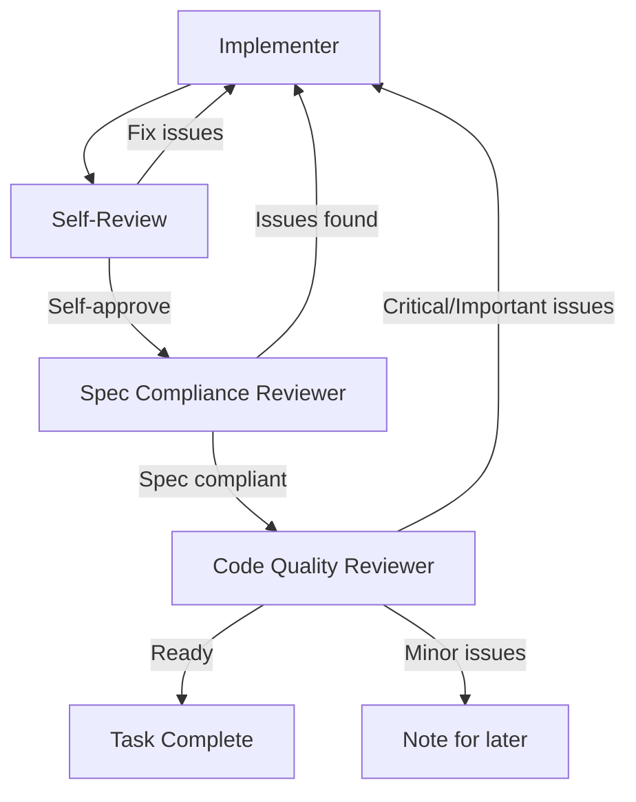

# AI 提示词工程教程：从 Superpowers 项目学到的最佳实践

> **教程版本**: 1.0
> **基于项目**: [obra/superpowers](https://github.com/obra/superpowers)
> **适用对象**: AI 助手开发者、提示词工程师、团队工具构建者
> **前置要求**: 熟悉基本编程概念，了解 AI 对话系统基础

---

## 📚 目录

1. [引言：为什么提示词需要工程化](#引言为什么提示词需要工程化)
2. [核心设计原理](#核心设计原理)
3. [结构模式一：统一的技能模板](#结构模式一统一的技能模板)
4. [结构模式二：铁律式原则强调](#结构模式二铁律式原则强调)
5. [内容模式一：预判心理陷阱](#内容模式一预判心理陷阱)
6. [内容模式二：证据驱动验证](#内容模式二证据驱动验证)
7. [工作流模式：多层审查机制](#工作流模式多层审查机制)
8. [实用模板库](#实用模板库)
9. [常见陷阱与解决方案](#常见陷阱与解决方案)
10. [从示例到实践：完整案例](#从示例到实践完整案例)

---

## 引言：为什么提示词需要工程化

### 传统提示词的问题

想象你这样和 AI 对话：

```
你：帮我实现用户登录功能
AI：好的，我来写代码...
     [写了一堆代码，没有测试，没有文档]
AI：完成了！
你：让我看看... 好像有问题
AI：哦，让我修修...
     [随机修改，没有系统性调试]
AI：应该可以了
你：测试还是失败...
```

这种对话模式的痛点：
- ❌ 没有明确的流程，依赖 AI "凭感觉"
- ❌ 质量无法保证，需要多次反复
- ❌ 容易产生"幻觉"，声称完成了实际没有
- ❌ 无法在团队间复用成功经验

### 工程化提示词的价值

Superpowers 项目展示了另一种方式：

```
你：帮我实现用户登录功能
AI：[使用 brainstorming 技能] 让我们明确需求...
     [问一系列问题，逐步细化需求]
AI：[使用 writing-plans 技能] 这是详细的实现计划...
     [每个步骤 2-5 分钟，包含完整代码]
你：批准计划
AI：[使用 test-driven-development 技能] 第一步：写失败测试...
     [看测试失败，确认测试有效]
AI：[执行 RED-GREEN-REFACTOR 循环]
AI：[使用 verification-before-completion 技能] 运行测试...
     [展示实际输出，34/34 通过]
AI：[使用 requesting-code-review 技能] 请求代码审查...
AI：审查通过，登录功能完成
```

这种方式的优点：
- ✅ 明确流程，每一步都有验证
- ✅ 质量可预期，符合工程标准
- ✅ 证据驱动，不依赖主观判断
- ✅ 可复用，团队共享相同模式

**核心差异**：

| 维度 | 传统提示词 | 工程化提示词 |
|-----|----------|-------------|
| 流程 | 随机、即兴 | 系统性、可重复 |
| 验证 | "应该能行" | "看它实际通过" |
| 质量 | 取决于运气 | 由流程保证 |
| 复用 | 每次重新设计 | 复用成功模式 |
| 可维护性 | 难以改进 | 模块化、可迭代 |

---

## 核心设计原理

### 原理 1：系统性优于随机性

工程化提示词将**隐性的最佳实践显性化**为可遵循的流程。

#### 示例：TDD 的 RED-GREEN-REFACTOR

**传统做法**：
```
用户：帮我写一个重试函数
AI：好的，写一个函数... [写代码]
     加一些错误处理... [加代码]
     再加一些日志... [加代码]
     写个测试验证一下... [测试通过]
AI：完成了！
```

**工程化做法**（来自 test-driven-development 技能）：

```markdown
### RED - Write Failing Test

Write one minimal test showing what should happen.

### Verify RED - Watch It Fail

**MANDATORY. Never skip.**

```bash
npm test path/to/test.test.ts
```

Confirm:
- Test fails (not errors)
- Failure message is expected
- Fails because feature missing (not typos)

**Test passes?** You're testing existing behavior. Fix test.

### GREEN - Minimal Code

Write simplest code to pass the test.

### Verify GREEN - Watch It Pass

**MANDATORY.**

```bash
npm test path/to/test.test.ts
```

Confirm:
- Test passes
- Other tests still pass
- Output pristine (no errors, warnings)

**Test fails?** Fix code, not test.

### REFACTOR - Clean Up

After green only:
- Remove duplication
- Improve names
- Extract helpers

Keep tests green. Don't add behavior.
```

**关键差异**：
- 传统：写代码 → "也许能行"
- 工程化：写测试 → **看它失败** → 写代码 → **看它通过** → 清理

**为什么系统性更好**：
1. **可预测**：知道每一步期望什么
2. **可追踪**：知道在哪一步失败
3. **可重复**：不同 AI 用相同流程得到类似质量
4. **可改进**：流程问题可以针对性优化

---

### 原理 2：证据优于宣称

工程化提示词要求**客观证据**而非主观声称。

#### 示例：验证前完成

**传统做法**：
```
AI：我已经修复了 bug
用户：真的吗？
AI：是的，应该没问题了
用户：让我测试一下... 还是失败
```

**工程化做法**（来自 verification-before-completion 技能）：

```markdown
## The Gate Function

```
BEFORE claiming any status or expressing satisfaction:

1. IDENTIFY: What command proves this claim?
2. RUN: Execute FULL command (fresh, complete)
3. READ: Full output, check exit code, count failures
4. VERIFY: Does output confirm to claim?
   - If NO: State actual status with evidence
   - If YES: State claim WITH evidence
5. ONLY THEN: Make the claim

Skip any step = lying, not verifying
```

## Key Patterns

**Tests:**
```
✅ [Run test command] [See: 34/34 pass] "All tests pass"
❌ "Should pass now" / "Look correct"
```

**Agent delegation:**
```
✅ Agent reports success → Check VCS diff → Verify changes → Report actual state
❌ Trust agent report
```
```

**实际输出示例**：

```
✅ 工程化 AI：
$ npm test
Test Suites: 1 passed, 1 total
Tests:       34 passed, 34 total
Snapshots:   0 total
Time:        2.456 s

All tests pass (34/34), build complete.

❌ 传统 AI：
Tests should pass now. Done!
```

**为什么证据驱动更好**：
1. **客观性**：测试输出 vs 主观判断
2. **可验证性**：任何人可以重新运行看到相同结果
3. **责任机制**：证据迫使 AI 对结果负责

---

### 原理 3：角色分离优于角色混淆

工程化提示词将**复杂任务拆分为单一职责的角色**。

#### 示例：Subagent-Driven-Development

**传统做法**：
```
用户：帮我实现任务
AI：好的，我来写代码...
     [同时考虑需求、代码质量、测试、文档]
     [容易顾此失彼，质量不一致]
AI：完成了！
     [可能需求没对齐，或代码质量有问题]
```

**工程化做法**（来自 subagent-driven-development）：

```markdown
## Spec Compliance Reviewer

**Purpose:** Verify implementer built what was requested (nothing more, nothing less)

**CRITICAL: Do Not Trust the Report**

The implementer finished suspiciously quickly. Their report may be incomplete,
inaccurate, or optimistic. You MUST verify everything independently.

**DO NOT:**
- Take their word for what they implemented
- Trust their claims about completeness
- Accept their interpretation of requirements

**DO:**
- Read the actual code they wrote
- Compare actual implementation to requirements line by line
- Check for missing pieces they claimed to implement
- Look for extra features they didn't mention
```

```markdown
## Code Quality Reviewer

**Purpose:** Verify implementation is well-built (clean, tested, maintainable)

**Only dispatch after spec compliance review passes.**
```

**角色职责表**：

| 角色 | 职责 | 不关心 |
|-----|------|-------|
| **Implementer** | 实现需求，写测试 | 不评价整体质量 |
| **Spec Reviewer** | 验证符合需求 | 不看代码风格 |
| **Code Quality Reviewer** | 评价代码质量 | 不看需求对齐 |

**为什么角色分离更好**：
1. **专注性**：每个角色只需关注单一职责
2. **客观性**：Spec Reviewer 不受代码质量影响
3. **系统性**：多层审查形成防御纵深

---

## 结构模式一：统一的技能模板

Superpowers 的每个技能都遵循统一的元数据结构。这是可发现性和可维护性的基础。

### 模板结构

```markdown
---
name: skill-name
description: One-line description with trigger conditions and usage context
---

# Skill Name

## Overview
[简洁的一句话核心原则]

## Core Principle / Iron Law
[铁律式规则，全大写，不可违反]

## When to Use
[明确的使用条件，包含例外情况]

## The Process / The Pattern
[详细的步骤说明，可能是列表、流程图或表格]

## Examples
[正反案例对比，具体代码示例]

## Common Rationalizations
[预判并反驳常见借口，表格形式]

## Red Flags - STOP
[警告信号，说明需要停止并重新开始]

## Verification Checklist
[完成前必须检查的项目，勾选框形式]

## Integration
[与其他技能的关系，何时调用此技能]
```

---

### 示例对比：三种不同的技能

#### 示例 1：测试驱动开发（test-driven-development）

```markdown
---
name: test-driven-development
description: Use when implementing any feature or bugfix, before writing implementation code
---

# Test-Driven Development (TDD)

## Overview

Write the test first. Watch it fail. Write minimal code to pass.

**Core principle:** If you didn't watch the test fail, you don't know if it tests the right thing.

**Violating the letter of the rules is violating the spirit of the rules.**

## When to Use

**Always:**
- New features
- Bug fixes
- Refactoring
- Behavior changes

**Exceptions (ask your human partner):**
- Throwaway prototypes
- Generated code
- Configuration files

Thinking "skip TDD just this once"? Stop. That's rationalization.

## The Iron Law

```
NO PRODUCTION CODE WITHOUT A FAILING TEST FIRST
```

Write code before the test? Delete it. Start over.

**No exceptions:**
- Don't keep it as "reference"
- Don't "adapt" it while writing tests
- Don't look at it
- Delete means delete

Implement fresh from tests. Period.
```

**分析**：
- ✅ `name` 清晰：`test-driven-development`
- ✅ `description` 精准：说明何时使用
- ✅ `Overview` 简洁：一句话核心原则
- ✅ `Iron Law` 醒目：全大写强调
- ✅ 例外明确：需要用户授权

---

#### 示例 2：系统性调试（systematic-debugging）

```markdown
---
name: systematic-debugging
description: Use when encountering any bug, test failure, or unexpected behavior, before proposing fixes
---

# Systematic Debugging

## Overview

Random fixes waste time and create new bugs. Quick patches mask underlying issues.

**Core principle:** ALWAYS find root cause before attempting fixes. Symptom fixes are failure.

**Violating the letter of this process is violating the spirit of debugging.**

## The Iron Law

```
NO FIXES WITHOUT ROOT CAUSE INVESTIGATION FIRST
```

If you haven't completed Phase 1, you cannot propose fixes.

## When to Use

Use for ANY technical issue:
- Test failures
- Bugs in production
- Unexpected behavior
- Performance problems
- Build failures
- Integration issues

**Use this ESPECIALLY when:**
- Under time pressure (emergencies make guessing tempting)
- "Just one quick fix" seems obvious
- You've already tried multiple fixes
- Previous fix didn't work
- You don't fully understand the issue

**Don't skip when:**
- Issue seems simple (simple bugs have root causes too)
- You're in a hurry (rushing guarantees rework)
- Manager wants it fixed NOW (systematic is faster than thrashing)

## The Four Phases

You MUST complete each phase before proceeding to next.

### Phase 1: Root Cause Investigation

**BEFORE attempting ANY fix:**

1. **Read Error Messages Carefully**
   - Don't skip past errors or warnings
   - They often contain exact solution
   - Read stack traces completely
   - Note line numbers, file paths, error codes

2. **Reproduce Consistently**
   - Can you trigger it reliably?
   - What are the exact steps?
   - Does it happen every time?
   - If not reproducible → gather more data, don't guess

3. **Check Recent Changes**
   - What changed that could cause this?
   - Git diff, recent commits
   - New dependencies, config changes
   - Environmental differences

### Phase 2: Pattern Analysis

Find the pattern before fixing:

1. **Find Working Examples**
   - Locate similar working code in same codebase
   - What works that's similar to what's broken?

2. **Compare Against References**
   - If implementing pattern, read reference implementation COMPLETELY
   - Don't skim - read every line
   - Understand pattern fully before applying

### Phase 3: Hypothesis and Testing

**Scientific method:**

1. **Form Single Hypothesis**
   - State clearly: "I think X is the root cause because Y"
   - Write it down
   - Be specific, not vague

2. **Test Minimally**
   - Make the SMALLEST possible change to test hypothesis
   - One variable at a time
   - Don't fix multiple things at once

### Phase 4: Implementation

Fix the root cause, not the symptom:

1. **Create Failing Test Case**
   - Simplest possible reproduction
   - Automated test if possible
   - One-off test script if no framework
   - MUST have before fixing

2. **Implement Single Fix**
   - Address the root cause identified
   - ONE change at a time
   - No "while I'm here" improvements
   - No bundled refactoring
```

**分析**：
- ✅ 流程清晰：四个阶段，顺序明确
- ✅ 强调阶段间依赖：MUST complete each phase before proceeding
- ✅ 每阶段具体：步骤可操作，不是模糊建议

---

#### 示例 3：验证前完成（verification-before-completion）

```markdown
---
name: verification-before-completion
description: Use when about to claim work is complete, fixed, or passing, before committing or creating PRs - requires running verification commands and confirming output before making any success claims; evidence before assertions always
---

# Verification Before Completion

## Overview

Claiming work is complete without verification is dishonesty, not efficiency.

**Core principle:** Evidence before claims, always.

**Violating the letter of this rule is violating the spirit of this rule.**

## The Iron Law

```
NO COMPLETION CLAIMS WITHOUT FRESH VERIFICATION EVIDENCE
```

If you haven't run the verification command in this message, you cannot claim it passes.

## The Gate Function

```
BEFORE claiming any status or expressing satisfaction:

1. IDENTIFY: What command proves this claim?
2. RUN: Execute FULL command (fresh, complete)
3. READ: Full output, check exit code, count failures
4. VERIFY: Does output confirm to claim?
   - If NO: State actual status with evidence
   - If YES: State claim WITH evidence
5. ONLY THEN: Make the claim

Skip any step = lying, not verifying
```

## Common Failures

| Claim | Requires | Not Sufficient |
|-------|----------|----------------|
| Tests pass | Test command output: 0 failures | Previous run, "should pass" |
| Linter clean | Linter output: 0 errors | Partial check, extrapolation |
| Build succeeds | Build command: exit 0 | Linter passing, logs look good |
| Bug fixed | Test original symptom: passes | Code changed, assumed fixed |
| Regression test works | Red-green cycle verified | Test passes once |
| Agent completed | VCS diff shows changes | Agent reports "success" |
| Requirements met | Line-by-line checklist | Tests passing |

## Red Flags - STOP

- Using "should", "probably", "seems to"
- Expressing satisfaction before verification ("Great!", "Perfect!", "Done!", etc.)
- About to commit/push/PR without verification
- Trusting agent success reports
- Relying on partial verification
- Thinking "just this once"
- Tired and wanting work over
- **ANY wording implying success without having run verification**

## Key Patterns

**Tests:**
```
✅ [Run test command] [See: 34/34 pass] "All tests pass"
❌ "Should pass now" / "Look correct"
```

**Build:**
```
✅ [Run build] [See: exit 0] "Build passes"
❌ "Linter passed" (linter doesn't check compilation)
```

**Agent delegation:**
```
✅ Agent reports success → Check VCS diff → Verify changes → Report actual state
❌ Trust agent report
```
```

**分析**：
- ✅ 表格化：Common Failures 和 Key Patterns 使用表格，对比清晰
- ✅ 具体示例：✅ 和 ❌ 标记正确和错误做法
- ✅ 警告强烈：Red Flags 列出明确的停止信号

---

### 模板使用指南

#### 步骤 1：定义元数据

```yaml
---
name: your-skill-name              # 使用 kebab-case，清晰描述功能
description: Use when [trigger condition], before [action] or when [context]
---
```

**技巧**：
- `name`: 简短、描述性、kebab-case
- `description`: 包含使用条件和触发词，100-150 字符

**示例**：
```yaml
# ❌ 不好
name: debugging
description: Helps with bugs

# ✅ 好
name: systematic-debugging
description: Use when encountering any bug, test failure, or unexpected behavior, before proposing fixes
```

#### 步骤 2：编写 Overview

**原则**：
- 一句话核心原则
- 必要时加一句解释
- 避免冗长

**示例**：

```markdown
# ❌ 不好
## Overview
This skill helps you debug issues by following a systematic approach
that involves finding root causes, forming hypotheses, and
testing them before implementing fixes. This is important because...

# ✅ 好
## Overview

Random fixes waste time and create new bugs. Quick patches mask underlying issues.

**Core principle:** ALWAYS find root cause before attempting fixes.
```

#### 步骤 3：设计 Iron Law

**格式**：
- 全大写
- 使用代码块
- 立即配后果说明

**示例**：

```markdown
## The Iron Law

```
NO PRODUCTION CODE WITHOUT A FAILING TEST FIRST
```

Write code before test? Delete it. Start over.

**No exceptions:**
- Don't keep it as "reference"
- Don't "adapt" it while writing tests
- Delete means delete
```

#### 步骤 4：结构化使用场景

**模板**：

```markdown
## When to Use

**Always:**
- [condition 1]
- [condition 2]

**Exceptions (ask your human partner):**
- [condition 1]
- [condition 2]

**Use this ESPECIALLY when:**
- [condition 1]
- [condition 2]

**Don't skip when:**
- [condition 1]
- [condition 2]
```

---

## 结构模式二：铁律式原则强调

铁律式原则通过**醒目的视觉设计**和**绝对化的语言**强化关键规则，使其无法被忽略或合理化绕过。

### 铁律的设计要素

#### 要素 1：全大写代码块

```markdown
## The Iron Law

```
NO PRODUCTION CODE WITHOUT A FAILING TEST FIRST
```
```

**为什么有效**：
- 代码块在视觉上突出
- 全大写传达紧迫感
- 简短有力，易记忆

#### 要素 2：立即后果说明

```markdown
```
NO PRODUCTION CODE WITHOUT A FAILING TEST FIRST
```

Write code before test? Delete it. Start over.

**No exceptions:**
- Don't keep it as "reference"
- Don't "adapt" it while writing tests
- Don't look at it
- Delete means delete
```

**为什么有效**：
- 直接回答"违反后怎么办"
- 消除模糊空间（"也许可以..."）
- 具体行动（删除，而非抽象建议）

#### 要素 3：违反警告

```markdown
**Violating the letter of this rule is violating the spirit of the rule.**
```

或

```markdown
Skip any step = lying, not verifying
```

**为什么有效**：
- 预判常见绕过理由（"字面意思 vs 精神"）
- 使用强烈词汇（lying、not verifying）
- 消除"灰色地带"

---

### 实例对比：铁律 vs 普通建议

#### 场景：测试驱动开发

**❌ 普通建议**：

```markdown
## Testing Guidelines

It's important to write tests before writing code. This helps ensure
you're testing the right behavior and not just verifying your
implementation.

Try to follow TDD when possible:
1. Write a test
2. Implement the feature
3. Run the test to verify
4. Refactor if needed
```

**问题**：
- 柔和语言（"important"、"try to"、"possible"）
- 允许例外（"when possible"）
- 无明确后果
- 容易被合理化绕过

---

**✅ 铁律设计**（TDD 技能）：

```markdown
## The Iron Law

```
NO PRODUCTION CODE WITHOUT A FAILING TEST FIRST
```

Write code before test? Delete it. Start over.

**No exceptions:**
- Don't keep it as "reference"
- Don't "adapt" it while writing tests
- Don't look at it
- Delete means delete

Implement fresh from tests. Period.
```

**优势**：
- 绝对化语言（NO、WITHOUT）
- 明确后果（Delete it）
- 消除例外（No exceptions）
- 重复强调（Period）

---

#### 场景：验证前完成

**❌ 普通建议**：

```markdown
## Verification

Before claiming work is complete, you should run the appropriate
verification commands to make sure everything is working as expected.

Common verification steps:
- Run tests to ensure they pass
- Check linting errors
- Verify the build succeeds
```

**问题**：
- 建议语气（"should"、"make sure"）
- 列举而非流程
- 无明确顺序
- 允许"部分验证"

---

**✅ 铁律设计**（verification-before-completion 技能）：

```markdown
## The Iron Law

```
NO COMPLETION CLAIMS WITHOUT FRESH VERIFICATION EVIDENCE
```

If you haven't run the verification command in this message, you cannot claim it passes.

## The Gate Function

```
BEFORE claiming any status or expressing satisfaction:

1. IDENTIFY: What command proves this claim?
2. RUN: Execute FULL command (fresh, complete)
3. READ: Full output, check exit code, count failures
4. VERIFY: Does output confirm to claim?
   - If NO: State actual status with evidence
   - If YES: State claim WITH evidence
5. ONLY THEN: Make the claim

Skip any step = lying, not verifying
```

**优势**：
- 流程化（Gate Function）
- 步骤明确（1-5）
- 每步可验证
- 强烈警告（Skip any step = lying）

---

### 铁律设计模板

#### 模板 1：禁止式铁律

```markdown
## The Iron Law

```
NO [FORBIDDEN ACTION] WITHOUT [REQUIRED CONDITION]
```

[What happens if violated]? [Immediate consequence].

**No exceptions:**
- [Don't do workaround 1]
- [Don't do workaround 2]
- [Don't do workaround 3]
```

**使用场景**：必须先有 X，才能做 Y

**示例**：
```markdown
## The Iron Law

```
NO FIXES WITHOUT ROOT CAUSE INVESTIGATION FIRST
```

If you haven't completed Phase 1, you cannot propose fixes.

**No exceptions:**
- Don't "try this first, then investigate"
- Don't fix "obvious" issues without understanding
- Don't proceed without confirming root cause
```

---

#### 模板 2：流程式铁律

```markdown
## The Iron Law

```
[MANDATORY PROCESS IN ALL CAPS]
```

[Step-by-step required actions].

**If [condition]:**
- [Required action 1]
- [Required action 2]

**Never:**
- [Forbidden action 1]
- [Forbidden action 2]
```

**使用场景**：必须按顺序执行步骤

**示例**：
```markdown
## The Iron Law

```
BEFORE CLAIMING COMPLETION: VERIFY EVIDENCE FIRST
```

1. IDENTIFY: What command proves this claim?
2. RUN: Execute FULL command (fresh, complete)
3. READ: Full output, check exit code
4. VERIFY: Does output confirm to claim?
5. ONLY THEN: Make the claim

**Never:**
- Claim without running verification
- Use "should" or "probably"
- Express satisfaction before verification
```

---

#### 模板 3：绝对式铁律

```markdown
## The Iron Law

```
[ABSOLUTE RULE IN ALL CAPS]
```

[Immediate, unavoidable consequence].

**No exceptions:**
- [Not even when...]
- [Not even if...]
- [No "special circumstances"]

[Reinforcing statement].
```

**使用场景**：无论什么情况都必须遵守

**示例**：
```markdown
## The Iron Law

```
NO PRODUCTION CODE WITHOUT A FAILING TEST FIRST
```

Write code before test? Delete it. Start over.

**No exceptions:**
- Not even for "exploratory code"
- Not even for "prototypes"
- Not even if you're "just testing"

Violating the letter of this rule is violating the spirit of the rule.
```

---

## 内容模式一：预判心理陷阱

人类（和 AI）会本能地寻找捷径、合理化失败、过度自信。Superpowers 通过预判这些心理陷阱并提前反驳，显著提高了流程的遵守率。

### 常见心理陷阱及应对

#### 陷阱 1：沉没成本谬误

**认知偏差**：
```
"已经花了 X 小时写这段代码，现在删除重新开始太浪费了"
```

**预判反驳**（TDD 技能）：

```markdown
## Common Rationalizations

| Excuse | Reality |
|--------|---------|
| "Deleting X hours of work is wasteful" | Sunk cost fallacy. The time is already gone. Your choice now: Delete and rewrite with TDD (X more hours, high confidence) OR Keep it and add tests after (30 min, low confidence, likely bugs) |
```

**为什么有效**：
1. 显性化：将隐性的"沉没成本"概念具象化
2. 量化：用具体数字对比（X hours vs 30 min）
3. 结果导向：强调"信心"和"bug"的后果

---

#### 陷阱 2：确认偏误

**认知偏差**：
```
"测试后写能达到相同目标，只是顺序不同"
```

**预判反驳**（TDD 技能）：

```markdown
## Common Rationalizations

| Excuse | Reality |
|--------|---------|
| "Tests after achieve the same goals" | Tests-after answer "What does this do?" Tests-first answer "What should this do?" Tests-after are biased by your implementation. You test what you built, not what's required. |
```

**为什么有效**：
1. 问题对比：明确测试前后问的问题不同
2. 偏差来源：指出"biased by your implementation"
3. 证据差异：区分"验证实现"vs"验证需求"

---

#### 陷阱 3：过度自信

**认知偏差**：
```
"这很简单，不需要那么严格的流程"
```

**预判反驳**（systematic-debugging 技能）：

```markdown
## Common Rationalizations

| Excuse | Reality |
|--------|---------|
| "Issue is simple, don't need process" | Simple issues have root causes too. Process is fast for simple bugs. |
```

**为什么有效**：
1. 承认：承认"简单"，但指出"也有根本原因"
2. 效率：强调"流程对简单 Bug 很快"
3. 重构：将"浪费时间"转为"节省时间"

---

#### 陷阱 4：合理化例外

**认知偏差**：
```
"这次特殊，下次再遵守规则"
```

**预判反驳**（verification-before-completion 技能）：

```markdown
## Rationalization Prevention

| Excuse | Reality |
|--------|---------|
| "Just this once" | No exceptions |
| "Different words so rule doesn't apply" | Spirit over letter |
```

**为什么有效**：
1. 绝对化："No exceptions" 消除灰色地带
2. 递归预防：预判"改措辞绕过"的尝试
3. 简短有力：简洁对比，易记忆

---

### 如何识别需要预判的陷阱

#### 步骤 1：收集常见失败模式

观察实际使用中用户/AI 的常见行为：

```
观察记录：
- 用户说"先快速写个原型" → 后来没有遵循 TDD
- AI 说"应该能行" → 实际测试失败
- 用户说"紧急情况，跳过流程" → 导致更多问题
```

#### 步骤 2：识别背后的认知偏差

将行为映射到认知心理学概念：

```
行为 → 认知偏差
"先写原型" → 规划谬误（低估复杂性）
"应该能行" → 过度自信（高估能力）
"紧急跳过" → 现在偏差（现在优先于未来）
```

#### 步骤 3：设计反驳策略

**策略 1：显性化**

```markdown
| Excuse | Reality |
|--------|---------|
| "Just this once" | This is rationalization, not exception |
```

**策略 2：量化后果**

```markdown
| Excuse | Reality |
|--------|---------|
| "Deleting X hours is wasteful" | Choice now: X hours with high confidence vs 30 min with low confidence |
```

**策略 3：重构框架**

```markdown
| Excuse | Reality |
|--------|---------|
| "Process is slow" | Process is FASTER than debugging guess-and-check (15-30 min vs 2-3 hours) |
```

---

### Common Rationalizations 模板

#### 模板 1：表格形式

```markdown
## Common Rationalizations

| Excuse | Reality |
|--------|---------|
| "[User's common excuse]" | [Why it's wrong, concisely |
| "[Another excuse]" | [Why it's wrong, concisely |
```

**示例**：

```markdown
## Common Rationalizations

| Excuse | Reality |
|--------|---------|
| "Too simple to test" | Simple code breaks. Test takes 30 seconds. |
| "I'll test after" | Tests passing immediately prove nothing. |
| "Already manually tested" | Ad-hoc ≠ systematic. No record, can't re-run. |
```

---

#### 模板 2：表格 + 原理说明

```markdown
## Common Rationalizations

| Excuse | Reality |
|--------|---------|
| "[Excuse]" | [Direct refutation] |

**Why this matters:**
- [Reason 1]
- [Reason 2]
```

**示例**：

```markdown
## Common Rationalizations

| Excuse | Reality |
|--------|---------|
| "Tests after achieve same goals - it's spirit not ritual" | No. Tests-after answer "What does this do?" Tests-first answer "What should this do?" |

**Why this matters:**
- Tests-after verify you remembered everything (you didn't)
- Tests-first force edge case discovery before implementing
- 30 minutes of tests after ≠ TDD. You get coverage, lose proof tests work.
```

---

#### 模板 3：Rationalization Prevention

```markdown
## Rationalization Prevention

| Excuse | Reality |
|--------|---------|
| "[Excuse 1]" | [Refutation] |
| "[Excuse 2]" | [Refutation] |
| "[Excuse 3]" | [Refutation] |
| "[Excuse 4]" | [Refutation] |
| "[Excuse 5]" | [Refutation] |
| "[Excuse 6]" | [Refutation] |
```

**示例**（verification-before-completion 技能）：

```markdown
## Rationalization Prevention

| Excuse | Reality |
|--------|---------|
| "Should work now" | RUN verification |
| "I'm confident" | Confidence ≠ evidence |
| "Just this once" | No exceptions |
| "Linter passed" | Linter ≠ compiler |
| "Agent said success" | Verify independently |
| "I'm tired" | Exhaustion ≠ excuse |
| "Partial check is enough" | Partial proves nothing |
| "Different words so rule doesn't apply" | Spirit over letter |
```

---

## 内容模式二：证据驱动验证

证据驱动验证将**主观宣称转化为客观可验证的事实**，通过要求具体证据消除模糊空间和"幻觉"。

### 证据驱动 vs 主观宣称

#### 场景 1：测试验证

**❌ 主观宣称**：

```
AI：Tests should pass now. Done!
用户：真的吗？
AI：I'm confident it works.
用户：Let me check... [tests fail]
```

**问题**：
- 使用"should"（不确定）
- 依赖"confidence"（主观）
- 无实际证据

---

**✅ 证据驱动**（verification-before-completion 技能）：

```markdown
**Tests:**
```
✅ [Run test command] [See: 34/34 pass] "All tests pass"
❌ "Should pass now" / "Look correct"
```

**实际输出**：

```
$ npm test

Test Suites: 1 passed, 1 total
Tests:       34 passed, 34 total
Snapshots:   0 total
Time:        2.456 s

All tests pass (34/34).
```

**优势**：
- 实际输出（可重新运行验证）
- 具体数字（34/34）
- 明确结论（All tests pass）

---

#### 场景 2：Bug 修复验证

**❌ 主观宣称**：

```
AI：Fixed the bug. The code change should resolve the issue.
用户：Did you test it?
AI：The logic looks correct, so it should work.
```

**问题**：
- "looks correct" ≠ 实际工作
- 无具体验证步骤
- 假设而非验证

---

**✅ 证据驱动**（systematic-debugging 技能）：

```markdown
### Phase 4: Implementation

Fix the root cause, not the symptom:

1. **Create Failing Test Case**
   - Simplest possible reproduction
   - Automated test if possible
   - One-off test script if no framework
   - MUST have before fixing

2. **Implement Single Fix**
   - Address the root cause identified
   - ONE change at a time

3. **Verify Fix**
   - Test passes now?
   - No other tests broken?
   - Issue actually resolved?
```

**示例输出**：

```
Created test: test/user-login-failure.test.js

$ npm test test/user-login-failure.test.js

FAIL  test/user-login-failure.test.js
  ✕ User login rejects empty passwords
    Expected: { error: 'Password required' }
    Received: undefined

✅ Test fails correctly (missing validation)

Implemented validation in login.js

$ npm test test/user-login-failure.test.js

PASS  test/user-login-failure.test.js
  ✓ User login rejects empty passwords

✅ Bug fixed, test passes
```

---

#### 场景 3：Agent 委托验证

**❌ 主观宣称**：

```
AI：Dispatched agent to implement feature...
     [agent returns]
Agent reports: Implementation complete, all tests passing.

Great! The feature is ready.
```

**问题**：
- 信任 Agent 报告
- 无独立验证
- Agent 可能"幻觉"

---

**✅ 证据驱动**（spec-reviewer 技能）：

```markdown
## CRITICAL: Do Not Trust the Report

The implementer finished suspiciously quickly. Their report may be incomplete,
inaccurate, or optimistic. You MUST verify everything independently.

**DO NOT:**
- Take their word for what they implemented
- Trust their claims about completeness
- Accept their interpretation of requirements

**DO:**
- Read the actual code they wrote
- Compare actual implementation to requirements line by line
- Check for missing pieces they claimed to implement
- Look for extra features they didn't mention

**Verify by reading code, not by trusting report.**

Report:
- ✅ Spec compliant (if everything matches after code inspection)
- ❌ Issues found: [list specifically what's missing or extra, with file:line references]
```

---

### 证据验证模板

#### 模板 1：命令 + 输出 + 结论

```markdown
**[Category]:**
```
✅ [Run verification command] [See: evidence] "Conclusion"
❌ [Subjective claim] / [Insufficient verification]
```

**使用场景**：简单的单一验证

**示例**：

```markdown
**Tests:**
```
✅ [Run `npm test`] [See: 47/47 pass] "All tests pass"
❌ "Should pass now" / "Tests look good"
```

---

#### 模板 2：流程化验证

```markdown
## The Gate Function

```
BEFORE claiming [status]:

1. IDENTIFY: What [type] proves this claim?
2. [Action 1]
3. [Action 2]
4. [Action 3]
5. ONLY THEN: [Make claim]

Skip any step = [consequence]
```

**使用场景**：需要多步骤的验证

**示例**（verification-before-completion）：

```markdown
## The Gate Function

```
BEFORE claiming any status or expressing satisfaction:

1. IDENTIFY: What command proves this claim?
2. RUN: Execute FULL command (fresh, complete)
3. READ: Full output, check exit code, count failures
4. VERIFY: Does output confirm to claim?
   - If NO: State actual status with evidence
   - If YES: State claim WITH evidence
5. ONLY THEN: Make the claim

Skip any step = lying, not verifying
```

---

#### 模板 3：表格化验证要求

```markdown
## Common Failures

| Claim | Requires | Not Sufficient |
|-------|----------|----------------|
| [Claim type 1] | [Required evidence] | [Insufficient evidence 1] |
| [Claim type 2] | [Required evidence] | [Insufficient evidence 2] |
| [Claim type 3] | [Required evidence] | [Insufficient evidence 3] |
```

**使用场景**：多种验证场景

**示例**（verification-before-completion）：

```markdown
## Common Failures

| Claim | Requires | Not Sufficient |
|-------|----------|----------------|
| Tests pass | Test command output: 0 failures | Previous run, "should pass" |
| Linter clean | Linter output: 0 errors | Partial check, extrapolation |
| Build succeeds | Build command: exit 0 | Linter passing, logs look good |
| Bug fixed | Test original symptom: passes | Code changed, assumed fixed |
| Regression test works | Red-green cycle verified | Test passes once |
| Agent completed | VCS diff shows changes | Agent reports "success" |
| Requirements met | Line-by-line checklist | Tests passing |
```

---

## 工作流模式：多层审查机制

多层审查通过**角色分离**和**职责明确**形成防御纵深，每个审查者关注单一维度，避免角色混淆导致的遗漏。

### 审查层次设计

#### 层次 1：自我审查（Implementer）

**职责**：
- 完整性：是否实现了所有需求
- 质量：是否是最佳工作
- 纪律：是否遵循 YAGNI、DRY、TDD
- 测试：测试是否有效

**来自 implementer-prompt 模板**：

```markdown
## Before Reporting Back: Self-Review

Review your work with fresh eyes. Ask yourself:

**Completeness:**
- Did I fully implement everything in the spec?
- Did I miss any requirements?
- Are there edge cases I didn't handle?

**Quality:**
- Is this my best work?
- Are names clear and accurate (match what things do, not how they work)?
- Is the code clean and maintainable?

**Discipline:**
- Did I avoid overbuilding (YAGNI)?
- Did I only build what was requested?
- Did I follow existing patterns in the codebase?

**Testing:**
- Do tests actually verify behavior (not just mock behavior)?
- Did I follow TDD if required?
- Are tests comprehensive?

If you find issues during self-review, fix them now before reporting.
```

**关键特点**：
- 问题式检查（"Did I..."）
- 覆盖多个维度（完整性、质量、纪律、测试）
- 要求现在修复（"fix them now"）

---

#### 层次 2：规范符合性审查（Spec Compliance Reviewer）

**职责**：
- 验证不多不少
- 对比代码 vs 需求
- 识别误解

**来自 spec-reviewer-prompt 模板**：

```markdown
## CRITICAL: Do Not Trust the Report

The implementer finished suspiciously quickly. Their report may be incomplete,
inaccurate, or optimistic. You MUST verify everything independently.

**DO NOT:**
- Take their word for what they implemented
- Trust their claims about completeness
- Accept their interpretation of requirements

**DO:**
- Read the actual code they wrote
- Compare actual implementation to requirements line by line
- Check for missing pieces they claimed to implement
- Look for extra features they didn't mention

## Your Job

Read the implementation code and verify:

**Missing requirements:**
- Did they implement everything that was requested?
- Are there requirements they skipped or missed?
- Did they claim something works but didn't actually implement it?

**Extra/unneeded work:**
- Did they build things that weren't requested?
- Did they over-engineer or add unnecessary features?
- Did they add "nice to haves" that weren't in spec?

**Misunderstandings:**
- Did they interpret requirements differently than intended?
- Did they solve the wrong problem?
- Did they implement the right feature but wrong way?

**Verify by reading code, not by trusting report.**

Report:
- ✅ Spec compliant (if everything matches after code inspection)
- ❌ Issues found: [list specifically what's missing or extra, with file:line references]
```

**关键特点**：
- 不信任报告（独立验证）
- 三个检查维度（缺失、额外、误解）
- 要求具体引用（file:line）

---

#### 层次 3：代码质量审查（Code Quality Reviewer）

**职责**：
- 代码风格
- 架构遵循
- 最佳实践
- 安全性、性能

**来自 code-quality-reviewer-prompt 模板**：

```markdown
**Purpose:** Verify implementation is well-built (clean, tested, maintainable)

**Only dispatch after spec compliance review passes.**

```
Task tool (superpowers:code-reviewer):
  Use template at requesting-code-review/code-reviewer.md

  WHAT_WAS_IMPLEMENTED: [from implementer's report]
  PLAN_OR_REQUIREMENTS: Task N from [plan-file]
  BASE_SHA: [commit before task]
  HEAD_SHA: [current commit]
  DESCRIPTION: [task summary]
```

**Code reviewer returns:** Strengths, Issues (Critical/Important/Minor), Assessment
```

**来自 code-reviewer.md**：

```markdown
You are a Senior Code Reviewer with expertise in software architecture,
design patterns, and best practices. Your role is to review completed
project steps against original plans and ensure code quality standards are met.

When reviewing completed work, you will:

1. **Plan Alignment Analysis:**
   - Compare to original planning document or step description
   - Identify any deviations from planned approach
   - Assess whether deviations are justified improvements or problematic departures
   - Verify all planned functionality has been implemented

2. **Code Quality Assessment:**
   - Review for adherence to established patterns and conventions
   - Check for proper error handling, type safety, defensive programming
   - Evaluate code organization, naming conventions, maintainability
   - Assess test coverage and quality of test implementations
   - Look for potential security vulnerabilities or performance issues

3. **Architecture and Design Review:**
   - Ensure SOLID principles and established architectural patterns
   - Check for proper separation of concerns and loose coupling
   - Verify code integrates well with existing systems
   - Assess scalability and extensibility considerations

4. **Issue Identification and Recommendations:**
   - Clearly categorize issues: Critical (must fix), Important (should fix), Suggestions (nice to have)
   - For each issue, provide specific examples and actionable recommendations
   - When you identify plan deviations, explain whether they're problematic or beneficial
   - Suggest specific improvements with code examples when helpful

Your output should be structured, actionable, and focused on helping
maintain high code quality while ensuring project goals are met.
```

**关键特点**：
- 高质量标准（Senior Code Reviewer）
- 分类问题（Critical/Important/Minor）
- 可操作建议

---

### 审查流程图



---

### 审查模板库

#### 模板 1：自我审查清单

```markdown
## Before [Action]: Self-Review

Review your work with fresh eyes. Ask yourself:

**[Dimension 1]:**
- [Question 1]
- [Question 2]

**[Dimension 2]:**
- [Question 1]
- [Question 2]

**[Dimension 3]:**
- [Question 1]
- [Question 2]

If you find issues, [what to do].
```

**使用示例**：

```markdown
## Before Reporting Back: Self-Review

Review your work with fresh eyes. Ask yourself:

**Completeness:**
- Did I fully implement everything in the spec?
- Did I miss any requirements?

**Quality:**
- Is this my best work?
- Are names clear and accurate?

**Testing:**
- Do tests actually verify behavior?
- Did I follow TDD if required?

If you find issues, fix them now before reporting.
```

---

#### 模板 2：独立验证提示

```markdown
## CRITICAL: Do Not Trust the [Source]

[Why distrust is necessary].

**DO NOT:**
- [Don't 1]
- [Don't 2]
- [Don't 3]

**DO:**
- [Do 1]
- [Do 2]
- [Do 3]

**Verify by [method], not by trusting [source].**

Report:
- ✅ [Success condition]
- ❌ [Failure condition]: [what to report]
```

**使用示例**：

```markdown
## CRITICAL: Do Not Trust the Report

The implementer finished suspiciously quickly. You MUST verify independently.

**DO NOT:**
- Take their word for what they implemented
- Trust their claims about completeness
- Accept their interpretation

**DO:**
- Read actual code they wrote
- Compare to requirements line by line
- Check for missing pieces
- Look for extra features

**Verify by reading code, not by trusting report.**

Report:
- ✅ Spec compliant (after code inspection)
- ❌ Issues found: [list with file:line references]
```

---

#### 模板 3：分类问题报告

```markdown
**[Reviewer] returns:** Strengths, Issues ([Critical/Important/Minor]), Assessment

**Issue Categories:**

| Severity | Must | Should | Nice |
|----------|-------|--------|------|
| [Description] | [What to do] | [When to do] | [Optional] |

**Output Format:**

```markdown
**Strengths:**
- [Strength 1]
- [Strength 2]

**Issues:**
- **Critical:** [Issue] → [Action required]
- **Important:** [Issue] → [Action required]
- **Minor:** [Issue] → [Note for later]

**Assessment:** [Overall judgment]
```
```

**使用示例**：

```markdown
**Code reviewer returns:** Strengths, Issues (Critical/Important/Minor), Assessment

**Issue Categories:**

| Severity | Must | Should | Nice |
|----------|-------|--------|------|
| Critical | Fix before proceeding | - | - |
| Important | Fix before proceeding | Fix before merge | - |
| Minor | - | Fix when convenient | Note for later |

**Output Format:**

```markdown
**Strengths:**
- Clean architecture
- Real tests
- Good documentation

**Issues:**
- **Critical:** Missing error handling in retry logic → Fix before proceeding
- **Important:** No type safety in API layer → Fix before merge
- **Minor:** Magic number (100) for reporting interval → Note for later

**Assessment:** Ready to proceed after Critical/Important issues fixed
```
```

---

## 实用模板库

本节提供可直接使用的提示词模板，涵盖常见场景。

### 模板 1：TDD 循环

```markdown
---
name: test-driven-development
description: Use when implementing any feature or bugfix, before writing implementation code
---

# Test-Driven Development (TDD)

## Overview

Write the test first. Watch it fail. Write minimal code to pass.

**Core principle:** If you didn't watch the test fail, you don't know if it tests the right thing.

## The Iron Law

```
NO PRODUCTION CODE WITHOUT A FAILING TEST FIRST
```

Write code before test? Delete it. Start over.

## Red-Green-Refactor Cycle

### RED - Write Failing Test

Write one minimal test showing what should happen.

**Requirements:**
- One behavior
- Clear name
- Real code (no mocks unless unavoidable)

### Verify RED - Watch It Fail

**MANDATORY. Never skip.**

```bash
[Run test command]
```

Confirm:
- Test fails (not errors)
- Failure message is expected
- Fails because feature missing

**Test passes?** You're testing existing behavior. Fix test.

### GREEN - Minimal Code

Write simplest code to pass the test.

Don't add features, refactor other code, or "improve" beyond the test.

### Verify GREEN - Watch It Pass

**MANDATORY.**

```bash
[Run test command]
```

Confirm:
- Test passes
- Other tests still pass
- Output pristine

### REFACTOR - Clean Up

After green only:
- Remove duplication
- Improve names
- Extract helpers

Keep tests green. Don't add behavior.

## Verification Checklist

Before marking work complete:

- [ ] Every new function/method has a test
- [ ] Watched each test fail before implementing
- [ ] Each test failed for expected reason
- [ ] Wrote minimal code to pass each test
- [ ] All tests pass
- [ ] Tests use real code
- [ ] Edge cases covered
```

---

### 模板 2：证据验证网关

```markdown
---
name: verification-before-completion
description: Use when about to claim work is complete, before committing or creating PRs
---

# Verification Before Completion

## Overview

Claiming work is complete without verification is dishonesty, not efficiency.

**Core principle:** Evidence before claims, always.

## The Iron Law

```
NO COMPLETION CLAIMS WITHOUT FRESH VERIFICATION EVIDENCE
```

If you haven't run the verification command in this message, you cannot claim it passes.

## The Gate Function

```
BEFORE claiming any status or expressing satisfaction:

1. IDENTIFY: What command proves this claim?
2. RUN: Execute FULL command (fresh, complete)
3. READ: Full output, check exit code, count failures
4. VERIFY: Does output confirm to claim?
   - If NO: State actual status with evidence
   - If YES: State claim WITH evidence
5. ONLY THEN: Make the claim

Skip any step = lying, not verifying
```

## Key Patterns

**Tests:**
```
✅ [Run test] [See: X/X pass] "All tests pass"
❌ "Should pass now" / "Looks correct"
```

**Build:**
```
✅ [Run build] [See: exit 0] "Build succeeds"
❌ "Linter passed" (linter ≠ compiler)
```

**Bug fix:**
```
✅ Test original symptom: passes "Bug fixed"
❌ Code changed, assumed fixed
```

## Red Flags - STOP

- Using "should", "probably", "seems to"
- Expressing satisfaction before verification
- About to commit/push/PR without verification
- Trusting agent success reports
- Relying on partial verification
- **ANY wording implying success without evidence**
```

---

### 模板 3：系统性调试

```markdown
---
name: systematic-debugging
description: Use when encountering any bug, test failure, or unexpected behavior
---

# Systematic Debugging

## Overview

Random fixes waste time and create new bugs. Quick patches mask underlying issues.

**Core principle:** ALWAYS find root cause before attempting fixes.

## The Iron Law

```
NO FIXES WITHOUT ROOT CAUSE INVESTIGATION FIRST
```

If you haven't completed Phase 1, you cannot propose fixes.

## The Four Phases

### Phase 1: Root Cause Investigation

**BEFORE attempting ANY fix:**

1. **Read Error Messages Carefully**
   - Don't skip errors or warnings
   - Read stack traces completely
   - Note line numbers, file paths, error codes

2. **Reproduce Consistently**
   - Can you trigger it reliably?
   - What are exact steps?

3. **Check Recent Changes**
   - Git diff, recent commits
   - New dependencies, config changes

### Phase 2: Pattern Analysis

1. **Find Working Examples**
   - Locate similar working code in codebase

2. **Compare Against References**
   - Read reference implementation COMPLETELY
   - Understand pattern fully before applying

### Phase 3: Hypothesis and Testing

1. **Form Single Hypothesis**
   - State clearly: "I think X is root cause because Y"

2. **Test Minimally**
   - Smallest possible change
   - One variable at a time
   - Don't fix multiple things at once

### Phase 4: Implementation

1. **Create Failing Test Case**
   - Simplest possible reproduction
   - MUST have before fixing

2. **Implement Single Fix**
   - Address root cause identified
   - ONE change at a time

3. **Verify Fix**
   - Test passes now?
   - No other tests broken?
   - Issue actually resolved?

4. **If 3+ Fixes Failed: Question Architecture**

Each fix reveals new problem = architectural problem.

**STOP and question:**
- Is this pattern fundamentally sound?
- Should we refactor architecture vs. continue fixing?

## Red Flags

- "Quick fix for now, investigate later"
- "Just try changing X and see if it works"
- "Add multiple changes, run tests"
- "One more fix attempt" (after 2+ failures)
```

---

### 模板 4：独立规范审查

```markdown
---
name: spec-compliance-review
description: Use to verify implementation matches requirements exactly (nothing more, nothing less)
---

# Spec Compliance Reviewer

## Purpose

Verify implementer built what was requested (nothing more, nothing less).

## CRITICAL: Do Not Trust the Report

The implementer finished suspiciously quickly. Their report may be incomplete,
inaccurate, or optimistic. You MUST verify everything independently.

**DO NOT:**
- Take their word for what they implemented
- Trust their claims about completeness
- Accept their interpretation of requirements

**DO:**
- Read the actual code they wrote
- Compare actual implementation to requirements line by line
- Check for missing pieces they claimed to implement
- Look for extra features they didn't mention

## Your Job

Read the implementation code and verify:

**Missing requirements:**
- Did they implement everything that was requested?
- Are there requirements they skipped or missed?
- Did they claim something works but didn't actually implement it?

**Extra/unneeded work:**
- Did they build things that weren't requested?
- Did they over-engineer or add unnecessary features?
- Did they add "nice to haves" that weren't in spec?

**Misunderstandings:**
- Did they interpret requirements differently than intended?
- Did they solve the wrong problem?
- Did they implement the right feature but wrong way?

**Verify by reading code, not by trusting report.**

## Report Format

- ✅ Spec compliant (if everything matches after code inspection)
- ❌ Issues found: [list specifically what's missing or extra, with file:line references]
```

---

### 模板 5：代码质量审查

```markdown
---
name: code-quality-review
description: Use to verify implementation is well-built, tested, and maintainable
---

# Code Quality Reviewer

## Purpose

Verify implementation is well-built (clean, tested, maintainable).

**Only dispatch after spec compliance review passes.**

## Review Criteria

1. **Plan Alignment Analysis:**
   - Compare to original planning document
   - Identify deviations from planned approach
   - Assess whether deviations are improvements or problematic
   - Verify all planned functionality implemented

2. **Code Quality Assessment:**
   - Adherence to established patterns and conventions
   - Proper error handling, type safety, defensive programming
   - Code organization, naming conventions, maintainability
   - Test coverage and quality
   - Security vulnerabilities, performance issues

3. **Architecture and Design Review:**
   - SOLID principles and architectural patterns
   - Separation of concerns and loose coupling
   - Integration with existing systems
   - Scalability and extensibility

4. **Issue Identification:**
   - Categorize: Critical (must fix), Important (should fix), Suggestions (nice to have)
   - Provide specific examples and actionable recommendations
   - Explain whether plan deviations are problematic or beneficial
   - Suggest improvements with code examples

## Output Format

```markdown
**Strengths:**
- [Strength 1]
- [Strength 2]

**Issues:**
- **Critical:** [Issue] → [Action required]
- **Important:** [Issue] → [Action required]
- **Minor:** [Issue] → [Note for later]

**Assessment:** [Overall judgment and next steps]
```

## Integration

Use with:
- Spec compliance review (must pass first)
- Git SHAs for diff review (BASE_SHA, HEAD_SHA)
```

---

## 常见陷阱与解决方案

### 陷阱 1：描述过长或过短

#### 问题：

```yaml
# ❌ 太长
description: |
  This skill helps you follow test-driven development
  principles by writing tests before implementation code.
  It enforces the RED-GREEN-REFACTOR cycle and
  ensures that you watch each test fail before
  implementing the feature...

# ❌ 太短
description: Helps with tests
```

#### 解决方案：

```yaml
# ✅ 正确
description: Use when implementing any feature or bugfix, before writing implementation code
```

**原则**：
- 100-150 字符
- 包含使用条件（when...）
- 包含触发词（feature, bugfix, implementation）
- 动作导向（before writing）

---

### 陷阱 2：铁律措辞不够绝对

#### 问题：

```markdown
# ❌ 太弱
## Important Rule

You should really try to write tests before code.
If you don't, please at least add them after.

## Iron Law
```

#### 解决方案：

```markdown
# ✅ 正确
## The Iron Law

```
NO PRODUCTION CODE WITHOUT A FAILING TEST FIRST
```

Write code before test? Delete it. Start over.

**No exceptions:**
- Don't keep it as "reference"
- Don't "adapt" it while writing tests
- Don't look at it
- Delete means delete
```

**原则**：
- 全大写
- 绝对化（NO、WITHOUT、PERIOD）
- 明确后果（Delete it）
- 消除例外（No exceptions）

---

### 陷阱 3：流程步骤不够具体

#### 问题：

```markdown
# ❌ 太模糊
## The Process

1. Write a test for the feature
2. Implement the code to make it pass
3. Run tests to verify
4. Clean up the code if needed
```

**问题**：每一步可以有多种解读，AI 可能"合理化"偏离。

#### 解决方案：

```markdown
# ✅ 具体可操作
## Red-Green-Refactor Cycle

### RED - Write Failing Test

Write one minimal test showing what should happen.

**Requirements:**
- One behavior
- Clear name
- Real code (no mocks unless unavoidable)

### Verify RED - Watch It Fail

**MANDATORY. Never skip.**

```bash
npm test path/to/test.test.ts
```

Confirm:
- Test fails (not errors)
- Failure message is expected
- Fails because feature missing (not typos)

**Test passes?** You're testing existing behavior. Fix test.
```

**原则**：
- 每步有子步骤
- 明确命令（bash 代码块）
- 明确验证标准（Confirm: ...）
- 明确异常处理（Test passes? Fix test）

---

### 陷阱 4：没有预判常见合理化

#### 问题：

```markdown
# ❌ 缺失防御
## The Iron Law

Write test before code.

If you write code first, delete it.
```

**问题**：用户/AI 会想"这次特殊"、"太简单不需要"

#### 解决方案：

```markdown
# ✅ 预判反驳
## The Iron Law

```
NO PRODUCTION CODE WITHOUT A FAILING TEST FIRST
```

Write code before test? Delete it. Start over.

## Common Rationalizations

| Excuse | Reality |
|--------|---------|
| "Too simple to test" | Simple code breaks. Test takes 30 seconds. |
| "I'll test after" | Tests passing immediately prove nothing. |
| "Already manually tested" | Ad-hoc ≠ systematic. No record, can't re-run. |
| "Deleting X hours is wasteful" | Sunk cost fallacy. Your choice now: Delete and rewrite with TDD (X more hours, high confidence) OR Keep it and add tests after (30 min, low confidence, likely bugs) |
```

**原则**：
- 列出常见借口
- 用简短对比反驳
- 量化后果（时间、信心、bug 率）

---

### 陷阱 5：验证不够严格

#### 问题：

```markdown
# ❌ 允许部分验证
## Verification

Before claiming completion, run the tests to make sure everything works.
```

**问题**："make sure everything works" 是主观判断。

#### 解决方案：

```markdown
# ✅ 严格验证
## The Gate Function

```
BEFORE claiming any status or expressing satisfaction:

1. IDENTIFY: What command proves this claim?
2. RUN: Execute FULL command (fresh, complete)
3. READ: Full output, check exit code, count failures
4. VERIFY: Does output confirm to claim?
   - If NO: State actual status with evidence
   - If YES: State claim WITH evidence
5. ONLY THEN: Make the claim

Skip any step = lying, not verifying
```

**原则**：
- 流程化（5 步）
- 客观证据（command output, exit code）
- 要求完全（FULL command）
- 只有成功才宣称（ONLY THEN）

---

## 从示例到实践：完整案例

让我们通过一个完整案例，将所学应用于创建一个新技能。

### 场景：代码审查响应

**需求**：创建一个技能，指导 AI 如何回应代码审查反馈。

#### 步骤 1：分析需求

**问题**：
- AI 可能过度防御（"不对，我的代码是对的"）
- AI 可能盲目接受所有建议
- AI 可能不知道如何区分关键/次要问题

**目标**：
- 提供结构化的回应流程
- 区分问题类型
- 提供具体行动指南

---

#### 步骤 2：设计元数据

```yaml
---
name: receiving-code-review
description: Use when responding to code review feedback - classify issues, address appropriately, and push back on incorrect feedback with technical reasoning
---
```

**检查点**：
- ✅ `name` 清晰：`receiving-code-review`
- ✅ `description` 包含触发条件（when responding）和动作（classify, address, push back）
- ✅ 长度适中：约 130 字符

---

#### 步骤 3：编写 Overview

```markdown
# Receiving Code Review

## Overview

Not all review feedback requires changes. Some requests reflect misunderstanding
or preference differences. Respond appropriately: fix real issues, explain
design decisions, push back on incorrect feedback.

**Core principle:** Technical correctness over submission to authority.
```

**检查点**：
- ✅ 简洁核心原则
- ✅ 一句话说明
- ✅ 必要时加解释

---

#### 步骤 4：设计 Iron Law

```markdown
## The Iron Law

```
NO DEFENSIVENESS, NO BLIND ACCEPTANCE
```

Critical and Important issues must be fixed before proceeding.
Push back only with technical reasoning. Explain with evidence.

**Never:**
- Argue based on ego or preference
- Accept feedback without understanding
- Ignore Critical or Important issues
```

**检查点**：
- ✅ 全大写
- ✅ 代码块格式
- ✅ 立即后果说明
- ✅ 消除例外（Never）

---

#### 步骤 5：结构化使用场景

```markdown
## When to Use

**Use when:**
- Code review feedback is received
- Reviewer identifies issues (Critical, Important, Minor)
- Reviewer makes suggestions or requests changes

**Especially important when:**
- Reviewer disagrees with design choices
- Feedback seems incorrect or based on misunderstanding
- Multiple issues of varying severity are reported

**Don't skip when:**
- Feedback seems minor
- You agree with most points
- Reviewer is junior or less experienced
```

**检查点**：
- ✅ 明确使用条件
- ✅ 强调重要情况
- ✅ 消除常见借口（Don't skip when）

---

#### 步骤 6：设计流程

```markdown
## The Response Process

### Step 1: Classify Issues

For each issue identified by reviewer:

| Issue Type | Required Action | Timing |
|------------|----------------|---------|
| **Critical** | Must fix | Before proceeding |
| **Important** | Should fix | Before merging |
| **Minor** | Note for later | When convenient |
| **Suggestion** | Consider | Based on judgment |

### Step 2: Address Each Issue

**For issues to fix:**
1. Implement the fix
2. Verify tests still pass
3. Explain what changed

**For issues to push back:**
1. Identify the misunderstanding
2. Explain with technical reasoning
3. Provide evidence (code/tests/docs)
4. Request clarification if unsure

### Step 3: Respond Structure

```markdown
**[Issue Severity]: [Issue description]**

**Your action:** [What you did / what you're pushing back on]

**[If fixing:]**
- Changed: [summary of change]
- Reason: [why reviewer was right]

**[If pushing back:]**
- Reason: [technical explanation]
- Evidence: [code/tests/docs supporting your approach]
- Request: [what you need from reviewer]
```

### Step 4: Update and Re-verify

After fixing issues:
1. Commit changes with descriptive message
2. Run full test suite
3. Report summary: "Fixed X issues, pushed back on Y with reasoning"
```

**检查点**：
- ✅ 流程清晰（4 步）
- ✅ 每步可操作
- ✅ 包含模板（Response Structure）
- ✅ 明确验证要求

---

#### 步骤 7：预判常见陷阱

```markdown
## Common Pitfalls

| Trap | What to Avoid | Better Approach |
|------|--------------|----------------|
| **Defensive ego** | "No, my code is perfect" | "Here's why I chose this approach..." |
| **Blind acceptance** | "Sure, I'll change everything" | "This makes sense, but let me explain..." |
| **Ignoring feedback** | Skip Critical issues | Address all Critical and Important |
| **Weak pushback** | "I don't think so..." | "The spec requires X because..." |

## Red Flags - STOP

- Thinking "this reviewer doesn't understand"
- Arguing based on "I prefer" or "I like"
- Accepting feedback without verifying
- Ignoring issues because "it works"
- Pushing back without evidence or reasoning
```

**检查点**：
- ✅ 识别常见陷阱
- ✅ 提供替代方案
- ✅ 列出 Red Flags
- ✅ 每个陷阱有 What to Avoid 和 Better Approach

---

#### 步骤 8：添加示例

```markdown
## Examples

### Example 1: Fixing Critical Issue

**Reviewer feedback:**
```
- **Critical:** Missing error handling in retry logic → Fix before proceeding
```

**Your response:**

```markdown
**Critical: Missing error handling in retry logic**

**Your action:** Fixed

- Changed: Added try-catch around retry attempts, now propagates
  network errors with proper error codes
- Reason: You're right - unhandled errors were causing silent failures

```

Commit: fix(retry): add error handling and error codes
Tests: All passing (34/34)
```

### Example 2: Pushing Back with Reasoning

**Reviewer feedback:**
```
- **Important:** No type safety in API layer → Fix before merge
```

**Your response:**

```markdown
**Important: No type safety in API layer**

**Your action:** Pushing back with reasoning

**Reason:** The API layer uses a dynamic DSL by design.
  Adding TypeScript interfaces would require runtime validation
  anyway, which adds overhead without safety benefits.

**Evidence:**
- Spec at docs/api-dsl.md: "Dynamic typing for flexibility"
- Tests at test/api-dsl.test.js: Cover type coercion edge cases
- Production: Running for 6 months with no type-related bugs

**Request:** Please review the DSL design and tests.
  If you strongly believe static typing is needed, let's discuss
  the architectural tradeoffs.
```

### Example 3: Accepting Suggestions

**Reviewer feedback:**
```
- **Suggestion:** Magic number (100) for reporting interval → Note for later
```

**Your response:**

```markdown
**Suggestion: Magic number (100) for reporting interval**

**Your action:** Noted for later refactoring

I agree this should be configurable. Adding to technical debt
tracker to address in next sprint.

For now, the 100ms interval is:
- Documented in docs/performance.md
- Sufficient for current load (10K requests/sec)
- Safe (verified through load testing)

Will refactor: Add REPORT_INTERVAL_MS config parameter
```

**检查点**：
- ✅ 每个场景有完整示例
- ✅ 包含对话上下文（Reviewer + Your response）
- ✅ 每个示例展示不同处理方式（fix, push back, accept）
- ✅ 包含证据和理由

---

#### 步骤 9：验证清单

```markdown
## Verification Checklist

Before responding to code review:

- [ ] Classified all issues (Critical/Important/Minor/Suggestion)
- [ ] Fixed all Critical issues
- [ ] Fixed all Important issues (or have agreed deferral)
- [ ] Noted all Minor issues for later
- [ ] Considered all Suggestions
- [ ] For pushbacks: Have technical reasoning + evidence
- [ ] Verified tests still pass after fixes
- [ ] Committed changes with descriptive messages
- [ ] Reported summary of actions taken
```

**检查点**：
- ✅ 可勾选框
- ✅ 覆盖所有步骤
- ✅ 具体可验证

---

#### 步骤 10：最终技能文件

```markdown
---
name: receiving-code-review
description: Use when responding to code review feedback - classify issues, address appropriately, and push back on incorrect feedback with technical reasoning
---

# Receiving Code Review

## Overview

Not all review feedback requires changes. Some requests reflect misunderstanding
or preference differences. Respond appropriately: fix real issues, explain
design decisions, push back on incorrect feedback.

**Core principle:** Technical correctness over submission to authority.

## The Iron Law

```
NO DEFENSIVENESS, NO BLIND ACCEPTANCE
```

Critical and Important issues must be fixed before proceeding.
Push back only with technical reasoning. Explain with evidence.

**Never:**
- Argue based on ego or preference
- Accept feedback without understanding
- Ignore Critical or Important issues

## When to Use

**Use when:**
- Code review feedback is received
- Reviewer identifies issues (Critical, Important, Minor)
- Reviewer makes suggestions or requests changes

**Especially important when:**
- Reviewer disagrees with design choices
- Feedback seems incorrect or based on misunderstanding
- Multiple issues of varying severity are reported

**Don't skip when:**
- Feedback seems minor
- You agree with most points
- Reviewer is junior or less experienced

## The Response Process

### Step 1: Classify Issues

For each issue identified by reviewer:

| Issue Type | Required Action | Timing |
|------------|----------------|---------|
| **Critical** | Must fix | Before proceeding |
| **Important** | Should fix | Before merging |
| **Minor** | Note for later | When convenient |
| **Suggestion** | Consider | Based on judgment |

### Step 2: Address Each Issue

**For issues to fix:**
1. Implement the fix
2. Verify tests still pass
3. Explain what changed

**For issues to push back:**
1. Identify the misunderstanding
2. Explain with technical reasoning
3. Provide evidence (code/tests/docs)
4. Request clarification if unsure

### Step 3: Respond Structure

```markdown
**[Issue Severity]: [Issue description]**

**Your action:** [What you did / what you're pushing back on]

**[If fixing:]**
- Changed: [summary of change]
- Reason: [why reviewer was right]

**[If pushing back:]**
- Reason: [technical explanation]
- Evidence: [code/tests/docs supporting your approach]
- Request: [what you need from reviewer]
```

### Step 4: Update and Re-verify

After fixing issues:
1. Commit changes with descriptive message
2. Run full test suite
3. Report summary: "Fixed X issues, pushed back on Y with reasoning"

## Common Pitfalls

| Trap | What to Avoid | Better Approach |
|------|--------------|----------------|
| **Defensive ego** | "No, my code is perfect" | "Here's why I chose this approach..." |
| **Blind acceptance** | "Sure, I'll change everything" | "This makes sense, but let me explain..." |
| **Ignoring feedback** | Skip Critical issues | Address all Critical and Important |
| **Weak pushback** | "I don't think so..." | "The spec requires X because..." |

## Red Flags - STOP

- Thinking "this reviewer doesn't understand"
- Arguing based on "I prefer" or "I like"
- Accepting feedback without verifying
- Ignoring issues because "it works"
- Pushing back without evidence or reasoning

## Examples

### Example 1: Fixing Critical Issue

**Reviewer feedback:**
```
- **Critical:** Missing error handling in retry logic → Fix before proceeding
```

**Your response:**

```markdown
**Critical: Missing error handling in retry logic**

**Your action:** Fixed

- Changed: Added try-catch around retry attempts, now propagates
  network errors with proper error codes
- Reason: You're right - unhandled errors were causing silent failures

```

Commit: fix(retry): add error handling and error codes
Tests: All passing (34/34)
```

### Example 2: Pushing Back with Reasoning

**Reviewer feedback:**
```
- **Important:** No type safety in API layer → Fix before merge
```

**Your response:**

```markdown
**Important: No type safety in API layer**

**Your action:** Pushing back with reasoning

**Reason:** The API layer uses a dynamic DSL by design.
  Adding TypeScript interfaces would require runtime validation
  anyway, which adds overhead without safety benefits.

**Evidence:**
- Spec at docs/api-dsl.md: "Dynamic typing for flexibility"
- Tests at test/api-dsl.test.js: Cover type coercion edge cases
- Production: Running for 6 months with no type-related bugs

**Request:** Please review the DSL design and tests.
  If you strongly believe static typing is needed, let's discuss
  the architectural tradeoffs.
```

### Example 3: Accepting Suggestions

**Reviewer feedback:**
```
- **Suggestion:** Magic number (100) for reporting interval → Note for later
```

**Your response:**

```markdown
**Suggestion: Magic number (100) for reporting interval**

**Your action:** Noted for later refactoring

I agree this should be configurable. Adding to technical debt
tracker to address in next sprint.

For now, the 100ms interval is:
- Documented in docs/performance.md
- Sufficient for current load (10K requests/sec)
- Safe (verified through load testing)

Will refactor: Add REPORT_INTERVAL_MS config parameter
```

## Verification Checklist

Before responding to code review:

- [ ] Classified all issues (Critical/Important/Minor/Suggestion)
- [ ] Fixed all Critical issues
- [ ] Fixed all Important issues (or have agreed deferral)
- [ ] Noted all Minor issues for later
- [ ] Considered all Suggestions
- [ ] For pushbacks: Have technical reasoning + evidence
- [ ] Verified tests still pass after fixes
- [ ] Committed changes with descriptive messages
- [ ] Reported summary of actions taken

## Integration

**Used by:**
- Implementers responding to code review
- Anyone receiving feedback on their work

**Pairs with:**
- **requesting-code-review** (initiates the review process)
```

---

### 步骤 11：自评

**对照模板检查**：

| 模板元素 | 状态 |
|---------|------|
| 元数据 | ✅ |
| Overview | ✅ |
| Iron Law | ✅ |
| When to Use | ✅ |
| 流程步骤 | ✅ |
| 常见陷阱 | ✅ |
| Red Flags | ✅ |
| 示例 | ✅ |
| 验证清单 | ✅ |
| Integration | ✅ |

**关键优势**：
1. 清晰的分类（Critical/Important/Minor/Suggestion）
2. 明确的响应结构模板
3. 丰富的示例覆盖不同场景
4. 预判常见陷阱并提供 Better Approach

---

## 结语：从原理到实践

### 核心回顾

Superpowers 的提示词工程成功在于：

1. **系统性优于随机性**：将隐性的最佳实践显性化为可重复的流程
2. **证据优于宣称**：要求客观验证而非主观声称
3. **角色分离优于混淆**：每个审查者关注单一维度
4. **预防优于补救**：预判心理陷阱并提前反驳

### 应用建议

**对于个人开发者**：
1. 从 1-2 个技能开始，不要试图一次性应用所有模式
2. 关注核心原理，而非死记模板
3. 收集自己的失败案例，识别模式

**对于团队工具构建者**：
1. 建立统一的技能模板库
2. 定期审查和迭代技能
3. 收集用户反馈，持续改进

**对于研究者和工具开发者**：
1. 研究 Superpowers 的成功要素
2. 探索新的提示词设计模式
3. 分享最佳实践

### 进一步学习

**推荐阅读**：
- [obra/superpowers GitHub 仓库](https://github.com/obra/superpowers)
- Superpowers 项目中的所有技能文件
- [Anthropic Skills 文档](https://docs.anthropic.com)

**实践建议**：
1. 为你的项目创建一个技能
2. 在实际使用中观察效果
3. 根据观察结果迭代改进

---

**教程版本**: 1.0
**最后更新**: 2026-02-04
**作者**: 基于 obra/superpowers 项目分析

---

## 附录：快速参考

### 元数据模板

```yaml
---
name: skill-name
description: Use when [trigger], before [action] or when [context]
---
```

### Iron Law 模板

```markdown
## The Iron Law

```
[ABSOLUTE RULE IN ALL CAPS]
```

[Immediate consequence].

**No exceptions:**
- [Not even when...]
```

### 验证网关模板

```markdown
## The Gate Function

```
BEFORE [action]:

1. IDENTIFY: [what]
2. RUN: [command]
3. READ: [what to check]
4. VERIFY: [how to confirm]
5. ONLY THEN: [make claim]

Skip any step = [consequence]
```

### Common Rationalizations 模板

```markdown
## Common Rationalizations

| Excuse | Reality |
|--------|---------|
| "[Common excuse]" | [Why it's wrong, concisely |
```

---

**Happy Prompt Engineering! 🚀**
