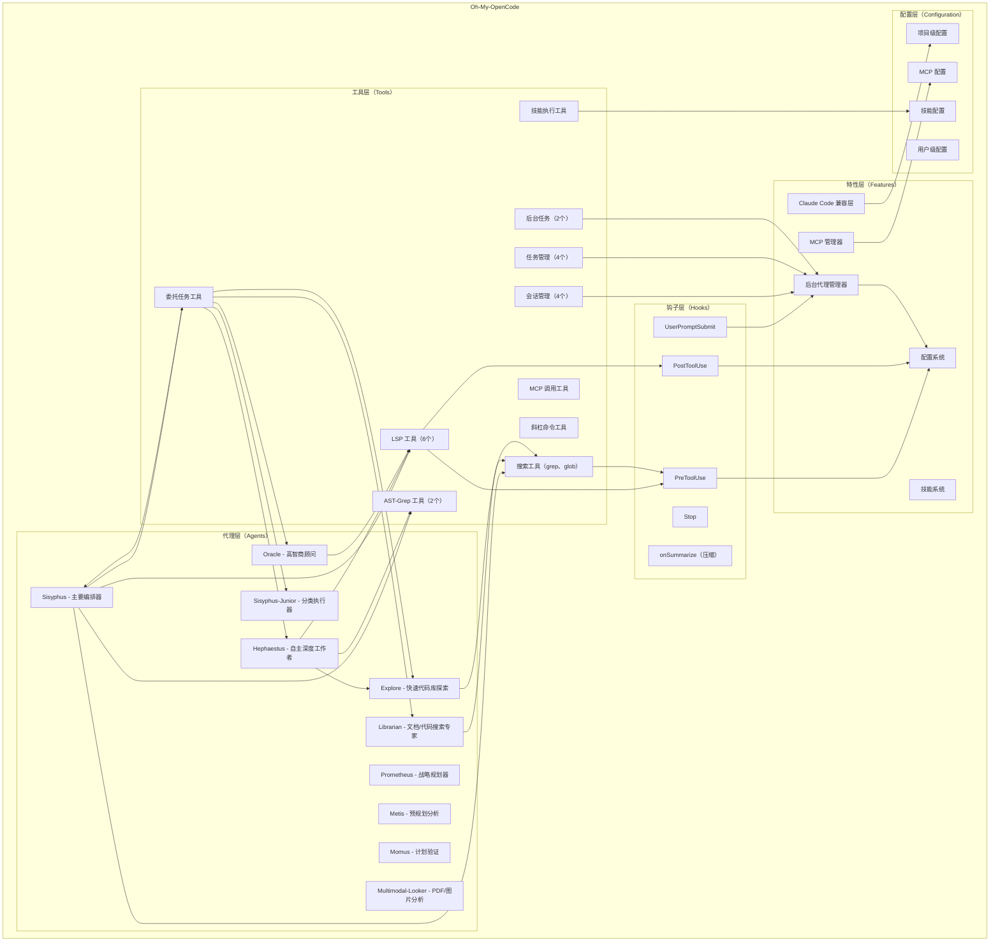
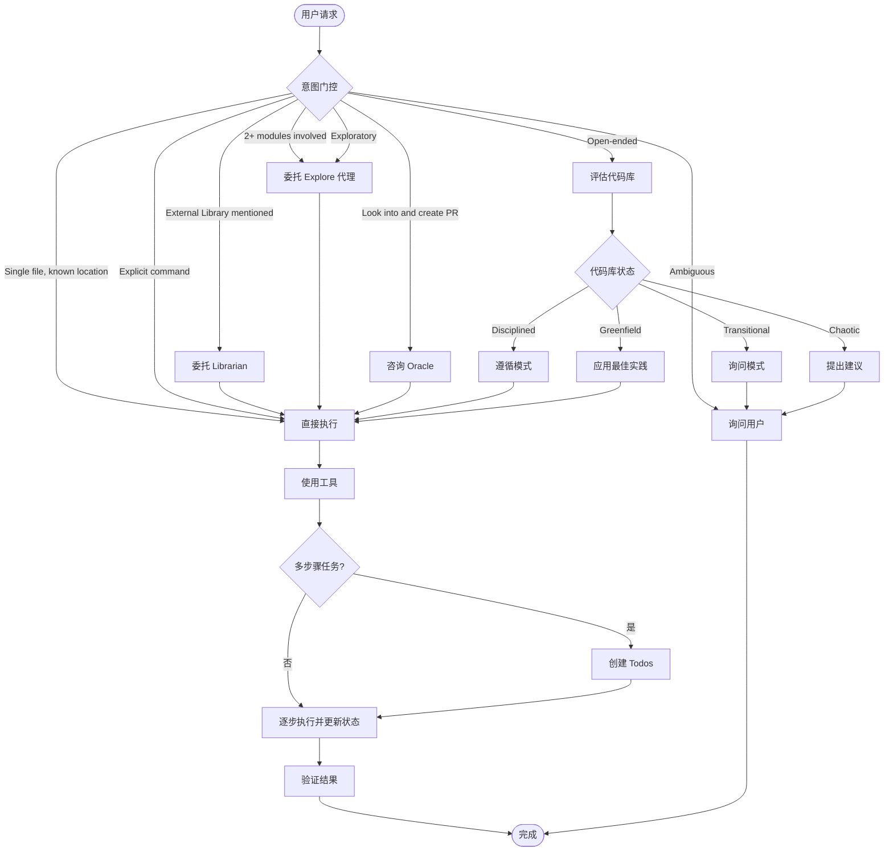
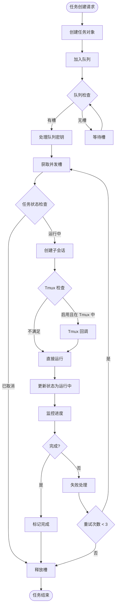
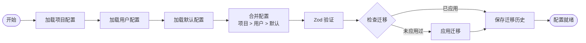
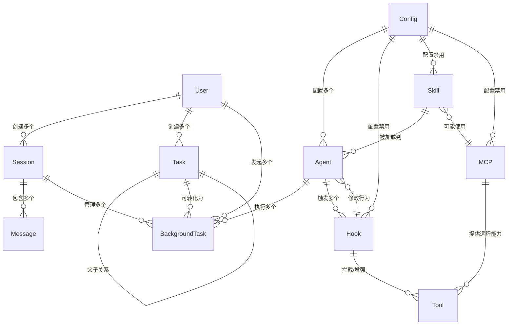

# Oh-My-OpenCode 业务需求规格说明书

## 文档信息

| 项目信息 | 内容 |
|---------|------|
| 项目名称 | Oh-My-OpenCode |
| 版本 | 3.4.0 |
| 文档创建日期 | 2026-02-10 |
| 文档性质 | 业务需求规格说明书 |

---

## 一、系统概述

### 1.1 系统定位

Oh-My-OpenCode 是一个 AI Agent 协调器插件，专为 OpenCode 平台设计，提供多模型 AI 代理编排、后台并行代理执行、专业的 LSP/AST 工具、以及完整的 Claude Code 兼容层。系统为 AI 辅助开发提供增强能力，通过智能代理协作、工具编排和生命周期钩子实现高效的代码开发和问题解决。

### 1.2 系统目标

- 为用户提供专业的 AI 代理协调能力，通过多模型编排实现复杂任务的高效完成
- 提供后台并行代理执行能力，最大化开发吞吐量
- 提供专业化的 LSP 和代码重构工具，支持安全的代码修改
- 实现完整的生命周期钩子系统，拦截和修改代理行为
- 支持技能系统，允许领域专家知识注入
- 提供完全的 Claude Code 兼容性，支持代理、命令、技能、钩子和 MCP
- 支持内置 MCP 服务（websearch、context7、grep_app）和自定义 MCP 加载

### 1.3 系统特点

- 多模型支持：兼容 Claude Opus 4.6、GPT-5.3 Codex、Gemini 3 Flash 等主流 AI 模型
- 代理编排：11 个专业化代理，包括主要编排器、顾问、专家和执行器
- 后台并行代理：支持并发任务执行，按提供商/模型配置并发限制
- LSP/AST 工具：6 个 LSP 工具、2 个 AST-Grep 工具，支持代码搜索和重构
- 生命周期钩子：40+ 个钩子覆盖 5 个事件类型
- 技能系统：支持从 YAML 前置元数据和 Claude Code 兼容格式加载技能
- 配置系统：基于 Zod 的严格验证，支持项目级和用户级配置
- Claude Code 兼容：完整的代理、命令、技能、钩子和 MCP 兼容层

### 1.4 适用场景

- 需要多个 AI 代理协作的复杂开发任务
- 需要后台并行处理的搜索和探索任务
- 需要专业代码分析和架构设计的项目
- 需要 AI 辅助的代码重构、调试和优化
- 需要 Claude Code 兼容的 AI 辅助开发环境

---

## 二、业务模块划分

### 2.1 模块架构图



### 2.2 模块列表

| 模块名称 | 模块类型 | 主要职责 |
|---------|---------|---------|
| 代理管理（Agent Management） | 双端 | 管理所有 AI 代理的创建、配置和生命周期 |
| 工具系统（Tool System） | 双端 | 提供代码操作、搜索、会话管理和委托任务工具 |
| 钩子系统（Hook System） | 双端 | 拦截和修改代理行为，实现生命周期管理 |
| 后台代理管理（Background Agent Management） | 双端 | 管理后台任务的创建、队列、并发控制和生命周期 |
| 技能系统（Skill System） | 双端 | 从 YAML 和 Claude Code 格式加载技能，管理技能执行 |
| Claude Code 兼容（Claude Code Compatibility） | 双端 | 提供 Claude Code 的代理、命令、MCP 和插件加载 |
| MCP 管理（MCP Management） | 双端 | 管理内置和自定义 MCP 服务器的生命周期 |
| 配置管理（Configuration Management） | 双端 | 基于项目、用户和默认优先级加载和验证配置 |
| 会话管理（Session Management） | 双端 | 管理会话列表、读取、搜索和信息获取 |

---

## 三、数据模型定义

### 3.1 核心实体说明

#### 3.1.1 代理相关实体

**代理（Agent）**
```
核心属性：
- 代理唯一标识（agent name）
- 代理描述（description）
- 代理模式（mode）：primary/subagent/all
- 使用的模型（model）
- 最大令牌数（maxTokens）
- 温度（temperature）
- 推理配置（reasoningEffort）
- 思考配置（thinking）
- 权限规则（permission）
- 提示词（prompt）
- 颜色标识（color）
- 代理类别（category）：exploration/specialist/advisor/utility
```

**代理配置覆盖（AgentOverrideConfig）**
```
核心属性：
- 代理名称
- 覆盖的配置（model、temperature、maxTokens、prompt、prompt_append等）
- 变体（variant）
```

**代理提示元数据（AgentPromptMetadata）**
```
核心属性：
- 类别（category）
- 成本分类（cost）：FREE/CHEAP/EXPENSIVE
- 触发器（triggers）：领域和触发条件
- 使用时机（useWhen）：适用场景列表
- 避免时机（avoidWhen）：不适用场景
- 专用节（dedicatedSection）：特殊提示节
- 别名（promptAlias）
- 关键触发（keyTrigger）
```

#### 3.1.2 任务相关实体

**任务（Task）**
```
核心属性：
- 任务唯一标识（id）
- 任务标题（subject）
- 任务描述（description）
- 任务状态（status）：pending/in_progress/completed/deleted
- 进行中形式（activeForm）
- 阻塞列表（blocks）：任务ID数组
- 被阻塞列表（blockedBy）：任务ID数组
- 所有者（owner）
- 元数据（metadata）：键值对
- 仓库URL（repoURL）
- 父任务ID（parentID）
- 线程ID（threadID）
```

**后台任务（BackgroundTask）**
```
核心属性：
- 任务ID（id）
- 状态（status）：pending/running/completed/cancelled
- 排队时间（queuedAt）
- 开始时间（startedAt）
- 完成时间（completedAt）
- 任务描述（description）
- 提示词（prompt）
- 代理名称（agent）
- 使用的模型（model）
- 类别（category）
- 会话ID（sessionID）
- 父会话ID（parentSessionID）
- 父消息ID（parentMessageID）
- 父模型（parentModel）
- 父代理（parentAgent）
- 并发密钥（concurrencyKey）
- 并发组（concurrencyGroup）
- 进度（progress）
```

#### 3.1.3 会话相关实体

**会话（Session）**
```
核心属性：
- 会话唯一标识（sessionID）
- 会话标题（title）
- 父会话ID（parentID）
- 工作目录（directory）
- 权限规则（permission）
```

#### 3.1.4 钩子相关实体

**钩子配置（HookConfig）**
```
核心属性：
- 钩子类型（hookName）
- 是否启用（enabled）
- 创建函数
```

#### 3.1.5 MCP 相关实体

**MCP 配置**
```
核心属性：
- MCP 名称（type）
- MCP URL（url）
- 是否启用（enabled）
- 是否需要 OAuth（oauth）
- 请求头（headers）
```

#### 3.1.6 技能相关实体

**技能配置（LoadedSkill）**
```
核心属性：
- 技能名称（name）
- 技能描述（description）
- 前置元数据（frontmatter）
- 技能文件路径
```

#### 3.1.7 分类相关实体

**分类配置（CategoryConfig）**
```
核心属性：
- 分类名称
- 描述（description）
- 模型（model）
- 变体（variant）
- 温度（temperature）
- Top-p（top_p）
- 最大令牌（maxTokens）
- 思考配置（thinking）：类型/budgetTokens
- 推理努力（reasoningEffort）：low/medium/high/xhigh
- 文本详细度（textVerbosity）：low/medium/high
- 工具白名单（tools）：键值对
- 提示附加（prompt_append）
- 是否不稳定代理（is_unstable_agent）
```

#### 3.1.8 配置相关实体

**主配置（OhMyOpenCodeConfig）**
```
核心属性：
- 模式版本（$schema）
- 新任务系统启用（new_task_system_enabled）
- 默认运行代理（default_run_agent）
- 禁用的 MCP（disabled_mcps）
- 禁用的代理（disabled_agents）
- 禁用的技能（disabled_skills）
- 禁用的钩子（disabled_hooks）
- 禁用的命令（disabled_commands）
- 禁用的工具（disabled_tools）
- 代理配置（agents）
- 分类配置（categories）
- Claude Code 配置（claude_code）
- Sisyphus 代理配置（sisyphus_agent）
- 注释检查器配置（comment_checker）
- 实验性配置（experimental）
- 自动更新（auto_update）
- 技能配置（skills）
- Ralph 循环配置（ralph_loop）
- 后台任务配置（background_task）
- 通知配置（notification）
- 看护配置（babysitting）
- Git Master 配置（git_master）
- 浏览器自动化引擎配置（browser_automation_engine）
- Websearch 配置（websearch）
- Tmux 配置（tmux）
- Sisyphus 配置（sisyphus）
- 迁移历史（_migrations）
```

---

## 四、业务功能详述

### 4.1 代理管理模块

#### 4.1.1 代理创建与配置

**功能：创建和配置 AI 代理**

**业务规则**：
- 代理支持模式区分（primary/subagent/all）
- Primary 模式代理使用用户 UI 选择的模型
- Subagent 模式代理使用自身回退链
- 代理必须有唯一的名称标识
- 代理配置可以通过用户级和项目级配置覆盖
- 代理提示词支持动态生成，基于可用代理、工具、技能和分类

**输入参数**：
- 模型名称：指定使用的 AI 模型（必填）
- 可用代理列表：用于动态生成提示词（可选）
- 可用工具列表：代理可用的工具（可选）
- 可用技能列表：代理可用的技能（可选）
- 可用分类列表：用于分类路由（可选）
- 是否使用任务系统：是否启用新任务系统（可选）

**输出结果**：
- 代理配置对象（AgentConfig）：包含代理的所有配置

**异常处理**：
- 模型名称为空或空白：抛出错误
- 模型不可用：使用回退链中的下一个模型

**权限要求**：
- 无需权限

**事务要求**：
- 不涉及

---

#### 4.1.2 代理列表与发现

**功能：获取所有可用代理**

**业务规则**：
- 返回内置代理和用户注册的自定义代理
- 自定义代理通过 `.opencode/agents/` 目录发现
- 内置代理按照 AGENTS.md 定义加载
- 禁用的代理不出现在列表中

**输入参数**：
- 无

**输出结果**：
- 代理配置映射表（Record<string, AgentConfig>）：代理名到配置的映射

**异常处理**：
- 无

**权限要求**：
- 需要登录用户

**事务要求**：
- 不涉及

---

### 4.2 任务管理模块

#### 4.2.1 任务创建

**功能：创建新的任务**

**业务规则**：
- 任务必须包含标题（必填）
- 任务描述可选
- 任务初始状态为 pending
- 自动生成任务唯一标识
- 任务自动与 Todo 同步（如果启用 TodoWrite）
- 支持指定阻塞列表和被阻塞列表
- 支持附加元数据和仓库 URL

**输入参数**：
- 任务标题（subject）：任务简短描述（必填）
- 任务描述（description）：详细描述（可选）
- 进行中形式（activeForm）：进行时动词形式（可选）
- 阻塞列表（blocks）：被此任务阻塞的任务 ID 列表（可选）
- 被阻塞列表（blockedBy）：阻塞此任务的任务 ID 列表（可选）
- 所有者（owner）：任务所有者（可选）
- 元数据（metadata）：键值对（可选）
- 仓库 URL（repoURL）：关联仓库地址（可选）
- 父任务 ID（parentID）：父任务标识（可选）

**输出结果**：
- 任务对象（Task）：包含所有任务属性和生成的 ID

**异常处理**：
- 任务标题为空：返回错误

**权限要求**：
- 需要登录用户

**事务要求**：
- 不涉及

---

#### 4.2.2 任务查询

**功能：获取任务列表或单个任务**

**业务规则**：
- 任务列表默认过滤掉已完成和已删除的任务
- 支持按状态过滤
- 支持按父任务 ID 过滤
- 返回任务按创建时间排序

**输入参数**：
- 任务 ID（id）：获取单个任务时使用（查询单个时必填）
- 状态（status）：过滤条件（可选）
- 父任务 ID（parentID）：过滤条件（可选）

**输出结果**：
- 任务对象或任务列表（Task | Task[]）：根据查询参数返回

**异常处理**：
- 任务 ID 不存在：返回错误

**权限要求**：
- 需要登录用户

**事务要求**：
- 不涉及

---

#### 4.2.3 任务更新

**功能：更新任务状态和属性**

**业务规则**：
- 支持部分更新（只更新提供的字段）
- 状态转换必须符合状态机规则
- 支持添加新的阻塞项（addBlocks）
- 支持添加新的被阻塞项（addBlockedBy）
- 更新后任务同步到 Todo（如果启用 TodoWrite）

**输入参数**：
- 任务 ID（id）：要更新的任务标识（必填）
- 任务标题（subject）：新标题（可选）
- 任务描述（description）：新描述（可选）
- 任务状态（status）：新状态（可选）
- 进行中形式（activeForm）：新进行时形式（可选）
- 添加阻塞项（addBlocks）：新增阻塞的任务 ID 列表（可选）
- 添加被阻塞项（addBlockedBy）：新增被阻塞的任务 ID 列表（可选）
- 所有者（owner）：新所有者（可选）
- 元数据（metadata）：新元数据（可选）
- 仓库 URL（repoURL）：新仓库地址（可选）
- 父任务 ID（parentID）：新父任务 ID（可选）

**输出结果**：
- 更新后的任务对象（Task）

**异常处理**：
- 任务 ID 不存在：返回错误
- 状态转换无效：返回错误

**权限要求**：
- 需要登录用户

**事务要求**：
- 不涉及

---

### 4.3 后台代理管理模块

#### 4.3.1 后台任务创建

**功能：创建并启动后台任务**

**业务规则**：
- 任务初始状态为 pending
- 任务先进入队列等待并发槽
- 支持按提供商和模型配置并发限制
- 支持分组队列管理
- 任务创建后立即尝试执行
- 支持通过父会话 ID 追踪
- 支持 Tmux 集成（如果启用）

**输入参数**：
- 代理名称（agent）：执行任务的代理（必填）
- 模型（model）：使用的 AI 模型（必填）
- 任务描述（description）：任务说明（必填）
- 提示词（prompt）：发送给代理的提示（必填）
- 类别（category）：任务分类（可选）
- 父会话 ID（parentSessionID）：父会话标识（可选）
- 父消息 ID（parentMessageID）：父消息标识（可选）
- 父模型（parentModel）：父模型名称（可选）
- 父代理（parentAgent）：父代理名称（可选）
- 技能列表（skills）：需要加载的技能（可选）

**输出结果**：
- 后台任务对象（BackgroundTask）：包含任务 ID 和初始状态

**异常处理**：
- 代理名称为空：抛出错误
- 创建会话失败：抛出错误

**权限要求**：
- 无需权限

**事务要求**：
- 不涉及

---

#### 4.3.2 后台任务输出

**功能：获取后台任务结果**

**业务规则**：
- 支持同步等待任务完成
- 支持异步非阻塞获取
- 超时保护，防止无限等待
- 任务完成后清理计时器

**输入参数**：
- 任务 ID（task_id）：后台任务标识（必填）
- 是否阻塞（block）：是否同步等待完成（可选，默认 true）
- 超时时间（timeout）：最大等待时间（可选，默认超时值）

**输出结果**：
- 任务结果：代理的最终输出
- 任务状态：pending/running/completed/cancelled

**异常处理**：
- 任务 ID 不存在：返回错误
- 任务超时：返回错误

**权限要求**：
- 无需权限

**事务要求**：
- 不涉及

---

#### 4.3.3 后台任务取消

**功能：取消后台任务**

**业务规则**：
- 可以取消队列中的任务
- 可以取消正在运行的任务
- 支持取消所有任务（all=true）
- 取消后任务状态更新为 cancelled
- 释放并发槽

**输入参数**：
- 任务 ID（task_id）：要取消的任务标识（可选）
- 全部取消（all）：是否取消所有任务（可选，默认 false）

**输出结果**：
- 无（操作成功）

**异常处理**：
- 无

**权限要求**：
- 无需权限

**事务要求**：
- 不涉及

---

### 4.4 钩子系统模块

#### 4.4.1 钩子注册

**功能：注册生命周期钩子**

**业务规则**：
- 支持 5 种钩子事件类型
- UserPromptSubmit：在用户提交提示前触发（可阻塞）
- PreToolUse：在工具执行前触发（可阻塞）
- PostToolUse：在工具执行后触发（不可阻塞）
- Stop：在会话停止时触发（不可阻塞）
- onSummarize：在上下文压缩时触发（不可阻塞）
- 禁用的钩子不会被注册

**输入参数**：
- 上下文：包含 OpenCode 插件上下文

**输出结果**：
- 钩子配置对象：映射事件到处理函数

**异常处理**：
- 无

**权限要求**：
- 无需权限

**事务要求**：
- 不涉及

---

### 4.5 技能系统模块

#### 4.5.1 技能加载

**功能：从不同格式加载技能**

**业务规则**：
- 支持从 YAML 前置元数据加载技能
- 支持 Claude Code 兼容格式加载技能
- 技能包含名称、描述、域专长说明
- 技能自动注入到可用技能列表
- 禁用的技能不会被加载

**输入参数**：
- 技能文件路径：技能定义文件位置

**输出结果**：
- 加载的技能对象（LoadedSkill）：包含技能元数据

**异常处理**：
- 文件不存在：返回错误
- YAML 解析失败：返回错误

**权限要求**：
- 无需权限

**事务要求**：
- 不涉及

---

### 4.6 配置管理模块

#### 4.6.1 配置加载

**功能：加载和合并配置**

**业务规则**：
- 配置加载优先级：项目级 > 用户级 > 默认值
- 支持 JSONC 格式（注释和尾随逗号）
- 使用 Zod 进行严格验证
- 支持配置迁移
- 保存迁移历史防止重复应用

**输入参数**：
- 项目目录（directory）：项目根目录

**输出结果**：
- 合并后的配置对象（OhMyOpenCodeConfig）

**异常处理**：
- 配置格式错误：返回错误详情
- 验证失败：返回验证错误

**权限要求**：
- 无需权限

**事务要求**：
- 不涉及

---

### 4.7 LSP 工具模块

#### 4.7.1 定义查找

**功能：跳转到符号定义**

**业务规则**：
- 跳转到符号在源代码中的定义位置
- 支持 TypeScript/JavaScript 等 25+ 种语言

**输入参数**：
- 文件路径（filePath）：文件位置（必填）
- 行号（line）：符号所在行（必填）
- 字符位置（character）：符号所在字符位置（必填）

**输出结果**：
- 定义位置：文件路径和位置信息

**异常处理**：
- 文件不存在或位置无效：返回错误

**权限要求**：
- 无需权限

**事务要求**：
- 不涉及

---

#### 4.7.2 符号查找

**功能：查找符号的所有引用**

**业务规则**：
- 返回符号在代码库中的所有使用位置
- 支持跨文件引用

**输入参数**：
- 文件路径（filePath）：文件位置（必填）
- 行号（line）：符号所在行（必填）
- 字符位置（character）：符号所在字符位置（必填）
- 包含声明（includeDeclaration）：是否包含定义位置（可选）

**输出结果**：
- 引用位置列表：所有符号使用位置

**异常处理**：
- 文件不存在或位置无效：返回错误

**权限要求**：
- 无需权限

**事务要求**：
- 不涉及

---

#### 4.7.3 符号列表

**功能：获取文件的符号结构**

**业务规则**：
- 返回文件中的所有符号（类、函数、变量等）
- 支持分页和查询参数

**输入参数**：
- 文件路径（filePath）：文件位置（必填）
- 查询（query）：符号查询（可选）
- 范围（scope）：document/workspace（可选，默认 document）
- 限制（limit）：返回数量限制（可选）

**输出结果**：
- 符号列表：文件中的所有符号

**异常处理**：
- 文件不存在：返回错误

**权限要求**：
- 无需权限

**事务要求**：
- 不涉及

---

#### 4.7.4 诊断信息

**功能：获取文件的诊断信息**

**业务规则**：
- 返回文件的错误、警告、提示
- 支持按严重级别过滤
- 支持按来源过滤

**输入参数**：
- 文件路径（filePath）：文件位置（必填）
- 严重性（severity）：error/warning/information/hint/all（可选，默认 all）

**输出结果**：
- 诊断列表：错误、警告、提示信息

**异常处理**：
- 文件不存在：返回错误

**权限要求**：
- 无需权限

**事务要求**：
- 不涉及

---

### 4.8 AST-Grep 工具模块

#### 4.8.1 代码搜索

**功能：使用 AST 感知的模式匹配搜索代码**

**业务规则**：
- 支持精确代码模式匹配（非关键词搜索）
- 支持 25+ 种编程语言
- 支持使用元变量（$VAR、$$$）
- 支持上下文输出

**输入参数**：
- 模式（pattern）：要匹配的代码模式（必填）
- 语言（lang）：编程语言（必填）
- 路径（paths）：搜索路径列表（可选）
- 上下文（context）：上下文行数（可选）

**输出结果**：
- 匹配结果列表：所有匹配的代码位置和上下文

**异常处理**：
- 模式无效：返回错误
- 路径不存在：返回错误

**权限要求**：
- 无需权限

**事务要求**：
- 不涉及

---

### 4.9 会话管理模块

#### 4.9.1 会话列表

**功能：获取所有会话**

**业务规则**：
- 返回会话列表
- 支持按日期范围过滤
- 支持限制返回数量
- 包含会话元数据（消息数、日期范围、使用的代理）

**输入参数**：
- 限制（limit）：最大返回数量（可选）
- 起始日期（from_date）：起始日期 ISO 格式（可选）
- 结束日期（to_date）：结束日期 ISO 格式（可选）

**输出结果**：
- 会话列表：表格形式，包含会话 ID、消息数、起始日期、结束日期、使用的代理

**异常处理**：
- 无

**权限要求**：
- 无需权限

**事务要求**：
- 不涉及

---

#### 4.9.2 会话读取

**功能：读取会话历史**

**业务规则**：
- 返回会话的所有消息
- 支持包含 Todo 信息
- 支持包含记录日志
- 支持限制返回消息数量

**输入参数**：
- 会话 ID（session_id）：会话标识（必填）
- 包含 Todo（include_todos）：是否包含 Todo 信息（可选，默认 false）
- 包含记录（include_transcript）：是否包含记录日志（可选，默认 false）
- 限制（limit）：最大返回消息数（可选）

**输出结果**：
- 消息列表：每个消息包含角色、时间戳、内容

**异常处理**：
- 会话 ID 不存在：返回错误

**权限要求**：
- 无需权限

**事务要求**：
- 不涉及

---

#### 4.9.3 会话搜索

**功能：搜索会话消息**

**业务规则**：
- 在所有会话消息中搜索关键词
- 支持大小写不敏感搜索（可选）
- 支持限制返回结果数量

**输入参数**：
- 查询（query）：搜索关键词（必填）
- 会话 ID（session_id）：限制搜索范围（可选）
- 大小写敏感（case_sensitive）：是否区分大小写（可选，默认 false）
- 限制（limit）：最大返回结果数（可选）

**输出结果**：
- 匹配消息列表：包含上下文片段

**异常处理**：
- 查询为空：返回错误

**权限要求**：
- 无需权限

**事务要求**：
- 不涉及

---

### 4.10 MCP 管理模块

#### 4.10.1 内置 MCP 加载

**功能：加载内置 MCP 服务器**

**业务规则**：
- 加载 3 个内置 MCP（websearch、context7、grep_app）
- 支持从配置禁用特定 MCP
- 支持配置 Websearch 提供商（Exa/Tavily）
- websearch 支持无 API Key 使用（Exa 默认）

**输入参数**：
- 无

**输出结果**：
- MCP 配置列表：每个 MCP 的配置对象

**异常处理**：
- 无

**权限要求**：
- 无需权限

**事务要求**：
- 不涉及

---

### 4.11 委托任务模块

#### 4.11.1 代理委托

**功能：将任务委托给指定代理**

**业务规则**：
- 支持按分类委托（visual-engineering、ultrabrain、quick 等）
- 支持按技能委托
- 支持后台执行
- 支持会话继续
- 委托提示必须包含 6 个必需节

**输入参数**：
- 子代理类型（subagent_type）：目标代理类型（必填，与 category 互斥）
- 类别（category）：任务类别（必填，与 subagent_type 互斥）
- 提示（prompt）：代理提示词（必填）
- 技能列表（load_skills）：需要加载的技能（必填）
- 描述（description）：任务描述（必填）
- 后台执行（run_in_background）：是否后台执行（必填）
- 会话 ID（session_id）：继续现有会话（可选）
- 命令（command）：触发的命令（可选）

**输出结果**：
- 任务 ID：后台任务标识
- 会话 ID：代理会话标识

**异常处理**：
- 提示词为空：返回错误
- 缺少必需参数：返回错误

**权限要求**：
- 无需权限

**事务要求**：
- 不涉及

---

## 五、核心业务流程

### 5.1 代理协调流程

**流程名称**：Sisyphus 代理协调流程

**流程描述**：主要代理接收用户请求，分析任务类型，决定是直接执行、委托给子代理还是使用钩子处理。

**流程图**：


**详细说明**：
1. **意图门控**：分析用户请求，识别关键触发器
2. **委托决策**：根据请求类型决定委托给哪个专业代理
3. **代码库评估**：检查项目代码库状态（有序/过渡/混乱/全新）
4. **工具使用**：直接使用 LSP、AST-Grep 等工具执行
5. **任务分解**：对于多步骤任务，创建 Todo 列表
6. **逐步执行**：每次只执行一个 Todo，更新状态
7. **结果验证**：运行诊断、构建、测试
8. **完成**：取消所有后台任务，报告完成

---

### 5.2 后台任务流程

**流程名称**：后台任务生命周期

**流程描述**：后台任务从创建到完成的完整生命周期，包括队列、并发控制、执行和清理。

**流程图**：


**详细说明**：
1. **任务创建**：创建后台任务对象，状态设为 pending
2. **加入队列**：根据并发密钥加入相应队列
3. **队列处理**：检查并发槽，获取后处理队列
4. **会话创建**：为子代理创建独立会话
5. **Tmux 集成**：如果启用 Tmux 且在 Tmux 环境中，创建新面板
6. **任务执行**：子代理在独立会话中执行任务
7. **进度监控**：持续监控任务状态和进度
8. **完成处理**：任务完成后释放并发槽
9. **失败恢复**：支持重试机制（最多 3 次）

---

### 5.3 配置加载流程

**流程名称**：配置加载与合并流程

**流程描述**：从项目级、用户级和默认值加载配置，应用验证和迁移。

**流程图**：


**详细说明**：
1. **项目配置**：读取 `.opencode/oh-my-opencode.json`
2. **用户配置**：读取 `~/.config/opencode/oh-my-opencode.json`
3. **默认配置**：使用代码中的默认值
4. **合并**：按优先级合并配置
5. **验证**：使用 Zod schema 验证配置
6. **迁移**：检查并应用必要的配置迁移
7. **完成**：返回合并后的配置对象

---

## 六、数据关系说明

### 6.1 核心实体关系图



**实体关系说明**：
- 用户（User）→ 会话（Session）（1:N）：用户创建多个会话
- 用户（User）→ 任务（Task）（1:N）：用户创建多个任务
- 用户（User）→ 后台任务（BackgroundTask）（1:N）：用户发起多个后台任务
- 会话（Session）→ 消息（Message）（1:N）：会话包含多条消息
- 会话（Session）→ 后台任务（BackgroundTask）（1:N）：会话管理多个后台任务
- 代理（Agent）→ 后台任务（BackgroundTask）（1:N）：代理执行多个后台任务
- 代理（Agent）→ 钩子（Hook）（1:N）：代理触发多个钩子
- 任务（Task）→ 任务（Task）（1:1）：任务父子关系
- 任务（Task）→ 后台任务（BackgroundTask）（1:N）：任务可转化为后台任务
- 技能（Skill）→ 代理（Agent）（1:N）：技能被加载到代理
- 技能（Skill）→ MCP（MCP）（N:1）：技能可能使用 MCP
- 钩子（Hook）→ 代理（Agent）（N:1）：钩子修改代理行为
- 钩子（Hook）→ 工具（Tool）（N:N）：钩子拦截/增强工具
- MCP（MCP）→ 工具（Tool）（N:1）：MCP 提供远程能力
- 配置（Config）→ 代理（Agent）（1:N）：配置影响多个代理
- 配置（Config）→ 钩子（Hook）（1:N）：配置控制哪些钩子启用
- 配置（Config）→ 技能（Skill）（1:N）：配置控制哪些技能启用
- 配置（Config）→ MCP（MCP）（1:N）：配置控制哪些 MCP 启用

### 6.2 数据一致性规则

#### 6.2.1 代理配置一致性

**业务场景**：更新代理配置

**一致性要求**：
- 配置更新必须通过 Zod 验证
- 配置合并遵循优先级：项目 > 用户 > 默认
- 配置迁移必须记录历史防止重复应用
- 禁用的代理不能被启动
- 代理配置包含所有必要字段

---

#### 6.2.2 任务状态一致性

**业务场景**：任务状态转换

**一致性要求**：
- pending 可以转换到 in_progress、deleted
- in_progress 可以转换到 completed、deleted
- completed 不能转换到其他状态（最终状态）
- deleted 不能转换到其他状态（最终状态）
- 状态转换必须通过 task_update 工具执行

---

#### 6.2.3 后台任务并发一致性

**业务场景**：多个后台任务并发执行

**一致性要求**：
- 同一并发组的任务必须遵守并发限制
- 并发槽的获取和释放必须配对
- 任务完成后必须立即释放并发槽
- 任务取消后必须释放并发槽
- 队列处理必须是线程安全的

---

## 七、业务规则约束

### 7.1 代理相关规则

| 规则 | 详细说明 |
|------|---------|
| 代理模式 | primary 模式代理使用 UI 选择模型，subagent 模式使用回退链 |
| 模型回退 | Sisyphus 回退链：kimi-k2.5 → glm-4.7 → gpt-5.3-codex → gemini-3-pro |
| 模型回退 | Hephaestus 无回退，必须使用 gpt-5.3-codex |
| 温度限制 | 代码代理温度不超过 0.3，Oracle 温度 0.1 |
| 思考令牌 | GPT 模型支持 reasoningEffort，Claude 模型支持 thinking budget |
| 权限配置 | Oracle 禁用 write/edit/task，Sisyphus 禁用 call_omo_agent |

---

### 7.2 任务相关规则

| 规则 | 详细说明 |
|------|---------|
| 任务标题 | 必须提供，不能为空 |
| 任务状态 | 必须为以下之一：pending、in_progress、completed、deleted |
| 状态转换 | 只能从 pending → in_progress → completed 或 deleted |
| 阻塞关系 | blocks 和 blockedBy 数组必须包含有效的任务 ID |
| Todo 同步 | 任务创建/更新自动同步到 TodoWrite（如果启用） |

---

### 7.3 后台任务相关规则

| 规则 | 详细说明 |
|------|---------|
| 任务 ID | 必须唯一，格式为 bg_ 后跟 8 位随机字符 |
| 并发限制 | 按提供商和模型配置，默认限制避免超限 |
| 会话创建 | 必须提供父会话 ID 和标题 |
| 任务超时 | DEFAULT_STALE_TIMEOUT_MS 后标记为陈旧 |
| 任务清理 | TASK_TTL_MS 后自动清理完成和取消的任务 |

---

### 7.4 钩子相关规则

| 规则 | 详细说明 |
|------|---------|
| 钩子执行顺序 | UserPromptSubmit → PreToolUse → PostToolUse → Stop → onSummarize |
| 阻塞钩子 | UserPromptSubmit 和 PreToolUse 可以阻塞，其他不能 |
| 上下文注入 | 注入的上下文必须追踪避免重复 |
| 禁用钩子 | 禁用的钩子不会被注册和执行 |

---

### 7.5 技能相关规则

| 规则 | 详细说明 |
|------|---------|
| 技能加载 | 支持从 YAML 前置元数据和 Claude Code 格式加载 |
| 技能禁用 | 禁用的技能不会被加载到代理 |
| 技能执行 | 必须通过 skill_mcp 工具或直接提示词注入 |

---

### 7.6 配置相关规则

| 规则 | 详细说明 |
|------|---------|
| 配置验证 | 所有配置必须通过 Zod schema 验证 |
| 配置优先级 | 项目级 > 用户级 > 默认值 |
| JSONC 支持 | 配置文件支持注释和尾随逗号 |
| 迁移应用 | 每个迁移只应用一次，记录在 _migrations 数组中 |

---

## 八、状态机定义

### 8.1 任务状态定义

| 状态码 | 状态名称 | 说明 | 可执行操作 |
|--------|---------|------|-----------|
| pending | 等待中 | task_update（更新属性）、task_delete |
| in_progress | 进行中 | task_update（更新状态、添加阻塞）、task_update（标记完成） |
| completed | 已完成 | task_delete（删除）、task_get（查询） |
| deleted | 已删除 | 无 |

**状态转换规则**：
- pending → in_progress：任务开始执行时
- pending → deleted：任务被删除时
- in_progress → completed：任务完成时
- in_progress → deleted：任务被取消时
- completed：终态，不转换
- deleted：终态，不转换

---

### 8.2 后台任务状态定义

| 状态码 | 状态名称 | 说明 | 可执行操作 |
|--------|---------|------|-----------|
| pending | 队列等待 | background_cancel（取消） |
| running | 运行中 | background_output（获取结果）、background_cancel（取消） |
| completed | 已完成 | background_output（获取结果） |
| cancelled | 已取消 | 无 |

**状态转换规则**：
- pending → running：获取并发槽后
- pending → cancelled：任务被取消时
- running → completed：任务成功完成时
- running → cancelled：任务被取消或失败超过重试次数时
- completed：终态，不转换
- cancelled：终态，不转换

---

### 8.3 会话状态定义

| 状态码 | 状态名称 | 说明 | 可执行操作 |
|--------|---------|------|-----------|
| active | 活动中 | session_read（读取消息）、发送新消息 |
| stopped | 已停止 | session_info（获取信息） |
| compacted | 已压缩 | session_read（读取压缩后上下文） |

---

## 九、非功能需求

### 9.1 性能需求

- 钩子执行延迟：PreToolUse 钩子必须在 100ms 内完成，避免每次工具调用延迟
- 并发任务处理：支持按提供商/模型配置并发限制，默认值合理
- 文件搜索超时：grep 工具超时 60 秒，glob 工具超时 60 秒
- 文件限制：glob 工具最多返回 100 个文件
- 代码搜索：AST-Grep 支持 25+ 种语言的 AST 感知搜索
- 后台任务监控：轮询间隔合理，避免频繁查询

---

### 9.2 安全需求

- 配置验证：所有配置通过 Zod schema 严格验证
- 权限控制：Oracle 禁用写和任务操作，防止意外修改
- 会话隔离：子代理在独立会话中运行，权限受限
- API Key 管理：支持环境变量配置 API Key
- 数据注入：钩子注入的上下文必须追踪和清理

---

### 9.3 可用性需求

- 代理回退：所有代理有回退模型链，避免单点故障
- 配置禁用：支持禁用不需要的代理、技能、钩子、命令、工具
- 错误恢复：支持编辑失败恢复、委托重试、会话恢复
- 迁移支持：配置迁移系统支持版本升级
- 通知支持：后台任务完成通知、任务进度通知

---

### 9.4 兼容性需求

- OpenCode 版本：要求 OpenCode >= 1.0.150
- 模型支持：支持 Claude Opus 4.6、GPT-5.3 Codex、Gemini 3 Flash 等主流模型
- 语言支持：LSP 支持 TypeScript、JavaScript、Python、Java 等 25+ 种语言
- Claude Code 兼容：完整支持 Claude Code 的代理、命令、技能、钩子和 MCP
- 运行环境：支持 Bun 运行时

---

### 9.5 可维护性需求

- 代码组织：模块化结构，每个功能独立目录
- 文档完整性：每个模块有 AGENTS.md 文档说明
- 测试覆盖：160+ 测试文件，TDD 开发模式
- 类型安全：完整的 TypeScript 类型定义，无 @ts-ignore
- 错误处理：明确的错误类型和错误消息

---

## 十、对外服务接口说明

### 10.1 代理创建接口

**接口功能**：创建和配置 AI 代理

**输入参数**：
- 模型名称（model）：AI 模型标识符（必填）
- 可用代理列表（availableAgents）：用于动态提示词生成（可选）
- 可用工具列表（availableTools）：代理可使用的工具（可选）
- 可用技能列表（availableSkills）：代理可使用的技能（可选）
- 可用分类列表（availableCategories）：用于分类路由（可选）
- 使用任务系统（useTaskSystem）：是否启用任务系统（可选）

**输出结果**：
- 代理配置（AgentConfig）：包含代理的所有配置

**使用场景**：系统启动时、配置更新时

**权限要求**：需要登录用户

---

### 10.2 任务管理接口

**接口功能**：管理任务的创建、查询和更新

**输入参数**：
- 任务创建（task_create）：标题、描述、阻塞关系等
- 任务查询（task_get）：任务 ID
- 任务列表（task_list）：状态过滤、父任务过滤
- 任务更新（task_update）：任务 ID、要更新的字段
- 任务删除（task_delete）：任务 ID

**输出结果**：
- 任务对象或列表：操作后的任务数据

**使用场景**：任务跟踪、进度管理

**权限要求**：需要登录用户

---

### 10.3 后台任务接口

**接口功能**：创建、查询和取消后台任务

**输入参数**：
- 代理名称、模型、描述等（launch）：任务创建
- 任务 ID（background_output）：获取任务结果
- 任务 ID、全部（background_cancel）：取消任务

**输出结果**：
- 任务状态和结果

**使用场景**：并行搜索、长时间运行任务

**权限要求**：无需权限

---

### 10.4 LSP 工具接口

**接口功能**：提供代码定义查找、引用查找、符号列表、诊断和重命名

**输入参数**：
- 文件路径、行号、字符位置等

**输出结果**：
- 定义位置、引用位置、符号列表、诊断信息等

**使用场景**：代码导航、重构、调试

**权限要求**：无需权限

---

### 10.5 会话管理接口

**接口功能**：管理会话列表、读取、搜索和信息获取

**输入参数**：
- 会话 ID（session_read、session_search）：会话标识
- 限制、日期范围（session_list）：过滤参数

**输出结果**：
- 会话列表、消息列表、会话元数据

**使用场景**：会话历史查询、消息搜索

**权限要求**：无需权限

---

## 十一、附录

### 11.1 术语表

| 术语 | 说明 |
|------|------|
| Agent | AI 代理，具有特定角色和能力的智能体 |
| Subagent | 子代理，由主代理委托执行的代理 |
| Hook | 钩子，在特定事件触发时执行的拦截器 |
| MCP | Model Context Protocol，标准化的服务协议 |
| Skill | 技能，领域专业知识包，可注入到代理 |
| Background Task | 后台任务，独立于主会话异步执行的任务 |
| Session | 会话，代理与用户交互的上下文 |
| Todo | 任务清单，用于跟踪多步骤任务的进度 |
| LSP | Language Server Protocol，语言服务器协议 |
| AST | Abstract Syntax Tree，抽象语法树 |
| Concurrency | 并发，同时执行多个任务的能力 |
| Prompt | 提示词，发送给 AI 模型的指令 |
| Temperature | 温度，控制模型输出的随机性 |
| Reasoning Effort | 推理努力，模型的推理深度配置 |
| Thinking Budget | 思考预算，思考阶段的最大令牌数 |

---

### 11.2 状态码说明

#### 任务状态

| 状态码 | 状态名称 | 说明 |
|--------|---------|------|
| pending | 等待中 | 任务已创建，等待执行 |
| in_progress | 进行中 | 任务正在执行 |
| completed | 已完成 | 任务已成功完成 |
| deleted | 已删除 | 任务已被删除或取消 |

#### 后台任务状态

| 状态码 | 状态名称 | 说明 |
|--------|---------|------|
| pending | 队列等待 | 任务在队列中，等待并发槽 |
| running | 运行中 | 任务正在执行 |
| completed | 已完成 | 任务已成功完成 |
| cancelled | 已取消 | 任务已被取消或失败 |

#### 会话状态

| 状态码 | 状态名称 | 说明 |
|--------|---------|------|
| active | 活动中 | 会话正在进行交互 |
| stopped | 已停止 | 会话已停止 |
| compacted | 已压缩 | 会话上下文已压缩 |

---

### 11.3 错误码说明

| 错误码 | 错误信息 | 说明 | 解决方案 |
|--------|---------|------|
| AGENT_REQUIRED | 代理参数为必填 | 提供代理名称 |
| INVALID_MODEL | 模型名称无效 | 使用有效的模型名称 |
| TASK_NOT_FOUND | 任务不存在 | 检查任务 ID |
| CONFIG_VALIDATION_FAILED | 配置验证失败 | 修正配置格式 |
| HOOK_REGISTRATION_FAILED | 钩子注册失败 | 检查钩子实现 |
| MCP_CONNECTION_FAILED | MCP 连接失败 | 检查网络和配置 |
| PERMISSION_DENIED | 权限不足 | 检查代理权限配置 |
| CONCURRENT_LIMIT_EXCEEDED | 并发限制超出 | 等待或增加并发限制 |

---

### 11.4 业务规则配置

| 配置项名称 | 默认值 | 说明 | 是否可配置 |
|-----------|--------|------|-----------|
| new_task_system_enabled | false | 是否启用新任务系统 | 是 |
| disabled_mcps | [] | 禁用的 MCP 列表 | 是 |
| disabled_agents | [] | 禁用的代理列表 | 是 |
| disabled_skills | [] | 禁用的技能列表 | 是 |
| disabled_hooks | [] | 禁用的钩子列表 | 是 |
| disabled_commands | [] | 禁用的命令列表 | 是 |
| disabled_tools | [] | 禁用的工具列表 | 是 |
| tmux_enabled | false | 是否启用 Tmux 集成 | 是 |
| tmux_layout | main-vertical | Tmux 布局配置 | 是 |
| tmux_main_pane_size | 60 | 主面板大小百分比 | 是 |
| tmux_agent_pane_min_width | 40 | 代理面板最小宽度 | 是 |
| tmux_main_pane_min_width | 120 | 主面板最小宽度 | 是 |

---

**文档结束**
