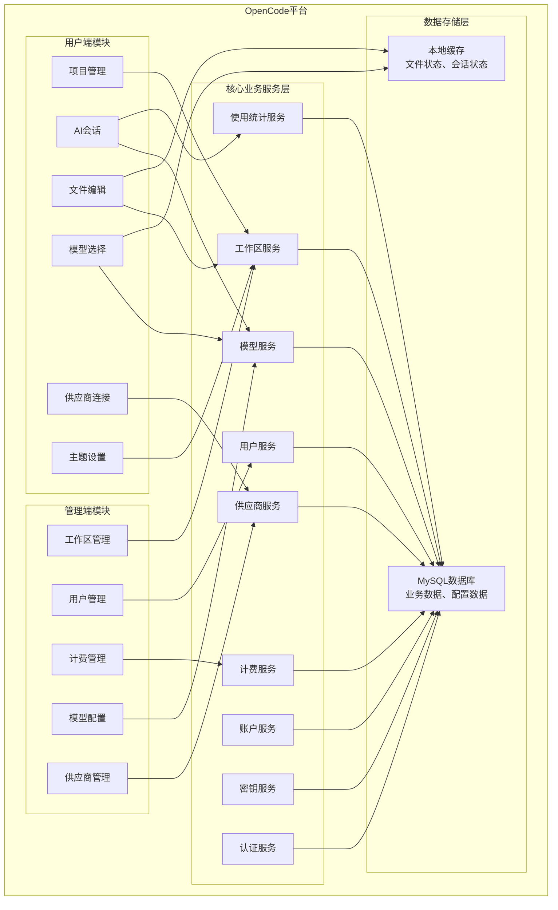
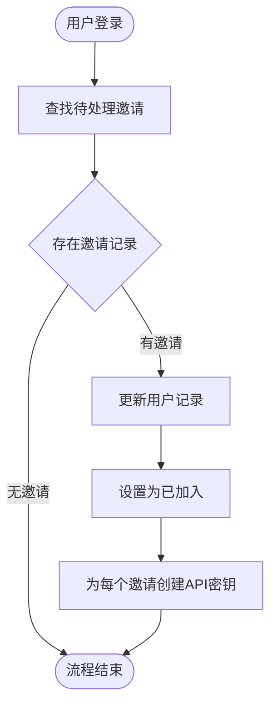
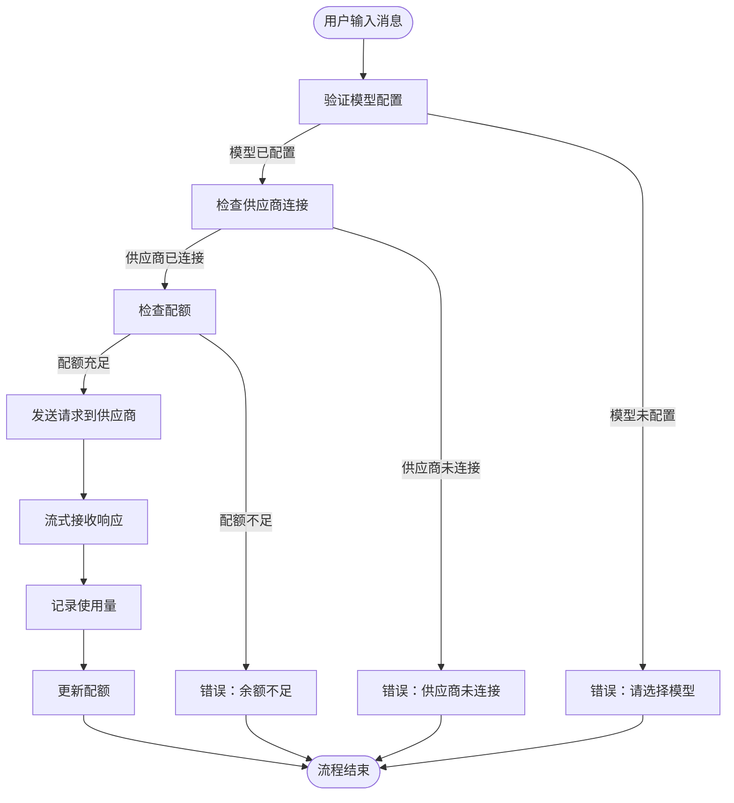
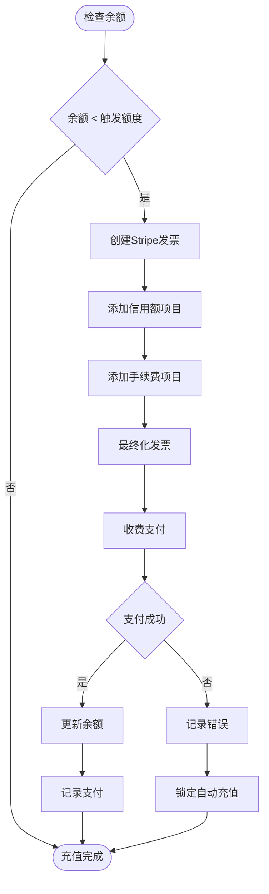
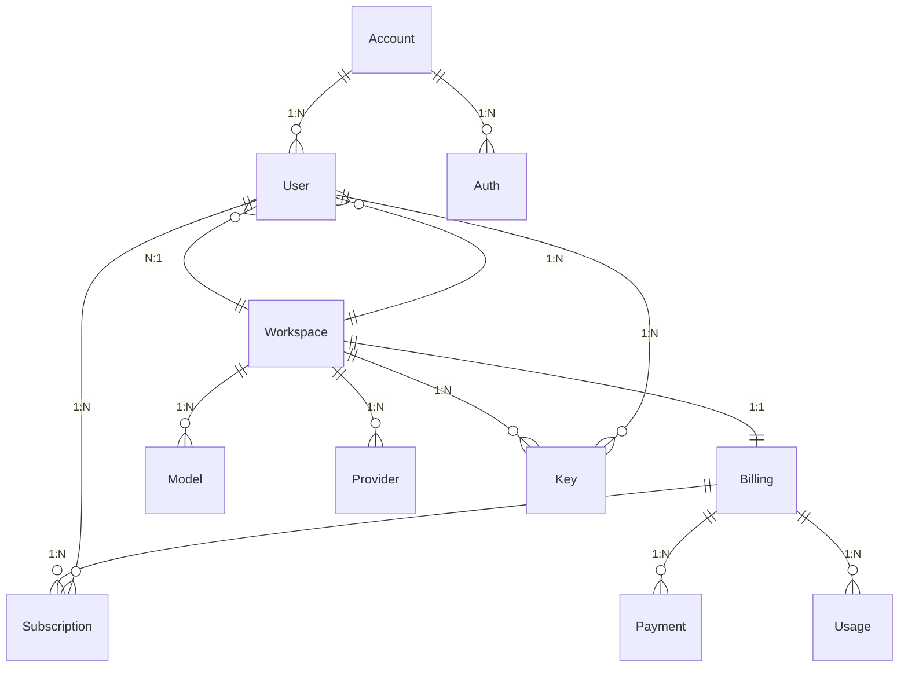

# OpenCode业务需求规格说明书

## 文档信息

| 项目信息 | 内容 |
|---------|------|
| 项目名称 | OpenCode - AI辅助代码开发平台 |
| 版本 | 1.1.21 |
| 文档创建日期 | 2026-02-10 |
| 文档性质 | 业务需求规格说明书 |

---

## 一、系统概述

### 1.1 系统定位

OpenCode是一个基于AI辅助的代码开发平台，支持多端访问（Web端、桌面端），为开发者提供智能代码编辑、AI对话交互、项目管理、模型选择、供应商接入等完整功能闭环。系统通过统一的API后端服务，为前端应用提供文件管理、会话管理、AI模型调用、用户权限、计费订阅等核心能力。

### 1.2 系统目标

- 为开发者提供便捷的AI辅助编码体验
- 为团队管理员提供高效的项目和成员管理能力
- 支持本地项目、远程服务器、桌面应用等多种部署场景
- 支持多种AI模型和第三方供应商接入
- 提供完善的使用统计、计费和配额管理能力
- 确保数据安全和系统稳定性

### 1.3 系统特点

- 多端统一后台服务（Web端、桌面端共享API）
- 灵活的权限管理体系（账户、工作区、用户三级权限）
- 完整的业务流程管理（工作区创建、用户邀请、模型配置）
- 可配置的业务规则（计费配额、使用限制、模型可见性）
- 高可扩展的架构设计（多供应商支持、模型插件化）

### 1.4 适用场景

- 开发者使用AI辅助进行代码开发
- 团队协作开发，共享项目和AI会话
- 管理员管理工作区成员、计费订阅
- 开发者接入自定义AI模型和供应商
- 企业部署本地服务器进行私有化开发

---

## 二、业务模块划分

### 2.1 模块架构图



### 2.2 模块列表

| 模块名称 | 模块类型 | 主要职责 |
|---------|---------|---------|
| 项目管理 | 用户端 | 打开本地项目、管理最近项目、选择远程服务器 |
| AI会话 | 用户端 | 创建AI对话会话、发送消息、查看响应、管理历史记录 |
| 文件编辑 | 用户端 | 浏览项目文件、代码高亮、diff对比、选择代码上下文 |
| 模型选择 | 用户端 | 选择AI模型、管理模型可见性、切换模型变体 |
| 供应商连接 | 用户端 | 连接第三方AI供应商、配置API密钥 |
| 主题设置 | 用户端 | 切换界面主题（亮色/暗色/系统） |
| 工作区管理 | 管理端 | 创建工作区、修改工作区名称、删除工作区 |
| 用户管理 | 管理端 | 邀请用户、设置用户角色、设置用户配额、删除用户 |
| 计费管理 | 管理端 | 查看余额、充值、设置月度限额、查看使用明细、查看支付记录 |
| 模型配置 | 管理端 | 启用/禁用模型、管理模型可见性 |
| 供应商管理 | 管理端 | 添加供应商、配置供应商凭证、删除供应商 |

---

## 三、数据模型定义

### 3.1 核心实体说明

#### 3.1.1 用户相关实体

**账户（Account）**
```
核心属性：
- 账户唯一标识（accountID，ULID格式）
- 创建时间（timeCreated）
- 更新时间（timeUpdated）
```

**用户（User）**
```
核心属性：
- 用户唯一标识（id，ULID格式）
- 工作区标识（workspaceID）
- 关联账户ID（accountID）
- 用户名/邮箱（email）
- 显示名称（name）
- 用户角色（role，枚举：admin/member）
- 颜色标识（color，头像颜色）
- 最后活跃时间（timeSeen）
- 月度使用限额（monthlyLimit，配额限制）
- 月度已用额度（monthlyUsage，使用量统计）
- 月度额度更新时间（timeMonthlyUsageUpdated）
- 创建时间（timeCreated）
- 更新时间（timeUpdated）
- 删除时间（timeDeleted，软删除）
```

**认证（Auth）**
```
核心属性：
- 认证记录标识（id）
- 认证提供商（provider，枚举：email/github/google）
- 第三方用户标识（subject，如邮箱地址或GitHub用户ID）
- 关联账户ID（accountID）
- 创建时间（timeCreated）
- 更新时间（timeUpdated）
```

#### 3.1.2 核心业务实体

**工作区（Workspace）**
```
核心属性：
- 工作区标识（id，ULID格式，主键）
- 工作区别名（slug，唯一标识）
- 工作区名称（name）
- 创建时间（timeCreated）
- 更新时间（timeUpdated）
```

**计费（Billing）**
```
核心属性：
- 计费记录标识（id，ULID格式）
- 工作区标识（workspaceID）
- Stripe客户ID（customerID）
- 支付方式ID（paymentMethodID）
- 支付方式类型（paymentMethodType）
- 支付方式末四位（paymentMethodLast4）
- 账户余额（balance，微美分单位）
- 月度限额（monthlyLimit）
- 月度已用额度（monthlyUsage）
- 月度额度更新时间（timeMonthlyUsageUpdated）
- 自动充值开关（reload，布尔值）
- 自动充值触发额度（reloadTrigger）
- 自动充值金额（reloadAmount）
- 自动充值错误信息（reloadError）
- 自动充值错误时间（timeReloadError）
- 自动充值锁定时间（timeReloadLockedTill）
- 订阅ID（subscriptionID）
- 订阅优惠券ID（subscriptionCouponID）
- 订阅套餐（subscriptionPlan，枚举：20/100/200）
- 订阅预订时间（timeSubscriptionBooked）
- 创建时间（timeCreated）
- 更新时间（timeUpdated）
- 删除时间（timeDeleted，软删除）
```

**订阅（Subscription）**
```
核心属性：
- 订阅记录标识（id，ULID格式）
- 工作区标识（workspaceID）
- 用户标识（userID）
- 滚动窗口使用量（rollingUsage）
- 固定配额使用量（fixedUsage）
- 滚动窗口更新时间（timeRollingUpdated）
- 固定配额更新时间（timeFixedUpdated）
- 创建时间（timeCreated）
- 更新时间（timeUpdated）
- 删除时间（timeDeleted，软删除）
```

**支付（Payment）**
```
核心属性：
- 支付记录标识（id，ULID格式）
- 工作区标识（workspaceID）
- Stripe客户ID（customerID）
- 发票ID（invoiceID）
- 支付ID（paymentID）
- 支付金额（amount，微美分单位）
- 退款时间（timeRefunded）
- 附加信息（enrichment，JSON，包含type:subscription/credit及couponID）
- 创建时间（timeCreated）
- 更新时间（timeUpdated）
- 删除时间（timeDeleted，软删除）
```

**使用（Usage）**
```
核心属性：
- 使用记录标识（id，ULID格式）
- 工作区标识（workspaceID）
- 模型名称（model）
- 供应商名称（provider）
- 输入令牌数（inputTokens）
- 输出令牌数（outputTokens）
- 推理令牌数（reasoningTokens）
- 缓存读取令牌数（cacheReadTokens）
- 缓存写入5分钟令牌数（cacheWrite5mTokens）
- 缓存写入1小时令牌数（cacheWrite1hTokens）
- 费用（cost，微美分单位）
- 密钥标识（keyID）
- 附加信息（enrichment，JSON，包含plan:sub）
- 创建时间（timeCreated）
- 更新时间（timeUpdated）
- 删除时间（timeDeleted，软删除）
```

**模型（Model）**
```
核心属性：
- 模型记录标识（id，ULID格式）
- 工作区标识（workspaceID）
- 模型名称（model，唯一）
- 创建时间（timeCreated）
- 更新时间（timeUpdated）
- 删除时间（timeDeleted，软删除）
```

**供应商（Provider）**
```
核心属性：
- 供应商记录标识（id，ULID格式）
- 工作区标识（workspaceID）
- 供应商名称（provider，唯一）
- 凭证（credentials，JSON格式）
- 创建时间（timeCreated）
- 更新时间（timeUpdated）
- 删除时间（timeDeleted，软删除）
```

**密钥（Key）**
```
核心属性：
- 密钥记录标识（id，ULID格式）
- 工作区标识（workspaceID）
- 密钥名称（name）
- 密钥值（key，64字符随机字符串，前缀sk-）
- 用户标识（userID）
- 最后使用时间（timeUsed）
- 创建时间（timeCreated）
- 更新时间（timeUpdated）
- 删除时间（timeDeleted，软删除）
```

#### 3.1.3 其他核心实体

**IP（Ip）**
```
核心属性：
- IP地址（ip，主键）
- 使用量（usage）
- 创建时间（timeCreated）
- 更新时间（timeUpdated）
```

**IP速率限制（IpRateLimit）**
```
核心属性：
- IP地址（ip，主键部分）
- 时间间隔（interval，主键部分）
- 计数（count）
```

**基准测试（Benchmark）**
```
核心属性：
- 基准测试标识（id，自动递增）
- 模型名称（model）
- 代理名称（agent）
- 测试结果（result，mediumtext）
- 创建时间（timeCreated）
- 更新时间（timeUpdated）
```

---

## 四、业务功能详述

### 4.1 项目管理模块

#### 4.1.1 打开项目

**功能名称**：打开本地项目

**业务规则**：
- 规则1：支持打开本地目录作为项目
- 规则2：支持打开多个项目
- 规则3：记录最近打开的项目（最多显示5个）
- 规则4：可设置项目名称、图标（颜色或图片）
- 规则5：远程服务器模式下需要先选择服务器

**输入参数**：
- 项目路径（directory，必填，字符串）：本地文件系统路径
- 项目名称（name，可选，字符串）：项目显示名称
- 图标（icon，可选，对象）：包含color和url属性

**输出结果**：
- 项目列表：包含路径、名称、图标、创建/更新时间
- 最近项目：按更新时间排序的最近5个项目

**异常处理**：
- 异常情况1：路径不存在，错误提示"路径不存在"
- 异常情况2：权限不足，错误提示"无访问权限"
- 异常情况3：服务器连接失败，错误提示"无法连接服务器"

**权限要求**：无需权限（本地操作）或需要登录（远程服务器模式）

**事务要求**：不涉及事务要求

---

### 4.2 AI会话模块

#### 4.2.1 创建AI会话

**功能名称**：创建新的AI对话会话

**业务规则**：
- 规则1：会话必须绑定到项目和工作区
- 规则2：会话可分叉（创建副本）
- 规则3：会话支持多个标签页（消息、代码上下文、终端）
- 规则4：每个标签页可独立滚动和查看

**输入参数**：
- 项目路径（directory，必填，字符串）：项目工作目录
- 会话ID（id，可选，字符串）：继续现有会话或创建新会话
- Agent类型（agent，可选，字符串）：指定使用的Agent

**输出结果**：
- 会话标识：新创建或现有的会话ID
- 消息列表：历史消息和响应
- 文件列表：项目文件结构
- 代码上下文：选中的代码上下文

**异常处理**：
- 异常情况1：项目路径无效，错误提示"无效的项目路径"
- 异常情况2：会话ID不存在，错误提示"会话不存在"
- 异常情况3：模型不可用，错误提示"模型已被禁用"

**权限要求**：需要登录用户

**事务要求**：不涉及事务要求

---

#### 4.2.2 发送AI消息

**功能名称**：向AI发送对话消息

**业务规则**：
- 规则1：必须先选择模型和供应商
- 规则2：支持文本、文件附件、代码上下文、Agent作为消息内容
- 规则3：文件附件需指定文件路径和可选的行选择范围
- 规则4：支持多轮对话，维护对话历史

**输入参数**：
- 提示词内容（prompt，必填，数组）：ContentPart类型数组
  - 文本部分（type:text）：content, start, end
  - 文件附件（type:file）：path, selection（可选）
  - Agent（type:agent）：name
  - 图片附件（type:image）：id, filename, mime, dataUrl
- 模型选择（model，必填，对象）：包含providerID和modelID
- 会话标识（sessionID，可选，字符串）：继续现有会话

**输出结果**：
- 响应内容：AI生成的响应文本或代码
- 使用统计：输入/输出令牌数、费用
- 文件变更：AI建议的代码修改（diff格式）

**异常处理**：
- 异常情况1：提示词为空，错误提示"请输入内容"
- 异常情况2：模型未配置，错误提示"请先选择模型"
- 异常情况3：供应商未连接，错误提示"供应商未连接"
- 异常情况4：配额不足，错误提示"账户余额不足"
- 异常情况5：速率限制，错误提示"请求过于频繁，请稍后再试"

**权限要求**：需要登录用户

**事务要求**：不涉及事务要求（异步流式响应）

---

### 4.3 工作区管理模块

#### 4.3.1 创建工作区

**功能名称**：创建新的工作区

**业务规则**：
- 规则1：必须先登录账户
- 规则2：创建工作区时自动创建管理员用户
- 规则3：自动创建计费记录（余额为0）
- 规则4：自动为管理员创建默认API密钥
- 规则5：工作区名称不能为空

**输入参数**：
- 工作区名称（name，必填，字符串，1-255字符）：工作区显示名称

**输出结果**：
- 工作区标识：新创建的工作区ID
- 管理员用户ID：自动创建的管理员用户ID
- 默认API密钥：生成的密钥值

**异常处理**：
- 异常情况1：工作区名称为空，错误提示"工作区名称不能为空"
- 异常情况2：名称过长，错误提示"名称不能超过255个字符"

**权限要求**：需要登录账户

**事务要求**：
需要在同一事务中完成的操作列表：
1. 创建工作区记录
2. 创建管理员用户记录
3. 创建计费记录
4. 创建默认API密钥
数据一致性要求：所有操作必须全部成功或全部回滚

---

#### 4.3.2 修改工作区

**功能名称**：修改工作区信息

**业务规则**：
- 规则1：仅管理员可修改工作区
- 规则2：工作区名称不能为空
- 规则3：名称长度1-255字符

**输入参数**：
- 工作区名称（name，必填，字符串，1-255字符）：新的工作区名称

**输出结果**：
- 操作结果：成功或失败

**异常处理**：
- 异常情况1：无管理员权限，错误提示"只有管理员可以修改工作区"
- 异常情况2：名称为空，错误提示"工作区名称不能为空"

**权限要求**：需要管理员权限

**事务要求**：不涉及事务要求

---

#### 4.3.3 删除工作区

**功能名称**：删除工作区（软删除）

**业务规则**：
- 规则1：仅管理员可删除工作区
- 规则2：采用软删除机制（设置删除时间戳）
- 规则3：工作区删除后无法恢复

**输入参数**：
- 无参数

**输出结果**：
- 操作结果：成功或失败

**异常处理**：
- 异常情况1：无管理员权限，错误提示"只有管理员可以删除工作区"

**权限要求**：需要管理员权限

**事务要求**：不涉及事务要求

---

### 4.4 用户管理模块

#### 4.4.1 邀请用户

**功能名称**：邀请用户加入工作区

**业务规则**：
- 规则1：仅管理员可邀请用户
- 规则2：需要提供用户邮箱
- 规则3：可设置用户角色（admin/member）
- 规则4：可设置用户月度配额
- 规则5：如果邮箱对应账户已存在，自动添加到工作区并创建API密钥
- 规则6：发送邀请邮件（邮件可能失败但忽略错误）

**输入参数**：
- 邮箱（email，必填，字符串）：被邀请用户的邮箱
- 角色（role，必填，枚举：admin/member）：用户角色
- 月度配额（monthlyLimit，可选，整数）：用户的月度使用限制

**输出结果**：
- 操作结果：成功或失败

**异常处理**：
- 异常情况1：无管理员权限，错误提示"只有管理员可以邀请用户"
- 异常情况2：邮箱格式无效，错误提示"邮箱格式不正确"
- 异常情况3：不能邀请自己，错误提示"不能邀请自己"

**权限要求**：需要管理员权限

**事务要求**：
需要在同一事务中完成的操作列表：
1. 查找或创建用户记录
2. 如果账户已存在，自动创建API密钥
数据一致性要求：用户添加到工作区与API密钥创建必须关联

---

#### 4.4.2 更新用户信息

**功能名称**：修改用户信息

**业务规则**：
- 规则1：仅管理员可修改用户信息
- 规则2：不能将其他管理员降级为成员（自己除外）
- 规则3：角色必须是admin或member

**输入参数**：
- 用户ID（id，必填，字符串）：要修改的用户ID
- 角色（role，必填，枚举：admin/member）：新的用户角色
- 月度配额（monthlyLimit，可选，整数）：新的月度配额

**输出结果**：
- 操作结果：成功或失败

**异常处理**：
- 异常情况1：无管理员权限，错误提示"只有管理员可以修改用户"
- 异常情况2：不能降级其他管理员，错误提示"不能降级其他管理员为成员"

**权限要求**：需要管理员权限

**事务要求**：不涉及事务要求

---

#### 4.4.3 删除用户

**功能名称**：删除用户（软删除）

**业务规则**：
- 规则1：仅管理员可删除用户
- 规则2：不能删除自己
- 规则3：采用软删除机制（设置删除时间戳）

**输入参数**：
- 用户ID（id，必填，字符串）：要删除的用户ID

**输出结果**：
- 操作结果：成功或失败

**异常处理**：
- 异常情况1：无管理员权限，错误提示"只有管理员可以删除用户"
- 异常情况2：不能删除自己，错误提示"不能删除自己"

**权限要求**：需要管理员权限

**事务要求**：不涉及事务要求

---

### 4.5 计费管理模块

#### 4.5.1 查看计费信息

**功能名称**：获取工作区计费信息

**业务规则**：
- 规则1：需要登录工作区
- 规则2：仅返回当前工作区的计费信息
- 规则3：包含余额、配额、订阅、支付方式信息

**输入参数**：
- 无参数

**输出结果**：
- 账户余额（balance）：当前余额（微美分）
- 月度限额（monthlyLimit）：月度配额
- 月度已用（monthlyUsage）：月度已用
- Stripe客户ID（customerID）
- 支付方式信息（paymentMethodID, paymentMethodType, paymentMethodLast4）
- 订阅信息（subscriptionID, subscriptionPlan）
- 自动充值配置（reload, reloadTrigger, reloadAmount）

**异常处理**：
- 不涉及异常处理

**权限要求**：需要登录用户

**事务要求**：不涉及事务要求

---

#### 4.5.2 获取使用明细

**功能名称**：获取使用明细列表

**业务规则**：
- 规则1：需要登录工作区
- 规则2：按创建时间倒序排列
- 规则3：支持分页查询（默认每页50条）
- 规则4：按时间创建索引优化查询

**输入参数**：
- 页码（page，可选，整数，默认0）：第几页
- 每页大小（pageSize，可选，整数，默认50）：每页数量

**输出结果**：
- 使用记录列表：包含模型、供应商、令牌数、费用、时间
- 总记录数

**异常处理**：
- 不涉及异常处理

**权限要求**：需要登录用户

**事务要求**：不涉及事务要求

---

#### 4.5.3 自动充值

**功能名称**：触发自动充值

**业务规则**：
- 规则1：需要配置支付方式和自动充值金额
- 规则2：充值金额最小为10美元
- 规则3：自动充值包含信用额度和手续费（4.4% + 0.30美元）
- 规则4：充值成功更新余额并记录支付
- 规则5：充值失败记录错误信息并锁定自动充值

**输入参数**：
- 无参数

**输出结果**：
- 操作结果：成功或失败
- 支付ID：成功时返回
- 错误信息：失败时返回

**异常处理**：
- 异常情况1：无支付方式，错误提示"请先配置支付方式"
- 异常情况2：金额不足10美元，错误提示"最低充值金额为10美元"
- 异常情况3：支付失败，错误提示"支付失败，请稍后重试"

**权限要求**：需要登录用户

**事务要求**：
需要在同一事务中完成的操作列表：
1. 调用Stripe创建发票和收费
2. 更新账户余额
3. 插入支付记录
数据一致性要求：余额增加与支付记录必须同时完成

---

#### 4.5.4 设置月度限额

**功能名称**：设置工作区月度使用限额

**业务规则**：
- 规则1：仅管理员可设置
- 规则2：限额为整数美元金额

**输入参数**：
- 月度限额（input，必填，整数）：月度配额金额

**输出结果**：
- 操作结果：成功或失败

**异常处理**：
- 异常情况1：无管理员权限，错误提示"只有管理员可以设置限额"

**权限要求**：需要管理员权限

**事务要求**：不涉及事务要求

---

### 4.6 模型管理模块

#### 4.6.1 禁用模型

**功能名称**：禁用工作区中的模型

**业务规则**：
- 规则1：仅管理员可禁用模型
- 规则2：采用软删除机制（记录到model表）
- 规则3：每个工作区-模型组合只能有一条记录

**输入参数**：
- 模型名称（model，必填，字符串，最大64字符）：要禁用的模型名称

**输出结果**：
- 操作结果：成功或失败

**异常处理**：
- 异常情况1：无管理员权限，错误提示"只有管理员可以禁用模型"

**权限要求**：需要管理员权限

**事务要求**：不涉及事务要求

---

#### 4.6.2 启用模型

**功能名称**：启用工作区中被禁用的模型

**业务规则**：
- 规则1：仅管理员可启用模型
- 规则2：通过删除model表记录来启用

**输入参数**：
- 模型名称（model，必填，字符串，最大64字符）：要启用的模型名称

**输出结果**：
- 操作结果：成功或失败

**异常处理**：
- 异常情况1：无管理员权限，错误提示"只有管理员可以启用模型"

**权限要求**：需要管理员权限

**事务要求**：不涉及事务要求

---

### 4.7 供应商管理模块

#### 4.7.1 添加供应商

**功能名称**：添加AI供应商凭证

**业务规则**：
- 规则1：仅管理员可添加供应商
- 规则2：供应商名称1-64字符
- 规则3：凭证为JSON格式字符串
- 规则4：每个工作区-供应商组合只能有一条记录

**输入参数**：
- 供应商名称（provider，必填，字符串，1-64字符）：供应商标识
- 凭证（credentials，必填，字符串）：供应商API凭证JSON

**输出结果**：
- 操作结果：成功或失败

**异常处理**：
- 异常情况1：无管理员权限，错误提示"只有管理员可以添加供应商"
- 异常情况2：凭证格式无效，错误提示"凭证格式不正确"

**权限要求**：需要管理员权限

**事务要求**：不涉及事务要求

---

#### 4.7.2 删除供应商

**功能名称**：删除供应商凭证

**业务规则**：
- 规则1：仅管理员可删除供应商
- 规则2：通过软删除机制

**输入参数**：
- 供应商名称（provider，必填，字符串）：要删除的供应商

**输出结果**：
- 操作结果：成功或失败

**异常处理**：
- 异常情况1：无管理员权限，错误提示"只有管理员可以删除供应商"

**权限要求**：需要管理员权限

**事务要求**：不涉及事务要求

---

### 4.8 密钥管理模块

#### 4.8.1 获取API密钥列表

**功能名称**：获取工作区API密钥列表

**业务规则**：
- 规则1：需要登录工作区
- 规则2：管理员可查看所有用户的密钥
- 规则3：普通用户只能看到自己的密钥
- 规则4：返回密钥时隐藏完整值（只显示前7位和后4位）
- 规则5：包含关联用户的邮箱信息

**输入参数**：
- 无参数

**输出结果**：
- 密钥列表：包含id, name, key（仅自己的）, keyDisplay, timeUsed, userID, email

**异常处理**：
- 不涉及异常处理

**权限要求**：需要登录用户

**事务要求**：不涉及事务要求

---

#### 4.8.2 创建API密钥

**功能名称**：创建新的API密钥

**业务规则**：
- 规则1：密钥格式为sk- + 64位随机字符（字母数字）
- 规则2：密钥名称1-255字符
- 规则3：必须指定关联用户
- 规则4：新密钥初始未使用（timeUsed为null）

**输入参数**：
- 用户ID（userID，必填，字符串）：密钥关联的用户
- 名称（name，必填，字符串，1-255字符）：密钥显示名称

**输出结果**：
- 密钥ID：新创建的密钥标识
- 密钥值：生成的完整密钥字符串

**异常处理**：
- 不涉及异常处理

**权限要求**：需要登录用户

**事务要求**：不涉及事务要求

---

#### 4.8.3 删除API密钥

**功能名称**：删除API密钥（软删除）

**业务规则**：
- 规则1：管理员可删除任何用户的密钥
- 规则2：普通用户只能删除自己的密钥
- 规则3：采用软删除机制

**输入参数**：
- 密钥ID（id，必填，字符串）：要删除的密钥ID

**输出结果**：
- 操作结果：成功或失败

**异常处理**：
- 异常情况1：无权限删除，错误提示"无权限删除此密钥"

**权限要求**：需要登录用户（管理员或密钥所有者）

**事务要求**：不涉及事务要求

---

## 五、核心业务流程

### 5.1 用户加入工作区流程

**流程名称**：用户接受邀请加入工作区

**流程描述**：被邀请用户登录后自动加入所有待处理的工作区邀请，并创建默认API密钥。

**流程图**：


**详细说明**：
1. **步骤1**：系统查找所有邮箱匹配当前用户的未加入工作区用户记录
2. **步骤2**：判断是否存在待处理的邀请记录
3. **步骤3**：将用户记录的accountID字段设置，email字段清空
4. **步骤4**：标记用户已加入工作区
5. **步骤5**：为每个加入的工作区创建默认API密钥，名称为"Default API Key"

---

### 5.2 AI对话消息发送流程

**流程名称**：发送AI对话消息并接收响应

**流程描述**：用户发送消息到AI，系统选择合适的模型和供应商，发送请求并流式接收响应。

**流程图**：


**详细说明**：
1. **步骤1**：验证用户是否选择了有效的模型
2. **步骤2**：检查模型对应的供应商是否已连接和配置
3. **步骤3**：检查账户余额或配额是否充足
4. **步骤4**：发送AI请求到供应商API，包含提示词和上下文
5. **步骤5**：流式接收AI响应并实时显示
6. **步骤6**：请求完成后记录使用统计（令牌数、费用）
7. **步骤7**：更新账户余额或配额

---

### 5.3 自动充值流程

**流程名称**：触发自动充值余额

**流程描述**：当余额低于触发额度时，自动向用户支付方式收费并充值到账户。

**流程图**：


**详细说明**：
1. **步骤1**：检查当前余额是否低于触发额度（默认5美元）
2. **步骤2**：在Stripe创建新发票草稿
3. **步骤3**：添加信用额度项目（充值金额）
4. **步骤4**：添加手续费项目（4.4% + 0.30美元）
5. **步骤5**：最终化发票
6. **步骤6**：使用保存的支付方式自动支付
7. **步骤7**：判断支付是否成功
8. **步骤8**：支付成功则增加账户余额
9. **步骤9**：记录支付记录
10. **步骤10**：支付失败则记录错误信息和时间
11. **步骤11**：锁定自动充值功能直到管理员手动解锁

---

## 六、数据关系说明

### 6.1 核心实体关系图



**实体关系说明**：
- 账户 → 用户(1:N)：一个账户可有多个工作区中的用户记录
- 账户 → 认证(1:N)：一个账户可有多种认证方式
- 工作区 → 用户(1:N)：一个工作区可有多个用户
- 工作区 → 计费(1:1)：一个工作区对应一个计费记录
- 工作区 → 模型(1:N)：一个工作区可禁用多个模型
- 工作区 → 供应商(1:N)：一个工作区可配置多个供应商
- 工作区 → 密钥(1:N)：一个工作区可有多个API密钥
- 用户 → 密钥(1:N)：一个用户可拥有多个密钥
- 计费 → 支付(1:N)：一个计费记录可有多次支付
- 计费 → 使用(1:N)：一个计费记录关联多次使用
- 计费 → 订阅(1:N)：一个工作区可有多个用户订阅
- 用户 → 订阅(1:N)：一个用户可在多个工作区有订阅
- 用户 → 工作区(N:1)：一个用户可属于多个工作区

### 6.2 数据一致性规则

#### 6.2.1 创建工作区数据一致性

**业务场景**：创建新工作区时

**一致性要求**：
- 操作1：创建工作区记录（名称、别名）
- 操作2：创建管理员用户记录（角色为admin，关联账户）
- 操作3：创建计费记录（余额为0）
- 操作4：以系统身份创建默认API密钥
- 以上操作必须在同一事务中完成

---

#### 6.2.2 邀请用户数据一致性

**业务场景**：邀请用户加入工作区时

**一致性要求**：
- 操作1：查找或创建用户记录（邮箱匹配则关联账户）
- 操作2：如果账户已存在，自动创建API密钥
- 以上操作必须在同一事务中完成

---

#### 6.2.3 充值数据一致性

**业务场景**：用户充值时

**一致性要求**：
- 操作1：调用Stripe创建发票并支付
- 操作2：更新账户余额（增加充值金额）
- 操作3：插入支付记录
- 以上操作必须在同一事务中完成

---

## 七、业务规则约束

### 7.1 权限控制规则

- 规则1：工作区管理员可以执行所有管理操作（邀请/删除用户、禁用模型、添加供应商、设置配额）
- 规则2：工作区成员只能查看自己的密钥，不能查看他人的密钥
- 规则3：工作区成员不能删除自己
- 规则4：管理员不能删除其他管理员，只能修改其角色
- 规则5：系统账户可以跨工作区执行操作（如创建密钥）

### 7.2 计费规则

- 规则1：自动充值最小金额为10美元
- 规则2：自动充值默认金额为20美元
- 规则3：自动充值包含手续费（4.4% + 0.30美元）
- 规则4：订阅套餐包括20/100/200美元
- 规则5：余额和使用量以微美分为单位存储（1美元 = 1000000微美分）

### 7.3 模型规则

- 规则1：模型名称最大64字符
- 规则2：供应商名称1-64字符
- 规则3：每个工作区-模型组合只能有一条禁用记录
- 规则4：每个工作区-供应商组合只能有一条凭证记录

### 7.4 密钥规则

- 规则1：密钥格式为sk-前缀 + 64位随机字符
- 规则2：随机字符包含大小写字母和数字
- 规则3：密钥名称1-255字符

---

## 八、状态机定义

### 8.1 用户角色状态定义

| 状态码 | 状态名称 | 说明 | 可执行操作 |
|--------|---------|------|-----------|
| admin | 管理员 | 工作区管理员，拥有所有权限 | 邀请/删除用户、禁用模型、添加供应商、设置配额、删除工作区 |
| member | 成员 | 普通工作区成员 | 查看自己的密钥、查看使用明细 |

**状态转换规则**：
- admin → member：管理员可以修改自己或其他管理员为成员
- member → admin：管理员可以将成员提升为管理员

---

## 九、非功能需求

### 9.1 性能需求

- 首页加载时间：不超过3秒
- 核心操作响应时间：不超过2秒
- 文件列表响应时间：不超过1秒
- AI消息首次响应时间：不超过5秒
- 使用明细翻页时间：不超过1秒
- 支持至少100个并发用户
- 核心表建立合适索引（如usage表的time_created索引）
- 慢查询优化、分页查询使用高效方式

### 9.2 安全需求

- 用户登录支持多种方式（邮箱、GitHub、Google）
- 登录凭证有过期时间
- API密钥采用64位随机字符，前缀sk-
- 敏感信息加密传输
- SQL注入防护（使用参数化查询）
- 接口权限控制（基于角色、基于资源）
- 操作日志记录（关键操作审计）
- Stripe支付集成使用官方SDK

### 9.3 可用性需求

- 系统可用性达到99.5%以上
- 支持灰度发布和回滚
- 有监控和报警机制
- 定期备份数据库
- 支持数据恢复
- 异常处理和降级机制

### 9.4 兼容性需求

- 支持主流浏览器（Chrome、Safari、Firefox、Edge）
- 支持移动端浏览器
- 支持桌面应用
- 支持本地文件系统访问
- 支持远程服务器连接
- 支持多种AI模型供应商

### 9.5 可维护性需求

- 记录关键业务操作日志（创建/删除/修改记录）
- 记录API调用日志（使用统计）
- 日志包含足够的上下文信息（用户ID、工作区ID、操作时间）
- 监控系统健康状态
- 监控关键业务指标（余额、使用量、错误率）
- 异常情况及时告警

---

## 十、对外服务接口说明

### 10.1 账户服务接口

**接口功能**：创建和查询账户

**输入参数**：
- 账户ID（id，可选，字符串）：查询时使用

**输出结果**：
- 账户标识（id）
- 创建时间（timeCreated）
- 更新时间（timeUpdated）

**使用场景**：用户首次登录时自动创建账户，后续通过ID查询账户信息

**权限要求**：创建需要认证信息，查询不需要特殊权限

---

### 10.2 用户服务接口

**接口功能**：工作区用户管理

**输入参数**：
- 用户ID（id，必填，字符串）：查询特定用户
- 邮箱（email，必填，字符串）：邀请用户时使用
- 角色（role，必填，枚举）：admin/member
- 月度配额（monthlyLimit，可选，整数）

**输出结果**：
- 用户列表：包含所有用户信息
- 邮箱：关联的认证邮箱

**使用场景**：管理员邀请用户、修改用户、删除用户、查看用户列表

**权限要求**：需要管理员权限（邀请/修改/删除），查询需要登录用户

---

### 10.3 工作区服务接口

**接口功能**：工作区管理

**输入参数**：
- 工作区名称（name，必填，字符串，1-255字符）

**输出结果**：
- 工作区标识（id）
- 工作区名称（name）
- 创建时间（timeCreated）

**使用场景**：创建工作区、修改工作区、删除工作区

**权限要求**：创建需要登录账户，修改/删除需要管理员权限

---

### 10.4 计费服务接口

**接口功能**：计费和支付管理

**输入参数**：
- 页码（page，可选，整数）
- 每页大小（pageSize，可选，整数）
- 成功URL（successUrl，必填，字符串）：支付成功跳转地址
- 取消URL（cancelUrl，必填，字符串）：支付取消跳转地址
- 充值金额（amount，可选，整数）：自定义充值金额
- 返回URL（returnUrl，必填，字符串）：Stripe门户返回地址
- 支付ID（paymentID，必填，字符串）：获取收据
- 月度限额（input，必填，整数）：设置月度限额

**输出结果**：
- 计费信息：余额、配额、订阅、支付方式
- 使用明细列表：模型、令牌、费用
- 支付记录列表：金额、时间、状态
- Stripe会话URL：支付链接
- Stripe门户URL：账单管理链接
- 收据URL：支付收据链接

**使用场景**：查看余额、充值、查看使用明细、查看支付记录、管理订阅

**权限要求**：需要登录用户，设置限额需要管理员权限

---

### 10.5 模型服务接口

**接口功能**：模型可见性管理

**输入参数**：
- 模型名称（model，必填，字符串）：要操作的模型

**输出结果**：
- 禁用模型列表：被禁用的模型名称
- 是否禁用：布尔值，模型是否被禁用

**使用场景**：管理员禁用/启用工作区中的模型

**权限要求**：需要管理员权限

---

### 10.6 供应商服务接口

**接口功能**：供应商凭证管理

**输入参数**：
- 供应商名称（provider，必填，字符串，1-64字符）：供应商标识
- 凭证（credentials，必填，字符串）：API凭证JSON

**输出结果**：
- 供应商列表：所有配置的供应商

**使用场景**：管理员添加供应商、删除供应商、查看供应商列表

**权限要求**：需要管理员权限

---

### 10.7 密钥服务接口

**接口功能**：API密钥管理

**输入参数**：
- 密钥ID（id，必填，字符串）：要操作的密钥
- 用户ID（userID，必填，字符串）：密钥关联用户
- 名称（name，必填，字符串，1-255字符）：密钥名称

**输出结果**：
- 密钥列表：包含id, name, key, keyDisplay, timeUsed, userID, email
- 密钥ID：新创建的密钥ID
- 密钥值：生成的完整密钥

**使用场景**：查看密钥列表、创建密钥、删除密钥

**权限要求**：查看需要登录用户，创建/删除需要管理员或密钥所有者权限

---

## 十一、附录

### 11.1 术语表

| 术语 | 说明 |
|------|------|
| 工作区（Workspace） | 独立的开发环境，包含用户、计费、配置等 |
| 账户（Account） | 用户的唯一身份，可跨工作区共享 |
| 用户（User） | 工作区中的用户记录，关联账户和角色 |
| 计费（Billing） | 工作区的计费和配额信息 |
| 供应商（Provider） | AI模型服务提供商（如OpenAI、Anthropic） |
| 模型（Model） | AI模型标识（如gpt-4、claude-3） |
| 密钥（Key） | API访问密钥，用于身份验证 |
| ULID | 分布式唯一标识符生成算法 |
| Stripe | 在线支付平台，用于处理充值和订阅 |
| 软删除 | 通过设置删除时间戳而非物理删除记录 |
| Token | AI模型的输入/输出计费单位 |
| Microcents | 最小货币单位（1美元 = 1000000微美分） |

### 11.2 状态码说明

#### 用户角色状态说明

| 状态码 | 状态名称 | 说明 |
|--------|---------|------|
| admin | 管理员 | 工作区管理员，拥有所有管理权限 |
| member | 成员 | 普通工作区成员，仅能操作自己的资源 |

#### 认证提供商状态说明

| 状态码 | 状态名称 | 说明 |
|--------|---------|------|
| email | 邮箱认证 | 使用邮箱和密码登录 |
| github | GitHub认证 | 使用GitHub OAuth登录 |
| google | Google认证 | 使用Google OAuth登录 |

#### 订阅套餐状态说明

| 状态码 | 状态名称 | 说明 |
|--------|---------|------|
| 20 | 基础套餐 | 20美元/月 |
| 100 | 标准套餐 | 100美元/月 |
| 200 | 高级套餐 | 200美元/月 |

---

### 11.3 错误码说明

| 错误码 | 错误信息 | 说明 | 解决方案 |
|--------|---------|------|---------|
| 权限不足 | 只有管理员可以执行此操作 | 当前用户非管理员，无法执行管理操作 | 联系管理员或使用管理员账户 |
| 配额不足 | 账户余额不足 | 当前余额不足以执行操作 | 充值账户或提升配额 |
| 速率限制 | 请求过于频繁 | 短时间内请求过多 | 稍后重试 |
| 模型未配置 | 请选择模型 | 未选择AI模型 | 在模型选择器中选择模型 |
| 供应商未连接 | 供应商未连接 | 模型对应的供应商未配置凭证 | 连接供应商或选择其他模型 |
| 工作区不存在 | 工作区不存在 | 指定的工作区不存在 | 检查工作区ID或创建工作区 |
| 密钥不存在 | 密钥不存在 | 指定的API密钥不存在 | 检查密钥ID |
| 参数错误 | 参数格式不正确 | 请求参数不符合预期格式 | 检查请求参数类型和格式 |

---

### 11.4 业务规则配置

| 配置项名称 | 默认值 | 说明 | 是否可配置 |
|-----------|--------|------|-----------|
| 自动充值金额 | 20美元 | 自动充值的默认金额 | 是 |
| 自动充值最小金额 | 10美元 | 自动充值的最小金额 | 是 |
| 自动充值触发额度 | 5美元 | 触发自动充值的最低余额 | 是 |
| 手续费率 | 4.4% | 充值手续费率 | 否（系统常量） |
| 固定手续费 | 0.30美元 | 充值固定手续费 | 否（系统常量） |
| 密钥长度 | 64字符 | API密钥的随机字符数量 | 否（系统常量） |
| 供应商名称最大长度 | 64字符 | 供应商名称的最大长度 | 否（系统常量） |
| 工作区名称最大长度 | 255字符 | 工作区名称的最大长度 | 否（系统常量） |

---

**文档结束**
