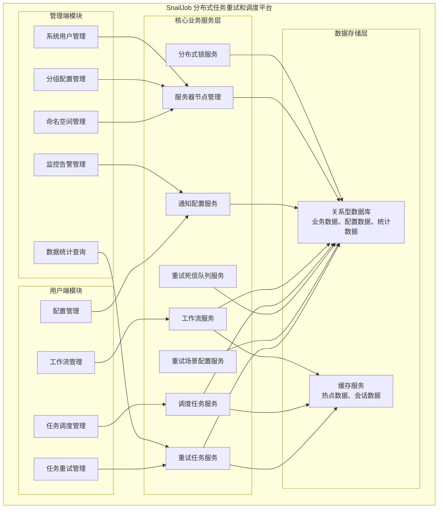
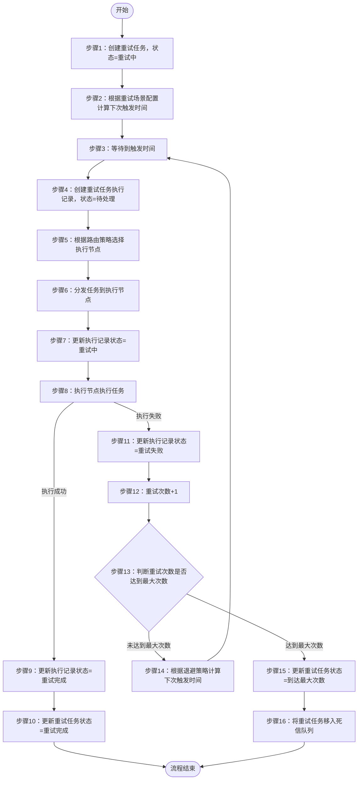
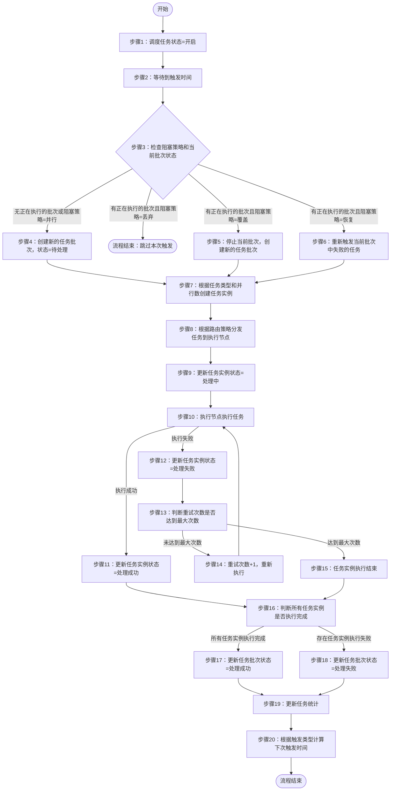
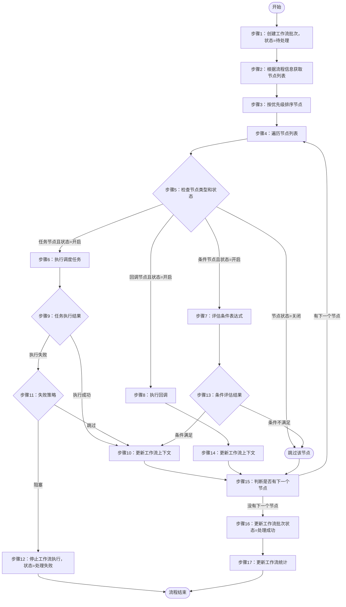
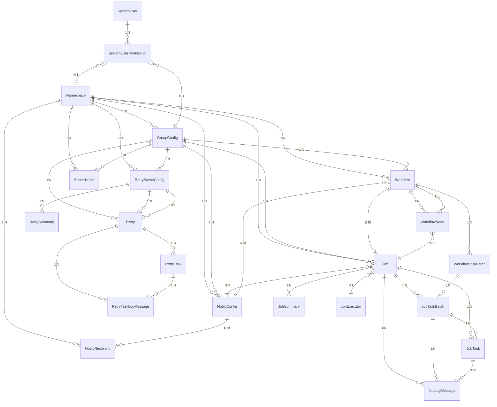

# SnailJob 分布式任务重试和调度平台业务需求规格说明书

## 文档信息

| 项目信息 | 内容 |
|---------|------|
| 项目名称 | SnailJob 分布式任务重试和调度平台 |
| 版本 | 1.0.0 |
| 文档创建日期 | 2026-02-10 |
| 文档性质 | 业务需求规格说明书 |

---

## 一、系统概述

### 1.1 系统定位

SnailJob 是一个灵活、可靠且高效的分布式任务重试和任务调度平台。该系统采用分区模式实现，具备高度可伸缩性和容错性的分布式系统。系统提供完善的权限管理、强大的告警监控功能和友好的界面交互。核心功能包括：
- 可重放、可管控的分布式任务重试平台，为提高分布式业务系统一致性提供保障
- 支持秒级精度、可中断、可编排的高性能分布式任务调度平台

### 1.2 系统目标

- 为业务系统提供可靠的任务失败重试机制，确保业务数据的一致性
- 为管理员提供高效的分布式任务调度能力，支持复杂任务编排
- 支持多种任务执行模式：集群任务、广播任务、分片任务、MapReduce任务
- 支持多种编程语言的任务执行器：Java、Python、Go
- 提供完善的数据统计和分析能力（任务执行统计、重试统计）
- 提供完善的告警通知机制，支持多种通知渠道
- 确保数据安全和系统稳定性，支持多租户和命名空间隔离

### 1.3 系统特点

- 多命名空间隔离：支持通过命名空间进行数据和配置隔离
- 灵活的重试策略：支持默认等级、固定间隔时间、CRON表达式等多种重试退避策略
- 完整的任务类型：支持集群任务、广播任务、分片任务、MapReduce任务
- 强大的工作流编排：支持工作流定义，包含任务节点、条件节点、回调节点
- 灵活的阻塞策略：针对待处理或运行中的任务提供多种异常容错策略
- 完善的监控告警：支持多种通知渠道（钉钉、邮件、企业微信、飞书、Webhook）
- 高可用的分布式架构：支持分区模式，具备高度可伸缩性和容错性
- 支持多语言执行器：Java、Python、Go等多种编程语言的任务执行
- 可配置的路由策略：支持多种任务路由策略，灵活选择执行节点

### 1.4 适用场景

- 跨服务调用的失败重试场景（如支付回调、订单状态同步等）
- 定时任务调度场景（如定时报表生成、数据清理等）
- 批量数据处理场景（如大批量数据导入导出、ETL任务等）
- 工作流编排场景（如复杂业务流程的多步骤执行）
- 分布式任务执行场景（如集群内节点并行执行任务）
- 任务执行结果监控和告警场景

---

## 二、业务模块划分

### 2.1 模块架构图



### 2.2 模块列表

| 模块名称 | 模块类型 | 主要职责 |
|---------|---------|---------|
| 任务重试管理 | 用户端/管理端 | 创建、查询、更新、删除重试任务；手动触发重试；批量更新重试状态；重试任务日志查看 |
| 任务调度管理 | 用户端/管理端 | 创建、查询、更新、删除调度任务；触发调度任务；导入导出任务配置 |
| 工作流管理 | 用户端/管理端 | 创建、查询、更新、删除工作流；触发工作流；工作流节点管理 |
| 配置管理 | 用户端/管理端 | 重试场景配置、分组配置、通知配置的增删改查；配置导入导出 |
| 命名空间管理 | 管理端 | 创建、查询、更新、删除命名空间；多租户数据隔离 |
| 分组配置管理 | 管理端 | 创建、查询、更新、删除分组配置；分组状态管理；分组分区配置 |
| 系统用户管理 | 管理端 | 创建、查询、更新、删除系统用户；用户权限管理；用户角色管理 |
| 监控告警管理 | 管理端 | 通知配置管理；通知接收人管理；告警规则配置 |
| 数据统计查询 | 用户端/管理端 | 任务执行统计、重试统计、任务批次查询、日志查询 |

---

## 三、数据模型定义

### 3.1 核心实体说明

#### 3.1.1 用户相关实体

**系统用户（SystemUser）**
```
核心属性：
- 用户唯一标识
- 账号
- 密码（加密存储）
- 角色（普通用户、管理员）
- 创建时间
- 修改时间
```

**用户权限（SystemUserPermission）**
```
核心属性：
- 权限记录唯一标识
- 命名空间ID
- 组名称
- 系统用户ID
- 创建时间
- 修改时间
```

#### 3.1.2 基础配置实体

**命名空间（Namespace）**
```
核心属性：
- 命名空间唯一标识
- 名称
- 唯一ID
- 描述
- 是否删除（逻辑删除）
- 创建时间
- 修改时间
```

**分组配置（GroupConfig）**
```
核心属性：
- 分组唯一标识
- 命名空间ID
- 组名称
- 描述
- Token（认证令牌）
- 组状态（未启用、启用）
- 版本号
- 分区数
- 唯一ID生成模式
- 是否初始化场景
- 创建时间
- 修改时间
```

#### 3.1.3 重试任务相关实体

**重试场景配置（RetrySceneConfig）**
```
核心属性：
- 场景配置唯一标识
- 命名空间ID
- 组名称
- 场景名称
- 场景状态（未启用、启用）
- 最大重试次数
- 退避策略（默认等级、固定间隔时间、CRON表达式）
- 触发间隔
- 通知告警场景配置ID列表
- Deadline Request调用链超时（单位毫秒）
- 任务执行超时时间（单位秒）
- 路由策略
- 阻塞策略（丢弃、覆盖、并行）
- 回调状态（不开启、开启）
- 回调触发类型
- 回调的最大执行次数
- 回调间隔时间
- 标签
- 负责人ID
- 描述
- 创建时间
- 修改时间
```

**重试任务（Retry）**
```
核心属性：
- 重试任务唯一标识
- 命名空间ID
- 组名称
- 组ID
- 场景名称
- 场景ID
- 幂等ID
- 业务编号
- 执行器名称
- 执行方法参数序列化器名称
- 执行方法参数
- 扩展字段
- 下次触发时间
- 重试次数
- 重试状态（重试中、重试完成、到达最大次数、暂停重试）
- 任务类型（重试数据、回调数据）
- Bucket索引
- 父节点ID
- 是否删除（逻辑删除）
- 创建时间
- 修改时间
```

**重试任务执行记录（RetryTask）**
```
核心属性：
- 执行记录唯一标识
- 命名空间ID
- 组名称
- 场景名称
- 重试任务ID
- 扩展字段
- 任务状态（待处理、重试中、重试完成、重试失败、任务停止、取消）
- 任务类型（重试数据、回调数据）
- 操作原因
- 客户端地址
- 创建时间
- 修改时间
```

**重试任务日志（RetryTaskLogMessage）**
```
核心属性：
- 日志记录唯一标识
- 命名空间ID
- 组名称
- 重试任务ID
- 重试执行记录ID
- 异常信息
- 日志数量
- 上报时间
- 创建时间
```

**重试死信队列（RetryDeadLetter）**
```
核心属性：
- 死信记录唯一标识
- 命名空间ID
- 组名称
- 组ID
- 场景名称
- 场景ID
- 幂等ID
- 业务编号
- 执行器名称
- 执行方法参数序列化器名称
- 执行方法参数
- 扩展字段
- 创建时间
```

#### 3.1.4 调度任务相关实体

**调度任务（Job）**
```
核心属性：
- 调度任务唯一标识
- 命名空间ID
- 组名称
- 任务名称
- 执行方法参数
- 参数类型
- 扩展字段
- 下次触发时间
- 任务状态（关闭、开启）
- 任务类型（集群、广播、切片、Map、MapReduce）
- 路由策略
- 执行器类型
- 执行器信息
- 触发类型（CRON表达式、固定时间）
- 触发间隔
- 阻塞策略（丢弃、覆盖、并行、恢复）
- 任务执行超时时间（单位秒）
- 最大重试次数
- 重试间隔（秒）
- 并行数
- Bucket索引
- 是否常驻任务
- 通知告警场景配置ID列表
- 负责人ID
- 标签
- 描述
- 是否删除（逻辑删除）
- 创建时间
- 修改时间
```

**调度任务执行批次（JobTaskBatch）**
```
核心属性：
- 批次唯一标识
- 命名空间ID
- 组名称
- 任务ID
- 工作流节点ID
- 工作流任务父批次ID
- 工作流任务批次ID
- 任务批次状态（失败、成功）
- 操作原因
- 任务执行时间
- 任务类型（JOB任务、WORKFLOW任务）
- 父节点
- 扩展字段
- 是否删除（逻辑删除）
- 创建时间
- 修改时间
```

**调度任务执行实例（JobTask）**
```
核心属性：
- 执行实例唯一标识
- 命名空间ID
- 组名称
- 任务名称
- 任务ID
- 任务批次ID
- 父执行器ID
- 执行状态（处理中、处理成功、处理失败、任务停止、取消）
- 重试次数
- 执行结果
- 客户端地址
- 执行方法参数
- 参数类型
- 是否叶子节点
- 动态分片所处阶段（map、reduce、mergeReduce）
- 工作流上下文
- 扩展字段
- 创建时间
- 修改时间
```

**调度任务日志（JobLogMessage）**
```
核心属性：
- 日志记录唯一标识
- 命名空间ID
- 组名称
- 任务ID
- 任务批次ID
- 任务ID
- 调度信息
- 日志数量
- 上报时间
- 扩展字段
- 创建时间
```

**任务执行器（JobExecutor）**
```
核心属性：
- 执行器唯一标识
- 命名空间ID
- 组名称
- 任务执行器名称
- 执行器类型（Java、Python、Go）
- 创建时间
- 修改时间
```

#### 3.1.5 工作流相关实体

**工作流（Workflow）**
```
核心属性：
- 工作流唯一标识
- 工作流名称
- 命名空间ID
- 组名称
- 触发类型（CRON表达式、固定时间）
- 触发间隔
- 阻塞策略（丢弃、覆盖、并行）
- 任务执行超时时间（单位秒）
- 工作流状态（关闭、开启）
- 任务执行时间
- 流程信息
- 工作流上下文
- Bucket索引
- 版本号
- 通知告警场景配置ID列表
- 负责人ID
- 扩展字段
- 是否删除（逻辑删除）
- 创建时间
- 修改时间
```

**工作流节点（WorkflowNode）**
```
核心属性：
- 节点唯一标识
- 命名空间ID
- 节点名称
- 组名称
- 任务ID
- 工作流ID
- 节点类型（任务节点、条件节点、回调节点）
- 表达式类型
- 节点信息
- 失败策略（跳过、阻塞）
- 优先级
- 工作流节点状态（关闭、开启）
- 版本号
- 扩展字段
- 是否删除（逻辑删除）
- 创建时间
- 修改时间
```

**工作流任务批次（WorkflowTaskBatch）**
```
核心属性：
- 批次唯一标识
- 命名空间ID
- 组名称
- 工作流任务ID
- 任务批次状态（失败、成功）
- 操作原因
- 流程信息
- 全局上下文
- 任务执行时间
- 版本号
- 扩展字段
- 是否删除（逻辑删除）
- 创建时间
- 修改时间
```

#### 3.1.6 通知相关实体

**通知配置（NotifyConfig）**
```
核心属性：
- 通知配置唯一标识
- 命名空间ID
- 组名称
- 通知名称
- 任务类型（重试任务、重试回调、JOB任务、WORKFLOW任务）
- 通知状态（未启用、启用）
- 接收人ID列表
- 通知阈值
- 通知场景
- 限流状态（未启用、启用）
- 每秒限流阈值
- 描述
- 创建时间
- 修改时间
```

**通知接收人（NotifyRecipient）**
```
核心属性：
- 接收人唯一标识
- 命名空间ID
- 接收人名称
- 通知类型（钉钉、邮件、企业微信、飞书、Webhook）
- 配置属性
- 描述
- 创建时间
- 修改时间
```

#### 3.1.7 其他核心实体

**服务器节点（ServerNode）**
```
核心属性：
- 节点唯一标识
- 命名空间ID
- 组名称
- 主机ID
- 机器IP
- 机器端口
- 过期时间
- 节点类型（客户端、服务端）
- 扩展字段
- 标签
- 创建时间
- 修改时间
```

**分布式锁（DistributedLock）**
```
核心属性：
- 锁名称
- 锁定时长
- 锁定时间
- 锁定者
- 创建时间
- 修改时间
```

**任务统计（JobSummary）**
```
核心属性：
- 统计记录唯一标识
- 命名空间ID
- 组名称
- 业务ID（job_id或workflow_id）
- 任务类型（JOB任务、WORKFLOW任务）
- 统计时间
- 执行成功数量
- 执行失败数量
- 失败原因
- 停止数量
- 停止原因
- 取消数量
- 取消原因
- 创建时间
- 修改时间
```

**重试统计（RetrySummary）**
```
核心属性：
- 统计记录唯一标识
- 命名空间ID
- 组名称
- 场景名称
- 统计时间
- 重试中数量
- 重试完成数量
- 重试到达最大次数数量
- 暂停重试数量
- 创建时间
- 修改时间
```

---

## 四、业务功能详述

### 4.1 任务重试管理

#### 4.1.1 重试任务管理

**重试任务查询**
- **业务规则**：
  - 支持分页查询重试任务列表
  - 支持按命名空间、组名称、场景名称、重试状态、任务类型、业务编号、幂等ID等条件筛选
  - 支持按创建时间范围筛选
- **输入参数**：
  - 命名空间ID（可选）
  - 组名称（可选）
  - 场景名称（可选）
  - 重试状态（可选）
  - 任务类型（可选）
  - 业务编号（可选）
  - 幂等ID（可选）
  - 页码、每页大小
- **输出结果**：
  - 重试任务列表
  - 总记录数
- **权限要求**：需要登录用户
- **事务要求**：查询操作，无需事务

---

**重试任务详情查询**
- **业务规则**：
  - 根据重试任务ID查询详细信息
  - 包含重试任务基本信息、执行记录列表、日志信息
- **输入参数**：
  - 重试任务ID（必填）
- **输出结果**：
  - 重试任务详细信息
  - 执行记录列表
  - 日志信息列表
- **权限要求**：需要登录用户
- **事务要求**：查询操作，无需事务

---

**重试任务创建**
- **业务规则**：
  - 创建重试任务时，必须指定重试场景配置
  - 重试任务必须包含唯一的幂等ID，用于防止重复执行
  - 重试任务创建后初始状态为"重试中"
  - 如果重试场景配置处于未启用状态，则不允许创建重试任务
  - 系统根据重试场景配置计算下次触发时间
- **输入参数**：
  - 命名空间ID（必填）
  - 组名称（必填）
  - 场景名称（必填）
  - 幂等ID（必填，唯一）
  - 业务编号（可选）
  - 执行器名称（必填）
  - 执行方法参数（必填）
- **输出结果**：
  - 创建的重试任务ID
- **异常处理**：
  - 幂等ID已存在：错误提示，不允许重复创建
  - 重试场景配置不存在或未启用：错误提示
  - 组配置不存在或未启用：错误提示
- **权限要求**：需要登录用户
- **事务要求**：
  - 创建重试任务记录
  - 计算并设置下次触发时间
  - 以上操作必须在同一事务中完成

---

**手动触发重试任务**
- **业务规则**：
  - 支持手动触发处于"重试完成"、"到达最大次数"、"暂停重试"状态的重试任务
  - 手动触发后，重试次数重置为0，重试状态变为"重试中"
  - 重新计算下次触发时间
- **输入参数**：
  - 重试任务ID（必填）
- **输出结果**：
  - 触发成功结果
- **异常处理**：
  - 重试任务不存在：错误提示
  - 重试任务状态不允许手动触发：错误提示
- **权限要求**：需要登录用户
- **事务要求**：
  - 更新重试任务状态为"重试中"
  - 重置重试次数为0
  - 重新计算并设置下次触发时间
  - 以上操作必须在同一事务中完成

---

**重试任务状态更新**
- **业务规则**：
  - 支持将重试任务状态从"重试中"更新为"暂停重试"
  - 支持将重试任务状态从"暂停重试"恢复为"重试中"
  - 处于"重试完成"、"到达最大次数"状态的任务不允许更新状态
- **输入参数**：
  - 重试任务ID（必填）
  - 新状态（必填，支持"重试中"、"暂停重试"）
- **输出结果**：
  - 更新成功结果
- **异常处理**：
  - 重试任务不存在：错误提示
  - 不允许的状态转换：错误提示
- **权限要求**：需要登录用户
- **事务要求**：
  - 更新重试任务状态
  - 以上操作必须在同一事务中完成

---

**批量删除重试任务**
- **业务规则**：
  - 仅允许删除处于"重试完成"、"到达最大次数"、"暂停重试"状态的重试任务
  - 删除为逻辑删除，不物理删除数据
- **输入参数**：
  - 重试任务ID列表（必填，不能为空）
- **输出结果**：
  - 删除成功结果
- **异常处理**：
  - 包含不允许删除状态的重试任务：错误提示
- **权限要求**：需要登录用户
- **事务要求**：
  - 批量更新重试任务的删除标记
  - 以上操作必须在同一事务中完成

---

**重试任务批量更新状态**
- **业务规则**：
  - 支持批量更新重试任务的状态
  - 状态更新规则与单个任务状态更新规则相同
- **输入参数**：
  - 重试任务ID列表（必填）
  - 新状态（必填）
- **输出结果**：
  - 更新成功的任务数量
- **异常处理**：
  - 包含不允许状态转换的任务：错误提示
- **权限要求**：需要登录用户
- **事务要求**：
  - 批量更新重试任务状态
  - 以上操作必须在同一事务中完成

---

**重试任务批量更新执行器**
- **业务规则**：
  - 支持批量更新重试任务的执行器名称
  - 执行器更新后，下次重试时使用新的执行器
- **输入参数**：
  - 重试任务ID列表（必填）
  - 新执行器名称（必填）
- **输出结果**：
  - 更新成功的任务数量
- **异常处理**：
  - 执行器名称不能为空：错误提示
- **权限要求**：需要登录用户
- **事务要求**：
  - 批量更新重试任务的执行器名称
  - 以上操作必须在同一事务中完成

---

**生成重试幂等ID**
- **业务规则**：
  - 用于业务系统在创建重试任务前生成唯一的幂等ID
  - 确保幂等ID在全局范围内的唯一性
- **输入参数**：
  - 命名空间ID（必填）
  - 组名称（必填）
  - 场景名称（必填）
  - 业务编号（可选）
- **输出结果**：
  - 生成的唯一幂等ID
- **权限要求**：需要登录用户
- **事务要求**：无需事务

---

#### 4.1.2 重试场景配置管理

**重试场景配置查询**
- **业务规则**：
  - 支持分页查询重试场景配置列表
  - 支持按命名空间、组名称、场景名称、场景状态等条件筛选
- **输入参数**：
  - 命名空间ID（可选）
  - 组名称（可选）
  - 场景名称（可选）
  - 场景状态（可选）
  - 页码、每页大小
- **输出结果**：
  - 重试场景配置列表
  - 总记录数
- **权限要求**：需要登录用户
- **事务要求**：查询操作，无需事务

---

**重试场景配置详情查询**
- **业务规则**：
  - 根据重试场景配置ID查询详细信息
- **输入参数**：
  - 重试场景配置ID（必填）
- **输出结果**：
  - 重试场景配置详细信息
- **权限要求**：需要登录用户
- **事务要求**：查询操作，无需事务

---

**重试场景配置创建**
- **业务规则**：
  - 重试场景配置的组名称必须存在且已启用
  - 同一个命名空间和组名称下，场景名称必须唯一
  - 最大重试次数必须大于0
  - Deadline Request、执行超时时间必须大于0
  - 阻塞策略包括：丢弃、覆盖、并行
- **输入参数**：
  - 命名空间ID（必填）
  - 组名称（必填）
  - 场景名称（必填）
  - 最大重试次数（必填，必须大于0）
  - 退避策略（必填）
  - 触发间隔（必填）
  - Deadline Request（必填，必须大于0）
  - 执行超时时间（必填，必须大于0）
  - 路由策略（必填）
  - 阻塞策略（必填）
  - 通知告警场景配置ID列表（可选）
  - 回调状态（必填）
  - 回调触发类型（可选）
  - 回调最大执行次数（可选）
  - 回调间隔时间（可选）
  - 标签（可选）
  - 负责人ID（可选）
  - 描述（可选）
- **输出结果**：
  - 创建的重试场景配置ID
- **异常处理**：
  - 组配置不存在或未启用：错误提示
  - 场景名称已存在：错误提示
  - 最大重试次数、Deadline Request、执行超时时间不合法：错误提示
- **权限要求**：需要登录用户
- **事务要求**：
  - 创建重试场景配置记录
  - 以上操作必须在同一事务中完成

---

**重试场景配置更新**
- **业务规则**：
  - 支持更新重试场景配置的各项参数
  - 更新后的配置仅影响新创建的重试任务，不影响正在执行的重试任务
- **输入参数**：
  - 重试场景配置ID（必填）
  - 其他配置参数（可选）
- **输出结果**：
  - 更新成功结果
- **异常处理**：
  - 重试场景配置不存在：错误提示
  - 配置参数不合法：错误提示
- **权限要求**：需要登录用户
- **事务要求**：
  - 更新重试场景配置记录
  - 以上操作必须在同一事务中完成

---

**重试场景配置状态更新**
- **业务规则**：
  - 支持启用或停用重试场景配置
  - 停用场景配置后，不允许创建新的重试任务，但已存在的重试任务继续执行
- **输入参数**：
  - 重试场景配置ID（必填）
  - 新状态（必填，支持"启用"、"停用"）
- **输出结果**：
  - 更新成功结果
- **异常处理**：
  - 重试场景配置不存在：错误提示
- **权限要求**：需要登录用户
- **事务要求**：
  - 更新重试场景配置状态
  - 以上操作必须在同一事务中完成

---

**重试场景配置删除**
- **业务规则**：
  - 删除为逻辑删除，不物理删除数据
  - 不允许删除已关联重试任务的重试场景配置
- **输入参数**：
  - 重试场景配置ID列表（必填，不能为空）
- **输出结果**：
  - 删除成功结果
- **异常处理**：
  - 包含已关联重试任务的场景配置：错误提示
- **权限要求**：需要登录用户
- **事务要求**：
  - 批量更新重试场景配置的删除标记
  - 以上操作必须在同一事务中完成

---

**重试场景配置导入**
- **业务规则**：
  - 支持从导入文件批量创建重试场景配置
  - 导入格式需要符合系统要求
  - 如果场景名称已存在，则跳过该条记录
- **输入参数**：
  - 导入文件（必填）
- **输出结果**：
  - 导入成功结果
- **异常处理**：
  - 文件格式不正确：错误提示
  - 配置参数不合法：错误提示
- **权限要求**：需要登录用户
- **事务要求**：
  - 批量创建重试场景配置记录
  - 以上操作必须在同一事务中完成

---

**重试场景配置导出**
- **业务规则**：
  - 支持按条件导出重试场景配置
  - 导出格式符合系统要求
- **输入参数**：
  - 命名空间ID（可选）
  - 组名称（可选）
  - 场景名称（可选）
- **输出结果**：
  - 导出文件
- **权限要求**：需要登录用户
- **事务要求**：查询操作，无需事务

---

### 4.2 任务调度管理

#### 4.2.1 调度任务管理

**调度任务查询**
- **业务规则**：
  - 支持分页查询调度任务列表
  - 支持按命名空间、组名称、任务名称、任务状态、任务类型等条件筛选
  - 支持按创建时间范围筛选
- **输入参数**：
  - 命名空间ID（可选）
  - 组名称（可选）
  - 任务名称（可选）
  - 任务状态（可选）
  - 任务类型（可选）
  - 页码、每页大小
- **输出结果**：
  - 调度任务列表
  - 总记录数
- **权限要求**：需要登录用户
- **事务要求**：查询操作，无需事务

---

**调度任务详情查询**
- **业务规则**：
  - 根据调度任务ID查询详细信息
  - 包含任务基本信息、任务执行批次列表、日志信息
- **输入参数**：
  - 调度任务ID（必填）
- **输出结果**：
  - 调度任务详细信息
  - 任务执行批次列表
  - 日志信息列表
- **权限要求**：需要登录用户
- **事务要求**：查询操作，无需事务

---

**调度任务创建**
- **业务规则**：
  - 调度任务的组名称必须存在且已启用
  - 同一个命名空间和组名称下，任务名称必须唯一
  - 触发类型包括：CRON表达式、固定时间
  - 任务类型包括：集群、广播、分片、Map、MapReduce
  - 执行器类型包括：Java、Python、Go
  - 阻塞策略包括：丢弃、覆盖、并行、恢复
  - 执行超时时间、最大重试次数、并行数必须大于等于0
- **输入参数**：
  - 命名空间ID（必填）
  - 组名称（必填）
  - 任务名称（必填）
  - 执行方法参数（可选）
  - 参数类型（可选）
  - 扩展字段（可选）
  - 任务状态（可选，默认为开启）
  - 任务类型（必填）
  - 路由策略（必填）
  - 执行器类型（必填）
  - 执行器信息（必填）
  - 触发类型（必填）
  - 触发间隔（必填）
  - 阻塞策略（必填）
  - 执行超时时间（可选，默认为0，表示不限制）
  - 最大重试次数（可选，默认为0，表示不重试）
  - 重试间隔（可选，默认为0）
  - 并行数（可选，默认为1）
  - 是否常驻任务（可选，默认为否）
  - 通知告警场景配置ID列表（可选）
  - 负责人ID（可选）
  - 标签（可选）
  - 描述（可选）
- **输出结果**：
  - 创建的调度任务ID
- **异常处理**：
  - 组配置不存在或未启用：错误提示
  - 任务名称已存在：错误提示
  - 执行超时时间、最大重试次数、并行数不合法：错误提示
- **权限要求**：需要登录用户
- **事务要求**：
  - 创建调度任务记录
  - 计算并设置下次触发时间
  - 以上操作必须在同一事务中完成

---

**调度任务更新**
- **业务规则**：
  - 支持更新调度任务的各项参数
  - 更新执行器信息、触发类型、触发间隔时，需要重新计算下次触发时间
  - 更新后的配置影响下一次执行的任务批次
- **输入参数**：
  - 调度任务ID（必填）
  - 其他配置参数（可选）
- **输出结果**：
  - 更新成功结果
- **异常处理**：
  - 调度任务不存在：错误提示
  - 配置参数不合法：错误提示
- **权限要求**：需要登录用户
- **事务要求**：
  - 更新调度任务记录
  - 如需重新计算下次触发时间，则一并更新
  - 以上操作必须在同一事务中完成

---

**调度任务状态更新**
- **业务规则**：
  - 支持启用或停用调度任务
  - 停用任务后，不再创建新的任务批次，但已创建的任务批次继续执行
- **输入参数**：
  - 调度任务ID（必填）
  - 新状态（必填，支持"开启"、"关闭"）
- **输出结果**：
  - 更新成功结果
- **异常处理**：
  - 调度任务不存在：错误提示
- **权限要求**：需要登录用户
- **事务要求**：
  - 更新调度任务状态
  - 以上操作必须在同一事务中完成

---

**调度任务删除**
- **业务规则**：
  - 删除为逻辑删除，不物理删除数据
  - 删除任务后，不再创建新的任务批次
- **输入参数**：
  - 调度任务ID列表（必填，不能为空）
- **输出结果**：
  - 删除成功结果
- **异常处理**：
  - 无
- **权限要求**：需要登录用户
- **事务要求**：
  - 批量更新调度任务的删除标记
  - 以上操作必须在同一事务中完成

---

**手动触发调度任务**
- **业务规则**：
  - 支持手动触发处于"开启"状态的调度任务
  - 手动触发创建一个新的任务批次
  - 手动触发可传入临时的执行方法参数，覆盖任务配置中的参数
- **输入参数**：
  - 调度任务ID（必填）
  - 临时执行方法参数（可选）
- **输出结果**：
  - 触发成功结果
- **异常处理**：
  - 调度任务不存在或已关闭：错误提示
  - 没有可用的客户端节点：错误提示
- **权限要求**：需要登录用户
- **事务要求**：
  - 创建任务批次记录
  - 根据任务类型、并行数等创建任务实例记录
  - 以上操作必须在同一事务中完成

---

**获取CRON表达式预览时间**
- **业务规则**：
  - 根据CRON表达式计算接下来几次的执行时间
  - 用于用户验证CRON表达式是否正确
- **输入参数**：
  - CRON表达式（必填）
- **输出结果**：
  - 接下来几次的执行时间列表
- **权限要求**：需要登录用户
- **事务要求**：无需事务

---

**调度任务导入**
- **业务规则**：
  - 支持从导入文件批量创建调度任务
  - 导入格式需要符合系统要求
  - 如果任务名称已存在，则跳过该条记录
- **输入参数**：
  - 导入文件（必填）
- **输出结果**：
  - 导入成功结果
- **异常处理**：
  - 文件格式不正确：错误提示
  - 配置参数不合法：错误提示
- **权限要求**：需要登录用户
- **事务要求**：
  - 批量创建调度任务记录
  - 以上操作必须在同一事务中完成

---

**调度任务导出**
- **业务规则**：
  - 支持按条件导出调度任务
  - 导出格式符合系统要求
- **输入参数**：
  - 命名空间ID（可选）
  - 组名称（可选）
  - 任务名称（可选）
- **输出结果**：
  - 导出文件
- **权限要求**：需要登录用户
- **事务要求**：查询操作，无需事务

---

#### 4.2.2 调度任务批次管理

**调度任务批次查询**
- **业务规则**：
  - 支持分页查询调度任务批次列表
  - 支持按调度任务ID、任务批次状态等条件筛选
- **输入参数**：
  - 调度任务ID（必填）
  - 任务批次状态（可选）
  - 页码、每页大小
- **输出结果**：
  - 任务批次列表
  - 总记录数
- **权限要求**：需要登录用户
- **事务要求**：查询操作，无需事务

---

**调度任务批次详情查询**
- **业务规则**：
  - 根据任务批次ID查询详细信息
  - 包含批次基本信息、任务实例列表、日志信息
- **输入参数**：
  - 任务批次ID（必填）
- **输出结果**：
  - 任务批次详细信息
  - 任务实例列表
  - 日志信息列表
- **权限要求**：需要登录用户
- **事务要求**：查询操作，无需事务

---

**调度任务实例查询**
- **业务规则**：
  - 支持分页查询调度任务实例列表
  - 支持按任务批次ID、任务状态等条件筛选
- **输入参数**：
  - 任务批次ID（必填）
  - 任务状态（可选）
  - 页码、每页大小
- **输出结果**：
  - 任务实例列表
  - 总记录数
- **权限要求**：需要登录用户
- **事务要求**：查询操作，无需事务

---

### 4.3 工作流管理

#### 4.3.1 工作流管理

**工作流查询**
- **业务规则**：
  - 支持分页查询工作流列表
  - 支持按命名空间、组名称、工作流名称、工作流状态等条件筛选
- **输入参数**：
  - 命名空间ID（可选）
  - 组名称（可选）
  - 工作流名称（可选）
  - 工作流状态（可选）
  - 页码、每页大小
- **输出结果**：
  - 工作流列表
  - 总记录数
- **权限要求**：需要登录用户
- **事务要求**：查询操作，无需事务

---

**工作流详情查询**
- **业务规则**：
  - 根据工作流ID查询详细信息
  - 包含工作流基本信息、工作流节点列表、工作流上下文
- **输入参数**：
  - 工作流ID（必填）
- **输出结果**：
  - 工作流详细信息
  - 工作流节点列表
  - 工作流上下文
- **权限要求**：需要登录用户
- **事务要求**：查询操作，无需事务

---

**工作流创建**
- **业务规则**：
  - 工作流的组名称必须存在且已启用
  - 同一个命名空间和组名称下，工作流名称必须唯一
  - 触发类型包括：CRON表达式、固定时间
  - 阻塞策略包括：丢弃、覆盖、并行
  - 工作流必须包含至少一个工作流节点
  - 工作流节点类型包括：任务节点、条件节点、回调节点
- **输入参数**：
  - 命名空间ID（必填）
  - 组名称（必填）
  - 工作流名称（必填）
  - 触发类型（必填）
  - 触发间隔（必填）
  - 阻塞策略（必填）
  - 执行超时时间（可选，默认为0，表示不限制）
  - 工作流状态（可选，默认为开启）
  - 流程信息（必填，JSON格式，包含工作流节点配置）
  - 工作流上下文（可选）
  - 通知告警场景配置ID列表（可选）
  - 负责人ID（可选）
  - 扩展字段（可选）
  - 描述（可选）
- **输出结果**：
  - 创建的工作流ID
- **异常处理**：
  - 组配置不存在或未启用：错误提示
  - 工作流名称已存在：错误提示
  - 流程信息格式不正确或不包含节点：错误提示
- **权限要求**：需要登录用户
- **事务要求**：
  - 创建工作流记录
  - 根据流程信息创建工作流节点记录
  - 计算并设置下次触发时间
  - 以上操作必须在同一事务中完成

---

**工作流更新**
- **业务规则**：
  - 支持更新工作流的各项参数
  - 更新流程信息时，版本号自动加1
  - 更新后的配置影响下一次执行的工作流批次
- **输入参数**：
  - 工作流ID（必填）
  - 其他配置参数（可选）
- **输出结果**：
  - 更新成功结果
- **异常处理**：
  - 工作流不存在：错误提示
  - 配置参数不合法：错误提示
- **权限要求**：需要登录用户
- **事务要求**：
  - 更新工作流记录
  - 如需更新流程信息，则更新工作流节点记录并增加版本号
  - 如需重新计算下次触发时间，则一并更新
  - 以上操作必须在同一事务中完成

---

**工作流状态更新**
- **业务规则**：
  - 支持启用或停用工作流
  - 停用工作流后，不再创建新的工作流批次，但已创建的工作流批次继续执行
- **输入参数**：
  - 工作流ID（必填）
  - 新状态（必填，支持"开启"、"关闭"）
- **输出结果**：
  - 更新成功结果
- **异常处理**：
  - 工作流不存在：错误提示
- **权限要求**：需要登录用户
- **事务要求**：
  - 更新工作流状态
  - 以上操作必须在同一事务中完成

---

**工作流删除**
- **业务规则**：
  - 删除为逻辑删除，不物理删除数据
  - 删除工作流后，不再创建新的工作流批次
- **输入参数**：
  - 工作流ID列表（必填，不能为空）
- **输出结果**：
  - 删除成功结果
- **异常处理**：
  - 无
- **权限要求**：需要登录用户
- **事务要求**：
  - 批量更新工作流的删除标记
  - 以上操作必须在同一事务中完成

---

**手动触发工作流**
- **业务规则**：
  - 支持手动触发处于"开启"状态的工作流
  - 手动触发创建一个新的工作流批次
  - 手动触发可传入临时的上下文参数，覆盖工作流配置中的上下文
- **输入参数**：
  - 工作流ID（必填）
  - 临时上下文参数（可选）
- **输出结果**：
  - 触发成功结果
- **异常处理**：
  - 工作流不存在或已关闭：错误提示
  - 没有可用的客户端节点：错误提示
- **权限要求**：需要登录用户
- **事务要求**：
  - 创建工作流批次记录
  - 根据流程信息创建工作流任务实例记录
  - 以上操作必须在同一事务中完成

---

**工作流导入**
- **业务规则**：
  - 支持从导入文件批量创建工作流
  - 导入格式需要符合系统要求
  - 如果工作流名称已存在，则跳过该条记录
- **输入参数**：
  - 导入文件（必填）
- **输出结果**：
  - 导入成功结果
- **异常处理**：
  - 文件格式不正确：错误提示
  - 配置参数不合法：错误提示
- **权限要求**：需要登录用户
- **事务要求**：
  - 批量创建工作流记录
  - 批量创建工作流节点记录
  - 以上操作必须在同一事务中完成

---

**工作流导出**
- **业务规则**：
  - 支持按条件导出工作流
  - 导出格式符合系统要求
- **输入参数**：
  - 命名空间ID（可选）
  - 组名称（可选）
  - 工作流名称（可选）
- **输出结果**：
  - 导出文件
- **权限要求**：需要登录用户
- **事务要求**：查询操作，无需事务

---

#### 4.3.2 工作流节点管理

**工作流节点查询**
- **业务规则**：
  - 支持按工作流ID查询工作流节点列表
- **输入参数**：
  - 工作流ID（必填）
- **输出结果**：
  - 工作流节点列表
- **权限要求**：需要登录用户
- **事务要求**：查询操作，无需事务

---

**工作流节点创建**
- **业务规则**：
  - 工作流节点必须关联到一个工作流
  - 工作流节点类型包括：任务节点、条件节点、回调节点
  - 任务节点必须关联到一个已存在的调度任务
  - 条件节点需要配置条件表达式
  - 失败策略包括：跳过、阻塞
  - 优先级用于确定节点的执行顺序
- **输入参数**：
  - 命名空间ID（必填）
  - 组名称（必填）
  - 工作流ID（必填）
  - 节点名称（必填）
  - 节点类型（必填）
  - 任务ID（必填，当节点类型为任务节点时）
  - 表达式类型（可选，当节点类型为条件节点时）
  - 节点信息（必填，JSON格式）
  - 失败策略（必填）
  - 优先级（必填）
  - 节点状态（可选，默认为开启）
  - 扩展字段（可选）
- **输出结果**：
  - 创建的工作流节点ID
- **异常处理**：
  - 工作流不存在：错误提示
  - 任务ID不存在（当节点类型为任务节点时）：错误提示
- **权限要求**：需要登录用户
- **事务要求**：
  - 创建工作流节点记录
  - 以上操作必须在同一事务中完成

---

**工作流节点更新**
- **业务规则**：
  - 支持更新工作流节点的各项参数
  - 更新节点信息时，工作流版本号自动加1
- **输入参数**：
  - 工作流节点ID（必填）
  - 其他配置参数（可选）
- **输出结果**：
  - 更新成功结果
- **异常处理**：
  - 工作流节点不存在：错误提示
  - 配置参数不合法：错误提示
- **权限要求**：需要登录用户
- **事务要求**：
  - 更新工作流节点记录
  - 如需更新节点信息，则增加工作流版本号
  - 以上操作必须在同一事务中完成

---

**工作流节点状态更新**
- **业务规则**：
  - 支持启用或停用工作流节点
  - 停用工作流节点后，该节点在工作流执行时跳过
- **输入参数**：
  - 工作流节点ID（必填）
  - 新状态（必填，支持"开启"、"关闭"）
- **输出结果**：
  - 更新成功结果
- **异常处理**：
  - 工作流节点不存在：错误提示
- **权限要求**：需要登录用户
- **事务要求**：
  - 更新工作流节点状态
  - 以上操作必须在同一事务中完成

---

**工作流节点删除**
- **业务规则**：
  - 删除为逻辑删除，不物理删除数据
  - 删除工作流节点后，需要更新工作流的流程信息
- **输入参数**：
  - 工作流节点ID（必填）
- **输出结果**：
  - 删除成功结果
- **异常处理**：
  - 无
- **权限要求**：需要登录用户
- **事务要求**：
  - 更新工作流节点的删除标记
  - 更新工作流的流程信息
  - 增加工作流版本号
  - 以上操作必须在同一事务中完成

---

**检查节点表达式**
- **业务规则**：
  - 用于用户验证条件节点的表达式是否正确
  - 支持传入测试上下文数据
- **输入参数**：
  - 表达式类型（必填）
  - 表达式（必填）
  - 测试上下文数据（可选）
- **输出结果**：
  - 表达式验证结果
  - 表达式执行结果
- **权限要求**：需要登录用户
- **事务要求**：无需事务

---

### 4.4 配置管理

#### 4.4.1 分组配置管理

**分组配置查询**
- **业务规则**：
  - 支持分页查询分组配置列表
  - 支持按命名空间、组名称、组状态等条件筛选
- **输入参数**：
  - 命名空间ID（可选）
  - 组名称（可选）
  - 组状态（可选）
  - 页码、每页大小
- **输出结果**：
  - 分组配置列表
  - 总记录数
- **权限要求**：需要登录用户
- **事务要求**：查询操作，无需事务

---

**分组配置详情查询**
- **业务规则**：
  - 根据组名称查询分组配置详细信息
- **输入参数**：
  - 组名称（必填）
- **输出结果**：
  - 分组配置详细信息
- **权限要求**：需要登录用户
- **事务要求**：查询操作，无需事务

---

**分组配置创建**
- **业务规则**：
  - 分组配置的命名空间必须存在
  - 同一个命名空间下，组名称必须唯一
  - 分组状态默认为未启用
  - 分区数、ID生成模式需要合理配置
- **输入参数**：
  - 命名空间ID（必填）
  - 组名称（必填）
  - 描述（可选）
  - Token（可选，系统自动生成）
  - 组状态（可选，默认为未启用）
  - 分区数（必填）
  - 唯一ID生成模式（可选，默认为号段模式）
  - 是否初始化场景（可选，默认为否）
- **输出结果**：
  - 创建的分组配置ID
- **异常处理**：
  - 命名空间不存在：错误提示
  - 组名称已存在：错误提示
  - 分区数不合法：错误提示
- **权限要求**：需要管理员权限
- **事务要求**：
  - 创建分组配置记录
  - 以上操作必须在同一事务中完成

---

**分组配置更新**
- **业务规则**：
  - 支持更新分组配置的各项参数
  - 更新后，版本号自动加1
  - 更新分区数需要特殊处理，可能需要数据迁移
- **输入参数**：
  - 组名称（必填）
  - 其他配置参数（可选）
- **输出结果**：
  - 更新成功结果
- **异常处理**：
  - 分组配置不存在：错误提示
  - 配置参数不合法：错误提示
- **权限要求**：需要管理员权限
- **事务要求**：
  - 更新分组配置记录
  - 版本号自动加1
  - 以上操作必须在同一事务中完成

---

**分组配置状态更新**
- **业务规则**：
  - 支持启用或停用分组配置
  - 停用分组配置后，该分组下的重试任务、调度任务、工作流不再创建新的执行记录，但已存在的执行记录继续执行
- **输入参数**：
  - 组名称（必填）
  - 新状态（必填，支持"启用"、"停用"）
- **输出结果**：
  - 更新成功结果
- **异常处理**：
  - 分组配置不存在：错误提示
- **权限要求**：需要管理员权限
- **事务要求**：
  - 更新分组配置状态
  - 以上操作必须在同一事务中完成

---

**分组配置删除**
- **业务规则**：
  - 删除为逻辑删除，不物理删除数据
  - 不允许删除已关联重试任务、调度任务、工作流的分组配置
- **输入参数**：
  - 组名称（必填）
- **输出结果**：
  - 删除成功结果
- **异常处理**：
  - 包含已关联重试任务、调度任务、工作流的分组配置：错误提示
- **权限要求**：需要管理员权限
- **事务要求**：
  - 更新分组配置的删除标记
  - 以上操作必须在同一事务中完成

---

**获取所有分组名称列表**
- **业务规则**：
  - 获取当前用户有权访问的所有分组名称列表
  - 支持按命名空间筛选
- **输入参数**：
  - 命名空间ID列表（可选）
- **输出结果**：
  - 分组名称列表
- **权限要求**：需要登录用户
- **事务要求**：查询操作，无需事务

---

**获取在线节点列表**
- **业务规则**：
  - 获取指定分组下的在线客户端节点列表
- **输入参数**：
  - 组名称（必填）
- **输出结果**：
  - 在线节点名称列表
- **权限要求**：需要登录用户
- **事务要求**：查询操作，无需事务

---

**获取分区列表**
- **业务规则**：
  - 获取当前系统的分区配置列表
- **输入参数**：
  - 无
- **输出结果**：
  - 分区列表
- **权限要求**：需要管理员权限
- **事务要求**：查询操作，无需事务

---

**分组配置导入**
- **业务规则**：
  - 支持从导入文件批量创建分组配置
  - 导入格式需要符合系统要求
  - 如果组名称已存在，则跳过该条记录
- **输入参数**：
  - 导入文件（必填）
- **输出结果**：
  - 导入成功结果
- **异常处理**：
  - 文件格式不正确：错误提示
  - 配置参数不合法：错误提示
- **权限要求**：需要管理员权限
- **事务要求**：
  - 批量创建分组配置记录
  - 以上操作必须在同一事务中完成

---

**分组配置导出**
- **业务规则**：
  - 支持按条件导出分组配置
  - 导出格式符合系统要求
- **输入参数**：
  - 命名空间ID（可选）
  - 组名称（可选）
- **输出结果**：
  - 导出文件
- **权限要求**：需要登录用户
- **事务要求**：查询操作，无需事务

---

#### 4.4.2 通知配置管理

**通知配置查询**
- **业务规则**：
  - 支持分页查询通知配置列表
  - 支持按命名空间、组名称、通知名称、任务类型、通知状态等条件筛选
- **输入参数**：
  - 命名空间ID（可选）
  - 组名称（可选）
  - 通知名称（可选）
  - 任务类型（可选）
  - 通知状态（可选）
  - 页码、每页大小
- **输出结果**：
  - 通知配置列表
  - 总记录数
- **权限要求**：需要登录用户
- **事务要求**：查询操作，无需事务

---

**通知配置详情查询**
- **业务规则**：
  - 根据通知配置ID查询详细信息
- **输入参数**：
  - 通知配置ID（必填）
- **输出结果**：
  - 通知配置详细信息
- **权限要求**：需要登录用户
- **事务要求**：查询操作，无需事务

---

**按任务类型查询通知配置列表**
- **业务规则**：
  - 根据任务类型查询所有启用的通知配置列表
  - 任务类型包括：重试任务、重试回调、JOB任务、WORKFLOW任务
- **输入参数**：
  - 任务类型（必填）
- **输出结果**：
  - 通知配置列表
- **权限要求**：需要登录用户
- **事务要求**：查询操作，无需事务

---

**通知配置创建**
- **业务规则**：
  - 通知配置的组名称必须存在
  - 接收人ID列表不能为空
  - 通知阈值用于控制通知频率，避免消息轰炸
  - 通知场景用于指定在什么情况下触发通知
  - 限流状态和限流阈值用于控制每秒最多发送的通知数量
- **输入参数**：
  - 命名空间ID（必填）
  - 组名称（必填）
  - 通知名称（必填）
  - 任务类型（必填）
  - 接收人ID列表（必填）
  - 通知阈值（可选）
  - 通知场景（必填）
  - 限流状态（可选，默认为未启用）
  - 每秒限流阈值（可选）
  - 描述（可选）
- **输出结果**：
  - 创建的通知配置ID
- **异常处理**：
  - 组配置不存在：错误提示
  - 接收人ID列表为空：错误提示
- **权限要求**：需要登录用户
- **事务要求**：
  - 创建通知配置记录
  - 以上操作必须在同一事务中完成

---

**通知配置更新**
- **业务规则**：
  - 支持更新通知配置的各项参数
- **输入参数**：
  - 通知配置ID（必填）
  - 其他配置参数（可选）
- **输出结果**：
  - 更新成功结果
- **异常处理**：
  - 通知配置不存在：错误提示
  - 配置参数不合法：错误提示
- **权限要求**：需要登录用户
- **事务要求**：
  - 更新通知配置记录
  - 以上操作必须在同一事务中完成

---

**通知配置状态更新**
- **业务规则**：
  - 支持启用或停用通知配置
  - 停用通知配置后，该通知配置不再发送通知
- **输入参数**：
  - 通知配置ID（必填）
  - 新状态（必填，支持"启用"、"停用"）
- **输出结果**：
  - 更新成功结果
- **异常处理**：
  - 通知配置不存在：错误提示
- **权限要求**：需要登录用户
- **事务要求**：
  - 更新通知配置状态
  - 以上操作必须在同一事务中完成

---

**通知配置批量删除**
- **业务规则**：
  - 删除为逻辑删除，不物理删除数据
- **输入参数**：
  - 通知配置ID列表（必填，不能为空）
- **输出结果**：
  - 删除成功结果
- **异常处理**：
  - 无
- **权限要求**：需要登录用户
- **事务要求**：
  - 批量更新通知配置的删除标记
  - 以上操作必须在同一事务中完成

---

#### 4.4.3 通知接收人管理

**通知接收人查询**
- **业务规则**：
  - 支持分页查询通知接收人列表
  - 支持按命名空间、接收人名称、通知类型等条件筛选
- **输入参数**：
  - 命名空间ID（可选）
  - 接收人名称（可选）
  - 通知类型（可选）
  - 页码、每页大小
- **输出结果**：
  - 通知接收人列表
  - 总记录数
- **权限要求**：需要登录用户
- **事务要求**：查询操作，无需事务

---

**通知接收人创建**
- **业务规则**：
  - 通知接收人的命名空间必须存在
  - 通知类型包括：钉钉、邮件、企业微信、飞书、Webhook
  - 配置属性根据通知类型不同而不同
    - 钉钉：webhook地址、密钥
    - 邮件：邮箱地址、邮件服务器配置
    - 企业微信：webhook地址、密钥
    - 飞书：webhook地址、密钥
    - Webhook：webhook地址、请求头、请求体模板
- **输入参数**：
  - 命名空间ID（必填）
  - 接收人名称（必填）
  - 通知类型（必填）
  - 配置属性（必填，JSON格式）
  - 描述（可选）
- **输出结果**：
  - 创建的通知接收人ID
- **异常处理**：
  - 命名空间不存在：错误提示
  - 配置属性格式不正确：错误提示
- **权限要求**：需要登录用户
- **事务要求**：
  - 创建通知接收人记录
  - 以上操作必须在同一事务中完成

---

**通知接收人更新**
- **业务规则**：
  - 支持更新通知接收人的各项参数
- **输入参数**：
  - 通知接收人ID（必填）
  - 其他配置参数（可选）
- **输出结果**：
  - 更新成功结果
- **异常处理**：
  - 通知接收人不存在：错误提示
  - 配置参数不合法：错误提示
- **权限要求**：需要登录用户
- **事务要求**：
  - 更新通知接收人记录
  - 以上操作必须在同一事务中完成

---

**通知接收人删除**
- **业务规则**：
  - 删除为逻辑删除，不物理删除数据
  - 不允许删除已被通知配置使用的通知接收人
- **输入参数**：
  - 通知接收人ID（必填）
- **输出结果**：
  - 删除成功结果
- **异常处理**：
  - 包含已被通知配置使用的通知接收人：错误提示
- **权限要求**：需要登录用户
- **事务要求**：
  - 更新通知接收人的删除标记
  - 以上操作必须在同一事务中完成

---

### 4.5 系统管理

#### 4.5.1 命名空间管理

**命名空间查询**
- **业务规则**：
  - 支持查询所有命名空间列表
- **输入参数**：
  - 无
- **输出结果**：
  - 命名空间列表
- **权限要求**：需要登录用户
- **事务要求**：查询操作，无需事务

---

**命名空间创建**
- **业务规则**：
  - 命名空间名称必须唯一
  - 唯一ID由系统自动生成
- **输入参数**：
  - 名称（必填）
  - 描述（可选）
- **输出结果**：
  - 创建的命名空间ID
- **异常处理**：
  - 名称已存在：错误提示
- **权限要求**：需要管理员权限
- **事务要求**：
  - 创建命名空间记录
  - 以上操作必须在同一事务中完成

---

**命名空间更新**
- **业务规则**：
  - 支持更新命名空间的描述
- **输入参数**：
  - 命名空间ID（必填）
  - 描述（可选）
- **输出结果**：
  - 更新成功结果
- **异常处理**：
  - 命名空间不存在：错误提示
- **权限要求**：需要管理员权限
- **事务要求**：
  - 更新命名空间记录
  - 以上操作必须在同一事务中完成

---

**命名空间删除**
- **业务规则**：
  - 删除为逻辑删除，不物理删除数据
  - 不允许删除已包含分组配置的命名空间
- **输入参数**：
  - 命名空间ID（必填）
- **输出结果**：
  - 删除成功结果
- **异常处理**：
  - 包含已分组配置的命名空间：错误提示
- **权限要求**：需要管理员权限
- **事务要求**：
  - 更新命名空间的删除标记
  - 以上操作必须在同一事务中完成

---

#### 4.5.2 系统用户管理

**系统用户查询**
- **业务规则**：
  - 支持分页查询系统用户列表
- **输入参数**：
  - 页码、每页大小
- **输出结果**：
  - 系统用户列表
  - 总记录数
- **权限要求**：需要管理员权限
- **事务要求**：查询操作，无需事务

---

**系统用户创建**
- **业务规则**：
  - 账号必须唯一
  - 密码需要加密存储
  - 角色包括：普通用户、管理员
- **输入参数**：
  - 账号（必填，唯一）
  - 密码（必填）
  - 角色（必填）
- **输出结果**：
  - 创建的系统用户ID
- **异常处理**：
  - 账号已存在：错误提示
- **权限要求**：需要管理员权限
- **事务要求**：
  - 创建系统用户记录
  - 以上操作必须在同一事务中完成

---

**系统用户更新**
- **业务规则**：
  - 支持更新系统用户的密码和角色
- **输入参数**：
  - 系统用户ID（必填）
  - 密码（可选）
  - 角色（可选）
- **输出结果**：
  - 更新成功结果
- **异常处理**：
  - 系统用户不存在：错误提示
- **权限要求**：需要管理员权限
- **事务要求**：
  - 更新系统用户记录
  - 以上操作必须在同一事务中完成

---

**系统用户删除**
- **业务规则**：
  - 删除为逻辑删除，不物理删除数据
  - 不允许删除已登录的系统用户
- **输入参数**：
  - 系统用户ID（必填）
- **输出结果**：
  - 删除成功结果
- **异常处理**：
  - 系统用户不存在或已登录：错误提示
- **权限要求**：需要管理员权限
- **事务要求**：
  - 更新系统用户的删除标记
  - 以上操作必须在同一事务中完成

---

#### 4.5.3 数据统计查询

**任务执行统计查询**
- **业务规则**：
  - 支持按调度任务ID或工作流ID查询任务执行统计数据
  - 支持按统计时间范围筛选
  - 统计数据包括：执行成功数量、执行失败数量、停止数量、取消数量
- **输入参数**：
  - 业务ID（必填，job_id或workflow_id）
  - 任务类型（必填，JOB任务或WORKFLOW任务）
  - 统计开始时间（可选）
  - 统计结束时间（可选）
- **输出结果**：
  - 任务执行统计数据列表
- **权限要求**：需要登录用户
- **事务要求**：查询操作，无需事务

---

**重试统计查询**
- **业务规则**：
  - 支持按场景名称查询重试统计数据
  - 支持按统计时间范围筛选
  - 统计数据包括：重试中数量、重试完成数量、重试到达最大次数数量、暂停重试数量
- **输入参数**：
  - 命名空间ID（可选）
  - 组名称（可选）
  - 场景名称（可选）
  - 统计开始时间（可选）
  - 统计结束时间（可选）
- **输出结果**：
  - 重试统计数据列表
- **权限要求**：需要登录用户
- **事务要求**：查询操作，无需事务

---

**Dashboard统计数据查询**
- **业务规则**：
  - 用于Dashboard展示的统计数据
  - 支持多种维度的统计
- **输入参数**：
  - 统计维度（必填）
  - 时间范围（可选）
- **输出结果**：
  - 统计数据
- **权限要求**：需要登录用户
- **事务要求**：查询操作，无需事务

---

---

## 五、核心业务流程

### 5.1 重试任务执行流程

**流程名称**：重试任务执行流程

**流程描述**：描述重试任务从创建到执行的完整流程，包括重试策略、状态转换等

**流程图**：


**详细说明**：
1. **步骤1**：创建重试任务记录，初始状态为"重试中"
2. **步骤2**：根据重试场景配置的退避策略计算下次触发时间
3. **步骤3**：等待到触发时间
4. **步骤4**：创建重试任务执行记录，初始状态为"待处理"
5. **步骤5**：根据路由策略选择执行节点
6. **步骤6**：分发任务到执行节点
7. **步骤7**：更新执行记录状态为"重试中"
8. **步骤8**：执行节点执行任务
9. **步骤9**：如果执行成功，更新执行记录状态为"重试完成"
10. **步骤10**：更新重试任务状态为"重试完成"
11. **步骤11**：如果执行失败，更新执行记录状态为"重试失败"
12. **步骤12**：重试次数加1
13. **步骤13**：判断重试次数是否达到最大次数
14. **步骤14**：如果未达到最大次数，根据退避策略计算下次触发时间
15. **步骤15**：如果达到最大次数，更新重试任务状态为"到达最大次数"
16. **步骤16**：将重试任务移入死信队列，供后续处理

---

### 5.2 调度任务执行流程

**流程名称**：调度任务执行流程

**流程描述**：描述调度任务从触发到完成的完整流程

**流程图**：


**详细说明**：
1. **步骤1**：检查调度任务状态是否为"开启"
2. **步骤2**：等待到触发时间
3. **步骤3**：检查阻塞策略和当前批次状态
4. **步骤4**：如果无正在执行的批次或阻塞策略为"并行"，创建新的任务批次，状态为"待处理"
5. **步骤5**：如果有正在执行的批次且阻塞策略为"覆盖"，停止当前批次，创建新的任务批次
6. **步骤6**：如果有正在执行的批次且阻塞策略为"恢复"，重新触发当前批次中失败的任务
7. **步骤7**：根据任务类型（集群、广播、分片、Map、MapReduce）和并行数创建任务实例
8. **步骤8**：根据路由策略分发任务到执行节点
9. **步骤9**：更新任务实例状态为"处理中"
10. **步骤10**：执行节点执行任务
11. **步骤11**：如果执行成功，更新任务实例状态为"处理成功"
12. **步骤12**：如果执行失败，更新任务实例状态为"处理失败"
13. **步骤13**：判断重试次数是否达到最大次数
14. **步骤14**：如果未达到最大次数，重试次数加1，重新执行
15. **步骤15**：如果达到最大次数，任务实例执行结束
16. **步骤16**：判断所有任务实例是否执行完成
17. **步骤17**：如果所有任务实例执行完成，更新任务批次状态为"处理成功"
18. **步骤18**：如果存在任务实例执行失败，更新任务批次状态为"处理失败"
19. **步骤19**：更新任务统计数据
20. **步骤20**：根据触发类型（CRON表达式、固定时间）计算下次触发时间

---

### 5.3 工作流执行流程

**流程名称**：工作流执行流程

**流程描述**：描述工作流从触发到完成的完整流程，包括节点执行、条件判断、上下文传递等

**流程图**：


**详细说明**：
1. **步骤1**：创建工作流批次，状态为"待处理"
2. **步骤2**：根据流程信息获取节点列表
3. **步骤3**：按优先级排序节点
4. **步骤4**：遍历节点列表
5. **步骤5**：检查节点类型和状态
6. **步骤6**：如果是任务节点且状态为"开启"，执行调度任务
7. **步骤7**：如果是条件节点且状态为"开启"，评估条件表达式
8. **步骤8**：如果是回调节点且状态为"开启"，执行回调
9. **步骤9**：判断任务执行结果
10. **步骤10**：如果执行成功或条件满足，更新工作流上下文
11. **步骤11**：如果执行失败，判断失败策略
12. **步骤12**：如果失败策略为"阻塞"，停止工作流执行，状态为"处理失败"
13. **步骤13**：判断条件评估结果
14. **步骤14**：更新工作流上下文
15. **步骤15**：判断是否有下一个节点
16. **步骤16**：如果没有下一个节点，更新工作流批次状态为"处理成功"
17. **步骤17**：更新工作流统计数据

---

## 六、数据关系说明

### 6.1 核心实体关系图



**实体关系说明**：
- 命名空间 → 分组配置(1:N)、重试场景配置(1:N)、调度任务(1:N)、工作流(1:N)、通知配置(1:N)、通知接收人(1:N)、服务器节点(1:N)
- 分组配置 → 重试场景配置(1:N)、重试任务(1:N)、调度任务(1:N)、工作流(1:N)、通知配置(1:N)、服务器节点(1:N)
- 重试场景配置 → 重试任务(1:N)、重试统计(1:N)
- 重试任务 → 重试任务执行记录(1:N)、重试任务日志(1:N)
- 重试任务 → 重试场景配置(N:1)
- 重试任务执行记录 → 重试任务日志(1:N)
- 调度任务 → 任务批次(1:N)、任务实例(1:N)、任务日志(1:N)、任务统计(1:N)
- 调度任务 → 任务执行器(N:1)、通知配置(N:M)
- 任务批次 → 任务实例(1:N)、任务日志(1:N)
- 任务实例 → 任务日志(1:N)
- 工作流 → 工作流节点(1:N)、工作流批次(1:N)、调度任务(关联)、通知配置(N:M)
- 工作流节点 → 工作流(N:1)、调度任务(N:1)
- 工作流批次 → 任务批次(1:N)
- 通知配置 → 通知接收人(N:M)
- 系统用户 → 用户权限(1:N)
- 用户权限 → 命名空间(N:1)、分组配置(N:1)

### 6.2 数据一致性规则

#### 6.2.1 创建重试任务数据一致性

**业务场景**：创建重试任务

**一致性要求**：
- 操作1：创建重试任务记录，状态为"重试中"
- 操作2：计算并设置下次触发时间
- 操作3：生成唯一的幂等ID
- 操作4：创建重试任务执行记录，状态为"待处理"
- 以上操作必须在同一事务中完成

---

#### 6.2.2 创建调度任务批次数据一致性

**业务场景**：创建调度任务批次

**一致性要求**：
- 操作1：创建任务批次记录，状态为"待处理"
- 操作2：根据任务类型和并行数创建任务实例记录
- 操作3：更新调度任务的下次触发时间
- 以上操作必须在同一事务中完成

---

#### 6.2.3 更新任务实例状态数据一致性

**业务场景**：更新任务实例状态

**一致性要求**：
- 操作1：更新任务实例状态（处理中、处理成功、处理失败、任务停止、取消）
- 操作2：如果是处理失败，重试次数加1
- 操作3：记录执行结果日志
- 操作4：根据任务实例状态更新任务批次状态
- 以上操作必须在同一事务中完成

---

#### 6.2.4 工作流执行数据一致性

**业务场景**：执行工作流

**一致性要求**：
- 操作1：创建工作流批次记录，状态为"待处理"
- 操作2：根据流程信息创建工作流任务实例记录
- 操作3：更新工作流上下文
- 操作4：根据节点执行结果更新工作流批次状态
- 操作5：更新工作流统计
- 以上操作必须在同一事务中完成

---

#### 6.2.5 删除配置数据一致性

**业务场景**：删除配置（分组、重试场景、调度任务、工作流等）

**一致性要求**：
- 操作1：检查配置是否已被关联使用
- 操作2：如果已被关联使用，拒绝删除操作
- 操作3：如果未被关联使用，更新删除标记为已删除
- 操作4：清理相关缓存数据
- 以上操作必须在同一事务中完成

---

## 七、业务规则约束

### 7.1 重试任务约束

- 规则1：重试任务必须关联到一个已启用状态的重试场景配置
- 规则2：重试任务的幂等ID必须在全局范围内唯一
- 规则3：重试次数不能超过重试场景配置的最大重试次数
- 规则4：重试任务处于"重试完成"、"到达最大次数"、"暂停重试"状态时，不允许继续重试
- 规则5：重试任务处于"重试中"状态时，不允许手动触发
- 规则6：重试任务执行超时时间由重试场景配置决定，超过该时间将被视为执行失败
- 规则7：重试任务执行时，根据重试场景配置的路由策略选择执行节点
- 规则8：重试任务执行失败时，根据重试场景配置的退避策略计算下次触发时间

---

### 7.2 调度任务约束

- 规则1：调度任务必须关联到一个已启用状态的分组配置
- 规则2：同一个命名空间和组名称下，任务名称必须唯一
- 规则3：调度任务处于"关闭"状态时，不创建新的任务批次
- 规则4：调度任务执行超时时间由调度任务配置决定，超过该时间将被视为执行失败
- 规则5：调度任务的阻塞策略（丢弃、覆盖、并行、恢复）决定了新触发与正在执行批次的关系
- 规则6：调度任务的最大重试次数不能为负数
- 规则7：调度任务的并行数必须大于等于1
- 规则8：调度任务的触发间隔必须符合CRON表达式规范或固定时间格式

---

### 7.3 工作流约束

- 规则1：工作流必须关联到一个已启用状态的分组配置
- 规则2：同一个命名空间和组名称下，工作流名称必须唯一
- 规则3：工作流处于"关闭"状态时，不创建新的工作流批次
- 规则4：工作流必须包含至少一个节点
- 规则5：工作流节点类型包括：任务节点、条件节点、回调节点
- 规则6：任务节点必须关联到一个已存在的调度任务
- 规则7：条件节点必须配置条件表达式
- 规则8：工作流节点的失败策略（跳过、阻塞）决定了节点执行失败后的处理方式
- 规则9：工作流节点的优先级决定了节点的执行顺序

---

### 7.4 配置管理约束

- 规则1：命名空间名称必须唯一
- 规则2：同一个命名空间下，组名称必须唯一
- 规则3：同一个命名空间和组名称下，重试场景名称必须唯一
- 规则4：同一个命名空间和组名称下，调度任务名称必须唯一
- 规则5：同一个命名空间和组名称下，工作流名称必须唯一
- 规则6：重试场景配置的最大重试次数必须大于0
- 规则7：重试场景配置的Deadline Request、执行超时时间必须大于0
- 规则8：删除配置时，不允许删除已被关联使用的配置
- 规则9：分组配置的分区数必须为正整数
- 规则10：通知配置的接收人ID列表不能为空

---

### 7.5 用户权限约束

- 规则1：系统用户账号必须唯一
- 规则2：系统用户角色包括：普通用户、管理员
- 规则3：普通用户只能查看和操作自己有权访问的命名空间和组配置
- 规则4：管理员可以管理所有命名空间、组配置和系统用户
- 规则5：用户权限通过命名空间和组配置的组合来控制
- 规则6：删除系统用户时，不允许删除已登录的用户

---

### 7.6 通知约束

- 规则1：通知配置必须关联到至少一个通知接收人
- 规则2：通知配置的通知阈值用于控制通知频率，避免消息轰炸
- 规则3：通知配置的限流状态和限流阈值用于控制每秒最多发送的通知数量
- 规则4：通知接收人的配置属性根据通知类型不同而不同
- 规则5：不允许删除已被通知配置使用的通知接收人

---

## 八、状态机定义

### 8.1 重试任务状态定义

| 状态码 | 状态名称 | 说明 | 可执行操作 |
|--------|---------|------|-----------|
| 0 | 重试中 | 重试任务正在执行或等待下次重试 | 手动触发重试任务（不适用）、更新状态为暂停重试 |
| 1 | 重试完成 | 重试任务执行成功 | 手动触发重试任务、删除 |
| 2 | 到达最大次数 | 重试任务已达到最大重试次数，不再重试 | 手动触发重试任务、删除、移入死信队列 |
| 3 | 暂停重试 | 重试任务已暂停，不再执行 | 手动触发重试任务、更新状态为重试中、删除 |

**状态转换规则**：
- 状态0 → 状态1：重试任务执行成功
- 状态0 → 状态2：重试次数达到最大次数
- 状态0 → 状态3：手动暂停重试任务
- 状态1 → 状态0：手动触发重试任务
- 状态2 → 状态0：手动触发重试任务
- 状态3 → 状态0：手动恢复重试任务
- 状态1、状态2、状态3 → 删除：手动删除重试任务

---

### 8.2 重试任务执行记录状态定义

| 状态码 | 状态名称 | 说明 | 可执行操作 |
|--------|---------|------|-----------|
| 1 | 待处理 | 重试任务执行记录已创建，等待执行 | 无 |
| 2 | 重试中 | 重试任务正在执行 | 无 |
| 3 | 重试完成 | 重试任务执行成功 | 无 |
| 4 | 重试失败 | 重试任务执行失败 | 无 |
| 5 | 任务停止 | 重试任务被手动停止 | 无 |
| 6 | 取消 | 重试任务被取消 | 无 |

**状态转换规则**：
- 状态1 → 状态2：重试任务开始执行
- 状态2 → 状态3：重试任务执行成功
- 状态2 → 状态4：重试任务执行失败
- 状态2 → 状态5：重试任务被手动停止
- 状态2 → 状态6：重试任务被取消
- 状态3、状态4、状态5、状态6：终态，不再转换

---

### 8.3 调度任务状态定义

| 状态码 | 状态名称 | 说明 | 可执行操作 |
|--------|---------|------|-----------|
| 0 | 关闭 | 调度任务已关闭，不创建新的任务批次 | 更新状态为开启、更新配置、删除 |
| 1 | 开启 | 调度任务已开启，按触发类型创建任务批次 | 手动触发、更新状态为关闭、更新配置、删除 |

**状态转换规则**：
- 状态0 → 状态1：手动启用调度任务
- 状态1 → 状态0：手动停用调度任务
- 状态0、状态1 → 更新配置：更新调度任务配置
- 状态0、状态1 → 删除：手动删除调度任务

---

### 8.4 调度任务批次状态定义

| 状态码 | 状态名称 | 说明 | 可执行操作 |
|--------|---------|------|-----------|
| 1 | 待处理 | 任务批次已创建，等待执行 | 无 |
| 2 | 运行中 | 任务批次正在执行 | 无 |
| 3 | 成功 | 任务批次执行成功 | 无 |
| 4 | 失败 | 任务批次执行失败 | 无 |
| 5 | 停止 | 任务批次被手动停止 | 无 |
| 6 | 取消 | 任务批次被取消 | 无 |

**状态转换规则**：
- 状态1 → 状态2：任务批次开始执行
- 状态2 → 状态3：所有任务实例执行成功
- 状态2 → 状态4：存在任务实例执行失败
- 状态2 → 状态5：任务批次被手动停止
- 状态2 → 状态6：任务批次被取消
- 状态3、状态4、状态5、状态6：终态，不再转换

---

### 8.5 调度任务实例状态定义

| 状态码 | 状态名称 | 说明 | 可执行操作 |
|--------|---------|------|-----------|
| 2 | 处理中 | 任务实例正在执行 | 无 |
| 3 | 处理成功 | 任务实例执行成功 | 无 |
| 4 | 处理失败 | 任务实例执行失败 | 无 |
| 5 | 任务停止 | 任务实例被手动停止 | 无 |
| 6 | 取消 | 任务实例被取消 | 无 |

**状态转换规则**：
- 状态2 → 状态3：任务实例执行成功
- 状态2 → 状态4：任务实例执行失败
- 状态2 → 状态5：任务实例被手动停止
- 状态2 → 状态6：任务实例被取消
- 状态4 → 状态2：重试任务实例（未达到最大重试次数）
- 状态3、状态4、状态5、状态6：终态，不再转换

---

### 8.6 工作流状态定义

| 状态码 | 状态名称 | 说明 | 可执行操作 |
|--------|---------|------|-----------|
| 0 | 关闭 | 工作流已关闭，不创建新的工作流批次 | 更新状态为开启、更新配置、删除 |
| 1 | 开启 | 工作流已开启，按触发类型创建工作流批次 | 手动触发、更新状态为关闭、更新配置、删除 |

**状态转换规则**：
- 状态0 → 状态1：手动启用工作流
- 状态1 → 状态0：手动停用工作流
- 状态0、状态1 → 更新配置：更新工作流配置
- 状态0、状态1 → 删除：手动删除工作流

---

### 8.7 工作流批次状态定义

| 状态码 | 状态名称 | 说明 | 可执行操作 |
|--------|---------|------|-----------|
| 0 | 失败 | 工作流批次执行失败 | 无 |
| 1 | 成功 | 工作流批次执行成功 | 无 |

**状态转换规则**：
- 状态0：终态，不再转换
- 状态1：终态，不再转换

---

### 8.8 工作流节点状态定义

| 状态码 | 状态名称 | 说明 | 可执行操作 |
|--------|---------|------|-----------|
| 0 | 关闭 | 工作流节点已关闭，工作流执行时跳过 | 更新状态为开启、更新配置、删除 |
| 1 | 开启 | 工作流节点已开启，工作流执行时执行 | 更新状态为关闭、更新配置、删除 |

**状态转换规则**：
- 状态0 → 状态1：手动启用工作流节点
- 状态1 → 状态0：手动停用工作流节点
- 状态0、状态1 → 更新配置：更新工作流节点配置
- 状态0、状态1 → 删除：手动删除工作流节点

---

## 九、非功能需求

### 9.1 性能需求

- 重试任务列表查询响应时间：不超过2秒
- 调度任务列表查询响应时间：不超过2秒
- 工作流列表查询响应时间：不超过2秒
- 任务执行日志查询响应时间：不超过3秒
- 统计数据查询响应时间：不超过2秒
- 核心表建立合适索引、慢查询优化、分页查询使用高效方式
- 支持至少10000个并发用户
- 支持至少1000个任务实例并发执行

---

### 9.2 安全需求

- 用户登录支持账号密码方式
- 登录凭证有过期时间
- 敏感操作需要管理员权限
- 用户密码加密存储
- 敏感信息加密传输
- SQL注入防护、XSS攻击防护、CSRF防护
- 接口权限控制（基于角色、基于资源）
- 操作日志记录（关键操作审计）
- 数据备份和恢复机制
- 分组配置的Token用于客户端认证，防止未授权访问

---

### 9.3 可用性需求

- 系统可用性达到99.9%以上
- 支持灰度发布和回滚
- 有监控和报警机制
- 定期备份数据库
- 支持数据恢复
- 异常处理和降级机制
- 分布式架构，支持节点故障自动转移
- 支持多租户和命名空间隔离

---

### 9.4 兼容性需求

- 支持主流数据库（MySQL、PostgreSQL、Oracle、SQLServer、Kingbase、DM8）
- 支持多种编程语言的客户端（Java、Python、Go）
- 支持多种通知渠道（钉钉、邮件、企业微信、飞书、Webhook）
- 支持多种RPC协议（gRPC等）

---

### 9.5 可维护性需求

- 记录关键业务操作日志
- 记录异常和错误日志
- 日志包含足够的上下文信息（用户ID、操作时间、IP等）
- 监控系统健康状态
- 监控关键业务指标（重试成功率、任务执行成功率等）
- 异常情况及时告警
- 支持配置导入导出，便于配置迁移和备份

---

## 十、对外服务接口说明

### 10.1 重试任务服务接口

**接口功能**：用于业务系统提交需要重试的任务

**输入参数**：
- 命名空间ID（必填）
- 组名称（必填）
- 场景名称（必填）
- 幂等ID（必填，唯一）
- 业务编号（可选）
- 执行器名称（必填）
- 执行方法参数（必填）

**输出结果**：
- 创建的重试任务ID

**使用场景**：
- 业务系统在执行跨服务调用失败时，调用此接口提交重试任务
- 业务系统在需要异步处理时，调用此接口提交重试任务

**权限要求**：需要有效的分组Token

---

### 10.2 调度任务触发接口

**接口功能**：用于手动触发调度任务

**输入参数**：
- 调度任务ID（必填）
- 临时执行方法参数（可选）

**输出结果**：
- 触发成功结果

**使用场景**：
- 管理员需要手动触发某个调度任务
- 调度任务配置的触发时间未到，但需要立即执行

**权限要求**：需要登录用户

---

### 10.3 工作流触发接口

**接口功能**：用于手动触发工作流

**输入参数**：
- 工作流ID（必填）
- 临时上下文参数（可选）

**输出结果**：
- 触发成功结果

**使用场景**：
- 管理员需要手动触发某个工作流
- 工作流配置的触发时间未到，但需要立即执行

**权限要求**：需要登录用户

---

## 十一、附录

### 11.1 术语表

| 术语 | 说明 |
|------|------|
| 命名空间 | 用于数据隔离的逻辑边界，不同命名空间之间的数据相互独立 |
| 分组配置 | 用于组织和管理任务的逻辑分组，每个分组有独立的配置和认证Token |
| 重试任务 | 需要进行重试执行的任务记录 |
| 重试场景配置 | 定义重试任务的执行策略和规则的配置 |
| 幂等ID | 用于防止任务重复执行的全局唯一标识 |
| 调度任务 | 按照触发规则定期执行的任务 |
| 任务批次 | 调度任务或工作流的一次执行记录 |
| 任务实例 | 任务批次中的具体执行单元 |
| 工作流 | 由多个节点组成的复杂任务编排 |
| 工作流节点 | 工作流中的执行单元，包括任务节点、条件节点、回调节点 |
| 阻塞策略 | 当有待处理或运行中的任务批次时，新触发的处理策略 |
| 退避策略 | 重试失败后计算下次重试时间的策略 |
| 路由策略 | 选择执行节点的策略 |

---

### 11.2 状态码说明

#### 重试任务状态说明

| 状态码 | 状态名称 | 说明 |
|--------|---------|------|
| 0 | 重试中 | 重试任务正在执行或等待下次重试 |
| 1 | 重试完成 | 重试任务执行成功 |
| 2 | 到达最大次数 | 重试任务已达到最大重试次数，不再重试 |
| 3 | 暂停重试 | 重试任务已暂停，不再执行 |

---

#### 重试任务执行记录状态说明

| 状态码 | 状态名称 | 说明 |
|--------|---------|------|
| 1 | 待处理 | 重试任务执行记录已创建，等待执行 |
| 2 | 重试中 | 重试任务正在执行 |
| 3 | 重试完成 | 重试任务执行成功 |
| 4 | 重试失败 | 重试任务执行失败 |
| 5 | 任务停止 | 重试任务被手动停止 |
| 6 | 取消 | 重试任务被取消 |

---

#### 调度任务状态说明

| 状态码 | 状态名称 | 说明 |
|--------|---------|------|
| 0 | 关闭 | 调度任务已关闭，不创建新的任务批次 |
| 1 | 开启 | 调度任务已开启，按触发类型创建任务批次 |

---

#### 调度任务批次状态说明

| 状态码 | 状态名称 | 说明 |
|--------|---------|------|
| 1 | 待处理 | 任务批次已创建，等待执行 |
| 2 | 运行中 | 任务批次正在执行 |
| 3 | 成功 | 任务批次执行成功 |
| 4 | 失败 | 任务批次执行失败 |
| 5 | 停止 | 任务批次被手动停止 |
| 6 | 取消 | 任务批次被取消 |

---

#### 调度任务实例状态说明

| 状态码 | 状态名称 | 说明 |
|--------|---------|------|
| 2 | 处理中 | 任务实例正在执行 |
| 3 | 处理成功 | 任务实例执行成功 |
| 4 | 处理失败 | 任务实例执行失败 |
| 5 | 任务停止 | 任务实例被手动停止 |
| 6 | 取消 | 任务实例被取消 |

---

#### 工作流状态说明

| 状态码 | 状态名称 | 说明 |
|--------|---------|------|
| 0 | 关闭 | 工作流已关闭，不创建新的工作流批次 |
| 1 | 开启 | 工作流已开启，按触发类型创建工作流批次 |

---

#### 工作流节点状态说明

| 状态码 | 状态名称 | 说明 |
|--------|---------|------|
| 0 | 关闭 | 工作流节点已关闭，工作流执行时跳过 |
| 1 | 开启 | 工作流节点已开启，工作流执行时执行 |

---

### 11.3 错误码说明

| 错误码 | 错误信息 | 说明 | 解决方案 |
|--------|---------|------|---------|
| ERR_GROUP_NOT_EXISTS | 分组配置不存在 | 指定的分组配置不存在 | 检查分组名称是否正确，或创建分组配置 |
| ERR_GROUP_NOT_ENABLED | 分组配置未启用 | 指定的分组配置处于未启用状态 | 启用分组配置 |
| ERR_SCENE_NOT_EXISTS | 重试场景配置不存在 | 指定的重试场景配置不存在 | 检查场景名称是否正确，或创建重试场景配置 |
| ERR_SCENE_NOT_ENABLED | 重试场景配置未启用 | 指定的重试场景配置处于未启用状态 | 启用重试场景配置 |
| ERR_IDEMPOTENT_ID_EXISTS | 幂等ID已存在 | 指定的幂等ID已存在 | 检查幂等ID是否正确，或使用新的幂等ID |
| ERR_JOB_NOT_EXISTS | 调度任务不存在 | 指定的调度任务不存在 | 检查任务ID是否正确 |
| ERR_WORKFLOW_NOT_EXISTS | 工作流不存在 | 指定的工作流不存在 | 检查工作流ID是否正确 |
| ERR_NAMESPACE_NOT_EXISTS | 命名空间不存在 | 指定的命名空间不存在 | 检查命名空间ID是否正确 |
| ERR_NO_AVAILABLE_CLIENT | 没有可用的客户端节点 | 没有可用的客户端节点执行任务 | 检查客户端节点是否在线 |
| ERR_OPERATION_REASON_INVALID | 操作原因不合法 | 指定的操作原因不合法 | 检查操作原因是否正确 |
| ERR_STATUS_TRANSITION_INVALID | 状态转换不合法 | 指定的状态转换不合法 | 检查状态转换规则 |

---

### 11.4 业务规则配置

| 配置项名称 | 默认值 | 说明 | 是否可配置 |
|-----------|--------|------|-----------|
| 最大重试次数 | 5 | 重试任务的最大重试次数 | 是 |
| Deadline Request | 60000 | 调用链超时时间，单位毫秒 | 是 |
| 执行超时时间 | 5 | 任务执行超时时间，单位秒 | 是 |
| 退避策略 | 默认等级 | 重试失败后计算下次重试时间的策略 | 是 |
| 阻塞策略 | 丢弃 | 新触发与正在执行批次的处理策略 | 是 |
| 路由策略 | 随机 | 选择执行节点的策略 | 是 |
| 重试间隔 | 根据退避策略计算 | 重试间隔时间 | 是 |
| 通知阈值 | 0 | 通知阈值，0表示不限制 | 是 |
| 限流阈值 | 0 | 每秒限流阈值，0表示不限制 | 是 |

---

**文档结束**
