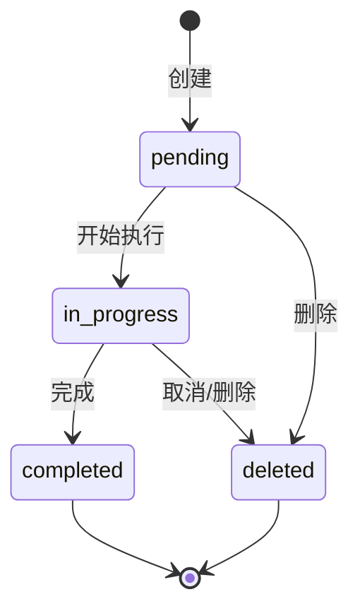
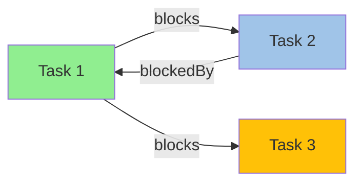

# Task System Design Specification

## 一、系统概述

### 1.1 系统定位

Task 系统是一个独立的项目任务管理系统，支持任务的创建、更新、查询和删除。系统采用文件系统持久化机制，提供完整的依赖关系建模，支持通过配置进行自定义存储路径配置。

### 1.2 设计目标

- 提供轻量级的任务管理功能
- 支持任务间的依赖关系建模
- 采用文件系统持久化，无需数据库依赖
- 提供原子性写入保证
- 支持可配置的存储路径
- 完全独立运行，不依赖第三方平台 API

### 1.3 系统特点

- **文件系统持久化**：每个任务作为独立的 JSON 文件存储
- **原子性写入**：通过临时文件 + 重命名机制保证原子性
- **文件锁机制**：防止并发写入冲突
- **依赖建模**：支持双向依赖关系（blocks/blockedBy）
- **元数据扩展**：支持任意的键值对元数据
- **配置灵活**：支持自定义存储路径配置
- **类型安全**：基于 Zod schema 的严格类型验证

### 1.4 适用场景

- 需要轻量级任务管理的开发项目
- 需要依赖关系管理的复杂任务系统
- 无法使用数据库的轻量应用
- 需要离线或独立运行的任务系统

---

## 二、核心数据模型

### 2.1 任务实体（Task）

```typescript
interface Task {
  // 唯一标识
  id: string;                    // 格式：T-{UUID}

  // 基本信息
  subject: string;                // 任务标题（必填）
  description: string;            // 任务描述（可选）
  activeForm: string;           // 进行中形式，如"运行测试中..."

  // 状态管理
  status: TaskStatus;            // pending/in_progress/completed/deleted

  // 依赖关系
  blocks: string[];              // 阻塞的任务 ID 列表
  blockedBy: string[];           // 被阻塞的任务 ID 列表

  // 可选属性
  owner: string;                 // 所有者（如代理名称）
  metadata: Record<string, unknown>; // 扩展元数据
  repoURL: string;               // 关联的仓库地址

  // 系统字段
  threadID: string;              // 会话 ID（用于上下文关联）
  createdAt?: number;             // 创建时间戳（存储层可选）
}
```

### 2.2 任务状态（TaskStatus）

```typescript
type TaskStatus = "pending" | "in_progress" | "completed" | "deleted";
```

**状态说明**：
- `pending`：任务已创建，等待执行
- `in_progress`：任务正在执行中
- `completed`：任务已完成
- `deleted`：任务已删除（终态）

---

## 三、存储设计

### 3.1 目录结构

```
tasks/                            # 任务存储根目录
├── T-{taskId}.json            # 单个任务文件
└── .lock                        # 并发控制文件锁
```

### 3.2 存储路径解析

存储路径解析优先级（从高到低）：

```typescript
function getTaskDir(config: Partial<Config>): string {
  // 1. 配置存储路径：config.sisyphus.tasks.storage_path
  // 2. 环境变量：ULTRAWORK_TASK_LIST_ID
  // 3. OpenCode 环境：~/.config/opencode/tasks/{listId}
  // 4. 当前工作目录：{cwd}/tasks/{basename}
}
```

### 3.3 文件命名规则

- 任务文件：`T-{UUID}.json`
- UUID 格式：标准 UUID v4 格式（36 字符）
- 文件锁：`.lock`

### 3.4 原子性写入（Atomic Write）

```typescript
function writeJsonAtomic(filePath: string, data: unknown): void {
  const tempPath = `${filePath}.tmp.${Date.now()}`;

  // 步骤 1：写入临时文件
  writeFileSync(tempPath, JSON.stringify(data, null, 2), "utf-8");

  // 步骤 2：原子性重命名
  renameSync(tempPath, filePath);
}
```

**原子性保证机制**：
1. 先写入临时文件（包含时间戳避免冲突）
2. 使用文件系统原子的 `rename` 操作
3. 失败时自动清理临时文件

---

## 四、文件锁机制

### 4.1 锁文件结构

```typescript
interface LockFile {
  id: string;        // 锁 ID（UUID）
  timestamp: number; // 锁创建时间戳
}
```

### 4.2 锁获取流程

```typescript
function acquireLock(dirPath: string): Lock {
  const lockPath = join(dirPath, ".lock");
  const lockId = randomUUID();
  const lockData = { id: lockId, timestamp: Date.now() };

  // 步骤 1：尝试创建锁文件
  try {
    writeFileSync(lockPath, JSON.stringify(lockData), { encoding: "utf-8", flag: "wx" });
    return { acquired: true, release };
  } catch (error) {
    // 步骤 2：检查是否已存在（EEXIST 错误）
    if (error.code === "EEXIST") {
      // 步骤 3：检查锁是否过期
      if (isLockStale()) {
        // 过期锁，清理后重试
        cleanupStaleLock();
        return acquireLock(dirPath); // 递归重试
      }
      return { acquired: false, release };
    }
    throw error;
  }
}
```

### 4.3 陈旧锁检测

```typescript
const STALE_LOCK_THRESHOLD_MS = 30000; // 30 秒

function isLockStale(): boolean {
  const lockContent = readFileSync(lockPath, "utf-8");
  const lockData = JSON.parse(lockContent);
  const lockAge = Date.now() - lockData.timestamp;

  return lockAge > STALE_LOCK_THRESHOLD_MS;
}

function cleanupStaleLock(): void {
  try {
    unlinkSync(lockPath);
  } catch (error) {
    // 忽略清理错误
  }
}
```

### 4.4 锁释放流程

```typescript
function releaseLock(lock: Lock): void {
  const lockPath = join(dirPath, ".lock");
  const lockContent = readFileSync(lockPath, "utf-8");

  try {
    const lockData = JSON.parse(lockContent);

    // 步骤 1：验证锁 ID 匹配
    if (lockData.id !== lock.id) {
      return; // 不是我们的锁，不释放
    }

    // 步骤 2：删除锁文件
    unlinkSync(lockPath);
  } catch (error) {
    // 忽略锁文件不存在错误
    if (error.code !== "ENOENT") {
      throw error;
    }
  }
}
```

---

## 五、CRUD 操作设计

### 5.1 创建任务（Create）

**核心逻辑**：

```typescript
async function handleCreate(args: Record<string, unknown>, config: Config): Promise<string> {
  // 步骤 1：参数验证
  const validatedArgs = TaskCreateInputSchema.parse(args);

  // 步骤 2：生成任务 ID
  const taskId = generateTaskId(); // T-{UUID}

  // 步骤 3：获取存储目录
  const taskDir = getTaskDir(config);

  // 步骤 4：获取文件锁
  const lock = acquireLock(taskDir);
  if (!lock.acquired) {
    return JSON.stringify({ error: "task_lock_unavailable" });
  }

  try {
    // 步骤 5：构建任务对象
    const task: Task = {
      id: taskId,
      subject: validatedArgs.subject,
      description: validatedArgs.description ?? "",
      status: "pending",
      blocks: validatedArgs.blocks ?? [],
      blockedBy: validatedArgs.blockedBy ?? [],
      activeForm: validatedArgs.activeForm,
      metadata: validatedArgs.metadata,
      repoURL: validatedArgs.repoURL,
      parentID: validatedArgs.parentID,
      threadID: context.sessionID,
    };

    // 步骤 6：验证任务对象
    const validatedTask = TaskObjectSchema.parse(task);

    // 步骤 7：原子性写入文件
    writeJsonAtomic(join(taskDir, `${taskId}.json`), validatedTask);

    // 步骤 8：释放文件锁
    lock.release();

    // 步骤 9：返回任务信息
    return JSON.stringify({
      task: {
        id: validatedTask.id,
        subject: validatedTask.subject,
      },
    });
  } catch (error) {
    lock.release();
    return JSON.stringify({ error: "internal_error" });
  }
}
```

**输入参数**（TaskCreateInput）：
- `subject`：任务标题（必填）
- `description`：任务描述（可选）
- `activeForm`：进行中形式（可选）
- `blocks`：阻塞的任务 ID 列表（可选）
- `blockedBy`：被阻塞的任务 ID 列表（可选）
- `owner`：所有者（可选）
- `metadata`：元数据（可选）
- `repoURL`：仓库地址（可选）
- `parentID`：父任务 ID（可选）

**输出结果**：
- 成功：`{ task: { id, subject } }`
- 失败：`{ error: string }`

**错误处理**：
- `validation_error`：参数验证失败，包含详细信息
- `invalid_task_id`：任务 ID 格式无效
- `task_lock_unavailable`：无法获取文件锁
- `task_not_found`：任务不存在（更新/删除时）
- `internal_error`：内部错误

---

### 5.2 查询任务（Get）

**核心逻辑**：

```typescript
async function handleGet(args: Record<string, unknown>, config: Config): Promise<string> {
  // 步骤 1：参数验证
  const validatedArgs = TaskGetInputSchema.parse(args);

  // 步骤 2：解析任务 ID
  const taskId = parseTaskId(validatedArgs.id);
  if (!taskId) {
    return JSON.stringify({ error: "invalid_task_id" });
  }

  // 步骤 3：读取任务文件
  const taskDir = getTaskDir(config);
  const taskPath = join(taskDir, `${taskId}.json`);

  const task = readJsonSafe(taskPath, TaskObjectSchema);
  if (!task) {
    return JSON.stringify({ error: "task_not_found" });
  }

  // 步骤 4：返回任务信息
  return JSON.stringify({ task });
}
```

**输入参数**（TaskGetInput）：
- `id`：任务 ID，格式：T-{UUID}（必填）

**输出结果**：
- 成功：`{ task: Task }`
- 失败：`{ error: string }`

---

### 5.3 列表查询（List）

**核心逻辑**：

```typescript
async function handleList(args: Record<string, unknown>, config: Config): Promise<string> {
  // 步骤 1：参数验证
  const validatedArgs = TaskListInputSchema.parse(args);

  // 步骤 2：获取存储目录
  const taskDir = getTaskDir(config);

  // 步骤 3：列出任务文件
  if (!existsSync(taskDir)) {
    return JSON.stringify({ tasks: [] });
  }

  const files = readdirSync(taskDir);
  const taskFiles = files
    .filter(f => f.endsWith(".json") && f.startsWith("T-"))
    .map(f => f.replace(".json", ""));

  if (taskFiles.length === 0) {
    return JSON.stringify({ tasks: [] });
  }

  // 步骤 4：读取所有任务
  const allTasks: Task[] = [];
  for (const fileId of taskFiles) {
    const task = readJsonSafe(join(taskDir, `${fileId}.json`), TaskObjectSchema);
    if (task) {
      allTasks.push(task);
    }
  }

  // 步骤 5：过滤任务（根据参数）
  let filteredTasks = allTasks;

  if (validatedArgs.status !== undefined) {
    filteredTasks = filteredTasks.filter(t => t.status === validatedArgs.status);
  }

  if (validatedArgs.parentID !== undefined) {
    filteredTasks = filteredTasks.filter(t => t.parentID === validatedArgs.parentID);
  }

  // 步骤 6：构建任务摘要
  const summaries = filteredTasks.map(task => {
    // 过滤 blockedBy，只包含未完成的阻塞项
    const unresolvedBlockers = task.blockedBy.filter(blockerId => {
      const blockerTask = allTasks.find(t => t.id === blockerId);
      // 阻塞项包含条件：阻塞者不存在，或者阻塞者未完成
      return !blockerTask || blockerTask.status !== "completed";
    });

    return {
      id: task.id,
      subject: task.subject,
      status: task.status,
      owner: task.owner,
      blockedBy: unresolvedBlockers,
    };
  });

  // 步骤 7：返回结果
  return JSON.stringify({
    tasks: summaries,
    reminder: "Maximize parallel execution by running independent tasks (tasks with empty blockedBy) concurrently."
  });
}
```

**输入参数**（TaskListInput）：
- `status`：状态过滤（可选）
- `parentID`：父任务 ID 过滤（可选）

**输出结果**：
- 成功：`{ tasks: TaskSummary[], reminder: string }`
  - `TaskSummary`：包含 id, subject, status, owner, blockedBy（过滤后的 blockedBy）
  - `reminder`：并行执行提示

---

### 5.4 更新任务（Update）

**核心逻辑**：

```typescript
async function handleUpdate(args: Record<string, unknown>, config: Config): Promise<string> {
  // 步骤 1：参数验证
  const validatedArgs = TaskUpdateInputSchema.parse(args);

  // 步骤 2：解析任务 ID
  const taskId = parseTaskId(validatedArgs.id);
  if (!taskId) {
    return JSON.stringify({ error: "invalid_task_id" });
  }

  // 步骤 3：获取存储目录和锁
  const taskDir = getTaskDir(config);
  const lock = acquireLock(taskDir);

  if (!lock.acquired) {
    return JSON.stringify({ error: "task_lock_unavailable" });
  }

  try {
    // 步骤 4：读取现有任务
    const taskPath = join(taskDir, `${taskId}.json`);
    const task = readJsonSafe(taskPath, TaskObjectSchema);

    if (!task) {
      return JSON.stringify({ error: "task_not_found" });
    }

    // 步骤 5：合并更新字段（只更新提供的字段）
    if (validatedArgs.subject !== undefined) {
      task.subject = validatedArgs.subject;
    }
    if (validatedArgs.description !== undefined) {
      task.description = validatedArgs.description;
    }
    if (validatedArgs.status !== undefined) {
      task.status = validatedArgs.status;
    }
    if (validatedArgs.activeForm !== undefined) {
      task.activeForm = validatedArgs.activeForm;
    }
    if (validatedArgs.owner !== undefined) {
      task.owner = validatedArgs.owner;
    }

    // 步骤 6：处理 blocks（累加）
    if (validatedArgs.addBlocks !== undefined) {
      task.blocks = [...new Set([...task.blocks, ...validatedArgs.addBlocks])];
    }

    // 步骤 7：处理 blockedBy（累加）
    if (validatedArgs.addBlockedBy !== undefined) {
      task.blockedBy = [...new Set([...task.blockedBy, ...validatedArgs.addBlockedBy])];
    }

    // 步骤 8：处理 metadata（合并）
    if (validatedArgs.metadata !== undefined) {
      task.metadata = { ...task.metadata, ...validatedArgs.metadata };

      // 删除设为 null 的键
      Object.keys(task.metadata).forEach(key => {
        if (task.metadata?.[key] === null) {
          delete task.metadata[key];
        }
      });
    }

    // 步骤 9：验证并写入
    const validatedTask = TaskObjectSchema.parse(task);
    writeJsonAtomic(taskPath, validatedTask);

    lock.release();

    return JSON.stringify({ task: validatedTask });
  } catch (error) {
    lock.release();
    if (error instanceof Error && error.message.includes("Required")) {
      return JSON.stringify({ error: "validation_error", message: error.message });
    }
    return JSON.stringify({ error: "internal_error" });
  }
}
```

**输入参数**（TaskUpdateInput）：
- `id`：任务 ID（必填）
- `subject`：新标题（可选）
- `description`：新描述（可选）
- `status`：新状态（可选）
- `activeForm`：新进行中形式（可选）
- `addBlocks`：新增阻塞任务 ID 列表（可选，累加）
- `addBlockedBy`：新增被阻塞任务 ID 列表（可选，累加）
- `owner`：新所有者（可选）
- `metadata`：新元数据（可选，合并）
- `repoURL`：新仓库地址（可选）
- `parentID`：新父任务 ID（可选）

**累加更新特性**：
- `addBlocks`：与现有 `blocks` 合并，不覆盖
- `addBlockedBy`：与现有 `blockedBy` 合并，不覆盖

---

### 5.5 删除任务（Delete）

**核心逻辑**：

```typescript
async function handleDelete(args: Record<string, unknown>, config: Config): Promise<string> {
  // 步骤 1：参数验证
  const validatedArgs = TaskDeleteInputSchema.parse(args);

  // 步骤 2：解析任务 ID
  const taskId = parseTaskId(validatedArgs.id);
  if (!taskId) {
    return JSON.stringify({ error: "invalid_task_id" });
  }

  // 步骤 3：获取存储目录和锁
  const taskDir = getTaskDir(config);
  const lock = acquireLock(taskDir);

  if (!lock.acquired) {
    return JSON.stringify({ error: "task_lock_unavailable" });
  }

  try {
    // 步骤 4：删除任务文件
    const taskPath = join(taskDir, `${taskId}.json`);

    if (!existsSync(taskPath)) {
      lock.release();
      return JSON.stringify({ error: "task_not_found" });
    }

    unlinkSync(taskPath);

    lock.release();

    return JSON.stringify({ success: true });
  } catch (error) {
    lock.release();
    return JSON.stringify({ error: "internal_error" });
  }
}
```

**输入参数**（TaskDeleteInput）：
- `id`：任务 ID（必填）

**输出结果**：
- 成功：`{ success: true }`
- 失败：`{ error: string }`

---

## 六、状态机设计

### 6.1 状态转换规则



### 6.2 状态转换表

| 当前状态 | 可转换到 | 转换条件 |
|---------|-----------|----------|
| pending | in_progress | 任务开始执行 |
| pending | deleted | 任务被删除 |
| in_progress | completed | 任务成功完成 |
| in_progress | deleted | 任务被取消/删除 |
| completed | 无 | 终态，不可转换 |
| deleted | 无 | 终态，不可转换 |

### 6.3 状态转换实现

**Pending → InProgress**：
- 通过 `task_update` 设置 `status = "in_progress"`

**InProgress → Completed**：
- 通过 `task_update` 设置 `status = "completed"`

**Pending → Deleted**：
- 通过 `task_delete` 直接删除文件（状态在文件系统中不再存在）

**InProgress → Deleted**：
- 通过 `task_update` 设置 `status = "deleted"` 或直接 `task_delete`

---

## 七、依赖管理设计

### 7.1 双向依赖模型

```typescript
interface DependencyModel {
  blocks: string[];      // 我阻塞的任务列表（阻塞输出）
  blockedBy: string[];   // 阻塞我的任务列表（被阻塞输入）
}
```

**依赖语义**：
- `blocks`：任务 A 阻塞任务 B → B 不能开始执行，直到 A 完成
- `blockedBy`：任务 B 被任务 A 阻塞 → A 完成后 B 才能开始

### 7.2 依赖添加规则

**在创建任务时**（addBlocks）：
```typescript
task.blocks = [...new Set([...task.blocks, ...addBlocks])];
```

**在更新任务时**（addBlocks）：
```typescript
task.blocks = [...new Set([...task.blocks, ...addBlocks])];
```

### 7.3 依赖添加规则

**在创建任务时**（addBlockedBy）：
```typescript
task.blockedBy = [...new Set([...task.blockedBy, ...addBlockedBy])];
```

**在更新任务时**（addBlockedBy）：
```typescript
task.blockedBy = [...new Set([...task.blockedBy, ...addBlockedBy])];
```

### 7.4 依赖查询过滤

**列表查询时的 blockedBy 过滤**：
```typescript
// 只包含未完成的阻塞项
const unresolvedBlockers = task.blockedBy.filter(blockerId => {
  const blockerTask = allTasks.find(t => t.id === blockerId);
  // 阻塞项包含条件：阻塞者不存在，或者阻塞者未完成
  return !blockerTask || blockerTask.status !== "completed";
});
```

**并行执行建议**：
- 如果 `blockedBy` 为空，任务可以立即并行执行
- 如果 `blockedBy` 不为空，需要等待所有依赖任务完成

---

## 八、配置设计

### 8.1 配置模型

```typescript
interface TaskConfig {
  storage_path?: string;              // 自定义存储路径
  task_list_id?: string;            // 任务列表 ID（环境变量）
}
```

### 8.2 存储路径解析优先级

1. **配置存储路径**（`config.sisyphus.tasks.storage_path`）
2. **环境变量**（`ULTRAWORK_TASK_LIST_ID`）
3. **OpenCode 环境**（`~/.config/opencode/tasks/{listId}`）
4. **当前工作目录**（`{cwd}/tasks/{basename}`）

---

## 九、错误处理设计

### 9.1 错误码表

| 错误码 | HTTP 状态 | 描述 | 处理建议 |
|---------|-----------|------|---------|
| `task_lock_unavailable` | 200 | 无法获取文件锁，系统繁忙 | 稍后重试 |
| `invalid_task_id` | 400 | 任务 ID 格式无效（必须为 T-{UUID}） | 检查 ID 格式 |
| `task_not_found` | 404 | 任务不存在 | 检查任务 ID |
| `validation_error` | 400 | 参数验证失败 | 检查参数格式 |
| `internal_error` | 500 | 内部错误 | 记录日志并重试 |

### 9.2 错误响应格式

**成功响应**：
```json
{
  "task": {
    "id": "T-abc123...",
    "subject": "任务标题",
    // ...其他字段
  }
}
```

**错误响应**：
```json
{
  "error": "error_code"
}
```

**验证错误详细信息**：
```json
{
  "error": "validation_error",
  "message": "详细错误信息"
}
```

---

## 十、Java 迁移指南

### 10.1 核心依赖映射

| TypeScript 模块 | Java 对应 |
|--------------|----------|
| `fs` | `java.nio.file.*` 或 `java.io.*` |
| `path` | `java.nio.file.Path` |
| `crypto.randomUUID` | `java.util.UUID.randomUUID()` |
| `zod` | 无需 Zod，Java 使用类型系统 |
| `JSON.parse/stringify` | `com.fasterxml.jackson.databind.ObjectMapper` |

### 10.2 核心类设计

```java
package com.nop.entropy.tasksystem;

import java.nio.file.*;
import java.util.*;
import java.util.concurrent.locks.*;
import java.util.UUID;
import java.io.IOException;
import com.fasterxml.jackson.databind.ObjectMapper;
import com.fasterxml.jackson.databind.JsonNode;

/**
 * 任务状态枚举
 */
public enum TaskStatus {
    PENDING,
    IN_PROGRESS,
    COMPLETED,
    DELETED
}

/**
 * 任务实体
 */
public class Task {
    private String id;
    private String subject;
    private String description;
    private String activeForm;
    private TaskStatus status;
    private List<String> blocks;
    private List<String> blockedBy;
    private String owner;
    private Map<String, Object> metadata;
    private String repoURL;
    private String threadID;

    // Getters and Setters
    // ...
}

/**
 * 任务存储服务
 */
public class TaskStorageService {
    private static final ObjectMapper objectMapper = new ObjectMapper();
    private static final long STALE_LOCK_THRESHOLD_MS = 30000; // 30 秒

    private final Path storageDir;

    public TaskStorageService(Path storageDir) {
        this.storageDir = storageDir;
        ensureDir();
    }

    /**
     * 创建任务
     */
    public Task createTask(CreateTaskInput input) {
        String taskId = generateTaskId();
        Path taskPath = storageDir.resolve(taskId + ".json");
        Task task = buildTask(input, taskId);

        // 使用文件锁确保原子性
        Lock lock = acquireLock(storageDir);
        try {
            writeJsonAtomic(taskPath, task);
            return task;
        } finally {
            lock.release();
        }
    }

    /**
     * 生成任务 ID
     */
    private static String generateTaskId() {
        return "T-" + UUID.randomUUID();
    }

    /**
     * 原子性写入文件
     */
    private void writeJsonAtomic(Path filePath, Task task) {
        Path tempPath = resolveTempPath(filePath);
        try {
            objectMapper.writeValue(tempPath.toFile(), task);
            Files.move(tempPath, filePath, StandardCopyOption.REPLACE_EXISTING);
        } catch (IOException e) {
            cleanupTempFile(tempPath);
            throw new TaskStorageException("Failed to write task atomically", e);
        }
    }

    /**
     * 获取文件锁
     */
    private FileLock acquireLock(Path dir) {
        Path lockPath = dir.resolve(".lock");
        String lockId = UUID.randomUUID();
        long timestamp = System.currentTimeMillis();

        while (true) {
            try {
                Files.write(lockPath, createLockData(lockId, timestamp),
                    StandardOpenOption.CREATE_NEW);
                return new FileLock(lockId, this::releaseLock);
            } catch (FileAlreadyExistsException e) {
                String existingLockData = readLockData(lockPath);
                long lockAge = System.currentTimeMillis() - getLockTimestamp(existingLockData);

                if (lockAge > STALE_LOCK_THRESHOLD_MS) {
                    // 陈旧锁，清理后重试
                    Files.delete(lockPath);
                    continue;
                }
                throw new TaskLockException("Lock is held by another process");
            }
        }
    }

    /**
     * 解析任务 ID
     */
    private static String parseTaskId(String id) {
        if (id == null || !id.matches("^T-[a-f0-9]{32}$")) {
            throw new IllegalArgumentException("Invalid task ID format: " + id);
        }
        return id;
    }

    /**
     * 验证任务状态转换
     */
    private void validateStatusTransition(TaskStatus oldStatus, TaskStatus newStatus) {
        if (!isValidTransition(oldStatus, newStatus)) {
            throw new IllegalStateException(
                String.format("Invalid status transition: %s -> %s", oldStatus, newStatus)
            );
        }
    }

    private static boolean isValidTransition(TaskStatus oldStatus, TaskStatus newStatus) {
        // PENDING can go to IN_PROGRESS, DELETED
        // IN_PROGRESS can go to COMPLETED, DELETED
        // COMPLETED and DELETED are terminal states
        Set<TaskStatus> validTransitions = Set.of(
            Map.entry(TaskStatus.PENDING, TaskStatus.IN_PROGRESS),
            Map.entry(TaskStatus.PENDING, TaskStatus.DELETED),
            Map.entry(TaskStatus.IN_PROGRESS, TaskStatus.COMPLETED),
            Map.entry(TaskStatus.IN_PROGRESS, TaskStatus.DELETED)
        );
        return validTransitions.contains(Map.entry(oldStatus, newStatus));
    }
}
```

### 10.3 关键实现点

#### 1. 并发控制

```java
public class ConcurrencyController {
    private final Map<String, List<Task>> runningTasks = new ConcurrentHashMap<>();
    private final Semaphore fileLockSemaphore = new Semaphore(1, true);

    public boolean acquireTaskSlot(String taskId) {
        // 检查依赖任务是否完成
        Task task = getTask(taskId);
        if (task.hasDependencies()) {
            return false;
        }

        runningTasks.put(taskId, task);
        return true;
    }
}
```

#### 2. JSON 序列化

```java
public class TaskSerializer {
    private final ObjectMapper objectMapper;

    public String serialize(Task task) {
        return objectMapper.writeValueAsString(task);
    }

    public Task deserialize(String json) {
        return objectMapper.readValue(json, Task.class);
    }
}
```

#### 3. 文件监听（可选高级特性）

```java
public class TaskWatcher {
    private final WatchService watchService;

    public void startWatching() {
        Path tasksDir = getStorageDir();
        watchService.watch(tasksDir, (event) -> {
            if (event.kind() == StandardWatchEventKinds.ENTRY_CREATE) {
                handleTaskCreated(event.context());
            } else if (event.kind() == StandardWatchEventKinds.ENTRY_MODIFY) {
                handleTaskModified(event.context());
            } else if (event.kind() == StandardWatchEventKinds.ENTRY_DELETE) {
                handleTaskDeleted(event.context());
            }
        });
    }
}
```

### 10.4 配置管理

```java
public class TaskConfig {
    private Path storagePath;
    private String taskListId;

    // 从配置文件加载
    public static TaskConfig load(Path configDir) {
        TaskConfig config = new TaskConfig();
        config.loadFromFile(configDir.resolve("task-config.json"));
        return config;
    }

    private void loadFromFile(Path configPath) {
        if (Files.exists(configPath)) {
            JsonNode node = objectMapper.readTree(configPath);
            this.storagePath = Optional.ofNullable(node.get("storage_path"))
                .map(JsonNode::asText)
                .map(Path::of)
                .orElse(null);
            this.taskListId = Optional.ofNullable(node.get("task_list_id"))
                .map(JsonNode::asText)
                .orElse(null);
        }
    }

    public Path getStorageDir() {
        return storagePath != null
            ? storagePath
            : Path.of(System.getProperty("user.home"))
              .resolve(".tasks");
    }
}
```

---

## 十一、测试指南

### 11.1 单元测试示例

```java
@Test
public class TaskStorageServiceTest {

    @Test
    public void testCreateTask() {
        TaskStorageService service = new TaskStorageService(testDir);
        CreateTaskInput input = new CreateTaskInput("Test task");

        Task task = service.createTask(input);

        assertNotNull(task.getId());
        assertEquals("Test task", task.getSubject());
        assertEquals(TaskStatus.PENDING, task.getStatus());
    }

    @Test
    public void testTaskStatusTransition() {
        Task task = new Task();
        task.setStatus(TaskStatus.PENDING);
        task.setStatus(TaskStatus.IN_PROGRESS);

        // 应该成功转换
        assertEquals(TaskStatus.IN_PROGRESS, task.getStatus());

        // 阻止无效转换
        assertThrows(IllegalStateException.class, () -> {
            task.setStatus(TaskStatus.IN_PROGRESS);
            task.setStatus(TaskStatus.PENDING); // 终态 → 非终态
        });
    }

    @Test
    public void testDependencyManagement() {
        TaskStorageService service = new TaskStorageService(testDir);

        Task task1 = service.createTask(new CreateTaskInput("Task 1"));
        Task task2 = service.createTask(new CreateTaskInput("Task 2"));

        // 设置依赖关系
        task1.setBlocks(List.of(task2.getId()));
        task2.setBlockedBy(List.of(task1.getId()));

        service.updateTask(buildUpdate(task1));
        service.updateTask(buildUpdate(task2));

        // 验证依赖关系
        Task updatedTask1 = service.getTask(task1.getId());
        Task updatedTask2 = service.getTask(task2.getId());

        assertTrue(updatedTask1.getBlocks().contains(task2.getId()));
        assertTrue(updatedTask2.getBlockedBy().contains(task1.getId()));
    }

    @Test
    public void testAtomicWrite() {
        TaskStorageService service = new TaskStorageService(testDir);
        CreateTaskInput input = new CreateTaskInput("Atomic test");

        Task task = service.createTask(input);

        // 并发创建相同 ID 应该只有一个成功
        CountDownLatch latch = new CountDownLatch(1);
        AtomicBoolean firstCreated = new AtomicBoolean(true);

        Runnable task1 = () -> {
            try {
                service.createTask(input);
                if (firstCreated.compareAndSet(true, false)) {
                    latch.countDown();
                }
            } catch (Exception e) {
                // 第二个线程创建失败
            }
        };

        Thread thread1 = new Thread(task1);
        Thread thread2 = new Thread(task1);

        thread1.start();
        thread2.start();

        latch.await(5, TimeUnit.SECONDS);

        Task finalTask = service.getTask(task.getId());
        assertNotNull(finalTask);
        // 验证只有一个文件存在
        assertTrue(Files.exists(finalTask.getFilePath()));
    }
}
```

### 11.2 集成测试示例

```java
@Test
public class TaskSystemIntegrationTest {

    @Test
    public void testCompleteTaskLifecycle() {
        TaskStorageService service = new TaskStorageService(realStorageDir);

        // 创建任务
        CreateTaskInput createInput = new CreateTaskInput("Integration test");
        Task task = service.createTask(createInput);
        assertEquals(TaskStatus.PENDING, task.getStatus());

        // 更新为进行中
        UpdateTaskInput updateInput = new UpdateTaskInput(
            task.getId(),
            TaskStatus.IN_PROGRESS
        );
        service.updateTask(updateInput);

        Task updatedTask = service.getTask(task.getId());
        assertEquals(TaskStatus.IN_PROGRESS, updatedTask.getStatus());

        // 完成任务
        UpdateTaskInput completeInput = new UpdateTaskInput(
            task.getId(),
            TaskStatus.COMPLETED
        );
        service.updateTask(completeInput);

        Task finalTask = service.getTask(task.getId());
        assertEquals(TaskStatus.COMPLETED, finalTask.getStatus());
    }
}
```

---

## 十二、部署与运维

### 12.1 目录结构

```
task-system/
├── src/main/java/com/nop/entropy/tasksystem/
│   ├── entity/           # 实体类
│   ├── storage/          # 存储服务
│   ├── lock/             # 文件锁实现
│   ├── config/           # 配置管理
│   ├── api/              # REST API 接口
│   └── Main.java         # 应用入口
├── pom.xml              # Maven 配置
└── README.md            # 本文档
```

### 12.2 配置文件

```yaml
# application.yml
task:
  storage:
    path: ${user.home}/.tasks  # 默认存储路径
  lock:
    timeout: 30000              # 锁超时时间（毫秒）
    cleanup:
      interval: 3600000         # 清理间隔（1小时）
  concurrency:
    max-running-tasks: 10     # 最大并发任务数
```

### 12.3 监控指标

**关键指标**：
1. **文件锁等待时间**：获取锁的平均等待时间
2. **任务创建延迟**：从请求到文件写入的延迟
3. **任务完成时间**：从 pending 到 completed 的平均时间
4. **并发任务数**：当前正在执行的任务数量
5. **存储使用量**：任务文件总大小和数量

**日志记录**：
```java
import org.slf4j.Logger;
import org.slf4j.LoggerFactory;

public class TaskMetrics {
    private static final Logger logger = LoggerFactory.getLogger(TaskMetrics.class);

    public static void recordTaskCreated(String taskId, long duration) {
        logger.info("Task created: id={}, duration={}ms", taskId, duration);
    }

    public static void recordLockWaitTime(String taskId, long waitTime) {
        if (waitTime > 1000) {  // 超过 1 秒记录警告
            logger.warn("Lock wait time: id={} wait={}ms", taskId, waitTime);
        }
    }
}
```

---

## 十三、迁移步骤清单

### 13.1 第一阶段：基础实现

- [ ] 创建 Java 项目结构（Maven）
- [ ] 实现核心实体类（Task, TaskStatus）
- [ ] 实现存储服务（TaskStorageService）
- [ ] 实现 JSON 序列化/反序列化
- [ ] 实现文件锁机制
- [ ] 编写单元测试
- [ ] 通过所有单元测试

### 13.2 第二阶段：CRUD 操作

- [ ] 实现 createTask 方法
- [ ] 实现 getTask 方法
- [ ] 实现 updateTask 方法
- [ ] 实现 deleteTask 方法
- [ ] 实现 listTasks 方法
- [ ] 验证状态转换逻辑
- [ ] 验证依赖关系管理

### 13.3 第三阶段：API 集成

- [ ] 设计 REST API 接口
- [ ] 实现 REST 控制器
- [ ] 添加请求验证
- [ ] 实现统一错误处理
- [ ] 编写 API 文档

### 13.4 第四阶段：高级特性（可选）

- [ ] 实现任务监听器
- [ ] 实现任务统计
- [ ] 实现批量操作
- [ ] 实现任务搜索功能

### 13.5 第五阶段：测试与部署

- [ ] 编写集成测试
- [ ] 性能测试（并发、大量任务）
- [ ] 压力测试
- [ ] 部署到测试环境
- [ ] 生产环境部署

---

## 附录 A：依赖管理详细说明

### A.1 依赖关系图例



### A.2 依赖算法

**检查任务是否可以开始执行**：
```java
public boolean canStart(Task task, Map<String, Task> allTasks) {
    // 检查 blocks：所有阻塞的任务必须完成
    for (String blockedId : task.getBlocks()) {
        Task blockedTask = allTasks.get(blockedId);
        if (blockedTask == null || blockedTask.getStatus() != TaskStatus.COMPLETED) {
            return false;
        }
    }

    // 检查 blockedBy：所有阻塞我的任务必须完成
    for (String blockerId : task.getBlockedBy()) {
        Task blockerTask = allTasks.get(blockerId);
        if (blockerTask == null || blockerTask.getStatus() != TaskStatus.COMPLETED) {
            return false;
        }
    }

    return true;
}
```

**并行执行优化**：
- 优先执行 `blockedBy` 为空的任务
- 按依赖关系拓扑排序（拓扑排序）
- 识别可以并行执行的任务组

---

## 附录 B：API 接口规范

### B.1 REST API 端点

#### POST /tasks

创建新任务

**请求体**：
```json
{
  "subject": "任务标题",
  "description": "任务描述",
  "activeForm": "进行中形式",
  "blocks": ["T-xxx"],
  "blockedBy": ["T-yyy"],
  "owner": "agent-name",
  "metadata": {
    "priority": "high"
  },
  "repoURL": "https://github.com/...",
  "parentID": "T-zzz"
}
```

**响应**：
```json
{
  "id": "T-{UUID}",
  "subject": "任务标题",
  "status": "pending",
  "createdAt": "2026-02-10T12:00:00Z"
}
```

#### GET /tasks/{taskId}

获取单个任务

**响应**：
```json
{
  "id": "T-{UUID}",
  "subject": "任务标题",
  "description": "任务描述",
  "status": "in_progress",
  "blocks": ["T-xxx"],
  "blockedBy": ["T-yyy"],
  "owner": "agent-name",
  "metadata": {...},
  "repoURL": "https://...",
  "parentID": "T-zzz",
  "threadID": "session-id",
  "createdAt": "2026-02-10T12:00:00Z"
}
```

#### PUT /tasks/{taskId}

更新任务

**请求体**：
```json
{
  "subject": "新标题",
  "description": "新描述",
  "status": "in_progress",
  "activeForm": "新进行中形式",
  "addBlocks": ["T-new-block"],
  "addBlockedBy": ["T-new-blocker"],
  "owner": "new-agent",
  "metadata": {"key": "value"},
  "repoURL": "https://...",
  "parentID": "T-new-parent"
}
```

**响应**：
```json
{
  "id": "T-{UUID}",
  "subject": "新标题",
  "status": "in_progress",
  // ...其他字段
}
```

#### DELETE /tasks/{taskId}

删除任务

**响应**：
```json
{
  "success": true
}
```

#### GET /tasks

查询任务列表

**查询参数**：
- `status`：状态过滤（可选）
- `parentID`：父任务 ID 过滤（可选）
- `page`：页码（可选）
- `pageSize`：每页大小（可选）

**响应**：
```json
{
  "tasks": [
    {
      "id": "T-{UUID}",
      "subject": "任务标题",
      "status": "pending",
      "owner": "agent-name",
      "blockedBy": ["T-xxx"]
    }
  ],
  "pagination": {
    "page": 1,
    "pageSize": 20,
    "total": 100
  },
  "reminder": "Maximize parallel execution by running independent tasks concurrently."
}
```

---

## 附录 C：错误处理完整规范

### C.1 错误响应格式

**标准错误响应**：
```json
{
  "error": "error_code",
  "message": "详细错误信息",
  "details": {
    "field": "subject",
    "constraint": "不能为空"
  }
}
```

### C.2 HTTP 状态码使用

| 场景 | HTTP 状态 | 错误码 | 说明 |
|------|-----------|---------|------|
| 参数验证失败 | 400 | validation_error | 请求参数不符合要求 |
| 任务不存在 | 404 | task_not_found | 指定的任务不存在 |
| 文件锁冲突 | 409 | task_lock_unavailable | 另一个进程正在操作 |
| 内部错误 | 500 | internal_error | 服务器内部错误 |
| 服务不可用 | 503 | service_unavailable | 服务暂时不可用 |

---

**文档结束**
