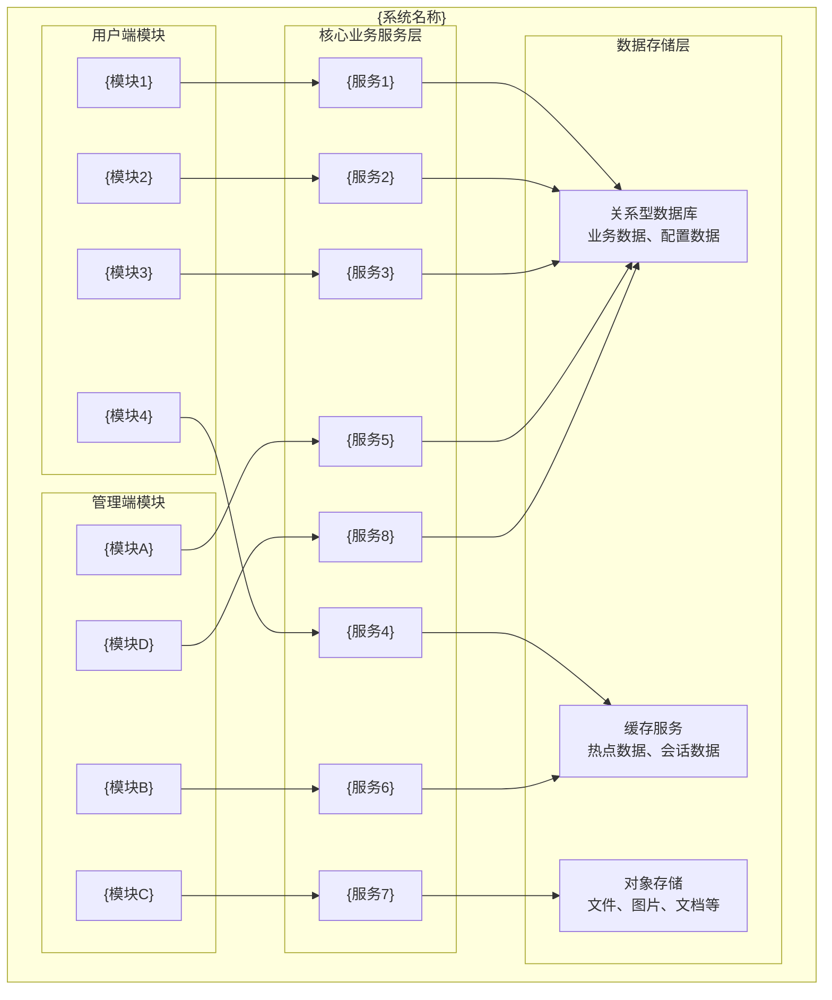
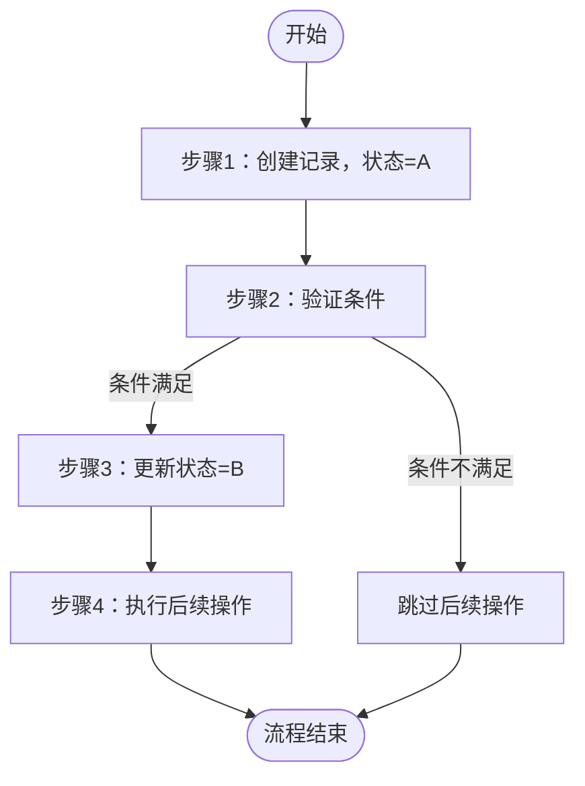
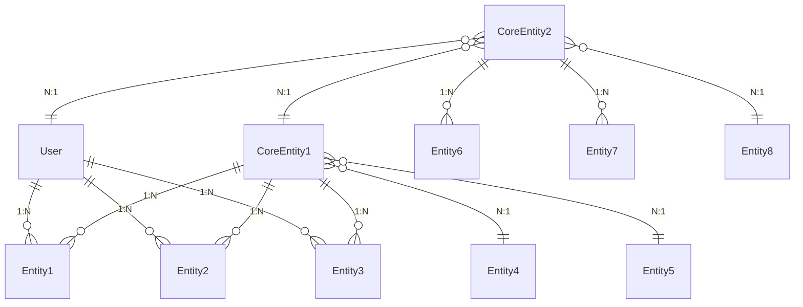

# {系统名称}业务需求规格说明书

## 文档信息

| 项目信息 | 内容 |
|---------|------|
| 项目名称 | {系统名称} |
| 版本 | {版本号} |
| 文档创建日期 | {日期} |
| 文档性质 | 业务需求规格说明书 |

---

## 一、系统概述

### 1.1 系统定位

{简要描述系统的核心定位和主要用途，例如：本系统是一个完整的业务管理平台，支持多端访问（Web端、移动端、管理后台），提供从数据录入、业务处理、流程审批到数据统计的完整业务闭环。}

### 1.2 系统目标

{列出系统的主要目标，例如：}
- 为用户提供便捷的{核心功能1}体验
- 为管理员提供高效的{核心功能2}能力
- 支持{业务场景1}、{业务场景2}等多种业务模式
- 提供完善的数据统计和分析能力
- 确保数据安全和系统稳定性

### 1.3 系统特点

{描述系统的主要特点，例如：}
- 多端统一后台服务
- 灵活的权限管理体系
- 完整的业务流程管理
- 可配置的业务规则
- 高可扩展的架构设计

### 1.4 适用场景

{描述系统适用的业务场景，例如：}
- {场景1}
- {场景2}
- {场景3}

---

## 二、业务模块划分

### 2.1 模块架构图



### 2.2 模块列表

| 模块名称 | 模块类型 | 主要职责 |
|---------|---------|---------|
| {模块1} | 用户端/管理端/双端 | {主要职责描述} |
| {模块2} | 用户端/管理端/双端 | {主要职责描述} |
| {模块3} | 用户端/管理端/双端 | {主要职责描述} |
| {模块4} | 用户端/管理端/双端 | {主要职责描述} |
| {模块5} | 用户端/管理端/双端 | {主要职责描述} |

---

## 三、数据模型定义

### 3.1 核心实体说明

#### 3.1.1 用户相关实体

**用户（User）**
```
核心属性：
- 用户唯一标识
- 用户名/账号
- 密码（加密存储）
- 昵称/显示名称
- 手机号
- 邮箱
- 性别
- 头像URL
- 用户状态（正常/禁用/注销）
- 最后登录时间
- 最后登录IP
- 其他业务属性...
```

**角色（Role）**
```
核心属性：
- 角色唯一标识
- 角色名称
- 角色描述
- 状态（启用/禁用）
- 其他业务属性...
```

#### 3.1.2 核心业务实体

**{核心实体1}（如：订单/申请单/工单）**
```
核心属性：
- 实体唯一标识
- 业务编号（流水号）
- 关联用户ID
- 实体状态
- 业务字段1
- 业务字段2
- 业务字段3
- 创建时间
- 更新时间
- 其他业务属性...
```

#### 3.1.3 其他核心实体

**{实体4}**
**{实体5}**
**{实体6}**
**{实体7}**

---

## 四、业务功能详述

### 4.1 {模块1名称}

#### 4.1.1 {子模块1}

**功能1名称**
- **业务规则**：
  - 规则1（详细描述，例如：验证用户权限、检查数据有效性等）
  - 规则2（数值要求，如：最多N个、必须在X天内、不能为负等）
  - 规则3（状态约束，如：只能在特定状态下执行）
- **输入参数**：
  - 参数名1：参数说明（类型、是否必填、取值范围）
  - 参数名2：参数说明
- **输出结果**：
  - 结果1：说明
  - 结果2：说明
- **异常处理**：
  - 异常情况1：错误原因、错误提示
  - 异常情况2：错误原因、错误提示
- **权限要求**：
  - 需要登录用户 / 管理员权限 / 指定角色 / 无需权限
- **事务要求**（如涉及）：
  - 需要在同一事务中完成的操作列表（例如：创建记录、扣减库存、更新状态等）
---

## 五、核心业务流程

### 5.1 核心流程1

**流程名称**：{如：状态流转流程}

**流程描述**：{描述流程的目的和适用场景}

**流程图**：


**详细说明**：
1. **步骤1**：{详细说明}
2. **步骤2**：{详细说明}
3. **步骤3**：{详细说明}
4. **步骤4**：{详细说明}

---

## 六、数据关系说明

### 6.1 核心实体关系图



**实体关系说明**：
- 用户 → {关联实体1}(1:N)、{关联实体2}(1:N)、{关联实体3}(1:N)
- {核心实体1} → {关联实体1}(1:N)、{关联实体2}(1:N)、{关联实体3}(1:N)
- {核心实体1} → {关联实体4}(N:1)、{关联实体5}(N:1)
- {核心实体2} → {关联实体6}(1:N)、{关联实体7}(1:N)
- {核心实体2} → {核心实体1}(N:1)、{关联实体8}(N:1)、用户(N:1)

### 6.2 数据一致性规则

#### 6.2.1 {场景1}数据一致性

**业务场景**：{描述业务场景，如：创建订单、提交申请等}

**一致性要求**：
- 操作1：{说明，如：扣减库存，库存不能为负数}
- 操作2：{说明，如：标记优惠券为已使用状态}
- 操作3：{说明，如：创建记录}
- 操作4：{说明，如：清理临时数据}
- 以上操作必须在同一事务中完成
---

## 七、业务规则约束

### 7.1 {规则类别1}

- 规则1：{详细说明}
- 规则2：{详细说明，包括数值限制、时间限制等}
- 规则3：{详细说明}

---

## 八、状态机定义

### 8.1 {实体1}状态定义

| 状态码 | 状态名称 | 说明 | 可执行操作 |
|--------|---------|------|-----------|
| 0 | {状态1} | {状态说明} | {操作1}、{操作2} |
| 1 | {状态2} | {状态说明} | {操作3}、{操作4} |
| 2 | {状态3} | {状态说明} | {操作5} |
| 3 | {状态4} | {状态说明} | {操作6} |

**状态转换规则**：
- 状态0 → 状态1：{转换条件}
- 状态1 → 状态2：{转换条件}
- 状态1 → 状态3：{转换条件}
- 状态2 → 状态3：{转换条件}

---

## 九、非功能需求

### 9.1 性能需求

- 首页加载时间：不超过{N}秒
- 核心操作响应时间：不超过{N}秒
- 搜索响应时间：不超过{N}秒
- 列表翻页时间：不超过{N}秒
- 支持至少{N}个并发用户
- 核心表建立合适索引、慢查询优化、分页查询使用高效方式

### 9.2 安全需求

- 用户登录支持多种方式（账号密码、第三方授权等）
- 登录凭证有过期时间
- 敏感操作需要重新登录或二次验证
- 用户密码加密存储
- 敏感信息加密传输
- SQL注入防护、XSS攻击防护、CSRF防护
- 接口权限控制（基于角色、基于资源）
- 操作日志记录（关键操作审计）
- 数据备份和恢复机制

### 9.3 可用性需求

- 系统可用性达到{99.X%}以上
- 支持灰度发布和回滚
- 有监控和报警机制
- 定期备份数据库
- 支持数据恢复
- 异常处理和降级机制

### 9.4 兼容性需求

- 支持主流浏览器（Chrome、Safari、Firefox、Edge）
- 支持移动端浏览器
- 支持iOS、Android设备
- 响应式设计适配不同屏幕
- 支持第三方服务集成（支付、存储、短信等）

### 9.5 可维护性需求

- 记录关键业务操作日志
- 记录异常和错误日志
- 日志包含足够的上下文信息（用户ID、操作时间、IP等）
- 监控系统健康状态
- 监控关键业务指标
- 异常情况及时告警

---

## 十、对外服务接口说明

### 10.1 {服务1}接口

**接口功能**：{描述接口的主要功能和适用场景}

**输入参数**：
- 参数名1：参数说明（类型、是否必填、取值范围）
- 参数名2：参数说明

**输出结果**：
- 结果1：说明
- 结果2：说明

**使用场景**：{描述接口的使用场景}

**权限要求**：需要登录用户 / 管理员权限 / 指定角色 / 无需权限

---

## 十一、附录

### 11.1 术语表

| 术语 | 说明 |
|------|------|
| {术语1} | {术语说明} |
| {术语2} | {术语说明} |
| {术语3} | {术语说明} |
| {术语4} | {术语说明} |
| {术语5} | {术语说明} |

### 11.2 状态码说明

#### {实体1}状态说明

| 状态码 | 状态名称 | 说明 |
|--------|---------|------|
| 0 | {状态1} | {状态说明} |
| 1 | {状态2} | {状态说明} |
| 2 | {状态3} | {状态说明} |
| 3 | {状态4} | {状态说明} |

#### {实体2}状态说明

| 状态码 | 状态名称 | 说明 |
|--------|---------|------|
| 0 | {状态1} | {状态说明} |
| 1 | {状态2} | {状态说明} |
| 2 | {状态3} | {状态说明} |

### 11.3 错误码说明

| 错误码 | 错误信息 | 说明 | 解决方案 |
|--------|---------|------|---------|
| {错误码1} | {错误信息} | {错误说明} | {解决方案} |
| {错误码2} | {错误信息} | {错误说明} | {解决方案} |
| {错误码3} | {错误信息} | {错误说明} | {解决方案} |

### 11.4 业务规则配置

| 配置项名称 | 默认值 | 说明 | 是否可配置 |
|-----------|--------|------|-----------|
| {配置项1} | {默认值} | {配置说明} | 是/否 |
| {配置项2} | {默认值} | {配置说明} | 是/否 |
| {配置项3} | {默认值} | {配置说明} | 是/否 |

---

**文档结束**
