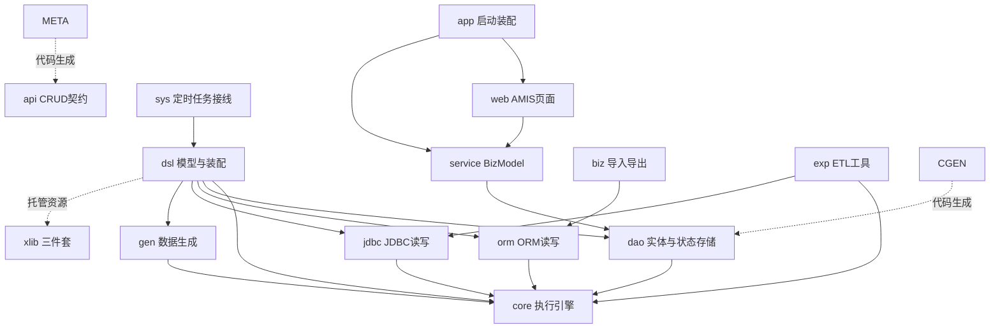
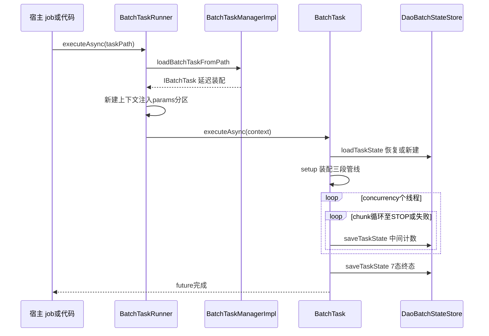

# 架构与数据流

nop-batch 分成 15 个 Maven 子模块（`nop-batch/pom.xml:19-35`），除 api 契约与两个构建期模块外全部收敛到无兄弟依赖的 nop-batch-core。本页给出分层全景、批任务从定义到 7 态终态的数据流与状态存储位置。入门见 [quickstart](./quickstart.md)、[overview](./overview.md)，阅读顺序见 [reading-guide](./reading-guide.md)。

> 本页源文件基准（相对于 `deepwiki/nop-batch/`，两级回溯到仓库根，已逐条验证可达；与同目录 [glossary.md](./glossary.md) 基准一致）：
>
> - [../../nop-batch/pom.xml](../../nop-batch/pom.xml)
> - [../../nop-batch/nop-batch-core/src/main/java/io/nop/batch/core/BatchTaskBuilder.java](../../nop-batch/nop-batch-core/src/main/java/io/nop/batch/core/BatchTaskBuilder.java)
> - [../../nop-batch/nop-batch-core/src/main/java/io/nop/batch/core/impl/BatchTask.java](../../nop-batch/nop-batch-core/src/main/java/io/nop/batch/core/impl/BatchTask.java)
> - [../../nop-batch/nop-batch-dsl/src/main/java/io/nop/batch/dsl/manager/BatchTaskManagerImpl.java](../../nop-batch/nop-batch-dsl/src/main/java/io/nop/batch/dsl/manager/BatchTaskManagerImpl.java)
> - [../../nop-batch/nop-batch-dsl/src/main/java/io/nop/batch/dsl/runner/BatchTaskRunner.java](../../nop-batch/nop-batch-dsl/src/main/java/io/nop/batch/dsl/runner/BatchTaskRunner.java)
> - [../../nop-batch/nop-batch-dao/src/main/resources/_vfs/nop/batch/beans/app-batch-dao.beans.xml](../../nop-batch/nop-batch-dao/src/main/resources/_vfs/nop/batch/beans/app-batch-dao.beans.xml)
> - [../../nop-batch/nop-batch-api/src/main/java/io/nop/batch/api/crud/NopBatchTaskApi.java](../../nop-batch/nop-batch-api/src/main/java/io/nop/batch/api/crud/NopBatchTaskApi.java)
> - [../../nop-batch/nop-batch-sys/src/main/resources/_vfs/nop/job/conf/sys-event-batch-consumer.job.yaml](../../nop-batch/nop-batch-sys/src/main/resources/_vfs/nop/job/conf/sys-event-batch-consumer.job.yaml)

## 分层：15 个子模块与依赖方向

聚合 pom 声明 15 个 module（`nop-batch/pom.xml:19-35`）；目录下的 `model/`（`nop-batch.orm.xml` 源模型）与 `deploy/`（建表 SQL）不参与 Maven 聚合。四个存储适配模块（orm/jdbc/dao/gen）只依赖 core 与平台侧存储设施，互不横向依赖；dsl 是唯一同时触达全部适配模块的装配层。XLang xlib 三件套（batch.xlib / batch-record.xlib / batch-gen.xlib）不是独立模块，而是 nop-batch-dsl 的 `_vfs/nop/batch/xlib/` 资源，经任务流扩展库 `batch-common.task.xml` 挂进 XLang 编译管线（见 [DSL 模型](./modules/batch-dsl.md)）。

| 子模块 | 职责（一句话） | 依赖方向（→ 指向被依赖者） |
|---|---|---|
| nop-batch-api | `@BizModel` CRUD 契约与 Input/Output Bean，全部为 `__XGEN_FORCE_OVERRIDE__` 生成物（`NopBatchTaskApi.java:1-13`） | 仅 nop-api-core |
| nop-batch-core | 执行引擎：BatchTaskBuilder/BatchTask/上下文/三段 Provider/装饰器族 | nop-xlang，不依赖其他 batch 模块 |
| nop-batch-dsl | 模型入口 BatchTaskManagerImpl、ModelBasedBatchTaskBuilderFactory、xlib 三件套、BatchTaskRunner | core + orm + jdbc + dao + gen |
| nop-batch-dao | 4 个实体 + DaoBatchStateStore/DaoBatchRecordHistoryStore（`app-batch-dao.beans.xml:9-11` 注册） | core + nop-orm |
| nop-batch-orm | OrmQueryBatchLoaderProvider/OrmBatchConsumerProvider 等 ORM 读写 | core + nop-orm |
| nop-batch-jdbc | JdbcPageBatchLoaderProvider、insert/update consumer、JdbcKeyDuplicateFilter | core + nop-dao + nop-orm |
| nop-batch-gen | BatchGenLoaderProvider 测试数据生成 loader | core |
| nop-batch-exp | ExportDbTool/ImportDbTool 库表 ETL，直接 `new BatchTaskContextImpl` + `builder.buildTask()`（`ExportDbTool.java:289-296`） | core + jdbc |
| nop-batch-biz | 业务实体导入导出：BizExportTaskBuilder 直接构造 `BatchTaskBuilder`（`BizExportTaskBuilder.java:43-46`）、GraphQLFetchResultBatchLoader | nop-biz + orm |
| nop-batch-service | NopBatchTaskBizModel 等 5 个 CrudBizModel + `_service.beans.xml` 注册（`NopBatchTaskBizModel.java:17`，无自定义生命周期 action） | dao + meta + nop-biz |
| nop-batch-web | NopBatchTask/NopBatchFile/NopBatchRecordResult 的 AMIS 页面与 action-auth，无 Java 源码 | service |
| nop-batch-app | NopBatchApplication 启动器，聚合 service/web/auth | service + web + starters |
| nop-batch-sys | sys-event-batch-consumer 定时任务接线，无 Java 源码 | dsl + nop-sys-dao + nop-job-core |
| nop-batch-meta | 构建期：`gen-crud-api.xgen` 生成 nop-batch-api 源码（`gen-crud-api.xgen:4-6`）、task-status 字典 | codegen + dao |
| nop-batch-codegen | 构建期：`gen-orm.xgen` 从 `model/nop-batch.orm.xml` 生成 dao 实体（`gen-orm.xgen:4-5`） | nop-orm |

> Sources: [nop-batch/pom.xml:19-35](/nop-batch/pom.xml#L19-L35)、[nop-batch/nop-batch-dsl/src/main/resources/_vfs/nop/batch/beans/batch-dsl.beans.xml:4-11](/nop-batch/nop-batch-dsl/src/main/resources/_vfs/nop/batch/beans/batch-dsl.beans.xml#L4-L11)、[nop-batch/nop-batch-exp/src/main/java/io/nop/batch/exp/ExportDbTool.java:289-296](/nop-batch/nop-batch-exp/src/main/java/io/nop/batch/exp/ExportDbTool.java#L289-L296)、[nop-batch/nop-batch-biz/src/main/java/io/nop/batch/biz/importexport/BizExportTaskBuilder.java:43-46](/nop-batch/nop-batch-biz/src/main/java/io/nop/batch/biz/importexport/BizExportTaskBuilder.java#L43-L46)

## 一次批任务：从定义到终态

任务定义有三种等价形态：`/nop/batch-task/{name}.{version}.batch-task.xml` 路径、XNode 节点（宏标签编译期传入）、显式任意路径。三者都汇聚到 `BatchTaskManagerImpl` 的同一条装配语句——构造 `ModelBasedBatchTaskBuilderFactory` 后 `newTaskBuilder(beanProvider).buildTask()`（`BatchTaskManagerImpl.java:90-118`）。宿主侧最常用的入口是 `BatchTaskRunner`：新建 `BatchTaskContextImpl`、注入 params、可选经 job 侧 `PartitionResolver` 写入分区区间，然后 `task.executeAsync(context)`（`BatchTaskRunner.java:36-49`）；nop-batch-sys 的定时任务正是经 job 配置调用 `nopBatchTaskRunner.executeAsync` 并传固定 taskPath（`sys-event-batch-consumer.job.yaml:8-11`）。service 层的 `NopBatchTaskBizModel` 只继承 `CrudBizModel`，不提供 start/cancel 动作（`NopBatchTaskBizModel.java:17`）——任务的生命周期由宿主代码（job、任务流、biz 工具）驱动，取消同样来自持有上下文的外部调用。

执行期分两步走。第一步恢复：`executeAsync` 里有 stateStore 时先 `loadTaskState` 按 `(taskName, taskKey)` 定位上次执行行、回放计数并置 recoverMode（`BatchTask.java:106-108`；恢复闸门见 [断点续跑与记录](./flows/checkpoint-recovery.md)）。第二步装配：`buildTask()` 并不组装管线，只把 `this::buildLoader`/`this::buildChunkProcessor` 两个方法引用交给 BatchTask（`BatchTaskBuilder.java:326-330`），真正 setup 发生在 `executeAsync` 内 `loaderProvider.setup(context)` 与 `chunkProcessorProvider.setup(loader, context)`（`BatchTask.java:123-124`）——此时上下文已就绪，各 Provider 按本次执行生成专用实例。随后启动 `concurrency` 个 chunk 循环线程（`BatchTask.java:206-243`）：每轮检查取消、跑一个 Loader→Processor→Consumer chunk、`incCount` 汇总计数、`stateStore.saveTaskState` 落中间状态。任一线程失败先完成自己的 future 再取消兄弟线程（fail-fast），这个顺序保证任务终态记录的是原始失败而非连带取消；loader 返回空集合是唯一正常终止信号。除 dsl 入口外还有两类宿主绕过 XML 直接编程装配：nop-batch-exp 的 ETL 工具与 nop-batch-biz 的实体导出（见上表），它们复用同一个 core 引擎。

终态判定收敛在 `DaoBatchStateStore.getTaskStatus`：按异常是否 `BatchCancelException` 与 cancelReason 三分取消（suspend→SUSPENDED(20)、skip→CANCELLED(50)、其余→KILLED(60)），非取消异常→FAILED(40)，无异常→COMPLETED(30)（`DaoBatchStateStore.java:180-197`；7 态定义与四道重入闸见 [断点续跑与记录](./flows/checkpoint-recovery.md)，取消链 4 个抛出点与 4 个透传点见 [错误模型](./topics/error-model.md)）。task-status 字典 `nop-batch-meta/src/main/resources/_vfs/dict/batch/task-status.dict.yaml` 与该状态机同源。

> Sources: [nop-batch/nop-batch-dsl/src/main/java/io/nop/batch/dsl/manager/BatchTaskManagerImpl.java:90-118](/nop-batch/nop-batch-dsl/src/main/java/io/nop/batch/dsl/manager/BatchTaskManagerImpl.java#L90-L118)、[nop-batch/nop-batch-dsl/src/main/java/io/nop/batch/dsl/runner/BatchTaskRunner.java:36-49](/nop-batch/nop-batch-dsl/src/main/java/io/nop/batch/dsl/runner/BatchTaskRunner.java#L36-L49)、[nop-batch/nop-batch-core/src/main/java/io/nop/batch/core/impl/BatchTask.java:106-124](/nop-batch/nop-batch-core/src/main/java/io/nop/batch/core/impl/BatchTask.java#L106-L124)、[nop-batch/nop-batch-core/src/main/java/io/nop/batch/core/BatchTaskBuilder.java:326-330](/nop-batch/nop-batch-core/src/main/java/io/nop/batch/core/BatchTaskBuilder.java#L326-L330)、[nop-batch/nop-batch-dao/src/main/java/io/nop/batch/dao/store/DaoBatchStateStore.java:180-197](/nop-batch/nop-batch-dao/src/main/java/io/nop/batch/dao/store/DaoBatchStateStore.java#L180-L197)

## 状态与记录存在哪里

存储职责按"任务行 / 记录账本 / 变量表 / 内存上下文"四个位置切分，全部落库路径经由 `IBatchStateStore` 与 `IBatchRecordHistoryStore` 两个引擎接缝。ORM 源模型是聚合目录下的 `nop-batch/model/nop-batch.orm.xml`，由 nop-batch-codegen 构建期渲染成 dao 实体，建表脚本按方言放在 `nop-batch/deploy/sql/`。DAO 侧两个实现由 `app-batch-dao.beans.xml:9-11` 注册为 `nopDaoBatchStateStore` 与 `nopDaoBatchHistoryStoreBuilder`，再以 `@Nullable` 注入 `BatchTaskManagerImpl`（`BatchTaskManagerImpl.java:64-77`）——纯引擎部署可以不配 stateStore，代价是 `saveState` 任务不挂任何持久化。运行期计数默认只在内存：`BatchTaskContextImpl` 的 11 个 AtomicLong 加 volatile `completedIndex`，每个 chunk 成功后经 `saveTaskState` 快照进任务行；任务变量 `persistVars` 的默认实现同样是内存 `MapVarSet`，跨进程恢复需要外部注入持久化 `IVarSet` 或经 `NopBatchTaskVar` 的 CRUD 服务接力（`persistVars` 语义与 `TaskState` 占位实体见 [断点续跑与记录](./flows/checkpoint-recovery.md)）。

| 数据 | 位置 | 写入方与时机 | 语义 |
|---|---|---|---|
| 任务状态机与计数 | DB 表 nop_batch_task（`NopBatchTask` 实体） | DaoBatchStateStore.saveTaskState，每 chunk 一次 + 终态一次 | 7 态 + 6 计数 + result 三元组，跨重启 |
| 行级进度锚点 | 同上行的 completedIndex | 连续前缀压实，只有失败行之前全部完成才推进 | 文件型 loader 据此跳行重入 |
| 记录级成功历史 | DB 表 nop_batch_record_result | DaoBatchRecordHistoryStore.saveProcessed，与业务消费同事务 | resultStatus=0 幂等账本，只记成功 |
| 任务变量 | DB 表 nop_batch_task_var | 运行时无写入方，仅暴露 CRUD BizModel | 外部系统接力的 KV 存储 |
| 状态实体占位 | NopBatchTaskState（无表） | 无 | ORM 未注册的未接线实体 |
| 运行期计数与回调 | BatchTaskContextImpl 内存 | 每 chunk incCount 汇总 | 任务结束丢弃，落盘靠 saveTaskState |
| 输出文件 | ResourceRecordConsumerProvider 管理的文件 | 消费时写出 | 续跑时已存在且非空则报错拒启 |

> Sources: [nop-batch/nop-batch-dao/src/main/resources/_vfs/nop/batch/beans/app-batch-dao.beans.xml:9-11](/nop-batch/nop-batch-dao/src/main/resources/_vfs/nop/batch/beans/app-batch-dao.beans.xml#L9-L11)、[nop-batch/nop-batch-dsl/src/main/java/io/nop/batch/dsl/manager/BatchTaskManagerImpl.java:64-77](/nop-batch/nop-batch-dsl/src/main/java/io/nop/batch/dsl/manager/BatchTaskManagerImpl.java#L64-L77)、[nop-batch/nop-batch-core/src/main/java/io/nop/batch/core/impl/BatchTaskContextImpl.java:55-67](/nop-batch/nop-batch-core/src/main/java/io/nop/batch/core/impl/BatchTaskContextImpl.java#L55-L67)

## 机制索引：深入子页

架构断言的展开与逐行证据在五个子页，按机制对照如下；术语边界（Chunk/Loader/Consumer、两个 gen、两个 resultStatus）见[术语表](./glossary.md)。

| 机制 | 本页一句话结论 | 详细子页 |
|---|---|---|
| 引擎装配与执行 | buildTask 只传方法引用，装配延迟到 setup；consumer 责任链 10 层洋葱包裹 | [核心引擎](./modules/batch-core.md) |
| DSL 模型与 XLang | 三条模型入口同一装配语句；Execute 宏在编译期把模型嵌进 AST | [DSL 模型](./modules/batch-dsl.md) |
| chunk 管线 | 三段 Provider 中 processor 被包进 BatchProcessorConsumer 伪装成 consumer；循环只有三条出路 | [chunk 管线](./flows/batch-pipeline.md) |
| 断点续跑 | NopBatchTask 7 态 + RecordResult resultStatus=0 账本 + completedIndex 回放；TaskState 未接线 | [断点续跑与记录](./flows/checkpoint-recovery.md) |
| 错误与取消 | BatchErrors 8 码全在用；BatchCancelException 穿透重试与跳过；失败码可装取消信封 | [错误模型](./topics/error-model.md) |
| 分区分发 | PartitionDispatchQueue 保证同分区串行，队列满即背压阻塞 fetch | [核心引擎](./modules/batch-core.md) |
| 状态存储选配 | stateStore/historyStoreBuilder 均 @Nullable 注入，纯引擎部署可零落库 | 本页 + [断点续跑与记录](./flows/checkpoint-recovery.md) |
| 对外契约 | NopBatchTaskApi 等 CRUD 契约是 meta 模块构建期生成的 | 本页 + [核心引擎](./modules/batch-core.md) |

## Sources

- [nop-batch/pom.xml]()
- [nop-batch/nop-batch-core/src/main/java/io/nop/batch/core/BatchTaskBuilder.java]()
- [nop-batch/nop-batch-core/src/main/java/io/nop/batch/core/impl/BatchTask.java]()
- [nop-batch/nop-batch-core/src/main/java/io/nop/batch/core/impl/BatchTaskContextImpl.java]()
- [nop-batch/nop-batch-dsl/src/main/java/io/nop/batch/dsl/manager/BatchTaskManagerImpl.java]()
- [nop-batch/nop-batch-dsl/src/main/java/io/nop/batch/dsl/runner/BatchTaskRunner.java]()
- [nop-batch/nop-batch-dsl/src/main/resources/_vfs/nop/batch/beans/batch-dsl.beans.xml]()
- [nop-batch/nop-batch-dao/src/main/java/io/nop/batch/dao/store/DaoBatchStateStore.java]()
- [nop-batch/nop-batch-dao/src/main/resources/_vfs/nop/batch/beans/app-batch-dao.beans.xml]()
- [nop-batch/nop-batch-api/src/main/java/io/nop/batch/api/crud/NopBatchTaskApi.java]()
- [nop-batch/nop-batch-sys/src/main/resources/_vfs/nop/job/conf/sys-event-batch-consumer.job.yaml]()
- [nop-batch/nop-batch-exp/src/main/java/io/nop/batch/exp/ExportDbTool.java]()
- [nop-batch/nop-batch-biz/src/main/java/io/nop/batch/biz/importexport/BizExportTaskBuilder.java]()
- [nop-batch/nop-batch-service/src/main/java/io/nop/batch/service/entity/NopBatchTaskBizModel.java]()
- [nop-batch/nop-batch-meta/postcompile/gen-crud-api.xgen]()
- [nop-batch/nop-batch-codegen/postcompile/gen-orm.xgen]()

---

## On this page

- 分层：15 个子模块与依赖方向
- 一次批任务：从定义到终态
- 状态与记录存在哪里
- 机制索引：深入子页
