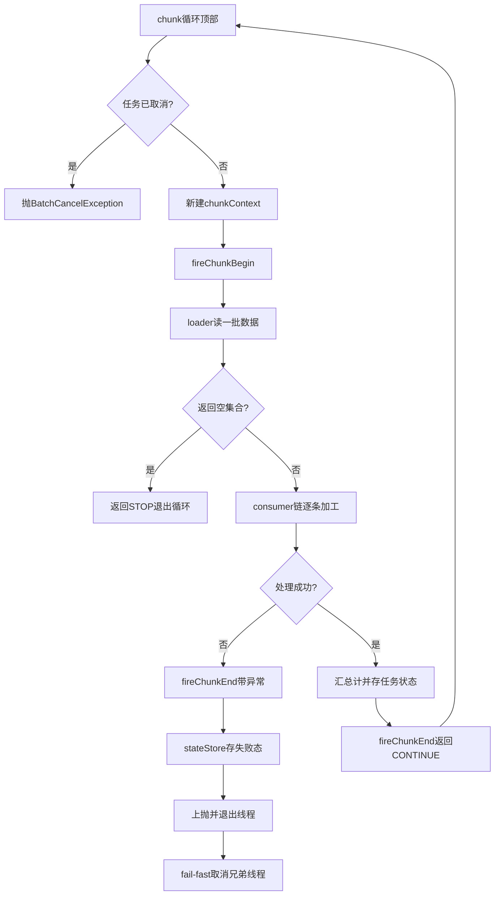
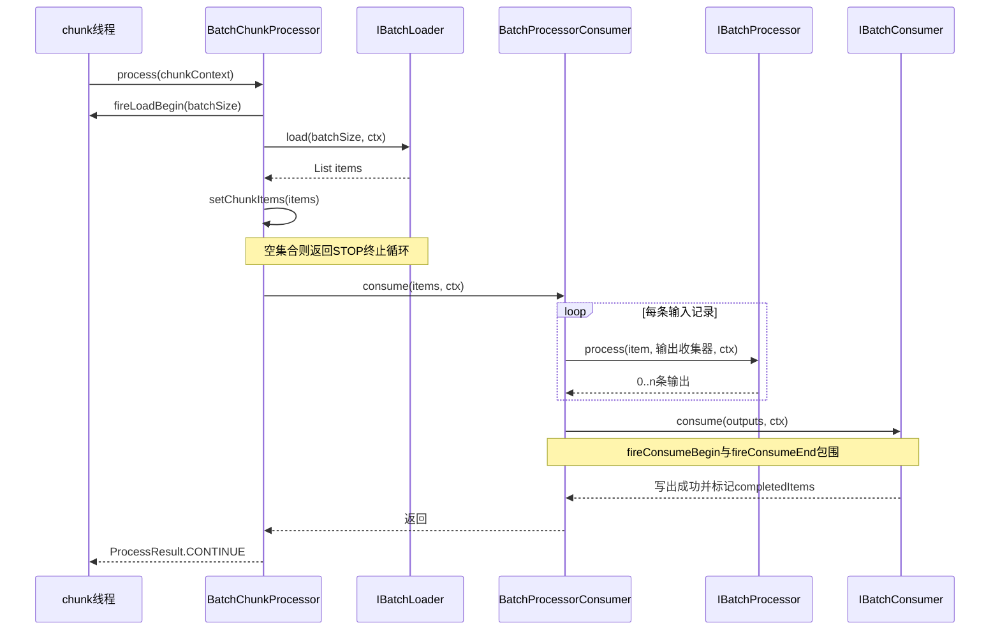

# chunk 管线：数据如何从 Loader 流向 Consumer

> 本文基准源文件（仓库相对路径，自 deepwiki/nop-batch/flows/ 三级回溯）：
> - ../../../nop-batch/nop-batch-core/src/main/java/io/nop/batch/core/IBatchLoaderProvider.java
> - ../../../nop-batch/nop-batch-core/src/main/java/io/nop/batch/core/IBatchProcessorProvider.java
> - ../../../nop-batch/nop-batch-core/src/main/java/io/nop/batch/core/IBatchConsumerProvider.java
> - ../../../nop-batch/nop-batch-core/src/main/java/io/nop/batch/core/IBatchChunkContext.java
> - ../../../nop-batch/nop-batch-core/src/main/java/io/nop/batch/core/IBatchTaskContext.java
> - ../../../nop-batch/nop-batch-core/src/main/java/io/nop/batch/core/BatchTaskBuilder.java
> - ../../../nop-batch/nop-batch-core/src/main/java/io/nop/batch/core/impl/BatchTask.java
> - ../../../nop-batch/nop-batch-core/src/main/java/io/nop/batch/core/impl/BatchTaskContextImpl.java
> - ../../../nop-batch/nop-batch-core/src/main/java/io/nop/batch/core/impl/BatchChunkContextImpl.java
> - ../../../nop-batch/nop-batch-core/src/main/java/io/nop/batch/core/processor/BatchChunkProcessor.java
> - ../../../nop-batch/nop-batch-core/src/main/java/io/nop/batch/core/consumer/BatchProcessorConsumer.java
> - ../../../nop-batch/nop-batch-core/src/main/java/io/nop/batch/core/loader/RetryBatchLoader.java
> - ../../../nop-batch/nop-batch-orm/src/main/java/io/nop/batch/orm/loader/OrmQueryBatchLoaderProvider.java
> - ../../../nop-batch/nop-batch-orm/src/main/java/io/nop/batch/orm/consumer/OrmBatchConsumerProvider.java

nop-batch 把一次批处理拆成 Loader、Processor、Consumer 三段 Provider。BatchTaskBuilder 在构建期把三段装配成一条消费链，BatchTask 在执行期以 concurrency 个线程反复运行 chunk 循环，两个上下文对象贯穿全程。本页沿一个 chunk 的生命周期讲清数据流向、上下文承载与每步失败模式。术语见 [../glossary.md](../glossary.md)。

## 三段 Provider：契约与典型实现

三个接口同一模式：`setup(IBatchTaskContext)` 在任务启动时被调用一次，返回真正干活的函数对象；打开文件、构建查询等一次性资源准备工作都发生在 setup 阶段，而不是每次 load/consume。

- `IBatchLoaderProvider<S>.setup` 返回 `IBatchLoader`，其 `load(batchSize, chunkContext)` 最多装载 batchSize 条数据；接口注释明确两点——该方法必须线程安全，返回空集合表示所有数据已加载完毕（`nop-batch/nop-batch-core/src/main/java/io/nop/batch/core/IBatchLoaderProvider.java:24-36`）。空集合因此成为管线的正常终止信号，而不是错误。
- `IBatchProcessorProvider<S,R>.setup` 返回 `IBatchProcessor`，`process(item, consumer, context)` 逐条执行类似 flatMap 的操作：向 consumer 回调输出 0..n 条结果，也可能一条不输出（`nop-batch/nop-batch-core/src/main/java/io/nop/batch/core/IBatchProcessorProvider.java:24-40`）。`then()` 方法用 CompositeBatchProcessor 把两个 processor 合成一个（`nop-batch/nop-batch-core/src/main/java/io/nop/batch/core/IBatchProcessorProvider.java:37-39`），`MultiBatchProcessorProvider.fromList` 把多个 provider 按序复合、单元素时直接退回原 provider（`nop-batch/nop-batch-core/src/main/java/io/nop/batch/core/processor/MultiBatchProcessorProvider.java:16-22`），其 `setup` 再把 providers 列表聚合成一个 CompositeBatchProcessor（24-28 行）。
- `IBatchConsumerProvider<R>.setup` 返回 `IBatchConsumer`，`consume(items, context)` 一次消费整个集合；`withFilter` 可包一层 FilteredBatchConsumer 丢弃不需要的记录（`nop-batch/nop-batch-core/src/main/java/io/nop/batch/core/IBatchConsumerProvider.java:7-29`）。

一个容易误读的组装事实：三段并非同层级的三元组。`IBatchChunkProcessorProvider` 的文档写明 chunk processor "包含了 loader=>processor=>consumer 的完整调用过程"（`nop-batch/nop-batch-core/src/main/java/io/nop/batch/core/IBatchChunkProcessorProvider.java:8-14`）；缺省执行体 BatchChunkProcessor 只持有 loader 与 consumer 两个对象，processor 是被包进 BatchProcessorConsumer 之后伪装成 consumer 挂到链上的（`nop-batch/nop-batch-core/src/main/java/io/nop/batch/core/processor/BatchChunkProcessor.java:28-40`）。chunk 主循环因此只有"读一批→空则停→整批交 consumer"三步：

`nop-batch/nop-batch-core/src/main/java/io/nop/batch/core/processor/BatchChunkProcessor.java:42-59`

```java
    @Override
    public ProcessResult process(IBatchChunkContext chunkContext) {
        chunkContext.setChunkItems(Collections.emptyList());

        // 随机调整batchSize大小，避免多线程处理时出现资源争用
        int size = adjustBatchSize(batchSize);

        List<S> items = loadItems(size, chunkContext);

        // 没有数据返回时表示全局数据都已经读取完毕
        if (items == null || items.isEmpty()) {
            return ProcessResult.STOP;
        }

        consumer.consume(items, chunkContext);

        return ProcessResult.CONTINUE;
    }
```

| 段 | 接口与内部函数 | 职责 | 典型实现 | 失败模式 |
|---|---|---|---|---|
| 读 | `IBatchLoaderProvider` / `IBatchLoader.load` | 按 batchSize 出一批数据；空集合=正常终止 | ResourceRecordLoaderProvider（文件+行号+断点状态）、OrmQueryBatchLoaderProvider（findNext 游标）、JdbcPageBatchLoaderProvider、BatchGenLoaderProvider | 异常上抛后由 RetryBatchLoader 按 loadRetryPolicy 重试；processingItems 超限则等待后抛任务错误 |
| 加工 | `IBatchProcessorProvider` / `IBatchProcessor.process` | 单条输入产生 0..n 条输出（flatMap 语义） | MultiBatchProcessorProvider（复合）、IdentityBatchProcessor、CastBatchProcessor、FilterBatchProcessor、GetPropBatchProcessor、OrmEntityBatchProcessor | 单条异常沿调用栈上抛使整个 chunk 失败，由 consumer 链上的 retry/skip 装饰器兜底 |
| 写 | `IBatchConsumerProvider` / `IBatchConsumer.consume` | 整批写出（文件、ORM、JDBC、内存 sink） | ResourceRecordConsumerProvider、OrmBatchConsumerProvider、JdbcInsertBatchConsumer / JdbcUpdateBatchConsumer、EmptyBatchConsumer | 写失败可配置 cancelTaskWhenWriteError 直接取消整个任务；否则异常使 chunk 失败 |

两个 ORM 侧示例：OrmQueryBatchLoaderProvider 用 `dao.findNext(lastEntity, ...)` 做游标分页，游标 `lastEntity` 只在批量加载属性成功后才推进，防止报错丢游标：

`nop-batch/nop-batch-orm/src/main/java/io/nop/batch/orm/loader/OrmQueryBatchLoaderProvider.java:123-137`

```java
    List<S> load(int batchSize, LoaderState<S> state) {
        IEntityDao<S> dao = state.dao;
        List<S> list = dao.findNext(state.lastEntity, state.query.getFilter(), state.query.getOrderBy(), batchSize);

        if (list.isEmpty()) {
            return list;
        }

        if (batchLoadProps != null)
            dao.batchLoadProps(list, batchLoadProps);

        // batchLoadProps有可能报错，这里将状态更新放到最后
        state.lastEntity = list.get(list.size() - 1);
        return list;
    }
```

`setup` 返回的 lambda 对这个 `load` 加 `synchronized (state)` 串行化（96-103 行），因此该 loader 在多线程任务里由游标状态单线程推进。OrmBatchConsumerProvider.setup 则按 keyFields 是否为空，在"纯插入 consumer"与"按主键 upsert consumer"之间选择（`nop-batch/nop-batch-orm/src/main/java/io/nop/batch/orm/consumer/OrmBatchConsumerProvider.java:69-78`）。

> Sources: [nop-batch/nop-batch-core/src/main/java/io/nop/batch/core/IBatchLoaderProvider.java:24-36](https://gitee.com/canonical-entropy/nop-entropy/blob/555f7a9731/nop-batch/nop-batch-core/src/main/java/io/nop/batch/core/IBatchLoaderProvider.java#L24-L36)、[nop-batch/nop-batch-core/src/main/java/io/nop/batch/core/IBatchProcessorProvider.java:24-40](https://gitee.com/canonical-entropy/nop-entropy/blob/555f7a9731/nop-batch/nop-batch-core/src/main/java/io/nop/batch/core/IBatchProcessorProvider.java#L24-L40)、[nop-batch/nop-batch-core/src/main/java/io/nop/batch/core/IBatchConsumerProvider.java:7-29](https://gitee.com/canonical-entropy/nop-entropy/blob/555f7a9731/nop-batch/nop-batch-core/src/main/java/io/nop/batch/core/IBatchConsumerProvider.java#L7-L29)、[nop-batch/nop-batch-core/src/main/java/io/nop/batch/core/processor/BatchChunkProcessor.java:42-59](https://gitee.com/canonical-entropy/nop-entropy/blob/555f7a9731/nop-batch/nop-batch-core/src/main/java/io/nop/batch/core/processor/BatchChunkProcessor.java#L42-L59)、[nop-batch/nop-batch-orm/src/main/java/io/nop/batch/orm/loader/OrmQueryBatchLoaderProvider.java:96-137](https://gitee.com/canonical-entropy/nop-entropy/blob/555f7a9731/nop-batch/nop-batch-orm/src/main/java/io/nop/batch/orm/loader/OrmQueryBatchLoaderProvider.java#L96-L137)

## 装配：BatchTaskBuilder 把三段串成一条消费链

`buildTask()` 把 `this::buildLoader` 和 `this::buildChunkProcessor` 两个方法引用交给 BatchTask（`nop-batch/nop-batch-core/src/main/java/io/nop/batch/core/BatchTaskBuilder.java:326-330`），任务启动时才真正 setup。装配是洋葱式的，由内到外依次包裹（`nop-batch/nop-batch-core/src/main/java/io/nop/batch/core/BatchTaskBuilder.java:376-456`）：

1. 业务 consumer setup，缺省用 EmptyBatchConsumer 兜底（377-379 行）。
2. 有 historyStore 且事务 scope 为 consume 时自动把事务提升到 process 级，保证 saveProcessed 与业务写出同事务提交（385-389 行）。
3. consume 级事务包 InvokerBatchConsumer（391-394 行）；设置 processor 后包 BatchProcessorConsumer，processor 在此进入链中（396-403 行）。
4. WithHistoryBatchConsumer 过滤已处理记录（405-407 行）、process 级事务（409-412 行）、AddCompletedBatchConsumer 在事务提交后标记完成（414-416 行）、RateLimitConsumer 限速（418-420 行）、SingleModeBatchConsumer 逐条消费（422-424 行）。
5. retryPolicy 决定 RetryOneByOneBatchConsumer（逐条重试+skipPolicy）或 RetryAllBatchConsumer（整批重试），skipPolicy 再包一层 SkipBatchConsumer（426-439 行）。
6. 最终 `new BatchChunkProcessor<>(loader, batchSize, jitterRatio, consumer)`（441-442 行），chunk 级事务与 singleSession 各再包一层 InvokerBatchChunkProcessor（444-453 行）。

中段装配——processor 进链、历史过滤、事务包裹与完成标记的先后顺序：

`nop-batch/nop-batch-core/src/main/java/io/nop/batch/core/BatchTaskBuilder.java:398-416`

```java
            IBatchProcessor<S, R> processor = this.processor.setup(context);
            if (useBatchRequestGenerator) {
                processor = new BatchSequentialProcessor(processor);
            }
            consumer = new BatchProcessorConsumer<>(processor, (IBatchConsumer<R>) consumer, asyncProcessor, asyncProcessTimeout);
        }

        // 保存处理历史，避免重复处理
        if (historyStore != null)
            consumer = new WithHistoryBatchConsumer<>(historyStore, consumer, historyConsumer == null ? null : historyConsumer.setup(context));

        // 在process（含history自动提升后的consume）阶段打开事务，保证saveProcessed在事务内
        if (scope == BatchTransactionScope.process && transactionalInvoker != null) {
            consumer = new InvokerBatchConsumer<>(transactionalInvoker, consumer);
        }

        // 事务提交后就可以标记记录为完成，调用context.addCompletedItems(items)
        if (batchTransactionScope != BatchTransactionScope.chunk)
            consumer = new AddCompletedBatchConsumer<>(consumer);
```

尾段装配——retry/skip 选型与 chunkProcessor 构造：

`nop-batch/nop-batch-core/src/main/java/io/nop/batch/core/BatchTaskBuilder.java:426-442`

```java
        // 一般情况下事务scope为process或者consume，因此retry是在事务之外执行.
        if (retryPolicy != null) {
            if (retryOneByOne) {
                // skip检查在retry之后执行
                consumer = new RetryOneByOneBatchConsumer<>(consumer, retryPolicy, snapshotBuilder, skipPolicy);
            } else {
                consumer = new RetryAllBatchConsumer<>(consumer, retryPolicy, snapshotBuilder);
            }
        }

        // retry失败后，如果错误记录数在一定范围之内，则可以忽略异常继续处理。retryOneByOne的时候已经执行过skipPolicy这里就不再需要处理
        if (skipPolicy != null && !retryOneByOne) {
            consumer = new SkipBatchConsumer<>(consumer, skipPolicy);
        }

        IBatchChunkProcessorProvider.IBatchChunkProcessor chunkProcessor;
        chunkProcessor = new BatchChunkProcessor<>(loader, batchSize, jitterRatio, consumer);
```

loader 侧同样有装饰：dispatchConfig 配置分区分发 loader，inputComparator 包 ChunkSortBatchLoader 排序（332-355 行），loadRetryPolicy 包 RetryBatchLoader（363-364、370-371 行）。dispatch 分支内部的 buildLoader1 说明 singleSession 与 retry 装饰在 dispatch 模式下同样生效：

`nop-batch/nop-batch-core/src/main/java/io/nop/batch/core/BatchTaskBuilder.java:357-366`

```java
    private IBatchLoader<S> buildLoader1(IBatchTaskContext context) {
        IBatchLoader<S> loader = this.loader.setup(context);
        if (singleSession && singleSessionInvoker != null)
            loader = new InvokerBatchLoader<>(singleSessionInvoker, loader);
        // dispatch模式下同样要包装loadRetryPolicy，否则该配置会被静默忽略，
        // 与无dispatcher时的行为不一致
        if (loadRetryPolicy != null)
            loader = new RetryBatchLoader<>(loader, loadRetryPolicy);
        return loader;
    }
```

更多构建参数与 DSL 入口见 [核心引擎](../modules/batch-core.md)。

> Sources: [nop-batch/nop-batch-core/src/main/java/io/nop/batch/core/BatchTaskBuilder.java:326-330](https://gitee.com/canonical-entropy/nop-entropy/blob/555f7a9731/nop-batch/nop-batch-core/src/main/java/io/nop/batch/core/BatchTaskBuilder.java#L326-L330)、[nop-batch/nop-batch-core/src/main/java/io/nop/batch/core/BatchTaskBuilder.java:332-373](https://gitee.com/canonical-entropy/nop-entropy/blob/555f7a9731/nop-batch/nop-batch-core/src/main/java/io/nop/batch/core/BatchTaskBuilder.java#L332-L373)、[nop-batch/nop-batch-core/src/main/java/io/nop/batch/core/BatchTaskBuilder.java:376-456](https://gitee.com/canonical-entropy/nop-entropy/blob/555f7a9731/nop-batch/nop-batch-core/src/main/java/io/nop/batch/core/BatchTaskBuilder.java#L376-L456)

## 两个上下文：贯穿什么、谁实现

`IBatchTaskContext` 是任务级单例，接口文档定义其为"一个批处理任务对应一个 loader + processor + consumer 的组合调用"（`nop-batch/nop-batch-core/src/main/java/io/nop/batch/core/IBatchTaskContext.java:22-25`）。`IBatchChunkContext` 每 chunk 新建一次，通过 `taskContext.newChunkContext()` 产出，BatchTaskContextImpl 的实现就是 `new BatchChunkContextImpl(this)`（`nop-batch/nop-batch-core/src/main/java/io/nop/batch/core/impl/BatchTaskContextImpl.java:211-214`）。全仓库生产代码中两者各只有一个实现类：BatchTaskContextImpl 与 BatchChunkContextImpl，都继承 ExecutionContextImpl；chunk 上下文构造时把自身注册进 XLang 求解作用域变量，供表达式读取：

`nop-batch/nop-batch-core/src/main/java/io/nop/batch/core/impl/BatchChunkContextImpl.java:39-43`

```java
    public BatchChunkContextImpl(IBatchTaskContext context) {
        super(context.getEvalScope());
        this.context = context;
        this.getEvalScope().setLocalValue(BatchConstants.VAR_BATCH_CHUNK_CTX, this);
    }
```

dsl 模块的 BatchTaskManagerImpl 是生产环境创建任务上下文的入口（`nop-batch/nop-batch-dsl/src/main/java/io/nop/batch/dsl/manager/BatchTaskManagerImpl.java:84-86`）。

chunk 上下文只保留 chunk 内的瞬时状态，跨 chunk 汇总靠它回写任务上下文的原子计数器（BatchTask.incCount，`nop-batch/nop-batch-core/src/main/java/io/nop/batch/core/impl/BatchTask.java:344-347`）。

| 承载信息 | 接口方法 | 语义与去向 |
|---|---|---|
| chunkItems | `get/setChunkItems`（IBatchChunkContext.java:38-40） | 本次 load 读到的记录列表，load 成功后写入（BatchChunkProcessor.java:69） |
| historyItems | `addHistoryItem(s)`（42-46 行） | 本 chunk 曾处理过的记录（含重试场景），chunk 结束时汇总进任务级 historyItemCount |
| completedItems | `addCompletedItem(s)`、`getCompletedItemCount`（61-75 行） | 本 chunk 已完成的记录，BatchTask.incCount 汇总进任务级 completeItemCount |
| processCount | `get/set/incProcessCount`（77-83 行） | 本 chunk 已逐条处理的条数，BatchProcessorConsumer 每处理一条自增 |
| retryCount / loadRetryCount | 85-106 行 | 消费重试与装载重试次数；`isRetrying()` 判断是否重试执行，RetryBatchLoader 递增 loadRetryCount |
| threadIndex / concurrency | 48-57 行 | 当前线程编号与并发度，多线程内部数据分区的依据，processChunk 入口设置（BatchTask.java:273-274） |
| singleMode | `is/setSingleMode`（108-113 行） | 单条执行标志，此时单条失败不回滚其他条目 |
| chunkLatch | `initChunkLatch/countDown`（126-130 行） | 异步 processor 的 CountDownLatch，BatchProcessorConsumer 等待全部异步处理完成 |
| rowNumberMap | `get/setRowNumber`（132-134 行） | 记录到源文件行号的映射（IdentityHashMap），供断点状态使用 |

任务上下文一侧：`params` 是外部只读参数（54-59 行），`persistVars` 是可持久化状态变量，"当批处理任务失败后重试时可以读取上次处理状态"（75-92 行），`partitionRange`/`recoverMode`/`completedIndex` 支撑断点续跑（94-142 行），另有 skip/retry/complete/process/insert/update/delete 等原子计数器组（BatchTaskContextImpl.java:55-65）与十类生命周期回调的注册与触发（`onChunkBegin`、`onLoadEnd`、`fireConsumeEnd` 等，IBatchTaskContext.java:180-219）。persistVars 与 completedIndex 如何落库见 [断点续跑与记录](./checkpoint-recovery.md)。

> Sources: [nop-batch/nop-batch-core/src/main/java/io/nop/batch/core/IBatchTaskContext.java:22-219](https://gitee.com/canonical-entropy/nop-entropy/blob/555f7a9731/nop-batch/nop-batch-core/src/main/java/io/nop/batch/core/IBatchTaskContext.java#L22-L219)、[nop-batch/nop-batch-core/src/main/java/io/nop/batch/core/IBatchChunkContext.java:38-134](https://gitee.com/canonical-entropy/nop-entropy/blob/555f7a9731/nop-batch/nop-batch-core/src/main/java/io/nop/batch/core/IBatchChunkContext.java#L38-L134)、[nop-batch/nop-batch-core/src/main/java/io/nop/batch/core/impl/BatchTaskContextImpl.java:211-214](https://gitee.com/canonical-entropy/nop-entropy/blob/555f7a9731/nop-batch/nop-batch-core/src/main/java/io/nop/batch/core/impl/BatchTaskContextImpl.java#L211-L214)、[nop-batch/nop-batch-core/src/main/java/io/nop/batch/core/impl/BatchChunkContextImpl.java:39-43](https://gitee.com/canonical-entropy/nop-entropy/blob/555f7a9731/nop-batch/nop-batch-core/src/main/java/io/nop/batch/core/impl/BatchChunkContextImpl.java#L39-L43)、[nop-batch/nop-batch-core/src/main/java/io/nop/batch/core/impl/BatchTask.java:344-347](https://gitee.com/canonical-entropy/nop-entropy/blob/555f7a9731/nop-batch/nop-batch-core/src/main/java/io/nop/batch/core/impl/BatchTask.java#L344-L347)

## chunk 循环：终止条件与失败分支

`executeAsync` 启动 concurrency 个 `executeChunkLoop`，每个线程循环调用 `processChunk`（`nop-batch/nop-batch-core/src/main/java/io/nop/batch/core/impl/BatchTask.java:133-137`）。循环体只有三条出路（217-235 行）：

- **正常终止**：`chunkProcessor.process` 返回 `ProcessResult.STOP`（枚举仅 CONTINUE/STOP 两值，`nop-kernel/nop-api-core/src/main/java/io/nop/api/core/util/ProcessResult.java:13-16`）时 break。STOP 唯一的产生点是 loader 返回空集合或 null（`nop-batch/nop-batch-core/src/main/java/io/nop/batch/core/processor/BatchChunkProcessor.java:51-54`）。
- **失败**：processChunk 内任何异常（load、process、consume、状态保存）被记录、`fireChunkEnd(ctx, err)`、`stateStore.saveTaskState(false, err, ctx)` 后原样上抛（BatchTask.java:308-328，注释明确"chunk 处理失败时退出循环"）；executeChunkLoop 捕获后先 `completeExceptionally`，再对未取消的任务触发 `context.cancel` 实现 fail-fast，让兄弟线程尽快停止（227-234 行）。
- **取消**：每轮循环顶部检查 `context.isCancelled()`，取消即抛 BatchCancelException（218-219 行）；批内每处理完一条还会再检查任务级与 chunk 级取消标志（`nop-batch/nop-batch-core/src/main/java/io/nop/batch/core/consumer/BatchProcessorConsumer.java:78-82`）。

`nop-batch/nop-batch-core/src/main/java/io/nop/batch/core/impl/BatchTask.java:217-234`

```java
                    do {
                        if (context.isCancelled())
                            throw new BatchCancelException(ERR_BATCH_CANCEL_PROCESS);

                        if (processChunk(context, threadIndex, chunkProcessor) != ProcessResult.CONTINUE)
                            break;

                    } while (true);

                    future.complete(null);
                } catch (Exception e) {
                    NopException.logIfNotTraced(LOG, "nop.batch.execute-chunk-loop-fail", e);
                    // 先完成future，确保allOf报告的是原始异常而不是兄弟线程随后抛出的BatchCancelException
                    future.completeExceptionally(e);

                    // fail-fast: 任一chunk失败后通知其他线程尽快停止，避免失败后继续处理剩余数据
                    if (!context.isCancelled())
                        context.cancel(ICancellable.CANCEL_REASON_STOP);
```

成功路径的收尾顺序固定：fireBeforeComplete → fireBeforeChunkEnd → incCount → `stateStore.saveTaskState(false, null, ctx)` → `chunkContext.complete()` → `fireChunkEnd(ctx, null)`（BatchTask.java:294-306），即"先存状态再通知完成"。



> Sources: [nop-batch/nop-batch-core/src/main/java/io/nop/batch/core/impl/BatchTask.java:206-243](https://gitee.com/canonical-entropy/nop-entropy/blob/555f7a9731/nop-batch/nop-batch-core/src/main/java/io/nop/batch/core/impl/BatchTask.java#L206-L243)、[nop-batch/nop-batch-core/src/main/java/io/nop/batch/core/impl/BatchTask.java:270-342](https://gitee.com/canonical-entropy/nop-entropy/blob/555f7a9731/nop-batch/nop-batch-core/src/main/java/io/nop/batch/core/impl/BatchTask.java#L270-L342)、[nop-batch/nop-batch-core/src/main/java/io/nop/batch/core/consumer/BatchProcessorConsumer.java:78-82](https://gitee.com/canonical-entropy/nop-entropy/blob/555f7a9731/nop-batch/nop-batch-core/src/main/java/io/nop/batch/core/consumer/BatchProcessorConsumer.java#L78-L82)、[nop-kernel/nop-api-core/src/main/java/io/nop/api/core/util/ProcessResult.java:13-16](https://gitee.com/canonical-entropy/nop-entropy/blob/555f7a9731/nop-kernel/nop-api-core/src/main/java/io/nop/api/core/util/ProcessResult.java#L13-L16)

## 一个 chunk 的时序

下图为同步模式下单个 chunk 从 load 到 consume 的完整调用链；异步 processor（async=true）时第 4 步改为注册 CountDownLatch 并等待，超时则取消 chunk 并抛 NopTimeoutException（BatchProcessorConsumer.java:85-99）。



三个值得注意的边界行为：

1. **process 与 consumer 的边界**：BatchProcessorConsumer 先把所有输出缓存到列表，整个输入列表处理完才调用一次下游 consumer；即使输出为空也执行一次，注释说明这可能触发 ORM flush（`nop-batch/nop-batch-core/src/main/java/io/nop/batch/core/consumer/BatchProcessorConsumer.java:61-62、101-102`）。
2. **load 的事件与指标**：fireLoadBegin/fireLoadEnd 总是成对触发，异常也走 fireLoadEnd(ctx, err)，并回写 metrics 的 load 计数（BatchChunkProcessor.java:61-81）。
3. **重试的两层位置**：装载重试发生在 BatchChunkProcessor 调用 loader 之前的一层——RetryBatchLoader 对 BatchCancelException 直接透传不重试，其余异常进入按退避延迟递归重试的 retryLoad：

`nop-batch/nop-batch-core/src/main/java/io/nop/batch/core/loader/RetryBatchLoader.java:37-54`

```java
    public List<S> load(int batchSize, IBatchChunkContext context) {
        try {
            return loader.load(batchSize, context);
        } catch (BatchCancelException e) {
            // 首次加载即被取消时直接透传，不进入重试流程，避免取消响应被重试退避延迟
            throw e;
        } catch (Exception e) {
            return retryLoad(batchSize, e, context);
        }
    }

    List<S> retryLoad(int batchSize, Exception exception, IBatchChunkContext context) {
        do {
            context.incLoadRetryCount();

            long delay = retryPolicy.getRetryDelay(exception, context.getLoadRetryCount(), context);
            if (delay < 0) {
                throw NopException.adapt(exception);
            }
```

   retryLoad 后半段为 sleep(delay) 后再次 load、BatchCancelException 同样透传、每次失败递归进入下一轮并记日志（56-69 行）。消费重试发生在 consumer 链最外层，RetryOneByOneBatchConsumer 逐条重试并允许 skipPolicy 跳过（`nop-batch/nop-batch-core/src/main/java/io/nop/batch/core/consumer/RetryOneByOneBatchConsumer.java:25-33`）。事务提交后才由 AddCompletedBatchConsumer 标记记录完成（`nop-batch/nop-batch-core/src/main/java/io/nop/batch/core/consumer/AddCompletedBatchConsumer.java:16-19`）。

> Sources: [nop-batch/nop-batch-core/src/main/java/io/nop/batch/core/processor/BatchChunkProcessor.java:42-81](https://gitee.com/canonical-entropy/nop-entropy/blob/555f7a9731/nop-batch/nop-batch-core/src/main/java/io/nop/batch/core/processor/BatchChunkProcessor.java#L42-L81)、[nop-batch/nop-batch-core/src/main/java/io/nop/batch/core/consumer/BatchProcessorConsumer.java:52-127](https://gitee.com/canonical-entropy/nop-entropy/blob/555f7a9731/nop-batch/nop-batch-core/src/main/java/io/nop/batch/core/consumer/BatchProcessorConsumer.java#L52-L127)、[nop-batch/nop-batch-core/src/main/java/io/nop/batch/core/loader/RetryBatchLoader.java:37-70](https://gitee.com/canonical-entropy/nop-entropy/blob/555f7a9731/nop-batch/nop-batch-core/src/main/java/io/nop/batch/core/loader/RetryBatchLoader.java#L37-L70)、[nop-batch/nop-batch-core/src/main/java/io/nop/batch/core/consumer/RetryOneByOneBatchConsumer.java:25-33](https://gitee.com/canonical-entropy/nop-entropy/blob/555f7a9731/nop-batch/nop-batch-core/src/main/java/io/nop/batch/core/consumer/RetryOneByOneBatchConsumer.java#L25-L33)、[nop-batch/nop-batch-core/src/main/java/io/nop/batch/core/consumer/AddCompletedBatchConsumer.java:16-19](https://gitee.com/canonical-entropy/nop-entropy/blob/555f7a9731/nop-batch/nop-batch-core/src/main/java/io/nop/batch/core/consumer/AddCompletedBatchConsumer.java#L16-L19)

## Sources

- [nop-batch/nop-batch-core/src/main/java/io/nop/batch/core/IBatchLoaderProvider.java:24-36](https://gitee.com/canonical-entropy/nop-entropy/blob/555f7a9731/nop-batch/nop-batch-core/src/main/java/io/nop/batch/core/IBatchLoaderProvider.java#L24-L36)
- [nop-batch/nop-batch-core/src/main/java/io/nop/batch/core/IBatchProcessorProvider.java:24-40](https://gitee.com/canonical-entropy/nop-entropy/blob/555f7a9731/nop-batch/nop-batch-core/src/main/java/io/nop/batch/core/IBatchProcessorProvider.java#L24-L40)
- [nop-batch/nop-batch-core/src/main/java/io/nop/batch/core/IBatchConsumerProvider.java:7-29](https://gitee.com/canonical-entropy/nop-entropy/blob/555f7a9731/nop-batch/nop-batch-core/src/main/java/io/nop/batch/core/IBatchConsumerProvider.java#L7-L29)
- [nop-batch/nop-batch-core/src/main/java/io/nop/batch/core/IBatchChunkProcessorProvider.java:8-14](https://gitee.com/canonical-entropy/nop-entropy/blob/555f7a9731/nop-batch/nop-batch-core/src/main/java/io/nop/batch/core/IBatchChunkProcessorProvider.java#L8-L14)
- [nop-batch/nop-batch-core/src/main/java/io/nop/batch/core/IBatchChunkContext.java:38-134](https://gitee.com/canonical-entropy/nop-entropy/blob/555f7a9731/nop-batch/nop-batch-core/src/main/java/io/nop/batch/core/IBatchChunkContext.java#L38-L134)
- [nop-batch/nop-batch-core/src/main/java/io/nop/batch/core/IBatchTaskContext.java:22-219](https://gitee.com/canonical-entropy/nop-entropy/blob/555f7a9731/nop-batch/nop-batch-core/src/main/java/io/nop/batch/core/IBatchTaskContext.java#L22-L219)
- [nop-batch/nop-batch-core/src/main/java/io/nop/batch/core/BatchTaskBuilder.java:326-456](https://gitee.com/canonical-entropy/nop-entropy/blob/555f7a9731/nop-batch/nop-batch-core/src/main/java/io/nop/batch/core/BatchTaskBuilder.java#L326-L456)
- [nop-batch/nop-batch-core/src/main/java/io/nop/batch/core/impl/BatchTask.java:206-347](https://gitee.com/canonical-entropy/nop-entropy/blob/555f7a9731/nop-batch/nop-batch-core/src/main/java/io/nop/batch/core/impl/BatchTask.java#L206-L347)
- [nop-batch/nop-batch-core/src/main/java/io/nop/batch/core/impl/BatchTaskContextImpl.java:55-65](https://gitee.com/canonical-entropy/nop-entropy/blob/555f7a9731/nop-batch/nop-batch-core/src/main/java/io/nop/batch/core/impl/BatchTaskContextImpl.java#L55-L65)
- [nop-batch/nop-batch-core/src/main/java/io/nop/batch/core/impl/BatchChunkContextImpl.java:39-43](https://gitee.com/canonical-entropy/nop-entropy/blob/555f7a9731/nop-batch/nop-batch-core/src/main/java/io/nop/batch/core/impl/BatchChunkContextImpl.java#L39-L43)
- [nop-batch/nop-batch-core/src/main/java/io/nop/batch/core/processor/BatchChunkProcessor.java:28-92](https://gitee.com/canonical-entropy/nop-entropy/blob/555f7a9731/nop-batch/nop-batch-core/src/main/java/io/nop/batch/core/processor/BatchChunkProcessor.java#L28-L92)
- [nop-batch/nop-batch-core/src/main/java/io/nop/batch/core/processor/MultiBatchProcessorProvider.java:16-28](https://gitee.com/canonical-entropy/nop-entropy/blob/555f7a9731/nop-batch/nop-batch-core/src/main/java/io/nop/batch/core/processor/MultiBatchProcessorProvider.java#L16-L28)
- [nop-batch/nop-batch-core/src/main/java/io/nop/batch/core/consumer/BatchProcessorConsumer.java:52-127](https://gitee.com/canonical-entropy/nop-entropy/blob/555f7a9731/nop-batch/nop-batch-core/src/main/java/io/nop/batch/core/consumer/BatchProcessorConsumer.java#L52-L127)
- [nop-batch/nop-batch-core/src/main/java/io/nop/batch/core/consumer/RetryOneByOneBatchConsumer.java:25-33](https://gitee.com/canonical-entropy/nop-entropy/blob/555f7a9731/nop-batch/nop-batch-core/src/main/java/io/nop/batch/core/consumer/RetryOneByOneBatchConsumer.java#L25-L33)
- [nop-batch/nop-batch-core/src/main/java/io/nop/batch/core/consumer/AddCompletedBatchConsumer.java:16-19](https://gitee.com/canonical-entropy/nop-entropy/blob/555f7a9731/nop-batch/nop-batch-core/src/main/java/io/nop/batch/core/consumer/AddCompletedBatchConsumer.java#L16-L19)
- [nop-batch/nop-batch-core/src/main/java/io/nop/batch/core/loader/RetryBatchLoader.java:37-70](https://gitee.com/canonical-entropy/nop-entropy/blob/555f7a9731/nop-batch/nop-batch-core/src/main/java/io/nop/batch/core/loader/RetryBatchLoader.java#L37-L70)
- [nop-batch/nop-batch-orm/src/main/java/io/nop/batch/orm/loader/OrmQueryBatchLoaderProvider.java:96-137](https://gitee.com/canonical-entropy/nop-entropy/blob/555f7a9731/nop-batch/nop-batch-orm/src/main/java/io/nop/batch/orm/loader/OrmQueryBatchLoaderProvider.java#L96-L137)
- [nop-batch/nop-batch-orm/src/main/java/io/nop/batch/orm/consumer/OrmBatchConsumerProvider.java:69-78](https://gitee.com/canonical-entropy/nop-entropy/blob/555f7a9731/nop-batch/nop-batch-orm/src/main/java/io/nop/batch/orm/consumer/OrmBatchConsumerProvider.java#L69-L78)
- [nop-batch/nop-batch-dsl/src/main/java/io/nop/batch/dsl/manager/BatchTaskManagerImpl.java:84-86](https://gitee.com/canonical-entropy/nop-entropy/blob/555f7a9731/nop-batch/nop-batch-dsl/src/main/java/io/nop/batch/dsl/manager/BatchTaskManagerImpl.java#L84-L86)
- [nop-kernel/nop-api-core/src/main/java/io/nop/api/core/util/ProcessResult.java:13-16](https://gitee.com/canonical-entropy/nop-entropy/blob/555f7a9731/nop-kernel/nop-api-core/src/main/java/io/nop/api/core/util/ProcessResult.java#L13-L16)

相关页面：[核心引擎](../modules/batch-core.md)、[断点续跑与记录](./checkpoint-recovery.md)、[../glossary.md](../glossary.md)

---

## On this page

- 三段 Provider：契约与典型实现
- 装配：BatchTaskBuilder 把三段串成一条消费链
- 两个上下文：贯穿什么、谁实现
- chunk 循环：终止条件与失败分支
- 一个 chunk 的时序
