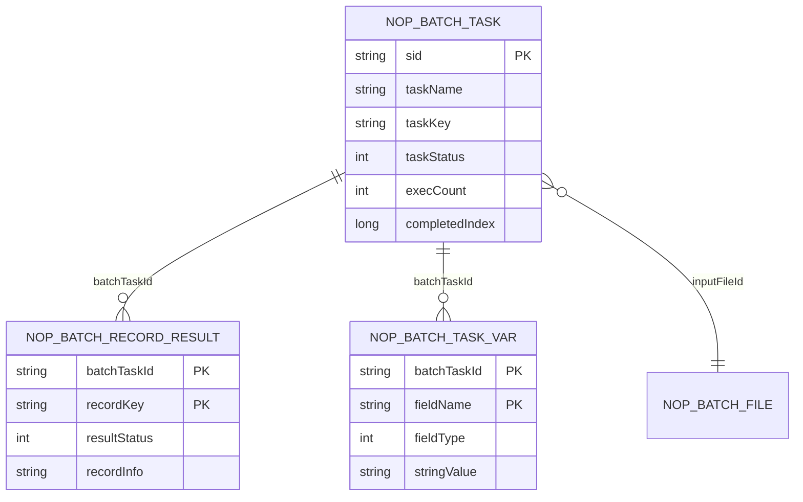
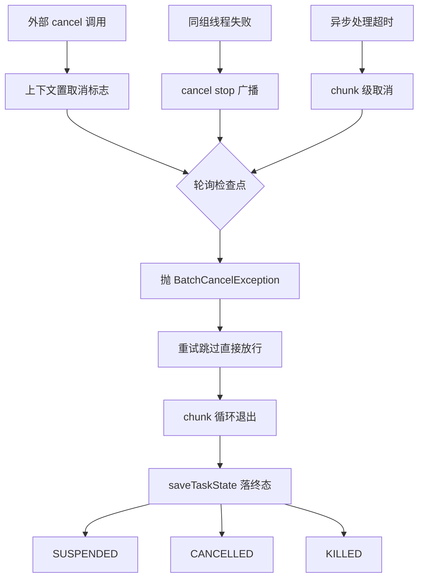
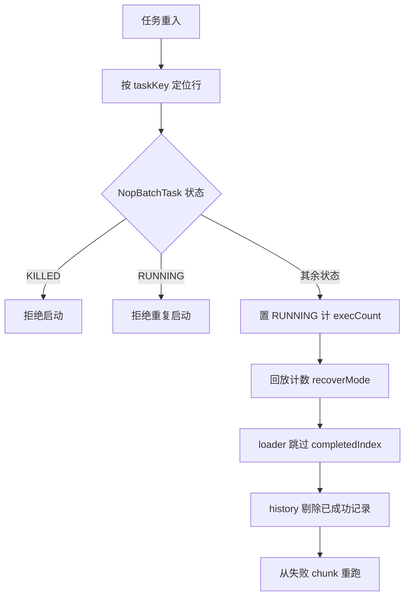

# 断点续跑与记录：失败后从哪里再来

nop-batch 的断点续跑不依赖内存快照，而是把进度拆进 DAO 实体：`NopBatchTask` 记任务级状态机与计数器，`NopBatchRecordResult` 记记录级成功历史，`NopBatchTaskVar` 是任务变量 KV 表；取消经 `BatchCancelException` 穿透重试与跳过逻辑，按取消原因落为 SUSPENDED/CANCELLED/KILLED 三种状态。本章只讲 nop-batch 自身机制，与 nop-task 的状态机制无继承关系。

> **基准源文件**（相对本页 `deepwiki/nop-batch/flows/`，已逐条验证存在）：
>
> - [../../../nop-batch/nop-batch-dao/src/main/java/io/nop/batch/dao/entity/NopBatchTask.java](../../../nop-batch/nop-batch-dao/src/main/java/io/nop/batch/dao/entity/NopBatchTask.java)
> - [../../../nop-batch/nop-batch-dao/src/main/java/io/nop/batch/dao/entity/NopBatchRecordResult.java](../../../nop-batch/nop-batch-dao/src/main/java/io/nop/batch/dao/entity/NopBatchRecordResult.java)
> - [../../../nop-batch/nop-batch-dao/src/main/java/io/nop/batch/dao/entity/NopBatchTaskVar.java](../../../nop-batch/nop-batch-dao/src/main/java/io/nop/batch/dao/entity/NopBatchTaskVar.java)
> - [../../../nop-batch/nop-batch-dao/src/main/java/io/nop/batch/dao/entity/NopBatchTaskState.java](../../../nop-batch/nop-batch-dao/src/main/java/io/nop/batch/dao/entity/NopBatchTaskState.java)
> - [../../../nop-batch/nop-batch-dao/src/main/java/io/nop/batch/dao/store/DaoBatchStateStore.java](../../../nop-batch/nop-batch-dao/src/main/java/io/nop/batch/dao/store/DaoBatchStateStore.java)
> - [../../../nop-batch/nop-batch-dao/src/main/java/io/nop/batch/dao/history/DaoBatchRecordHistoryStore.java](../../../nop-batch/nop-batch-dao/src/main/java/io/nop/batch/dao/history/DaoBatchRecordHistoryStore.java)
> - [../../../nop-batch/nop-batch-core/src/main/java/io/nop/batch/core/IBatchStateStore.java](../../../nop-batch/nop-batch-core/src/main/java/io/nop/batch/core/IBatchStateStore.java)
> - [../../../nop-batch/nop-batch-core/src/main/java/io/nop/batch/core/IBatchRecordHistoryStore.java](../../../nop-batch/nop-batch-core/src/main/java/io/nop/batch/core/IBatchRecordHistoryStore.java)
> - [../../../nop-batch/nop-batch-core/src/main/java/io/nop/batch/core/exceptions/BatchCancelException.java](../../../nop-batch/nop-batch-core/src/main/java/io/nop/batch/core/exceptions/BatchCancelException.java)
> - [../../../nop-batch/nop-batch-core/src/main/java/io/nop/batch/core/impl/BatchTask.java](../../../nop-batch/nop-batch-core/src/main/java/io/nop/batch/core/impl/BatchTask.java)
> - [../../../nop-batch/nop-batch-core/src/main/java/io/nop/batch/core/loader/ResourceRecordLoaderProvider.java](../../../nop-batch/nop-batch-core/src/main/java/io/nop/batch/core/loader/ResourceRecordLoaderProvider.java)

**相关页面**：[chunk 管线](./batch-pipeline.md)（chunk 循环与三段 Provider 管线，同批生成）、[核心引擎](../modules/batch-core.md)（BatchTaskBuilder 与上下文）、[术语表](../glossary.md)（Chunk/Loader/Consumer 划界）。

## 四个 DAO 实体各记什么：状态、记录、变量与占位

| 实体 | 表 | 主键 | 记录内容 | 运行时写入方 |
|---|---|---|---|---|
| `NopBatchTask` | nop_batch_task | sid | 任务状态机（7 态）、execCount/restartTime、completedIndex 等 6 个计数器、result 三元组与 errorStack | `DaoBatchStateStore`（loadTaskState/saveTaskState） |
| `NopBatchRecordResult` | nop_batch_record_result | batchTaskId+recordKey（复合主键，两列均 `primary="true"`，`nop-batch/model/nop-batch.orm.xml:181-186`） | 单条记录的处理结果：resultStatus（0=成功）、recordInfo（JSON）、resultCode/resultMsg/errorStack | `DaoBatchRecordHistoryStore.saveProcessed` |
| `NopBatchTaskVar` | nop_batch_task_var | batchTaskId+fieldName | 任务级 KV 变量，按 fieldType 分列存 string/decimal/long/date/timestamp 值（`nop-batch/model/nop-batch.orm.xml:129-166`，`tagSet="no-web,kvTable"`） | 当前 nop-batch 内无运行时写入方，仅暴露 CRUD BizModel |
| `NopBatchTaskState` | —（无表） | batchTaskId+fieldName（Java 字段，`_gen/_NopBatchTaskState.java:24-56`） | 与 TaskVar 同构的状态实体，但**未接线**：ORM 模型与建表脚本均无此实体（见下） | 无 |

`NopBatchTask` 的 7 个状态常量定义在 `_NopBatchDaoConstants.java:9-39`：CREATED=0、RUNNING=10、SUSPENDED=20、COMPLETED=30、FAILED=40、CANCELLED=50、KILLED=60。Java 子类只加三个便捷方法：`isHistory()`（status≥COMPLETED 视为历史行）、`isSuspended()`、`incExecCount()`，并实现 `IBatchTaskRecord` 四个取值方法向引擎暴露 sid/taskName/taskKey/taskStatus（`nop-batch/nop-batch-dao/src/main/java/io/nop/batch/dao/entity/NopBatchTask.java:17-34`）——实体即状态机载体，无任何额外运行时状态：

`nop-batch/nop-batch-dao/src/main/java/io/nop/batch/dao/entity/NopBatchTask.java:16-34`

```java
@BizObjName("NopBatchTask")
public class NopBatchTask extends _NopBatchTask implements IBatchTaskRecord {
    public NopBatchTask() {
    }

    public boolean isHistory() {
        return getTaskStatus() >= NopBatchDaoConstants.TASK_STATUS_COMPLETED;
    }

    public boolean isSuspended() {
        return getTaskStatus() == NopBatchDaoConstants.TASK_STATUS_SUSPENDED;
    }

    public void incExecCount() {
        Integer count = getExecCount();
        if (count == null)
            count = 0;
        setExecCount(count + 1);
    }
```

`NopBatchTaskState` 的未接线状态需要如实指出：生成源 `nop-batch/model/nop-batch.orm.xml` 只注册了 NopBatchTask/NopBatchTaskVar/NopBatchRecordResult/NopBatchFile 四个实体，生成的 `_app.orm.xml` 同样只有这四个（`nop-batch/nop-batch-dao/src/main/resources/_vfs/nop/batch/orm/_app.orm.xml:50,139,187`），三方言建表脚本也只建 file/task/task_var/record_result 四张表（`nop-batch/deploy/sql/mysql/_create_nop-batch.sql:2,21,56,73`）；仓库内除实体类、API Bean 与 CRUD BizModel 外没有任何 Java 代码引用它。因此四实体中真正参与断点续跑的是三个：Task（行级进度）、RecordResult（记录级幂等）、TaskVar（变量，供外部经服务层读写）。

引擎侧与实体的接缝是两个小接口：`IBatchStateStore` 只有 `loadTaskState`/`saveTaskState` 两个方法（`nop-batch/nop-batch-core/src/main/java/io/nop/batch/core/IBatchStateStore.java:13-17`），DAO 实现为 `DaoBatchStateStore`；`IBatchHistoryStoreBuilder` 由 `DaoBatchHistoryStoreBuilder` 实现，按历史模型 new 出 `DaoBatchRecordHistoryStore`（`nop-batch/nop-batch-dao/src/main/java/io/nop/batch/dao/history/DaoBatchHistoryStoreBuilder.java:10-17`）。任务变量在引擎内的对应物是 `IBatchTaskContext.getPersistVars()`，接口 javadoc 明确其语义："持久化的状态变量。当批处理任务失败后重试时可以读取上次处理状态"（`nop-batch/nop-batch-core/src/main/java/io/nop/batch/core/IBatchTaskContext.java:76-81`），默认实现是内存 `MapVarSet`（`nop-batch/nop-batch-core/src/main/java/io/nop/batch/core/impl/BatchTaskContextImpl.java:46,183-188`）——即运行时变量默认不落 NopBatchTaskVar 表，除非外部把自定义 `IVarSet` 注入上下文。



（TaskVar 的 to-many 关系带 `cascadeDelete="true"`，`nop-batch/model/nop-batch.orm.xml:120-126`；RecordResult 的 orm 注释即其职责："记录每条记录的处理结果，可以用于幂等处理，避免重复处理同一条记录"，`nop-batch/model/nop-batch.orm.xml:217`。）

> Sources: [nop-batch/nop-batch-dao/src/main/java/io/nop/batch/dao/entity/NopBatchTask.java:16-34](https://gitee.com/canonical-entropy/nop-entropy/blob/555f7a9731/nop-batch/nop-batch-dao/src/main/java/io/nop/batch/dao/entity/NopBatchTask.java#L16-L34)、[nop-batch/nop-batch-dao/src/main/java/io/nop/batch/dao/entity/_gen/_NopBatchTaskState.java:24-56](https://gitee.com/canonical-entropy/nop-entropy/blob/555f7a9731/nop-batch/nop-batch-dao/src/main/java/io/nop/batch/dao/entity/_gen/_NopBatchTaskState.java#L24-L56)、[nop-batch/nop-batch-dao/src/main/java/io/nop/batch/dao/_NopBatchDaoConstants.java:9-39](https://gitee.com/canonical-entropy/nop-entropy/blob/555f7a9731/nop-batch/nop-batch-dao/src/main/java/io/nop/batch/dao/_NopBatchDaoConstants.java#L9-L39)、[nop-batch/model/nop-batch.orm.xml:120-217](https://gitee.com/canonical-entropy/nop-entropy/blob/555f7a9731/nop-batch/model/nop-batch.orm.xml#L120-L217)、[nop-batch/nop-batch-core/src/main/java/io/nop/batch/core/IBatchStateStore.java:13-17](https://gitee.com/canonical-entropy/nop-entropy/blob/555f7a9731/nop-batch/nop-batch-core/src/main/java/io/nop/batch/core/IBatchStateStore.java#L13-L17)

## IBatchRecordHistoryStore 与 IBatchRecordFilter：记录级幂等

`IBatchRecordHistoryStore<S>` 是跨重启的记录级幂等接口，只有两个方法：`filterProcessed`（过滤已处理记录）与 `saveProcessed`（保存处理记录），接口 javadoc 点明原子性前提——"一般和处理函数在一个事务中，确保成功处理时一定会保存处理记录"（`nop-batch/nop-batch-core/src/main/java/io/nop/batch/core/IBatchRecordHistoryStore.java:12-24`）。

DAO 实现 `DaoBatchRecordHistoryStore` 把两个方法落到 `NopBatchRecordResult` 表：

- **filterProcessed**：按 `batchTaskId=taskId AND recordKey IN(本批记录键) AND resultStatus=0` 查询成功历史，命中的记录从待处理集合中剔除（`nop-batch/nop-batch-dao/src/main/java/io/nop/batch/dao/history/DaoBatchRecordHistoryStore.java:35-55`）。recordKey 由历史模型的 `recordKeyExpr` 表达式对每条记录求值得到，求值为空时回退常量 `"default"`（`:24,57-75`）。
- **saveProcessed**：仅当 `exception == null` 且集合非空时写入 `resultStatus=0` 的历史行；失败时**不写**，"重启后这些记录会被重新处理"（`:77-103`，注释在 `:79-82`）。

事务原子性由 `BatchTaskBuilder` 自动保证：检测到配置了 historyStore 时，把事务包装范围从 `consume` 级自动提升为 `process` 级，使 `saveProcessed` 与业务 consume 在同一事务内提交（`nop-batch/nop-batch-core/src/main/java/io/nop/batch/core/BatchTaskBuilder.java:381-389`）；随后把业务 consumer 包进 `WithHistoryBatchConsumer`（`:406-407`）。提升逻辑就在装配 consumer 链的同一方法里：

`nop-batch/nop-batch-core/src/main/java/io/nop/batch/core/BatchTaskBuilder.java:381-389`

```java
        // historyStore的saveProcessed必须与业务consume同事务提交，否则崩溃窗口会导致重启后重复处理。
        // consume scope的Invoker包装在WithHistory内侧（先包装=内层），无法覆盖saveProcessed，
        // 因此有historyStore时自动把consumer链的事务包装位置提升到process级（WithHistory外侧）。
        BatchTransactionScope scope = batchTransactionScope;
        if (scope == BatchTransactionScope.consume && historyStore != null && transactionalInvoker != null) {
            LOG.info("nop.batch.history-txn-promoted:taskName={},auto-promote transactionScope from consume to process for history atomicity",
                    taskName);
            scope = BatchTransactionScope.process;
        }
```

包装后的消费序列是：先 `filterProcessed` 剔除历史命中项并把它们直接计为 completed/history（不再执行业务消费）→ 对剩余记录执行业务消费 → 成功后 `saveProcessed(filtered, null)` 落历史 → 失败路径调 `saveProcessed(filtered, e)`（因 exception 非空为 no-op）并上抛（`nop-batch/nop-batch-core/src/main/java/io/nop/batch/core/consumer/WithHistoryBatchConsumer.java:35-79`）。DSL 侧经 `ModelBasedBatchTaskBuilderFactory` 装配：IoC 容器中的 bean 若实现了 `IBatchRecordHistoryStore` 直接采用，否则按 record 模型经 storeBuilder 构造（`nop-batch/nop-batch-dsl/src/main/java/io/nop/batch/dsl/manager/ModelBasedBatchTaskBuilderFactory.java:322-342`）。

`IBatchRecordFilter<R,C>` 则是**单次运行内**的业务过滤接口：`accept(record, context)` 加一个 default 的流式 `filter`（`nop-batch/nop-batch-core/src/main/java/io/nop/batch/core/IBatchRecordFilter.java:15-22`）。它与 historyStore 的分工是：filter 回答"这一条本轮要不要处理"（易变、不持久化），historyStore 回答"这一条历史上是否已成功过"（持久、跨重启）。三个装饰器把它插入管线不同位置：`FilteredBatchLoader` 在读侧循环过滤、全被滤掉就继续读下一批（`nop-batch/nop-batch-core/src/main/java/io/nop/batch/core/loader/FilteredBatchLoader.java:18-29`）；`FilterBatchProcessor` 在处理侧逐条判定后再放行（`nop-batch/nop-batch-core/src/main/java/io/nop/batch/core/processor/FilterBatchProcessor.java:31-35`）；`EvalBatchRecordFilter` 把 XLang 函数适配为 filter（`nop-batch/nop-batch-core/src/main/java/io/nop/batch/core/filter/EvalBatchRecordFilter.java:9-21`），DSL 的 loader/consumer filter 属性都经它接线（`FileBatchSupport.java:57`、`ModelBasedBatchTaskBuilderFactory.java:732`）。历史接口还有第二个实现 `JdbcKeyDuplicateFilter`（名字带 Filter 但实现的是 historyStore 接口）：直接查目标表主键是否已存在来去重，`saveProcessed` 留空，适用于写库场景以目标表自身做幂等账本（`nop-batch/nop-batch-jdbc/src/main/java/io/nop/batch/jdbc/consumer/JdbcKeyDuplicateFilter.java:30,47-81,141-144`；`JdbcBatchConsumerProvider.java:108-112` 用它组装 insert+update 双消费者）。

> Sources: [nop-batch/nop-batch-core/src/main/java/io/nop/batch/core/IBatchRecordHistoryStore.java:12-24](https://gitee.com/canonical-entropy/nop-entropy/blob/555f7a9731/nop-batch/nop-batch-core/src/main/java/io/nop/batch/core/IBatchRecordHistoryStore.java#L12-L24)、[nop-batch/nop-batch-dao/src/main/java/io/nop/batch/dao/history/DaoBatchRecordHistoryStore.java:35-103](https://gitee.com/canonical-entropy/nop-entropy/blob/555f7a9731/nop-batch/nop-batch-dao/src/main/java/io/nop/batch/dao/history/DaoBatchRecordHistoryStore.java#L35-L103)、[nop-batch/nop-batch-core/src/main/java/io/nop/batch/core/consumer/WithHistoryBatchConsumer.java:35-79](https://gitee.com/canonical-entropy/nop-entropy/blob/555f7a9731/nop-batch/nop-batch-core/src/main/java/io/nop/batch/core/consumer/WithHistoryBatchConsumer.java#L35-L79)、[nop-batch/nop-batch-core/src/main/java/io/nop/batch/core/BatchTaskBuilder.java:381-407](https://gitee.com/canonical-entropy/nop-entropy/blob/555f7a9731/nop-batch/nop-batch-core/src/main/java/io/nop/batch/core/BatchTaskBuilder.java#L381-L407)、[nop-batch/nop-batch-jdbc/src/main/java/io/nop/batch/jdbc/consumer/JdbcKeyDuplicateFilter.java:47-81](https://gitee.com/canonical-entropy/nop-entropy/blob/555f7a9731/nop-batch/nop-batch-jdbc/src/main/java/io/nop/batch/jdbc/consumer/JdbcKeyDuplicateFilter.java#L47-L81)

## BatchCancelException：取消如何穿过 chunk 循环

`BatchCancelException` 继承 `NopException`，javadoc 定义其契约："批处理过程中如果发现已经被 cancel，则抛出此异常。Retry 和 Skip 逻辑识别此异常，会自动中断处理"（`nop-batch/nop-batch-core/src/main/java/io/nop/batch/core/exceptions/BatchCancelException.java:13-16`）。对应错误码 `nop.err.batch.cancel-process` 与 `nop.err.batch.cancel-load`（`nop-batch/nop-batch-core/src/main/java/io/nop/batch/core/BatchErrors.java:33,35`）。

取消状态本身是 `ICancellable` 契约上的 volatile 标志加 cancelReason（`nop-kernel/nop-commons/src/main/java/io/nop/commons/lang/impl/Cancellable.java:24-26,36-44`，reason 常量见 `nop-kernel/nop-api-core/src/main/java/io/nop/api/core/util/ICancellable.java:12-15`：timeout/stop/suspend/skip）。nop-batch 没有内置"取消任务"的服务动作——取消由持有 `IBatchTaskContext` 的外部代码（调度器、宿主流程）调用 `cancel(reason)` 触发；此外框架内部有两处自激取消：任一线程 chunk 失败后以 `CANCEL_REASON_STOP` fail-fast 通知兄弟线程（`BatchTask.java:230-234`），异步 processor 超时后对 chunk 上下文以 `CANCEL_REASON_TIMEOUT` 取消（`nop-batch/nop-batch-core/src/main/java/io/nop/batch/core/consumer/BatchProcessorConsumer.java:91-93`）。

异常有四个抛出点，全部轮询取消标志：

1. **chunk 循环头**：每轮循环先查 `context.isCancelled()`，取消即抛（`BatchTask.java:217-219`）。
2. **逐条处理后**：每处理完一条记录检查任务级与 chunk 级取消标志，取消即抛（`BatchProcessorConsumer.java:78-82`）。
3. **阻塞式 loader 轮询**：`BlockingSourceBatchLoader` 每次 poll 前检查两层上下文；reason 为 stop 时返回空列表让循环优雅收尾，其余 reason 抛 `BatchCancelException`（`nop-batch/nop-batch-core/src/main/java/io/nop/batch/core/loader/BlockingSourceBatchLoader.java:62-74`）。
4. **写文件失败**：`cancelTaskWhenWriteError` 开启时把写文件失败包装为取消异常（`nop-batch/nop-batch-core/src/main/java/io/nop/batch/core/consumer/ResourceRecordConsumerProvider.java:186-189`）。

抛出点 1 与两处自激取消同在一个循环体内，对照可读：

`nop-batch/nop-batch-core/src/main/java/io/nop/batch/core/impl/BatchTask.java:216-234`

```java
                try {
                    do {
                        if (context.isCancelled())
                            throw new BatchCancelException(ERR_BATCH_CANCEL_PROCESS);

                        if (processChunk(context, threadIndex, chunkProcessor) != ProcessResult.CONTINUE)
                            break;

                    } while (true);

                    future.complete(null);
                } catch (Exception e) {
                    NopException.logIfNotTraced(LOG, "nop.batch.execute-chunk-loop-fail", e);
                    // 先完成future，确保allOf报告的是原始异常而不是兄弟线程随后抛出的BatchCancelException
                    future.completeExceptionally(e);

                    // fail-fast: 任一chunk失败后通知其他线程尽快停止，避免失败后继续处理剩余数据
                    if (!context.isCancelled())
                        context.cancel(ICancellable.CANCEL_REASON_STOP);
```

传播不变式是"取消不可被重试/跳过吞掉"：`RetryBatchLoader` 的两段 catch 都把 `BatchCancelException` 原样上抛、不进入重试退避（`nop-batch/nop-batch-core/src/main/java/io/nop/batch/core/loader/RetryBatchLoader.java:40-45,63-64`）；`AbstractRetryBatchConsumer` 同样先于重试逻辑透传（`nop-batch/nop-batch-core/src/main/java/io/nop/batch/core/consumer/AbstractRetryBatchConsumer.java:39-40`）；`SkipConsumeHelper` 在 skip 策略判定之前透传（`nop-batch/nop-batch-core/src/main/java/io/nop/batch/core/consumer/SkipConsumeHelper.java:31-32`）。

异常最终落为任务状态：chunk 循环的异常经 `onTaskComplete` 解包 CompletionException 后交给 `stateStore.saveTaskState(true, err, context)`（`BatchTask.java:150-154,166-204`），`DaoBatchStateStore.getTaskStatus` 按异常类型与取消原因分派——`BatchCancelException` 且 reason 为 suspend 置 SUSPENDED(20)（暂时挂起）、reason 为 skip 置 CANCELLED(50)（主动取消）、其余 reason 置 KILLED(60)；非取消异常置 FAILED(40)；无异常置 COMPLETED(30)（`nop-batch/nop-batch-dao/src/main/java/io/nop/batch/dao/store/DaoBatchStateStore.java:180-197`）。chunk 内失败时还有一个顺序细节：循环先以原始异常 complete 自己的 future 再 cancel 兄弟线程，避免 allOf 汇总时兄弟线程随后的 `BatchCancelException` 掩盖真正的失败原因（`BatchTask.java:227-234`）。



> Sources: [nop-batch/nop-batch-core/src/main/java/io/nop/batch/core/exceptions/BatchCancelException.java:13-24](https://gitee.com/canonical-entropy/nop-entropy/blob/555f7a9731/nop-batch/nop-batch-core/src/main/java/io/nop/batch/core/exceptions/BatchCancelException.java#L13-L24)、[nop-batch/nop-batch-core/src/main/java/io/nop/batch/core/impl/BatchTask.java:216-234](https://gitee.com/canonical-entropy/nop-entropy/blob/555f7a9731/nop-batch/nop-batch-core/src/main/java/io/nop/batch/core/impl/BatchTask.java#L216-L234)、[nop-batch/nop-batch-core/src/main/java/io/nop/batch/core/consumer/BatchProcessorConsumer.java:78-93](https://gitee.com/canonical-entropy/nop-entropy/blob/555f7a9731/nop-batch/nop-batch-core/src/main/java/io/nop/batch/core/consumer/BatchProcessorConsumer.java#L78-L93)、[nop-batch/nop-batch-core/src/main/java/io/nop/batch/core/loader/BlockingSourceBatchLoader.java:62-74](https://gitee.com/canonical-entropy/nop-entropy/blob/555f7a9731/nop-batch/nop-batch-core/src/main/java/io/nop/batch/core/loader/BlockingSourceBatchLoader.java#L62-L74)、[nop-batch/nop-batch-dao/src/main/java/io/nop/batch/dao/store/DaoBatchStateStore.java:180-197](https://gitee.com/canonical-entropy/nop-entropy/blob/555f7a9731/nop-batch/nop-batch-dao/src/main/java/io/nop/batch/dao/store/DaoBatchStateStore.java#L180-L197)

## 任务重入：DaoBatchStateStore 从哪里恢复

重入的实体起点是 `NopBatchTask` 行。`loadTaskState0` 先定位任务：context 已带 taskId 则按主键取，否则按 `(taskName, taskKey)` 查询并按 execCount 降序取最新一次执行（`nop-batch/nop-batch-dao/src/main/java/io/nop/batch/dao/store/DaoBatchStateStore.java:128-145`）。行不存在则新建：初始 completedIndex=-1、各计数器归零、状态 RUNNING（`:199-214`）；行存在则先过四道闸，再复用该行：

- KILLED(60) 拒绝启动（`ERR_BATCH_TASK_NOT_ALLOW_START_WHEN_KILLED`，`:59-64`）；
- execCount 已达 startLimit 拒绝（`:66-71`）；
- 状态 ≤RUNNING(10) 视为已有运行实例，拒绝重复启动（`:73-79`）——SUSPENDED=20、FAILED=40、CANCELLED=50 均大于 10，允许重入；
- COMPLETED(30) 且未设 `allowStartIfComplete` 拒绝（`:81-87`）。

过闸后进入恢复分支：状态重置 RUNNING、记 restartTime、清空 result 三元组、`incExecCount`、更新 workerId（`:89-95`）；然后把上次中断时的计数回写到任务上下文并置恢复模式。这段回放就是断点续跑的"从哪里来"：

`nop-batch/nop-batch-dao/src/main/java/io/nop/batch/dao/store/DaoBatchStateStore.java:107-117`

```java
        context.setTaskName(task.getTaskName());
        context.setTaskKey(task.getTaskKey());
        context.setTaskId(task.getSid());
        context.setCompletedIndex(task.getCompletedIndex());
        context.setCompleteItemCount(task.getCompleteItemCount());
        context.setSkipItemCount(task.getSkipItemCount());
        context.setProcessItemCount(task.getProcessItemCount());
        context.setRecoverMode(true);
        context.setFlowId(task.getFlowId());
        context.setFlowStepId(task.getFlowStepId());
        setTaskRecord(context, task);
```

这些计数的落盘时机是每个 chunk 成功处理后：`processChunk` 在 `incCount` 之后立即 `saveTaskState(false, null, context)`（非 complete 模式，只推进计数不改状态，`BatchTask.java:298-303`）：

`nop-batch/nop-batch-core/src/main/java/io/nop/batch/core/impl/BatchTask.java:296-306`

```java
            chunkContext.getTaskContext().fireBeforeChunkEnd(chunkContext);

            incCount(context, chunkContext);

            syncCount = true;

            if (stateStore != null)
                stateStore.saveTaskState(false, null, context);

            chunkContext.complete();
            chunkContext.getTaskContext().fireChunkEnd(chunkContext, null);
```

落库字段由 `DaoBatchStateStore.saveTaskState` 决定——四个计数器从上下文回拷进实体，异常时补 result 三元组，仅 `complete=true` 时才改任务状态与 endTime：

`nop-batch/nop-batch-dao/src/main/java/io/nop/batch/dao/store/DaoBatchStateStore.java:156-175`

```java
    @Override
    public synchronized void saveTaskState(boolean complete, Throwable err, IBatchTaskContext context) {
        NopBatchTask task = getTaskRecord(context);
        task.setCompleteItemCount(context.getCompleteItemCount());
        task.setSkipItemCount(context.getSkipItemCount());
        task.setCompletedIndex(context.getCompletedIndex());
        task.setProcessItemCount(context.getProcessItemCount());

        if (err != null) {
            ErrorBean errorBean = ErrorMessageManager.instance().buildErrorMessage(null, err);
            task.setResultCode(errorBean.getErrorCode());
            task.setResultStatus(errorBean.getStatus());
            task.setResultMsg(errorBean.getDescription());
        }

        if (complete) {
            int taskStatus = getTaskStatus(err, context);
            task.setTaskStatus(taskStatus);
            task.setEndTime(CoreMetrics.currentTimestamp());
        }
```

chunk 失败时也会以异常参数保存一次计数再上抛（`BatchTask.java:308-328`）。

计数回写之后，真正的"从哪里再来"由读侧决定。文件/资源型 loader（`ResourceRecordLoaderProvider`）消费 `completedIndex`：`getSkipCount` 取 `max(配置的skipCount, completedIndex)` 作为跳过行数，重启后直接从已压实完成的下一行继续读（`nop-batch/nop-batch-core/src/main/java/io/nop/batch/core/loader/ResourceRecordLoaderProvider.java:232-240`）。`completedIndex` 的推进规则保证了不丢数据：`onChunkEnd` 用 TreeMap 记录各 chunk 行号的完成标记，只有**连续前缀**全部完成时才把最后一行压实进 completedIndex；且本 chunk 带异常时不做任何标记，防止并发下兄弟 chunk 的压实越过失败行（`:259-307`，守卫注释 `:272-275`，推进点 `:300-302`）。写侧有对称守卫：恢复场景（completedIndex>0）下若输出文件已存在且非空则显式报错 `ERR_BATCH_OUTPUT_FILE_EXISTS_ON_RECOVERY`，把"截断重建会抹掉已写数据、而读侧又跳过它们"的静默丢失转化为可定位失败（`ResourceRecordConsumerProvider.java:155-168`）。

行级计数之外还有记录级兜底：配置了 historyStore 的任务重入时，`WithHistoryBatchConsumer` 会把 `resultStatus=0` 的记录直接剔除并计入完成，只重处理上次失败的记录——这一机制不依赖行号连续性，对乱序/多线程 chunk 也成立（见上节）。两种机制叠加后的重入恢复行为如下表：

| 中断/失败点 | 任务落库状态 | 重入是否允许 | 恢复起点 |
|---|---|---|---|
| chunk 处理失败（无 historyStore） | FAILED(40) | 允许 | `completedIndex` 压实位之后的行整体重读；失败 chunk 内已处理但未压实的事务记录会重复执行，需业务幂等 |
| chunk 处理失败（有 historyStore） | FAILED(40) | 允许 | 行级跳过 + `resultStatus=0` 记录剔除，仅重试上次未成功的记录 |
| cancel(reason=suspend) | SUSPENDED(20) | 允许（`isSuspended`，>RUNNING 过闸） | 同 FAILED 的行级起点；计数器已在失败/取消前的 chunk 边界落盘 |
| cancel(reason=skip) | CANCELLED(50) | 允许 | 同上 |
| cancel(其他 reason) / 兄弟线程 fail-fast stop | KILLED(60) | **拒绝**（`ERR_BATCH_TASK_NOT_ALLOW_START_WHEN_KILLED`） | 无，需外部处理任务行 |
| loader 加载失败重试耗尽 | FAILED(40) | 允许 | 异常沿 `processChunk` 失败路径落计数后重抛，恢复同第一行 |

一个值得注意的边界：`completedIndex` 是"已压实完成的最大行号"，不是逐 chunk 精确水位——并发乱序完成时中间未完成行会暂时压住推进（`ResourceRecordLoaderProvider.java:280-292` 的注释与循环逻辑），因此恢复重读的范围可能大于实际失败范围；这正是记录级 historyStore 作为第二道幂等防线的价值。变量侧的重入契约（`getPersistVars`，"失败后重试时可以读取上次处理状态"）在当前代码里默认只有内存实现支撑，跨进程恢复该变量需要外部注入持久化 `IVarSet` 或经 `NopBatchTaskVar` 的 CRUD 服务自行接力。



> Sources: [nop-batch/nop-batch-dao/src/main/java/io/nop/batch/dao/store/DaoBatchStateStore.java:44-118](https://gitee.com/canonical-entropy/nop-entropy/blob/555f7a9731/nop-batch/nop-batch-dao/src/main/java/io/nop/batch/dao/store/DaoBatchStateStore.java#L44-L118)、[nop-batch/nop-batch-dao/src/main/java/io/nop/batch/dao/store/DaoBatchStateStore.java:156-197](https://gitee.com/canonical-entropy/nop-entropy/blob/555f7a9731/nop-batch/nop-batch-dao/src/main/java/io/nop/batch/dao/store/DaoBatchStateStore.java#L156-L197)、[nop-batch/nop-batch-core/src/main/java/io/nop/batch/core/impl/BatchTask.java:296-306](https://gitee.com/canonical-entropy/nop-entropy/blob/555f7a9731/nop-batch/nop-batch-core/src/main/java/io/nop/batch/core/impl/BatchTask.java#L296-L306)、[nop-batch/nop-batch-core/src/main/java/io/nop/batch/core/loader/ResourceRecordLoaderProvider.java:232-307](https://gitee.com/canonical-entropy/nop-entropy/blob/555f7a9731/nop-batch/nop-batch-core/src/main/java/io/nop/batch/core/loader/ResourceRecordLoaderProvider.java#L232-L307)、[nop-batch/nop-batch-core/src/main/java/io/nop/batch/core/consumer/ResourceRecordConsumerProvider.java:155-168](https://gitee.com/canonical-entropy/nop-entropy/blob/555f7a9731/nop-batch/nop-batch-core/src/main/java/io/nop/batch/core/consumer/ResourceRecordConsumerProvider.java#L155-L168)

## Sources

- [nop-batch/nop-batch-dao/src/main/java/io/nop/batch/dao/entity/NopBatchTask.java:16-34](https://gitee.com/canonical-entropy/nop-entropy/blob/555f7a9731/nop-batch/nop-batch-dao/src/main/java/io/nop/batch/dao/entity/NopBatchTask.java#L16-L34)
- [nop-batch/nop-batch-dao/src/main/java/io/nop/batch/dao/entity/NopBatchRecordResult.java:17-26](https://gitee.com/canonical-entropy/nop-entropy/blob/555f7a9731/nop-batch/nop-batch-dao/src/main/java/io/nop/batch/dao/entity/NopBatchRecordResult.java#L17-L26)
- [nop-batch/nop-batch-dao/src/main/java/io/nop/batch/dao/entity/NopBatchTaskVar.java:10-17](https://gitee.com/canonical-entropy/nop-entropy/blob/555f7a9731/nop-batch/nop-batch-dao/src/main/java/io/nop/batch/dao/entity/NopBatchTaskVar.java#L10-L17)
- [nop-batch/nop-batch-dao/src/main/java/io/nop/batch/dao/entity/NopBatchTaskState.java:17-26](https://gitee.com/canonical-entropy/nop-entropy/blob/555f7a9731/nop-batch/nop-batch-dao/src/main/java/io/nop/batch/dao/entity/NopBatchTaskState.java#L17-L26)
- [nop-batch/nop-batch-dao/src/main/java/io/nop/batch/dao/entity/_gen/_NopBatchTask.java:22](https://gitee.com/canonical-entropy/nop-entropy/blob/555f7a9731/nop-batch/nop-batch-dao/src/main/java/io/nop/batch/dao/entity/_gen/_NopBatchTask.java#L22)
- [nop-batch/nop-batch-dao/src/main/java/io/nop/batch/dao/entity/_gen/_NopBatchTaskState.java:24-56](https://gitee.com/canonical-entropy/nop-entropy/blob/555f7a9731/nop-batch/nop-batch-dao/src/main/java/io/nop/batch/dao/entity/_gen/_NopBatchTaskState.java#L24-L56)
- [nop-batch/nop-batch-dao/src/main/java/io/nop/batch/dao/_NopBatchDaoConstants.java:9-39](https://gitee.com/canonical-entropy/nop-entropy/blob/555f7a9731/nop-batch/nop-batch-dao/src/main/java/io/nop/batch/dao/_NopBatchDaoConstants.java#L9-L39)
- [nop-batch/nop-batch-dao/src/main/java/io/nop/batch/dao/NopBatchDaoConstants.java:10-12](https://gitee.com/canonical-entropy/nop-entropy/blob/555f7a9731/nop-batch/nop-batch-dao/src/main/java/io/nop/batch/dao/NopBatchDaoConstants.java#L10-L12)
- [nop-batch/nop-batch-dao/src/main/java/io/nop/batch/dao/store/DaoBatchStateStore.java:31-215](https://gitee.com/canonical-entropy/nop-entropy/blob/555f7a9731/nop-batch/nop-batch-dao/src/main/java/io/nop/batch/dao/store/DaoBatchStateStore.java#L31-L215)
- [nop-batch/nop-batch-dao/src/main/java/io/nop/batch/dao/history/DaoBatchRecordHistoryStore.java:23-110](https://gitee.com/canonical-entropy/nop-entropy/blob/555f7a9731/nop-batch/nop-batch-dao/src/main/java/io/nop/batch/dao/history/DaoBatchRecordHistoryStore.java#L23-L110)
- [nop-batch/nop-batch-dao/src/main/java/io/nop/batch/dao/history/DaoBatchHistoryStoreBuilder.java:10-17](https://gitee.com/canonical-entropy/nop-entropy/blob/555f7a9731/nop-batch/nop-batch-dao/src/main/java/io/nop/batch/dao/history/DaoBatchHistoryStoreBuilder.java#L10-L17)
- [nop-batch/nop-batch-core/src/main/java/io/nop/batch/core/IBatchStateStore.java:13-17](https://gitee.com/canonical-entropy/nop-entropy/blob/555f7a9731/nop-batch/nop-batch-core/src/main/java/io/nop/batch/core/IBatchStateStore.java#L13-L17)
- [nop-batch/nop-batch-core/src/main/java/io/nop/batch/core/IBatchTaskContext.java:76-81](https://gitee.com/canonical-entropy/nop-entropy/blob/555f7a9731/nop-batch/nop-batch-core/src/main/java/io/nop/batch/core/IBatchTaskContext.java#L76-L81)
- [nop-batch/nop-batch-core/src/main/java/io/nop/batch/core/IBatchRecordHistoryStore.java:12-24](https://gitee.com/canonical-entropy/nop-entropy/blob/555f7a9731/nop-batch/nop-batch-core/src/main/java/io/nop/batch/core/IBatchRecordHistoryStore.java#L12-L24)
- [nop-batch/nop-batch-core/src/main/java/io/nop/batch/core/IBatchRecordFilter.java:15-22](https://gitee.com/canonical-entropy/nop-entropy/blob/555f7a9731/nop-batch/nop-batch-core/src/main/java/io/nop/batch/core/IBatchRecordFilter.java#L15-L22)
- [nop-batch/nop-batch-core/src/main/java/io/nop/batch/core/IBatchTaskRecord.java:3-11](https://gitee.com/canonical-entropy/nop-entropy/blob/555f7a9731/nop-batch/nop-batch-core/src/main/java/io/nop/batch/core/IBatchTaskRecord.java#L3-L11)
- [nop-batch/nop-batch-core/src/main/java/io/nop/batch/core/BatchErrors.java:30-48](https://gitee.com/canonical-entropy/nop-entropy/blob/555f7a9731/nop-batch/nop-batch-core/src/main/java/io/nop/batch/core/BatchErrors.java#L30-L48)
- [nop-batch/nop-batch-core/src/main/java/io/nop/batch/core/exceptions/BatchCancelException.java:13-24](https://gitee.com/canonical-entropy/nop-entropy/blob/555f7a9731/nop-batch/nop-batch-core/src/main/java/io/nop/batch/core/exceptions/BatchCancelException.java#L13-L24)
- [nop-batch/nop-batch-core/src/main/java/io/nop/batch/core/impl/BatchTask.java:216-328](https://gitee.com/canonical-entropy/nop-entropy/blob/555f7a9731/nop-batch/nop-batch-core/src/main/java/io/nop/batch/core/impl/BatchTask.java#L216-L328)
- [nop-batch/nop-batch-core/src/main/java/io/nop/batch/core/impl/BatchTaskContextImpl.java:46,183-188](https://gitee.com/canonical-entropy/nop-entropy/blob/555f7a9731/nop-batch/nop-batch-core/src/main/java/io/nop/batch/core/impl/BatchTaskContextImpl.java#L46)
- [nop-batch/nop-batch-core/src/main/java/io/nop/batch/core/BatchTaskBuilder.java:381-407](https://gitee.com/canonical-entropy/nop-entropy/blob/555f7a9731/nop-batch/nop-batch-core/src/main/java/io/nop/batch/core/BatchTaskBuilder.java#L381-L407)
- [nop-batch/nop-batch-core/src/main/java/io/nop/batch/core/consumer/WithHistoryBatchConsumer.java:21-79](https://gitee.com/canonical-entropy/nop-entropy/blob/555f7a9731/nop-batch/nop-batch-core/src/main/java/io/nop/batch/core/consumer/WithHistoryBatchConsumer.java#L21-L79)
- [nop-batch/nop-batch-core/src/main/java/io/nop/batch/core/consumer/AbstractRetryBatchConsumer.java:39-40](https://gitee.com/canonical-entropy/nop-entropy/blob/555f7a9731/nop-batch/nop-batch-core/src/main/java/io/nop/batch/core/consumer/AbstractRetryBatchConsumer.java#L39-L40)
- [nop-batch/nop-batch-core/src/main/java/io/nop/batch/core/consumer/SkipConsumeHelper.java:31-32](https://gitee.com/canonical-entropy/nop-entropy/blob/555f7a9731/nop-batch/nop-batch-core/src/main/java/io/nop/batch/core/consumer/SkipConsumeHelper.java#L31-L32)
- [nop-batch/nop-batch-core/src/main/java/io/nop/batch/core/consumer/BatchProcessorConsumer.java:78-93](https://gitee.com/canonical-entropy/nop-entropy/blob/555f7a9731/nop-batch/nop-batch-core/src/main/java/io/nop/batch/core/consumer/BatchProcessorConsumer.java#L78-L93)
- [nop-batch/nop-batch-core/src/main/java/io/nop/batch/core/consumer/ResourceRecordConsumerProvider.java:155-189](https://gitee.com/canonical-entropy/nop-entropy/blob/555f7a9731/nop-batch/nop-batch-core/src/main/java/io/nop/batch/core/consumer/ResourceRecordConsumerProvider.java#L155-L189)
- [nop-batch/nop-batch-core/src/main/java/io/nop/batch/core/loader/RetryBatchLoader.java:40-64](https://gitee.com/canonical-entropy/nop-entropy/blob/555f7a9731/nop-batch/nop-batch-core/src/main/java/io/nop/batch/core/loader/RetryBatchLoader.java#L40-L64)
- [nop-batch/nop-batch-core/src/main/java/io/nop/batch/core/loader/BlockingSourceBatchLoader.java:62-74](https://gitee.com/canonical-entropy/nop-entropy/blob/555f7a9731/nop-batch/nop-batch-core/src/main/java/io/nop/batch/core/loader/BlockingSourceBatchLoader.java#L62-L74)
- [nop-batch/nop-batch-core/src/main/java/io/nop/batch/core/loader/ResourceRecordLoaderProvider.java:232-307](https://gitee.com/canonical-entropy/nop-entropy/blob/555f7a9731/nop-batch/nop-batch-core/src/main/java/io/nop/batch/core/loader/ResourceRecordLoaderProvider.java#L232-L307)
- [nop-batch/nop-batch-core/src/main/java/io/nop/batch/core/loader/FilteredBatchLoader.java:18-29](https://gitee.com/canonical-entropy/nop-entropy/blob/555f7a9731/nop-batch/nop-batch-core/src/main/java/io/nop/batch/core/loader/FilteredBatchLoader.java#L18-L29)
- [nop-batch/nop-batch-core/src/main/java/io/nop/batch/core/processor/FilterBatchProcessor.java:31-35](https://gitee.com/canonical-entropy/nop-entropy/blob/555f7a9731/nop-batch/nop-batch-core/src/main/java/io/nop/batch/core/processor/FilterBatchProcessor.java#L31-L35)
- [nop-batch/nop-batch-core/src/main/java/io/nop/batch/core/filter/EvalBatchRecordFilter.java:9-21](https://gitee.com/canonical-entropy/nop-entropy/blob/555f7a9731/nop-batch/nop-batch-core/src/main/java/io/nop/batch/core/filter/EvalBatchRecordFilter.java#L9-L21)
- [nop-batch/nop-batch-dsl/src/main/java/io/nop/batch/dsl/manager/FileBatchSupport.java:57](https://gitee.com/canonical-entropy/nop-entropy/blob/555f7a9731/nop-batch/nop-batch-dsl/src/main/java/io/nop/batch/dsl/manager/FileBatchSupport.java#L57)
- [nop-batch/nop-batch-dsl/src/main/java/io/nop/batch/dsl/manager/ModelBasedBatchTaskBuilderFactory.java:322-342,732](https://gitee.com/canonical-entropy/nop-entropy/blob/555f7a9731/nop-batch/nop-batch-dsl/src/main/java/io/nop/batch/dsl/manager/ModelBasedBatchTaskBuilderFactory.java#L322-L342)
- [nop-batch/nop-batch-jdbc/src/main/java/io/nop/batch/jdbc/consumer/JdbcKeyDuplicateFilter.java:30-81,141-144](https://gitee.com/canonical-entropy/nop-entropy/blob/555f7a9731/nop-batch/nop-batch-jdbc/src/main/java/io/nop/batch/jdbc/consumer/JdbcKeyDuplicateFilter.java#L30-L81)
- [nop-batch/nop-batch-jdbc/src/main/java/io/nop/batch/jdbc/consumer/JdbcBatchConsumerProvider.java:108-112](https://gitee.com/canonical-entropy/nop-entropy/blob/555f7a9731/nop-batch/nop-batch-jdbc/src/main/java/io/nop/batch/jdbc/consumer/JdbcBatchConsumerProvider.java#L108-L112)
- [nop-batch/nop-batch-service/src/main/java/io/nop/batch/service/entity/NopBatchTaskVarBizModel.java:11](https://gitee.com/canonical-entropy/nop-entropy/blob/555f7a9731/nop-batch/nop-batch-service/src/main/java/io/nop/batch/service/entity/NopBatchTaskVarBizModel.java#L11)
- [nop-batch/model/nop-batch.orm.xml:120-217](https://gitee.com/canonical-entropy/nop-entropy/blob/555f7a9731/nop-batch/model/nop-batch.orm.xml#L120-L217)
- [nop-batch/nop-batch-dao/src/main/resources/_vfs/nop/batch/orm/_app.orm.xml:50-187](https://gitee.com/canonical-entropy/nop-entropy/blob/555f7a9731/nop-batch/nop-batch-dao/src/main/resources/_vfs/nop/batch/orm/_app.orm.xml#L50-L187)
- [nop-batch/deploy/sql/mysql/_create_nop-batch.sql:2-73](https://gitee.com/canonical-entropy/nop-entropy/blob/555f7a9731/nop-batch/deploy/sql/mysql/_create_nop-batch.sql#L2-L73)
- [nop-kernel/nop-api-core/src/main/java/io/nop/api/core/util/ICancellable.java:12-15](https://gitee.com/canonical-entropy/nop-entropy/blob/555f7a9731/nop-kernel/nop-api-core/src/main/java/io/nop/api/core/util/ICancellable.java#L12-L15)
- [nop-kernel/nop-commons/src/main/java/io/nop/commons/lang/impl/Cancellable.java:24-44](https://gitee.com/canonical-entropy/nop-entropy/blob/555f7a9731/nop-kernel/nop-commons/src/main/java/io/nop/commons/lang/impl/Cancellable.java#L24-L44)

---

## On this page

- 四个 DAO 实体各记什么：状态、记录、变量与占位
- IBatchRecordHistoryStore 与 IBatchRecordFilter：记录级幂等
- BatchCancelException：取消如何穿过 chunk 循环
- 任务重入：DaoBatchStateStore 从哪里恢复
